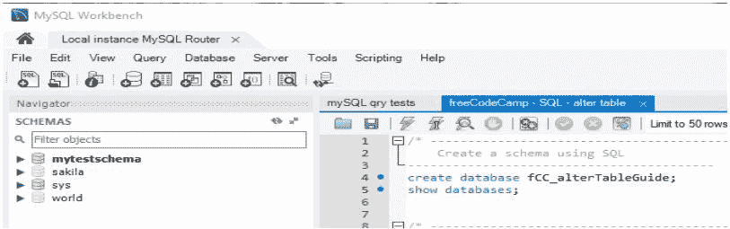
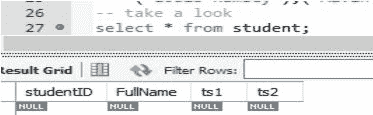
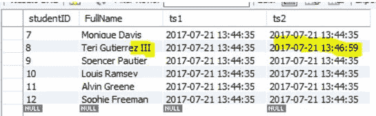
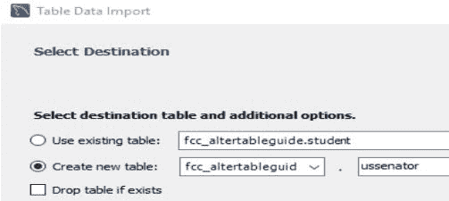
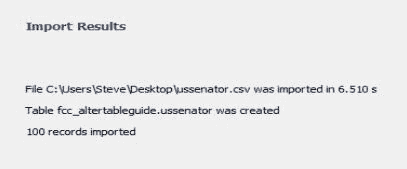

# 用 MySQL 和 Postgres 的语法示例解释 SQL 创建表

> 原文：<https://www.freecodecamp.org/news/sql-create-table-explained-with-mysql-and-postgres-examples/>

表是存储在数据库中的一组数据。

要在数据库中创建一个表，可以使用`CREATE TABLE`语句。您为该表以及包含其数据类型的列列表提供一个名称。

```
CREATE TABLE TABLENAME(Attribute1 Datatype, Attribute2 Datatype,........); 
```

下面是一个创建名为 Person 的表的示例:

```
CREATE TABLE Person(
  Id int not null,
  Name varchar not null,
  DateOfBirth date not null,
  Gender bit not null,
  PRIMARY KEY( Id )
); 
```

在上面的例子中，每个人都有名字、出生日期和性别。Id 列是标识表中一个人的键。您使用关键字`PRIMARY KEY`将一个或多个列配置为主键。

一个列可以是`not null`或`null`，表示它是否是强制的。

## 《创建表命令的 SQL 指南》的更深入的指南

本指南概述了 SQL `CREATE TABLE`函数的基础知识。

我们将在这些 freeCodeCamp SQL 指南中的所有示例中使用 MySQL。MySQL 是一个经常在网站上使用的后端数据库，2)它是免费的，有趣且易于使用。

## 本指南涵盖的内容

*   创建一个模式，所有数据库对象的容器。
*   创建一个表，这样我们就有东西可以修改了。
*   通过导入 CSV 文件并修改表格来创建表格
*   使用 MySQL 工作台工具创建表

我们在 MySQL workbench 脚本工具中使用 SQL 语句来完成大部分工作。我们还将看到如何使用工作台接口而不是 SQL 语句来创建一个表。

## 关系数据库的高层结构

1.  最高级别；数据库；数据库系统安装。在这种情况下，它是 MySQL。在上面的截图中称为“本地实例 MySQL 路由器”。
2.  接下来是一个模式；关系数据库系统中管理数据所需的对象的容器。
3.  我们创建的对象(表、索引、存储过程、函数)来管理系统及其数据

## 创建 MySQL 模式

模式是管理给定主题或流程的数据所需的对象的容器。在本指南中，我们将展示一些示例。

我们将使用 SQL 命令为我们的学习和测试创建模式；

```
create database fCC_alterTableGuide; 
```

在运行此命令之前，此实例化架构结构



## 创建一个表，用"插入"添加测试数据，重命名表(alter)

我们将创建一个学生表。

这些步骤将是:

1.  确保我们还没有桌子
2.  创建表格
3.  插入测试数据。
4.  数据类型:学生姓名是一个字符字段，限制为 90 个字符
5.  学号是一个数字(整数)(范围从-2147483648 到 2147483647)。这将是表的主键，并且在添加记录时会自动递增。
6.  也将有两个“时间戳”字段可供使用

创建语句并显示执行结果。

使用 Select 语句，我们将看到表在那里，但是现在记录已经被添加。



现在插入一些数据，看看我们的新表有记录时是什么样子(并理解创建和更新时间戳)；

第一个时间戳是创建日期和时间，第二个是更新日期和时间。更改记录应该更新 ts2，而不是 ts1。让我们来看看。



## 用 MySql 工作台创建一个表

右键单击要放置新文件的模式下的“Tables”。选择创建表。然后，根据需要填写表格，并单击“应用”

## 将表创建为选择(CTAS)

创建包括数据在内的表副本的一种快速方法是将表创建为 select。

将表 my *表创建为(SELECT * FROM orig*TBL)；

## 通过导入 CSV 文件来创建和填充表格

右键单击要放置新文件的模式下的“Tables”。选择表数据导入。

选择要导入的 CSV 文件，然后单击“下一步”。通常，您会从数据创建一个新表，选择所需的选项，然后单击“下一步”



根据需要调整数据类型，然后单击下一步。

单击“NEXT ”(在此屏幕和显示的下一个屏幕上)将数据导入到表格中，您将看到完成状态，检查并单击“FINISH”



## 其他材料

这个主题有更多的细节，所以安装 MySQL，玩得开心点！