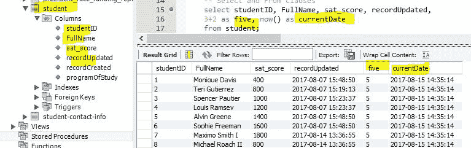
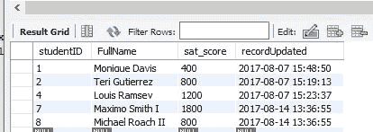
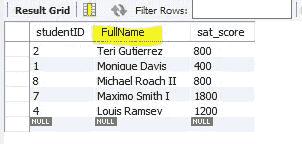
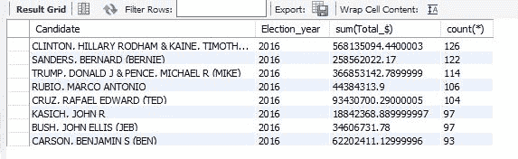

# 亚马逊、苹果、谷歌常见 SQL 面试问题

> 原文：<https://www.freecodecamp.org/news/common-sql-interview-questions/>

SQL 被广泛用于各种编程工作中。如果你即将面试一个软件职位，熟悉 SQL 是很重要的。如果你要去亚马逊、苹果或谷歌等顶级科技公司面试，这一点尤其正确。

本指南将介绍基本的 SQL 语法作为复习，然后列出一些常见的 SQL 面试问题。所有问题的答案都给出了，你可以用这些信息为你的编程面试做准备。

## **基本 SQL 语法示例**

SQL 是一个国际标准(ISO)，但是您会发现不同实现之间存在一些差异。本指南使用 MySQL 作为例子，因为它是最流行的 SQL 实现。

### **如何使用特定的数据库**

以下是用于选择包含 SQL 语句表的数据库的 SQL 命令:

```
USE fcc_sql_guides_database; 
```

### **SELECT and FROM 子句**

使用“选择”来确定要在结果中显示的数据列。还有一些选项可以用来显示不是表列的数据。

以下示例显示了从“student”表中选择的两列，以及两个计算列。计算列的第一列是无意义的数字，另一列是系统日期。

```
SELECT studentID, FullName, 3+2 AS five, now() AS currentDate FROM student; 
```



### **WHERE 子句**

WHERE 子句在获取数据时指定了一个条件。WHERE 子句用于限制返回的行数。它通常用在 SELECT 语句中，但也可以用在其他语句中，如 UPDATE 和 DELETE。

以下是 WHERE 子句的基本语法:

```
SELECT column1, column2
FROM table_name
WHERE [condition]
```

WHERE 子句中的条件可以包括逻辑运算符，如>、

下面是一个使用 WHERE 子句的 SQL 语句示例。它规定，如果任何学生有一定的 SAT 分数(1000，1400)，他们将不会出现:

```
SELECT studentID, FullName, sat_score, recordUpdated
FROM student
WHERE (studentID BETWEEN 1 AND 5
    OR studentID = 8
    OR FullName LIKE '%Maximo%')
    AND sat_score NOT IN (1000, 1400); 
```



### **ORDER BY (ASC，DESC)**

ORDER BY 为我们提供了一种按照 SELECT 部分中的一项或多项对结果集进行排序的方法。

这是和上面一样的列表，但是按照学生的全名排序。默认的排序顺序是升序(ASC ),但是要以相反的顺序(降序)排序，可以使用 DESC，如下例所示:

```
SELECT studentID, FullName, sat_score
FROM student
WHERE (studentID BETWEEN 1 AND 5
    OR studentID = 8
    OR FullName LIKE '%Maximo%')
    AND sat_score NOT IN (1000, 1400)
ORDER BY FullName DESC; 
```



### **分组依据和拥有**

GROUP BY 为我们提供了一种组合行和聚合数据的方法。HAVING 子句类似于上面的 WHERE 子句，只是它作用于分组数据。

下面的 SQL 语句回答了这个问题:“2016 年哪些候选人收到的投稿数量最多(按 count (*)排序)，但只有那些超过 80 个投稿的候选人？”

按照降序(DESC)对该数据集进行排序，将贡献数量最大的候选项放在列表的顶部。

```
SELECT Candidate, Election_year, SUM(Total_$), COUNT(*)
FROM combined_party_data
WHERE Election_year = 2016
GROUP BY Candidate, Election_year
HAVING count(*) > 80
ORDER BY count(*) DESC; 
```



## 常见的 SQL 面试问题

### 什么是 SQL 中的内部连接？

如果没有指定联接，这是默认的联接类型。它返回两个表中至少有一个匹配项的所有行。

```
SELECT * FROM A x JOIN B y ON y.aId = x.Id
```

### 什么是 SQL 中的左连接？

左连接返回左表中的所有行，以及右表中的匹配行。即使右表中没有匹配项，也将返回左表中的行。左表中与右表中不匹配的行将具有右表值的`null`。

```
SELECT * FROM A x LEFT JOIN B y ON y.aId = x.Id
```

### 什么是 SQL 中的右连接？

右连接返回右表中的所有行，以及左表中的匹配行。与左连接相反，这将返回右表中的所有行，即使左表中没有匹配项。右表中与左表不匹配的行将具有左表列的`null`值。

```
SELECT * FROM A x RIGHT JOIN B y ON y.aId = x.Id
```

### **什么是 SQL 中的全连接或全外连接？**

完全外部联接和完全联接是一回事。完全外连接或完全连接返回两个表中的所有行，匹配所有匹配的行，并在不存在匹配行的地方放置空值。

```
SELECT Customers.CustomerName, Orders.OrderID
FROM Customers
FULL OUTER JOIN Orders
ON Customers.CustomerID=Orders.CustomerID
ORDER BY Customers.CustomerName
```

### **以下命令的结果是什么？**

```
DROP VIEW view_name
```

这将导致一个错误，因为您不能对视图执行 DML 操作。DML 操作是操纵数据的任何操作，例如删除、插入、更新和删除。

### 使用 ALTER 命令后，我们可以执行回滚吗？

不会，因为 ALTER 是一个 DDL 命令，而 Oracle server 会在执行 DDL 语句时执行自动提交。DDL 语句定义了数据结构，比如`CREATE table`和`ALTER table`。

### **在列级别实施规则的唯一约束是什么？**

NOT NULL 是在列级别起作用的唯一约束。

### **SQL 中有哪些伪列？举几个例子？**

伪列的行为类似于列，但实际上并不存储在表中，因为它都是生成的值。可以选择伪列的值，但不能插入、更新或删除它们。

```
ROWNUM, ROWID, USER, CURRVAL, NEXTVAL etc.
```

### 创建一个密码为“kmd26pt”的用户“my723acct”。使用 PO8 提供的“用户数据”和临时数据表空间，并在“用户数据”中为该用户提供 10M 的存储空间，在“临时数据”中提供 5M 的存储空间。

```
CREATE USER my723acct IDENTIFIED BY kmd26pt
DEFAULT TABLESPACE user_data
TEMPORARY TABLESPACE temporary_data
QUOTA 10M on user_data QUOTA 5M on temporary_data
```

### **创建角色** *角色 _ 表 _ 视图* **。**

```
CREATE ROLE role_tables_and_views
```

### **授予前一个问题的角色连接数据库的权限和创建表和视图的权限。**

连接到数据库的权限是创建会话创建表的权限是创建表创建视图的权限是创建视图

```
 GRANT CREATE SESSION, CREATE TABLE, CREATE VIEW TO role_tables_and_views
```

### **将问题中的前一个角色授予用户*安妮*和*丽塔*。**

```
 GRANT role_tables_and_views TO anny, rita
```

### **编写一个命令，将用户*丽塔*的密码从“abcd”改为“dfgh”**

```
 ALTER USER rita IDENTIFIED BY dfgh
```

### 用户*丽塔*和*安妮*对*斯科特*创建的表库存没有 SELECT 权限。编写一个命令，允许 *scott* 授予用户对这些表的 SELECT 权限。

```
 GRANT select ON inventory TO rita, anny
```

### **用户** ***丽塔*** **已被转移，不再需要通过角色****role _ tables _ and _ views*授予她的权限。编写一个命令，取消她以前被赋予的特权。她应该还能连接到数据库。*

```
*`REVOKE select ON scott.inventory FROM rita
REVOKE create table, create view FROM rita`*
```

### *被转移的用户*丽塔*现在正转到另一家公司。因为她创建的对象不再被使用，写一个命令删除这个用户和她的所有对象。*

*CASCADE 选项是删除数据库中用户的所有对象所必需的。*

```
*`DROP USER rita CASCADE`*
```

### ***编写一个 SQL 查询，从“Employee”表中找出第 n 个最高的“Salary”。***

```
 *`SELECT TOP 1 Salary
   FROM (
      SELECT DISTINCT TOP N Salary
      FROM Employee
      ORDER BY Salary DESC
      )
    ORDER BY Salary ASC`*
```

## *结论*

*如果你认为你能回答所有这些问题，你可能已经准备好面试了。祝你好运！*