# 成为专业 React 开发人员的 31 个步骤

> 原文：<https://www.freecodecamp.org/news/31-steps-to-become-a-professional-react-developer/>

### 我参加的每一个项目和课程都达到了可雇佣的水平。

在我学习如何编码之前，我曾经问过开发人员他们花了多少时间来学习他们的技术——以及他们是如何做到的。

他们会回答类似于 *1.5 年*、*学士学位*或*我刚刚开始摆弄它*这样的问题——没有一个能真正满足我的好奇心。我想知道他们具体做了多少工作，因为我想知道我自己是否有可能做到这一点(我对此表示怀疑，因为这似乎几乎不可能)。

几年后，我已经从一个业余爱好的程序员转变成了一个专业的 React 开发人员。现在，我想我可以给出我一直在寻找的答案。

> 所以，如果你是一个业余爱好者，想知道成为一个专业的前端开发人员需要付出多大的努力:这篇文章就是为你写的。

然而，我并不是说我的方法是最有效的。我花了很长时间才意识到我想和 React 一起工作，直到我开始了一个编码训练营，我才下定决心要达到一个可雇佣的水平。

如果你正在寻找绝对最快的路线，我将大胆地推荐我们在 React 上的[入门课程，以及我们在 T4 即将推出的高级课程](https://scrimba.com/g/glearnreact?utm_source=freecodecamp.org&utm_medium=referral&utm_campaign=glearnreact_31_steps_article)，因为它们都是以此为目标的。

现在，让我们来看看从我开始学习以来我所完成的所有课程和项目，以及我在学习过程中得到的一些建议。

## 第一阶段:介绍

我把我的学习道路分为三个阶段:**简介**、**爱好**和**训练营**。

我的入门阶段从 2012 年开始，大概持续了两年。进展缓慢，而且都是零星发生的，没有适当的结构或目标。事后看来，我希望我开始时更认真一些，我希望我每天花 30 分钟写代码。这让我想到了给有抱负的开发者的第一条建议:

记住，开始认真对待你的学习越早越好。你未来的自己会为此感谢你的。

### 代码集

和许多其他人一样，我从 Codecademy 开始，完成了他们的四个方向:JavaScript、HTML & CSS、jQuery 和 PHP。这给了我一个编码是什么的心理模型。如果你以前从未写过一行代码，Codecademy 是一个很好的起点。几乎和 Scrimba 一样好；)

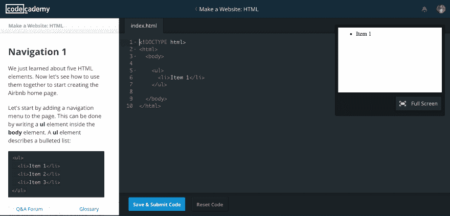

### 儿童应用的交互性

在 Codecademy 之后，我知道如何为我的初创公司开发的几个儿童书籍应用程序进行简单的交互。它由简单的网络动画组成:点击某处，图像淡入淡出，同时触发声音。

### 30 天学习 jQuery

快进到 2013 年底。我在 [TutsPlus](http://tutsplus.com/) 做了 [30 天学习 jQuery 课程](http://code.tutsplus.com/courses/30-days-to-learn-jquery)由 [Jeffrey Way](https://twitter.com/jeffrey_way) 做，是一个优秀的导师。他带你经历了很多有趣的小项目。

如果你想学习如何创建交互式网站，我建议你从 jQuery 开始，而不是普通的 JavaScript，因为它更容易学习。

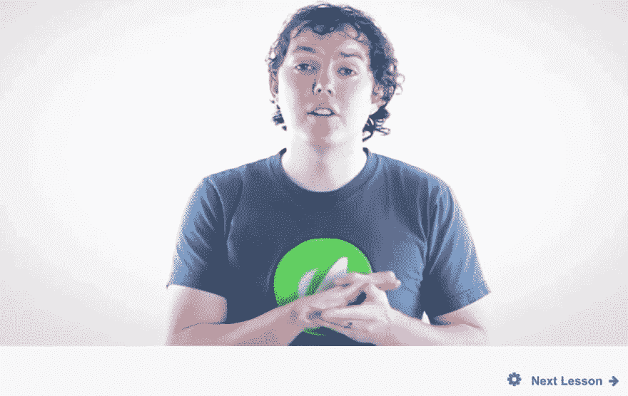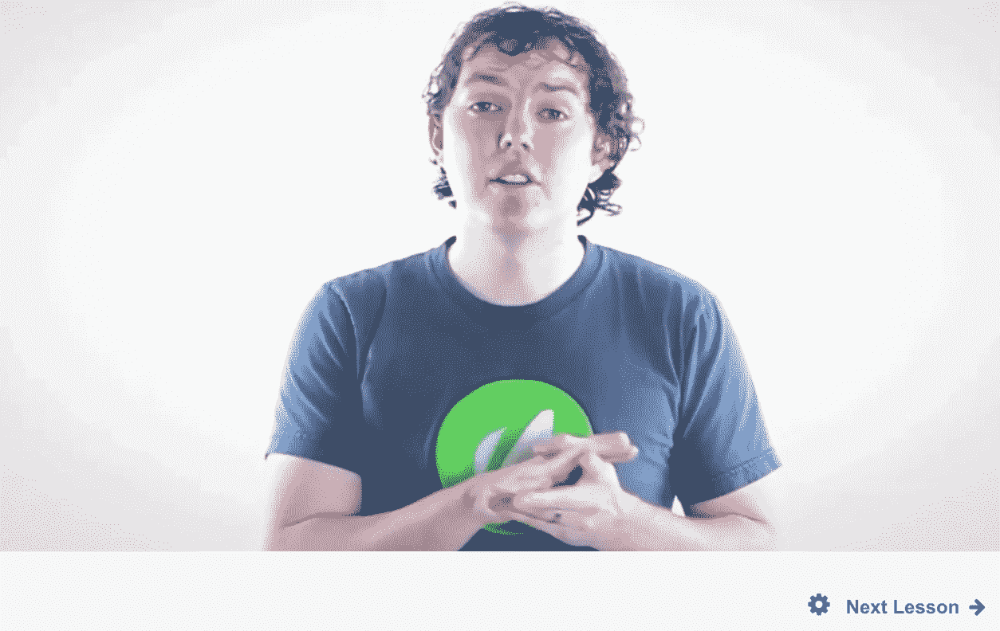

## 第二阶段:爱好

除了 TutsPlus 课程，2013 年我几乎没做什么编码，因为我把所有时间都花在了创业上。此外，我真的不相信我能成为一名专业开发人员。

然而，在 2014 年初发现 Udacity 后，我又重新开始了。这一次我更认真了，并设定了每天至少自学一小时的目标。

我发现基于过程的目标比基于结果的目标更有效。感觉没那么势不可挡，结果总是自动来的。

### Udacity —计算机科学导论

由 [Dave Evans](https://twitter.com/udacitydave?lang=no) 制作的关于  的 CS101 课程是对计算机科学和 Python 的一个很好的介绍。这是我学习数据类型、函数、条件和其他东西的地方，尽管我只完成了 80%。老实说，我从来没有完成过一门 MOOC，因为我一觉得无聊就退出了。

不要为退出一门课程感到难过——你已经不在学校了。意识到无聊，因为它对你的动力有害。

### Udacity —网络开发

我跟进了由 Reddit 联合创始人史蒂夫·霍夫曼(Steve Huffman)创建的 CS253。它会带你建立一个博客，这是 CS101 之后自然的下一步。

### 简单的 Javascript 游戏

2014 年初的某个时候，我开始对创建 JavaScript 游戏感兴趣。我从本教程的[开始，它将带你创建一个非常简单的 JS 游戏，你可以用箭头键控制一个角色来抓地精。](http://www.lostdecadegames.com/how-to-make-a-simple-html5-canvas-game/)

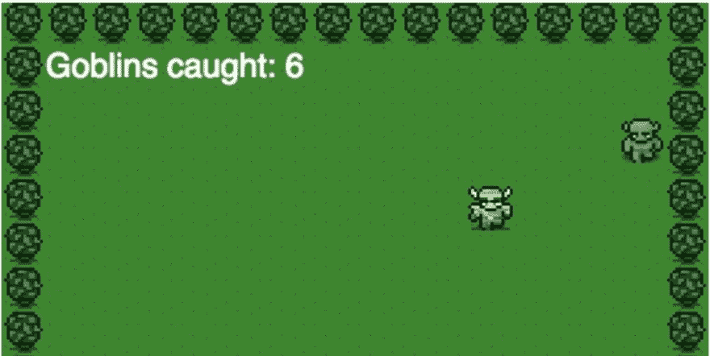

### JavaScript 中的扫雷

我继续玩经典的扫雷游戏，如本教程[所述。这很难，我记得当时有点被这种逻辑所淹没。虽然我喜欢坚持到底，不管总是不明白发生了什么(我在这里](https://www.youtube.com/watch?v=fqzaxdiRZS4)写了更多关于[)。](https://medium.com/learning-new-stuff/a-simple-technique-to-learn-hard-stuff-ffaa7879bf7c#.rpwbp18ai)

### JavaScript 中的 Snake

在某个时候，我还创造了一个贪吃蛇游戏。我不记得我具体遵循了哪个教程，但它可能是下面的那个。

### jQuery 游戏——为孩子购物

在 2014 年复活节期间，我为一款面向儿童的教育应用制作了一个演示，因为我们的初创公司收到了一家公司的请求，该公司打算将他们的 Flash 游戏转换成 HTML5。虽然我们没有接受这份工作，但我想知道我是否有足够的编码技能来做一份理论上可以获得报酬的工作。

令人惊讶的是，你只需要很少的知识就可以开始在你的编码技能上赚一点钱。试着尽快到达这一点。

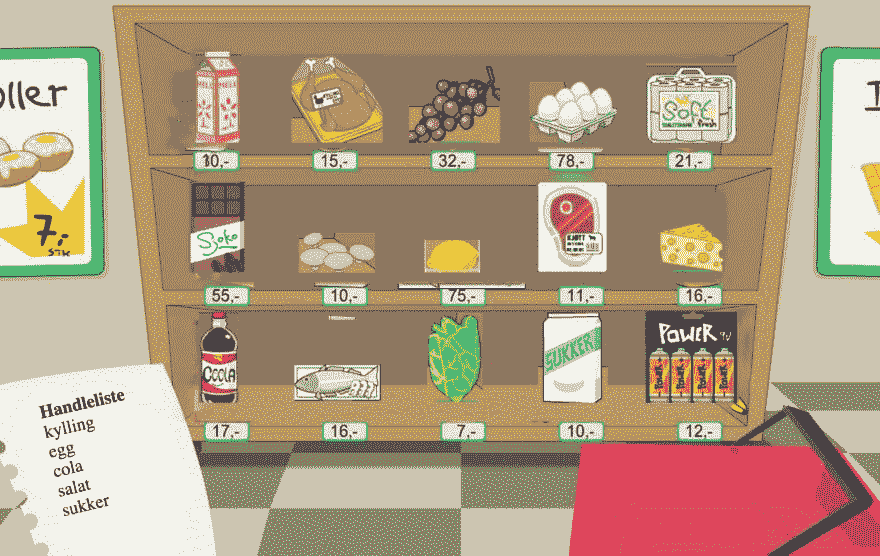

### udemy——为企业家编码

在初夏，我做了由撰写的[优秀的企业家编程教程](https://www.codingforentrepreneurs.com/)。这是一门完全基于项目的课程，遵循*边做边学*的方法。这是对 Django Python 框架的很好的介绍。

虽然 Udacity 课程将为您提供 CS 概念的基础，但本课程将使您能够实际运用您的技能。结合这些类型的课程是至关重要的。

### Fam 之家网站

作为一名开发人员，我的第一份有偿工作是为一名挪威时装设计师编写一个简单的[网站](http://houseoffam.no/)(由我的联合创始人设计)。这是一种很棒的感觉，因为你最终会因为做你的爱好而得到回报，因为你意识到你可以为进一步发展你的技能提供资金，尽管与我们投入的时间相比，我们赚的钱微不足道。

不要担心你第一份工作的时薪低于最低工资。这仍然比你上一个项目的报酬高得多。

### 迪斯科手指网站

我还为我们的音乐创作应用[迪斯科手指](https://itunes.apple.com/us/app/disco-fingers/id809680953?mt=8)制作了一个简单的[登陆页面](http://discofingers.com/)，这是我们的初创公司在 2014 年末推出的。

### 迪斯科手指顶级歌曲爬虫

在推出 Disco Fingers 之后，我写了一个 Python 脚本，抓取了我们内部的 Disco Fingers 节拍列表，并在推特上发布了一个链接，指向每天最流行的节拍。这教会了我很多关于 API、cron jobs 和 scraping 的知识。

创建一个节省时间的脚本让你感觉更有力量。我建议你试试这个。

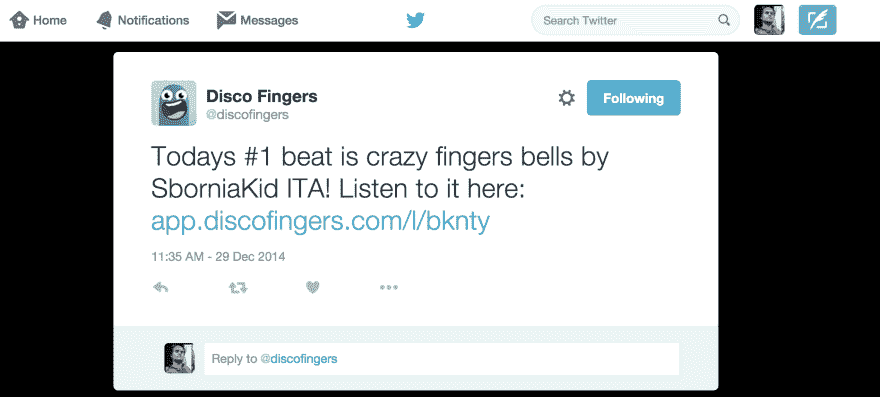

### Udacity —监督学习(ML)

2014 年底，我开始迷上机器学习，于是上了几堂这门课。如果你对获得什么是机器学习的心智模型感兴趣，我会推荐它。但是它不涉及任何编码，这有点令人失望。

### CoderByte 挑战

为了提高我的基本技能(你可以[在这里](https://medium.com/learning-new-stuff/how-to-choose-the-right-coding-bootcamp-364efd35a63c#.l6q5wm6yn)了解更多)，我在 [CoderByte](https://coderbyte.com/) 上解决了很多挑战。

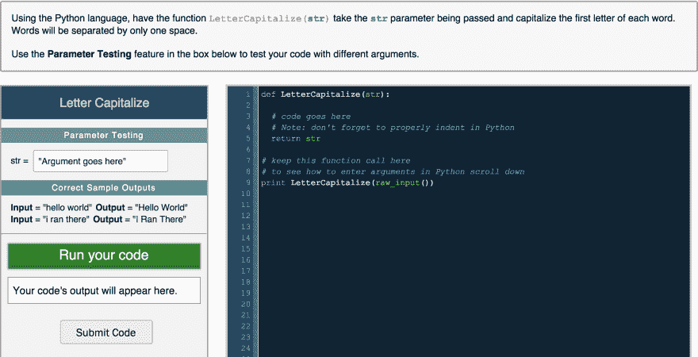

### JavaScript 中的井字游戏

我还构建了一个井字游戏，作为各种编码训练营应用程序的一部分。

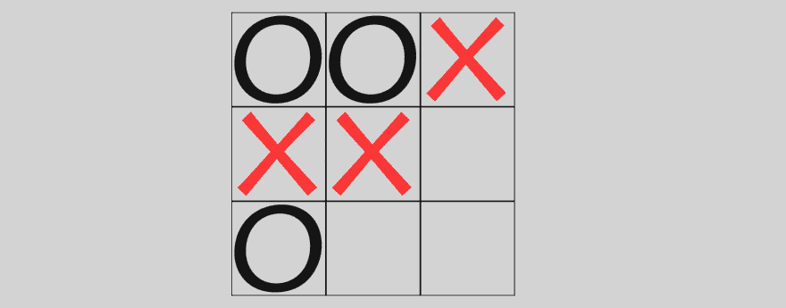

## 第三阶段:训练营

在这个时间点上，我已经足够好去创建简单的脚本，并且知道如何部署一个 Django 网站，如果我遵循企业家的编码公式的话。但我仍然远远不能承担一份开发人员的工作。在我们的创业失败后，这成了我的目标，所以我[申请了一堆编码训练营](https://medium.com/learning-new-stuff/how-to-choose-the-right-coding-bootcamp-364efd35a63c#.jaolouyk9)，最后选择了伦敦的[创始人和编码员](http://www.foundersandcoders.com/) (FAC)。

FAC 是围绕每周项目建立的。建立这些项目需要阅读大量的教程和参加小型在线课程——这些我都不记得了。因此，除了作业之外，我转而链接到 GitHub repos。我还记下了我们从每项任务中获得的技能。

### 第 1 周:团队博客

使用 Github 页面的基本博客。源代码可以在这个[回购](https://github.com/foundry-matrix/fmblog)，和[分配这里](http://fac4.foundersandcoders.org/content/week1/assignment.html)获得。技能:GitHub 页面，CSS，jQuery，Jekyll。

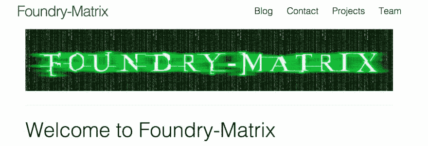

### 第二周:卫报宣传短片

从 Guardian API 获取内容的网站。这个[回购](https://github.com/foundry-matrix/The-Guardian)中的源代码，以及这里的[赋值](http://fac4.foundersandcoders.org/content/week2/assignment.html)。技能:Web APIs，Ajax，JSON。

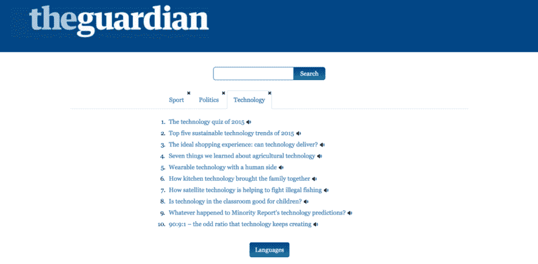

### 第三周:附近的东西

显示附近推文的社交墙。[转让](http://fac4.foundersandcoders.org/content/week3/assignment.html) & [回购](https://github.com/foundry-matrix/socialfeed)。技能:服务器，Node.js。

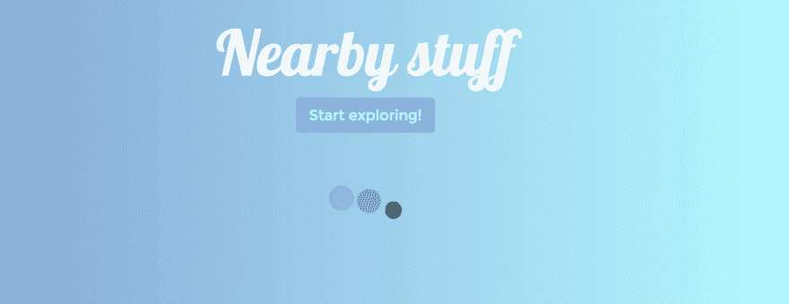

### 第四周:Instagram & Twitter 搜索

一个可以搜索推文和 Instagram 帖子的应用程序。[回购](https://github.com/foundry-matrix/InstagramFeed)T4[转让](http://fac4.foundersandcoders.org/content/week4/assignment.html)。技能:Heroku，MongoDB。

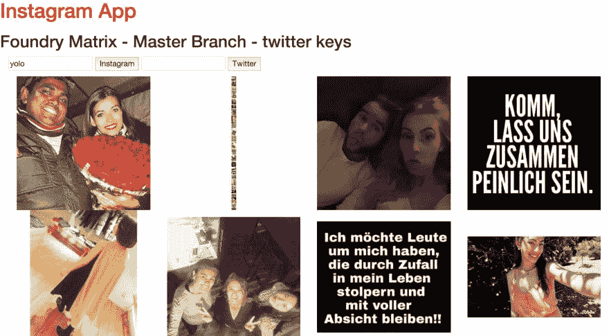

### 第五周:D3 推文可视化

这是 FAC 上的 D3.js 周。我们尝试了如何创建可视化。[转让](http://fac4.foundersandcoders.org/content/week5/introduction.html) & [回购](https://github.com/foundry-matrix/StopGoContinue)。

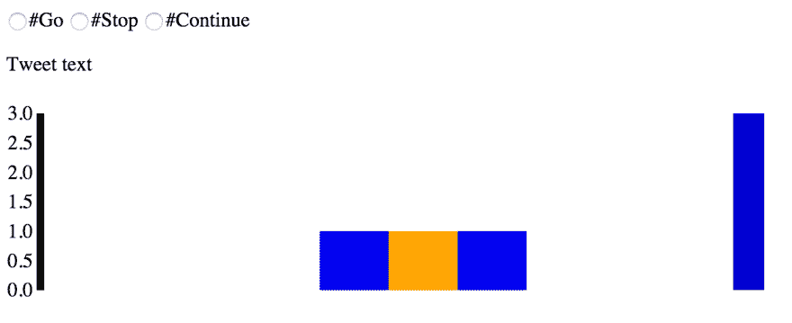

### 第六周:笔记应用

我们对 React.js 的第一次介绍，我立刻喜欢上了使用它。[转让](http://fac4.foundersandcoders.org/content/week6/tuesday.html) & [回购](https://github.com/foundry-matrix/NoteTakingApp)

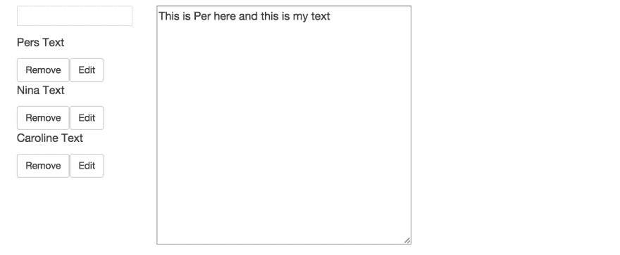

### 第 7 周:博客 1.0

一个简单的认证博客。技能:服务器端渲染，cookies。[转让](http://fac4.foundersandcoders.org/content/week7/assignment.html) & [回购](https://github.com/foundry-matrix/ServerBlog)。

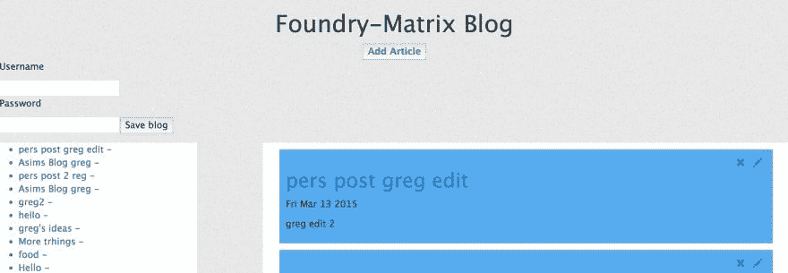

### 第八周:博客 2.0

这次我们增加了更多的认证方法，例如 Twitter、脸书和电子邮件注册，并使用了 Hapi.js 框架。[转让](http://fac4.foundersandcoders.org/content/week8/assignment.html) & [回购](https://github.com/foundry-matrix/hapi_blog)。技能:Hapi.js

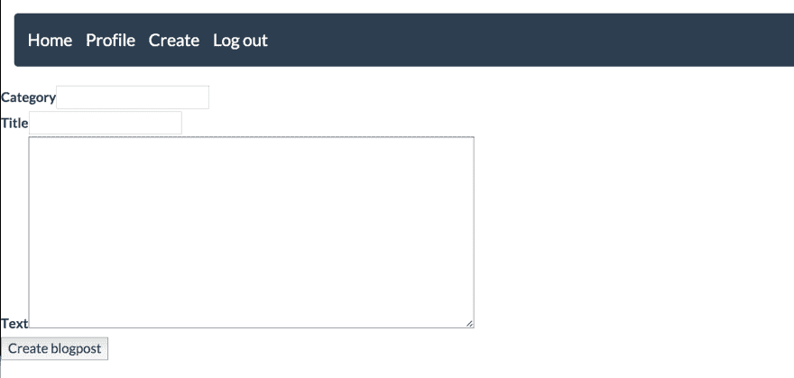

### 第九周:关键词王

在第九周，我们可以建造任何我们想要的东西。我们的团队建立了一个网站，可以分析你的应用商店关键词，并告诉你哪些是没有价值的。[回购来了。](https://github.com/foundry-matrix/CrapWords)技能:jQuery，Heroku，APIs。

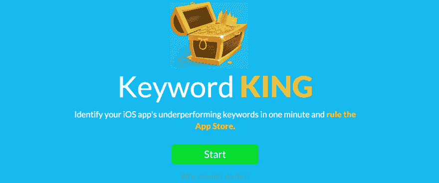

### Sir 预测值

在第十周，我们开始为客户做项目，赚了一点钱。我们的第一个是 Tinder 'ish 新闻预测应用的原型。[回购](https://github.com/the-knights-of-the-reactangular-table/sir_predictalot/tree/development)。

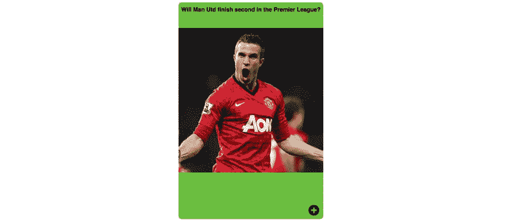

### 儿童拼图

一个基于挪威儿童丛书巨魔奥拉夫的儿童益智游戏。[回购](https://github.com/Troll-Olav/Puzzle)

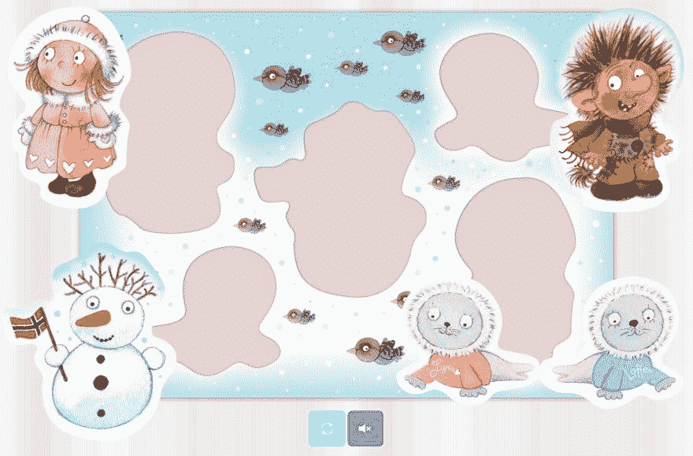

### RateMyStuff

基于图像评级的社交网络。(不幸的是，我没有这张照片的图像。)[回购](https://github.com/people-under-the-stairs/midnight-marauders)

### 挤压

帮助学生重复和记忆所学内容的工具。[回购](https://github.com/pajoa/pajoa-the-chimp)

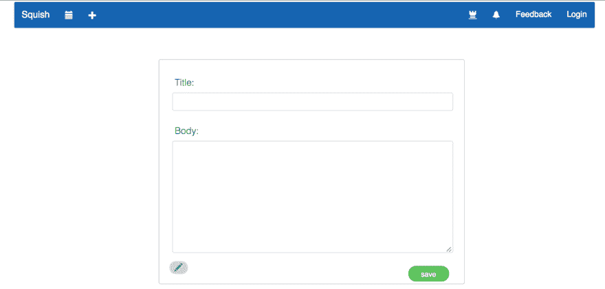

### Coursera —机器学习简介

在 FAC 的某个时候，我开始上这门课。像往常一样，我没有完成它，但仍然学到了很多。

### 机器学习周

我还做了一个为期一周的机器学习特技，我试图尽可能多地学习 ML。这涉及到一系列的教程和反复试验，你可以在这篇文章中读到更多。

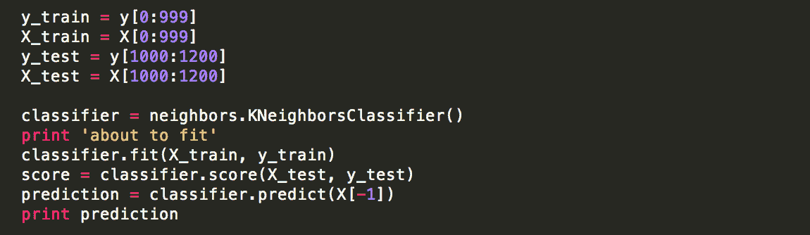

### 找工作

FAC 结束后，我搬回家，大约一个月后，我在 Xeneta 找到了一份 React 开发人员的工作，在那里我工作了一年多。我希望这篇文章能帮助您了解成为一名开发人员需要做多少工作。

如果你想成为一名 React 开发人员，我强烈建议你学习我们的课程。从免费的[Learn React](https://scrimba.com/g/glearnreact?utm_source=freecodecamp.org&utm_medium=referral&utm_campaign=glearnreact_31_steps_article)课程开始，然后报名参加我们即将推出的高级 React 课程的[等候名单](https://scrimba.com/g/greact?utm_source=freecodecamp.org&utm_medium=referral&utm_campaign=greact_31_steps_article)。

祝你好运:)