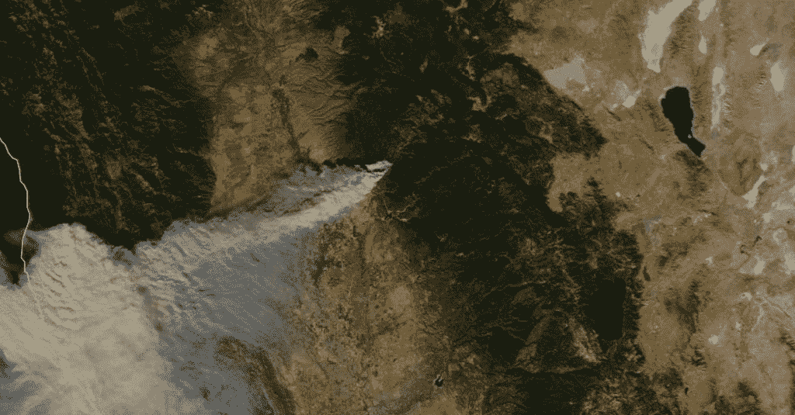
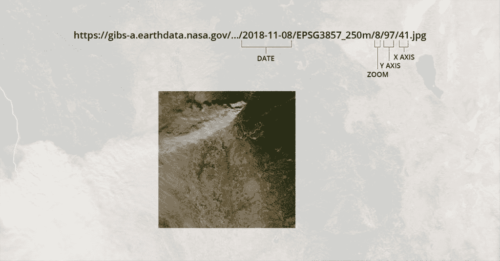
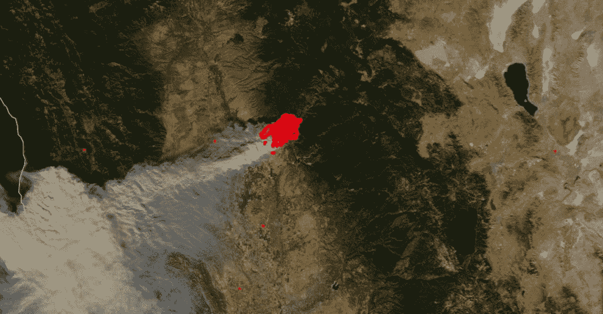
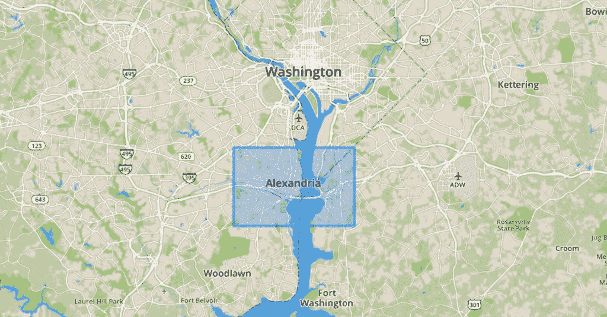
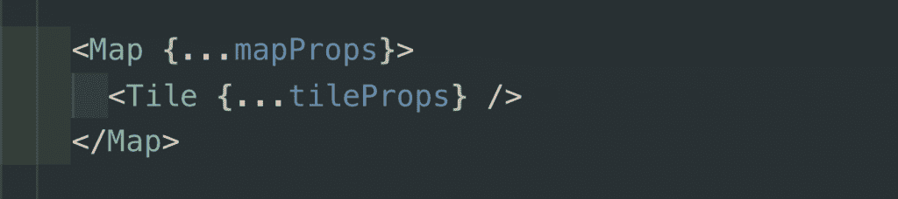
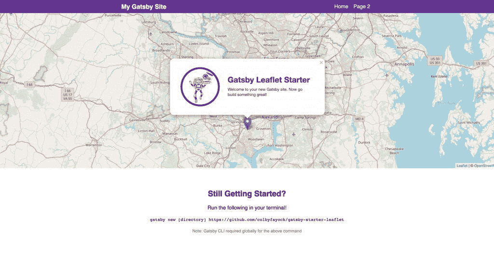

# 如何使用传单在 React the easy way 中构建地图应用程序

> 原文：<https://www.freecodecamp.org/news/easily-spin-up-a-mapping-app-in-react-with-leaflet/>

绘制地图很难，但是开发一个新的应用程序来绘制地图并不困难。以下是如何在新的 React 应用程序中轻松开始使用地图的方法。

# 不是你车座下的 AAA 地图

地图已经存在了几千年，但在过去的几十年里，由于计算机的存在，地图变得更加复杂和强大。这使得我们每天都在使用的产品得以诞生，比如帮助我们下班回家、避开交通拥堵的谷歌地图，或者让我们查看实时雷达图像的天气地图。更进一步，科学家们每天都使用地图，利用来自卫星图像的数据，试图更好地了解我们这个不起眼的星球。

这听起来很难…

# 建筑地图

剧情转折，不难！

*Final Space — What a twist!*

至少入门并不难。令人欣慰的是，最难的部分已经内置到可以用 JavaScript 轻松利用的库中。

进入传单…

# 映射库

现在在地图空间有一些库(像 [OpenLayers](https://openlayers.org/) ，但是我们喜欢[传单](https://leafletjs.com/)。

要开始使用传单，首先在你的页面上包括图书馆的资源。接下来，使用一些基本设置将应用程序挂载到 DOM 中的根元素上。你可以把它想象成 React 是如何挂载到一个 DOM 节点的，但是 Leaflet 本身并不使用 React。一旦初始化，传单允许您开始利用它的 API 来投影底图，添加图层，这些图层上的切片，甚至开始在其上绘图。

### 底图？层次？瓷砖？

为了得到基本的要点，想象一个蛋糕。传统上，蛋糕有不同的层，一些在底部，一些在顶部，一些可能只是用糖衣覆盖一面。地图图层的功能类似。底层是您的基础，是您的“底图”。下面，我们在美国宇航局的 [MODIS Aqua](https://terra.nasa.gov/about/terra-instruments/modis) 卫星图像上看到了 2018 年加州野火的快照。

*MODIS Aqua – California “Campfire” Wildfires*

现在，要获得底图，我们需要影像来生成它，这就是切片的用武之地。单幅图块是构成代表图层的单幅图块组的单个图像块。

*MODIS Aqua single tile and URI scheme – [Tile Link](https://gibs-a.earthdata.nasa.gov/wmts/epsg3857/best/MODIS_Aqua_CorrectedReflectance_TrueColor/default/2018-11-08/EPSG3857_250m/8/97/41.jpg)*

您的切片实际上只是一个简单的图像，但与其他图像一起，通过地理位置和缩放级别进行协调，构成了您在查看如上所示的底图这样的 web 地图时所看到的内容。包含这些较小的单个片段而不是一幅巨大的图像的目标是，在处理整个地球、不同的缩放级别以及超出此范围的可用分辨率之间，我们谈论的是数十亿字节的图像资产，这些资产作为一个整体是不可靠或不现实的。

建立底图后，您可以使用更多影像、矢量切片或转换为图层的数据点来叠加其他图层。在下面的截图中，我们放大了底图的最高分辨率。请注意，左边的图像是来自[数字地球](http://blog.digitalglobe.com/news/open-data-response-for-the-california-wildfires/)的一个单独的覆盖图块，它为我们提供了火灾区域周围部分区域的更高分辨率。

*MODIS Aqua with tile overlay from Digital Globe*

另一个例子是增加从美国宇航局的图像中收集的代表火灾的点。

*MODIS Aqua with VIIRS fire datapoint layer*

这使我们能够获得底图的上下文，并能够转换任何类型的数据，以便更好地了解其效果。

除了 VIIRS 数据之外，还有许多由政府和市政当局发布的影像、矢量切片和数据集来源，您可以使用它们来帮助构建有趣的地图和数据可视化。NASA 是这些类型资产的一个很好的来源，但是许多商业提供商发布[开放访问灾难数据集](https://www.digitalglobe.com/ecosystem/open-data)，帮助其他人围绕救援工作建立解决方案。

### 画画是怎么回事？

通常当人们使用地图时，他们希望查看感兴趣的点。绘图使我们能够用不同的绘图工具来框出感兴趣的区域，例如使用边界框工具创建矩形或绘制圆形。这些都是简单的形状，但这些形状代表了一个地理空间，可用于收集该区域的数据。

*Rectangular bounding box around Alexandria, VA*

# 反应堆

传单本身给了你很多工作，但是仍然伴随着大量的手工工作。如果你习惯于构建一个 React 应用，你可能不习惯于只使用基于浏览器窗口的 API 来构建整个 UI，这就是 [React 传单](https://react-leaflet.js.org/)的亮点。

React Leaflet 是一个 React 库，它将地图建筑打包成直观的组件，表示地图的这些部分。考虑到上述情况，我们讨论了底图和图层，您可能会看到它大致如下:

Pseudo map component code

虽然你可能会期望它没有 **像** 那样灵活，因为直接利用传单 API，这完全打开了一个人的世界，能够轻松地以直观的方式建立简单的地图解决方案，而不需要所有的努力。毕竟，在这一点上，你正在旋转一个你可能已经熟悉的 React 应用程序。

# 和盖茨比更进一步

你说，你想轻松点？你说，你要我为你绘制地图？嗯，你很幸运！首先，我们简单介绍一下另一个工具。

对于不熟悉的人来说， [Gatsby](https://www.gatsbyjs.org/) 是一个 javascript 框架，它允许开发人员在几分钟内轻松构建完整的、完全工作的 React 应用程序。他们已经准备好了所有的螺母和螺栓，并让您做您最擅长的事情:专注于应用程序的重要部分。

Gatsby 的美妙之处在于它支持默认安装的扩展，他们称之为 **启动器** 。有什么比创造一个盖茨比启动器更容易让人们旋转地图的方法呢？

# 盖茨比入门传单

结合盖茨比简介的简易性和传单的灵活性，我们有[盖茨比简介传单](https://github.com/colbyfayock/gatsby-starter-leaflet)。这个简单的工具可以让你在几秒钟内(或几分钟，取决于你的电脑)搭建一个新的 React 应用程序，同时运行 React 传单。

*Starting page for Gatsby Starter Leaflet*

通过[几个基本的命令](https://github.com/colbyfayock/gatsby-starter-leaflet)，包括安装你的依赖项，你就有了一个应用程序，你可以在它的基础上开始创建拯救世界的地图。更好的是，它包括一些现成的集成，如 [OpenStreetMap](https://www.openstreetmap.org/) 和一个易于设置的地图服务配置到基础 React 传单组件 API，允许您轻松获得产品，并具有更大的灵活性来创建更智能的地图应用程序。

# 肯定有不好的一面…

没有哪个库或框架不是没有缺点的。您的地图应用程序越复杂，遇到的棘手问题就越多。以下是我们的一些经验，可能会帮助你适应。

*Bob Kelso — Scrubs*

# 传单——从窗口反应过来

尝试管理传单地图和 React 组件之间的状态和生命周期可能会很棘手。试图使用 props 不断地维护和更新您的组件将会立即开始在陈旧的地图状态或内存泄漏之间产生问题，这是因为当组件卸载时地图没有正确地卸载。

****建议:**** 用 React 挂载你的地图，用原生传单 API 与之互动。一旦你的地图被渲染并稳定下来，你就可以使用传单让你的用户在世界各地飞行，并在你的地图上绘制，而不会遇到多个组件渲染的状态问题。

# 公共磁贴的有限使用

虽然有一些切片服务可以让您轻松地插入并创建底图，但并非所有这些服务实际上都被大量使用。以 OpenStreetMap 为例，虽然您可以在他们的公共端点上玩游戏和开发基本的解决方案，但如果没有维护他们服务器的人的明确许可，大量的使用将会受到限制并可能被阻止。

****忠告**** :当你刚开始四处游玩时，你不必太担心。最坏的情况下，地图下载会有点慢。随着你的应用程序开始获得更多的流量，你会希望看到[开发你自己的切片服务](https://github.com/Overv/openstreetmap-tile-server)或者购买一个现成的解决方案，比如 [Mapbox](https://www.mapbox.com/) 。

# 获取映射！

构建基于地图的 web 应用程序从未如此简单。有足够的工具、文档和公共数据可以帮助你在建立一个博客或静态网站的时间内开始构建地图来探索我们的世界。你还在等什么？

Go explore with Dora!

*   [？在 Twitter 上关注我](https://twitter.com/colbyfayock)
*   [？️订阅我的 Youtube](https://youtube.com/colbyfayock)
*   [✉️注册我的简讯](https://www.colbyfayock.com/newsletter/)

*最初发布于[https://www . element 84 . com/blog/mapping-with-leaflet-and-react](https://www.element84.com/blog/mapping-with-leaflet-and-react)*