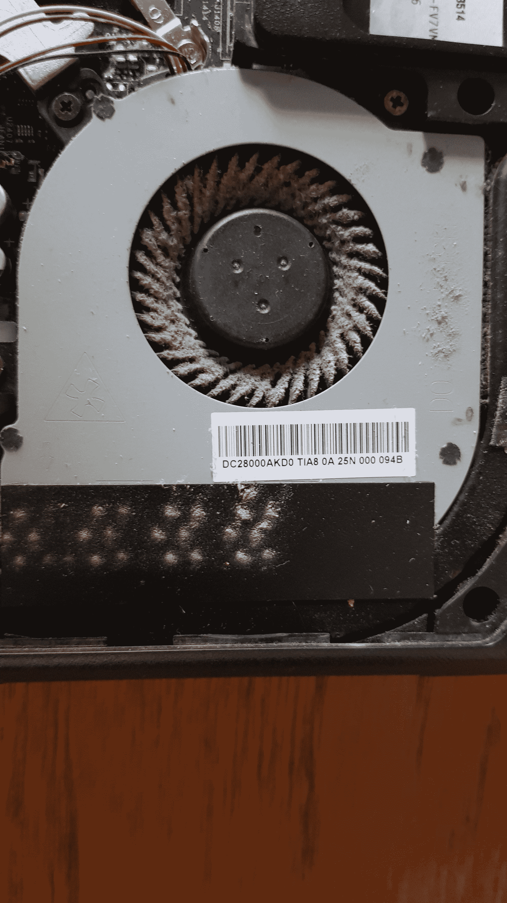
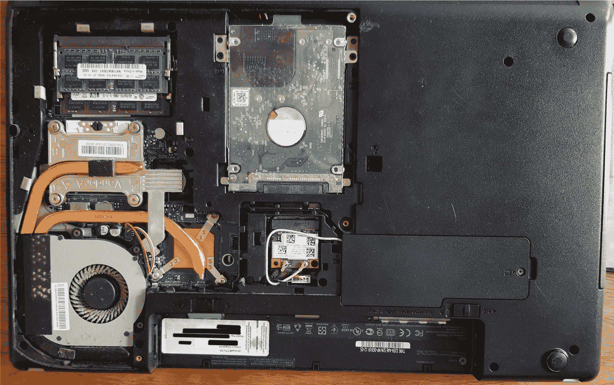
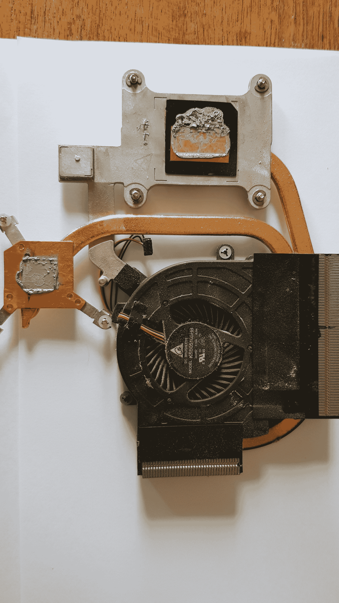
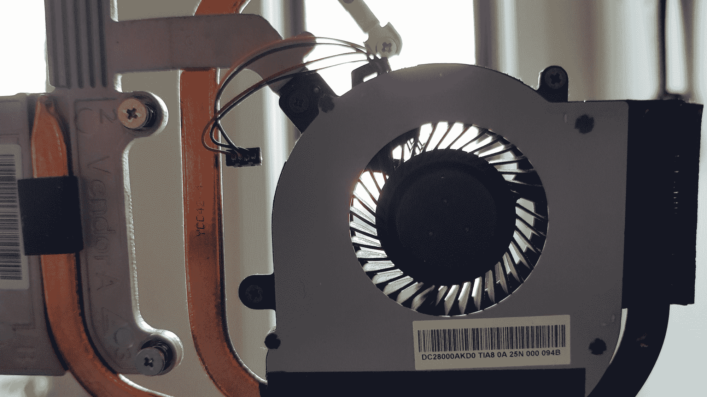

# 如何加速你的旧笔记本电脑-使用你家里的东西

> 原文：<https://www.freecodecamp.org/news/speed-up-old-laptop/>

我为我的笔记本电脑感到非常自豪。它大约有 7 年的历史，但在其全盛时期配备非常好，配有酷睿 i7 处理器和 6GB RAM，对于我使用它的所有事情来说都非常出色。它也经受住了多次撞击和跌落——我非常确定它是防弹的。

最近，每当我试图打开几个 Chrome 标签、VSCode 和 Slack 应用程序时，它就陷入停顿——你知道，*开发者一直打开的所有东西*！

我检查了我的机器的内存和 CPU 的使用情况，一切正常。尽管这些应用程序是出了名的资源密集型，一个像样的 CPU 和适量的 RAM 应该已经足够了。

然而，还有一个问题一直困扰着我。边上的 VGA 端口会变得很热，以至于当我心不在焉地把手指放在上面时，它们会被轻微烫伤。

我的 CPU 过热了——为了安全起见，我的电脑会自动调节以免崩溃。果然，当我在我的机器上安装了一些传感器命令行实用程序来检查温度时，它报告温度很高，危险地接近临界温度:

```
coretemp-isa-0000
Adapter: ISA adapter
Package id 0:  +95.0°C  (high = +87.0°C, crit = +105.0°C)
Core 0:        +95.0°C  (high = +87.0°C, crit = +105.0°C)
Core 1:        +98.0°C  (high = +87.0°C, crit = +105.0°C)
Core 2:        +92.0°C  (high = +87.0°C, crit = +105.0°C)
Core 3:        +91.0°C  (high = +87.0°C, crit = +105.0°C) 
```

我要坦白:在拥有这台心爱的笔记本电脑的 7 年里，我从来没有清理过它！



Your laptop fan is the real MVP, treat it well.

果然，当我打开笔记本电脑外壳时，问题很明显——7 年积累的灰尘堵塞了风扇。

那么，如何提高旧笔记本电脑的速度呢？打扫干净！

## 你将需要

*   打开你的笔记本电脑的工具(在我的情况下只是一个 Phillips Head Jewelers 螺丝刀)；
*   清洁酒精(我用的是甲基化酒精)；
*   干净的小刷子；和/或
*   一罐压缩空气；
*   可选:热敏贴(好吧——你家里可能没有这种东西，但它很便宜)

## 方法

基本原理很简单——你的 CPU 过热是因为你的散热片和风扇散热不够快。

我们将做两件事-清洁风扇，并应用新的热粘贴到您的 CPU，以改善传热。

由于每个笔记本电脑品牌和型号的构造都不一样，你需要参考制造商的安全拆卸说明。或者，寻找适合您的确切品牌和型号的视频。这篇文章中的图片和精确的方法与我自己的 ThinkPad E530 有关。

警告:如果你不确定你在做什么，考虑让专业人士来维修你的笔记本电脑。继续进行你自己的风险-我们不负责你油炸你的笔记本电脑或电死自己！

### 第一步

将笔记本电脑从电源上拔下，取出电池，按住电源按钮约 5 秒钟以释放残余电量。

### 第二步

卸下装有 CPU、散热器和风扇的外壳。请参阅您的制造商说明。



The inside of a ThinkPad E530

### 第三步

拧开需要维修的部件。在我的情况下，这意味着拧开散热器和风扇。请记住通过拉动或撬动塑料连接器来轻轻拔下风扇插头，不要拉扯电线。

### 第四步

清除 CPU 和散热器上的旧导热膏(以及其他任何以前用过的地方——比如我的 GPU)。我分两个阶段来做——轻轻刮去粘合区域的干膏，然后用无绒布上的清洁酒精去除剩余部分。在下图中，散热器上那些灰色的粘稠部分是旧的导热膏。



The ThinkPad E530 heat sink and fan unit

### 第五步

用刷子清除笔记本电脑外壳内任何可见的灰尘。用刷子彻底清洁风扇，并用压缩空气将灰尘吹出通风口。确保您没有将灰尘吹回到打开的笔记本电脑机箱中！



As good as new!

### 步骤 6(可选)

将导热膏涂在处理器上(必要时也涂在其他部件上)。少量就足够了。我强烈建议阅读你的热贴制造商在网上提供的详细说明。我用的是[北极银 5 品牌](https://www.amazon.com/Arctic-Silver-AS5-3-5G-Thermal-Paste/dp/B0087X728K)。

### 第七步

全部装回去，记得把风扇插回去(表白:我忘了！)

## 结果

当我打开笔记本电脑时，感觉更快了。快速的传感器检查证实，为了我可怜的笔记本电脑，这一点点努力是值得的:

```
coretemp-isa-0000
Adapter: ISA adapter
Package id 0:  +45.0°C  (high = +87.0°C, crit = +105.0°C)
Core 0:        +45.0°C  (high = +87.0°C, crit = +105.0°C)
Core 1:        +38.0°C  (high = +87.0°C, crit = +105.0°C)
Core 2:        +43.0°C  (high = +87.0°C, crit = +105.0°C)
Core 3:        +40.0°C  (high = +87.0°C, crit = +105.0°C) 
```

VGA 口再也不烧了！

* * *

如果你喜欢这篇文章，并避免向你的 CPU 敬酒，请在 Twitter 上关注 [@JacksonBates](https://twitter.com/JacksonBates) 以获得更多非正式的技术相关漫谈。