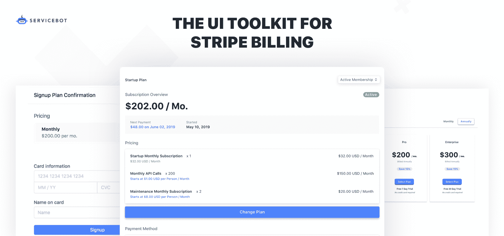

# 如何使用 Node.js 构建出色的条带集成:4 个最佳实践和示例

> 原文：<https://www.freecodecamp.org/news/stripe-and-node-js-4-best-practices-and-examples/>

你有没有半夜醒来，担心自己没有正确使用 Stripe npm 模块？可能不会，但是本文将通过一些交互式 Node.js 示例解释如何构建一个优秀的 Stripe 集成，帮助您放松困扰的心灵。

## 1.使用自动分页来避免代码膨胀

分页是一个必要的缺点，它可以避免我们加载太多的数据，但是在代码中处理它可能是一件痛苦的事情。在“v6.11.0”之前，您的条带代码将类似于这样来处理分页:

#### 这个例子展示了在 Stripe 中处理分页的老方法

```
//require Stripe's Node bindings
const stripe = require("stripe")("rk_test_72wdhn7pifTOWbrtrSNFxhsQ00NrdzPvaC")

//get first 100 invoices
let invoices = await stripe.invoices.list({limit: 100});
let numberProcessed = 0;

//loop through these invoices
for(let invoice of invoices.data){
    numberProcessed++;
}

//has_more indicates if we need to deal with pagination
while(invoices.has_more){

    //starting_after will be the the id of the last result
    invoices = await stripe.invoices.list({limit: 100, starting_after: invoices.data[invoices.data.length -1].id});

    //loop through the next 100
    for(let invoice of invoices.data){
        numberProcessed++;
    }
    console.log("Number processed so far: " + numberProcessed);
}
console.log("Total Number Processed: " + numberProcessed);

```

随着“v6.11.0”中自动分页的引入，我们现在能够有一种更加高效的分页方式:

#### 这个例子展示了如何在 Stripe 中自动分页

```
//require Stripe's Node bindings
const stripe = require("stripe")("rk_test_72wdhn7pifTOWbrtrSNFxhsQ00NrdzPvaC")

//get all invoices
const allInvoices = await stripe.invoices.list({limit: 100}).autoPagingToArray({limit: 10000});
console.log("Invoices - " + allInvoices.length);

```

> 注意:为此，您需要运行 Node.js v10 或更高版本。

## 2.使用 expand 减少 API 调用的数量

在 Stripe 中，有许多不同的对象。很多时候，当处理一种类型的对象时，比如说订阅；您希望获得订阅所属的产品。要获得产品，您需要额外调用 Stripe，如下所示:

#### 此示例显示了如何在不使用 expand 的情况下从条带订阅中获取产品

```
//require Stripe's Node bindings
const stripe = require("stripe")("rk_test_3U9s3aPLquPOczvc4FVRQKdo00AhMZlMIE")

const subscription = await stripe.subscriptions.retrieve("sub_G0zK9485afDl6O");
const product = await stripe.products.retrieve(subscription.plan.product);
console.log(product.name);

```

我们可以通过使用 Stripe 的 API 中的[“expand”属性来有效地避免这种情况:](https://stripe.com/docs/api/expanding_objects)

#### 此示例显示了如何使用 expand 获取产品

```
//require Stripe's Node bindings
const stripe = require("stripe")("rk_test_3U9s3aPLquPOczvc4FVRQKdo00AhMZlMIE")

//expand the product inside the plan
const subscription = await stripe.subscriptions.retrieve("sub_G0zK9485afDl6O", {expand: "plan.product"});
console.log(subscription.plan.product.name);

```

减少 API 调用将提高你的应用程序的性能，并降低触及 Stripe 的 API 限制的风险。

## 3.配置您的条带连接以获得更稳定的体验

大多数进行简单条带集成的人会动态定义一个新的条带连接，而不会像下面这样先进行配置:

`const stripe = require("stripe")("STRIPE_SECRET_KEY");`

在扩展您的计费系统时，考虑执行以下操作来提高您的集成质量:

*   **锁定您的 API 版本以避免受到 API 变更的影响**
*   **设置网络故障时自动重试**
*   **定义您的应用程序信息以帮助 Stripe 团队**

#### 下面是一个返回已配置条带连接的示例函数

```
function createStripeConnection(stripe_api_key){
    const Stripe = require("stripe");
    const stripe = Stripe(stripe_api_key);
    stripe.setApiVersion('2019-03-14');//lock API version down to avoid code breaking
    stripe.setAppInfo({
        name: 'Servicebot',
        version: "1.1.3", //Optional
        url: 'https://servicebot.io' // Optional
    });
    stripe.setMaxNetworkRetries(3); //retry on network failure
    return stripe;
}

const stripe = createStripeConnection("rk_test_72wdhn7pifTOWbrtrSNFxhsQ00NrdzPvaC");
console.log(await stripe.invoices.list());

```

## 4.使用 Webhooks 处理 Stripe 中发生的事件

Webhooks 在大多数条带集成中扮演着重要的角色。有[很多不同的](https://stripe.com/docs/api/events/types)事件发生，那么你应该关心哪一个呢？

作为一个 SaaS 应用程序，最重要的 webhook 是需要注意的[customer . subscription . deleted](https://stripe.com/docs/api/events/types#event_types-customer.subscription.deleted)——当订阅进入取消状态时。您监听此事件是为了决定当某人取消、试用结束或他们的卡失败时如何处理他们的帐户。

一旦你开始收听 Stripe 事件，保护好你的 webhook 接收器是一个好主意，这样你就不会被一个不良分子的虚假 web hook 所欺骗。您可以通过利用 Stripe 的 webhook 签名功能来实现这一点:

### 此示例显示了如何验证 webhook 来自 Stripe

```
// Set your secret key: remember to change this to your live secret key in production
// See your keys here: https://dashboard.stripe.com/account/apikeys
const stripe = require('stripe')('sk_test_bkoS59kZFWBR3XZgkiHwozoX00lD4ttSs1');

// Find your endpoint's secret in your Dashboard's webhook settings
const endpointSecret = 'whsec_...';

// This example uses Express to receive webhooks
const app = require('express')();

// Use body-parser to retrieve the raw body as a buffer
const bodyParser = require('body-parser');

// Match the raw body to content type application/json
app.post('/webhook', bodyParser.raw({type: 'application/json'}), (request, response) => {
  const sig = request.headers['stripe-signature'];

  let event;

  try {
    event = stripe.webhooks.constructEvent(request.body, sig, endpointSecret);
  }
  catch (err) {
    response.status(400).send(`Webhook Error: ${err.message}`);
  }

  // Handle the event
  switch (event.type) {
    case 'payment_intent.succeeded':
      const paymentIntent = event.data.object;
      handlePaymentIntentSucceeded(paymentIntent);
      break;
    case 'payment_method.attached':
      const paymentMethod = event.data.object;
      handlePaymentMethodAttached(paymentMethod);
      break;
    // ... handle other event types
    default:
      // Unexpected event type
      return response.status(400).end();
  }

  // Return a response to acknowledge receipt of the event
  response.json({received: true});
});

app.listen(8000, () => console.log('Running on port 8000')); 
```

* * *

## 避免构建和维护复杂条带集成的工作

当涉及到包括优惠券、免费试用、计量计费等功能齐全的解决方案时，您的计费代码会变得非常复杂。

为条带集成构建用户界面可能需要几个月的时间。 [Servicebot](https://servicebot.io) 提供了一个用于条带计费的嵌入式 UI。它只需要不到一个小时的时间来设置，不需要任何开发工作。

[](https://servicebot.io)