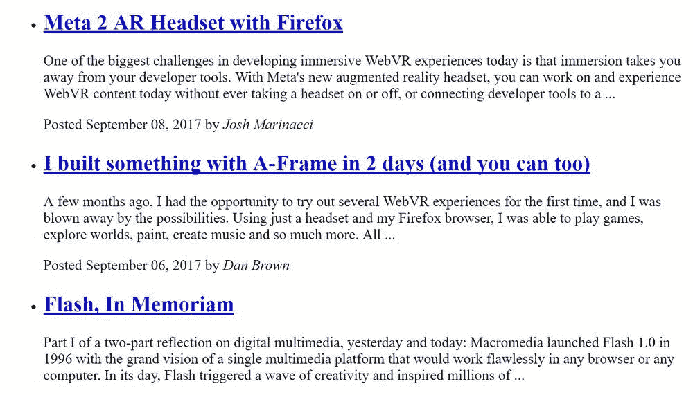
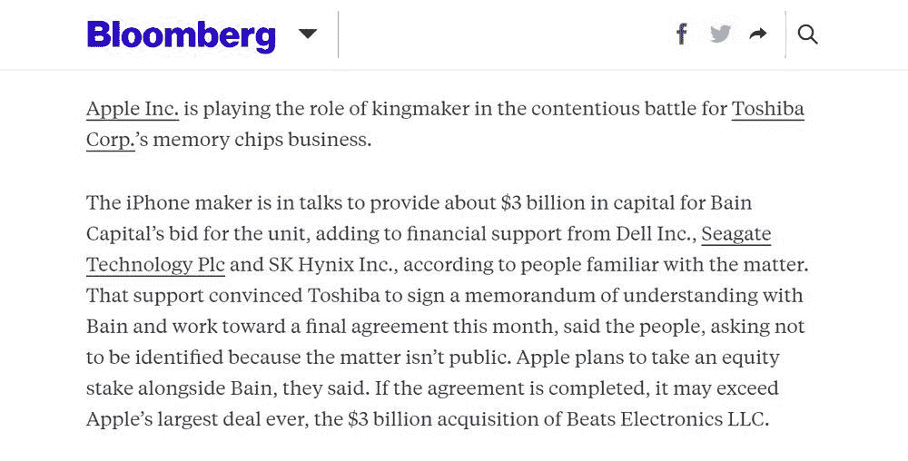
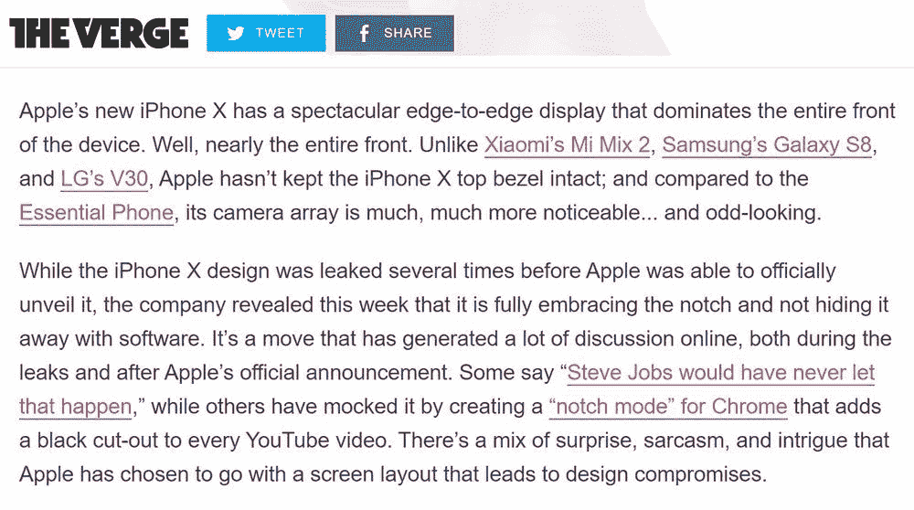
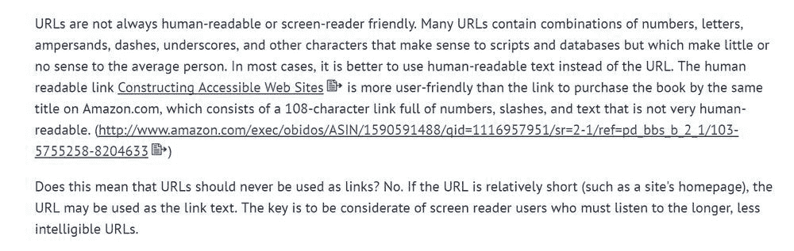
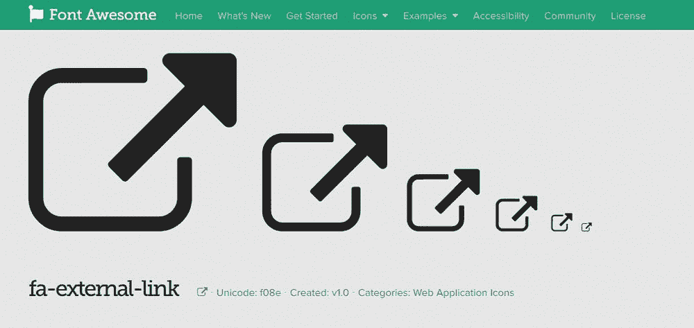
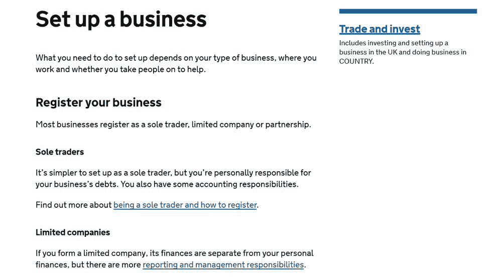

# 如何使链接可访问(提示:颜色是不够的)

> 原文：<https://www.freecodecamp.org/news/link-accessibility-colors-are-not-enough/>

链接可访问性是可用性最重要的方面之一。然而，设计者通常不明白如何使链接具有可访问性。最常见的是，它们只通过颜色来区分链接，这使得有视觉障碍的用户很难在文本块中认出它们——即使使用了高颜色对比度。

根据经验，可访问的链接不应该仅仅依靠颜色。部分原因是视力低下、缺乏色彩和其他视觉障碍的用户不能总是识别这种链接，但也因为如果链接被更好地强调，普通用户更容易浏览内容。

然而，找到如何创建与你的网站设计相匹配的可访问链接并不总是容易的。也有可能使用过多的视觉符号，让用户感到困惑。

## 链接类型

当我们谈到链接时，我们通常会想到带有下划线的经典蓝色链接，然而实际上还有不同种类的链接，例如:

*   正文链接，
*   标题和副标题链接，
*   菜单链接，
*   按钮，
*   图像链接，
*   视频链接，
*   音频链接，
*   还有更多。

在这篇文章中，我将只谈论第一组:正文链接。不要把它看做一个指导方针，而是一个实验，去理解对于更易访问的链接可以做些什么。

## 符合 WCAG 2.0 标准的可访问链接

根据 [WebAIM 关于链接和超文本的指导方针](https://webaim.org/techniques/hypertext/link_text)，WCAG 2.0 对正文链接有两个额外的要求:

1.  链接文本与周围非链接文本的对比度必须为 3:1。
2.  链接必须在鼠标悬停和键盘焦点上呈现一个“非颜色指示符”(通常是下划线的引入)。

Web 浏览器带有满足这些要求的默认链接样式。您可以通过使用 [Web Developer](https://chrispederick.com/work/web-developer/) 浏览器插件或其他开发工具禁用所有其他 CSS 样式来检查它。例如，这是 Mozilla 开发者网络的主页在 Chrome 中的样子:

这肯定是一个非常基本的样式，但它仍然是样式:带下划线的蓝色链接是众所周知的，互联网用户可以很容易地认出它们。尼尔森-诺曼小组在他们的[超越蓝色链接:使可点击元素可识别](https://www.nngroup.com/articles/clickable-elements/)文章中也将蓝色命名为最安全的链接颜色选择，这并不是巧合。

## 可访问链接的示例

WebAIM 不建议使用 CSS 移除下划线，因为“用户习惯于看到带下划线的链接”。尽管如此，许多最大的网站并没有遵循链接可访问性的原则。很多时候，他们不仅删除了默认链接状态的下划线，还删除了`:hover`样式。

但是，他们为什么要这样做呢？主要是出于审美的原因，然而下划线的链接不一定要看起来平淡乏味。

### 1.边框-底部

例如，彭博使用`border-bottom`属性模仿不同颜色的下划线。正如你在下面看到的，链接文本是黑色的，而下划线是蓝色的，这给了链接一个时尚的设计。

也许彭博的链接可以进一步受益于粗体字母，但这是一个很好的例子，下划线可以创造性地用于链接，而不仅仅是通常的方式。

### 2.反向下划线

Verge 使用不同的方法为正文链接创建下划线。这里，默认情况下会出现下划线，但是当用户将鼠标悬停在链接上时，下划线会被删除。当下划线消失时，颜色也会发生微妙的变化，从粉色变为洋红色(但是这种颜色变化几乎无法识别)。

默认状态下下划线的存在有助于读者容易地注意到链接，即使在大的文本块中也是如此。当鼠标悬停在链接上时，消失的下划线会立即显示状态变化。当然，这是一个不寻常的选择，但是它仍然遵循了为可访问链接使用非颜色指示器的原则。

### 3.核标准情报中心

您还可以通过在链接旁边添加小图标来帮助用户识别链接。例如，一些新闻网站在指向视频的链接旁边添加一个视频图标(然而，嵌入视频是目前更广泛使用的做法)。

WebAIM 为链接可访问性选择了一个全面的解决方案。除了下划线，他们还会在每个外部链接后添加一个小图标。通过这种方式，图标不仅仅是一个额外的视觉符号，还能清楚地区分外部和内部链接。

你不一定需要自己创建一个链接图标。例如，字体牛逼有一个[外部链接图标](https://fontawesome.com/icons/external-link-alt?style=solid&from=io)，你可以快速添加到你的链接。

### 4.链接文本

当用户看到链接时，屏幕阅读器会通知用户，因此不建议在链接文本中使用“链接到”或“跟随此链接”这样的短语。相反，你应该提供描述链接主要内容的链接文本。让用户更容易决定是否要点击链接，这对于有[认知障碍](https://webaim.org/articles/cognitive/)的用户尤为重要。

WCAG 2.0 甚至推荐如何[提供正确的链接文本](https://www.w3.org/TR/2008/WD-WCAG20-TECHS-20081103/H30.html)，并提供了一些有用的例子(不过主要是图片链接)。

如果你想看正确链接文本的例子，我会提到发布英国政府信息的 Gov.uk 网站。例如，查看他们的[建立业务](https://www.gov.uk/set-up-business)页面。

例如，看看上面截图上的*了解更多关于成为独家交易者以及如何注册*行的信息。请注意，他们将锚标记放在描述链接目的的部分(“成为独家交易者和如何注册”)，而不是动作动词(“了解更多”)。

## 属性的有争议的角色

[`title`全局属性](https://developer.mozilla.org/en-US/docs/Web/HTML/Global_attributes/title)在链接可访问性中的作用是一个有趣的问题。如果将它添加到链接中，当用户悬停在链接上时，额外的信息会出现在链接周围的某个地方。

例如，以下面一行 HTML 代码为例:

`<a href="#" title="Extra information">Hover this link but don't click it.</a>`

在浏览器中是这样显示的:[悬停此链接但不要点击。](# "Extra information")

我一直认为给链接添加`title`属性对于可访问性来说是一个很好的实践，因为额外的信息有助于用户理解链接的目的。然而，WCAG 2.0 对这个问题的看法略有不同。

在他们的“[用标题属性](https://www.w3.org/TR/2008/WD-WCAG20-TECHS-20081103/H33.html)补充链接文本”页面上，他们提到了几个可访问性问题。例如，`title`属性对辅助技术和只使用键盘的用户不可用。此外，在一些用户代理中，它会在大约五秒钟后消失，这通常不会留下足够的时间来阅读它。

总的来说，WCAG 2.0 不建议反对`title`属性，但建议谨慎使用。有一点是肯定的，不要将`title`用于其他形式中没有的重要信息，比如警告。另一方面，如果`title`只能用于不重要的信息，那它还值得使用吗？

## 链接状态

有五种不同的链接状态，用 CSS 伪类表示: [`:hover`](https://developer.mozilla.org/en-US/docs/Web/CSS/:hover) 、 [`:focus`](https://developer.mozilla.org/en-US/docs/Web/CSS/:focus) 、 [`:active`](https://developer.mozilla.org/en-US/docs/Web/CSS/:active) 、 [`:visited`](https://developer.mozilla.org/en-US/docs/Web/CSS/:visited) 、 [`:link`](https://developer.mozilla.org/en-US/docs/Web/CSS/:link) 。

对于可访问性来说，对所有链接状态采用不同的样式是否更好，这是一个悬而未决的问题。如果你为每个状态使用不同的样式规则，用户会被通知每一个变化，但是这总是一件好事吗？过多的状态变化会导致信息过载和用户困惑。

就个人而言，我倾向于为默认链接状态创建一种样式，为`:hover`、`:active`和`:focus`状态创建第二种样式，有时为`:visited`链接创建第三种样式。但是，我仍然无法判断这是否是可访问性的最佳解决方案。如果你对这个话题感兴趣，这里有一个[有趣的 StackOverflow UX 讨论](https://ux.stackexchange.com/questions/73403/should-focus-and-hover-styles-be-the-same-or-distinct)关于`:focus`和`:hover`状态的样式应该相同还是不同。

然而，有一件重要的事情你一定要记住。**不要删除浏览器用于`:focus`状态的虚线轮廓。**如果聚焦元素在屏幕上不可见，键盘(tab)导航将毫无用处。如果去掉虚线轮廓，键盘用户将会失去焦点。如果你对默认的轮廓样式[感到恼火，用额外的样式](https://a11yproject.com/posts/never-remove-css-outlines/)让它不那么显眼，但是不要去掉它。

## 阅读更多

在我的博客中，我涵盖了一些讨论较少的与可访问性相关的话题。如果你想了解更多，可以看看我的文章，为什么[软件文档也是可访问性](https://www.annalytic.com/documentation-part-of-accessibility.html)的一部分。