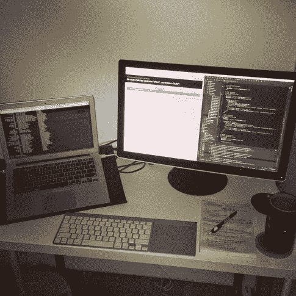
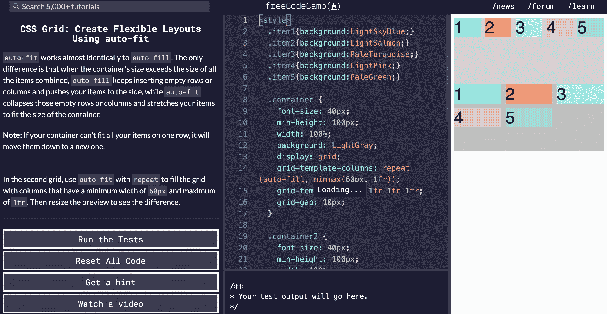
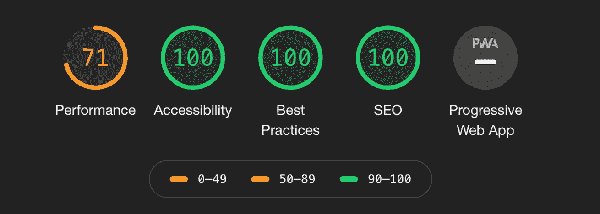
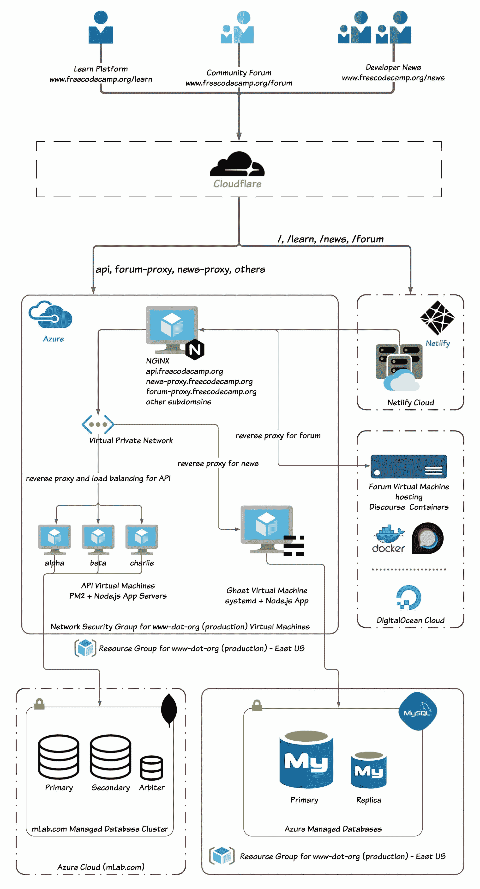
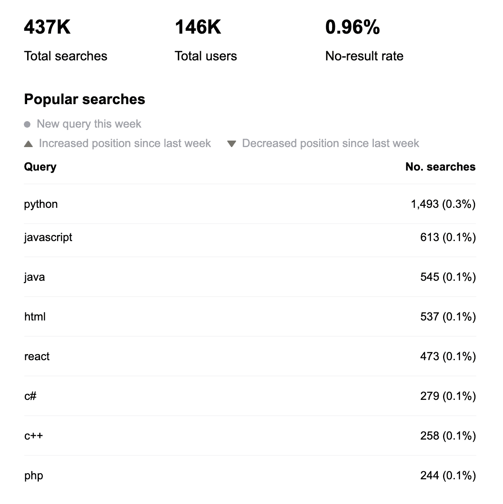

# freeCodeCamp.org 的未来——5 年教世界编程的经验

> 原文：<https://www.freecodecamp.org/news/the-future-of-freecodecamp-5-year-anniversary/>

freeCodeCamp 于 2014 年 10 月上线。在此后的五年里，我们做了很多工作。

在本文中，我们将探索:

*   freeCodeCamp 社区在过去 5 年里取得了哪些成就
*   我们的年度预算，以及我们现在的经营规模
*   我们本周刚刚推出的 4 项重大改进
*   我们 2020 年的宏伟计划



This is the desk in my closet where I built the first version of freeCodeCamp in one long weekend of coding, 5 years ago.

这里有几个数字来说明这个社区所取得的巨大成就。

超过 40，000 名 freeCodeCamp 毕业生现在在苹果、谷歌、微软、亚马逊和 Spotify 等公司从事科技工作。

每月有数百万人观看免费代码营的 YouTube 频道。

每个月都有数百万人阅读 freecodecamp.org/news 的作品。

人们每个月都会在 freecodecamp.org/forum 上问——并回答——数千个与科技相关的问题。

freeCodeCamp.org 现在是整个网络上使用最多的技术网站之一。

```
+-----------------+----------+
|     Website     |Alexa Rank|
+-----------------+----------+
|stackoverflow.com|       40 |
|github.com       |       85 |
|theverge.com     |      615 |
|wired.com        |    1,435 |
|freeCodeCamp.org |    1,596 |
|techcrunch.com   |    1,601 |
|codecademy.com   |    2,040 |
|udacity.com      |    2,348 |
|hackernoon.com   |    3,986 |
|dev.to           |    7,684 |
+-----------------+----------+
```

Popular tech websites and their Amazon Alexa rank (as of Oct. 9, 2019). freeCodeCamp.org is now the 1,596th most-used site on the entire web.

## freeCodeCamp 是一个由捐赠者资助的高效非营利组织。

2019 年至今，freeCodeCamp 已经服务了超过 10 亿分钟的科技教育。而我们的年度总预算只有 37.3 万美元。

这意味着今年到目前为止我们已经提供了...

`(1,120,000,000 minutes / $373,000) = 3,002 minutes`

`= 50 hours of use per dollar`

没错——捐赠的每一美元都可以获得 50 小时的免费技术教育。

freeCodeCamp 的性价比是大多数在线学习工具的 10 倍。

我们的成本效益是大多数成人教育项目的 100 倍，如大学、编码训练营和职业学校。

尽管我们是一家总部设在美国的非政府组织，但只有大约 20%的 freeCodeCamp.org 使用者在美国。

大多数使用 freeCodeCamp.org 的人生活在每天靠 10 美元或更少维生的国家。

当你向 freeCodeCamp 捐款时，你是在确保这些人不会因为负担得起学习编程的费用而不吃饭。

您要确保他们能够获得与您一样的免费、经过时间考验的学习资源。

# 免费代码营的未来

既然你已经看到了 freeCodeCamp 的运作规模及其纯粹的捐赠效率，让我们来谈谈未来。

我们如何帮助更多的人了解我们这个时代的技术工具？

## 本周的主要更新

在过去的一年里，freeCodeCamp 社区一直致力于各种性能和可用性特性。

我们刚刚在本周将这些改进交付生产。他们现在住在 freecodecamp.org。

以下是我们所做的一些改进。

### 改进#1:我们做了数百个课程改进和错误修复

教师和开发者已经浏览了 freeCodeCamp 的课程，并加强了指导和测试。结果是更清晰、更容易理解的学习体验。

今年早些时候，我们开始了 freeCodeCamp 课程 7.0 版本的工作。进展顺利，应该会在 2020 年上线。

我们仍将提供相同的 6 种认证。您仍将构建获得每项认证所需的相同的 5 个认证项目。

但是我们正在用新的实践项目取代我们当前课程中的选修课。您将了解到:

*   通过一行一行地、一次一次地编写你自己的角色扮演游戏。
*   设计你自己的营养标签。
*   通过构建自己的电子表格应用程序进行函数式编程。

...通过类似的以项目为导向的学习，你将学到许多其他的概念和工具。

### 改进 2:大胆的新设计

我们将复古计算美学与现代可访问性最佳实践相结合。结果是我称之为“命令行时尚”的新外观‌



您可以通过设置在亮模式和暗模式之间切换。

很快你就可以直接从 freeCodeCamp 的导航中切换黑暗模式，甚至不需要登录。

### 改进 3:现在在你的手机上编码更容易了

从第一天开始，freeCodeCamp 就致力于让在手机上编写代码和运行测试变得越来越容易。

我们的新版本是实现这一目标的下一步。


A gif showing freeCodeCamp's new mobile experience. Image credit: [Jackson Bates](https://www.freecodecamp.org/news/freecodecamp-mobile/)

我们已经将课程分成了一系列的选项卡，因此您可以轻松地在代码、指令、测试和预览之间切换。

我们还将按钮移到了屏幕的底部，这样您就不必滚动来找到它们。

这些是迈向更易于使用的移动界面的第一步。

试着在你的手机上完成一些免费代码营的课程。它仍然不像有鼠标和键盘那么方便，但是比以前容易多了。

### 改进 4:一切都比以前快得多

我们重新设计了 freeCodeCamp，使之成为一个由 Gatsby 支持的快速 JAMstack React web 应用程序。

以下是 freeCodeCamp 最新发布的谷歌灯塔评分:



A perfect 100 on Accessibility, Best Practices, and SEO. A 71 on performance, which is not bad for a JavaScript-heavy web app. We're working to further improve it.

这是 freeCodeCamp 的完整服务器架构，因此您可以看到我们如何使用 cdn 和强大的新工具(如 Gatsby 和 Netlify)进行大规模运营:



A diagram of freeCodeCamp's 3 core services: /learn, /forum, and /news. They are spread across a number of tools and a number of cloud services. /learn is now a JAMstack app, and it's much faster than before.

我们现在在一个 GitHub 存储库中管理 freeCodeCamp 的所有代码库，因此我们可以自动构建、测试和部署新功能和错误修复。

为了更统一的用户体验，我们已经将 freeCodeCamp 的所有面向用户的子域转移到子目录中。例如，`donate.freecodecamp.org`现在在[www.freecodecamp.org/donate](https://www.freecodecamp.org/donate)。

## freeCodeCamp 2020:更多 Python。

Python 是目前 freeCodeCamp 上最受欢迎的搜索查询。



这是我们 YouTube 频道上最受欢迎的话题。

Python 甚至成为一些国家标准化大学考试的一部分。

尽管我们有大量关于 Python 的流行学习资源，但直到现在我们还没有将 Python 纳入 freeCodeCamp 的核心课程。

我很高兴地宣布，我们正在增加 Python 项目和特定于 Python 的认证。

我们特别关注 Numpy 和 tensor flow——这两个库广泛用于数据科学和机器学习。

你可以在这里阅读更多关于[我们即将推出的 Python 课程。](https://www.freecodecamp.org/news/python-curriculum/)

## 这个世界需要一个免费的、非盈利的社区来学习编程和技术

是的，有很多问答社区涵盖了技术基础知识。

是的，现在有很多编程教程网站。

关键的区别是 freeCodeCamp.org 是一个基层的努力。

我们不听命于大公司。

我们由开发者社区运营，由开发者社区支持，由公众所有。

我们将继续不懈努力，帮助尽可能多的人学习编码。

我们可以一起建设一个未来，在这个未来，每个人都可以驾驭复合超级力量，即技术，而不仅仅是硅谷的几个工程师。

我们能够完成这一切，要感谢 5000 多名每月向 freeCodeCamp 捐赠 5 美元的人。

还记得我之前的数学吗？以 freeCodeCamp 目前的效率水平，一笔 5 美元的捐款可以为世界购买相当于 250 个小时值得学习的内容。

如果你还没有捐赠，不要担心。你可以[在这里](https://donate.freecodecamp.org)开始捐赠 5 美元。

### 祝 freeCodeCamp 社区生日快乐。

感谢所有帮助将这项免费教育实验变成对全世界人民如此有用的工具的人。

为 2020 年更多的学习干杯。