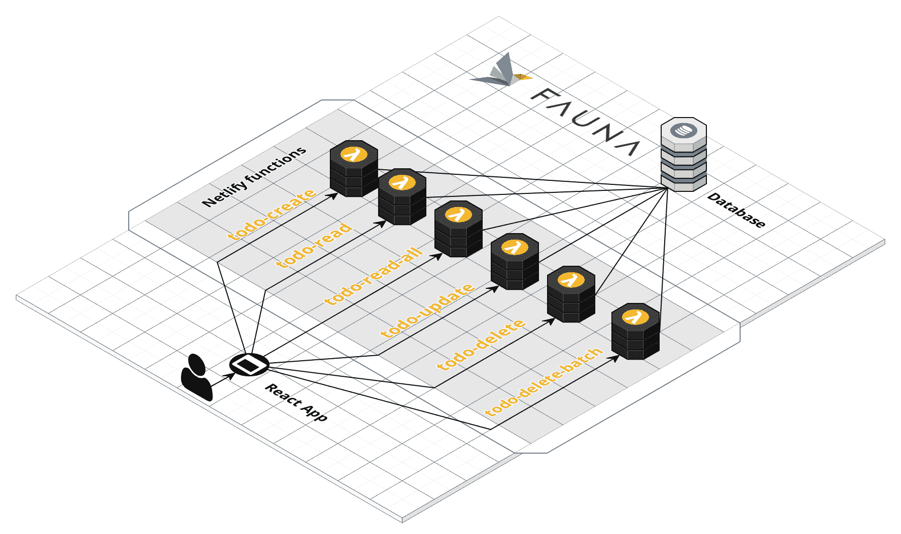
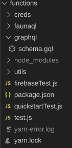
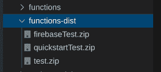

# 你不能从这里到达那里:Netlify Lambda 和 Firebase 如何把我带到一个没有服务器的死胡同

> 原文：<https://www.freecodecamp.org/news/you-cant-get-there-from-here-how-netlify-lambda-and-firebase-led-me-to-a-serverless-dead-end/>

【**更新:**显然你 ***可以从这里*** 到达那里！也就是如果用`firebase-admin`代替`@google-cloud/firestore`的话。我以后会有更多关于这方面的内容，但它的要点总结在这里。]

不久前，我在探索 T2 Netlify 对 FaunaDB 的支持，这是一个 NoSQL 的面向文档的数据库，具有一些特殊的功能，可以让 T4 处理分散在不同数据库服务器上的事务。我决定尝试一下，因为这是一个方便的选择，因为我可以从[示例代码](https://github.com/netlify/netlify-faunadb-example)开始。这个例子使用了λ函数作为数据库的前端。



我修改了最初的 lambda 函数，以便与 FaunaDB GraphQL API 对话(而不是与 [FQL](https://docs.fauna.com/fauna/current/api/fql/) )对话。虽然[起作用了](https://www.freecodecamp.org/news/how-to-use-faunadb/)，但最后我觉得动物界的 GraphQL 支持还不太成熟，所以我四处寻找替代品。

最终我选定了 [Cloud Firestore](https://firebase.google.com/docs/firestore/rtdb-vs-firestore) 。我将这个新项目基于动物群示例，用 [apollo-server-lambda](https://www.npmjs.com/package/apollo-server-lambda) 替换掉 **faunadb** 模块，这样我就可以编写自己的 GraphQL API 和解析器。

我不得不做的一个改进[是将我所有的 Netlify 函数依赖项下推到我的项目中的/functions 文件夹(与包含我的 React 客户端的/src 文件夹分开并在同一层)。为此，我在 functions 文件夹中运行了`npm init`，将一组依赖项从顶层 package.json 移动到新的/functions/package.json，添加了一个](https://github.com/netlify/netlify-lambda/issues/112) [webpack.functions.js](https://github.com/netlify/netlify-lambda/issues/112#issuecomment-488644361) ，然后运行`yarn install`将包拖到一个新的 node_modules 文件夹中。

结果是这样的:



我稍后会谈到子文件夹；要注意的主要事情是有 yarn 文件，加上 package.json、node_modules 文件夹、schema 文件夹和一些。用于测试的 js 文件。

最初的项目使用 [netlify_lambda](https://github.com/netlify/netlify-lambda) 来构建，其中使用了 webpack 和 babel。我遇到了[的一些问题](https://github.com/netlify/netlify-lambda/issues/183)，解决了它们，后来又遇到了它们。

沮丧之余，我决定放弃 netlify-lambda，选择 [Netlify Dev](https://www.netlify.com/products/dev/) 从命令行构建和部署。缺点是我没有能力启动本地服务器，但是我可以将候选服务器部署到 Netlify 并测试它们，而无需首先将源代码签入 github 或直接部署到生产环境中。

由于不再需要 webpack 和 babel，移动部件变少了。走这条路时，您可能会在您的函数的*构建&部署*设置中将环境变量 **AWS_LAMBDA_JS_RUNTIME** 设置为 **nodejs10.x** 。

# 事情并不总是像它们看起来的那样

比起云中的 lambda 函数，我更熟悉 GraphQL 客户端和服务器，对于 Netlify 中的部署方式，我有一些天真的假设。我认为函数或多或少都是复制过来的，构建脚本在服务器上运行，所有人都会满意，我的函数可以通过 URL 调用。

事情完全不是这样。

当我开始使用 netlify_lambda 时，它会使用 webpack 创建一个 functions_build 输出文件。我的 netlify.toml 配置把它作为**函数的**位置。

```
[build]
  functions = "functions-build"
  # This will be run the site build
  command = "yarn build"
  # This is the directory is publishing to netlify's CDN
  publish = "build" 
```

当我切换到使用 [Netlify Dev](https://www.netlify.com/products/dev/) 时，我放弃了输出文件夹，只部署了“非捆绑”/ **函数**源。然而，这并不是故事的结尾。

# 认证难题

在 FaunaDB 项目中，身份验证是通过一个环境变量进行的，该变量的值是一个简单的令牌。FireBase 使用了类似的机制，但是变量值不是令牌，而是通过 Firebase 控制台生成的凭证文件的路径。lambda 函数创建一个 Firebase 实例，该实例查找 env 变量来定位身份验证的凭证文件。

似乎无论我把凭证文件放在哪里，或者使用什么路径，Firebase 客户机都无法找到它。在我的研究过程中，我偶然发现提到了 Netlify 的 [zip-it-and-ship-it](https://github.com/netlify/zip-it-and-ship-it) 实用程序，其他有其他问题的人推荐用它将函数打包成 zip 文件。

我尝试了一下，修改构建过程以调用 NodeJS 脚本，该脚本将我的函数压缩到一个 **functions-dist** 文件夹中(将 **netlify.toml** 配置改为不指向该文件夹，而不是指向 **functions** 源文件夹)。虽然它没有立即修复我的凭证文件问题，但我注意到了一些事情。



我开始意识到每个λ函数。js 文件被打包成一个 zip 文件，它还包含自己的 **node_modules** 文件夹。此外，node_modules 文件夹被“定制”为只包含每个函数明确需要的依赖项。

## 聪明，但不够聪明

这需要一些思考，但我决定，如果我添加我的。json 文件，然后使它成为每个 lambda 函数的依赖项，它将被放在 node_modules 文件夹中。到那时，我就会有一条路径:**。/creds/mycred.json** 。耶！

它并没有完全工作——当我检查 zip 文件时，每个 zip 存档中都有凭证文件，但是 Firebase 客户端仍然无法访问它们。

我在网络生活支持论坛上承认了我的彻底失败，说我计划加入一个社团来学习编织吊床。

# 救命啊！


Photo by [Jonny Caspari](https://unsplash.com/@jonnysplsh?utm_source=ghost&utm_medium=referral&utm_campaign=api-credit) / [Unsplash](https://unsplash.com/?utm_source=ghost&utm_medium=referral&utm_campaign=api-credit)

我一定引起了一些同情，因为 Netlify 的 Dennis 很快回复了我，让我知道 lambda 函数实际上不能访问文件系统。我所尝试的(通过文件路径加载凭证)是不可能的。他建议将文件导入每个 lambda。js(我已经做过了)。但是，Firebase 客户端似乎不允许您通过导入来获取凭证。

除此之外，丹尼斯暗示说，也许这不是我应该采取的方法。他说得有道理。我走这条路的唯一原因是因为我遵循了 Netlify 的一个例子，但是用**Apollo-server-lambda**T4 替换掉 **faunadb** 包可能会给 lambda 函数增加更多的权重；如果是这样的话，它可能会对冷启动[期间的旋转时间产生影响](https://hackernoon.com/im-afraid-you-re-thinking-about-aws-lambda-cold-starts-all-wrong-7d907f278a4f)。

# 抛弃 lambda 函数

Lambda 函数不是所有事情的解决方案。在我的例子中，我只想要一个带有 GraphQL 前端的简单数据存储，而不在浏览器控制台中公开 GraphQL 查询。

我可以通过让一个节点进程同时托管一个 React 客户机和一个 GraphQL 服务器来达到同样的目的。我(几乎)确定我不会遇到任何文件系统访问问题，如果是这样，我会切换到另一种身份验证方法。