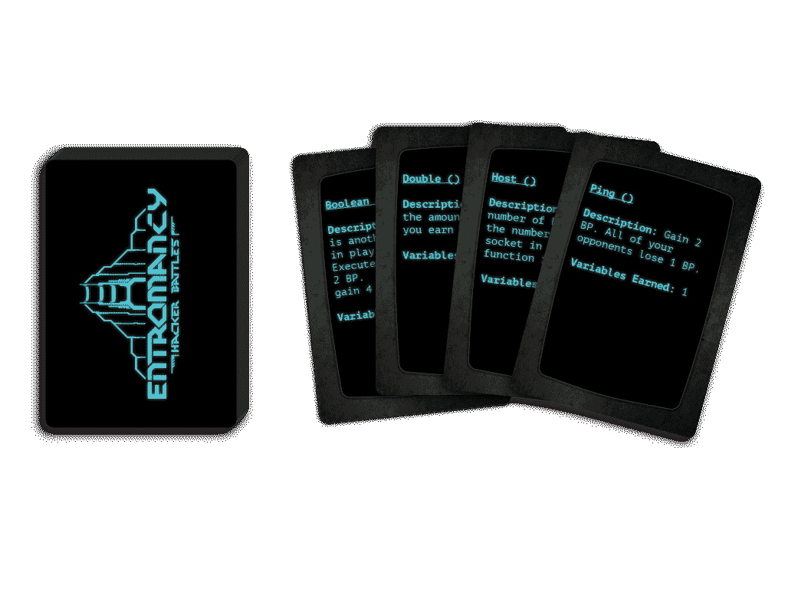
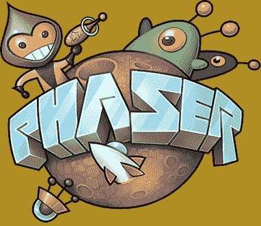

# 我试图在 React、Unity、Godot、Construct、Game Maker 和 Phaser 中制作相同的 2D 游戏原型。这是我的发现。

> 原文：<https://www.freecodecamp.org/news/how-i-made-a-2d-prototype-in-different-game-engines/>

我是一名桌面游戏开发者。在设计一个新的卡牌游戏时，我决定建立一个数字原型来帮助我运行模拟，并轻松地与合作者共享概念证明。

我有一些 JavaScript 和 C#的背景知识，我和许多人一样:在“我应该使用什么框架”线程和阅读文档上花费了过多的时间，但实际上并没有做任何事情。

一晃几个月过去了，我现在花了更多的时间在 React、Unity、Godot、Construct 3、Game Maker Studio 2 和 Phaser 3 上工作(并与之角力)，试图理解是什么让它们运转起来。

不可否认，我认为我在每一款游戏上花费的*时间都比制作我的小游戏所需要的时间要多，而且我可能会坚持第一款游戏，然后在原型上磕磕绊绊。我希望下面的信息对其他正在购买引擎或框架的人有所帮助。*

*一堆警告:我并不试图推销一个引擎或框架，也不是说这些框架中的一个或任何一个会比另一个更适合你的游戏。我也不会比较定价、后端功能或平台部署。因此，根据您的需求，以下信息可能对您有不同的价值。*

*此外，这种体验是基于 2D 纸牌游戏的开发，所以我不会讨论 3D 引擎，物理等。*

*您也可以 ****跳到底部为 TL；【T2 博士】*****

 *[https://www.youtube.com/embed/gtKEkuhsWOs?feature=oembed](https://www.youtube.com/embed/gtKEkuhsWOs?feature=oembed)* 

## *原型*

*我的游戏， **Entromancy:黑客大战** ，是一款 TCG-光力学的竞技赛博朋克卡牌游戏。你可以在我们的[网站](https://www.entromancy.com)上了解更多信息，或者在[这段视频](https://www.entromancy.com/single-post/2019/09/26/Get-a-Sneak-Peek-at-Entromancy-Hacker-Battles)中观看它是如何播放的。但可以说，作为一款卡牌游戏，它需要一个潜在的数字框架来支持基本的东西，如状态管理、UI、拖放式 UX 和实现多人游戏的后端挂钩。*

**

*考虑到这些需求，我探索了下面的框架和引擎，看看哪一个最适合制作我的游戏...而不是真正的 **制作** 游戏(我很高兴地说，现在我已经确定了一个框架，我正在取得更多的进展)。*

*你可以在这里访问一个可玩的版本[，尽管游戏比真实原型显示的要远，但这个版本相当稳定(至少在 Chrome 中)。](https://sominator.github.io/hacker-battles/)*

## *反应*

*我已经在 [React](https://reactjs.org/) 中为我设计的[桌面 RPG](https://www.entromancy.com/rpg)构建了一个角色生成器原型，我认为自然的一步是给卡牌游戏的框架一个旋转。我发现状态管理轻而易举(毕竟，React **和** 就是这么做的)，而为卡片实现简单的拖放功能却是一场噩梦。*

**

*有一些库可以帮助基本的拖放操作(例如 [React DnD](https://react-dnd.github.io/react-dnd/about) )，但是我发现对于一个卡牌游戏，我需要一个更优雅的 dropzones 解决方案，因为 Hacker Battles 非常具体地说明了哪些卡牌可以在何时何地使用。*

*这个经历让我去看看 [boardgame.io](https://boardgame.io/) ，它可以和 React 协同工作。但这最终要求我在现有框架的基础上学习另一个框架，这对于我的目的来说并不理想。*

## *一致*

*出于一般兴趣，在尝试用它重新制作卡牌游戏原型之前，我花了很多时间在 Unity 上做教程，学习如何使用编辑器。资产商店是一个很好的资源，有如此多的官方和非官方的文档，我相信我可以找到我可能遇到的任何问题的答案。*

*到目前为止，我对 Unity 的体验好坏参半。我真的很喜欢在 C#中工作，任何与代码相关的事情都是一种相对轻松的体验。然而，Unity 对于它的实现是非常具体的，有时会感觉与直觉相反。*

**

*另一方面，编辑是一个很难相处的人。为了利用 Unity 的全部潜力，你需要花很长时间与 UI 搏斗，以了解所有东西在哪里以及如何使用它。它也非常落后于 2D 游戏开发的时代，显然试图将一个主要是 3D 的引擎变成一个 2D 飞机，结果好坏参半。*

*公平地说，我很喜欢在 Unity 编辑器中工作，虽然它很笨重。但如果你正在寻找一个 2D 游戏引擎，你的生活质量在其他地方会高很多(看看 Unity 的动画系统或实现像素完美的视频，你就会明白我的意思了)。*

*最终，Unity 对 2D 空间的处理比我的原型需要的要复杂一些，但是我会在其他类型的游戏中再回到这个问题上来。*

*另外，边栏可能对一些人有用:我最初对资产商店非常兴奋，我的想法是我可以购买一个卡片游戏模板，这将使开发过程对我来说容易得多。没有成功。大部分是 MTG/炉石/等。对我来说，为我的卡牌游戏重新构建克隆体需要的开发时间和从头开始一样多。*

## *戈多*

*遇到 [Godot](https://godotengine.org) 的第一个想法是:“支持 C#的开源游戏引擎？给我报名！”然后我下载了它，学习了几个基础教程，并让它在构建时崩溃。哈姆。*

*几个谷歌搜索，重新安装，头发拉后，我发现这与我的版本的 VS Build(我认为？)，导致我下了一个单独的兔子洞。根据经验，我知道其他引擎——Unity chief 就是其中之一——可能会在你自己的代码之外导致破坏游戏的问题，但这是一个令人讨厌的障碍，可能会影响我对 Godot 的其他体验。*

**

*就编辑器而言，我非常喜欢 Godot 基于节点的实现，我实际上发现它来自 Unity 的预置，但最终还是喜欢上了。实际上，我甚至可以说，它的 2D 功能比 unity 的*更好，但它缺少社区、资产商店(见上面的边栏)，尤其是 Unity 拥有的文档。例如，如果你打算用 Godot 用 C#工作，准备在引擎的自定义 GDScript 中寻找答案，然后将它们翻译成 C#。**

**然而，我听说有人在使用 GDScript 时体验了 Godot 的巨大成功，所以如果你愿意花时间学习它，你可能会喜欢 Godot 所提供的。**

## **构造 3**

**在我上面列出的警告中，我提到我没有把定价作为讨论的重点。尽管如此，我觉得我需要用[构造 3](https://construct.net/) 来提出它，因为它在我的经验中证明是有影响的。**

**与这里列出的其他游戏引擎不同，这些引擎在很大程度上是免费使用的(Game Maker Studio 2 有 30 天的免费试用期)，Construct 的绝大多数功能都是在付费墙和订阅费的背后。呃。**

****

**我真的， **真的** 喜欢简单的 2D 游戏的架构。这个编辑器感觉有点像 MS Paint 的升级版，但是它很好地处理了 sprite 和对象管理，而且简单易用。我不喜欢它使用“可视化脚本”风格，但他们最近增加了编写普通旧 JavaScript 的功能，看起来或多或少可以工作。**

*在关闭 Construct 3 演示(在浏览器中运行)之前，我能够在很短的时间内为原型构建一个非常基本的架构...然后在新的演示中再次尝试。我觉得，至少对于这个卡牌游戏，我可以用 Construct 3 做很多事情，但我不愿意为一个原型支付 99 美元/年(或者更多，作为一个企业)。*

## *游戏制作者工作室 2*

*YoYo Games 显然做了大量工作，使 [Game Maker Studio 2](https://www.yoyogames.com/gamemaker) 易于访问和导航，这一点显而易见。在我为这个项目使用的所有引擎中，我最喜欢 GMS 编辑器。对于一个小项目来说，很容易找到周围的路，开始你的工作。然而，我怀疑一个更大的项目可能会很快失控。*

*这可能会受到 Game Maker Studio 的专有语言 GML 的影响(虽然 GMS 2 支持可视化脚本，但我没有使用)。它可以工作，但是如果你是从另一种 OOP 语言(或者，实际上，任何其他广泛使用的语言)来的，你可能会对实现或者弄清楚如何做一些事情感到困惑。如果你是一个初学者或者愿意花时间弄清楚 GMS **如何让** 使用 GML，你可能没问题。*

**

*我体验了 Game Maker Studio 的拖放功能的一些古怪之处——也就是说，鼠标指针在拖动时的检测有点不稳定，需要一些脚手架才能正常工作。*

*我认为——这完全是我个人的偏好和懒惰——如果 GMS 提供使用另一种非专有编程语言的能力，我会花时间在这里做更多的破坏。我完全赞成在工作中提升多种技能，而花时间成为 GMS 编辑器 **和** GML 中的专家，却不能轻松地将知识应用到其他地方，这似乎不值得。*

*尽管如此，它仍然是一个非常好用的 2D 编辑器，尽管社区支持可能比不上 unity，但它仍然非常好。还要注意的是，一旦你的免费试用期结束，你就必须付费才能继续使用 Game Maker Studio 2。*

## *相位器 3*

*[Phaser](https://www.freecodecamp.org/news/how-i-made-a-2d-prototype-in-different-game-engines/phaser%20io) 是一个轻量级、开源的 JavaScript 游戏框架。周围有一些 Phaser IDEs，但是如果你是那种希望主要在代码中工作的人，你可能会使用 Atom、Sublime 或你最喜欢的编辑器。*

*Phaser 2 过去和现在都被广泛使用，并且有大量的教程可供参考。相位器 3 则相反。对于初学者来说，它有一个相对较高的学习曲线，有一堆例子，周围没有太多的上下文。*

*很多教程都支持 Phaser 2，虽然学习内容是可转移的，但代码是不可转移的。此外，开发人员[最近宣布他们将把支持转移到 Phaser 4](https://madmimi.com/p/4f5f0f) (和 TypeScript 而不是 ES6)，如果你花时间在 Phaser 3 上工作，这不是很好。*

**

*如果您不是专业程序员(我不是)并且熟悉 ES6 类和 JavaScript 最佳实践(我不是)，您可能会很快对 Phaser 缺乏支持和必须建立自己的 IDE 和工作流(我是)感到沮丧。*

*然而，我发现它是一个强大的轻量级框架，以比其他游戏引擎更精简的方式做很多事情。卡牌游戏的拖放功能相对来说是轻而易举的事情，将卡牌类型分类的能力(有点像 Unity 的预置)已经将这类游戏所需的认知负荷划分开来。*

*如果你是一名前端开发人员，你可能喜欢或习惯于对所有东西进行硬编码像素坐标，但是哎呀，这是一项艰苦的工作。此外，如果您对所有 JavaScript 都不熟悉，您很可能会在非 Phaser 圈子中寻找答案，然后将它们应用到您的项目中，我认为这有它自己的好处。*

*另一个不清楚的地方是:Phaser 3*有相当多的官方文档和例子，但它*没有其他游戏引擎享有的社区或堆栈溢出答案。如果你遇到一个问题或者不能解决某个问题，你将不得不找到你自己的解决方案或者在 Phaser Discord 服务器上发布你的问题，这在我的经验中很有帮助。***

## **结论**

**鉴于以上所述，我坚持并继续迭代的原型是我用 Phaser 3 构建的原型。我意识到这可能是反高潮的，因为 Phaser 本质上并不比 2D 游戏开发公司的其他框架和引擎“更好”(或许 React 除外，它并不想成为数字游戏领域的竞争对手)。**

**然而，Phaser 似乎可以更流畅地处理 **黑客与** 的拖放和游戏循环管理，对我来说，这很重要。我也喜欢使用 Phaser 要求我在 JavaScript 生态系统和社区上投入更多，但是我对这样做很感兴趣，所以这感觉像是一个额外的收获。**

*如果你是那种“我可以用什么来快速构建一些东西，而不关心引擎所处的环境”的类型，YMMV。*

## *TL；速度三角形定位法(dead reckoning)*

***反应:**非常适合前端开发。不会用它来玩游戏，尤其是拖放游戏。*

*如果你愿意与编辑器和潜在的 3D 特质搏斗，你可以制作任何类型的 2D 游戏。巨大的社区支持，C#也很棒。资产存储存在，但可能对您的目的没有用处。*

*Godot: 开源，支持 GDScript、C#、甚至 C++和 Python，如果你愿意做很多繁重的工作的话。很好的 2D 含义，但没有像 unity 这样的东西那样得到社区的支持。此外，我的经历充满了问题。*

***构建 3:** 真正易于使用，由于订阅付费墙，进入门槛很高。如果你想使用或学习代码，可视化脚本可能会让你紧张，尽管现在有一些 JavaScript 支持。*

***Game Maker Studio 2:** 用户友好的编辑器，具有良好的社区支持。如果你来自另一种更流行的编程语言，GML 或可视化脚本可能不适合你，但是嘿，入乡随俗。此外，需要在 30 天免费试用后付费。*

*Phaser 3: 期望编码所有的东西，并做大量的搜索来找出如何让事情工作。这是为我工作的这个特定的游戏和原型，但 Phaser 4 的方式，所以有。*

*我希望这篇文章对你自己的搜索和辨别过程有用。我也很想听听你自己在这些框架/引擎或其他方面的经验！*

*如果你喜欢这篇文章，请考虑[查看我的游戏和书籍](https://www.nightpathpub.com/)，[订阅我的 YouTube 频道](https://www.youtube.com/msfarzan?sub_confirmation=1)，或者[加入 *Entromancy* Discord](https://discord.gg/RF6k3nB) 。*

***M. S. Farzan，博士**曾为电子艺界、完美世界娱乐、魔都游戏和 MMORPG.com 等知名视频游戏公司和编辑网站撰稿和工作，并担任过 **地下城&龙无冬** 和 **质量效应:仙女座** 等游戏的社区经理。他是**[Entromancy:A cyber punk Fantasy RPG](https://www.entromancy.com/rpg)**的创意总监兼首席游戏设计师，也是 *[The Nightpath 三部曲](http://nightpathpub.com/books)* 的作者。在推特上找到 M. S .法尔赞。*