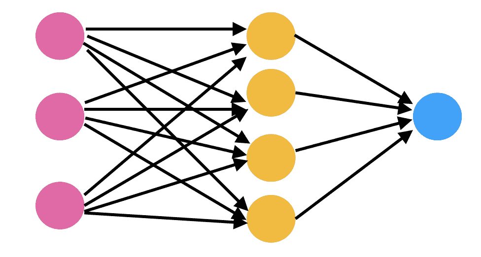

# 如何从零开始构建神经网络

> 原文：<https://www.freecodecamp.org/news/building-a-neural-network-from-scratch/>

神经网络就像深度学习的主力。有了足够的数据和计算能力，它们可以用来解决深度学习中的大部分问题。使用 Python 或 R 库创建神经网络并在任何数据集上训练它并获得很高的准确性是非常容易的。

我们可以将神经网络视为某种黑盒，毫无困难地使用它们。尽管这样做似乎很容易，但了解这些算法背后的东西以及它们是如何工作的更令人兴奋。

在这篇文章中，我们将进入构建神经网络的一些细节。我将使用 Python 编写网络代码。我还将使用 Python 的 numpy 库来执行数值计算。我会尽量避免一些复杂的数学细节，但如果你想了解更多，我会在最后参考一些精彩的资源。

所以让我们开始吧。

## 想法

在我们开始为我们的神经网络编写代码之前，让我们先等等，了解一下到底什么是神经网络。



[Source](https://miro.medium.com/max/980/1*oc1gaCFvgWXq_gHQFM63UQ.png)

在上图中，你可以看到一个非常随意的神经网络图。它有一些相互连接的彩色圆圈，箭头指向特定的方向。这些彩色圆圈有时被称为*神经元*。

这些*神经元*不过是数学函数，当给定一些*输入时，*产生一个*输出*。*神经元*的*输出*取决于*神经元*的*输入*和*参数*。我们可以更新这些*参数*以从网络中获得所需的值。

这些*神经元*中的每一个都是使用 *sigmoid 函数*定义的。一个 *sigmoid 函数*为它得到的每个输入给出一个 0 到 1 之间的输出。这些乙状结肠单元相互连接形成一个神经网络。

这里的连接是指一层 sigmoid 单元的输出作为下一层的每个 sigmoid 单元的输入给出。这样，我们的神经网络对任何给定的输入都产生一个输出。这个过程一直持续到我们到达最后一层。最后一层生成其输出。

神经网络对于给定的*输入*产生一个*输出*的这个过程就是*正向传播*。最终层的输出也称为神经网络的*预测*。在本文的后面，我们将讨论如何评估预测。这些评估可以用来判断我们的神经网络是否需要改进。

就在最后一层生成其输出之后，我们计算*成本函数*。成本函数计算我们的神经网络距离做出预期的预测有多远。成本函数值显示了*预测值*和*真实值*之间的差异。

我们的目标是最小化*成本函数*的值。成本函数的最小化过程需要一种算法，该算法可以更新网络中的*参数*的值，使得成本函数达到其*最小值*。

使用诸如*梯度下降*和*随机梯度下降*的算法来更新神经网络的*参数*。这些算法根据它将如何影响成本函数的最小化来更新网络中每一层的权重和偏差的值。通过*反向传播*计算关于网络中每个输入神经元的每个权重和偏差的成本函数最小化的效果。

## 密码

所以，我们现在知道了神经网络背后的主要思想。让我们开始在代码中实现这些想法。我们将从导入所有需要的库开始。

```
import numpy as np
import matplotlib.pyplot as plt
```

正如我提到的，我们不会使用任何深度学习库。因此，我们将主要使用 numpy 来高效地执行数学计算。

构建神经网络的第一步是初始化参数。我们需要为每层中的每个神经元初始化两个参数:1) *权重*和 2) *偏差*。

这些权重和偏差以*矢量化*的形式声明。这意味着，我们不是为每一层中的每个神经元初始化权重和偏差，而是为每一层创建一个权重向量(或矩阵)和另一个偏差向量。

这些*权重*和*偏差*矢量将与层的输入相结合。然后，我们将对该组合应用 sigmoid 函数，并将其作为输入发送到下一层。

**layer_dims** 保存每一层的尺寸。我们将把这些层的尺寸传递给 **init_parms** 函数，该函数将使用它们来初始化参数。这些参数将存储在名为 **params** 的字典中。因此在 params 字典**中，params['W1']** 将表示层 1 的权重矩阵。

```
def init_params(layer_dims):
    np.random.seed(3)
    params = {}
    L = len(layer_dims)

    for l in range(1, L):
        params['W'+str(l)] = np.random.randn(layer_dims[l], layer_dims[l-1])*0.01
        params['b'+str(l)] = np.zeros((layer_dims[l], 1))

    return params
```

太好了！我们已经初始化了权重和偏差，现在我们将定义 *sigmoid 函数*。它将为任何给定的 **Z** 值计算 sigmoid 函数的值，并将该值存储为缓存。我们将存储缓存值，因为我们需要它们来实现反向传播。这里的 **Z** 就是*线性假设*。

注意，在神经网络术语中，sigmoid 函数属于激活函数的类别。一个*激活函数*的工作是塑造一个神经元的输出。

例如，sigmoid 函数接受具有离散值的输入，并给出介于 0 和 1 之间的值。其目的是将线性输出转换为非线性输出。有不同类型的*激活函数*可用于获得更好的性能，但为了简单起见，我们将坚持使用 sigmoid。

```
# Z (linear hypothesis) - Z = W*X + b , 
# W - weight matrix, b- bias vector, X- Input 

def sigmoid(Z):
	A = 1/(1+np.exp(np.dot(-1, Z)))
    cache = (Z)

    return A, cache
```

现在，让我们开始编写向前传播的代码。我们之前已经讨论过，*正向* *传播*将从上一层获取值，并将其作为输入提供给下一层。下面的函数将把*训练数据*和*参数*作为输入，并将生成一层的输出，然后将该输出馈送到下一层，依此类推。

```
def forward_prop(X, params):

    A = X # input to first layer i.e. training data
    caches = []
    L = len(params)//2
    for l in range(1, L+1):
        A_prev = A

        # Linear Hypothesis
        Z = np.dot(params['W'+str(l)], A_prev) + params['b'+str(l)] 

        # Storing the linear cache
        linear_cache = (A_prev, params['W'+str(l)], params['b'+str(l)]) 

        # Applying sigmoid on linear hypothesis
        A, activation_cache = sigmoid(Z) 

         # storing the both linear and activation cache
        cache = (linear_cache, activation_cache)
        caches.append(cache)

    return A, caches
```

**A_prev** *i* s 输入到第一层。我们将遍历网络的所有层，并计算线性假设。之后，它将获取 **Z** (线性假设)的值，并将其提供给 sigmoid 激活函数。高速缓存值沿途存储，并在**高速缓存**中累积。最后，该函数将返回生成的值和存储的缓存。

现在让我们定义我们的成本函数。

```
def cost_function(A, Y):
    m = Y.shape[1]

    cost = (-1/m)*(np.dot(np.log(A), Y.T) + np.dot(log(1-A), 1-Y.T)) 

    return cost
```

随着代价函数值的减小，我们的模型的性能变得更好。可以通过更新神经网络中每一层的参数值来最小化成本函数值。诸如*梯度下降*的算法被用于以最小化成本函数的方式更新这些值。

梯度下降在一些更新项的帮助下更新这些值。这些被称为*梯度*的更新项是使用反向传播计算的。为网络中的每个神经元计算梯度值，并且它表示相对于该特定神经元的参数变化的最终输出的变化。

```
def one_layer_backward(dA, cache):
    linear_cache, activation_cache = cache

    Z = activation_cache
    dZ = dA*sigmoid(Z)*(1-sigmoid(Z)) # The derivative of the sigmoid function

    A_prev, W, b = linear_cache
    m = A_prev.shape[1]

    dW = (1/m)*np.dot(dZ, A_prev.T)
    db = (1/m)*np.sum(dZ, axis=1, keepdims=True)
    dA_prev = np.dot(W.T, dZ)

    return dA_prev, dW, db
```

上面的代码运行一个单层的反向传播步骤。它使用我们之前存储的缓存值来计算一个图层的 sigmoid 单元的梯度值。在激活缓存中，我们已经存储了该层的值 **Z** 。使用这个值，我们将计算 **dZ** ，它是成本函数相对于给定神经元的线性输出的导数。

一旦我们计算了所有这些，我们就可以计算出 **dW** 、 **db** 和 **dA_prev、**，它们分别是关于权重、偏差和先前激活的成本函数的导数。我直接使用了代码中的公式。如果你不熟悉微积分，一开始可能会觉得太复杂。但是现在把它想象成任何其他的数学公式。

之后，我们将使用这个代码来实现整个神经网络的反向传播。函数 **backprop** 实现了相应的代码。这里，我们创建了一个字典，用于将渐变映射到每个层。我们将反向遍历模型并计算梯度。

```
def backprop(AL, Y, caches):
    grads = {}
    L = len(caches)
    m = AL.shape[1]
    Y = Y.reshape(AL.shape)

    dAL = -(np.divide(Y, AL) - np.divide(1-Y, 1-AL))

    current_cache = caches[L-1]
    grads['dA'+str(L-1)], grads['dW'+str(L-1)], grads['db'+str(L-1)] = one_layer_backward(dAL, current_cache)

    for l in reversed(range(L-1)):

        current_cache = caches[l]
        dA_prev_temp, dW_temp, db_temp = one_layer_backward(grads["dA" + str(l+1)], current_cache)
        grads["dA" + str(l)] = dA_prev_temp
        grads["dW" + str(l + 1)] = dW_temp
        grads["db" + str(l + 1)] = db_temp

    return grads
```

一旦我们循环了所有的层并计算了梯度，我们将把这些值存储在 **grads** 字典中并返回它。

最后，使用这些梯度值，我们将更新每个层的参数。函数 **update_parameters** 遍历所有层，更新参数并返回。

```
def update_parameters(parameters, grads, learning_rate):
    L = len(parameters) // 2

    for l in range(L):
        parameters['W'+str(l+1)] = parameters['W'+str(l+1)] -learning_rate*grads['W'+str(l+1)]
        parameters['b'+str(l+1)] = parameters['b'+str(l+1)] -  learning_rate*grads['b'+str(l+1)]

    return parameters
```

最后，是时候把它们放在一起了。我们将创建一个名为 **train** 的函数来训练我们的神经网络。

```
def train(X, Y, layer_dims, epochs, lr):
    params = init_params(layer_dims)
    cost_history = []

    for i in range(epochs):
        Y_hat, caches = forward_prop(X, params)
        cost = cost_function(Y_hat, Y)
        cost_history.append(cost)
        grads = backprop(Y_hat, Y, caches)

        params = update_parameters(params, grads, lr)

    return params, cost_history
```

该功能将在给定数量的*个时期*内逐步完成所有功能。完成后，它将返回最终更新的参数和成本历史。成本历史可用于评估网络架构的性能。

## 结论

如果你还在读这篇文章，谢谢！这篇文章有点复杂，所以我建议您试着修改一下代码。您可能会从中获得更多的见解，也可能会发现代码中的一些错误。如果是这样，或者如果你有什么问题，或者两者都有，请随时在 twitter 上联系我。我会尽力帮助你。

## 资源

*   [神经网络播放列表](https://youtu.be/aircAruvnKk) - by 3Blue1Brown
*   神经网络和深度学习
*   [梯度下降和随机梯度下降](https://www.quora.com/Whats-the-difference-between-gradient-descent-and-stochastic-gradient-descent/answer/Sebastian-Raschka-1)