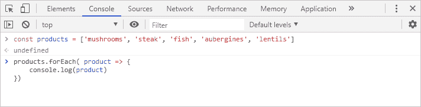
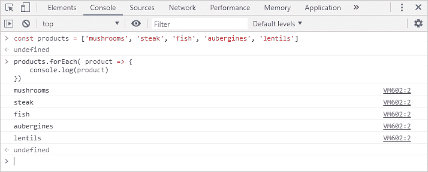

# JavaScript 循环到底是什么？

> 原文：<https://www.freecodecamp.org/news/what-in-the-world-is-a-javascript-loop-for/>

本文是 JavaScript 循环的初学者入门。我们将讨论我们为什么需要它们，以及它们如何适应前端环境。这是访问数据和对数据执行操作的鸟瞰图，涵盖了前端开发人员的基本日常概念。

## 引言。

“所以我们用这个数组，迭代它，处理数据，然后 shazam！”当我第一次开始学习编程时，像这样的短语听起来像神秘的咒语。一种看起来像英语但我无法理解的语言。作为一个非工程背景的人，我无论如何也无法理解一个循环在哪里适合我所要做的事情。以及我为什么需要它。

如今，作为一名前端开发人员，我一直在为这样或那样的事情使用循环。但我没有忘记这一切是多么神秘。我的目的是给没有工程背景的人一个高层次的概述。我们将超越语法，转而关注我们为什么使用循环以及它们是如何组合在一起的真实环境。

在本文中，我们将讨论我们如何访问数据，然后我们如何用**循环来处理数据。**更重要的是，我们将尝试回答**为什么**我们需要这样做。**这和你建立网站和网络应用有什么关系**。

还有一个初学者友好的实用例子。你可以跟着它练习这些概念，并亲自体验它们的实际应用。

### 设置

让我们想象一下，我们正在一个在线平台上工作，这个平台允许我们从一个网站上进行超市购物。这是我们想在这里讨论的东西在现实世界中的应用。

看看我工作的地方罗拉市场(Lola Market)的例子。

假设我们的数据库中存储了许多产品。我们的任务是把这些作为列表显示在网站上。这是一个简单的任务，模拟我们每天在前端做的事情。

## 环

为了讨论循环，我们将使用数组。如果你想重温一下什么是数组，为什么我们需要它，你可以看看我的文章，这篇文章很好地链接到了这里。

[https://www . freecodecamp . org/news/what-in-the-world-is-a-JavaScript-array/](https://www.freecodecamp.org/news/what-in-the-world-is-a-javascript-array/)

简而言之，我们已经从数据库中提取了一些产品。我们将它们打包到一个数组中，并请求将它们放入我们的前端代码中。这是这个数组的样子。

```
['mushrooms', 'steak', 'fish', 'aubergines', 'lentils']
```

Our array of products

一旦我们有了一系列产品，循环就开始了。简单地说，循环是一种获取数组的方式，“打开”它并取出一个元素。交给我们去做我们想做的事情。然后对下一个元素一直重复到数组的末尾。

当我们需要为数据中的每个元素重复相同的代码时，我们使用循环。

### 预备开始

我们想做的是在网站上显示这个产品列表。想象成这样。我们希望大多数网站看起来更复杂。但这只是我们的第一步。


Products list

为了保持这个例子的简单性和对初学者的可访问性，我们将使用**开发工具**来完成所有的工作。除了打开浏览器的开发工具，这不需要任何设置。

我们需要考虑几件事。

*   我们不会调用数据库来获取产品列表。相反，我们将手动键入一个数组，并直接在我们的前端代码中使用它。
*   我们不会在网站上展示产品列表。相反，我们只将列表记录到开发工具控制台中。
*   在现实世界中，我们不会使用你在这里看到的`console.log()`语句。相反，我们需要在网站上显示我们的列表的逻辑将在它的位置。

好的，我们都准备好了。我们走吧。


Photo by [Vanda Teixeira](https://unsplash.com/@vandateixeira?utm_source=ghost&utm_medium=referral&utm_campaign=api-credit) / [Unsplash](https://unsplash.com/?utm_source=ghost&utm_medium=referral&utm_campaign=api-credit)

### 对于每种产品

首先，让我们将我们的循环存储在一个**变量**中。这是为了便于阅读和使用。

```
const products = ['mushrooms', 'steak', 'fish', 'aubergines', 'lentils']
```

现在每次我们使用`products`时，我们实际上是在引用我们的数组。这非常方便，因为我们的数组可以轻松包含数百个产品。

所以，在我们上主菜的时候，让我给你介绍一下`forEach()`
循环。这是它实际运行的样子:

```
products.forEach( product => {
	// do stuff
 })
```

我们现在将一点一点地分解它。首先，让我们将这段代码转换成简单的英语。字面意思是:“以产品数组为例。对于数组中的每个元素，取那个元素，称之为`product`和*对其进行填充*

让我们仔细看看。

```
⬇ARRAY⬇  ⬇LOOP⬇  ⬇CURRENT⬇ ⬇FUNCTION⬇
products.forEach( product => {
	// do stuff
})
```

*   `products`:这是我们的**数组**，包含数据。
*   `.forEach()`:这是我们的数组方法，**循环**。
*   `product`:这是当前选中的元素的**。这是我们的循环从数组中选取并交给我们处理的项。**
*   `=> { }`:这是一个**函数**声明，具体是一个箭头函数。它大致是说“执行下面的代码。”
*   这是实际代码的位置。对数组中的每个元素做一些事情。

关于当前选择的元素，记住两件事是很重要的。首先，`product`是一个变量名。名字本身是我们自己决定的，我们可以叫它`food`或`x`或其他任何名字。然而，如果我们正在处理一个`products`的数组，习惯上使用单数来表示该数组的单个项目:`product`。如果它是一个`animals`的数组，那么我们称它为`animal`。

第二，`product`随着循环的每一轮而变化。每次循环选择一个项目时,`product`就变成这个新的当前选择的项目。

基本上，循环从获取数组中的第一个元素开始，在本例中是“蘑菇”。`product`现指“蘑菇”。然后循环执行函数并运行那里的代码。一旦它完成了，它就返回到数组，并选取下一个元素。`product`不再是“蘑菇”，现在是“牛排”。代码再次执行。这为数组中的每个元素重复**。**

循环进行的每一轮都被称为一次**迭代**。

### 你自己试试

所以让我们试试这个，看看它是如何工作的。继续在浏览器的开发工具中打开控制台。例如，在 Chrome 中，它是 Command + Option + J (Mac)或 Control + Shift + J (Windows)。

*   键入我们保存在变量`const products = ['mushrooms', 'steak', 'fish', 'aubergines', 'lentils']`中的数组。
*   按回车键。你会得到一个`undefined`。这很正常。
*   然后键入我们的循环，这次我们将添加一个`console.log()`作为要执行的代码:

```
products.forEach( product => {
	console.log(product)
})
```

这是它看起来的样子:



The Chrome dev tools console

这里我们想要的是将每次迭代的值`product`打印到控制台。你自己试试。按回车键。

一旦你这么做了，循环就开始了。对于每个产品，它会将当前选择的一个记录到控制台，直到完成阵列中的所有产品。



The loop´s results in the console

仅此而已。我们已经将整个数组打印到控制台上。我们可以用同样的想法操纵 DOM 来显示和修改网站上的内容。或者用数据做无数其他的事情。

如果我们想以不同的方式处理这些数据，而不是对所有产品执行相同的代码，那该怎么办呢？例如，我们想在素食项目旁边显示一个“(v)”。

在下面的文章中，我会解释这一点。我把我们的例子带到下一步，谈谈**条件句**如何让我们做到这一点——看看吧！

[https://www . freecodecamp . org/news/what-in-the-world-is-a-JavaScript-conditional-for/](https://www.freecodecamp.org/news/what-in-the-world-is-a-javascript-conditional-for/)

## 结论

概括地说，一个**循环**获取我们的数据(在本例中是一个数组)并允许我们访问它。然后**对数组中的每个元素进行**迭代，**对每个元素执行**一些代码。

我希望下次你遇到一个循环的时候，你会更容易理解它是如何工作的。这也更清楚为什么您可能需要一个前端环境。

在本文中，我们看到了一个`forEach()`循环。但是除了`forEach()`，还有更多**循环**和**数组方法**要学。从最基本的`for`循环到更高级的方法，如`map()`和`filter()`。这些是非常强大的开发工具，您应该熟悉它们。您会发现自己在处理任何类型的应用程序时都会用到它们。

### 关闭

感谢阅读。我希望你觉得这很有用。如果你喜欢它，分享给大家会非常感谢。如果您有任何问题或意见，我在 [Twitter](https://twitter.com/Syknapse) [@Syknapse](https://twitter.com/Syknapse) 上，我很乐意收到您的来信。


Photo by [Claudia](https://twitter.com/__Santaella)

我叫 Syk，是马德里 [Lola Market](https://twitter.com/Tech_LolaMarket) 的前端开发人员。我从一个不相关的领域转行到了网站开发，所以我试着为那些有类似经历的人创造内容。我的 DMs 总是向需要一些支持的有抱负的 web 开发人员开放。你也可以在[这篇文章中读到我的转变。](https://medium.com/free-code-camp/how-i-switched-careers-and-got-a-developer-job-in-10-months-a-true-story-b8895e855a8b)

[https://www . freecodecamp . org/news/how-I-switched-careers-and-get-a-developer-job-in-10-months-a-true-story-b 8895 e 855 a8b/](https://www.freecodecamp.org/news/how-i-switched-careers-and-got-a-developer-job-in-10-months-a-true-story-b8895e855a8b/)

* * *