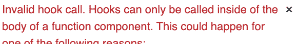

# 如何将 React 挂钩转换为遗留组件的 hoc

> 原文：<https://www.freecodecamp.org/news/react-hooks-to-hocs/>

**超级 TL；博士:**这里？https://github.com/ricokahler/hocify[？是一个将钩子转换成 hoc 的库。](https://github.com/ricokahler/hocify)

场景:您制作了这个漂亮的[定制钩子](https://reactjs.org/docs/hooks-custom.html)，并且您很高兴在您的新函数组件中使用它。然后你意识到这个定制钩子可以用在你的旧的基于类的组件中，所以你试着像这样把它放进去…

```
import React from 'react';
import useCoolCustomHook from './useCoolCustomHook';

class ClassComponent extends React.Component {
  // ...

  render() {
    // ? spoiler alert: this doesn't work
    const coolStuff = useCoolCustomHook();

    return <div>{/* ... */}</div>
  }
}

export default ClassComponent;
```

…但是您会看到以下错误消息:



This is the actual error message you get when you try to use hooks within a class component.

假设这个组件非常复杂，并且已经过充分测试。你不愿意把基于类的组件重写为函数组件，也不愿意把你的定制钩子重写为高阶组件。

在这种情况下你会怎么做？

* * *

**TL；博士，**我写了一个库`hocify`，它将钩子转换成 hoc，这样它们就可以在基于类的组件中使用。

在这里查看图书馆:[https://github.com/ricokahler/hocify](https://github.com/ricokahler/hocify)

然而，如果你好奇我是如何到达那里的，请继续阅读全文！

* * *

钩子很棒！他们是 React 团队对 React today 中许多问题的回答。但是，使用它们有一个先决条件:

> 钩子只能在函数组件的主体内部被调用。

这是不幸的，因为它阻止我们在旧的基于类的组件中使用新的基于钩子的模块。

对我们来说幸运的是，有一些聪明的方法可以解决这个问题。本文将介绍如何将钩子转换成 hoc，以便它们可以在类组件中使用。

> **免责声明:**在类组件中“使用钩子”的目的更多的是为了新的基于钩子的模块与旧的基于类的组件的兼容性。如果你的组件已经被实现为一个函数，那么直接使用钩子。如果你正在写一个新的组件，试着把它写成一个函数组件。

## 示例钩子:useMousePosition

让我们从创建一个想要在类组件中使用的自定义钩子开始。

我们将创建的钩子将捕获屏幕上当前鼠标的`x`和`y`位置，并将其报告给组件。

？`useMousePosition.js`:自定义挂钩

```
import { useState, useEffect } from 'react';

function useMousePosition() {
  const [x, setX] = useState(0);
  const [y, setY] = useState(0);

  useEffect(() => {
    const handleMouseMove = e => {
      setX(e.clientX);
      setY(e.clientY);
    };

    document.addEventListener('mousemove', handleMouseMove);

    return () => {
      document.removeEventListener('mousemove', handleMouseMove);
    };
  }, []);

  return { x, y };
}

export default useMousePosition;
```

？`ExampleComponent.js`:上述挂钩的使用示例

```
import React from 'react';
import useMousePosition from './useMousePosition';

function ExampleComponent() {
  const { x, y } = useMousePosition();

  return <div>Current Mouse Position: ({x}, {y})</div>;
}

export default ExampleComponent;
```

[**见演示。**](https://codesandbox.io/s/boring-babbage-959ow?fontsize=14)

我们将在剩下的例子中使用这个钩子。

## 实现 1:通过包装和道具钻取，可以在类组件中使用钩子。

这个旅程的第一步是弄清楚如何将数据和效果从钩子放到一个类组件中。

钩子只能在函数组件中使用，所以我们的一个选择是用函数组件包装类组件，并传入所需的数据作为道具。

```
import React from 'react';

class ClassComponent extends React.Component {
  render() {
    const { x, y } = this.props;

    return <div>Current Mouse Position: ({x}, {y})</div>;
  }
}

function WrapperComponent() {
  const { x, y } = useMousePosition();

  return <ClassComponent x={x} y={y} />;
}

export default WrapperComponent;
```

[**见演示。**](https://codesandbox.io/s/hocify-example-hook-0lyjx?fontsize=14)

## 实现 2:您可以编写一个函数，它接受一个组件并返回一个包装的组件。

下一步是使这个包装通用化，这样我们就可以将这个钩子应用到任何一个类。

我们可以使用[高阶元件(又名 hoc)](https://reactjs.org/docs/higher-order-components.html)来实现这一点。hoc 是接收一个组件并返回包装输入组件的另一个组件的函数。这种模式允许我们从包装组件向输入组件注入道具。

如果返回的包装组件是使用函数实现的，那么我们可以在那里使用钩子！

```
function withMousePosition(Component) {  
  function WrappedComponent(props) {
    const { x, y } = useMousePosition();

    return <Component x={x} y={y} {...props} />;
  }

  return WrappedComponent;
}

class ClassComponent extends React.Component {
  render() {
    const { x, y } = this.props;

    return <div>Current Mouse Position: ({x}, {y})</div>;
  }
}

export default withMousePosition(ClassComponent);
```

[**见演示。**](https://codesandbox.io/s/hocify-realization-2-qyu09?fontsize=14)

## 实现 3:你可以写一个函数，接受一个钩子并返回一个 HOC。

我们能进一步发展这个想法吗？

是啊！类似于我们如何编写一个返回组件的函数，我们可以更进一步，编写一个接受一个钩子并返回更高阶组件的函数。

下一个代码块是函数`hocify`(这是特设的——类似于`stringify`或`promisify`约定)。

`hocify`是一个函数，它接受一个钩子并返回一个 HOC。

？`hocify.js`

```
import React from 'react';

function hocify(useHook) {
  function hoc(InputComponent) {
    function WrapperComponent(props) {
      const result = useHook();

      return <InputComponent {...result} {...props} />
    }

    return WrapperComponent;
  }

  return hoc;
}

export default hocify;
```

？`ClassComponent.js`中的用法:

```
import React from 'react';
import hocify from 'hocify';
import useMousePosition from './useMousePosition';

const withMousePosition = hocify(useMousePosition);

class ClassComponent extends React.Component {
  render() {
    const { x, y } = this.props;

    return <div>Current Mouse Position: ({x}, {y})</div>;
  }
}

export default withMousePosition(ClassComponent);
```

[**见演示。**](https://codesandbox.io/s/hocify-realization-3-3mmg9?fontsize=14)

> **注意:**称`hocify`为“高阶钩子”或其他一些词语的混搭可能很诱人，但我建议不要这么做？

## 感悟 4:这东西装在包里不是很好吗？

大概吧！

`npm install --save hocify`

在这里查看图书馆:[https://github.com/ricokahler/hocify](https://github.com/ricokahler/hocify)

> **最后一点提示:**这里没有提到库中的一些注意事项。
> 使用前阅读文档。

感谢你的阅读！