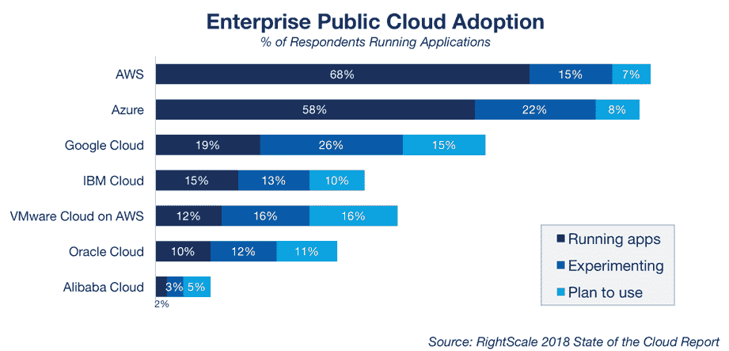
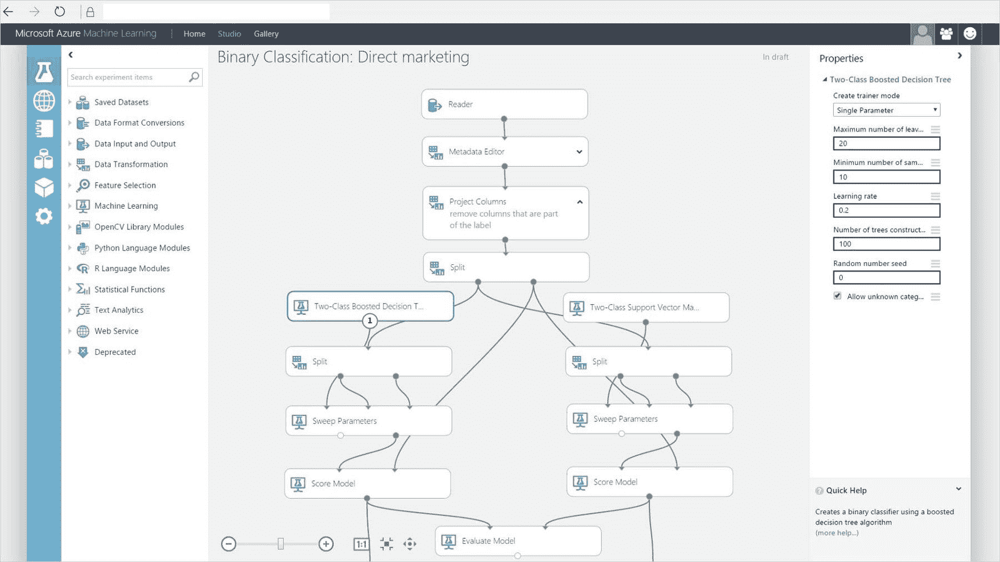
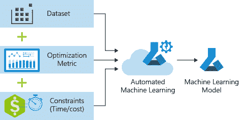
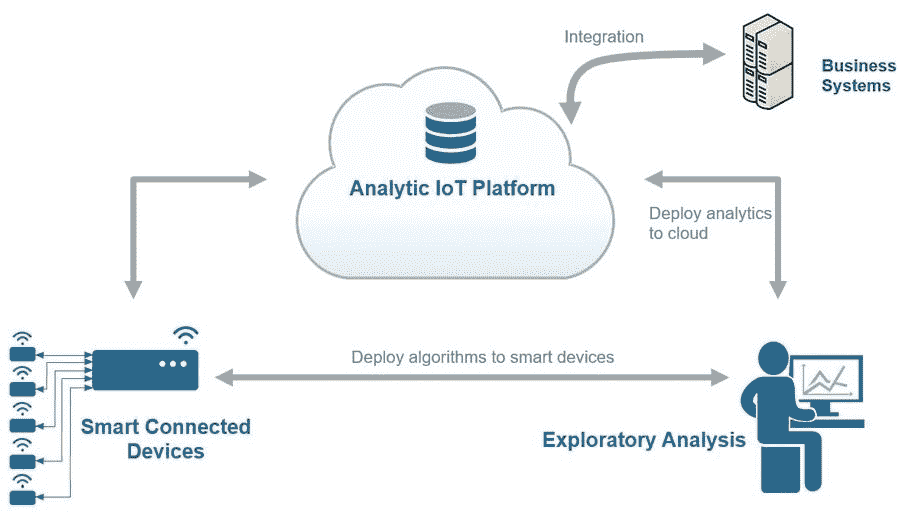

# 人工智能驱动的微软工具简介

> 原文：<https://www.freecodecamp.org/news/ai/>

## **简介**

微软如今是人工智能驱动的云服务的主要提供商之一。事实上，根据 RightScale 在 2018 年进行的一项调查，微软 Azure 云服务目前仅次于亚马逊 AWS(图 1)。

在本文中，我将把微软作为一个案例研究，因为微软首席执行官塞特亚·纳德拉最近分享了微软让人工智能成为其业务重要部分的兴趣[1]。

> **“要成为 it 领域的领导者，仅仅拥有某种我们可以运用的人工智能能力是不够的——你还需要让它民主化的能力，这样每个企业才能真正从中受益。”* -* 塞特亚·纳德拉

Figure 1: 2018 Top Cloud Providers [2]

现在，我将向您介绍一些目前可用的不同的微软工具，以及由 completion 提供的一些替代工具。最后，我们将关注研究的下一步。

## 微软人工智能工具

微软 Azure 目前提供了广泛的服务，可用于创建任何类型的人工智能解决方案。其中一些最重要的是:

*   Azure 机器学习服务
*   Azure 机器学习工作室
*   自动机器学习
*   蔚蓝物联网(IoT)

### Azure 机器学习服务

Azure 机器学习使您能够使用微软云服务创建、训练和测试机器学习和深度学习模型。

通过这种方式，您不必再担心本地机器的内存和计算能力限制，因为所有工作都在微软服务器上执行。

当使用 Azure 机器学习时，所有主要的 Python 库都是预装的(例如 Tensorflow、PyTorch、scikit-learn)，因此将设置时间减少到最小。这使得开发人员能够快速创建新模型，而没有任何类型的约束或环境设置。

### Azure 机器学习工作室

Azure Machine Learning Studio 使用户能够执行机器学习任务，而不需要任何编程经验。

ML 模型的创建和测试仅仅使用一个可视化界面，通过拖放所有的模型组件(图 2)。一旦模型准备好部署到现实世界中，就可以很容易地从 Azure ML Studio 平台中导出。

眼下，Azure Machine Learning Studio 主要适用于聚类、分类和回归任务。此外，如果您愿意，可以在 Azure Machine Learning Studio 中添加 Python 或 R 代码，以添加更多工作流功能。

Figure 2: Binary Classification in Azure Machine Learning Studio [3]

### 自动机器学习

自动机器学习是目前人工智能领域最热门的话题之一。

如今，数据科学家和机器学习工程师花费大量时间试图确定最佳的机器学习模型和超参数，以用于每项不同的预测任务。

AutoML 的目标是通过创建能够正确识别和测试机器学习模型的软件来自动化这一过程(图 3)。

Figure 3: Azure AutoML [4]

自动机器学习仍然是一个大规模开发的领域，它现在可以用于(具有令人满意的结果)有限数量的任务。

AutoMl 目前可以通过微软工具使用 Azure 机器学习或[ML.NET](https://dotnet.microsoft.com/apps/machinelearning-ai/ml-dotnet)来实现。现在，只有分类和预测/回归问题可以使用微软服务解决。

AutoML 可以用 Python 实现，使用诸如 [Auto-sklearn](https://github.com/automl/auto-sklearn) 、 [TPOT](https://github.com/EpistasisLab/tpot) 和 [H2O](http://docs.h2o.ai/h2o/latest-stable/h2o-docs/automl.html) 等库。AutoML 在无监督学习等领域的应用目前仍在开发中。

### 蔚蓝物联网(IoT)

Azure 能够为物联网服务提供预定制和完全可定制的解决方案(图 4)。通过这种方式，Azure 能够为物联网初学者和专家提供解决方案。

微软 Azure 使您能够轻松扩展物联网系统，以包括来自不同制造商的设备，并提供分析和机器学习服务支持。

如果你正在寻找关于物联网将如何改变我们的生活以及如何使用云服务实现它的更详细的解释，请看看我之前的博客文章。

Figure 4: IoT Devices Workflow [5]

## 人工智能研究

微软现在对人工智能表现出了极大的兴趣。眼下，它的一些服务，如 Cortana、Skype 或 Office 365，已经开始广泛使用人工智能。此外，就在 2018 年，微软收购了 5 家人工智能公司。

微软也决定创建一个名为微软人工智能研究院的组织，致力于人工智能产品的未来发展。目前正在研究的一些主要课题是:人工智能中的偏见、伦理和可解释性。

### 人工智能中的偏差

据微软高级研究员里奇·卡鲁阿纳称，微软目前正致力于创造一种偏见检测工具。

每个机器学习模型都使用一些输入数据进行训练。尽管有时输入数据可能包含某种形式的偏差，这可能会损害模型正确做出预测的能力(例如，与另一个类相比，更喜欢一个类)。因此，使用偏差检测工具来测试一个训练好的模型对最小化这种风险有很大的帮助。

与此同时，其他公司，如脸书和 IBM，目前也致力于为他们相应的业务实现类似的工具[6，7]。

### 伦理学

2019 年 4 月，欧盟委员会公布了可信 AI 的[道德准则清单。这些原则，加上之前应用的](https://ec.europa.eu/digital-single-market/en/news/ethics-guidelines-trustworthy-ai) [GDPR(一般数据保护条例)](https://digitalguardian.com/blog/what-gdpr-general-data-protection-regulation-understanding-and-complying-gdpr-data-protection)，为最终用户如何获得公平/公正的产品以及如何保护他们的个人数据定义了一条非常清晰的路径。

谷歌、脸书和微软等大公司已经开始朝着这个方向努力。为了在人工智能应用中保护用户的隐私，已经创建了诸如[差分隐私和联邦学习](https://towardsdatascience.com/ai-differential-privacy-and-federated-learning-523146d46b85)的技术。

> “人工智能带来了巨大的机遇，但也带来了巨大的责任。我们正处于人工智能的那个阶段，我们做出的选择需要基于原则和道德——这是确保我们都想要的未来的最佳方式。”——塞特亚·纳德拉[8]

### 可解释性

人工智能在决策应用(如医学或法律)中的使用最近引起了个人和当局的一些关注。这是因为，当使用复杂的机器学习模型或深度神经网络时，当前不可能(至少在完全程度上)理解算法在必须执行预定任务时执行的决策过程。

这个问题的一个可能的解决方案是可解释的人工智能(XAI)。XAI 的主要目标是让机器自我解释，并减少有偏见的算法的影响。

在过去的几年中，为了使模型更容易解释，已经实现了不同的算法。一些例子是:反向时间注意力模型(RETAIN)，局部可解释模型不可知解释(LIME)和分层相关性传播(LRP)。这些可以使用 Python 库来实现，比如 ELI5、Skater、SHAP 和微软的 InterpretML。

如果你有兴趣了解更多关于可解释人工智能的信息，你可以在这里找到更多信息。

## **联系人**

如果你想了解我最新的文章和项目[，请关注](https://medium.com/@pierpaoloippolito28?source=post_page---------------------------)我并订阅我的[邮件列表](http://eepurl.com/gwO-Dr?source=post_page---------------------------)。以下是我的一些联系人详细信息:

*   [Linkedin](https://uk.linkedin.com/in/pier-paolo-ippolito-202917146?source=post_page---------------------------)
*   [个人博客](https://pierpaolo28.github.io/blog/?source=post_page---------------------------)
*   [个人网站](https://pierpaolo28.github.io/?source=post_page---------------------------)
*   [中等轮廓](https://towardsdatascience.com/@pierpaoloippolito28?source=post_page---------------------------)
*   [GitHub](https://github.com/pierpaolo28?source=post_page---------------------------)
*   [卡格尔](https://www.kaggle.com/pierpaolo28?source=post_page---------------------------)

[封面照片来源](https://2s7gjr373w3x22jf92z99mgm5w-wpengine.netdna-ssl.com/wp-content/uploads/2017/07/MS-Research-AI.png)。

## 文献学

[1]微软首席执行官塞特亚·纳德拉谈人工智能的非凡潜力。福布斯，[鲍勃·埃文斯](https://www.forbes.com/sites/bobevans1/)。访问:[https://www . Forbes . com/sites/bobe vans 1/2018/06/04/Microsoft-CEO-satya-na della-on-the-extreme-potential-of-ai/# 3c 6383162 f](https://www.forbes.com/sites/bobevans1/2018/06/04/microsoft-ceo-satya-nadella-on-the-extraordinary-potential-of-ai/#3c3c6383162f)

[2]2018 年顶级云提供商:AWS，微软，谷歌，IBM，甲骨文，阿里巴巴如何堆叠。ZDNet，[拉里·迪南](https://www.zdnet.com/meet-the-team/us/larry-dignan/)。访问:[https://www . zdnet . com/article/top-cloud-providers-2018-how-AWS-Microsoft-Google-IBM-Oracle-Alibaba-stack-up/](https://www.zdnet.com/article/top-cloud-providers-2018-how-aws-microsoft-google-ibm-oracle-alibaba-stack-up/)

[3]代码自由数据科学微软 Azure 机器学习。访问位置:[https://Gilbert tanner-home page . cdn . prismic . io/Gilbert tanner-home page/b 391 e 301d 2372 a 1c 42 bed 40506 ab 5e 7c 072 bb 3 _ azure-ml-studio-1 . jpg](https://gilberttanner-homepage.cdn.prismic.io/gilberttanner-homepage/b391e301d2372a1c42bed40506a6ab5e7c072bb3_azure-ml-studio-1.jpg)

[4]教程:使用自动机器学习来预测出租车费用。Microsoft Azure 文档。访问地址:[https://docs . Microsoft . com/en-us/azure/machine-learning/service/tutorial-auto-train-models](https://docs.microsoft.com/en-us/azure/machine-learning/service/tutorial-auto-train-models)

[5]智能设备和分析刺激了物联网的创新。埃里克·维特金，数学工作室的。访问网址:[https://www . mathworks . com/company/newslettes/articles/smart-devices-and-analytics-spur-innovation-in-the-internet-of-things . html](https://www.mathworks.com/company/newsletters/articles/smart-devices-and-analytics-spur-innovation-in-the-internet-of-things.html)

[6]微软创造工具清除人工智能偏见。多米尼克·亚当斯，数字。访问时间:[https://digit.fyi/microsoft-ai-bias-detection/](https://digit.fyi/microsoft-ai-bias-detection/)

[7] IBM 推出旨在检测人工智能偏见的工具。英国广播公司的佐伊·克莱曼。访问时间:[https://www.bbc.co.uk/news/technology-45561955](https://www.bbc.co.uk/news/technology-45561955)

[8]发布道德可信人工智能指南。[Cornelia Kutterer——欧盟政府事务、人工智能、隐私&数字政策、微软](https://blogs.microsoft.com/eupolicy/author/corneliakutterer/)高级总监。访问:[https://blogs . Microsoft . com/eu policy/2019/04/09/ethical-guidelines-trust worthy-ai/](https://blogs.microsoft.com/eupolicy/2019/04/09/ethical-guidelines-trustworthy-ai/)