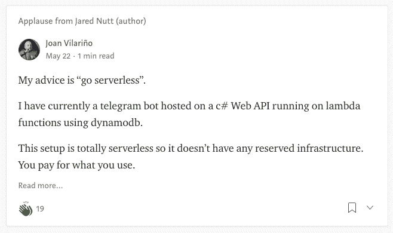
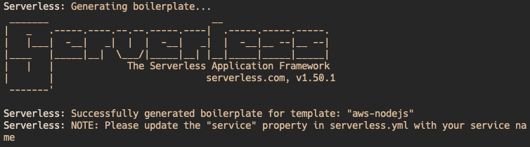
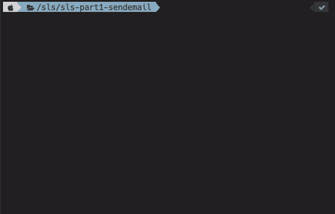
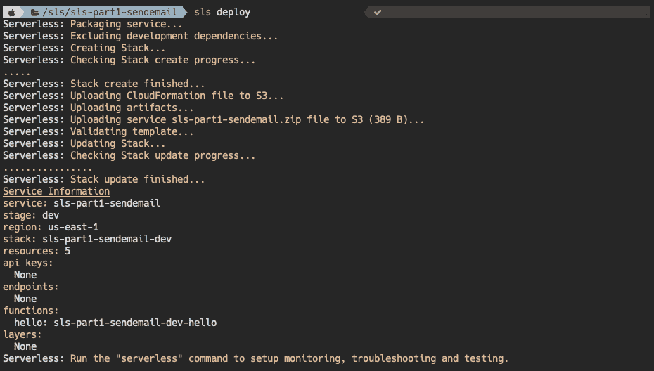
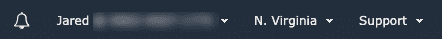
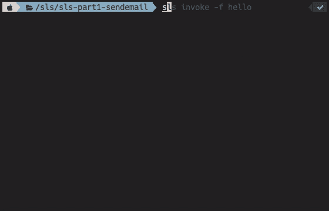
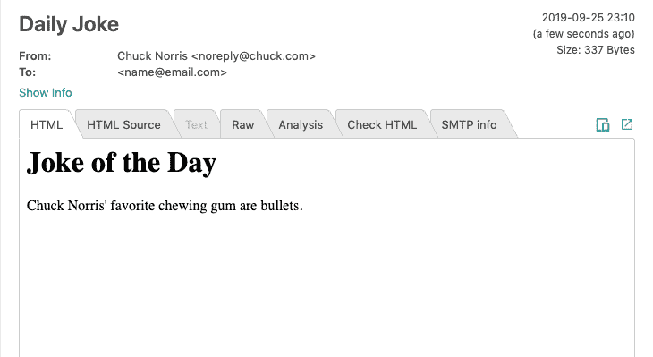

# 实用无服务器:如何给自己发电子邮件查克·诺里斯笑话

> 原文：<https://www.freecodecamp.org/news/serverless-use-case-sending-yourself-an-e-mail/>

## 前页

无服务器是近来越来越流行的术语之一。事实上，当我写一篇关于我的 AWS 架构的文章时，有几个人提到了去无服务器化。



实际上，无服务器并不意味着没有服务器，但是正如 T2 的保罗·比格所说:

> "..无服务器中有服务器...你就是不用去想。”

[https://giphy.com/embed/l0K4b3pJqjWMyF6JG](https://giphy.com/embed/l0K4b3pJqjWMyF6JG)

无服务器是一个时髦的词，并不是指一个特定的框架，然而，我发现[无服务器框架](https://serverless.com/)是最简单的入门方法。

*注:为了简洁起见， **sls** 与[无服务器框架](https://serverless.com/)同义。*

## 先决条件

老实说，无服务器框架的文档非常好，在这里重新创建它们是有害的。因此，为了保持这篇文章的重点突出，我将把重点放在快速入门指南之外的东西上。我在下面列出了 AWS 特有的内容:

[无服务器 AWS 快速入门指南](https://serverless.com/framework/docs/providers/aws/guide/quick-start/)

[开始使用无服务器框架和 AWS](https://serverless.com/framework/docs/providers/aws/guide/credentials/)

如果您从未使用过无服务器，我建议您先阅读这些内容。

或者，您可以在下面我的入门视频中与我一起编写代码:

[https://www.youtube.com/embed/sYGE0zQ8tCQ?feature=oembed](https://www.youtube.com/embed/sYGE0zQ8tCQ?feature=oembed)

[https://giphy.com/embed/lz5t2GlcU6CskRIxNI](https://giphy.com/embed/lz5t2GlcU6CskRIxNI)

## 词汇

围绕着 **sls** 有很多术语会混淆所指的内容。这里有几个关键术语:

服务:我对服务的理解是，它是从一个地方提供服务的代码集合。可以包含一个或多个函数。

**阶段:**这是你正在运行的环境的什么“类型”。通常它会被分为“开发”和“生产”。舞台是服务的一个变量。

**函数:**被调用时执行的一段代码。哇，多好的描述啊。这对任何编程人员来说都不陌生，但是了解函数和服务之间的关系是很重要的。服务可以包含一个或多个功能。

**提供商:**简单来说，就是部署您的服务的地方，例如 AWS、GCP 等。

### 更深的潜水

我发现了这篇精彩的文章，它深刻地解释了什么是无服务器，如果你想了解更多信息:

[https://dev.to/sosnowski/anatomy-of-aws-lambda-1i1e](https://dev.to/sosnowski/anatomy-of-aws-lambda-1i1e)

## 我们正在建造的东西

我们要做一个功能，从互联网上抓取一个笑话，并通过电子邮件发送给我们自己。

### 它是这样的

1.  从 API 提取数据。
2.  创建电子邮件模板。
3.  发送电子邮件模板。
4.  利润。

### 工具

*   无服务器框架
*   AWS 帐户(可选)
*   AWS CLI
*   NPM
*   节点邮件程序

如果你喜欢通过视频学习，请点击这里查看本文的视频版本:

[https://www.youtube.com/embed/bZpC9xaKU9k?feature=oembed](https://www.youtube.com/embed/bZpC9xaKU9k?feature=oembed)

## 建造这个东西

### 工具作业

sls 的工具非常简单。我使用的是无服务器和 npm CLIs。如果你没有安装 npm，[先安装它](https://changelog.com/posts/install-node-js-with-homebrew-on-os-x)。然后运行:

`npm i -g serverless`

### 初始化

从模板开始通常是个好主意。在[无服务器 aws 示例](https://serverless.com/framework/docs/providers/aws/examples/)页面上有一堆。

对于这个项目，我通过在终端中运行以下命令来使用 aws-nodejs 模板:

```
serverless create --template aws-nodejs --path my-service
```

注意:如果你不提供路径标志，它将在你当前所在的文件夹中初始化这个项目。



ASCII Art is the Best Art

如果您签出目录，其中应该有三个文件:

*   `handler.js`
*   `serverless.yml`
*   `.gitignore`

如果您运行`sls invoke local -f hello`，您应该得到一个带有成功消息的响应。



### 部署

通常应用程序的部署会留到教程的最后，但 sls 不会。对于[无服务器快速入门指南](https://serverless.com/framework/docs/providers/aws/guide/quick-start/)，这是步骤 2。

我非常欣赏这种方法，因为我更喜欢在开发过程中尽早开始部署部分。就个人而言，我认为当您有几条路线时，让部署工作起来要容易得多。

**供应商**

所以，现在出现了一个大问题...我们要把这东西部署在哪里？对于本教程，我将使用 AWS，但是您可以使用您喜欢的任何服务。

以下是作为提供商设置 AWS 的快速入门:[无服务器 AWS 快速入门指南](https://serverless.com/framework/docs/providers/aws/guide/quick-start/)。

***无服务器企业***

在他们的网站上还不清楚企业版的定价是多少。但是，一旦您注册，他们会给您发送一封电子邮件，内容如下:

> 无服务器框架免费层包括您更有效地开发和排除无服务器应用程序故障所需的一切。您获得了对无服务器框架企业控制台的完全访问权限，但是每月只能调用 1，000 次函数。如果您有兴趣将无服务器框架企业的使用扩展到免费层之外[，请联系我们](https://serverless-289f5d947191.intercom-mail.com/via/e?ob=cY7cHS%2BZj2VcQFfJ784nQVM8V6MMQueJzyEgtPxcKEcydcqbYBJd1OePOwyM01xR&h=4c812da8d71e5f78f9ff82836acbf93df5fe7fb5-22378777535&l=a31459550e6f3973d9146212384178952e265336-984217)了解有关可用计划和价格的详细信息。

**部署东西**

设置好凭证后，只需在终端中运行`sls deploy`命令。



This screen gives a lot of info (much appreciated), but what does it mean?

在输入那个命令后，最让我困惑的事情是想知道…它去了哪里？

[https://giphy.com/embed/26DNdV3b6dqn1jzR6](https://giphy.com/embed/26DNdV3b6dqn1jzR6)

在 AWS 的情况下，它会创建一个 CloudFormation 堆栈，为您管理这个**服务**。AWS 称其为一个**应用**。要了解刚刚发生了什么，请查看 AWS 上的 [Lambda 控制台。您应该会看到刚刚部署的函数。](https://console.aws.amazon.com/lambda/)


如果没有显示，请检查以确保您在正确的区域。默认地区是美国东部 1 号(北弗吉尼亚)。可以通过右上角的下拉菜单进行更改:



**测试一下**

要确保它工作正常，只需在终端中运行`sls invoke -f hello`。您应该会得到和以前一样的响应，但是这次是来自云！



### 地方发展

[W](https://nodemon.io/) e 已经用`sls invoke local -f hello`在本地测试过一次。如果你正在做一些更复杂的事情，并且想要一个 nodemon 风格的代码更新，看看[无服务器离线](https://www.npmjs.com/package/serverless-offline)。

## 开始写吧！

现在我们已经有了项目设置，让我们开始写一些实际的代码吧！

再次打开`serverless.yml`文件，让我们做一些修改。

```
functions:
  sendEmail:
    handler:
     emailHandler.sendEmail
  hello:
    handler: handler.hello
```

serverless.yml

首先，我们添加了一个新的函数和一个新的处理程序。该处理程序引用了根目录中一个名为 emailHandler 的文件(该文件尚不存在)。我们去创造它吧！

```
// emailHandler.js
module.exports.sendEmail = async event => {
  return {
    statusCode: 400,
    body: JSON.stringify(
      {
        message: 'Email sent!',
      },
      null,
      2,
    ),
  };
};
```

如果您通过`sls invoke local -f sendEmail`调用该函数，您应该得到:

```
{
    "statusCode": 400,
    "body": "{\n  \"message\": \"Email sent!\"\n}"
}
```

好吧，让我们做点更有用的事情。我偶然发现了这个提供 Chuck Norris 笑话的 API，它非常适合这个小教程。

```
// emailHandler.js
module.exports.sendEmail = async event => {
  // grab the joke from the API
  const response = await fetch('https://api.chucknorris.io/jokes/random');
  //  grab the JSON
  const joke = await response.json();
  return {
    statusCode: 400,
    body: JSON.stringify(
      {
        message: joke.value,
      },
      null,
      2,
    ),
  };
};
```

太棒了。现在我们开始开玩笑了！让我们构建电子邮件部分。

### 环境变量

在我们深入讨论这件事之前，你可能已经意识到我们需要获取一些秘密。假设我们不希望世界拥有我们的 API 密匙。

[https://giphy.com/embed/5UzXVV0RDlkTyYdvlY](https://giphy.com/embed/5UzXVV0RDlkTyYdvlY)

**阶段**

通常，每当使用节点应用程序时，节点环境将决定它是“开发”还是“生产”。在 sls 中，这是由附加到提供者的“stage”标签决定的。

来自[无服务器堆栈](https://serverless-stack.com/chapters/stages-in-serverless-framework.html)的精彩解释:

> 无服务器框架允许您为要部署到的项目创建阶段。阶段对于创建测试和开发环境非常有用。通常，您会创建一个独立于生产环境的临时环境。这允许您测试并确保您将要部署的代码版本是良好的。

### 排列秘密

在根目录下创建`env.yml`。

请确保将其添加到。gitignore

加入我们的变量。

```
# Add the environment variables for the various stages
prod:
  MAIL_HOST: ""
  MAIL_PORT: 2525
  MAIL_USER: ""
  MAIL_PASS: ""
dev:
  MAIL_HOST: ""
  MAIL_PORT: 2525
  MAIL_USER: ""
  MAIL_PASS: "" 
```

参考`serverless.yml`中的变量

```
provider:
  name: aws
  runtime: nodejs10.x
  stage: dev
  environment:
    MAIL_HOST: ${file(env.yml):${self:provider.stage}.MAIL_HOST}
    MAIL_PORT: ${file(env.yml):${self:provider.stage}.MAIL_PORT}
    MAIL_USER: ${file(env.yml):${self:provider.stage}.MAIL_USER}
    MAIL_PASS: ${file(env.yml):${self:provider.stage}.MAIL_PASS} 
```

是的，这是一个相当疯狂的长队，但基本上它只是说:

读取文件(env.yml) ->使用我们正在运行的阶段(dev) ->使用与该阶段相关联的变量

要进一步阅读关于秘密加载的主题:查看这篇文章: [**从 env.yml**](https://serverless-stack.com/chapters/load-secrets-from-env-yml.html) 加载秘密

### 发送电子邮件

为了简单起见，我将使用[邮件陷阱](https://mailtrap.io/)。这是一个测试电子邮件的神奇工具，它不需要你设置电子邮件服务器。

**安装 nodemailer**

为了安装 nodemailer，您需要初始化一个 npm 项目。继续，通过命令行来完成:

```
npm init -y
```

然后安装 nodemailer

```
npm i nodemailer
```

**添加您的 API 密钥**

从 Mailtrap 的演示收件箱中获取您的 API 密钥，并添加到您的`env.yml`

要发送邮件，我们将使用 nodemailer。下面是 Mailtrap + nodemailer 的代码:

```
const nodemailer = require('nodemailer');
// grab the variables from the process
const { MAIL_HOST, MAIL_PORT, MAIL_USER, MAIL_PASS } = process.env;

// create the transport
const transport = nodemailer.createTransport({
  host: MAIL_HOST,
  port: MAIL_PORT,
  auth: {
    user: MAIL_USER,
    pass: MAIL_PASS,
  },
});

module.exports.sendEmail = async event => {
  // grab the joke from the API
  const response = await fetch('https://api.chucknorris.io/jokes/random');
  //  grab the JSON
  const joke = await response.json();
  // create HTML template
  const html = `
	<h1>Joke of the Day</h1>
	<p>${joke.value}</p>
	`;

  // send mail with our transport object
  let info = await transport.sendMail({
    from: '"Chuck Norris" <noreply@chuck.com>', // sender address
    to: 'name@email.com', // list of receivers
    subject: 'Daily Joke', // Subject line
    html, // html body
  });

  return {
    statusCode: 400,
    body: JSON.stringify(
      {
        message: joke.value,
      },
      null,
      2,
    ),
  };
}; 
```

如果一切顺利，调用 local 并检查您的邮件陷阱。

`sls invoke local -f sendEmail`

```
{
    "statusCode": 400,
    "body": "{\n  \"message\": \"Chuck Norris' favorite chewing gum are bullets.\"\n}"
}
```

Message from Command Line



View in Mailtrap

[https://giphy.com/embed/2fQ1Gq3KOpvNs4NTmu](https://giphy.com/embed/2fQ1Gq3KOpvNs4NTmu)

## 下一步是什么

这篇文章有点长，所以我就讲到这里。然而，在下一个版本的*实用无服务器*中，我将包括连接到一个数据库(不像它应该的那样容易)和通过一个 cron 设置自动功能运行(比听起来容易得多！).

## 最后的想法

我会让你决定给自己发送笑话的实用性，但我认为它的用途不仅限于诺里斯先生。这是名为*实用无服务器系列的第 1 部分。*如果您有建议要添加，请添加！

一如既往，编码快乐！

## 代码回购

[https://github.com/DarthOstrich/sls-part1-sendemail](https://github.com/DarthOstrich/sls-part1-sendemail)

## 资源

[https://serverless.com/learn/use-cases/](https://serverless.com/learn/use-cases/)

[https://serverless.com/framework/docs/getting-started/](https://serverless.com/framework/docs/getting-started/)

[https://medium . com/a-man-with-no-server/running-AWS-lambda-and-API-gateway-locally-server less-offline-3c 64 B3 e 54772](https://medium.com/a-man-with-no-server/running-aws-lambda-and-api-gateway-locally-serverless-offline-3c64b3e54772)