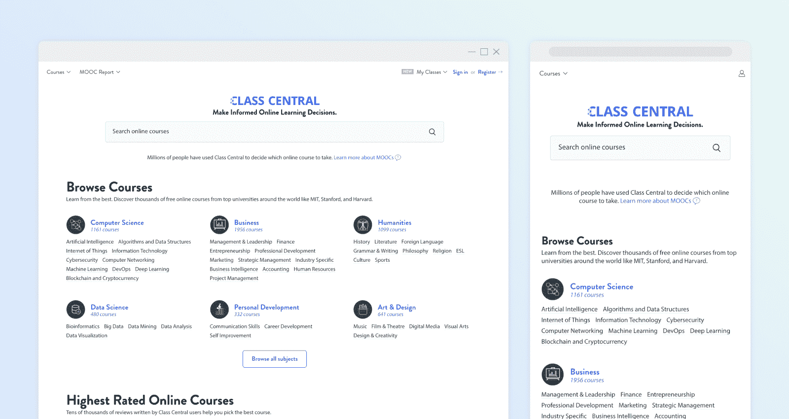

# 550+免费在线编程和计算机科学课程，您可以在今年 10 月开始学习

> 原文：<https://www.freecodecamp.org/news/550-free-online-programming-computer-science-courses-you-can-start-this-october/>

七年前，像麻省理工和斯坦福这样的大学首次向公众开放免费在线课程。今天，全球近 1000 所学校已经创建了数以千计的免费在线课程，俗称大规模开放在线课程或 T2 mooc T3。

我整理了一份 550 多门免费在线课程的清单，你可以在这个月开始学习。为此，我利用了 [Class Central](https://www.classcentral.com/) 超过 13，000 个[在线课程的数据库](https://www.classcentral.com/)。我还包括了每门课程的平均评分。

[Class Central](https://www.classcentral.com/)'s Homepage

我根据难度将这些课程分为以下几类:

*   新手
*   中间的
*   先进的

首次开设的课程标记为 ****【新】**** 。

这些课程中有许多是完全自定进度的。其余的将在不同的时间开始。你可以在 Class Central 的[计算机科学](https://www.classcentral.com/subject/cs)、[数据科学](https://www.classcentral.com/subject/data-science)和[编程](https://www.classcentral.com/subject/programming-and-software-development)主题页面上找到 2019 年晚些时候开始的技术相关课程的完整列表。

我知道这是一个很长的列表，可能会让编程新手望而生畏。在这种情况下，你可能会发现大卫·文丘里(David Venturi)推荐的最佳[数据科学在线课程](https://www.classcentral.com/report/best-data-science-curriculum/)很有用——即使你不打算学习数据科学。我希望将来能创造更多这样的指南。

最后，如果你不知道如何注册免费的 Coursera 课程，不要担心——我也写了一篇关于如何注册的文章。

## 初学者(133)

*   [Python 交互式编程入门(上)](https://www.classcentral.com/course/interactivepython1-408?utm_source=fcc_medium&utm_medium=web&utm_campaign=cs_programming_october_2019)来自*莱斯大学*★★★★(2909)
*   [计算机科学入门及使用 Python 编程](https://www.classcentral.com/course/edx-introduction-to-computer-science-and-programming-using-python-1341?utm_source=fcc_medium&utm_medium=web&utm_campaign=cs_programming_october_2019)来自*麻省理工*★★★★(99)
*   [学习编程:多伦多*大学的基础*](https://www.classcentral.com/course/programming1-385?utm_source=fcc_medium&utm_medium=web&utm_campaign=cs_programming_october_2019)★★★★(86)
*   [CS50 的计算机科学入门](https://www.classcentral.com/course/edx-cs50-s-introduction-to-computer-science-442?utm_source=fcc_medium&utm_medium=web&utm_campaign=cs_programming_october_2019)来自*哈佛大学*★★★★(53)
*   [Ruby on Rails:简介](https://www.classcentral.com/course/ruby-on-rails-intro-4258?utm_source=fcc_medium&utm_medium=web&utm_campaign=cs_programming_october_2019)来自*约翰霍普金斯大学* ★★★☆☆(50)
*   [Linux 简介](https://www.classcentral.com/course/edx-introduction-to-linux-1857?utm_source=fcc_medium&utm_medium=web&utm_campaign=cs_programming_october_2019)来自 *Linux 基金会*★★★☆(34)
*   [【新】CS50 律师](https://www.classcentral.com/course/edx-cs50-for-lawyers-16857?utm_source=fcc_medium&utm_medium=web&utm_campaign=cs_programming_october_2019)来自*哈佛大学*
*   [【新】区块链](https://www.classcentral.com/course/uciblockchain-16866?utm_source=fcc_medium&utm_medium=web&utm_campaign=cs_programming_october_2019)来自*加州大学欧文分校*
*   [【新】来自*加州大学欧文分校的区块链系统*](https://www.classcentral.com/course/blockchain-system-16867?utm_source=fcc_medium&utm_medium=web&utm_campaign=cs_programming_october_2019)
*   [【新】C 给大家:基础](https://www.classcentral.com/course/c-for-everyone-16909?utm_source=fcc_medium&utm_medium=web&utm_campaign=cs_programming_october_2019)来自*加州大学圣克鲁斯*
*   [【新】AWS 机器学习入门](https://www.classcentral.com/course/aws-machine-learning-16924?utm_source=fcc_medium&utm_medium=web&utm_campaign=cs_programming_october_2019)来自*亚马逊网络服务*
*   [HTML 和 CSS 简介](https://www.classcentral.com/course/udacity-intro-to-html-and-css-2659?utm_source=fcc_medium&utm_medium=web&utm_campaign=cs_programming_october_2019)
*   [VBA/Excel 编程入门](https://www.classcentral.com/course/open-education-by-blackboard-introduction-to-vba-excel-programming-1797?utm_source=fcc_medium&utm_medium=web&utm_campaign=cs_programming_october_2019)来自*Cal Poly Pomona*★★★☆(21)
*   [从第一原理构建现代计算机:从 Nand 到 Tetris(以项目为中心的课程)](https://www.classcentral.com/course/build-a-computer-3234?utm_source=fcc_medium&utm_medium=web&utm_campaign=cs_programming_october_2019)来自*耶路撒冷希伯来大学*★★★★(14)
*   [编程基础](https://www.classcentral.com/course/edx-programming-basics-1650?utm_source=fcc_medium&utm_medium=web&utm_campaign=cs_programming_october_2019)来自*印度理工学院孟买* ★★☆☆☆(13)
*   [计算机科学 101](https://www.classcentral.com/course/stanford-openedx-computer-science-101-2175?utm_source=fcc_medium&utm_medium=web&utm_campaign=cs_programming_october_2019) 来自*斯坦福大学*★★★☆(11)
*   [数字媒体创意编程&移动应用](https://www.classcentral.com/course/digitalmedia-529?utm_source=fcc_medium&utm_medium=web&utm_campaign=cs_programming_october_2019)来自*伦敦大学国际课程*★★★☆(10)
*   [HTML5 编码要点和最佳实践](https://www.classcentral.com/course/edx-html5-coding-essentials-and-best-practices-3444?utm_source=fcc_medium&utm_medium=web&utm_campaign=cs_programming_october_2019)来自*万维网联盟(W3C)*★★★☆(9)
*   [计算机网络入门](https://www.classcentral.com/course/stanford-openedx-introduction-to-computer-networking-1578?utm_source=fcc_medium&utm_medium=web&utm_campaign=cs_programming_october_2019)来自*斯坦福大学*★★★★(8)
*   [物联网和嵌入式系统介绍](https://www.classcentral.com/course/iot-4338?utm_source=fcc_medium&utm_medium=web&utm_campaign=cs_programming_october_2019)来自*加州大学欧文分校*★★★☆(8)
*   [可用证券](https://www.classcentral.com/course/usablesec-1727?utm_source=fcc_medium&utm_medium=web&utm_campaign=cs_programming_october_2019)来自*马里兰大学，学院公园* ★★★☆☆(8)
*   [Bootstrap 简介——来自*微软*的教程](https://www.classcentral.com/course/edx-introduction-to-bootstrap-a-tutorial-3338?utm_source=fcc_medium&utm_medium=web&utm_campaign=cs_programming_october_2019)★★★☆☆(8)
*   [自己编码！爱丁堡*大学*★★★☆(7)编程入门](https://www.classcentral.com/course/codeyourself-2938?utm_source=fcc_medium&utm_medium=web&utm_campaign=cs_programming_october_2019)
*   [HTML、CSS 和 Javascript 面向 Web 开发者](https://www.classcentral.com/course/html-css-javascript-for-web-developers-4270?utm_source=fcc_medium&utm_medium=web&utm_campaign=cs_programming_october_2019)来自*约翰·霍普金斯大学*★★★★(6)
*   [学习编程:来自多伦多*大学的*](https://www.classcentral.com/course/programming2-390?utm_source=fcc_medium&utm_medium=web&utm_campaign=cs_programming_october_2019)★★★★(6)
*   [关系数据库简介](https://www.classcentral.com/course/udacity-intro-to-relational-databases-3253?utm_source=fcc_medium&utm_medium=web&utm_campaign=cs_programming_october_2019)
*   [计算机编程范例-基础](https://www.classcentral.com/course/edx-paradigms-of-computer-programming-fundamentals-2298?utm_source=fcc_medium&utm_medium=web&utm_campaign=cs_programming_october_2019)来自*卢万天主教大学*★★★★(4)
*   [计算机编程范例——抽象和并发](https://www.classcentral.com/course/edx-paradigms-of-computer-programming-abstraction-and-concurrency-2630?utm_source=fcc_medium&utm_medium=web&utm_campaign=cs_programming_october_2019)来自*卢万天主教大学*★★★☆(4)
*   [jQuery 简介](https://www.classcentral.com/course/edx-introduction-to-jquery-4062?utm_source=fcc_medium&utm_medium=web&utm_campaign=cs_programming_october_2019)来自*微软*★★★☆(4)
*   [从零开始编程](https://www.classcentral.com/course/edx-programming-in-scratch-2954?utm_source=fcc_medium&utm_medium=web&utm_campaign=cs_programming_october_2019)来自*哈维·马德学院*★★★★(4)
*   如何在一个周末创建一个网站！(以项目为中心的课程)来自*纽约州立大学*★★★★(3)
*   [加州大学洛杉矶分校*的 p5.js*](https://www.classcentral.com/course/kadenze-introduction-to-programming-for-the-visual-arts-with-p5-js-3770?utm_source=fcc_medium&utm_medium=web&utm_campaign=cs_programming_october_2019) 视觉艺术编程入门★★★☆(3)
*   [HTML5 和 CSS 基础](https://www.classcentral.com/course/edx-html5-and-css-fundamentals-5764?utm_source=fcc_medium&utm_medium=web&utm_campaign=cs_programming_october_2019)来自*万维网联盟(W3C)*★★★☆(3)
*   [Linux 命令行基础知识](https://www.classcentral.com/course/udacity-linux-command-line-basics-4049?utm_source=fcc_medium&utm_medium=web&utm_campaign=cs_programming_october_2019)
*   [计算的美丽和快乐——AP CS 原理第 1 部分](https://www.classcentral.com/course/edx-the-beauty-and-joy-of-computing-ap-cs-principles-part-1-2525?utm_source=fcc_medium&utm_medium=web&utm_campaign=cs_programming_october_2019)来自*加州大学伯克利分校*★★★★(2)
*   [面向对象编程](https://www.classcentral.com/course/edx-object-oriented-programming-1651?utm_source=fcc_medium&utm_medium=web&utm_campaign=cs_programming_october_2019)来自*印度孟买理工学院*★★★☆(2)
*   [智能手机内部的计算技术](https://www.classcentral.com/course/edx-the-computing-technology-inside-your-smartphone-2809?utm_source=fcc_medium&utm_medium=web&utm_campaign=cs_programming_october_2019)来自*康乃尔大学*★★★★(2)
*   [HTML 和 JavaScript 简介](https://www.classcentral.com/course/edx-introduction-to-html-and-javascript-5923?utm_source=fcc_medium&utm_medium=web&utm_campaign=cs_programming_october_2019)来自*微软*★★★★(2)
*   [思考。创造。代码](https://www.classcentral.com/course/edx-think-create-code-3231?utm_source=fcc_medium&utm_medium=web&utm_campaign=cs_programming_october_2019)来自*阿德莱德大学*★★★★(2)
*   [面向所有人的 CS:计算机科学和 Python 编程入门](https://www.classcentral.com/course/edx-cs-for-all-introduction-to-computer-science-and-python-programming-3483?utm_source=fcc_medium&utm_medium=web&utm_campaign=cs_programming_october_2019)来自*哈维·马德学院*★★★★(2)
*   [计算:艺术、魔法、科学](https://www.classcentral.com/course/edx-computing-art-magic-science-2195?utm_source=fcc_medium&utm_medium=web&utm_campaign=cs_programming_october_2019)来自*ETH Zurich*★★★☆(1)
*   [MyCS:计算机科学初学者](https://www.classcentral.com/course/edx-mycs-computer-science-for-beginners-2957?utm_source=fcc_medium&utm_medium=web&utm_campaign=cs_programming_october_2019)来自*哈维·马德学院* ★★★☆☆(1)
*   [CS50 的 AP 计算机科学原理](https://www.classcentral.com/course/edx-cs50-s-ap-computer-science-principles-7017?utm_source=fcc_medium&utm_medium=web&utm_campaign=cs_programming_october_2019)来自*哈佛大学*
*   [来自*哈佛大学*的 CS50 用 Python 和 JavaScript 的 Web 编程](https://www.classcentral.com/course/edx-cs50-s-web-programming-with-python-and-javascript-11506?utm_source=fcc_medium&utm_medium=web&utm_campaign=cs_programming_october_2019)
*   [CS50 与 React Native 的移动应用开发](https://www.classcentral.com/course/edx-cs50-s-mobile-app-development-with-react-native-11505?utm_source=fcc_medium&utm_medium=web&utm_campaign=cs_programming_october_2019)来自*哈佛大学*
*   [CS50 的游戏开发入门](https://www.classcentral.com/course/edx-cs50-s-introduction-to-game-development-11504?utm_source=fcc_medium&utm_medium=web&utm_campaign=cs_programming_october_2019)来自*哈佛大学*
*   来自*哈佛大学*的
*   [CS50 的理解技术](https://www.classcentral.com/course/edx-cs50-s-understanding-technology-10142?utm_source=fcc_medium&utm_medium=web&utm_campaign=cs_programming_october_2019)来自*哈佛大学*
*   [计算原理](https://www.classcentral.com/course/stanford-openedx-principles-of-computing-6114?utm_source=fcc_medium&utm_medium=web&utm_campaign=cs_programming_october_2019)来自*斯坦福大学*
*   [黑客工具](https://www.classcentral.com/course/independent-hacker-tools-13160?utm_source=fcc_medium&utm_medium=web&utm_campaign=cs_programming_october_2019)来自*麻省理工*
*   [计算的美丽和快乐——AP CS 原理第二部分](https://www.classcentral.com/course/edx-the-beauty-and-joy-of-computing-ap-cs-principles-part-2-2532?utm_source=fcc_medium&utm_medium=web&utm_campaign=cs_programming_october_2019)来自*加州大学柏克莱分校*
*   [解决问题的计算思维](https://www.classcentral.com/course/computational-thinking-problem-solving-12278?utm_source=fcc_medium&utm_medium=web&utm_campaign=cs_programming_october_2019)来自*宾夕法尼亚大学*
*   [Unix 工作台](https://www.classcentral.com/course/unix-8866?utm_source=fcc_medium&utm_medium=web&utm_campaign=cs_programming_october_2019)来自*约翰·霍普金斯大学*
*   [计算机科学:有目的的编程](https://www.classcentral.com/course/cs-programming-java-13151?utm_source=fcc_medium&utm_medium=web&utm_campaign=cs_programming_october_2019)来自*普林斯顿大学*
*   [国际化和本地化介绍](https://www.classcentral.com/course/edx-introduction-to-internationalization-and-localization-14385?utm_source=fcc_medium&utm_medium=web&utm_campaign=cs_programming_october_2019)来自*华盛顿大学*
*   [网络安全介绍](https://www.classcentral.com/course/edx-introduction-to-cybersecurity-8651?utm_source=fcc_medium&utm_medium=web&utm_campaign=cs_programming_october_2019)来自*华府大学*
*   [软件工程:简介](https://www.classcentral.com/course/edx-software-engineering-introduction-8205?utm_source=fcc_medium&utm_medium=web&utm_campaign=cs_programming_october_2019)来自*不列颠哥伦比亚大学*
*   圣彼得堡国立理工大学的базы данных
*   [使用 Wordpress 的网页开发和设计](https://www.classcentral.com/course/kadenze-web-development-and-design-using-wordpress-6408?utm_source=fcc_medium&utm_medium=web&utm_campaign=cs_programming_october_2019)来自*加州艺术学院*
*   [网络安全经济学](https://www.classcentral.com/course/edx-cyber-security-economics-2680?utm_source=fcc_medium&utm_medium=web&utm_campaign=cs_programming_october_2019)来自*代尔夫特理工大学*
*   [Scratch:来自*代尔夫特理工大学*的程序员 voor kinderen (8+)](https://www.classcentral.com/course/edx-scratch-programmeren-voor-kinderen-8-6564?utm_source=fcc_medium&utm_medium=web&utm_campaign=cs_programming_october_2019)
*   [Excel/VBA 创造性解决问题，第二部分](https://www.classcentral.com/course/excel-vba-for-creative-problem-solving-p-9943?utm_source=fcc_medium&utm_medium=web&utm_campaign=cs_programming_october_2019)来自*科罗拉多大学博尔德分校*
*   来自*莫斯科物理技术学院的*
*   T0 物联网应用设计基础 t1 from T2 移动计算与技术 T3
*   [软件工程结构 UML 图](https://www.classcentral.com/course/edx-diagramas-uml-estructurales-para-la-ingenieria-del-software-14426?utm_source=fcc_medium&utm_medium=web&utm_campaign=cs_programming_october_2019)来自*瓦莱西亚理工大学*
*   [Web 编码基础:HTML、CSS 和 Javascript](https://www.classcentral.com/course/kadenze-web-coding-fundamentals-html-css-and-javascript-3781?utm_source=fcc_medium&utm_medium=web&utm_campaign=cs_programming_october_2019) 来自*新加坡国立大学*
*   【Android 开发的 Java 基础来自*伽利略大学*
*   [面向初学者的 Android 应用开发](https://www.classcentral.com/course/edx-android-app-development-for-beginners-7315?utm_source=fcc_medium&utm_medium=web&utm_campaign=cs_programming_october_2019)来自*伽利略大学*
*   [AP 计算机科学 A: Java 编程循环和数据结构](https://www.classcentral.com/course/edx-ap-computer-science-a-java-programming-loops-and-data-structures-7212?utm_source=fcc_medium&utm_medium=web&utm_campaign=cs_programming_october_2019)来自*普渡大学*
*   [AP 计算机科学 A: Java 编程类和对象](https://www.classcentral.com/course/edx-ap-computer-science-a-java-programming-classes-and-objects-7211?utm_source=fcc_medium&utm_medium=web&utm_campaign=cs_programming_october_2019)来自*普渡大学*
*   [AP 计算机科学 A: Java 编程多态性和高级数据结构](https://www.classcentral.com/course/edx-ap-computer-science-a-java-programming-polymorphism-and-advanced-data-structures-7219?utm_source=fcc_medium&utm_medium=web&utm_campaign=cs_programming_october_2019)来自*普渡大学*
*   [来自*延世大学*的 TCP/IP 介绍](https://www.classcentral.com/course/tcpip-9143?utm_source=fcc_medium&utm_medium=web&utm_campaign=cs_programming_october_2019)
*   [网络安全基础知识:实践方法](https://www.classcentral.com/course/edx-cyber-security-basics-a-hands-on-approach-7849?utm_source=fcc_medium&utm_medium=web&utm_campaign=cs_programming_october_2019)来自*卡洛斯三世大学*
*   [从*摩德纳和雷焦艾米利亚大学*引进一种乳胶](https://www.classcentral.com/course/eduopen-introduzione-a-latex-7719?utm_source=fcc_medium&utm_medium=web&utm_campaign=cs_programming_october_2019)
*   [区块链 360:专业人士的艺术状态](https://www.classcentral.com/course/blockchain-professionals-12595?utm_source=fcc_medium&utm_medium=web&utm_campaign=cs_programming_october_2019)来自 *EIT Digital*
*   [网页可访问性](https://www.classcentral.com/course/udacity-web-accessibility-6531?utm_source=fcc_medium&utm_medium=web&utm_campaign=cs_programming_october_2019)来自*谷歌*
*   [向*微软*学习 Java](https://www.classcentral.com/course/edx-learn-to-program-in-java-8718?utm_source=fcc_medium&utm_medium=web&utm_campaign=cs_programming_october_2019) 编程
*   [Java 面向对象编程](https://www.classcentral.com/course/edx-object-oriented-programming-in-java-8723?utm_source=fcc_medium&utm_medium=web&utm_campaign=cs_programming_october_2019)来自*微软*
*   [逻辑和计算思维](https://www.classcentral.com/course/edx-logic-and-computational-thinking-8725?utm_source=fcc_medium&utm_medium=web&utm_campaign=cs_programming_october_2019)来自*微软*
*   [设计思维入门](https://www.classcentral.com/course/edx-introduction-to-design-thinking-8845?utm_source=fcc_medium&utm_medium=web&utm_campaign=cs_programming_october_2019)来自*微软*
*   [写专业代码](https://www.classcentral.com/course/edx-writing-professional-code-8808?utm_source=fcc_medium&utm_medium=web&utm_campaign=cs_programming_october_2019)来自*微软*
*   [来自*微软*的 ReactJS](https://www.classcentral.com/course/edx-introduction-to-reactjs-8770?utm_source=fcc_medium&utm_medium=web&utm_campaign=cs_programming_october_2019) 简介
*   [CSS 基础知识](https://www.classcentral.com/course/edx-css-basics-7199?utm_source=fcc_medium&utm_medium=web&utm_campaign=cs_programming_october_2019)来自*微软*
*   [来自*微软*的 NodeJS](https://www.classcentral.com/course/edx-introduction-to-nodejs-9597?utm_source=fcc_medium&utm_medium=web&utm_campaign=cs_programming_october_2019) 介绍
*   [新兴市场的企业家如何掌握区块链技术](https://www.classcentral.com/course/entrepreneurs-blockchain-technology-13078?utm_source=fcc_medium&utm_medium=web&utm_campaign=cs_programming_october_2019)来自*开普敦大学*
*   C 编程:模块化编程和内存管理来自*达特茅斯*
*   [C 编程:指针和内存管理](https://www.classcentral.com/course/edx-c-programming-pointers-and-memory-management-11533?utm_source=fcc_medium&utm_medium=web&utm_campaign=cs_programming_october_2019)来自*达特茅斯*
*   [C 编程:入门](https://www.classcentral.com/course/edx-c-programming-getting-started-11534?utm_source=fcc_medium&utm_medium=web&utm_campaign=cs_programming_october_2019)来自*达特茅斯*
*   [C 编程:语言基础](https://www.classcentral.com/course/edx-c-programming-language-foundations-11535?utm_source=fcc_medium&utm_medium=web&utm_campaign=cs_programming_october_2019)来自 *Institut Mines-Télécom*
*   [C 编程:高级数据类型](https://www.classcentral.com/course/edx-c-programming-advanced-data-types-11536?utm_source=fcc_medium&utm_medium=web&utm_campaign=cs_programming_october_2019)来自*达特茅斯*
*   [Linux 基础知识:命令行界面](https://www.classcentral.com/course/edx-linux-basics-the-command-line-interface-11537?utm_source=fcc_medium&utm_medium=web&utm_campaign=cs_programming_october_2019)来自*达特茅斯*
*   C 编程:使用来自*达特茅斯*的 Linux 工具和库
*   [TCP/IP 和高级主题](https://www.classcentral.com/course/tcp-ip-advanced-9269?utm_source=fcc_medium&utm_medium=web&utm_campaign=cs_programming_october_2019)来自*科罗拉多大学系统*
*   [计算:艺术、魔法、科学——第二部分](https://www.classcentral.com/course/edx-computing-art-magic-science-part-ii-4084?utm_source=fcc_medium&utm_medium=web&utm_campaign=cs_programming_october_2019)来自*苏黎世联邦理工学院*
*   [主动计算机安全](https://www.classcentral.com/course/proactive-computer-security-9422?utm_source=fcc_medium&utm_medium=web&utm_campaign=cs_programming_october_2019)来自*科罗拉多大学系统*
*   [商业网络安全介绍](https://www.classcentral.com/course/intro-cyber-security-business-9421?utm_source=fcc_medium&utm_medium=web&utm_campaign=cs_programming_october_2019)来自*科罗拉多大学系统*
*   [软件设计作为软件开发生命周期的一个元素](https://www.classcentral.com/course/software-design-development-life-cycle-9653?utm_source=fcc_medium&utm_medium=web&utm_campaign=cs_programming_october_2019)来自*科罗拉多大学系统*
*   [软件设计方法和工具](https://www.classcentral.com/course/software-design-methods-tools-9652?utm_source=fcc_medium&utm_medium=web&utm_campaign=cs_programming_october_2019)来自*科罗拉多大学系统*
*   [作为抽象的软件设计](https://www.classcentral.com/course/software-design-abstraction-9654?utm_source=fcc_medium&utm_medium=web&utm_campaign=cs_programming_october_2019)来自*科罗拉多大学系统*
*   [AWS 基础:解决安全风险](https://www.classcentral.com/course/aws-fundamentals-addressing-security-ris-14513?utm_source=fcc_medium&utm_medium=web&utm_campaign=cs_programming_october_2019)来自*亚马逊网络服务*
*   [区块链:理解其用途和含义](https://www.classcentral.com/course/edx-blockchain-understanding-its-uses-and-implications-11607?utm_source=fcc_medium&utm_medium=web&utm_campaign=cs_programming_october_2019)来自 *Linux 基金会*
*   [开源网络技术介绍](https://www.classcentral.com/course/edx-introduction-to-open-source-networking-technologies-11389?utm_source=fcc_medium&utm_medium=web&utm_campaign=cs_programming_october_2019)来自 *Linux 基金会*
*   [c 语言编程简介:控制指令和文本文件](https://www.classcentral.com/course/edx-introduccion-a-la-programacion-en-c-instrucciones-de-control-y-ficheros-de-texto-12157?utm_source=fcc_medium&utm_medium=web&utm_campaign=cs_programming_october_2019)来自*马德里自治大学*
*   [应用程序发明者的移动计算–CS 原理](https://www.classcentral.com/course/edx-mobile-computing-with-app-inventor-cs-principles-3590?utm_source=fcc_medium&utm_medium=web&utm_campaign=cs_programming_october_2019)来自*华威大学*
*   [物联网介绍](https://www.classcentral.com/course/edx-introduction-to-the-internet-of-things-iot-9750?utm_source=fcc_medium&utm_medium=web&utm_campaign=cs_programming_october_2019)来自*科廷大学*
*   [慕尼黑工业大学*的软件工程基础*](https://www.classcentral.com/course/edx-software-engineering-essentials-8527?utm_source=fcc_medium&utm_medium=web&utm_campaign=cs_programming_october_2019)
*   [Arduino 编程，从新手到忍者](https://www.classcentral.com/course/edx-arduino-programming-from-novice-to-ninja-11409?utm_source=fcc_medium&utm_medium=web&utm_campaign=cs_programming_october_2019)来自 *Institut Mines-Télécom*
*   [视频游戏设计与平衡](https://www.classcentral.com/course/edx-video-game-design-and-balance-6660?utm_source=fcc_medium&utm_medium=web&utm_campaign=cs_programming_october_2019)来自*罗彻斯特理工学院*
*   [网络安全基础](https://www.classcentral.com/course/edx-web-security-fundamentals-8726?utm_source=fcc_medium&utm_medium=web&utm_campaign=cs_programming_october_2019)来自*鲁汶大学*
*   [网络攻击对策](https://www.classcentral.com/course/cyber-attack-countermeasures-9666?utm_source=fcc_medium&utm_medium=web&utm_campaign=cs_programming_october_2019)来自*纽约大学(NYU)*
*   [网络攻击简介](https://www.classcentral.com/course/intro-cyber-attacks-9667?utm_source=fcc_medium&utm_medium=web&utm_campaign=cs_programming_october_2019)来自*纽约大学(NYU)*
*   [Python I 编程简介:学习 python 编程](https://www.classcentral.com/course/aprendiendo-programar-python-8900?utm_source=fcc_medium&utm_medium=web&utm_campaign=cs_programming_october_2019)来自*智利天主教大学*
*   [python 计算机科学概论第 1 部分](https://www.classcentral.com/course/ciencia-computacao-python-conceitos-7497?utm_source=fcc_medium&utm_medium=web&utm_campaign=cs_programming_october_2019)【来自圣保罗大学】
*   [python 计算机科学概论第 2 部分](https://www.classcentral.com/course/ciencia-computacao-python-conceitos-2-8600?utm_source=fcc_medium&utm_medium=web&utm_campaign=cs_programming_october_2019)【来自圣保罗大学】
*   [边编程边学习的计算机科学入门: introduction to computer science and programming](https://www.classcentral.com/course/edx--introduction-to-computer-science-and-programming-13874?utm_source=fcc_medium&utm_medium=web&utm_campaign=cs_programming_october_2019)from *Tokyo institute of technology【*
*   [面向对象编程](https://www.classcentral.com/course/edx-programacion-orientada-a-objetos-4051?utm_source=fcc_medium&utm_medium=web&utm_campaign=cs_programming_october_2019)来自*墨西哥 coX*
*   [MongoDB 简介](https://www.classcentral.com/course/introduction-mongodb-9455?utm_source=fcc_medium&utm_medium=web&utm_campaign=cs_programming_october_2019)来自 *MongoDB 大学*
*   [计算形式和形状:用 Rhinoscript 库进行 Python 编程](https://www.classcentral.com/course/kadenze-computing-form-and-shape-python-programming-with-the-rhinoscript-library-7596?utm_source=fcc_medium&utm_medium=web&utm_campaign=cs_programming_october_2019)来自*罗德岛设计学院*
*   [用自举工具设计网页 4](https://www.classcentral.com/course/disenando-paginas-bootstrap4-12411?utm_source=fcc_medium&utm_medium=web&utm_campaign=cs_programming_october_2019) 来自*南部大学*
*   [python 面向对象编程](https://www.classcentral.com/course/programacion-python-objetos-13656?utm_source=fcc_medium&utm_medium=web&utm_campaign=cs_programming_october_2019)来自*南方大学*
*   [计算机如何工作:揭开计算的神秘面纱](https://www.classcentral.com/course/how-computers-work-12030?utm_source=fcc_medium&utm_medium=web&utm_campaign=cs_programming_october_2019)来自*树莓派基金会*
*   [适合初学者的 Swift】](https://www.classcentral.com/course/udacity-swift-for-beginners-7494?utm_source=fcc_medium&utm_medium=web&utm_campaign=cs_programming_october_2019)
*   [ES6 - JavaScript 改进](https://www.classcentral.com/course/udacity-es6-javascript-improved-8543?utm_source=fcc_medium&utm_medium=web&utm_campaign=cs_programming_october_2019)
*   [学习 Swift 编程语法](https://www.classcentral.com/course/udacity-learn-swift-programming-syntax-3925?utm_source=fcc_medium&utm_medium=web&utm_campaign=cs_programming_october_2019)
*   [用 Git 进行版本控制](https://www.classcentral.com/course/udacity-version-control-with-git-8430?utm_source=fcc_medium&utm_medium=web&utm_campaign=cs_programming_october_2019)
*   [HTTP &网络服务器](https://www.classcentral.com/course/udacity-http-web-servers-8374?utm_source=fcc_medium&utm_medium=web&utm_campaign=cs_programming_october_2019)
*   [M001: MongoDB 基础知识](https://www.classcentral.com/course/mongodb-university-m001-mongodb-basics-8824?utm_source=fcc_medium&utm_medium=web&utm_campaign=cs_programming_october_2019)
*   [使用来自*大西洋*的 Git](https://www.classcentral.com/course/version-control-with-git-10166?utm_source=fcc_medium&utm_medium=web&utm_campaign=cs_programming_october_2019) 进行版本控制
*   [互联网连接:如何上网？](https://www.classcentral.com/course/internet-connection-how-to-get-online-9158?utm_source=fcc_medium&utm_medium=web&utm_campaign=cs_programming_october_2019)来自*思科*
*   [元素 AI](https://www.classcentral.com/course/independent-elements-of-ai-12469?utm_source=fcc_medium&utm_medium=web&utm_campaign=cs_programming_october_2019) 来自*赫尔辛基大学*
*   [虚拟现实简介](https://www.classcentral.com/course/udacity-introduction-to-virtual-reality-7379?utm_source=fcc_medium&utm_medium=web&utm_campaign=cs_programming_october_2019)
*   [家庭网络基础知识](https://www.classcentral.com/course/home-networking-basics-9161?utm_source=fcc_medium&utm_medium=web&utm_campaign=cs_programming_october_2019)来自*思科*
*   [面向所有人的网络应用](https://www.classcentral.com/course/independent-web-applications-for-everybody-7362?utm_source=fcc_medium&utm_medium=web&utm_campaign=cs_programming_october_2019)

## 中级(300)

*   [分而治之，排序搜索，随机化算法](https://www.classcentral.com/course/algorithms-divide-conquer-374?utm_source=fcc_medium&utm_medium=web&utm_campaign=cs_programming_october_2019)来自*斯坦福大学*★★★★(60)
*   [Scala 中的函数式编程原理](https://www.classcentral.com/course/progfun-422?utm_source=fcc_medium&utm_medium=web&utm_campaign=cs_programming_october_2019)来自*洛桑联邦理工学院*★★★★(58)
*   为 Android 手持系统编写移动应用程序:第 1 部分来自*马里兰大学，学院公园*★★★☆(38)
*   [CS188.1x:来自*加州大学柏克莱分校的人工智能*](https://www.classcentral.com/course/edx-cs188-1x-artificial-intelligence-445?utm_source=fcc_medium&utm_medium=web&utm_campaign=cs_programming_october_2019)★★★★(30)
*   [计算原理(上)](https://www.classcentral.com/course/principlescomputing1-1724?utm_source=fcc_medium&utm_medium=web&utm_campaign=cs_programming_october_2019)来自*莱斯大学*★★★★(26)
*   [【新】Merkle 树和加密货币](https://www.classcentral.com/course/merkle-cryptocurrencies-16868?utm_source=fcc_medium&utm_medium=web&utm_campaign=cs_programming_october_2019)来自*加州大学欧文分校*
*   [计算创造力](https://www.classcentral.com/course/creatividad-computacional-13799?utm_source=fcc_medium&utm_medium=web&utm_campaign=cs_programming_october_2019)来自*墨西哥国立自治大学*
*   [机器学习](https://www.classcentral.com/course/aprendizaje-maquinas-12448?utm_source=fcc_medium&utm_medium=web&utm_campaign=cs_programming_october_2019)来自*墨西哥国立自治大学*
*   [体现的【新】认知](https://www.classcentral.com/course/cognicion-12452?utm_source=fcc_medium&utm_medium=web&utm_campaign=cs_programming_october_2019)来自*墨西哥国立自治大学*
*   [【新】面向应用开发者的 Hyperledger 锯齿](https://www.classcentral.com/course/edx-hyperledger-sawtooth-for-application-developers-16915?utm_source=fcc_medium&utm_medium=web&utm_campaign=cs_programming_october_2019)来自 *Linux 基金会*
*   [【新】安卓图形介绍](https://www.classcentral.com/course/intro-android-graphics-16943?utm_source=fcc_medium&utm_medium=web&utm_campaign=cs_programming_october_2019)来自*伦敦帝国理工*
*   [【新】IBM Z 上的基本系统编程](https://www.classcentral.com/course/system-programming-16738?utm_source=fcc_medium&utm_medium=web&utm_campaign=cs_programming_october_2019)来自 *IBM*
*   [【新】基于客户端的 Web 应用开发:ReactJS & Angular](https://www.classcentral.com/course/miriadax-client-based-web-applications-development-reactjs-angular-14717?utm_source=fcc_medium&utm_medium=web&utm_campaign=cs_programming_october_2019) 来自*马德里理工大学*
*   [软件安全](https://www.classcentral.com/course/software-security-1728?utm_source=fcc_medium&utm_medium=web&utm_campaign=cs_programming_october_2019)来自*马里兰大学，学院公园*★★★★(22)
*   [算法，第二部分](https://www.classcentral.com/course/algs4partII-340?utm_source=fcc_medium&utm_medium=web&utm_campaign=cs_programming_october_2019)来自*普林斯顿大学*★★★★(21)
*   响应式网站基础:用 HTML、CSS 和 JavaScript 编写代码来自伦敦大学国际课程*★★★☆(21)*
*   *[使用 Ruby on Rails 的敏捷开发-基础知识](https://www.classcentral.com/course/edx-agile-development-using-ruby-on-rails-the-basics-443?utm_source=fcc_medium&utm_medium=web&utm_campaign=cs_programming_october_2019)来自*加州大学伯克利分校*★★★★(19)*
*   *[云计算概念，第 1 部分](https://www.classcentral.com/course/cloud-computing-2717?utm_source=fcc_medium&utm_medium=web&utm_campaign=cs_programming_october_2019)来自伊利诺伊大学厄巴纳-香槟分校*★★★☆☆(19)**
*   **[自动机理论](https://www.classcentral.com/course/stanford-openedx-automata-theory-376?utm_source=fcc_medium&utm_medium=web&utm_campaign=cs_programming_october_2019)来自*斯坦福大学*★★★☆(17)**
*   **[编程语言，A 部分](https://www.classcentral.com/course/programming-languages-452?utm_source=fcc_medium&utm_medium=web&utm_campaign=cs_programming_october_2019)来自华盛顿*大学*★★★★(17)**
*   **[加州大学圣克鲁斯分校*的 C 程序员 C++，A 部分*](https://www.classcentral.com/course/c-plus-plus-a-671?utm_source=fcc_medium&utm_medium=web&utm_campaign=cs_programming_october_2019)★★★☆☆(16)**
*   **[计算原理(下)](https://www.classcentral.com/course/principlescomputing2-3198?utm_source=fcc_medium&utm_medium=web&utm_campaign=cs_programming_october_2019)来自*莱斯大学*★★★☆(15)**
*   **为 Android 手持系统编写移动应用程序:第二部分来自*马里兰大学，学院公园*★★★☆(15)**
*   **[代码性质](https://www.classcentral.com/course/kadenze-the-nature-of-code-3777?utm_source=fcc_medium&utm_medium=web&utm_campaign=cs_programming_october_2019)来自*加工基金会*★★★★(15)**
*   **[算法思维(上)](https://www.classcentral.com/course/algorithmicthink1-1725?utm_source=fcc_medium&utm_medium=web&utm_campaign=cs_programming_october_2019)来自*莱斯大学*★★★☆(14)**
*   **[计算机程序设计](https://www.classcentral.com/course/udacity-design-of-computer-programs-323?utm_source=fcc_medium&utm_medium=web&utm_campaign=cs_programming_october_2019)来自*斯坦福大学*★★★☆(13)**
*   **[机器学习入门](https://www.classcentral.com/course/udacity-intro-to-machine-learning-2996?utm_source=fcc_medium&utm_medium=web&utm_campaign=cs_programming_october_2019)来自*斯坦福大学*★★★☆(12)**
*   **[离散优化](https://www.classcentral.com/course/optimization-487?utm_source=fcc_medium&utm_medium=web&utm_campaign=cs_programming_october_2019)来自*墨尔本大学*★★★☆(12)**
*   **[函数式编程简介](https://www.classcentral.com/course/edx-introduction-to-functional-programming-2147?utm_source=fcc_medium&utm_medium=web&utm_campaign=cs_programming_october_2019)来自*代尔夫特理工大学*★★★☆(11)**
*   **[阿尔伯塔大学*的软件产品管理入门*](https://www.classcentral.com/course/introduction-to-software-product-managem-4196?utm_source=fcc_medium&utm_medium=web&utm_campaign=cs_programming_october_2019)★★★☆(10)**
*   **[Arduino 平台和 C 编程](https://www.classcentral.com/course/arduino-platform-4206?utm_source=fcc_medium&utm_medium=web&utm_campaign=cs_programming_october_2019)来自*加州大学欧文分校* ★★★☆☆(9)**
*   **[算法思维(下)](https://www.classcentral.com/course/algorithmicthink2-3200?utm_source=fcc_medium&utm_medium=web&utm_campaign=cs_programming_october_2019)来自*莱斯大学*★★★☆(9)**
*   **[编程语言](https://www.classcentral.com/course/udacity-programming-languages-325?utm_source=fcc_medium&utm_medium=web&utm_campaign=cs_programming_october_2019)来自*弗吉尼亚大学* ★★★☆☆(9)**
*   **[软件过程和敏捷实践](https://www.classcentral.com/course/software-processes-and-agile-practices-4187?utm_source=fcc_medium&utm_medium=web&utm_campaign=cs_programming_october_2019)来自*阿尔伯塔大学*★★★☆(9)**
*   **[图像和视频处理:从火星到好莱坞中途在医院停留](https://www.classcentral.com/course/images-462?utm_source=fcc_medium&utm_medium=web&utm_campaign=cs_programming_october_2019)来自*杜克大学*★★★☆(8)**
*   **[文字检索和搜索引擎](https://www.classcentral.com/course/textretrieval-2734?utm_source=fcc_medium&utm_medium=web&utm_campaign=cs_programming_october_2019)来自*伊利诺伊大学香槟分校* ★★★☆☆(8)**
*   **[犹他大学*的软件测试*](https://www.classcentral.com/course/udacity-software-testing-365?utm_source=fcc_medium&utm_medium=web&utm_campaign=cs_programming_october_2019)★★★☆(7)**
*   **[从数据中学习(机器学习入门课程)](https://www.classcentral.com/course/independent-learning-from-data-introductory-machine-learning-course-366?utm_source=fcc_medium&utm_medium=web&utm_campaign=cs_programming_october_2019)来自*加州理工*★★★☆(6)**
*   **[客户需求和软件需求](https://www.classcentral.com/course/client-needs-and-software-requirements-4302?utm_source=fcc_medium&utm_medium=web&utm_campaign=cs_programming_october_2019)来自*阿尔伯塔大学*★★★☆(6)**
*   **[响应式网页设计基础](https://www.classcentral.com/course/udacity-responsive-web-design-fundamentals-3255?utm_source=fcc_medium&utm_medium=web&utm_campaign=cs_programming_october_2019)来自*谷歌*★★★☆(6)**
*   **[AJAX 简介](https://www.classcentral.com/course/udacity-intro-to-ajax-2997?utm_source=fcc_medium&utm_medium=web&utm_campaign=cs_programming_october_2019)**
*   **[使用 Ruby on Rails 的敏捷开发——来自加州大学伯克利分校*的高级*](https://www.classcentral.com/course/edx-agile-development-using-ruby-on-rails-advanced-558?utm_source=fcc_medium&utm_medium=web&utm_campaign=cs_programming_october_2019)★★★★(5)**
*   **[Ruby on Rails Web 服务和与 MongoDB 的集成](https://www.classcentral.com/course/ruby-on-rails-web-services-mongodb-4321?utm_source=fcc_medium&utm_medium=web&utm_campaign=cs_programming_october_2019)来自*约翰·霍普金斯大学*★★★★(5)**
*   **[计算机图形学](https://www.classcentral.com/course/edx-computer-graphics-548?utm_source=fcc_medium&utm_medium=web&utm_campaign=cs_programming_october_2019)来自*加州大学圣地亚哥分校*★★★☆(5)**
*   **[用 JavaScript 和 MongoDB 开发 Web 应用](https://www.classcentral.com/course/web-application-development-4288?utm_source=fcc_medium&utm_medium=web&utm_campaign=cs_programming_october_2019)来自*伦敦大学国际课程*★★★☆(5)**
*   **[恶意软件及其地下经济:每个故事的两面性](https://www.classcentral.com/course/malsoftware-531?utm_source=fcc_medium&utm_medium=web&utm_campaign=cs_programming_october_2019)来自*伦敦大学国际课程*★★★☆(5)**
*   **[如何编码:简单数据](https://www.classcentral.com/course/edx-how-to-code-simple-data-3465?utm_source=fcc_medium&utm_medium=web&utm_campaign=cs_programming_october_2019)来自*英属哥伦比亚大学*★★★☆(5)**
*   **[开发安卓应用](https://www.classcentral.com/course/udacity-developing-android-apps-2211?utm_source=fcc_medium&utm_medium=web&utm_campaign=cs_programming_october_2019)来自*谷歌*★★★☆(5)**
*   **[茱莉亚科学编程](https://www.classcentral.com/course/julia-programming-7092?utm_source=fcc_medium&utm_medium=web&utm_campaign=cs_programming_october_2019)来自*开普顿大学*★★★★(5)**
*   **[与 MongoDB 的数据角力](https://www.classcentral.com/course/udacity-data-wrangling-with-mongodb-1479?utm_source=fcc_medium&utm_medium=web&utm_campaign=cs_programming_october_2019)来自 *MongoDB 大学*★★★☆(5)**
*   **[并行编程概念](https://www.classcentral.com/course/openhpi-parallel-programming-concepts-1701?utm_source=fcc_medium&utm_medium=web&utm_campaign=cs_programming_october_2019)**
*   **[Swift iOS 应用开发简介](https://www.classcentral.com/course/udacity-intro-to-ios-app-development-with-swift-2861?utm_source=fcc_medium&utm_medium=web&utm_campaign=cs_programming_october_2019)**
*   **[devo PS 简介](https://www.classcentral.com/course/udacity-intro-to-devops-4013?utm_source=fcc_medium&utm_medium=web&utm_campaign=cs_programming_october_2019)来自 *Nutanix* ★★★☆☆(5)**
*   **[与加州大学欧文分校*的 Arduino*](https://www.classcentral.com/course/interface-with-arduino-4325?utm_source=fcc_medium&utm_medium=web&utm_campaign=cs_programming_october_2019) 对接★★★☆(4)**
*   **[计算机架构](https://www.classcentral.com/course/comparch-342?utm_source=fcc_medium&utm_medium=web&utm_campaign=cs_programming_october_2019)来自*普林斯顿大学*★★★★(4)**
*   **[算法分析](https://www.classcentral.com/course/aofa-921?utm_source=fcc_medium&utm_medium=web&utm_campaign=cs_programming_october_2019)来自*普林斯顿大学*★★★★(4)**
*   **[软件开发流程](https://www.classcentral.com/course/udacity-software-development-process-2335?utm_source=fcc_medium&utm_medium=web&utm_campaign=cs_programming_october_2019)来自*佐治亚理工学院* ★★★☆☆(4)**
*   **[计算机网络](https://www.classcentral.com/course/udacity-computer-networking-2336?utm_source=fcc_medium&utm_medium=web&utm_campaign=cs_programming_october_2019)来自*佐治亚理工学院*★★★☆(4)**
*   **[云联网](https://www.classcentral.com/course/cloudnetworking-2732?utm_source=fcc_medium&utm_medium=web&utm_campaign=cs_programming_october_2019)来自*伊利诺伊大学香槟分校*★★★☆(4)**
*   **[网站性能优化](https://www.classcentral.com/course/udacity-website-performance-optimization-2189?utm_source=fcc_medium&utm_medium=web&utm_campaign=cs_programming_october_2019)来自*谷歌*★★★☆(4)**
*   **[用 Python 实现的实用数值方法](https://www.classcentral.com/course/independent-practical-numerical-methods-with-python-2339?utm_source=fcc_medium&utm_medium=web&utm_campaign=cs_programming_october_2019)来自*乔治·华盛顿大学*★★★☆(4)**
*   **[交互式计算机图形学](https://www.classcentral.com/course/interactivegraphics-2067?utm_source=fcc_medium&utm_medium=web&utm_campaign=cs_programming_october_2019)来自*东京大学* ★★☆☆☆(4)**
*   **[软件调试](https://www.classcentral.com/course/udacity-software-debugging-457?utm_source=fcc_medium&utm_medium=web&utm_campaign=cs_programming_october_2019)来自*萨尔州大学*★★★★(4)**
*   **[Java 中的软件构造](https://www.classcentral.com/course/edx-software-construction-in-java-6469?utm_source=fcc_medium&utm_medium=web&utm_campaign=cs_programming_october_2019)来自*麻省理工*★★★★(3)**
*   **[树莓 Pi 平台和树莓 Pi 的 Python 编程](https://www.classcentral.com/course/raspberry-pi-platform-4334?utm_source=fcc_medium&utm_medium=web&utm_campaign=cs_programming_october_2019)来自*加州大学欧文分校*★★★☆(3)**
*   **[Objective-C App 开发基础](https://www.classcentral.com/course/objective-c-4268?utm_source=fcc_medium&utm_medium=web&utm_campaign=cs_programming_october_2019)来自*加州大学欧文分校* ★★★☆☆(3)**
*   **[开发者 DevOps:如何入门](https://www.classcentral.com/course/edx-devops-for-developers-how-to-get-started-6333?utm_source=fcc_medium&utm_medium=web&utm_campaign=cs_programming_october_2019)来自*微软*★★★☆(3)**
*   **[使用来自*微软*★★★☆(3)的 Transact-SQL](https://www.classcentral.com/course/edx-querying-data-with-transact-sql-3341?utm_source=fcc_medium&utm_medium=web&utm_campaign=cs_programming_october_2019) 查询数据**
*   **[自主移动机器人](https://www.classcentral.com/course/edx-autonomous-mobile-robots-1564?utm_source=fcc_medium&utm_medium=web&utm_campaign=cs_programming_october_2019)来自 *ETH Zurich* ★★★☆☆(3)**
*   **[算法介绍](https://www.classcentral.com/course/udacity-intro-to-algorithms-364?utm_source=fcc_medium&utm_medium=web&utm_campaign=cs_programming_october_2019)**
*   **[编译人员](https://www.classcentral.com/course/stanford-openedx-compilers-2716?utm_source=fcc_medium&utm_medium=web&utm_campaign=cs_programming_october_2019)来自*史丹福大学*★★★☆(2)**
*   **[移动应用体验第一部分:从一个领域到一个 App 创意](https://www.classcentral.com/course/edx-mobile-application-experiences-part-1-from-a-domain-to-an-app-idea-1523?utm_source=fcc_medium&utm_medium=web&utm_campaign=cs_programming_october_2019)来自*麻省理工学院*★★★★(2)**
*   **[Rails 有活动记录和动作包](https://www.classcentral.com/course/rails-with-active-record-4197?utm_source=fcc_medium&utm_medium=web&utm_campaign=cs_programming_october_2019)来自*约翰霍普金斯大学*★★★☆(2)**
*   **[物联网:通信技术](https://www.classcentral.com/course/internet-of-things-communication-4173?utm_source=fcc_medium&utm_medium=web&utm_campaign=cs_programming_october_2019)来自*加州大学圣地亚哥分校* ★★★☆☆(2)**
*   **[多伦多大学*的 iOS 应用程序设计与开发*](https://www.classcentral.com/course/iosappdesigndevelopment-4175?utm_source=fcc_medium&utm_medium=web&utm_campaign=cs_programming_october_2019)★★★☆☆(2)**
*   **[现代平台游戏开发](https://www.classcentral.com/course/gamedev-platforms-4315?utm_source=fcc_medium&utm_medium=web&utm_campaign=cs_programming_october_2019)来自*密西根州立大学*★★★★(2)**
*   **【Android 手机应用开发简介来自*香港科技大学*★★★☆(2)**
*   **[软件产品的敏捷规划](https://www.classcentral.com/course/agile-planning-for-software-products-4235?utm_source=fcc_medium&utm_medium=web&utm_campaign=cs_programming_october_2019)来自*阿尔伯塔大学* ★★★☆☆(2)**
*   **[浏览器渲染优化](https://www.classcentral.com/course/udacity-browser-rendering-optimization-3524?utm_source=fcc_medium&utm_medium=web&utm_campaign=cs_programming_october_2019)来自*谷歌*★★★☆(2)**
*   **[UX 为移动开发者设计](https://www.classcentral.com/course/udacity-ux-design-for-mobile-developers-2212?utm_source=fcc_medium&utm_medium=web&utm_campaign=cs_programming_october_2019)来自*谷歌*★★★★(2)**
*   **[用 Power BI](https://www.classcentral.com/course/edx-analyzing-and-visualizing-data-with-power-bi-5156?utm_source=fcc_medium&utm_medium=web&utm_campaign=cs_programming_october_2019) 对数据进行分析和可视化*微软*★★★★(2)**
*   **[开发国际软件第一部](https://www.classcentral.com/course/edx-developing-international-software-part-1-3996?utm_source=fcc_medium&utm_medium=web&utm_campaign=cs_programming_october_2019)来自*微软*★★★☆(2)**
*   **[敏捷软件开发](https://www.classcentral.com/course/edx-agile-software-development-6878?utm_source=fcc_medium&utm_medium=web&utm_campaign=cs_programming_october_2019)来自*苏黎世联邦理工学院*★★★★(2)**
*   **[构建你的第一个 Android 应用程序(以项目为中心的课程)](https://www.classcentral.com/course/android-app-5719?utm_source=fcc_medium&utm_medium=web&utm_campaign=cs_programming_october_2019)来自*巴黎中央中学* ★★★☆☆(2)**
*   **[近似算法第一部分](https://www.classcentral.com/course/approximation-algorithms-part-1-5026?utm_source=fcc_medium&utm_medium=web&utm_campaign=cs_programming_october_2019)来自*高等师范学校*★★★★(2)**
*   **[全堆叠基础](https://www.classcentral.com/course/udacity-full-stack-foundations-3254?utm_source=fcc_medium&utm_medium=web&utm_campaign=cs_programming_october_2019)**
*   **[JavaScript 测试](https://www.classcentral.com/course/udacity-javascript-testing-3351?utm_source=fcc_medium&utm_medium=web&utm_campaign=cs_programming_october_2019)**
*   **[配置 Linux 网络服务器](https://www.classcentral.com/course/udacity-configuring-linux-web-servers-4050?utm_source=fcc_medium&utm_medium=web&utm_campaign=cs_programming_october_2019)**
*   **[来自*约翰·霍普金斯大学*★★★★(1)的单页面 Web 应用](https://www.classcentral.com/course/single-page-web-apps-with-angularjs-4283?utm_source=fcc_medium&utm_medium=web&utm_campaign=cs_programming_october_2019)**
*   **[iOS 用户界面设计最佳实践](https://www.classcentral.com/course/ui-4251?utm_source=fcc_medium&utm_medium=web&utm_campaign=cs_programming_october_2019)来自*加州大学欧文分校*★★★★(1)**
*   **[与来自加州大学欧文分校*的树莓派*](https://www.classcentral.com/course/raspberry-pi-interface-4265?utm_source=fcc_medium&utm_medium=web&utm_campaign=cs_programming_october_2019)对接★☆☆☆(1)**
*   **[机器学习:无监督学习](https://www.classcentral.com/course/udacity-machine-learning-unsupervised-learning-1848?utm_source=fcc_medium&utm_medium=web&utm_campaign=cs_programming_october_2019)来自*布朗大学*★★★☆(1)**
*   **[软件架构&设计](https://www.classcentral.com/course/udacity-software-architecture-design-3418?utm_source=fcc_medium&utm_medium=web&utm_campaign=cs_programming_october_2019)来自*佐治亚理工学院*★★★★(1)**
*   **[管理一个敏捷团队](https://www.classcentral.com/course/managing-team-agile-5564?utm_source=fcc_medium&utm_medium=web&utm_campaign=cs_programming_october_2019)来自*弗吉尼亚大学* ★★☆☆☆(1)**
*   **[MATLAB 和 Octave for 初学者](https://www.classcentral.com/course/edx-matlab-and-octave-for-beginners-7376?utm_source=fcc_medium&utm_medium=web&utm_campaign=cs_programming_october_2019)来自*洛桑联邦理工学院*★☆☆☆(1)**
*   **[Web 应用开发:基本概念](https://www.classcentral.com/course/webapps1-5497?utm_source=fcc_medium&utm_medium=web&utm_campaign=cs_programming_october_2019)来自*新墨西哥大学*★★★☆(1)**
*   **[Android:节目编排简介](https://www.classcentral.com/course/edx-android-introduccion-a-la-programacion-2964?utm_source=fcc_medium&utm_medium=web&utm_campaign=cs_programming_october_2019)【来自瓦莱西亚理工大学】【1】**
*   **[算法](https://www.classcentral.com/course/edx-algorithms-5752?utm_source=fcc_medium&utm_medium=web&utm_campaign=cs_programming_october_2019)来自*印度孟买理工学院*★★★★(1)**
*   **[JavaScript 承诺](https://www.classcentral.com/course/udacity-javascript-promises-5680?utm_source=fcc_medium&utm_medium=web&utm_campaign=cs_programming_october_2019)来自*谷歌*★★★★(1)**
*   **[安卓和 Java 的毕业生](https://www.classcentral.com/course/udacity-gradle-for-android-and-java-3584?utm_source=fcc_medium&utm_medium=web&utm_campaign=cs_programming_october_2019)来自*谷歌*★★★★(1)**
*   **[安卓基础:来自*谷歌*的多屏应用](https://www.classcentral.com/course/udacity-android-basics-multiscreen-apps-6549?utm_source=fcc_medium&utm_medium=web&utm_campaign=cs_programming_october_2019)★★★☆(1)**
*   **[机器学习原理](https://www.classcentral.com/course/edx-principles-of-machine-learning-6511?utm_source=fcc_medium&utm_medium=web&utm_campaign=cs_programming_october_2019)来自*微软*★★★★(1)**
*   **[用计算机编程语言玩转数据数据处理使用 Python](https://www.classcentral.com/course/hipython-4286?utm_source=fcc_medium&utm_medium=web&utm_campaign=cs_programming_october_2019) 来自*南大*★★★★(1)**
*   **[技术面试](https://www.classcentral.com/course/udacity-technical-interview-6143?utm_source=fcc_medium&utm_medium=web&utm_campaign=cs_programming_october_2019)来自*Pramp*★★★★(1)**
*   **[HTML5 应用和游戏](https://www.classcentral.com/course/edx-html5-apps-and-games-4671?utm_source=fcc_medium&utm_medium=web&utm_campaign=cs_programming_october_2019)来自*万维网联盟(W3C)* ★★★☆☆(1)**
*   **[理论计算机科学简介](https://www.classcentral.com/course/udacity-intro-to-theoretical-computer-science-455?utm_source=fcc_medium&utm_medium=web&utm_campaign=cs_programming_october_2019)**
*   **[网络开发者网络](https://www.classcentral.com/course/udacity-networking-for-web-developers-5965?utm_source=fcc_medium&utm_medium=web&utm_campaign=cs_programming_october_2019)**
*   **[使用 Python 进行研究](https://www.classcentral.com/course/edx-using-python-for-research-7204?utm_source=fcc_medium&utm_medium=web&utm_campaign=cs_programming_october_2019)来自*哈佛大学***
*   **[语言、证明和逻辑](https://www.classcentral.com/course/stanford-openedx-language-proof-and-logic-2340?utm_source=fcc_medium&utm_medium=web&utm_campaign=cs_programming_october_2019)来自*斯坦福大学***
*   **[图搜索、最短路径和数据结构](https://www.classcentral.com/course/algorithms-graphs-data-structures-7354?utm_source=fcc_medium&utm_medium=web&utm_campaign=cs_programming_october_2019)来自*斯坦福大学***
*   **[算法:设计和分析，第二部分](https://www.classcentral.com/course/stanford-openedx-algorithms-design-and-analysis-part-2-9250?utm_source=fcc_medium&utm_medium=web&utm_campaign=cs_programming_october_2019)来自*斯坦福大学***
*   **[概率图形模型 3:向*斯坦福大学*学习](https://www.classcentral.com/course/probabilistic-graphical-models-3-learnin-7293?utm_source=fcc_medium&utm_medium=web&utm_campaign=cs_programming_october_2019)**
*   **[贪婪算法、最小生成树和动态规划](https://www.classcentral.com/course/algorithms-greedy-7350?utm_source=fcc_medium&utm_medium=web&utm_campaign=cs_programming_october_2019)来自*斯坦福大学***
*   **[算法:设计与分析](https://www.classcentral.com/course/stanford-openedx-algorithms-design-and-analysis-8984?utm_source=fcc_medium&utm_medium=web&utm_campaign=cs_programming_october_2019)来自*史丹福大学***
*   **[计算结构 2:计算机体系结构](https://www.classcentral.com/course/edx-computation-structures-2-computer-architecture-4810?utm_source=fcc_medium&utm_medium=web&utm_campaign=cs_programming_october_2019)来自*麻省理工学院***
*   **[移动应用体验](https://www.classcentral.com/course/edx-mobile-application-experiences-7840?utm_source=fcc_medium&utm_medium=web&utm_campaign=cs_programming_october_2019)来自*麻省理工***
*   **[Java 高级软件构造](https://www.classcentral.com/course/edx-advanced-software-construction-in-java-6475?utm_source=fcc_medium&utm_medium=web&utm_campaign=cs_programming_october_2019)来自*麻省理工***
*   **[建模与仿真的计算思维](https://www.classcentral.com/course/edx-computational-thinking-for-modeling-and-simulation-12764?utm_source=fcc_medium&utm_medium=web&utm_campaign=cs_programming_october_2019)来自*麻省理工***
*   **[移动应用体验第三部分:构建移动应用](https://www.classcentral.com/course/edx-mobile-application-experiences-part-3-building-mobile-apps-5633?utm_source=fcc_medium&utm_medium=web&utm_campaign=cs_programming_october_2019)来自*麻省理工学院***
*   **[数据科学基础:预测和机器学习](https://www.classcentral.com/course/edx-foundations-of-data-science-prediction-and-machine-learning-10320?utm_source=fcc_medium&utm_medium=web&utm_campaign=cs_programming_october_2019)来自*加州大学伯克利分校***
*   **[比特币和加密货币](https://www.classcentral.com/course/edx-bitcoin-and-cryptocurrencies-11417?utm_source=fcc_medium&utm_medium=web&utm_campaign=cs_programming_october_2019)来自*加州大学伯克利分校***
*   **[区块链技术](https://www.classcentral.com/course/edx-blockchain-technology-11428?utm_source=fcc_medium&utm_medium=web&utm_campaign=cs_programming_october_2019)来自*加州大学柏克莱分校***
*   **[算法设计与分析](https://www.classcentral.com/course/edx-algorithm-design-and-analysis-8520?utm_source=fcc_medium&utm_medium=web&utm_campaign=cs_programming_october_2019)来自*宾夕法尼亚大学***
*   **[宾夕法尼亚大学*的软件开发基础*](https://www.classcentral.com/course/edx-software-development-fundamentals-8516?utm_source=fcc_medium&utm_medium=web&utm_campaign=cs_programming_october_2019)**
*   **[数据结构和软件设计](https://www.classcentral.com/course/edx-data-structures-and-software-design-8517?utm_source=fcc_medium&utm_medium=web&utm_campaign=cs_programming_october_2019)来自*宾夕法尼亚大学***
*   **[来自*约翰·霍普金斯大学*的 R](https://www.classcentral.com/course/neurohacking-6420?utm_source=fcc_medium&utm_medium=web&utm_campaign=cs_programming_october_2019) 神经黑客入门**
*   **[游戏、传感器和媒体](https://www.classcentral.com/course/games-4280?utm_source=fcc_medium&utm_medium=web&utm_campaign=cs_programming_october_2019)来自*加州大学欧文分校***
*   **[来自加州大学尔湾分校*的 Swift*](https://www.classcentral.com/course/iosswift-4327?utm_source=fcc_medium&utm_medium=web&utm_campaign=cs_programming_october_2019) 走向 iOS 开发的未来**
*   **[iOS 应用中的网络和安全](https://www.classcentral.com/course/security-4518?utm_source=fcc_medium&utm_medium=web&utm_campaign=cs_programming_october_2019)来自*加州大学欧文分校***
*   **[Java 编程:搭建推荐系统](https://www.classcentral.com/course/java-programming-recommender-5113?utm_source=fcc_medium&utm_medium=web&utm_campaign=cs_programming_october_2019)来自*杜克大学***
*   **[机器学习入门](https://www.classcentral.com/course/machine-learning-duke-12086?utm_source=fcc_medium&utm_medium=web&utm_campaign=cs_programming_october_2019)来自*杜克大学***
*   **[计算机科学:算法、理论和机器](https://www.classcentral.com/course/computerscience2-10671?utm_source=fcc_medium&utm_medium=web&utm_campaign=cs_programming_october_2019)来自*普林斯顿大学***
*   **[人机交互 I:基础&设计原理](https://www.classcentral.com/course/edx-human-computer-interaction-i-fundamentals-design-principles-14444?utm_source=fcc_medium&utm_medium=web&utm_campaign=cs_programming_october_2019)来自*佐治亚理工学院***
*   **[人机交互 II:认知、语境&文化](https://www.classcentral.com/course/edx-human-computer-interaction-ii-cognition-context-culture-14445?utm_source=fcc_medium&utm_medium=web&utm_campaign=cs_programming_october_2019)来自*佐治亚理工学院***
*   **[数据库系统概念&设计](https://www.classcentral.com/course/udacity-database-systems-concepts-design-8573?utm_source=fcc_medium&utm_medium=web&utm_campaign=cs_programming_october_2019)来自*佐治亚理工学院***
*   **[人机交互 III:伦理，需求发现&原型](https://www.classcentral.com/course/edx-human-computer-interaction-iii-ethics-needfinding-prototyping-14446?utm_source=fcc_medium&utm_medium=web&utm_campaign=cs_programming_october_2019)来自*佐治亚理工学院***
*   **[软件分析&测试](https://www.classcentral.com/course/udacity-software-analysis-testing-8568?utm_source=fcc_medium&utm_medium=web&utm_campaign=cs_programming_october_2019)来自*佐治亚理工学院***
*   **[数据库系统概念和设计](https://www.classcentral.com/course/edx-database-systems-concepts-and-design-8994?utm_source=fcc_medium&utm_medium=web&utm_campaign=cs_programming_october_2019)来自*佐治亚理工学院***
*   **[研究生算法简介](https://www.classcentral.com/course/udacity-introduction-to-graduate-algorithms-10625?utm_source=fcc_medium&utm_medium=web&utm_campaign=cs_programming_october_2019)来自*佐治亚理工学院***
*   **[人机交互 IV:评估，敏捷方法&超越](https://www.classcentral.com/course/edx-human-computer-interaction-iv-evaluation-agile-methods-beyond-14447?utm_source=fcc_medium&utm_medium=web&utm_campaign=cs_programming_october_2019)来自*佐治亚理工学院***
*   **[动画和 CGI 动作](https://www.classcentral.com/course/edx-animation-and-cgi-motion-7242?utm_source=fcc_medium&utm_medium=web&utm_campaign=cs_programming_october_2019)来自*哥大***
*   **[虚拟现实如何工作](https://www.classcentral.com/course/edx-how-virtual-reality-works-8514?utm_source=fcc_medium&utm_medium=web&utm_campaign=cs_programming_october_2019)来自*加州大学圣地亚哥分校***
*   **[加州大学圣地亚哥分校*的机器学习基础*](https://www.classcentral.com/course/edx-machine-learning-fundamentals-8216?utm_source=fcc_medium&utm_medium=web&utm_campaign=cs_programming_october_2019)**
*   **[算法设计和技术](https://www.classcentral.com/course/edx-algorithmic-design-and-techniques-10241?utm_source=fcc_medium&utm_medium=web&utm_campaign=cs_programming_october_2019)来自*加州大学圣地亚哥分校***
*   **[《我的世界》，编码和教学](https://www.classcentral.com/course/edx-minecraft-coding-and-teaching-7480?utm_source=fcc_medium&utm_medium=web&utm_campaign=cs_programming_october_2019)来自*加州大学圣地亚哥分校***
*   **[数据结构:来自加州大学圣地亚哥分校*的一种主动学习方法*](https://www.classcentral.com/course/edx-data-structures-an-active-learning-approach-10436?utm_source=fcc_medium&utm_medium=web&utm_campaign=cs_programming_october_2019)**
*   **[图算法](https://www.classcentral.com/course/edx-graph-algorithms-10247?utm_source=fcc_medium&utm_medium=web&utm_campaign=cs_programming_october_2019)来自*加州大学圣地亚哥分校***
*   **[创建虚拟现实(VR)应用](https://www.classcentral.com/course/edx-creating-virtual-reality-vr-apps-8515?utm_source=fcc_medium&utm_medium=web&utm_campaign=cs_programming_october_2019)来自*加州大学圣地亚哥分校***
*   **[数据结构基础](https://www.classcentral.com/course/edx-data-structures-fundamentals-10246?utm_source=fcc_medium&utm_medium=web&utm_campaign=cs_programming_october_2019)来自*加州大学圣地亚哥分校***
*   **[字符串处理和模式匹配算法](https://www.classcentral.com/course/edx-string-processing-and-pattern-matching-algorithms-10248?utm_source=fcc_medium&utm_medium=web&utm_campaign=cs_programming_october_2019)来自*加州大学圣地亚哥分校***
*   **[网络安全:CISO 的观点](https://www.classcentral.com/course/edx-cybersecurity-the-ciso-s-view-8652?utm_source=fcc_medium&utm_medium=web&utm_campaign=cs_programming_october_2019)来自*华盛顿大学***
*   **[寻找你的网络安全职业道路](https://www.classcentral.com/course/edx-finding-your-cybersecurity-career-path-8654?utm_source=fcc_medium&utm_medium=web&utm_campaign=cs_programming_october_2019)来自*华盛顿大学***
*   **[构建网络安全工具包](https://www.classcentral.com/course/edx-building-a-cybersecurity-toolkit-8653?utm_source=fcc_medium&utm_medium=web&utm_campaign=cs_programming_october_2019)来自*华府大学***
*   **[编程语言，B 部分](https://www.classcentral.com/course/programming-languages-part-b-6920?utm_source=fcc_medium&utm_medium=web&utm_campaign=cs_programming_october_2019)来自*华府大学***
*   **[超级计算](https://www.classcentral.com/course/supercomputing-7660?utm_source=fcc_medium&utm_medium=web&utm_campaign=cs_programming_october_2019)来自*欧洲高级计算合作伙伴***
*   **[布法罗*大学的区块链基础知识*](https://www.classcentral.com/course/blockchain-basics-11314?utm_source=fcc_medium&utm_medium=web&utm_campaign=cs_programming_october_2019)**
*   **布法罗*大学*的[智能合同](https://www.classcentral.com/course/smarter-contracts-11315?utm_source=fcc_medium&utm_medium=web&utm_campaign=cs_programming_october_2019)**
*   **布法罗*大学*的[分散应用(Dapps)](https://www.classcentral.com/course/decentralized-apps-on-blockchain-11316?utm_source=fcc_medium&utm_medium=web&utm_campaign=cs_programming_october_2019)**
*   **[布法罗*大学的区块链平台*](https://www.classcentral.com/course/blockchain-platforms-11313?utm_source=fcc_medium&utm_medium=web&utm_campaign=cs_programming_october_2019)**
*   **[面向对象技术高级课程(先进的面向对象技术)](https://www.classcentral.com/course/aoo-1737?utm_source=fcc_medium&utm_medium=web&utm_campaign=cs_programming_october_2019)来自*北京大学***
*   **[算法设计与分析算法设计与分析](https://www.classcentral.com/course/algorithms-3230?utm_source=fcc_medium&utm_medium=web&utm_campaign=cs_programming_october_2019)来自*北京大学***
*   **[如何编码:复杂的数据](https://www.classcentral.com/course/edx-how-to-code-complex-data-3464?utm_source=fcc_medium&utm_medium=web&utm_campaign=cs_programming_october_2019)来自*不列颠哥伦比亚大学***
*   **[软件构造:面向对象设计](https://www.classcentral.com/course/edx-software-construction-object-oriented-design-8201?utm_source=fcc_medium&utm_medium=web&utm_campaign=cs_programming_october_2019)来自*不列颠哥伦比亚大学***
*   **[软件构建:数据抽象](https://www.classcentral.com/course/edx-software-construction-data-abstraction-8200?utm_source=fcc_medium&utm_medium=web&utm_campaign=cs_programming_october_2019)来自*不列颠哥伦比亚大学***
*   **[迁移到云](https://www.classcentral.com/course/movingtothecloud-6607?utm_source=fcc_medium&utm_medium=web&utm_campaign=cs_programming_october_2019)来自*墨尔本大学***
*   **[利用和保护 Java 应用程序中的漏洞](https://www.classcentral.com/course/exploiting-securing-vulnerabilities-java-15154?utm_source=fcc_medium&utm_medium=web&utm_campaign=cs_programming_october_2019)来自*加州大学戴维斯分校***
*   **[数据科学 SQL](https://www.classcentral.com/course/sql-for-data-science-9725?utm_source=fcc_medium&utm_medium=web&utm_campaign=cs_programming_october_2019)来自*加州大学戴维斯分校***
*   **[识别 C/c++编程中的安全漏洞](https://www.classcentral.com/course/identifying-security-vulnerabilities-c-p-14509?utm_source=fcc_medium&utm_medium=web&utm_campaign=cs_programming_october_2019)来自*加州大学戴维斯分校***
*   **[LAFF——关于正确性编程](https://www.classcentral.com/course/edx-laff-on-programming-for-correctness-7852?utm_source=fcc_medium&utm_medium=web&utm_campaign=cs_programming_october_2019)来自*德克萨斯大学奥斯丁分校***
*   **[документыипрезентациив乳胶(乳胶入门)](https://www.classcentral.com/course/latex-1377?utm_source=fcc_medium&utm_medium=web&utm_campaign=cs_programming_october_2019)来自*高等经济学院***
*   **[明尼苏达大学*的软件开发过程和方法*](https://www.classcentral.com/course/software-processes-9514?utm_source=fcc_medium&utm_medium=web&utm_campaign=cs_programming_october_2019)**
*   **[建筑质量软件的工程实践](https://www.classcentral.com/course/engineering-practices-secure-software-qu-9515?utm_source=fcc_medium&utm_medium=web&utm_campaign=cs_programming_october_2019)来自*明尼苏达大学***
*   **[敏捷软件开发](https://www.classcentral.com/course/agile-software-development-9513?utm_source=fcc_medium&utm_medium=web&utm_campaign=cs_programming_october_2019)来自*明尼苏达大学***
*   **[精益软件开发](https://www.classcentral.com/course/lean-software-development-9512?utm_source=fcc_medium&utm_medium=web&utm_campaign=cs_programming_october_2019)来自*明尼苏达大学***
*   **[来自*范德比尔特大学*的用于 Android 的 Java】](https://www.classcentral.com/course/java4android-5446?utm_source=fcc_medium&utm_medium=web&utm_campaign=cs_programming_october_2019)**
*   **[工程可维护的安卓应用](https://www.classcentral.com/course/engineeringandroidapps-5513?utm_source=fcc_medium&utm_medium=web&utm_campaign=cs_programming_october_2019)来自*范德比尔特大学***
*   **[全球软件开发](https://www.classcentral.com/course/edx-global-software-development-9119?utm_source=fcc_medium&utm_medium=web&utm_campaign=cs_programming_october_2019)来自*代尔夫特理工大学***
*   **[自动化软件测试:单元测试、覆盖标准和可测性设计](https://www.classcentral.com/course/edx-automated-software-testing-unit-testing-coverage-criteria-and-design-for-testability-12038?utm_source=fcc_medium&utm_medium=web&utm_campaign=cs_programming_october_2019)来自*代尔夫特理工大学***
*   **[自动化软件测试:基于模型和状态的测试](https://www.classcentral.com/course/edx-automated-software-testing-model-and-state-based-testing-12039?utm_source=fcc_medium&utm_medium=web&utm_campaign=cs_programming_october_2019)来自*代尔夫特理工大学***
*   **来自莫斯科物理技术学院的быстрый·стартвазработкеandroid-приложений**
*   **[основыhtmlиCSS](https://www.classcentral.com/course/html-css-9155?utm_source=fcc_medium&utm_medium=web&utm_campaign=cs_programming_october_2019)来自*莫斯科物理技术学院***
*   **[NoSQL 系统](https://www.classcentral.com/course/nosql-databases-12414?utm_source=fcc_medium&utm_medium=web&utm_campaign=cs_programming_october_2019)来自*墨西哥国立自治大学***
*   **[来自*墨西哥国立自治大学*的关系数据库系统](https://www.classcentral.com/course/relational-database-12430?utm_source=fcc_medium&utm_medium=web&utm_campaign=cs_programming_october_2019)**
*   **[Android 基础](https://www.classcentral.com/course/fundamentos-android-5456?utm_source=fcc_medium&utm_medium=web&utm_campaign=cs_programming_october_2019)来自*墨西哥国立自治大学***
*   **[数据结构的实现](https://www.classcentral.com/course/edx-implementation-of-data-structures-5753?utm_source=fcc_medium&utm_medium=web&utm_campaign=cs_programming_october_2019)来自*印度理工学院孟买***
*   **[数据结构基础](https://www.classcentral.com/course/edx-foundations-of-data-structures-5755?utm_source=fcc_medium&utm_medium=web&utm_campaign=cs_programming_october_2019)来自*印度理工学院孟买***
*   **[专业 Android 应用开发](https://www.classcentral.com/course/edx-professional-android-app-development-7346?utm_source=fcc_medium&utm_medium=web&utm_campaign=cs_programming_october_2019)来自*伽利略大学***
*   **T0T 网络管理:从理论到实践 t1from T2T singhua university T3**
*   **T0 在 t1 from T2 国家研究中心 T3 软件开发中使用操作系统机制**
*   **[企业软件生命周期管理](https://www.classcentral.com/course/edx-enterprise-software-lifecycle-management-6304?utm_source=fcc_medium&utm_medium=web&utm_campaign=cs_programming_october_2019)来自*国立研究核大学 MEPhI***
*   **[Java 编程简介:基础数据结构和算法](https://www.classcentral.com/course/edx-introduction-to-java-programming-fundamental-data-structures-and-algorithms-7454?utm_source=fcc_medium&utm_medium=web&utm_campaign=cs_programming_october_2019)来自*卡洛斯三世大学***
*   **[软件架构师代码:构建数字世界](https://www.classcentral.com/course/edx-the-software-architect-code-building-the-digital-world-4812?utm_source=fcc_medium&utm_medium=web&utm_campaign=cs_programming_october_2019)来自*卡洛斯三世大学***
*   **[回顾来自*亚伯达大学*的&软件改进度量](https://www.classcentral.com/course/reviews-and-metrics-for-software-improve-4318?utm_source=fcc_medium&utm_medium=web&utm_campaign=cs_programming_october_2019)**
*   **[嵌入式系统中的网络连接和安全](https://www.classcentral.com/course/iot-connectivity-security-7415?utm_source=fcc_medium&utm_medium=web&utm_campaign=cs_programming_october_2019)来自 *EIT Digital***
*   **[物联网软件架构](https://www.classcentral.com/course/iot-software-architecture-6507?utm_source=fcc_medium&utm_medium=web&utm_campaign=cs_programming_october_2019)来自 *EIT Digital***
*   **[智能物联网设备架构简介](https://www.classcentral.com/course/iot-devices-6748?utm_source=fcc_medium&utm_medium=web&utm_campaign=cs_programming_october_2019)来自 *EIT Digital***
*   **[用来自*谷歌*的 Kotlin](https://www.classcentral.com/course/udacity-developing-android-apps-with-kotlin-12395?utm_source=fcc_medium&utm_medium=web&utm_campaign=cs_programming_october_2019) 开发安卓应用**
*   **[数据结构和算法介绍](https://www.classcentral.com/course/udacity-intro-to-data-structures-and-algorithms-11457?utm_source=fcc_medium&utm_medium=web&utm_campaign=cs_programming_october_2019)来自*谷歌***
*   **[VR 软件开发](https://www.classcentral.com/course/udacity-vr-software-development-7463?utm_source=fcc_medium&utm_medium=web&utm_campaign=cs_programming_october_2019)来自*谷歌***
*   **[介绍来自*谷歌*的渐进式网络应用](https://www.classcentral.com/course/udacity-intro-to-progressive-web-apps-6548?utm_source=fcc_medium&utm_medium=web&utm_campaign=cs_programming_october_2019)**
*   **[安卓性能](https://www.classcentral.com/course/udacity-android-performance-3455?utm_source=fcc_medium&utm_medium=web&utm_campaign=cs_programming_october_2019)来自*谷歌***
*   **[高级安卓应用开发](https://www.classcentral.com/course/udacity-advanced-android-app-development-3580?utm_source=fcc_medium&utm_medium=web&utm_campaign=cs_programming_october_2019)来自*谷歌***
*   **【Android 开发者的材料设计来自*谷歌***
*   **[离线网络应用](https://www.classcentral.com/course/udacity-offline-web-applications-5679?utm_source=fcc_medium&utm_medium=web&utm_campaign=cs_programming_october_2019)来自*谷歌***
*   **[来自*谷歌*的 Kubernetes](https://www.classcentral.com/course/udacity-scalable-microservices-with-kubernetes-6275?utm_source=fcc_medium&utm_medium=web&utm_campaign=cs_programming_october_2019) 的可扩展微服务**
*   **[谷歌地图 API](https://www.classcentral.com/course/udacity-google-maps-apis-6477?utm_source=fcc_medium&utm_medium=web&utm_campaign=cs_programming_october_2019)来自*谷歌***
*   **[客户端-服务器通信](https://www.classcentral.com/course/udacity-client-server-communication-6527?utm_source=fcc_medium&utm_medium=web&utm_campaign=cs_programming_october_2019)来自*谷歌***
*   **[安卓基础:网络](https://www.classcentral.com/course/udacity-android-basics-networking-6728?utm_source=fcc_medium&utm_medium=web&utm_campaign=cs_programming_october_2019)来自*谷歌***
*   **[安卓基础:用户界面](https://www.classcentral.com/course/udacity-android-basics-user-interface-7342?utm_source=fcc_medium&utm_medium=web&utm_campaign=cs_programming_october_2019)来自*谷歌***
*   **[安卓基础:用户输入](https://www.classcentral.com/course/udacity-android-basics-user-input-7343?utm_source=fcc_medium&utm_medium=web&utm_campaign=cs_programming_october_2019)来自*谷歌***
*   **[从*微软*创建程序化的 SQL 数据库对象](https://www.classcentral.com/course/edx-creating-programmatic-sql-database-objects-7401?utm_source=fcc_medium&utm_medium=web&utm_campaign=cs_programming_october_2019)**
*   **[AngularJS:来自*微软*的高级框架技术](https://www.classcentral.com/course/edx-angularjs-advanced-framework-techniques-7384?utm_source=fcc_medium&utm_medium=web&utm_campaign=cs_programming_october_2019)**
*   **[优化基于 SQL 的应用程序的性能](https://www.classcentral.com/course/edx-optimizing-performance-for-sql-based-applications-7398?utm_source=fcc_medium&utm_medium=web&utm_campaign=cs_programming_october_2019)来自*微软***
*   **[AngularJS:框架基础](https://www.classcentral.com/course/edx-angularjs-framework-fundamentals-7377?utm_source=fcc_medium&utm_medium=web&utm_campaign=cs_programming_october_2019)来自*微软***
*   **[来自*微软*的应用机器学习](https://www.classcentral.com/course/edx-applied-machine-learning-6406?utm_source=fcc_medium&utm_medium=web&utm_campaign=cs_programming_october_2019)**
*   **[实现来自*微软*的内存 SQL 数据库对象](https://www.classcentral.com/course/edx-implementing-in-memory-sql-database-objects-7399?utm_source=fcc_medium&utm_medium=web&utm_campaign=cs_programming_october_2019)**
*   **[应用程序设计考虑因素:包容性方法](https://www.classcentral.com/course/edx-application-design-considerations-an-inclusive-approach-8741?utm_source=fcc_medium&utm_medium=web&utm_campaign=cs_programming_october_2019)来自*微软***
*   **[设计数据平台解决方案](https://www.classcentral.com/course/edx-designing-data-platform-solutions-10313?utm_source=fcc_medium&utm_medium=web&utm_campaign=cs_programming_october_2019)来自*微软***
*   **[开发智能应用和机器人](https://www.classcentral.com/course/edx-developing-intelligent-apps-and-bots-6357?utm_source=fcc_medium&utm_medium=web&utm_campaign=cs_programming_october_2019)来自*微软***
*   **[开发 SQL 数据库](https://www.classcentral.com/course/edx-developing-sql-databases-7405?utm_source=fcc_medium&utm_medium=web&utm_campaign=cs_programming_october_2019)来自*微软***
*   **[使用来自*微软*的 JavaScript](https://www.classcentral.com/course/edx-building-interactive-prototypes-using-javascript-8719?utm_source=fcc_medium&utm_medium=web&utm_campaign=cs_programming_october_2019) 构建交互式原型**
*   **[来自*微软*的先进 CSS 概念](https://www.classcentral.com/course/edx-advanced-css-concepts-7208?utm_source=fcc_medium&utm_medium=web&utm_campaign=cs_programming_october_2019)**
*   **[来自*微软*的 C#](https://www.classcentral.com/course/edx-algorithms-and-data-structures-in-c-9483?utm_source=fcc_medium&utm_medium=web&utm_campaign=cs_programming_october_2019) 中的算法和数据结构**
*   **[来自*微软*的 C#](https://www.classcentral.com/course/edx-introduction-to-c-8823?utm_source=fcc_medium&utm_medium=web&utm_campaign=cs_programming_october_2019) 入门**
*   **[算法和数据结构](https://www.classcentral.com/course/edx-algorithms-and-data-structures-8937?utm_source=fcc_medium&utm_medium=web&utm_campaign=cs_programming_october_2019)来自*微软***
*   **[使用来自*微软*的 Node.js](https://www.classcentral.com/course/edx-building-functional-prototypes-using-node-js-8722?utm_source=fcc_medium&utm_medium=web&utm_campaign=cs_programming_october_2019) 构建功能原型**
*   **[来自*微软*的 TypeScript 2](https://www.classcentral.com/course/edx-introduction-to-typescript-2-8633?utm_source=fcc_medium&utm_medium=web&utm_campaign=cs_programming_october_2019) 介绍**
*   **[构建现代计算机从基本原理:Nand 到俄罗斯方块第二部分(以项目为中心的课程)](https://www.classcentral.com/course/nand2tetris2-8025?utm_source=fcc_medium&utm_medium=web&utm_campaign=cs_programming_october_2019)来自*耶路撒冷希伯来大学***
*   **[IOs 编程(第一部分)](https://www.classcentral.com/course/edx-programmation-ios-partie-i-8131?utm_source=fcc_medium&utm_medium=web&utm_campaign=cs_programming_october_2019)来自*索邦大学***
*   **[IOs 编程(第二部分)](https://www.classcentral.com/course/edx-programmation-ios-partie-ii-8528?utm_source=fcc_medium&utm_medium=web&utm_campaign=cs_programming_october_2019)来自*索邦大学***
*   **[数据结构介绍](https://www.classcentral.com/course/edx-introduction-to-data-structures-7391?utm_source=fcc_medium&utm_medium=web&utm_campaign=cs_programming_october_2019)来自*阿德莱德大学***
*   **[机器学习基础](https://www.classcentral.com/course/complexity-explorer-fundamentals-of-machine-learning-11493?utm_source=fcc_medium&utm_medium=web&utm_campaign=cs_programming_october_2019)来自*圣达菲学院***
*   **[计算理论介绍](https://www.classcentral.com/course/complexity-explorer-introduction-to-computation-theory-11494?utm_source=fcc_medium&utm_medium=web&utm_campaign=cs_programming_october_2019)来自*圣达菲学院***
*   **[云计算安全](https://www.classcentral.com/course/cloud-computing-security-11754?utm_source=fcc_medium&utm_medium=web&utm_campaign=cs_programming_october_2019)来自*科罗拉多大学系统***
*   **[C #编程和 Unity 简介](https://www.classcentral.com/course/introduction-programming-unity-10136?utm_source=fcc_medium&utm_medium=web&utm_campaign=cs_programming_october_2019)来自*科罗拉多大学系统***
*   **[更多 C#编程和 Unity](https://www.classcentral.com/course/more-programming-unity-10135?utm_source=fcc_medium&utm_medium=web&utm_campaign=cs_programming_october_2019) 来自*科罗拉多大学系统***
*   **[游戏开发者的数据结构和设计模式](https://www.classcentral.com/course/data-structures-design-patterns-10139?utm_source=fcc_medium&utm_medium=web&utm_campaign=cs_programming_october_2019)来自*科罗拉多大学系统***
*   **[黑客攻击和打补丁](https://www.classcentral.com/course/hacking-patching-9529?utm_source=fcc_medium&utm_medium=web&utm_campaign=cs_programming_october_2019)来自*科罗拉多大学系统***
*   **[网络制图简介:第一部分](https://www.classcentral.com/course/edx-introduction-to-web-cartography-part-1-10345?utm_source=fcc_medium&utm_medium=web&utm_campaign=cs_programming_october_2019)来自*苏黎世联邦理工学院***
*   **【Unity Games 的中级面向对象编程来自*科罗拉多大学系统***
*   **[软件设计威胁和缓解](https://www.classcentral.com/course/software-design-threats-mitigations-9655?utm_source=fcc_medium&utm_medium=web&utm_campaign=cs_programming_october_2019)来自*科罗拉多大学系统***
*   **[网络通信基础](https://www.classcentral.com/course/fundamentals-network-communications-9267?utm_source=fcc_medium&utm_medium=web&utm_campaign=cs_programming_october_2019)来自*科罗拉多大学系统***
*   **[检测和缓解网络威胁和攻击](https://www.classcentral.com/course/detecting-cyber-attacks-9419?utm_source=fcc_medium&utm_medium=web&utm_campaign=cs_programming_october_2019)来自*科罗拉多大学系统***
*   **[分组交换网络和算法](https://www.classcentral.com/course/packet-switching-networks-algorithms-9268?utm_source=fcc_medium&utm_medium=web&utm_campaign=cs_programming_october_2019)来自*科罗拉多大学系统***
*   **[点对点协议和局域网](https://www.classcentral.com/course/peer-to-peer-protocols-local-area-networ-9266?utm_source=fcc_medium&utm_medium=web&utm_campaign=cs_programming_october_2019)来自*科罗拉多大学系统***
*   **[2D 游戏开发用 libGDX](https://www.classcentral.com/course/udacity-2d-game-development-with-libgdx-4856?utm_source=fcc_medium&utm_medium=web&utm_campaign=cs_programming_october_2019) 来自*亚马逊***
*   **[Kubernetes 简介](https://www.classcentral.com/course/edx-introduction-to-kubernetes-8764?utm_source=fcc_medium&utm_medium=web&utm_campaign=cs_programming_october_2019)来自 *Linux 基金会***
*   **[5G、物联网和人工智能的商业考虑](https://www.classcentral.com/course/edx-business-considerations-for-5g-iot-and-ai-13841?utm_source=fcc_medium&utm_medium=web&utm_campaign=cs_programming_october_2019)来自 *Linux 基金会***
*   **[面向音乐家和艺术家的机器学习](https://www.classcentral.com/course/kadenze-machine-learning-for-musicians-and-artists-3768?utm_source=fcc_medium&utm_medium=web&utm_campaign=cs_programming_october_2019)来自伦敦大学*金匠学院***
*   **[云基础设施技术简介](https://www.classcentral.com/course/edx-introduction-to-cloud-infrastructure-technologies-6000?utm_source=fcc_medium&utm_medium=web&utm_campaign=cs_programming_october_2019)来自 *Linux 基金会***
*   **[开源和 5G 过渡](https://www.classcentral.com/course/edx-open-source-and-the-5g-transition-13842?utm_source=fcc_medium&utm_medium=web&utm_campaign=cs_programming_october_2019)来自 *Linux 基金会***
*   **[网络安全和物联网](https://www.classcentral.com/course/cybersecurity-and-the-internet-of-things-6586?utm_source=fcc_medium&utm_medium=web&utm_campaign=cs_programming_october_2019)来自佐治亚州*大学系统***
*   **[物联网中的网络安全和隐私](https://www.classcentral.com/course/edx-cybersecurity-and-privacy-in-the-iot-9754?utm_source=fcc_medium&utm_medium=web&utm_campaign=cs_programming_october_2019)来自*科廷大学***
*   **[与机器人交流](https://www.classcentral.com/course/edx-communicating-with-robots-and-bots-15152?utm_source=fcc_medium&utm_medium=web&utm_campaign=cs_programming_october_2019)来自*科廷大学***
*   **【java 对象定向来自*航空技术研究所***
*   **[iOS 的移动设计和可用性](https://www.classcentral.com/course/udacity-mobile-design-and-usability-for-ios-9700?utm_source=fcc_medium&utm_medium=web&utm_campaign=cs_programming_october_2019)来自*脸书***
*   **[物联网系统架构:设计与评估](https://www.classcentral.com/course/edx-iot-system-architecture-design-and-evaluation-13241?utm_source=fcc_medium&utm_medium=web&utm_campaign=cs_programming_october_2019)来自*早稻田大学***
*   **[利用 Node.js 的力量开发 Web 应用](https://www.classcentral.com/course/edx-web-app-development-with-the-power-of-node-js-10245?utm_source=fcc_medium&utm_medium=web&utm_campaign=cs_programming_october_2019)来自*慕尼黑工业大学***
*   **【Android 的移动设计和可用性来自*脸书***
*   **[网络安全合规框架&系统管理](https://www.classcentral.com/course/cybersecurity-compliance-framework-syste-14384?utm_source=fcc_medium&utm_medium=web&utm_campaign=cs_programming_october_2019)来自 *IBM***
*   **[来自*罗彻斯特理工学院*的视频游戏设计师游戏编程](https://www.classcentral.com/course/edx-gameplay-programming-for-video-game-designers-6657?utm_source=fcc_medium&utm_medium=web&utm_campaign=cs_programming_october_2019)**
*   **[金融领域的机器学习导游](https://www.classcentral.com/course/guided-tour-machine-learning-finance-11231?utm_source=fcc_medium&utm_medium=web&utm_campaign=cs_programming_october_2019)来自*纽约大学(NYU)***
*   **[软件工程的 UML 类图](https://www.classcentral.com/course/edx-uml-class-diagrams-for-software-engineering-7837?utm_source=fcc_medium&utm_medium=web&utm_campaign=cs_programming_october_2019)来自*鲁汶大学***
*   **[来自 *Institut Mines-Télécom* 的 Python](https://www.classcentral.com/course/edx-advanced-algorithmics-and-graph-theory-with-python-12017?utm_source=fcc_medium&utm_medium=web&utm_campaign=cs_programming_october_2019) 高级算法和图论**
*   **[金融机器学习基础](https://www.classcentral.com/course/fundamentals-machine-learning-in-finance-11226?utm_source=fcc_medium&utm_medium=web&utm_campaign=cs_programming_october_2019)来自*纽大(NYU)***
*   **【Arduino 网络控制系统:技术、编程和机器人学简介来自*马德里理工大学***
*   **[面向所有人的编程——可视化编程语言介绍](https://www.classcentral.com/course/edx-programming-for-everyone-an-introduction-to-visual-programming-languages-9381?utm_source=fcc_medium&utm_medium=web&utm_campaign=cs_programming_october_2019)来自*魏茨曼科学研究所***
*   **[软件测试简介](https://www.classcentral.com/course/intro-teste-de-software-10389?utm_source=fcc_medium&utm_medium=web&utm_campaign=cs_programming_october_2019)来自*圣保罗大学***
*   **[M220J: MongoDB for Java 开发者](https://www.classcentral.com/course/mongodb-university-m220j-mongodb-for-java-developers-12629?utm_source=fcc_medium&utm_medium=web&utm_campaign=cs_programming_october_2019)来自 *MongoDB 大学***
*   **t0t1from T2itmo university T3 的移动应用程序编程框架**
*   **[如何赢得编码比赛:冠军的秘密](https://www.classcentral.com/course/edx-how-to-win-coding-competitions-secrets-of-champions-6300?utm_source=fcc_medium&utm_medium=web&utm_campaign=cs_programming_october_2019)来自 *ITMO 大学***
*   **[并发](https://www.classcentral.com/course/independent-concurrency-6493?utm_source=fcc_medium&utm_medium=web&utm_campaign=cs_programming_october_2019)来自*阿达科尔大学***
*   **[M220JS: MongoDB for Javascript 开发者](https://www.classcentral.com/course/mongodb-university-m220js-mongodb-for-javascript-developers-12630?utm_source=fcc_medium&utm_medium=web&utm_campaign=cs_programming_october_2019)来自 *MongoDB 大学***
*   **[云计算管理](https://www.classcentral.com/course/edx-cloud-computing-management-8172?utm_source=fcc_medium&utm_medium=web&utm_campaign=cs_programming_october_2019)来自*马里兰大学系统***
*   **[软件测试管理](https://www.classcentral.com/course/edx-software-testing-management-8171?utm_source=fcc_medium&utm_medium=web&utm_campaign=cs_programming_october_2019)来自*马里兰大学系统***
*   **[正式软件验证](https://www.classcentral.com/course/edx-formal-software-verification-8180?utm_source=fcc_medium&utm_medium=web&utm_campaign=cs_programming_october_2019)来自*马里兰大学系统***
*   **[企业云计算](https://www.classcentral.com/course/edx-cloud-computing-for-enterprises-8168?utm_source=fcc_medium&utm_medium=web&utm_campaign=cs_programming_october_2019)来自*马里兰大学系统***
*   **[云计算基础设施](https://www.classcentral.com/course/edx-cloud-computing-infrastructure-8181?utm_source=fcc_medium&utm_medium=web&utm_campaign=cs_programming_october_2019)来自*马里兰大学系统***
*   **[软件测试基础](https://www.classcentral.com/course/edx-software-testing-fundamentals-8179?utm_source=fcc_medium&utm_medium=web&utm_campaign=cs_programming_october_2019)马里兰*大学系统***
*   **[iOS 持久性和核心数据](https://www.classcentral.com/course/udacity-ios-persistence-and-core-data-3526?utm_source=fcc_medium&utm_medium=web&utm_campaign=cs_programming_october_2019)**
*   **[如何制作一款 iOS App](https://www.classcentral.com/course/udacity-how-to-make-an-ios-app-3527?utm_source=fcc_medium&utm_medium=web&utm_campaign=cs_programming_october_2019)**
*   **[设计 RESTful API](https://www.classcentral.com/course/udacity-designing-restful-apis-4887?utm_source=fcc_medium&utm_medium=web&utm_campaign=cs_programming_october_2019)**
*   **[用于数据分析的 SQL](https://www.classcentral.com/course/udacity-sql-for-data-analysis-10509?utm_source=fcc_medium&utm_medium=web&utm_campaign=cs_programming_october_2019)**
*   **[英特尔架构上的并行基础](https://www.classcentral.com/course/parallelism-ia-9390?utm_source=fcc_medium&utm_medium=web&utm_campaign=cs_programming_october_2019)来自*英特尔***
*   **[面向开发者的 Swift】](https://www.classcentral.com/course/udacity-swift-for-developers-7495?utm_source=fcc_medium&utm_medium=web&utm_campaign=cs_programming_october_2019)**
*   **[简介:来自*伍斯特理工学院的*](https://www.classcentral.com/course/kadenze-introduction-elements-of-microgame-design-8395?utm_source=fcc_medium&utm_medium=web&utm_campaign=cs_programming_october_2019)小游戏设计元素**
*   **[集装箱、Kubernetes 和红帽 OpenShift](https://www.classcentral.com/course/edx-fundamentals-of-containers-kubernetes-and-red-hat-openshift-9105?utm_source=fcc_medium&utm_medium=web&utm_campaign=cs_programming_october_2019) 的基础知识来自*红帽***
*   **[红帽企业 Linux 基础](https://www.classcentral.com/course/edx-fundamentals-of-red-hat-enterprise-linux-8670?utm_source=fcc_medium&utm_medium=web&utm_campaign=cs_programming_october_2019)来自*红帽***
*   **[利用 MySQL / PHP 和 Joomla 设计互联网管理信息系统](https://www.classcentral.com/course/edx-diseno-de-sistemas-de-informacion-gerencial-para-internet-con-mysql-php-y-joomla-11425?utm_source=fcc_medium&utm_medium=web&utm_campaign=cs_programming_october_2019)【来自玫瑰大学】**
*   **[开发安卓应用](https://www.classcentral.com/course/udacity-developing-android-apps-7755?utm_source=fcc_medium&utm_medium=web&utm_campaign=cs_programming_october_2019)**
*   **[构建 iOS 界面](https://www.classcentral.com/course/udacity-building-ios-interfaces-7753?utm_source=fcc_medium&utm_medium=web&utm_campaign=cs_programming_october_2019)**
*   **[来自*钢骨*的 101 号钢骨](https://www.classcentral.com/course/independent-hacker101-10431?utm_source=fcc_medium&utm_medium=web&utm_campaign=cs_programming_october_2019)**
*   **【Sinatra 的动态网络应用**
*   **[机器学习基础](https://www.classcentral.com/course/independent-foundations-of-machine-learning-13622?utm_source=fcc_medium&utm_medium=web&utm_campaign=cs_programming_october_2019)来自*彭博***
*   **[实用深度学习简介](https://www.classcentral.com/course/intro-practical-deep-learning-10449?utm_source=fcc_medium&utm_medium=web&utm_campaign=cs_programming_october_2019)来自*英特尔***
*   **[UIKit 基础知识](https://www.classcentral.com/course/udacity-uikit-fundamentals-3350?utm_source=fcc_medium&utm_medium=web&utm_campaign=cs_programming_october_2019)**
*   **[iOS 与 Swift 联网](https://www.classcentral.com/course/udacity-ios-networking-with-swift-3393?utm_source=fcc_medium&utm_medium=web&utm_campaign=cs_programming_october_2019)**
*   **[安卓基础:数据存储](https://www.classcentral.com/course/udacity-android-basics-data-storage-6956?utm_source=fcc_medium&utm_medium=web&utm_campaign=cs_programming_october_2019)**
*   **[使用 Heroku 部署应用](https://www.classcentral.com/course/udacity-deploying-applications-with-heroku-6798?utm_source=fcc_medium&utm_medium=web&utm_campaign=cs_programming_october_2019)**
*   **[虚拟现实场景和物体](https://www.classcentral.com/course/udacity-vr-scenes-and-objects-7380?utm_source=fcc_medium&utm_medium=web&utm_campaign=cs_programming_october_2019)**

## **高级(105)**

*   **[【新】函数逼近预测控制](https://www.classcentral.com/course/prediction-control-function-approximatio-14499?utm_source=fcc_medium&utm_medium=web&utm_campaign=cs_programming_october_2019)来自*阿尔伯塔大学***
*   **[【新】临床自然语言处理](https://www.classcentral.com/course/clinical-natural-language-processing-12840?utm_source=fcc_medium&utm_medium=web&utm_campaign=cs_programming_october_2019)来自*科罗拉多大学系统***
*   **[【新】Android 中的 3D 图形:传感器和 VR](https://www.classcentral.com/course/3d-graphics-android-sensors-vr-16941?utm_source=fcc_medium&utm_medium=web&utm_campaign=cs_programming_october_2019) 来自*伦敦帝国理工学院***
*   **[【新】安卓图形与 OpenGL ES](https://www.classcentral.com/course/android-graphics-opengl-es-16942?utm_source=fcc_medium&utm_medium=web&utm_campaign=cs_programming_october_2019) 来自*伦敦帝国理工***
*   **[【新】深度神经网络与 PyTorch](https://www.classcentral.com/course/deep-neural-networks-with-pytorch-16849?utm_source=fcc_medium&utm_medium=web&utm_campaign=cs_programming_october_2019) 来自 *IBM***
*   **[【新】深度学习介绍&神经网络带 Keras](https://www.classcentral.com/course/introduction-to-deep-learning-with-keras-16850?utm_source=fcc_medium&utm_medium=web&utm_campaign=cs_programming_october_2019) 来自 *IBM***
*   **[【新】优化机器学习模型性能](https://www.classcentral.com/course/optimizing-machine-learning-model-perfor-15164?utm_source=fcc_medium&utm_medium=web&utm_campaign=cs_programming_october_2019)来自*阿尔伯塔机器智能研究所***
*   **[数据科学和分析的机器学习](https://www.classcentral.com/course/edx-machine-learning-for-data-science-and-analytics-4912?utm_source=fcc_medium&utm_medium=web&utm_campaign=cs_programming_october_2019)来自*哥伦比亚大学* ★★★☆☆(15)**
*   **[概率图形模型 1:表示法](https://www.classcentral.com/course/probabilistic-graphical-models-309?utm_source=fcc_medium&utm_medium=web&utm_campaign=cs_programming_october_2019)来自*斯坦福大学*★★★☆(14)**
*   **[来自加州大学圣地亚哥分校*的大数据机器学习*](https://www.classcentral.com/course/machinelearningwithbigdata-4238?utm_source=fcc_medium&utm_medium=web&utm_campaign=cs_programming_october_2019)★★☆☆☆(12)**
*   **[机器学习交易](https://www.classcentral.com/course/udacity-machine-learning-for-trading-1026?utm_source=fcc_medium&utm_medium=web&utm_campaign=cs_programming_october_2019)来自*佐治亚理工学院* ★★★☆☆(11)**
*   **[硬件安全](https://www.classcentral.com/course/hardwaresec-1729?utm_source=fcc_medium&utm_medium=web&utm_campaign=cs_programming_october_2019)来自*马里兰大学，学院园区* ★★★☆☆(11)**
*   **[人工智能入门](https://www.classcentral.com/course/udacity-introduction-to-artificial-intelligence-301?utm_source=fcc_medium&utm_medium=web&utm_campaign=cs_programming_october_2019)来自*斯坦福大学*★★★★(9)**
*   **[华盛顿大学*的计算神经科学*](https://www.classcentral.com/course/compneuro-449?utm_source=fcc_medium&utm_medium=web&utm_campaign=cs_programming_october_2019)★★★☆(8)**
*   **[强化学习](https://www.classcentral.com/course/udacity-reinforcement-learning-1849?utm_source=fcc_medium&utm_medium=web&utm_campaign=cs_programming_october_2019)来自*布朗大学*★★☆☆(6)**
*   **[来自*佐治亚理工学院的高级操作系统*](https://www.classcentral.com/course/udacity-advanced-operating-systems-1016?utm_source=fcc_medium&utm_medium=web&utm_campaign=cs_programming_october_2019)★★★★(5)**
*   **[计算机视觉入门](https://www.classcentral.com/course/udacity-introduction-to-computer-vision-1022?utm_source=fcc_medium&utm_medium=web&utm_campaign=cs_programming_october_2019)来自*佐治亚理工学院*★★★★(5)**
*   **[数据科学和分析的使能技术:物联网](https://www.classcentral.com/course/edx-enabling-technologies-for-data-science-and-analytics-the-internet-of-things-4911?utm_source=fcc_medium&utm_medium=web&utm_campaign=cs_programming_october_2019)来自*哥伦比亚大学*★☆☆☆(5)**
*   **[互动 3D 图形](https://www.classcentral.com/course/udacity-interactive-3d-graphics-552?utm_source=fcc_medium&utm_medium=web&utm_campaign=cs_programming_october_2019)来自*Autodesk*★★★★(5)**
*   **[机器学习](https://www.classcentral.com/course/udacity-machine-learning-1020?utm_source=fcc_medium&utm_medium=web&utm_campaign=cs_programming_october_2019)来自*佐治亚理工学院*★★★★(4)**
*   **[并行编程](https://www.classcentral.com/course/parprog1-5960?utm_source=fcc_medium&utm_medium=web&utm_campaign=cs_programming_october_2019)来自*洛桑联邦理工学院*⑷**
*   **[计算机架构介绍](https://www.classcentral.com/course/independent-introduction-to-computer-architecture-642?utm_source=fcc_medium&utm_medium=web&utm_campaign=cs_programming_october_2019)来自*卡耐基梅隆大学*★★★★(4)**
*   **[概率图形模型 2:推论](https://www.classcentral.com/course/probabilistic-graphical-models-2-inferen-7292?utm_source=fcc_medium&utm_medium=web&utm_campaign=cs_programming_october_2019)来自*斯坦福大学*★★★☆(3)**
*   **[实用预测分析:模型和方法](https://www.classcentral.com/course/datasci2-4341?utm_source=fcc_medium&utm_medium=web&utm_campaign=cs_programming_october_2019)来自*华盛顿大学*★★☆☆(3)**
*   **[回归建模实践](https://www.classcentral.com/course/regression-modeling-practice-4351?utm_source=fcc_medium&utm_medium=web&utm_campaign=cs_programming_october_2019)来自*卫斯理大学*★★★☆(3)**
*   **[计算摄影](https://www.classcentral.com/course/udacity-computational-photography-1023?utm_source=fcc_medium&utm_medium=web&utm_campaign=cs_programming_october_2019)来自*佐治亚理工学院*★★★☆(1)**
*   **[操作系统介绍](https://www.classcentral.com/course/udacity-introduction-to-operating-systems-3419?utm_source=fcc_medium&utm_medium=web&utm_campaign=cs_programming_october_2019)来自*佐治亚理工学院*★★★★(1)**
*   **[可计算性、复杂性&算法](https://www.classcentral.com/course/udacity-computability-complexity-algorithms-1024?utm_source=fcc_medium&utm_medium=web&utm_campaign=cs_programming_october_2019)来自*佐治亚理工学院*★★★★(1)**
*   **[高性能计算机架构](https://www.classcentral.com/course/udacity-high-performance-computer-architecture-1018?utm_source=fcc_medium&utm_medium=web&utm_campaign=cs_programming_october_2019)来自*佐治亚理工学院*★★★★(1)**
*   **[人工智能](https://www.classcentral.com/course/edx-artificial-intelligence-ai-7230?utm_source=fcc_medium&utm_medium=web&utm_campaign=cs_programming_october_2019)来自*哥大*★☆☆☆(1)**
*   **[云计算应用，第 2 部分:云中的大数据和应用](https://www.classcentral.com/course/cloud-applications-2-6309?utm_source=fcc_medium&utm_medium=web&utm_campaign=cs_programming_october_2019)伊利诺伊大学厄巴纳-香槟分校 ★★★★☆(1)**
*   **[对数据仓库的关系数据库支持](https://www.classcentral.com/course/dwrelational-4199?utm_source=fcc_medium&utm_medium=web&utm_campaign=cs_programming_october_2019)来自*科罗拉多大学系统* ★★☆☆☆(1)**
*   **[程序员实用深度学习，Part 1](https://www.classcentral.com/course/independent-practical-deep-learning-for-coders-part-1-7887?utm_source=fcc_medium&utm_medium=web&utm_campaign=cs_programming_october_2019) 来自*fast . ai*★★★★(1)**
*   **[浮士德中的实时音频信号处理](https://www.classcentral.com/course/kadenze-real-time-audio-signal-processing-in-faust-10144?utm_source=fcc_medium&utm_medium=web&utm_campaign=cs_programming_october_2019)来自*斯坦福大学***
*   **[计算结构 3:计算机组织](https://www.classcentral.com/course/edx-computation-structures-3-computer-organization-6245?utm_source=fcc_medium&utm_medium=web&utm_campaign=cs_programming_october_2019)来自*麻省理工***
*   **[6。S094:自动驾驶汽车的深度学习](https://www.classcentral.com/course/independent-6-s094-deep-learning-for-self-driving-cars-8132?utm_source=fcc_medium&utm_medium=web&utm_campaign=cs_programming_october_2019)来自*麻省理工学院***
*   **[6。S191:深度学习简介](https://www.classcentral.com/course/independent-6-s191-introduction-to-deep-learning-8083?utm_source=fcc_medium&utm_medium=web&utm_campaign=cs_programming_october_2019)来自*麻省理工***
*   **[用 Python 应用机器学习](https://www.classcentral.com/course/python-machine-learning-6673?utm_source=fcc_medium&utm_medium=web&utm_campaign=cs_programming_october_2019)来自*密西根大学***
*   **[基于知识的人工智能:认知系统](https://www.classcentral.com/course/udacity-knowledge-based-ai-cognitive-systems-1025?utm_source=fcc_medium&utm_medium=web&utm_campaign=cs_programming_october_2019)来自*佐治亚理工学院***
*   **[GT -进修-高级操作系统](https://www.classcentral.com/course/udacity-gt-refresher-advanced-os-4734?utm_source=fcc_medium&utm_medium=web&utm_campaign=cs_programming_october_2019)来自*佐治亚理工学院***
*   **[信息安全简介](https://www.classcentral.com/course/udacity-intro-to-information-security-3420?utm_source=fcc_medium&utm_medium=web&utm_campaign=cs_programming_october_2019)来自*佐治亚理工学院***
*   **[高性能计算](https://www.classcentral.com/course/udacity-high-performance-computing-1028?utm_source=fcc_medium&utm_medium=web&utm_campaign=cs_programming_october_2019)来自*佐治亚理工学院***
*   **[机器学习](https://www.classcentral.com/course/edx-machine-learning-9695?utm_source=fcc_medium&utm_medium=web&utm_campaign=cs_programming_october_2019)来自*佐治亚理工学院***
*   **[人工智能](https://www.classcentral.com/course/udacity-artificial-intelligence-8565?utm_source=fcc_medium&utm_medium=web&utm_campaign=cs_programming_october_2019)来自*佐治亚理工学院***
*   **[网络物理系统安全](https://www.classcentral.com/course/udacity-cyber-physical-systems-security-8569?utm_source=fcc_medium&utm_medium=web&utm_campaign=cs_programming_october_2019)来自*佐治亚理工学院***
*   **[编者:理论与实践](https://www.classcentral.com/course/udacity-compilers-theory-and-practice-8572?utm_source=fcc_medium&utm_medium=web&utm_campaign=cs_programming_october_2019)来自*佐治亚理工学院***
*   **[机器学习](https://www.classcentral.com/course/edx-machine-learning-8995?utm_source=fcc_medium&utm_medium=web&utm_campaign=cs_programming_october_2019)来自*佐治亚理工学院***
*   **[信息物理系统设计&分析](https://www.classcentral.com/course/udacity-cyber-physical-systems-design-analysis-10473?utm_source=fcc_medium&utm_medium=web&utm_campaign=cs_programming_october_2019)来自*佐治亚理工学院***
*   **[机器学习](https://www.classcentral.com/course/edx-machine-learning-7231?utm_source=fcc_medium&utm_medium=web&utm_campaign=cs_programming_october_2019)来自*哥大***
*   **[NP-Complete 问题](https://www.classcentral.com/course/edx-np-complete-problems-10275?utm_source=fcc_medium&utm_medium=web&utm_campaign=cs_programming_october_2019)来自*加州大学圣地亚哥分校***
*   **[Java 分布式编程](https://www.classcentral.com/course/distributed-programming-in-java-8906?utm_source=fcc_medium&utm_medium=web&utm_campaign=cs_programming_october_2019)来自*莱斯大学***
*   **[Java 并行编程](https://www.classcentral.com/course/parallel-programming-in-java-8909?utm_source=fcc_medium&utm_medium=web&utm_campaign=cs_programming_october_2019)来自*莱斯大学***
*   **[Java 并发编程](https://www.classcentral.com/course/concurrent-programming-in-java-8910?utm_source=fcc_medium&utm_medium=web&utm_campaign=cs_programming_october_2019)来自*莱斯大学***
*   **[信息安全:背景和介绍](https://www.classcentral.com/course/information-security-data-8123?utm_source=fcc_medium&utm_medium=web&utm_campaign=cs_programming_october_2019)来自*伦敦大学国际课程***
*   **[量子机器学习](https://www.classcentral.com/course/edx-quantum-machine-learning-12860?utm_source=fcc_medium&utm_medium=web&utm_campaign=cs_programming_october_2019)来自*多伦多大学***
*   **[离散优化基础建模](https://www.classcentral.com/course/basic-modeling-7759?utm_source=fcc_medium&utm_medium=web&utm_campaign=cs_programming_october_2019)来自*墨尔本大学***
*   **[墨尔本*大学*的](https://www.classcentral.com/course/advancedmodeling-7757?utm_source=fcc_medium&utm_medium=web&utm_campaign=cs_programming_october_2019)离散优化高级建模**
*   **[求解离散优化的算法](https://www.classcentral.com/course/solving-algorithms-discrete-optimization-11219?utm_source=fcc_medium&utm_medium=web&utm_campaign=cs_programming_october_2019)来自*墨尔本大学***
*   **[MATLAB & octave 用于初学者](https://www.classcentral.com/course/edx-matlab-et-octave-pour-debutants-4759?utm_source=fcc_medium&utm_medium=web&utm_campaign=cs_programming_october_2019)来自*洛桑联邦理工学院***
*   **[代码中的自然:JavaScript 中的生物学](https://www.classcentral.com/course/edx-nature-in-code-biology-in-javascript-6881?utm_source=fcc_medium&utm_medium=web&utm_campaign=cs_programming_october_2019)来自*洛桑联邦理工学院***
*   **[обработкаизображений](https://www.classcentral.com/course/stepik---10493?utm_source=fcc_medium&utm_medium=web&utm_campaign=cs_programming_october_2019)来自*高等经济学院***
*   **t0t 1 信息保护技术和工具 t2higher school of economics T3**
*   **[计算机视觉深度学习](https://www.classcentral.com/course/deep-learning-in-computer-vision-9608?utm_source=fcc_medium&utm_medium=web&utm_campaign=cs_programming_october_2019)来自*高等经济学院***
*   **[形式概念分析简介](https://www.classcentral.com/course/formal-concept-analysis-7769?utm_source=fcc_medium&utm_medium=web&utm_campaign=cs_programming_october_2019)来自*高等经济学院***
*   **t 0t 1 信息安全管理 t 2higher school of economics t 3**
*   **[自然语言处理](https://www.classcentral.com/course/language-processing-9603?utm_source=fcc_medium&utm_medium=web&utm_campaign=cs_programming_october_2019)来自*高等经济学院***
*   **[深度学习简介](https://www.classcentral.com/course/intro-to-deep-learning-9606?utm_source=fcc_medium&utm_medium=web&utm_campaign=cs_programming_october_2019)来自*高等经济学院***
*   **[机器学习的贝叶斯方法](https://www.classcentral.com/course/bayesian-methods-in-machine-learning-9604?utm_source=fcc_medium&utm_medium=web&utm_campaign=cs_programming_october_2019)来自*高等经济学院***
*   **[推荐系统:评估和度量](https://www.classcentral.com/course/recommender-metrics-6918?utm_source=fcc_medium&utm_medium=web&utm_campaign=cs_programming_october_2019)来自*明尼苏达大学***
*   **[推荐系统简介:非个性化和基于内容](https://www.classcentral.com/course/recommender-systems-introduction-6889?utm_source=fcc_medium&utm_medium=web&utm_campaign=cs_programming_october_2019)来自*明尼苏达大学***
*   **[60 年人工智能](https://www.classcentral.com/course/sesenta-anos-inteligencia-artificial-12427?utm_source=fcc_medium&utm_medium=web&utm_campaign=cs_programming_october_2019)来自*墨西哥国立自治大学***
*   **[人工智慧：搜尋方法與邏輯推論(人工智能-搜索&逻辑)](https://www.classcentral.com/course/rengong-zhineng-10375?utm_source=fcc_medium&utm_medium=web&utm_campaign=cs_programming_october_2019)来自*台大***
*   **[機器學習基石下(机器学习基础)-算法基础](https://www.classcentral.com/course/ntumlone-algorithmicfoundations-9737?utm_source=fcc_medium&utm_medium=web&utm_campaign=cs_programming_october_2019)来自*台大***
*   **[大数据机器学习|大数据机器学习](https://www.classcentral.com/course/edx--big-data-machine-learning-12739?utm_source=fcc_medium&utm_medium=web&utm_campaign=cs_programming_october_2019)来自*清华***
*   **[离散数学](https://www.classcentral.com/course/discrete-mathematics-8133?utm_source=fcc_medium&utm_medium=web&utm_campaign=cs_programming_october_2019)来自*上海交通大学***
*   **[计算机视觉入门:应用程序开发采用 OpenCV](https://www.classcentral.com/course/edx-introduccion-a-la-vision-por-computador-desarrollo-de-aplicaciones-con-opencv-3926?utm_source=fcc_medium&utm_medium=web&utm_campaign=cs_programming_october_2019) 从*马德里卡洛斯三世大学***
*   **[阿尔伯塔*大学*的强化学习基础](https://www.classcentral.com/course/fundamentals-of-reinforcement-learning-14497?utm_source=fcc_medium&utm_medium=web&utm_campaign=cs_programming_october_2019)**
*   **[基于样本的学习方法](https://www.classcentral.com/course/sample-based-learning-methods-14496?utm_source=fcc_medium&utm_medium=web&utm_campaign=cs_programming_october_2019)来自*阿尔伯塔大学***
*   **[系统验证(3):来自 *EIT 数字*的模态公式](https://www.classcentral.com/course/system-validation-modal-formulas-7808?utm_source=fcc_medium&utm_medium=web&utm_campaign=cs_programming_october_2019)要求**
*   **[系统验证(2):模型过程行为](https://www.classcentral.com/course/system-validation-behavior-7420?utm_source=fcc_medium&utm_medium=web&utm_campaign=cs_programming_october_2019)来自 *EIT 数字***
*   **[学 TensorFlow 和深度学习，没有博士](https://www.classcentral.com/course/independent-learn-tensorflow-and-deep-learning-without-a-ph-d-8480?utm_source=fcc_medium&utm_medium=web&utm_campaign=cs_programming_october_2019)从 *Google***
*   **[来自*微软*的数据库](https://www.classcentral.com/course/edx-devops-for-databases-9480?utm_source=fcc_medium&utm_medium=web&utm_campaign=cs_programming_october_2019)开发操作系统**
*   **[基础设施代码](https://www.classcentral.com/course/edx-infrastructure-as-code-9476?utm_source=fcc_medium&utm_medium=web&utm_campaign=cs_programming_october_2019)来自*微软***
*   **[DevOps 测试](https://www.classcentral.com/course/edx-devops-testing-9479?utm_source=fcc_medium&utm_medium=web&utm_campaign=cs_programming_october_2019)来自*微软***
*   **[DevOps 实践和原则](https://www.classcentral.com/course/edx-devops-practices-and-principles-9475?utm_source=fcc_medium&utm_medium=web&utm_campaign=cs_programming_october_2019)来自*微软***
*   **[人工智能简介](https://www.classcentral.com/course/edx-introduction-to-artificial-intelligence-ai-9164?utm_source=fcc_medium&utm_medium=web&utm_campaign=cs_programming_october_2019)来自*微软***
*   **[深度学习讲解](https://www.classcentral.com/course/edx-deep-learning-explained-8746?utm_source=fcc_medium&utm_medium=web&utm_campaign=cs_programming_october_2019)来自*微软***
*   **[图像处理中的稀疏表示:从理论到实践](https://www.classcentral.com/course/edx-sparse-representations-in-image-processing-from-theory-to-practice-9135?utm_source=fcc_medium&utm_medium=web&utm_campaign=cs_programming_october_2019)来自*以色列技术学院***
*   **[信号和图像处理中的稀疏表示:基础](https://www.classcentral.com/course/edx-sparse-representations-in-signal-and-image-processing-fundamentals-9133?utm_source=fcc_medium&utm_medium=web&utm_campaign=cs_programming_october_2019)来自*以色列技术学院***
*   **[统计机器学习](https://www.classcentral.com/course/independent-statistical-machine-learning-8509?utm_source=fcc_medium&utm_medium=web&utm_campaign=cs_programming_october_2019)来自*卡耐基梅隆大学***
*   **[Hyperledger 区块链技术介绍](https://www.classcentral.com/course/edx-introduction-to-hyperledger-blockchain-technologies-9484?utm_source=fcc_medium&utm_medium=web&utm_campaign=cs_programming_october_2019)来自 *Linux 基金会***
*   **[来自 *Linux 基金会*的 OpenStack](https://www.classcentral.com/course/edx-introduction-to-openstack-7202?utm_source=fcc_medium&utm_medium=web&utm_campaign=cs_programming_october_2019) 介绍**
*   **[云铸造和云原生软件架构简介](https://www.classcentral.com/course/edx-introduction-to-cloud-foundry-and-cloud-native-software-architecture-8387?utm_source=fcc_medium&utm_medium=web&utm_campaign=cs_programming_october_2019)来自 *Linux 基金会***
*   **[近似算法第二部分](https://www.classcentral.com/course/approximation-algorithms-part-2-5688?utm_source=fcc_medium&utm_medium=web&utm_campaign=cs_programming_october_2019)来自*高等师范学校***
*   **[可靠的分布式算法，第二部分](https://www.classcentral.com/course/edx-reliable-distributed-algorithms-part-2-6603?utm_source=fcc_medium&utm_medium=web&utm_campaign=cs_programming_october_2019)来自 *KTH 皇家理工学院***
*   **[汽车系统的多目标跟踪](https://www.classcentral.com/course/edx-multi-object-tracking-for-automotive-systems-10303?utm_source=fcc_medium&utm_medium=web&utm_campaign=cs_programming_october_2019)来自*查尔姆斯理工大学***
*   **[计算机系统设计:现代微处理器的先进概念](https://www.classcentral.com/course/edx-computer-system-design-advanced-concepts-of-modern-microprocessors-7046?utm_source=fcc_medium&utm_medium=web&utm_campaign=cs_programming_october_2019)来自*查尔姆斯理工大学***
*   **[金融强化学习](https://www.classcentral.com/course/reinforcement-learning-in-finance-11239?utm_source=fcc_medium&utm_medium=web&utm_campaign=cs_programming_october_2019)来自*纽约大学(NYU)***
*   **[深度学习用 Python 和 PyTorch](https://www.classcentral.com/course/edx-deep-learning-with-python-and-pytorch-11733?utm_source=fcc_medium&utm_medium=web&utm_campaign=cs_programming_october_2019) 来自 *IBM***
*   **[自然语言处理深度学习](https://www.classcentral.com/course/independent-deep-learning-for-natural-language-processing-8097?utm_source=fcc_medium&utm_medium=web&utm_campaign=cs_programming_october_2019)来自*牛津大学***
*   **[程序员的前沿深度学习，第二部分](https://www.classcentral.com/course/independent-cutting-edge-deep-learning-for-coders-part-2-8965?utm_source=fcc_medium&utm_medium=web&utm_campaign=cs_programming_october_2019)来自 *fast.ai***
*   **[程序员机器学习入门！](https://www.classcentral.com/course/independent-introduction-to-machine-learning-for-coders-12175?utm_source=fcc_medium&utm_medium=web&utm_campaign=cs_programming_october_2019)来自 *fast.ai***
*   **[云计算安全](https://www.classcentral.com/course/edx-cloud-computing-security-8164?utm_source=fcc_medium&utm_medium=web&utm_campaign=cs_programming_october_2019)来自*马里兰大学系统***
*   **[大数据应用:大规模机器学习](https://www.classcentral.com/course/machine-learning-applications-big-data-9509?utm_source=fcc_medium&utm_medium=web&utm_campaign=cs_programming_october_2019)来自 *Yandex***
*   **[深度学习暑期学校](https://www.classcentral.com/course/independent-deep-learning-summer-school-8481?utm_source=fcc_medium&utm_medium=web&utm_campaign=cs_programming_october_2019)**