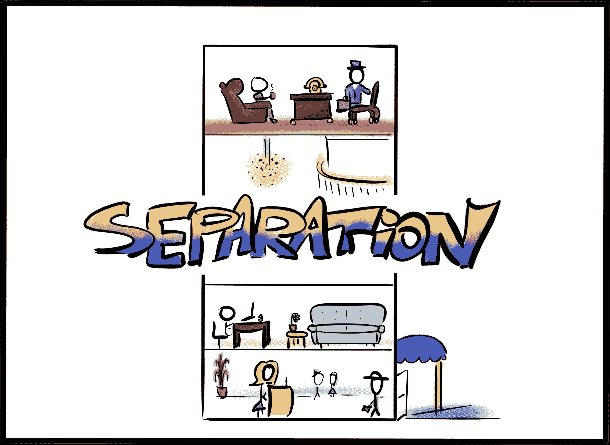
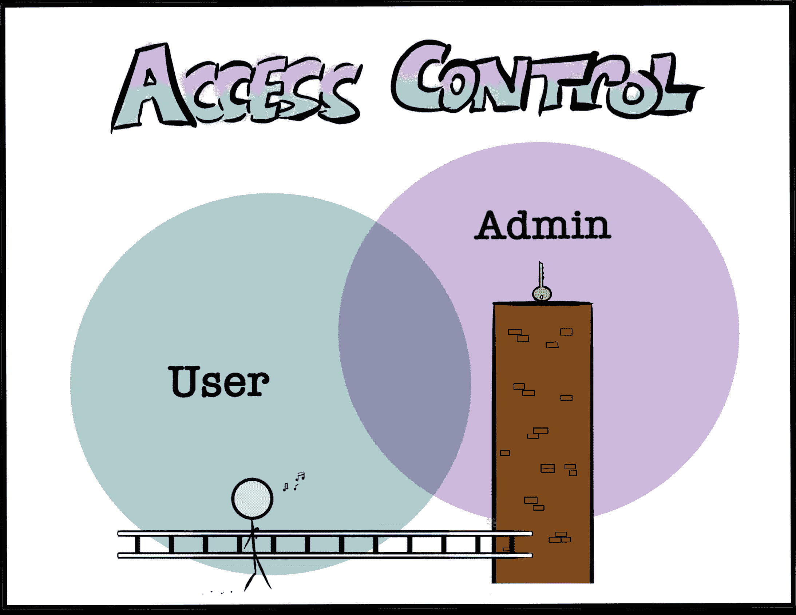

# 如何让你的应用架构安全:分离、配置和访问

> 原文：<https://www.freecodecamp.org/news/secure-application-basics/>

### 如果您是一名忙碌的开发人员，这篇文章将是构建安全应用程序架构的良好起点。

与过去相比，今天的开发人员可以更加专注于构建软件，这是一件很棒的事情。

我们受益于创客文化、一种“永远发货”的态度、开源协作以及许多帮助我们以最高效率进行优先排序和执行的应用程序。

我们处在一个不断创造的环境中，团队和个体企业家都可以最大限度地发挥生产力。

但有时这种极快的生产率也显示出它的缺点。

随着我对安全最佳实践的了解越来越多，我不禁看到越来越多毫无头绪的应用程序。他们的开发者似乎普遍缺乏安全意识。这导致对不直接支持产品发布的任务缺乏优先级。

市场似乎已经使得推出一个可用的产品比一个安全的产品更重要。普遍的态度是:“我们可以以后再做安全方面的事情。”

基于权宜之计而不是长久之计来构建基础是构建应用程序的糟糕方式。这是建立安全债务的好方法。

与技术债务一样，当开发人员做出(通常是草率的)决策，使得以后保护应用程序更加困难时，安全债务就会积聚。

如果你熟悉“向左推”的概念(或者如果你读过我的关于敏感数据暴露的[文章](https://victoria.dev/blog/hackers-are-googling-your-plain-text-passwords-preventing-sensitive-data-exposure/)，你就会知道，谈到安全，有时没有一个版本的“后来”不是*太晚*。

很遗憾，因为在开发过程的早期遵循一些具有高收益的基本安全实践并不比不遵循它们花费更多的时间。通常，它归结为拥有一些基本但重要的知识，帮助你做出更安全的决定。

虽然应用程序架构千差万别，但有一些基本原则可以应用。本文将为您提供这些领域的高度概述，并为您指明正确的方向。

我们称之为应用程序“架构”肯定是有原因的我倾向于认为这是因为软件的架构在某些基本方面类似于建筑的架构。(或者至少，以我绝对零的建筑创作专业知识，我是如何想象一个非常实用的建筑的。)

下面是我总结构建安全应用程序架构的三个基本点:

1.  分离存储
2.  定制配置
3.  受控访问和用户范围

这只是一个起点，意在让我们有一个良好的开端。一个完全实现的应用程序的安全状态的完整描述包括本文范围之外的领域，包括身份验证、日志记录和监控、集成，有时还包括法规遵从性。

## 1.分离存储

从安全的角度来看，分离的概念指的是在不同的地方存储用于不同目的的文件。

当你在建造一栋建筑并决定所有房间的走向时，你在一楼创建了大厅。行政办公室在较高的楼层，通常远离主路。虽然大厅和办公室都是房间，但你知道它们有不同的用途。他们也有不同的功能需求和非常不同的安全需求。



对于您的文件，如果您考虑一个简单的文件结构，其好处可能是最容易理解的:

```
application/
 ├───html/
 │   └───index.html
 ├───assets/
 │   ├───images/
 │   │   ├───rainbows.jpg
 │   │   └───unicorns.jpg
 │   └───style.css
 └───super-secret-configurations/
     └───master-keys.txt
```

在这个简化的例子中，假设您的应用程序的所有图像都存储在`application/assets/images/`目录中。当您的某个用户创建个人资料并将他们的图片上传到个人资料中时，该图片也会存储在此文件夹中。有道理，对吧？这是一个图像，这就是图像去的地方。有什么问题？

如果您熟悉在终端中导航文件结构，您可能以前见过这个语法:`../../`。这两个点是“向上一个目录”的简便表达方式如果您在上面的简单文件结构的`images/`目录中执行命令`cd ../../`，您将进入`assets/`，然后再次进入根目录`application/`。这是一个问题，因为有一个被称为[路径遍历](https://cwe.mitre.org/data/definitions/22.html)的小漏洞。

虽然点语法节省了一些输入，但它也引入了一个有趣的优点，即实际上不需要知道父目录被调用来访问它。

考虑一个攻击负载脚本，它被传递到这个不安全的应用程序的`images/`文件夹中，使用`cd ../`进入一个目录，然后重复发送它发现的所有内容给攻击者。最终，它会到达根应用程序目录并访问`super-secret-configurations/`文件夹。不太好。

虽然应该有其他措施来防止路径遍历和相关的用户上传漏洞，但迄今为止最简单的预防措施是分离存储。核心应用程序文件和资产不应与其他数据混合，尤其不应与[用户输入](https://victoria.dev/blog/sql-injection-and-xss-what-white-hat-hackers-know-about-trusting-user-input/)混合。最好将用户上传的文件和活动日志(可能包含有趣的数据，容易受到注入攻击)与主应用程序分开。

您可以通过使用不同的服务器、不同的实例、不同的 IP 范围或不同的域来实现分离。

## 2.定制配置

虽然在定制上浪费时间会影响工作效率，但是您需要定制的一个方面是配置设置。

[安全错误配置](https://github.com/OWASP/Top10/blob/cb5f8967bba106e14a350761ac4f93b8aec7f8fa/2017/en/0xa6-security-misconfiguration.md)列在 OWASP 前 10 名中。由于服务器、防火墙或管理帐户在生产环境中使用默认设置运行，因此会发生大量安全事件。在你的新大楼开业时，你最好更加小心，确保你没有把任何钥匙留在锁里。


通常，与默认设置相关的攻击的受害者并不是特定的目标。相反，它们是由攻击者在许多可能的目标上运行的自动扫描工具发现的。这些攻击者正在测试许多不同的系统，看看是否有任何滚动和暴露一个有用的利用。

这种攻击的自动化性质意味着审查架构的每个部分的设置是很重要的。即使一个单独的部分看起来不重要，它也可能提供一个漏洞，为攻击者提供一个通向应用程序的网关。

特别是，检查无人值守区域的架构组件，例如:

*   默认帐户，尤其是带有默认密码的帐户，仍在使用中；
*   示例网页、教程应用程序或留在应用程序中的示例数据；
*   保留不必要的服务端口，或对互联网开放的端口；
*   不受限制的允许的 HTTP 方法；
*   存储在自动日志中的敏感信息；
*   托管服务中默认配置的权限；而且，
*   默认情况下，目录列表或敏感文件类型仍可访问。

这个列表并不详尽。特定的架构组件，如云存储或 web 服务器，将有其他可配置的功能需要审查。一般来说，通过使用最少的架构组件来减少应用程序的攻击面。如果您使用更少的组件或不安装不需要的模块，您需要配置和保护的可能攻击入口点就会更少。

## 3.受控访问和用户范围

在应用程序中测试更困难的安全问题之一是错误配置的访问控制。自动化测试工具在发现一个用户不应该访问的应用程序区域方面能力有限。因此，这通常留给手工测试或源代码审查来发现。

开发人员可以降低这个问题日后难以解决的风险。在软件开发生命周期的早期，当制定架构决策时，考虑这个漏洞。毕竟，你不会简单地把万能钥匙放在高高的窗台上够不着的地方，希望没有人拿着梯子过来。



[被破坏的访问控制](https://github.com/OWASP/Top10/blob/master/2017/en/0xa5-broken-access-control.md)在 OWASP 前 10 名中，详细介绍了其各种形式。举个简单的例子，考虑一个具有两个访问级别的应用程序:管理员和用户。开发人员想要构建一个新的特性——控制或禁止用户的能力——目的是只有管理员才被允许使用它。

如果您意识到可能的访问控制漏洞，您可能会决定在用户可访问空间之外的单独区域中构建仲裁功能。这可能是在不同的领域，或者作为用户不共享的模型的一部分。这降低了访问控制错误配置或特权提升漏洞可能允许用户稍后不正确地访问调节功能的风险。

当然，应用程序中健壮的访问控制需要更多的支持才能有效。考虑敏感标记、作为 URL 参数传递的密钥或控件是否安全失败等因素。尽管如此，通过在架构阶段考虑授权，您将使自己更容易得到进一步的加强。

## 最大收益的安全基础

开发人员通过选择经过严格审查的框架来避免积累技术债务。类似地，开发人员通过了解常见的漏洞以及有助于减轻这些漏洞的架构决策来避免安全债务。关于如何从一开始就将安全性融入应用程序的更详细的资源，OWASP 应用程序安全性验证标准是一个可靠的指南。