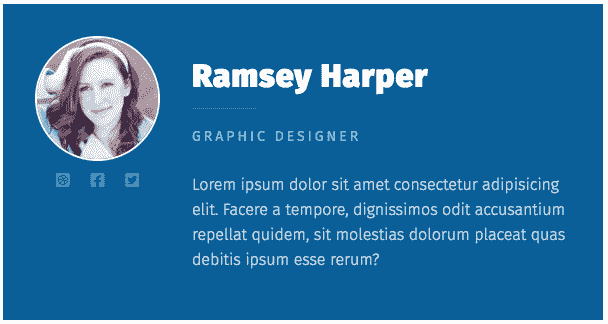
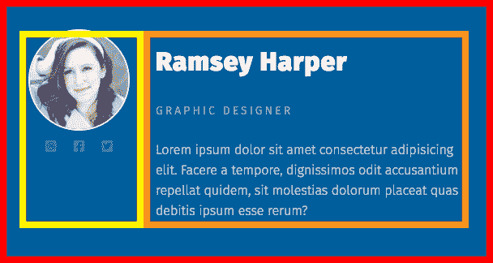
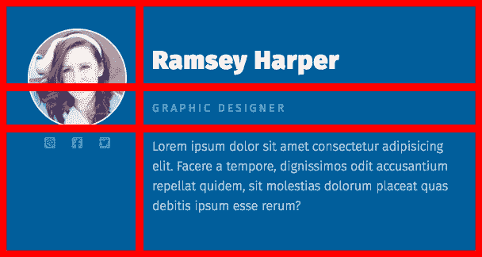
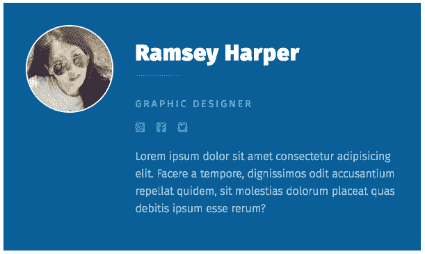

# CSS 网格如何改变我们对构建内容的思考方式

> 原文：<https://www.freecodecamp.org/news/css-grid-changes-how-we-can-think-about-structuring-our-content/>

# CSS 网格改变了我们思考文档结构的方式

任何对创建网站稍有涉猎的人都知道`<div>` s 是控制我们布局的基本构件。

HTML5 引入了新的语义元素来帮助，虽然它们是语言的奇妙补充，但它们有点像我们的`<div>`汤上的配菜。


有了网格，我们不再需要依赖`<div>` s 来创建页面的结构，甚至是更复杂的组件。该结构是由父级定义的，而不是内容在中的组织方式。

这意味着我们可以有很好的、简单的、坚持内容本身的标记，而不依赖于通过使用`<div>`来组织它。

## 网格可能很复杂，但 flexbox 也是如此

我听到很多人抱怨网格太复杂，而 flexbox 可以完成这项工作。**我认为他们对 flexbox 很满意，并不想因为这个而费心学习网格**。

最终，网格确实引入了大量新的属性和价值，所以，是的，有一个学习曲线。但是 flexbox 也非常复杂。

你能告诉我 flex-basis 比设置宽度有什么好处吗？或者说，如果我们没有明确设置 flex 项目的宽度，flexbox 如何计算它们的宽度？

例如，如果你向从未使用过 flexbox 的人展示下面的例子，你如何解释两组列使用相同的标记和相同的 CSS？更糟糕的是，两者中的第二列的宽度都是 50%。显然，50%的宽度并没有真正设置为 50%。

[https://codepen.io/kevinpowell/embed/preview/WNeRbjg?height=300&slug-hash=WNeRbjg&default-tabs=html,result&host=https://codepen.io](https://codepen.io/kevinpowell/embed/preview/WNeRbjg?height=300&slug-hash=WNeRbjg&default-tabs=html,result&host=https://codepen.io)

“嗯，如果没有足够的空间，它会从 flex 项目收缩开始，所以即使我们将宽度设置为 50%，它也没有空间，所以它会收缩以挤进去，因为另一个 div 需要更多的空间。50%是理想的大小，而不是实际的大小。

“所以在上面的例子中，第一个 div 的内容太长导致了一个问题，因为作为一个 flex 项目，默认情况下，它希望收缩以适应其内容。在这种情况下，该项目包含大量内容，因此……”

**是的，flexbox 很棒，在创建布局方面做得很好，但请不要告诉我这很简单**。一旦你有了完美的例子，它往往离直觉很远，有时甚至会非常奇怪。

网格很复杂，因为有许多新的属性和值，但是它们比 flexbox 给了我们更多的控制。

在这篇文章中，我想看看额外的控制层如何帮助简化我们的标记，让我们编写更少的代码，而且这甚至不需要学习如何使用它的一些奇特的功能。

## flexbox 的局限性

即使我们用 flexbox 构建一个简单的组件，因为它一次只能在一维空间中运行(flex 项目要么是行，要么是列，它们不可能同时是行和列)，我们仍然需要很多 div 来将事情分成行，然后再分成列。

例如，如果我们正在处理一张看起来像这样的卡片:



这不是一个复杂的布局，但我们仍然需要以一种非常具体的方式来组织我们的内容，以使其发挥作用。



需要黄色和橙色的盒子，这样当我们放置显示器时:flex 在。卡片本身(红色方框)，它将创建两列。因此，为了构建所有内容，我们会得到类似这样的标记:

```
<div class="card">  
    <div class="profile-sidebar">
        <!-- profile image and social list here --> 
    </div>
    <div class="profile-body">
        <!-- name, position, description here -->
    </div>
</div>
```

无论如何，这并不太复杂，一旦你理解了 flexbox 是如何工作的，它就相对简单了。

当我们在`.card`上放置一个`display: flex`时，我们将得到两列，然后我们需要进入这两列并开始对它们进行样式化。

下面是一个包含所有样式的工作示例:

[https://codepen.io/kevinpowell/embed/preview/rNBjaqV?height=300&slug-hash=rNBjaqV&default-tabs=css,result&host=https://codepen.io](https://codepen.io/kevinpowell/embed/preview/rNBjaqV?height=300&slug-hash=rNBjaqV&default-tabs=css,result&host=https://codepen.io)

事情是这样的，**由于不得不创建内容列，我们在标记方面变得有点复杂，并且我们也限制了自己**，因为我们已经将不同的内容块组合在一起。

## 用 CSS 网格简化一切

因为网格是二维的，这意味着它允许我们同时创建行*和*列，这意味着我们的网格容器(在这里我们声明 display: grid)可以完全控制它内部的布局。

我们曾经*要求* < div > s 去做那件事，就像上面 flexbox 的例子一样。有了网格，我们可以完全去掉< div > s。

```
<div class="card"> 
  <ul class="social-list"> ... </ul>
  <h2 class="profile-name">Ramsey Harper</h2>
  <p class="profile-position">Graphic Designer</p>
  <p class="profile-info">Lorem ipsum ...</p>
</div>
```

从标记的角度来看，这不是更有意义吗？

我们有一个`.card`，然后我们把组件的内容放在那里。我们不需要担心如何分解它的结构，我们只需要放置我们需要的内容，并从那里继续前进。

### 构建布局

就像我们使用 flexbox 做这件事一样，我们仍然需要分解布局，尽管由于 grid 的工作方式，它看起来有点不同。

这是一个人们可能会认为网格更复杂的地方，但实际上我只是在每个内容周围画了一些框，然后延伸这些线。



使用 flexbox，我们创建了两个 div 作为我们的列。当使用网格时，我们在父节点上建立整个网格，然后我们可以告诉子节点它们属于这个网格的哪个部分。

要设置网格，我们可以这样做:

```
.card {  
    display: grid;
    grid-template-columns: 1fr 3fr;
}
```

`fr`单元是网格特有的，是可用空间的一部分。像这样使用它非常像在 flexbox 中设置两列，并分别给它们宽度`25%`和`75%`。

### 将项目放置在网格上

也许是因为我多年来一直使用浮动来创建布局，但当不同的元素最终出现在我们想要的位置时，总感觉有点神奇！

我们可以在每个元素上使用`grid-row`和`grid-column`来放置它到我们想要的地方，但是我使用 grid 越多，我就越喜欢花时间设置`grid-template-areas`并将我的项目放置到那些区域。

设置稍微长了一点，但是当我们做出响应时，回报真的很大(我们很快就会实现)。

因此，首先，在`.card`上，我们需要设置`grid-template-areas`，然后我们可以将所有孩子分配到这些区域:

```
.card {
  ...
  display: grid;
  grid-template-columns: 1fr 3fr;
  grid-column-gap: 2em;
  grid-template-areas:
      "image name"
      "image position"
      "social description";
}

.profile-name     { grid-area: name; }
.profile-position { grid-area: position; }
.profile-info     { grid-area: description; }
.profile-img      { grid-area: image; }
.social-list      { grid-area: social; }
```

如果你想看所有的活动，请点击这里:

[https://codepen.io/kevinpowell/embed/preview/wvwdVyJ?height=300&slug-hash=wvwdVyJ&default-tabs=css,result&host=https://codepen.io](https://codepen.io/kevinpowell/embed/preview/wvwdVyJ?height=300&slug-hash=wvwdVyJ&default-tabs=css,result&host=https://codepen.io)

## 太直接了

我喜欢使用`grid-template-areas`的一个原因是它是*,所以*对其他人来说很容易看到这段代码并立即理解发生了什么。

如果有人用数字和跨度向你展示用`grid-row`和`grid-column`设置好的东西，很容易计算出它们的最终位置。对于简单的布局或者快速的布局，我认为使用它们是很好的，**，但是看着*仅仅*一个父元素的 CSS 并立即理解整个布局看起来像什么**是如此的好。

### 使用 grid 时，更容易知道元素的实际大小

在第一个例子中，我们将一个伸缩项的宽度设置为 50%，但实际上并不是 50%。如果你明白这是为什么，那很好，但有时还是很烦人。这很容易做到，但是当使用网格时，这就不是问题了。

因为我们定义了完整的布局，所以我们也定义了我们希望项目占据的确切空间。

当然，我们得到了`minmax()`和`fr`，这使事情变得有些混乱，因为它们允许更灵活的大小调整(就像我们在上面的例子中使用的那样)，但即使这样，我们仍然可以完全控制这种灵活性，并且这一切都是由父节点控制的，而不是必须在父节点上设置一些内容，而在子节点上设置其他内容。

## 有限的变化

看一下上面的例子，我们不能在不改变标记的情况下改变布局:



我们已经限制了自己，因为我们不得不在`<div>`中把东西组合在一起。我们不得不使用那些`<div>`来让布局工作，但是我们现在陷入了困境。

有了网格的平面标记，一切皆有可能！还有一个额外的好处，因为我们使用网格模板区域来设置一切，所以做这些改变非常容易！

```
.card {
  /* old layout 
  grid-template-areas:
      "image name"
      "image position"
      "social description"; */

  /* updated layout */
  grid-template-areas:
      "image name"
      "image position"
      "image social"
      ". description";
}
```

通过像这样玩`grid-template-areas`，它可以快速轻松地将社交图标移动到我们想要的位置(最后一部分的`.`表示空单元格)。

## 这使得处理媒体询问变得非常容易

正如我几次提到的，这是有回报的地方之一。我们可以和父母一起完全控制我们的布局:

```
.card {
  /* setup for small screens */
  display: grid;
  grid-template-columns: 1fr;
  grid-column-gap: 2em;
  grid-template-areas: 
      "name" 
      "image" 
      "social" 
      "position" 
      "description";
}
.profile-name     {  grid-area: name;}
.profile-position {  grid-area: position; }
.profile-info     {  grid-area: description; }
.profile-img      {  grid-area: image; }
.social-list      {  grid-area: social; } 

/* rearanging the layout for large screens */

@media (min-width: 600px) {
  .card {
    text-align: left;
    grid-template-columns: 1fr 3fr;
    grid-template-areas: 
        "image name" 
        "image position" 
        "social description";
  }
  .profile-name::after {
    margin-left: 0;
  }
} 
```

下面的笔有整个事情的风格。潜入其中，玩网格区域，看看完全改变布局是多么容易！

[https://codepen.io/kevinpowell/embed/preview/BaBRXvZ?height=300&slug-hash=BaBRXvZ&default-tabs=css,result&host=https://codepen.io](https://codepen.io/kevinpowell/embed/preview/BaBRXvZ?height=300&slug-hash=BaBRXvZ&default-tabs=css,result&host=https://codepen.io)

## Flexbox 仍然有它的位置

我确实发现自己越来越多地转向网格，但我确实认为 flexbox 仍有其一席之地。如果我有一个相邻的标志和导航，简单地做这样的事情就很好，并且知道它们在我想要的地方:

对于我们用于导航的`<ul>`来说也是一样，只是简单地将项目一个接一个地放在一起，或者正如你可能已经注意到的，在我们正在看的卡片例子中，它对于`.social-list`来说是完美的。

对于简单的组件，我们不需要更复杂的布局，它工作得很好。但是我发现自己越来越倾向于网格，有时是因为真的需要，有时是因为我想使用`minmax()`或`fr`单位。

但是说到底，我认为网格最大的好处是我们可以大大简化我们的标记。

我们仍然需要使用不起眼的`<div>`，但是多亏了 grid，我们不再需要依赖它们来填充我们的标记。

## 结论

尽管 flexbox 很棒，但它并不比 grid 简单。它确实做得很好，但是网格允许我们在处理更复杂的布局时有更多的控制。当在媒体查询中进行改变时，在处理响应设计时，这种控制被放大。

使用 flexbox，我们的一大变化是改变了弯曲方向。有了网格，我们可以快速、轻松地完全重新设计一个组件。

flexbox 和 grid 都有更多的功能。每一个都有它的目的，但是如果你觉得不确定该选择哪一个，或者如果你正在努力找出一般的响应式设计，我最近在 Scrimba 上发布了一个深入到响应式设计的课程，名为 **[响应式网页设计训练营](https://scrimba.com/g/gresponsive)** 。

它包括对 Grid 和 Flexbox 的深入研究，以及一个完整的模块，专门介绍如何开始有针对性地思考。总共有 170 多节课，超过 15 个小时的内容，分为 6 个模块。因此，如果你想继续深入 CSS 的响应世界，你可以[点击这里](https://scrimba.com/g/gresponsive)查看。