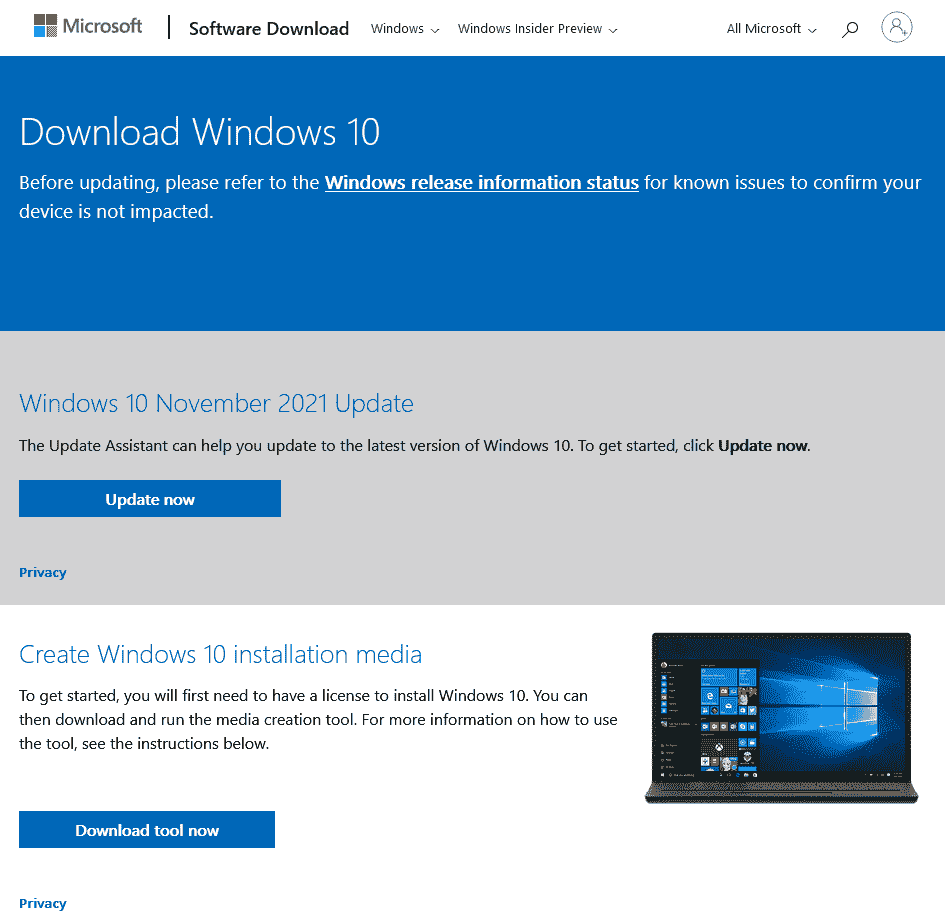
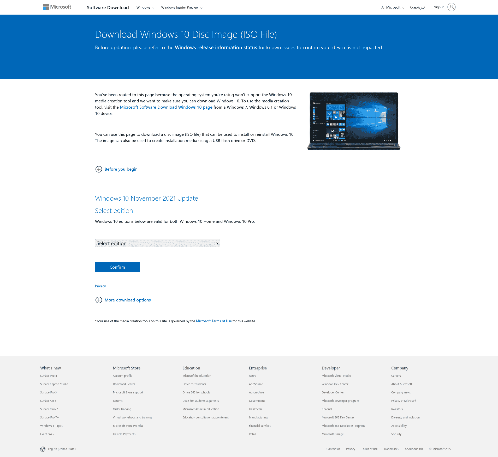
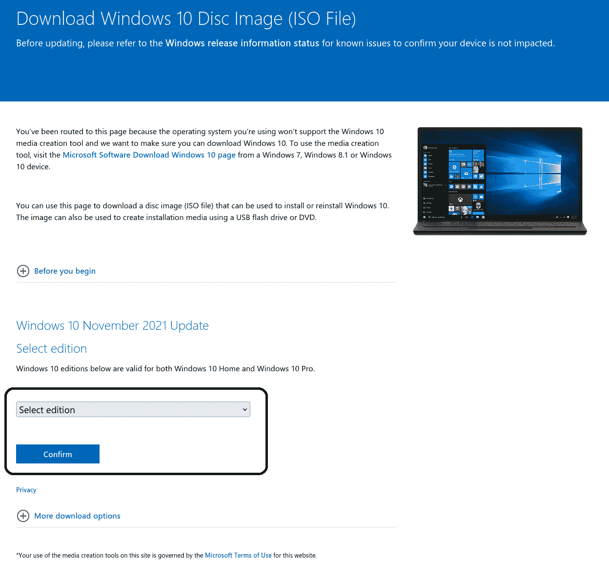
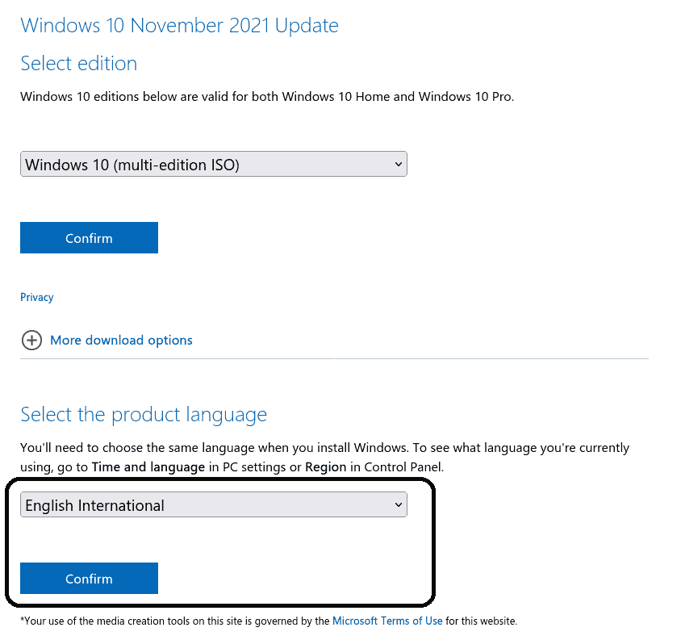
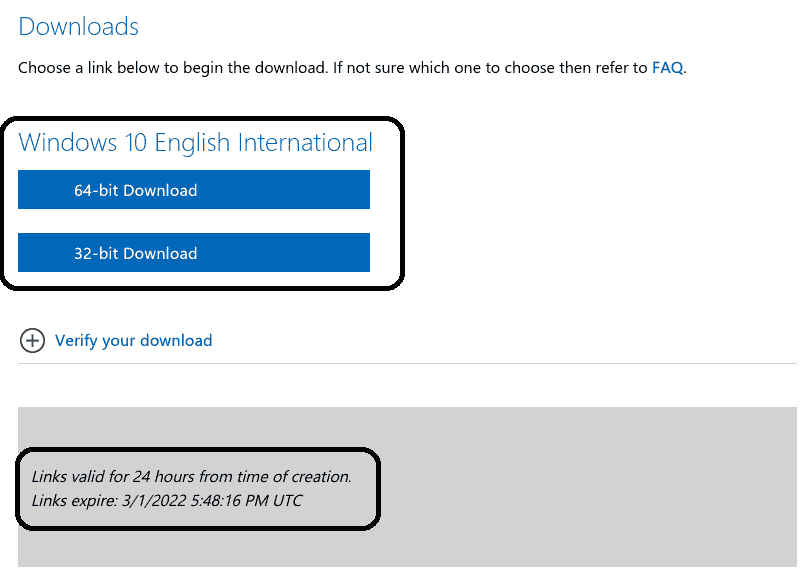
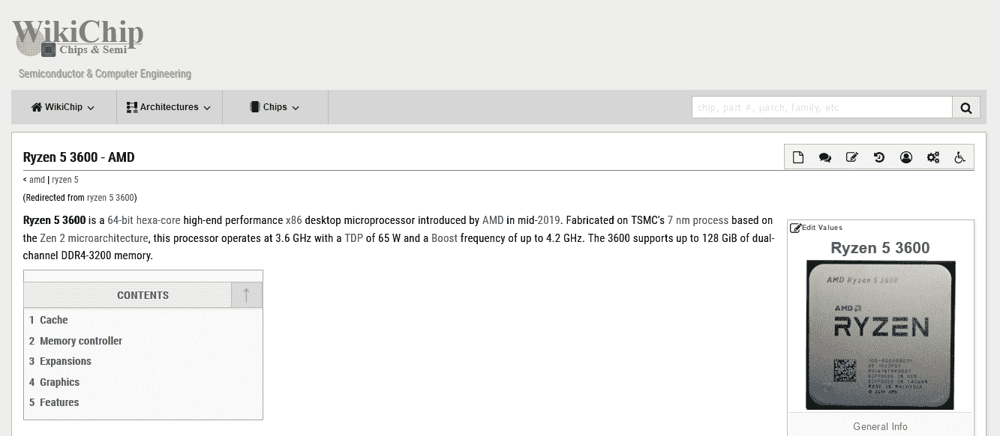
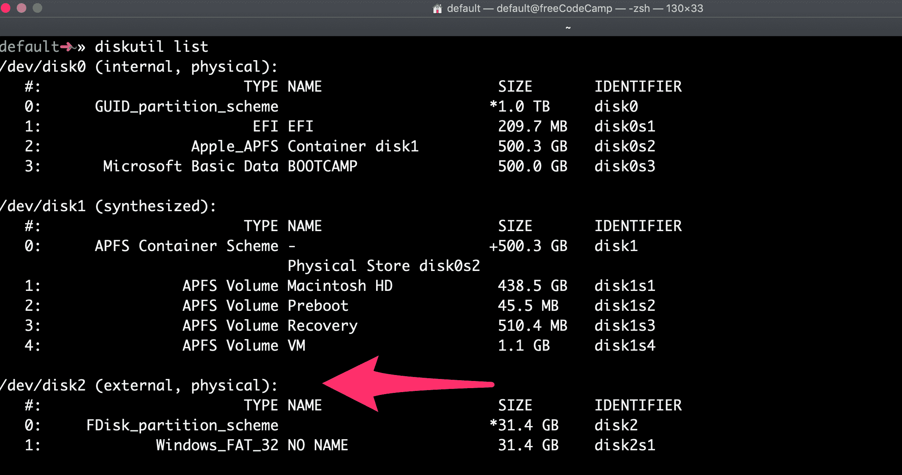
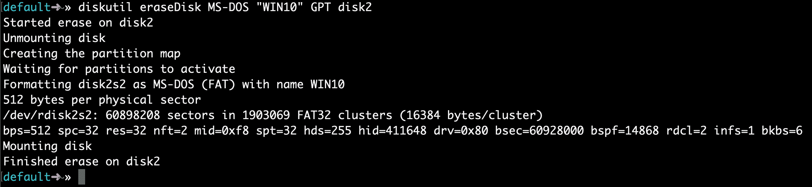

# 如何在你的 Mac 上制作一个 Windows 10 USB 从你的 Mac 终端构建一个可引导的 ISO

> 原文：<https://www.freecodecamp.org/news/how-make-a-windows-10-usb-using-your-mac-build-a-bootable-iso-from-your-macs-terminal/>

大多数新电脑不再配备 DVD 驱动器。所以在新电脑上安装 Windows 可能会很痛苦。

幸运的是，微软开发了一个工具，你可以用它从 USB 存储驱动器(或者通常所说的“拇指驱动器”)安装 Windows。

但是如果你没有第二台电脑来安装 USB 存储驱动器呢？

在本教程中，我们将向您展示如何在 Mac 上进行设置。

# 步骤 1:下载 Windows 10 ISO 文件

你可以直接从微软下载 ISO 文件。没错——我们在这里做的一切都是 100%合法的，并且得到了微软的批准。

你可以使用[这个链接](https://www.microsoft.com/en-us/software-download/windows10)直接从微软免费下载 Windows 10。如果您使用 Windows 设备访问该链接，您将被重定向到 [Windows Media Creation Tool](https://www.microsoft.com/en-us/software-download/windows10%20) ，如下所示:



如果您从非 Windows 设备(如 Mac 或 Linux 设备或任何智能手机)访问同一链接，您将进入 ISO 官方下载页面:



从下拉菜单中选择您想要的版本，然后点击*确认*。



此时，Windows 10(多版本 ISO)是唯一可用的版本。确认您的版本后，您将看到另一个下拉框，让您选择一种语言。选择你想要的，点击*确认*按钮。



一旦您确认了您的语言，您将获得两个下载链接，一个用于 64 位版本，另一个用于 32 位版本。这两个链接的有效期为 24 小时，当它们过期时，页面也会显示。



如果您不知道如何在 64 位和 32 位之间做出决定，您应该这样做。如果你有一个支持 64 位架构的处理器，并且你有 4GB 以上的内存，那就用 64 位的吧。32 位操作系统有 4GB 内存限制。

要确定您的处理器是否支持 64 位架构，请访问类似于 [WikiChip](https://en.wikichip.org/wiki/WikiChip) 的网站，搜索您的处理器型号。



从上面的截图可以看出，我的锐龙 5 3600 支持 64 位架构。我还有 16GB 的内存，比 4GB 大很多，所以我会选择 64 位版本。

# 第二步:将你的 USB 存储驱动器插入你的 Mac 电脑

ISO 文件只有大约 5g，但我建议您使用至少 16g 空间的 USB 驱动器，以防 Windows 在安装过程中需要更多空间。

我在沃尔玛只花了 3 美元买了一个 32g 的 u 盘，所以这应该不会很贵。

将你的 u 盘插入你的 Mac 电脑。然后打开你的终端。您可以使用 MacOS Spotlight 来做到这一点，方法是同时按下⌘和空格键，然后键入“终端”并按下 enter。

不要被命令行界面吓倒。我将告诉您应该输入哪些命令。

# 步骤 3:使用 diskutil 命令来识别你的 USB 驱动器安装在哪个磁盘上

使用⌘ + space 键盘快捷键打开 Mac Spotlight。然后键入单词“终端”并从下拉列表中选择终端。

将以下命令粘贴到您的终端中，然后按 enter 键:

`diskutil list`

您将看到这样的输出(注意——如果您没有自定义，您的 Mac 终端可能是白底黑字)。



将我指向的文本复制到这里。它可能会像这样

`/dev/disk2`。

# 第四步:格式化你的 USB 驱动器，使之能在 Windows 上工作

接下来格式化你的 u 盘到 Windows FAT32 格式。这是 Windows 10 会识别的格式。

请注意，如果不是`disk2`，您应该用步骤 3 中的驱动器名称替换`disk2`。(可能是`disk3`或者`disk4`)。

使用适用于您的 USB 的正确磁盘号运行此命令:

`diskutil eraseDisk MS-DOS "WIN10" GPT /dev/disk2`

然后你会看到这样的终端输出。



在较新的计算机上，这可能只需要 20 秒钟，但在较旧的计算机上可能需要更长时间。

注意，对于某些硬件，您可能需要运行这个命令，它使用 MBR 格式而不是 GPT 进行分区。如果步骤 7 失败，返回并尝试此命令，然后重复步骤 5、6 和 7:

```
diskutil eraseDisk MS-DOS "WIN10" MBR /dev/disk2
```

# 第五步:使用`hdiutil`挂载 Windows 10 文件夹，准备转移。

现在，我们将准备我们下载的 ISO 文件，以便我们可以将它复制到我们的 USB 驱动器。

你需要检查你下载的 Windows 10 ISO 文件在哪里，并使用它。但是您的文件可能位于您的名为`Win10_1903_V1_English_x64.iso`的`~/Downloads`文件夹中。

`hdiutil mount ~/Downloads/Win10_1903_V1_English_x64.iso`

# 第六步:将 Windows 10 ISO 拷贝到你的 u 盘上

【2020 年 4 月更新:Windows 10 ISO 中的一个文件——install . WIM——现在太大，无法复制到 FAT-32 格式的 USB 驱动器上。所以我给你演示一下怎么单独抄过来。

感谢 [@alexlubbock](https://twitter.com/alexlubbock) 想出这个变通办法。

首先运行以下命令复制除该文件之外的所有内容:

`rsync -vha --exclude=sources/install.wim /Volumes/CCCOMA_X64FRE_EN-US_DV9/* /Volumes/WIN10`

然后运行这个命令来安装 Homebrew(如果你的 Mac 上还没有安装的话):

`/usr/bin/ruby -e "$(curl -fsSL https://raw.githubusercontent.com/Homebrew/install/master/install)"`

然后使用 Homebrew 安装一个名为 wimlib 的工具，终端命令如下:

`brew install wimlib`

然后，继续创建您要将文件写入的目录:

`mkdir /Volumes/WIN10/sources`

然后运行这个命令。请注意，此过程可能需要几个小时，在完成之前，您可能会看到 0%的进度。不要流产。它将使用 wimlib 将 install.wim 文件分成两个文件，每个文件不到 4 GB(我在下面的命令中使用了 3.8 GB)，然后将它们复制到您的 USB:

`wimlib-imagex split /Volumes/CCCOMA_X64FRE_EN-US_DV9/sources/install.wim /Volumes/WIN10/sources/install.swm 3800`

完成后，您可以从 Mac inside Finder 中弹出 USB。请注意，当您稍后安装时，Windows 会自动重新加入这些文件。

# 第七步:把你的 USB 插入你的新电脑，开始加载 Windows

祝贺您-您的计算机现在应该可以直接从您的 USB 驱动器启动。如果没有，您可能需要检查新电脑的 BIOS，并将引导顺序更改为从 USB 驱动器引导。

Windows 将弹出一个屏幕并开始安装过程。

享受您的新电脑和新安装的 Windows。