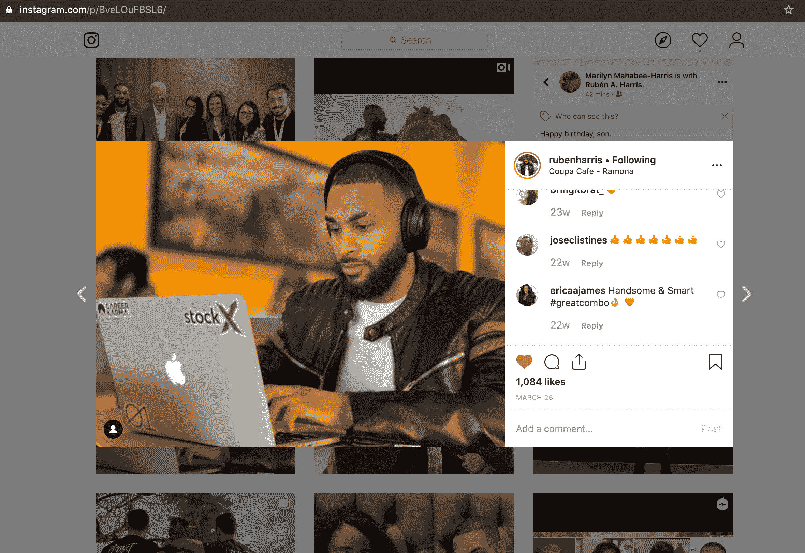
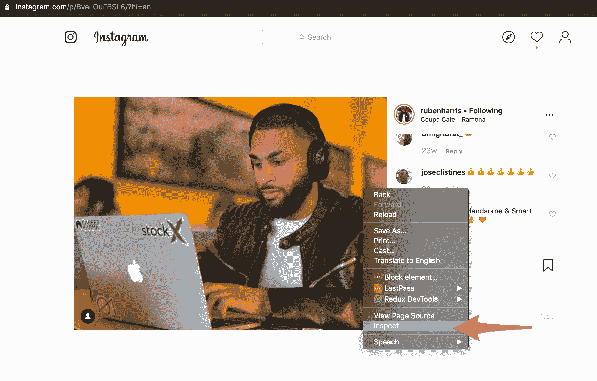
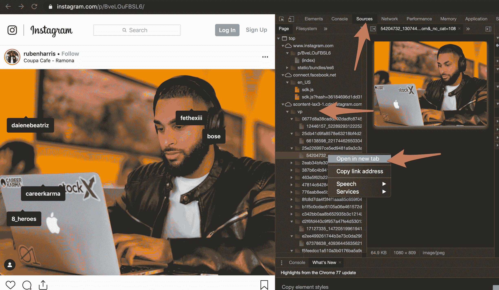
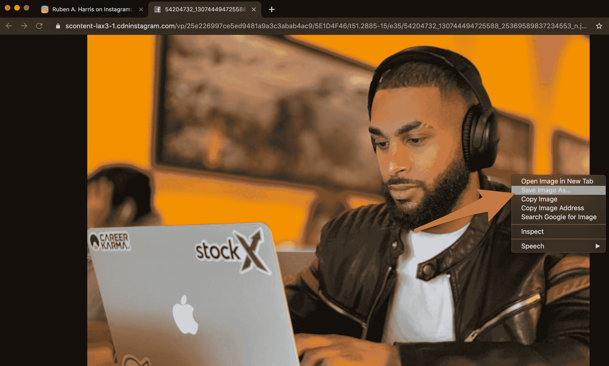

# 如何下载 Instagram 照片——无需任何工具即可将照片从 Chrome 保存到您的 PC 或 Mac 上

> 原文：<https://www.freecodecamp.org/news/instagram-picture-download-guide/>

Instagram 使得不使用他们的移动应用程序就很难将照片下载到你的电脑上。但这是可能的。

这篇文章将告诉你如何通过 3 个快速的步骤做到这一点。

## 第一步:找到你要下载的 Instagram 照片。

去 instagram.com 找到具体的照片。点击它。

这将使照片以预览模式显示，浮动在该人的新闻源顶部，如下所示:

Click the image you want to bring up its preview modal.

请注意，Chrome 地址栏中的 URL 已经更改。它现在会说`instagram.com/p/#########`，而不是说这个人的 Instagram 用户名。

Instagram 上的每张照片都有自己的专用网址，如果你直接去那个地址，它只会显示一张照片，而不会显示其新闻订阅中的所有其他照片。

由于照片的地址现在在地址栏中，您可以通过点按浏览器中的“刷新”按钮或使用 control+r 键盘快捷键(在 Mac 上为 command+r)来刷新浏览器。

这会向你展示照片在 Instagram 上的独特页面。

## 第二步:获取 Instagram 照片的网址，以便下载

Right click the image, then choose "inspect" from the dropdown.

右键单击照片，并从下拉菜单中选择“检查”。这将打开 Chrome 的开发者控制台。

即使 Chrome DevTools 是为软件开发人员设计的，也不要被吓倒。你只需要点击几个特定的按钮就可以找到照片。

首先点击顶部的“源”标签。

然后点击`VP`文件夹展开其内容。

每张照片都存储在自己的文件夹中。开始扩展这些文件夹，你最终会找到全尺寸的照片。右键单击该文件，然后单击“在新标签中打开”

## 第三步:将 Instagram 照片下载到你的电脑上

现在你可以右击照片，选择“另存为”选项。

通过这种方式，你将获得完整尺寸的 Instagram 照片——Instagram 在 insta gram 移动应用程序中显示给你的照片相同。这不是截图或缩略图，这是全尺寸的图像。

恭喜你！你有了自己的形象，现在你可以为所欲为了。

## 为什么 Instagram 让下载这些图片变得如此困难？

Instagram 希望你链接回他们的网站，而不是直接链接到图片。但 Instagram 并不拥有这些图片——你或拍摄照片的人拥有这些图片。

可笑的是，Instagram 不像其他网站(包括 freeCodeCamp.org)那样让你“右击另存为”图片。

但这就是贪婪关注的社交媒体平台所做的——它们让下载你的图片变得不方便。它们使用 JavaScript 覆盖浏览器的功能。

不管怎样，现在你可以下载这些图片了。这需要一点工作，但一旦你掌握了窍门，你就不必直接链接到 Instagram 或使用一些截图工具来获取这些照片。

有工具可以批量下载你的 Instagram 照片。但是如果你只是想下载一张特定的照片，这是最快的方法。你不需要安装任何工具或 Chrome 扩展。

记住，如果你没有拍这些照片，一定要相信摄影师。大声呼喊 [@RubenHarris](https://www.instagram.com/rubenharris/?hl=en) 成为我在本教程中的主题。