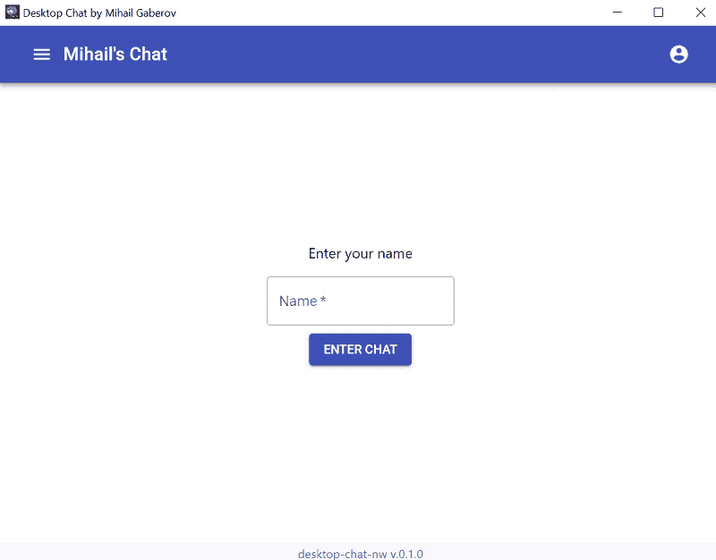
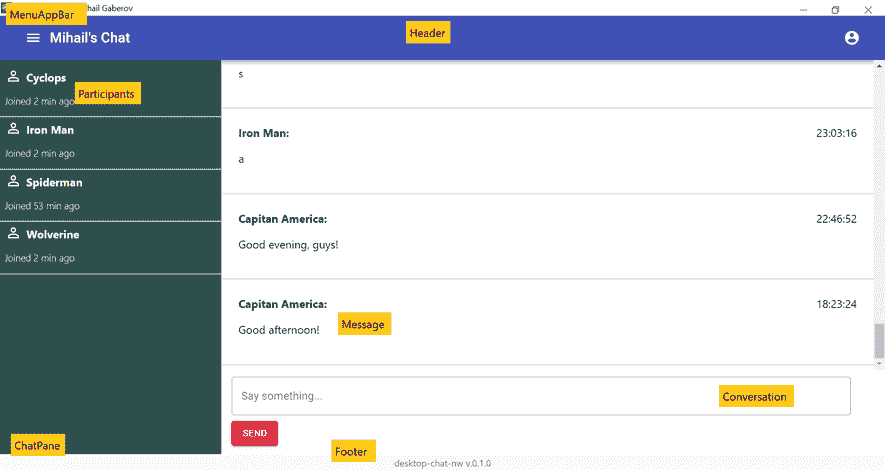
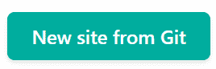
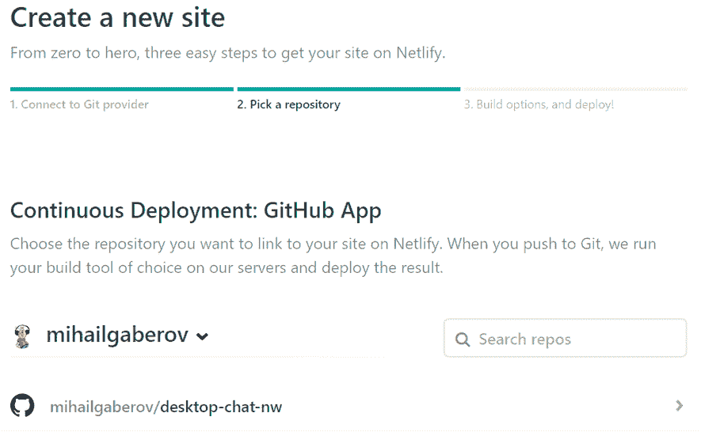
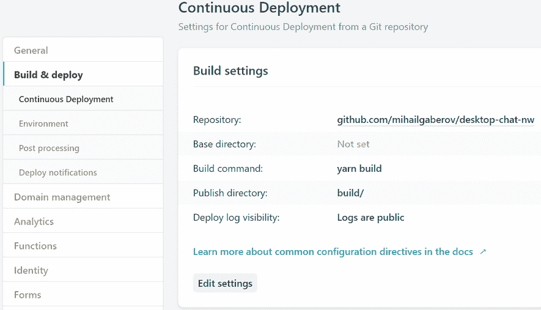
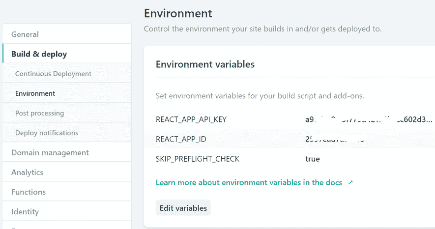
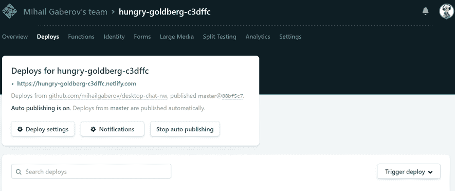

# 我如何用 CometChat 和 NW.js 构建一个桌面聊天应用程序(你也可以)

> 原文：<https://www.freecodecamp.org/news/how-i-build-a-desktop-chat-app-with-cometchat-and-nw-js-and-how-you-can-too/>

这不是你典型的“*贴这个贴这个*”和“*贴那个贴那个*”式的教程(你可以在【cometchat.com/tutorials】的这里找到很多)。虽然这些教程肯定有价值，但我将从头到尾分享我的思考过程。

我构建的应用程序非常简单。当有人加载应用程序时，系统会提示他们输入用户名并开始聊天:



Welcome Screen

在 NW.js(以前称为 node-webkit)的帮助下，应用程序最终在 Node 上运行。NW.js 是有利的，因为它使我们能够使用我们最喜欢的 web 技术编写跨平台的桌面应用程序。对于这个应用程序，我选择使用 React 和 Redux。

后端逻辑——从实时发送和接收消息到填充我称之为“参与者列表”——由 CometChat 提供支持。当你继续阅读时，你会学到更多关于 [CometChat](https://cometchat.com/pro) 的知识。

这篇文章并不打算作为一个演练。虽然我将解释这个应用程序的技术组件，但我的主要目标是帮助您从头到尾考虑一个解决方案。希望当你完成这篇文章的时候，你会成为一个稍微好一点的开发者，并考虑将 CometChat 作为你成长的工具带。

**只想要示例代码？**

你可以在这里看到源代码。还有一个详细的[自述](https://github.com/mihailgaberov/desktop-chat-nw/blob/master/README.md)，在那里你会找到安装、运行和测试应用程序所需的所有信息。

因为桌面应用程序是使用 web 技术构建的，所以完全可以在浏览器中运行。在这篇文章的最后，我将向您展示如何在 Netlify 上部署这个应用程序。

## **策划**

在这一部分，我们必须决定需要构建哪些组件。它们将具有什么功能？换句话说，我们需要回答什么问题来计划建造过程？

让我们退一步想一想。试着问自己这样的问题，谁会带我们找到应用程序所需的结构。

下面我将列出我的问题和答案。这是实际构建应用程序结构的过程，但首先是在你的头脑中。请记住，这种情况经常发生，当回答一个问题时，会出现新的问题。我也是如此。

****问题:****

*   我在做什么？？
*   我要构建什么样的应用程序？
*   这样的 app 需要具备哪些最常见的组件？
*   app 的组件之间是如何交互的？
*   我的目标是什么程度的完成—(演示应用程序不应该是全功能的)？

****答案**** (按照提问顺序):

*   这是很多人忘记思考的最容易被忽视的问题。当一个人能够先离开并对这个问题给出一个明确的答案时，他未来的发展道路就已经确定了。在我的具体案例中，我得到的答案听起来像这样——“我正在考虑开发一个聊天应用。这个应用程序应该作为一个教程演示应用程序。它必须通过使用 CometChat API 提供“聊天”的基本功能。它应该在桌面上运行”。样式和关于什么去哪里的具体细节将在后面的过程中出现。
*   一个聊天应用程序，将在桌面上运行，并作为本教程的演示。
*   为了给这个问题一个正确的答案，一个不熟悉的人必须先做一些研究。看看现实世界中的聊天应用程序。记下他们的特点。他们如何把它们放在适当的位置，他们之间以及与应用程序用户之间如何互动。就我而言，我有一些以前的经验，或多或少知道我需要什么。
*   组件之间的交互非常简单。用户应该能够使用主要组件，即文本输入和按钮来发送消息。和侧边栏组件来查看其他聊天参与者。
*   演示应用程序应该提供基本的聊天功能——发送和接收实时消息。并且能够在桌面上运行(没有浏览器)。

## **特性**

我决定在演示应用中实现以下功能:

*   用回车键发送
*   带有姓名和上次活动时间的边栏
*   带有错误消息的输入和验证的欢迎屏幕
*   聊天区自动滚动到底部
*   聊天信息和发送时间。

## **前端—反应**

我们将使用 [React](https://reactjs.org/) 来构建我们的用户界面。下面，我将列出我创建的组件，并对每个组件进行简短说明:

*   聊天窗格(ChatPane)—这是类似容器的主要组件，包含参与者和对话组件，并传递他们需要可视化的数据。
*   [对话](https://github.com/mihailgaberov/desktop-chat-nw/blob/master/src/components/Conversation/Conversation.jsx) —这是负责输入和发送聊天消息的组件。
*   [页脚](https://github.com/mihailgaberov/desktop-chat-nw/blob/master/src/components/Footer/Footer.jsx) —显示一个简单的页脚消息，包含应用程序名称和版本，如 package.json 文件中所定义。
*   [Header](https://github.com/mihailgaberov/desktop-chat-nw/blob/master/src/components/Header/Header.jsx) —保存应用菜单栏的 Header 组件。
*   [MenuAppBar](https://github.com/mihailgaberov/desktop-chat-nw/blob/master/src/components/MenuAppBar/MenuAppBar.jsx) —应用菜单栏组件，模拟真实菜单栏的样子。左边的汉堡菜单和右边的个人资料下拉菜单是假的——可以点击，但没有功能。
*   [Messages](https://github.com/mihailgaberov/desktop-chat-nw/blob/master/src/components/Messages/Messages.jsx) —一个容器组件，保存消息本身—它有发送者的名字、消息内容和发送时间。
*   [参与者](https://github.com/mihailgaberov/desktop-chat-nw/tree/master/src/components/Participants) —这个组件显示一个聊天成员的名字和他加入的时间。
*   [Welcome](https://github.com/mihailgaberov/desktop-chat-nw/tree/master/src/components/Welcome) —该组件负责显示登录页面——我们应用程序的起点，在这里我们有与检查某些允许的用户名并将其存储到本地存储以备后用相关的逻辑。我还实现了基本的错误处理逻辑，当选择的用户名不正确时，它会显示一个错误，这是根据 CometChat API(在我们的演示中是这个特定的情况)注册的用户名——超级 1、超级 2 等等，直到 5。

这里是应用程序组件的可视化表示:



Visual Components

## **状态管理—冗余**

如今，每个现代应用程序都有一个状态。放在应用程序存储某些数据以备后用的内存中。对于我们的应用程序状态管理，我们使用 [Redux](https://redux.js.org/) 。当然，对于这样一个简单的应用程序，我们完全可以不使用 Redux。但是，从学习的角度来看(*毕竟我们这样做都是为了学习新东西，对吗？*)，我觉得如果能看到向 API 发送请求，经过中间件(redux-thunks)并得到记录到状态的响应的整个循环就好了。我们将使用 Redux 来管理这种状态。

### **工作原理**

Redux 应用程序中的主要构件被称为 reducer——用于管理状态的小函数。简单地说，它们所做的是接受旧的状态对象作为输入，并根据某些动作(也在同一个输入中传递)返回新的状态对象。新的状态可以全部或部分改变。

在我们的应用程序中，我们有三个简单的 reducers，它们负责状态的那些部分，负责用户列表、登录过程和发送/接收消息。所有这些都可以在 [/src/reducers](https://github.com/mihailgaberov/desktop-chat-nw/tree/master/src/reducers) 文件夹中看到，还有一个包含我们应用初始状态的[文件](https://github.com/mihailgaberov/desktop-chat-nw/blob/master/src/reducers/initialState.js)。

作为状态管理库，Redux 可以与任何其他 UI 框架一起使用，实际上每个需要状态的应用程序都可以从使用 Redux 中受益。如果你想深入了解，可以从他们的网站开始，然后跟着做。

## **副作用处理— Redux Thunks**

redux 应用中管理副作用的一个最著名的方法叫做 [redux-think](https://github.com/reduxjs/redux-thunk) 。这也是我们在应用程序中使用的。如果你想了解更多关于 redux thunks 的细节以及如何使用它们，我推荐你从他们的网站开始，然后构建一个小的应用程序，比如这个:)。

在我们的项目中，在 [/src/actions 文件夹](https://github.com/mihailgaberov/desktop-chat-nw/tree/master/src/actions)中，是我放演示应用程序中使用的 thunks 的地方。并且在[/商店](https://github.com/mihailgaberov/desktop-chat-nw/tree/master/src/store)目录中是 redux 商店的配置所在的位置。

## **使其桌面化— NW.js**

我们的应用程序中使我们的应用程序能够在桌面上运行的部分由一个名为 [NW.js](https://nwjs.io/) 的库负责。记住，我们正在构建一个桌面应用程序。确切地说，桌面部分将通过 NW.js 来实现。与另一个用于构建桌面应用程序的库[电子](https://electronjs.org/)类似，NW.js 为开发人员提供了一种使用他们的 web 技能来构建可以在桌面上运行的应用程序的方法。这意味着在构建应用程序时，您仍然可以使用 JavaScript/React 技能，然后通过 Nw.js APIs 利用桌面操作系统的强大功能。换句话说，Nw.js 让你有能力制作一个骨架 app，它可以“填充”你的 UI，不管你用什么库创建的。最棒的是，这样的应用程序可以在相同的 JavaScript 上下文中访问 Node.js/NW.js API 和 DOM。

既然我们提到了构建跨平台桌面应用领域的另一个大玩家，让我给你一个两者之间的简单比较。

## **Nw.js vs 电子**

申请条目

*   在 NW.js 中，应用程序的主要入口点是网页或 js 脚本。您可以在 package.json 中指定一个 HTML 或 js 文件，它将在浏览器窗口中作为应用程序的主窗口打开(如果是 HTML 入口点),或者执行脚本。
*   在 electronic 中，入口点是一个 JavaScript 脚本。

构建系统

*   Nw.js 使用铬
*   Electron 使用 [libchromiumcontent](https://github.com/electron/libchromiumcontent) 来访问 Chromium 的内容 API。libchromiumcontent 是一个单独的共享库，包括 Chromium 内容模块及其所有依赖项。

节点集成

*   在 NW.js 中，网页中的节点集成需要修补 Chromium 才能工作。
*   In Electron 使用不同的方式将 libuv 循环与每个平台的消息循环集成在一起，以避免入侵 Chromium。

多语境

*   因为 NW.js 是如何实现的，所以发明了节点上下文和 web 上下文的概念。
*   通过使用 Node 的[多上下文](https://github.com/nodejs/node-v0.x-archive/commit/756b622)特性，Electron 不会在网页中引入新的 JavaScript 上下文。

## **聊天──comet**

CometChat API 的用法非常简单。这是一个 RESTFull API，在此基础上构建了另一个抽象层——comet chat SDK。它允许我们为我们可能想要执行的不同操作直接调用公开的方法，比如发送。下面是这种方法的一个例子:

```
return CometChat.sendMessage(textMessage).then(    
  message => {      
    console.log("Message sent successfully:", message);      
    return message;
  }, 
  error => {      
    console.log("Message sending failed with error:", error);    
  }
);
```

你可以在 [/src/chat-api](https://github.com/mihailgaberov/desktop-chat-nw/tree/master/src/chat-api) 文件夹中看到所有的聊天 API 逻辑。在那里你还会看到我创建的模拟，它允许我们在没有真正连接到 API 的情况下测试我们的应用程序。

## **改进**

每个项目在完成第一阶段后都值得思考。这个思考过程的一部分将致力于它是如何进行的，什么是好的和坏的，以及什么可以做得更好。一部分将致力于思考可能的改进。以下是我们案例的一些想法。如果有人真的朝这个方向发展并实现了这些，请不要忘记告诉我:)

*   加载聊天记录和用户列表时的等待动画
*   如果已经登录，可以选择跳过登录屏幕
*   向新用户发送邀请的选项
*   用于查看消息状态的选项—已发送、已接收、已读
*   表情符号支持
*   内联链接/图像/视频支持，这样用户可以看到它们被解释——播放视频、渲染图像或链接指向的网页。我已经在我的 GitHub 中添加了这些[问题，如果有人想看的话。](https://github.com/mihailgaberov/desktop-chat-nw/issues)

## **在网络上部署**

要将您的应用程序部署到 Netlify 平台，您需要首先创建一个帐户。去他们的网站注册新账户。之后，继续登录。在 Sites 部分，您应该看到一个按钮，用于从 Git 部署新站点。



单击它并按照步骤从您的 GitHub 存储库中创建一个新的部署站点。您的过程应该类似于下图所示。



现在，部署应用程序之前的最后一步是确保您有正确的构建命令和环境变量。为此，在您创建了用于部署的站点之后，转到 ****构建&部署**** 设置屏幕并输入以下内容(不要忘记使用您的回购 URL):



在 ****环境下**** 部分是你需要输入环境变量的地方。环境文件。这是我的样子:



注意:*我已经删除了这些值，因为这应该是私人信息，你也不应该分享你的。*

这应该足够让你在 Netlify 上部署你的应用了。请记住， ****部署**** 的默认设置被设置为“自动发布”，这意味着它将在您对 repo 中的 ****主分支**** 进行的每次提交时触发部署。这也是您可以手动触发部署的地方。这是我的 ****部署**** 屏幕的样子:



## 结论

在本教程中，我们看到了如何利用我们的 web 开发技能来创建可以在桌面上运行的应用程序。我们构建的是一个演示应用程序，它缺少许多功能齐全的生产就绪应用程序功能，但当人们想要学习和分享时，这将完成工作。如果你想在这个方向上加深你的知识，我建议你通过实现在真实的桌面应用程序中更容易看到的特性来尝试改进它。

那里有很多探索的机会，我希望这篇教程能给你带来足够的乐趣，让你的好奇心更加旺盛。

？感谢阅读！？

****备注:****

*   为了使用 Nw.js DevTools，您需要安装 SDK build—[https://nwjs.io/downloads/](https://nwjs.io/downloads/)—版本 0.38.2 或更高版本。

****资源:****

*   问:什么是‘thunk’？答:当你第一次听到 redux-thunk 时，你的大脑发出的声音。好吧，对不起，太糟糕了。But…daveceddia.com
*   [书籍]跨平台桌面应用程序:使用 Node、Electron 和 NW.js
*   [书籍]跨平台桌面应用开发:Electron、Node、NW.js、React
*   [Thunk 中间件用于 Redux](https://github.com/reduxjs/redux-thunk)
*   [https://reactjs.org/docs/hooks-reference.html#useref](https://reactjs.org/docs/hooks-reference.html#useref)