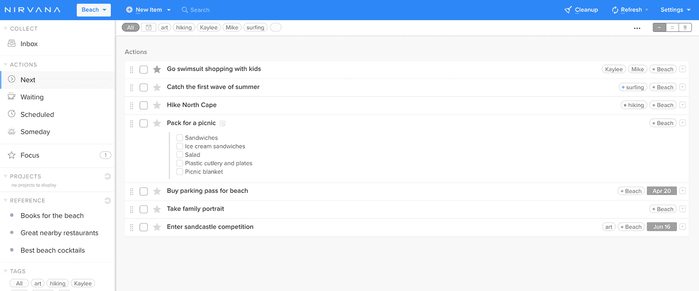
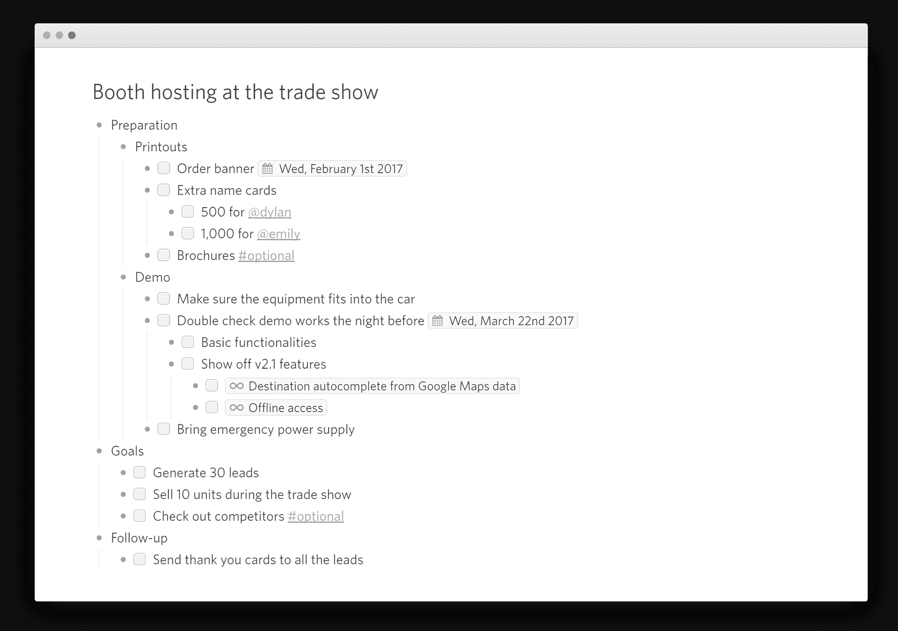
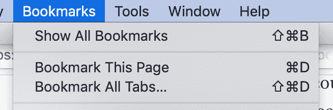
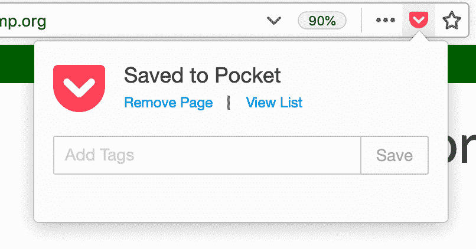
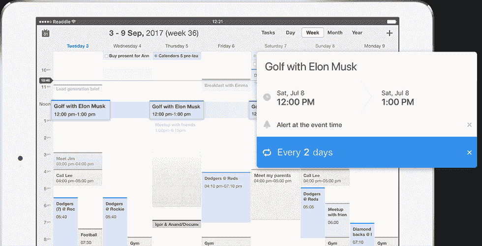
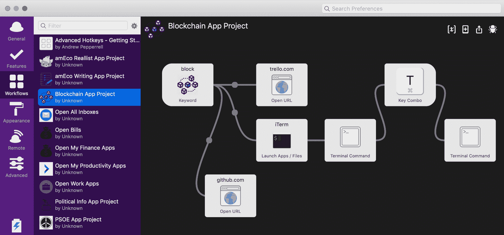
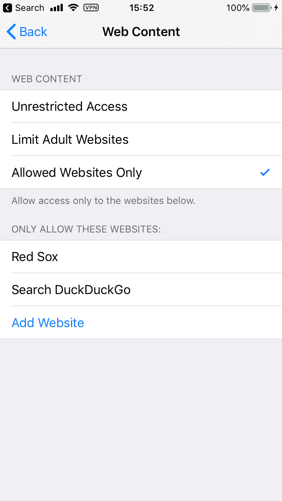
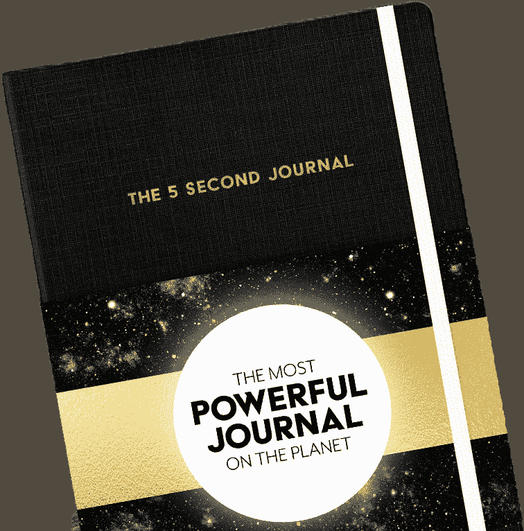

# 我如何使用生产力应用程序和组织我的数字生活

> 原文：<https://www.freecodecamp.org/news/productivity/>

> 一切都有一个家，不允许访客。大卫·克伦肖

生产力不是一天之内尽可能多的死记硬背；它是关于及时完成你所有的工作、杂务和差事，这样你就可以有更多的时间去做真正重要的事情，比如和家人或朋友在一起。

这篇文章是关于我用来保持高效和理智的方法和工具。我不是说这些对你来说是最好的工具或方法；这正是我所做的，我希望你们中的一些人会发现这些信息是有用的。

*注意:我没有得到这些应用或服务的赞助。我只推荐我觉得有用的。*

## 文章目录

1.  任务管理和列表
2.  任务自动化
3.  保持专注
4.  推荐书籍
5.  额外注释
6.  结论

## 任务管理和列表

### NirvanaHQ

NirvanaHQ Web Interface

Nirvana 是一款基于云的任务管理应用，我在手机、平板电脑和电脑上使用。如果你读过大卫·艾伦的《把事情做好》这本书，那么你会对这个应用程序使用的方法很熟悉。

你正在做的每一件事都变成了一个项目，任何需要完成的任务都必须以下列方式分类:“下一步”，一个立即可执行的项目；“等待”，当你在执行一个动作之前等待一些事件或人；“已计划”，用于基于截止日期的未来操作；和“某一天”，某一天/也许积压。

还有许多其他功能，如标签、区域和每日焦点。它们还有一个引用特性，你可以在那里保存列表，但是我并没有真正使用它，因为我在 Dynalist 中保存列表。

你可以在这里免费试用。我订阅了专业版，因为这个软件在组织方面帮了我很多。

### 动画师

我一直都在使用清单:我需要购买的东西，未来给家人的礼物想法，我想看的电影，我想去的地方，突然出现在我脑海中的随机想法，与某些主题相关的教程或文章，研究材料等等。每当我想到什么，它要么进入 Nirvana 的一个任务，要么进入 Dynalist 的一个列表。

我曾经到处都有清单，当我需要这些信息时，我永远也找不到我在哪个笔记本或应用程序中写下了什么。现在我的电脑和手机上都有 Dynalist，我总是知道先去那里看看。

我以前用 Workflowy，但是我觉得 Dynalist 的界面稍微好一点，而且不限制你在自由层可以有多少列表项。[链接](https://dynalist.io)

### 浏览器书签

我曾经是一个严重的储物者。我会堆积标签，直到我的浏览器崩溃，我被迫关闭它。这个习惯不能让我理清思路，或者专注于我正在做的事情。

现在我使用 Firefox 的书签下拉菜单中的“标记所有标签”动作，在每次切换任务时将所有打开的标签保存在一个独特的文件夹中(按名称和日期标记)。这让我可以关闭所有打开的东西，而不用担心当我拿起我正在处理的东西时会再次找到那些信息。注意:此功能仅将您在当前窗口中打开的所有标签加入书签。

### 口袋

我说过我在 Dynalist 中保存所有的列表，但这并不完全正确。当我看到一篇没有时间马上阅读的文章时，我通常会将其保存到 Pocket，因为浏览器插件允许我在短短几秒钟内标记并将其归档到一个列表中。当我想找些东西读的时候，我会定期浏览这些列表。

### 日历

信不信由你，我过去没有坚持使用任何日历，我经常错过约会和事件。现在我更忙了，我别无选择，只能用日历来组织我的时间表。

Readdle's Calendar 5 App

由于我的主要电脑是 Macbook Pro，我使用苹果的 iCal 桌面版，这比我以前使用的谷歌日历更好。

虽然苹果有一个非常好的桌面选项，但我认为 Readdle 的日历 5 是迄今为止我见过的最好的移动日历应用。它可以很好地与其他日历同步，并且有一个设计精美的界面。你也可以在应用程序中输入或说出你的日历事件，它会为你填写所有的细节。

我最近开始使用一个日历模板系统来组织我的日子，并从中看到了一些非常好的结果。我基本上在 iCal 中创建了一个名为“模板”的日历，我把一天的所有部分都放在里面。然后，我可以打开和关闭模板，并将其与我当前的时间表进行比较。这让我在精力最充沛的时候留出时间进行深度工作，在一天中精力较低的时候有时间开会或出差。

这里有一篇关于这个模板系统如何工作的很好的文章:[https://forge . medium . com/how-to-use-your-calendar-to-make-day-your-ideal-day-d 51e 2d cdfa 57](https://forge.medium.com/how-to-use-your-calendar-to-make-every-day-your-ideal-day-d51e2dcdfa57)

## 任务自动化

### 阿尔弗雷德 4

我去年开始使用 Alfred(当时是第三版)作为我的 Mac 电脑的一个更好的剪贴板管理器，但很快意识到它远不止如此。Alfred 有一个搜索框，看起来像 Mac 上的常规 Spotlight 搜索栏，当您按下 Command + Enter 时就会出现。

Alfred 的搜索栏不仅比默认的 Mac 搜索栏工作得更好，而且你还可以设置自己的“工作流”，即你输入的短字符串，它们被设置为执行你想要的任何一系列操作。例如，我有一些工作流被设置为打开我所有的生产力应用程序或我所有的收件箱，我需要每周检查这些应用程序或收件箱(本文稍后将详细介绍)。我设置的一些更高级的工作流程是打开我需要的所有应用程序和网页的快捷方式，以及为我正在处理的任何项目运行服务器。

作为一名顾问，Alfred 在任务切换方面给予了我极大的帮助，因此我可以关闭所有正在使用的终端窗口、文本编辑器和网页。然后，我只需在搜索框中键入几个字符，就可以轻松地为我需要处理的下一个项目打开新的。

### 缓冲器

Twitter feeds 有时很有用，但不是在我努力提高效率的时候。如果我发现了一篇好文章或有一个想法，我想在不登录 Twitter 并被内容滚动吸引的情况下分享，我只需登录 [Buffer](https://buffer.com/) 并安排稍后发布推文。

我有一个免费账户，因为我只有一个 Twitter 账户，但是你也可以用这个工具来管理你所有的账户。

### 提醒

这是我在手机设置中唯一打开的通知之一。我认为我需要记住的每件事，我都会放入提醒或带有提醒的日历事件中。这包括我需要记得在某个时间带、做或查的东西。

说真的，我认为大多数人都不擅长在正确的时间记住正确的事情。在我的手机上使用语音提醒太容易了，我不会冒险忘记任何东西。相反，我只是告诉我的手机提醒我以后。

### 账单支付

这个很简单——我只需为所有东西设置自动转账。我的 iCal 上还有一个名为“账单”的日历，里面保存了我所有的周期性账单或一次性未来账单，作为全天事件。然后每次我拿到工资的时候(现在大部分是半月一次)，我会检查所有即将到来的账单，我可以在不到 15 分钟的时间内规划我的预算。我现在甚至可以自动提取存款了。

## 保持专注

### 布置我的工作空间

我最近买了我的第一栋房子，所以我还在安顿下来，但我确保在后面一个安静的地方有自己的办公室。我有一张面向后院的固定的站立/坐着的桌子，还有工作台和一些我身后的架子。我办公桌上唯一的东西就是键盘、鼠标和显示器。我需要使用的任何其他东西，我只在需要的时候带到办公桌前，然后再放回去。

工作台和架子是我存放我正在做的有趣项目、工具和其他只会把我的桌子弄得乱七八糟的东西的地方。我的墙上也挂满了涂油板、图钉板和海洋主题装饰，以帮助我放松。

### LeechBlock

我用 Firefox 作为我的主要浏览器已经有一年多了，所以我几乎只在应用测试的时候才打开 Chrome。Leechblock 是一个浏览器扩展，可以在你设定的特定时间内阻止网站。我基本上设置为一直屏蔽社交媒体网站，部分时间屏蔽各种其他网站(你可以有多个要屏蔽的网站列表，每个列表有不同的设置)。

如果你使用 Chrome 作为你的主浏览器，我推荐使用 StayFocused。如果你使用多个浏览器或者需要屏蔽桌面应用，我强烈推荐使用 [Freedom](https://freedom.to/) 。这是一个优秀的、廉价的数字生产力项目。

### 手机使用/应用

我做了相当多的工作，让我的手机处于一种状态，让我不觉得它是一个持续分散注意力的来源。我删除了 iPhone、YouTube 和网络浏览器上的所有社交媒体应用。这可以防止我在精力不足时盲目滚动。相反，我现在安静地散步、休息或看书。

不幸的是，苹果不允许你删除 Safari，但我确实使用“内容与隐私限制>内容限制>网络内容”选项来设置允许的网站并阻止其他所有内容。我现在通常只使用手机上的网络浏览器来了解红袜队的比赛比分或快速搜索菜单。任何不在我列表中的网站都不会加载，除非我手动将它添加到我的白名单中(之后我会立即删除它)。

*注意:如果你需要屏蔽手机上的应用和网站，我推荐使用 [Freedom](https://freedom.to/) ，因为它可以屏蔽你所有设备上的任何内容(是的，他们现在也可以屏蔽 iOS 应用的流量了)。*

我对手机做的其他一些修改是，将我想看和经常使用的应用程序放在手机的第一页，然后将其他所有内容移到第二、第三或第四页，有时放在文件夹中，这样我就不必看到任何可能让我分心的应用程序。我把我的任务管理、待办事项和日历放在底部的栏上，所以我总是可以用拇指轻松访问这些应用程序。基本上，我让我更容易使用我想更多使用的应用程序，或者让我更有效率，隐藏不需要的应用程序。

### 5 秒日志

我是梅尔·罗宾斯的超级粉丝。从她的“数到五，开始行动”方法(称为“五秒规则”)，到她的书和关于相同或相似主题的演讲，我认为她是最优秀的生产力大师之一。我最近得到了她的新书，这其实是我每天早上填写的日志。我写下我的能量水平、最重要的任务和其他一些事情。然后，在这一页的另一面，我一小时一小时地写下我一天的计划。对我来说，这比在电脑上开始我的一天要好得多。写完日记后，我就开始锻炼，为新的一天做准备，所以我尽量在醒来后的一两个小时内不看手机或电脑；它帮助我在早上保持放松。

我会把时间表放在那里，一登录电脑开始工作，我就会把任何项目添加到我的电子时间表中。

### 项目日志

我曾经发现自己很难关闭与一个项目相关的所有标签和应用程序窗口，以切换到另一个项目，因为我害怕失去我的位置。为了解决这个问题，我开始写项目日志。在一个普通的数字笔记本里(我使用标准笔记，因为它是加密的)，我为每月的所有事情创建一个新的笔记，并在笔记里为每天创建一个新的标题。然后，我会在当天的任何任务或项目中标记出我离开的地方，这样我就可以在将来轻松地重新开始。

这帮助我理清思路，完全专注于我要切换到的任何任务，而不会让所有额外的标签和窗口永远打开，直到我完成某件事。

### 倍

出于某种原因，承诺在一定时间内完成一项任务真的有助于我集中注意力，尤其是当我不想做某件事的时候。我个人在手机上使用了类似番茄工作法的计时器:我设定工作 50 分钟后休息 10 分钟。

我真的不喜欢使用我的手机，因为我必须随身携带它，每次解锁以重置计时器。我要订购一个[计时器](https://www.timetimer.com/collections/timers)，这样我就可以把它放在我的桌子上，而不需要把手机放在身边。

## 书

以下是我推荐的一些帮助我发展效率系统的书籍:

*   大卫·艾伦
*   加州纽波特的数字极简主义
*   *深度工作*由加州纽波特
*   *不可分割的*作者:Nir Eyal
*   整理带来的改变生活的魔力:日本人整理和组织的艺术

## 额外的

正如大卫·艾伦在*把事情做完*中建议的那样，我每周清理一次收件箱。我有一个运行列表，上面列有我的待办事项或其他需要处理的事情。然后，每个周末，我都会花时间决定如何处理每一项，一次一项。例如，我的列表包括我的电子邮件收件箱、物理文件夹和一个放邮件或文件的抽屉、Skype 和 Discord 等消息应用程序，以及我还没有决定如何处理我的任务管理器 Nirvanahq 中的待办事项。

做每周大扫除真的帮助我重新调整心态，为下周做好适当的计划。它还帮助我摆脱了许多额外的垃圾，不管是物理上的还是数字上的，而不是让它们堆积起来。

我认为是我的生产力路线的一部分的一些其他事情是每周的膳食计划和周日的准备时间，早上锻炼以实现我设定的任何月度目标，以及计划这一周我将听什么样的广播和唱片。我还每天晚上查看第二天的日历，把第二天早上需要用的东西放在一边，比如运动服或我需要记得带的特殊物品。

## 结论

我认为我痴迷于生产力的一个原因是我很难集中精力和组织我的生活，除非我有这样的系统。这让我放松，而不是经常担心我忘记做什么。希望本文中的建议对你们中的一些人有所帮助。

你有更多关于生产力的建议吗？请在下面留下评论。

我的推特:[https://twitter.com/gwen_faraday](https://twitter.com/gwen_faraday)

我的 YouTube 频道:[https://www.youtube.com/channel/UCxA99Yr6P_tZF9_BgtMGAWA](https://www.youtube.com/channel/UCxA99Yr6P_tZF9_BgtMGAWA?view_as=subscriber)