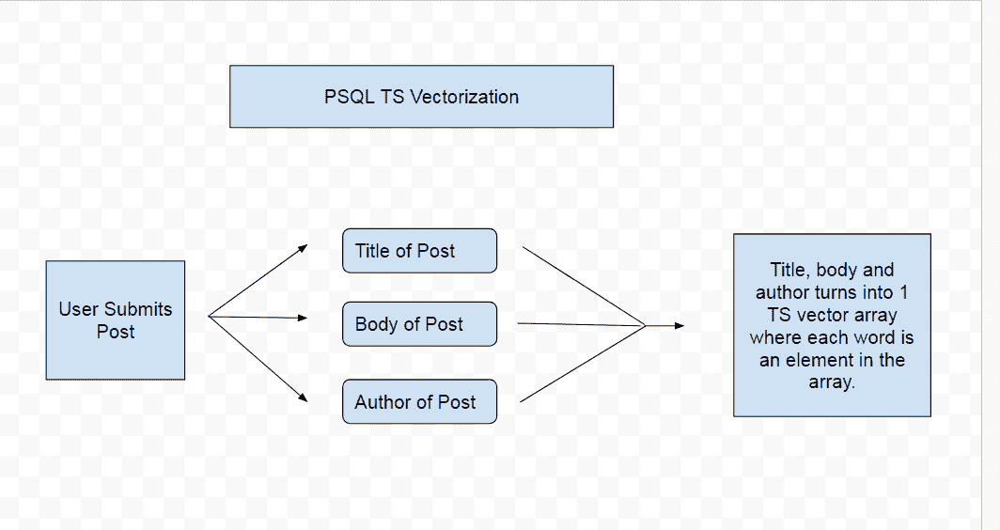
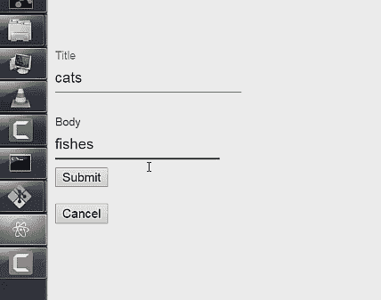
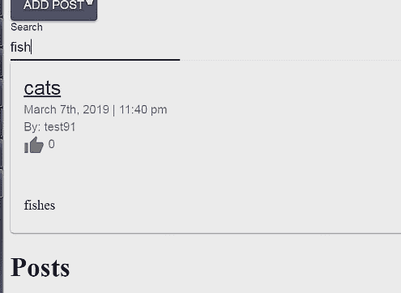
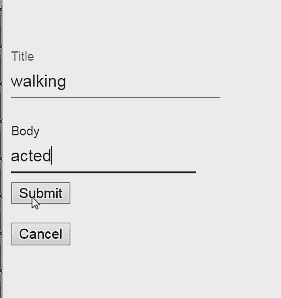
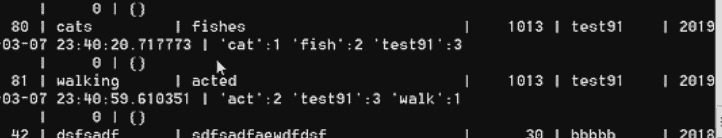

# 如何用 Postgres 构建实时反应和表达的全栈搜索引擎

> 原文：<https://www.freecodecamp.org/news/react-express-fullstack-search-engine-with-psql/>

在本教程中，我们将浏览并设置一个全栈搜索引擎，React 作为前端，Node 和 Express 作为服务器，PostgreSQL 作为数据库。

这个搜索引擎将比简单的文本搜索设置稍微复杂一些。例如，用户将能够获得单词的复数形式以及单词的过去和现在时态。搜索“猫”也会返回“猫”的结果。搜索“walked”将返回“walk”的结果，依此类推。

我们可以使用一个简单的起始项目，而不是从头开始:

[https://github.com/iqbal125/react-hooks-complete-fullstack](https://github.com/iqbal125/react-hooks-complete-fullstack)

你可以在这里观看本教程的完整视频版本
[https://www.youtube.com/playlist?list = plmc 67 chet-yzxrbobcfhza 4 sboxnr 7 HD D5](https://www.youtube.com/playlist?list=PLMc67XEAt-yzxRboCFHza4SBOxNr7hDD5)

### PostgreSQL 的 TS 向量和 TS 查询

为了完成这个复杂的搜索功能，我们将使用 PostgreSQL 的[内置文本搜索功能](https://www.postgresql.org/docs/10/datatype-textsearch.html)。

使这成为可能的两种数据类型是 be PSQL 的`tsvector`和`tsquery`数据类型。

`tsvector`:一张**义素**的清单。一个词位是一个允许你合并该词不同变体的词。例如，文本“walked”将被转换并保存为“walk”的词位。这将返回文本搜索“walk”、“walking”和“walked”的结果。

`tsquery`:是与 tsvectors 比较的词位列表。一段文本首先被转换成 tsquery，然后与 tsvector 进行比较，看是否匹配。



此图从本质上解释了 TS 矢量化是如何发生的。当用户提交帖子时，帖子和帖子的作者被转换成一个 ts 向量数组，并保存为一行。

重复的词也被去掉，单词的基本形式被用作词位。

### 真实世界的例子

假设你提交了一个标题为“猫”正文为“鱼”的帖子。



“猫”将返回“猫”的搜索结果


这也适用于非标准复数，“fish”将返回“fishs”的结果。



这也适用于单词的现在时态和过去时态。说我们有这个“走”和“演”的帖子:



“walk”将返回“walking”的搜索结果:


与“行为”和“被行为”相同。


如果您想深入了解，PSQL 数据库中的词汇看起来是这样的。



搜索向量列是“猫”:1“鱼”:2“测试 91”:3。请注意，尽管我们提交了标题为“猫”和正文为“鱼”的帖子，但是这些单词被转换成了词根形式。

这基本上允许与单词的其他形式进行比较，并使这种复杂的搜索成为可能。

如果听起来不错，我们可以开始代码设置。

### 反应设置

```
 //posts.js

.... 
const handleSearch = (event) => {
   setState({posts_search: []});
   const search_query = event.target.value
   axios.get('/api/get/searchpost', {params: {search_query: search_query} })
     .then(res => res.data.length !== 0
                    ? setState({posts_search: [...res.data]})
                    : null )
     .catch(function (error) {
       console.log(error);
       })
   }

....

    <TextField
      id="search"
      label="Search"
      margin="normal"
      onChange={handleSearch}
    />

 ...
```

我们只需要前端的两个主要部分就能实现。对服务器进行 API 调用的函数，以及在每次击键时触发该函数的输入元素。

`handleSearch()`函数本质上是从输入元素中提取文本，并作为一个参数在 **axios get** 请求中发送。

这可以很容易地插入到任何 React 组件中。

这就是 React 设置的真正目的。真正的奇迹发生在服务器和数据库端。

### 数据库设置

下面是帖子的 **SQL** 模式。注意，我们只有一个数据类型为`TSVECTOR`的列`search_vector`。我们没有一个`TSQUERY`列，因为该查询没有存储在我们的数据库中，它只是用作比较。

```
CREATE TABLE posts (
  pid SERIAL PRIMARY KEY,
  title VARCHAR(255),
  body VARCHAR,
  search_vector TSVECTOR,
  user_id INT REFERENCES users(uid),
  author VARCHAR REFERENCES users(username),
  date_created TIMESTAMP,
  like_user_id INT[] DEFAULT ARRAY[]::INT[],
  likes INT DEFAULT 0
);
```

这个搜索向量列将包含文章的标题、正文和作者的词位，组合成一个数组。我们可以看到这是如何在服务器设置中使用的。

### 服务器设置

```
 //Search Posts
router.get('/api/get/searchpost', (req, res, next) => {
  search_query = String(req.query.search_query)
  pool.query(`SELECT * FROM posts
              WHERE search_vector @@ to_tsquery($1)`,
    [ search_query ], (q_err, q_res) => {
    if (q_err) return next(q_err);
    res.json(q_res.rows);
  });
});

//Save posts to db
router.post('/api/post/posttodb', (req, res, next) => {
  const body_vector = String(req.body.body)
  const title_vector = String(req.body.title)
  const username_vector = String(req.body.username)

  const search_array = [title_vector,
                         body_vector, 
                         username_vector]

  const values = [req.body.title, 
                  req.body.body, 
                  search_array, 
                  req.body.uid, 
                  req.body.username]

  pool.query(`INSERT INTO
              posts(title, body, search_array, user_id, author, date_created)
              VALUES($1, $2, to_tsvector($3), $4, $5, NOW())`,
    values, (q_err, q_res) => {
    if (q_err) return next(q_err);
    res.json(q_res.rows);
  });
}); 
```

搜索引擎之所以能工作，是因为我们在保存帖子时做了什么，而不是因为搜索正在进行。

你可以看到，在我们的第二个函数中，我们首先将文章的标题、正文和作者转换成字符串，然后将它们组合到一个名为`search_array`的数组中。

然后，我们使用一个简单的 SQL insert 命令将整篇文章插入数据库。当我们这样做的时候，我们也在我们的`search_array`上运行`to_tsvector()`函数。

`to_tsvector()`是一个给定的 PSQL 函数，它将我们的数组转换成一个`tsvector`，并允许以后进行搜索。

那么搜索在这一点上就变得简单了。我们只是从前端获取文本，并将其转换为字符串。

然后我们使用`to_tsquery()`函数将其转换为`tsquery`数据类型。然后我们可以使用这个`ts_query`来检查`search_vector`列，看看是否有与`@@`操作符匹配的。

如果是，我们返回匹配的职位。然后，匹配的帖子将作为常规的 API 请求返回到我们的前端，并作为承诺解决。

由于 React 是一个单页应用程序，浏览器不会重新加载，搜索会感觉实时。

感谢阅读！

> 在 Twitter 上与我联系，了解更多关于未来教程的更新:[https://twitter.com/iqbal125sf](https://twitter.com/iqbal125sf)