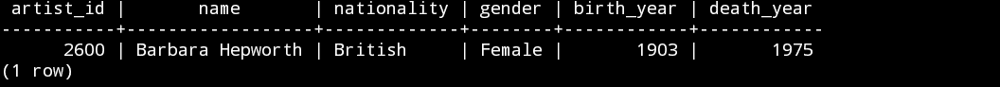
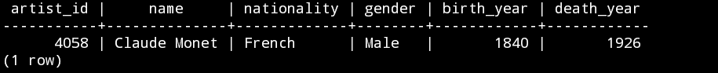
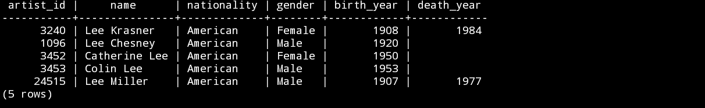
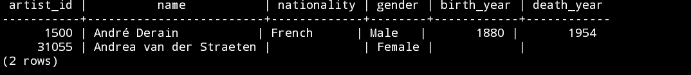
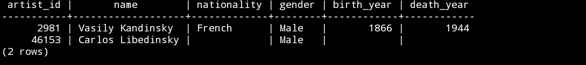
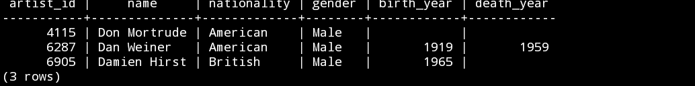
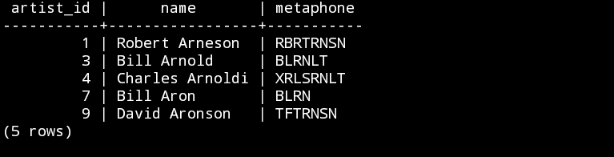
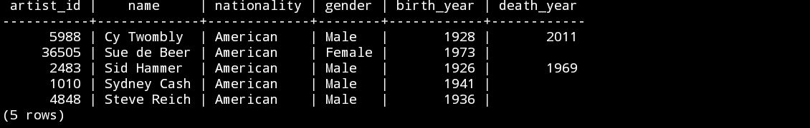
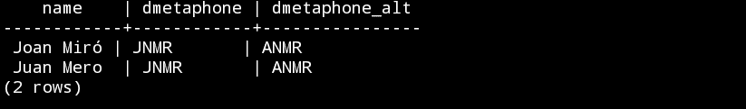
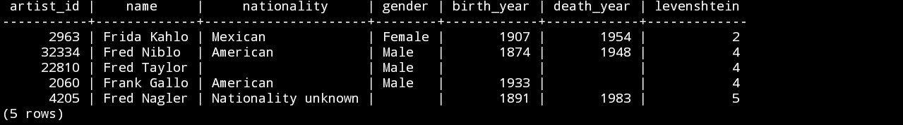

# 如何在 Postgresql 中使用模糊字符串匹配

> 原文：<https://www.freecodecamp.org/news/fuzzy-string-matching-with-postgresql/>

这是一个事实——人们经常会打错字或者简单地使用不同的拼写。

无论是什么原因，从实用的角度来看，相似字符串的不同变体都会给软件开发人员带来挑战。您的应用程序需要能够处理这些不可避免的边缘情况。

以名字为例。我有时叫彼得，有时叫皮特。在其他变体中，我的名字可以表示为:

*   "皮特·格里森"
*   《彼得·格里森》
*   “格里森先生”
*   彼得·格里森

更不用说我姓的其他拼法了，比如“格里森”。仅仅一个字符串的所有这些不同的变体——通过编程将它们相互匹配可能看起来并不明显。

幸运的是，有解决办法。

这些解决方案的通称是“模糊字符串匹配”。“模糊”是指在比较两个字符串时，解决方案不会逐位寻找完美的匹配。相反，它们允许某种程度的不匹配(或“模糊”)。

许多不同的编程语言都有可用的解决方案。今天，我们将探索 Postgresql(或“Postgres”)中的一些可用选项，Postgresql 是一种广泛使用的开源 sql 方言，具有一些非常有用的附加功能。

### 安装

首先，确保你的机器上已经安装了 Postgres。

然后，在它自己的目录下创建一个新的数据库(你可以随便叫它什么，在这里，我称之为‘fuzz-demo’)。从命令行:

```
$ mkdir fuzz-demo && cd fuzz-demo
$ initdb .
$ pg_ctl -D . start
$ createdb fuzz-demo
```

在这个演示中，我使用了一个表格，其中包含了现代艺术博物馆中艺术家的详细信息。

接下来，您可以启动 psql(Postgresql 的基于终端的前端):

```
$ psql fuzz-demo
```

现在，创建一个名为`artists`的表:

```
CREATE TABLE artists (
	artist_id INT,
    name VARCHAR,
    nationality VARCHAR,
    gender VARCHAR,
    birth_year INT,
    death_year INT);
```

最后，您可以使用 Postgresql 的 COPY 函数将 artists.csv 的内容复制到表中:

```
COPY artists FROM '~/Downloads/artists.csv' DELIMTER ',' CSV HEADER;
```

如果到目前为止一切正常，您应该可以开始查询艺术家表了。

```
SELECT * FROM artists LIMIT 10;
```

### 通配符过滤器

假设你记得一个叫芭芭拉的艺术家的名字，但是不太记得她的第二个名字。它以“Hep ...”开头。，但你不确定是怎么结束的。

在这里，您可以使用过滤器和 SQL 的通配符操作符`%`。此符号代表任意数量的未指定字符。

```
SELECT
	* 
FROM artists
WHERE name LIKE 'Barbara%'
AND name LIKE '%Hep%';
```

过滤器的第一部分查找名字以“Barbara”开头，以任意字符组合结尾的艺术家。

过滤器的第二部分查找名称可以以任意字符组合开头和结尾的艺术家，但必须按顺序包含字母“Hep”。



The output gives British artist Barbara Hepworth

但是，如果您不确定这两个名字的拼写，该怎么办呢？过滤器和通配符只能让你到此为止。

### 使用三元模型

幸运的是，Postgres 有一个有用的扩展，名字很吸引人，叫做 pg_trgm。您可以使用下面的命令从 psql 中启用它:

```
CREATE EXTENSION pg_trgm;
```

这个扩展为模糊字符串匹配带来了一些有用的功能。潜在的原则是使用三元模型(听起来像是《哈利·波特》里的东西)。

三元组是通过将一个字符串分成三个连续字母的组而形成的。例如，字符串“hello”将由以下三元组表示:

*   " h", " he", "hel", "ell", "llo", "lo "

通过比较两个字符串之间三元组的相似程度，可以估计它们在 0 到 1 之间的相似程度。这允许模糊匹配，通过设置相似性阈值，超过该阈值的字符串被认为是匹配的。

```
SELECT
	*
FROM artists
WHERE SIMILARITY(name,'Claud Monay') > 0.4 ;
```



The output is Claude Monet (with the correct spelling!)

也许你想看前五名的比赛？

```
SELECT 
	*
FROM artists
ORDER BY SIMILARITY(name,'Lee Casner') DESC
LIMIT 5;
```



The closest match is Lee Krasner, followed by Lee Chesney

默认阈值为 0.3。在这种情况下，您可以使用`%`操作符来简化对潜在匹配的模糊匹配名称:

```
SELECT
	*
FROM artists
WHERE name % 'Andrey Deran';
```



The output gives two artists, including one Andre Derain

也许你只知道这个名字的一部分。`%`操作符允许您比较数组的元素，因此您可以匹配名称的任何部分。下一个查询使用 Postgres' `STRING_TO_ARRAY`函数将艺术家的全名分割成单独名称的数组。

```
SELECT
	*
FROM artists
WHERE 'Cadinsky' % ANY(STRING_TO_ARRAY(name,' '));
```



The output gives two rows, including Vasily Kandinsky

### 语音算法

模糊字符串匹配的另一种方法来自一组称为语音算法的算法。

这些算法使用一组规则，用一个短代码来表示一个字符串。该代码包含关于如果大声朗读该字符串应该如何发音的关键信息。通过比较这些缩短的代码，可以模糊匹配拼写不同但发音相似的字符串。

Postgres 附带了一个扩展，允许您使用其中的一些算法。您可以使用以下命令启用它:

```
CREATE EXTENSION fuzzystrmatch;
```

一个例子是一种叫做 Soundex 的算法。它的起源可以追溯到 100 多年前——它在 1918 年首次获得专利，并在 20 世纪被用于分析美国人口普查数据。

Soundex 的工作原理是将字符串转换成描述它们发音的四个字母代码。例如,“花”和“面粉”的 Soundex 表示都是 F460。

下面的查询找到了听起来像名字“Damian Hurst”的记录。

```
SELECT
	*
FROM artists
WHERE nationality IN ('American', 'British')
AND SOUNDEX(name) = SOUNDEX('Damian Hurst');
```



The result includes British artist Damien Hirst (with the correct spelling)

另一种算法叫做变音音。这与 Soundex 的工作原理相似，它使用一组规则将字符串转换成代码表示。

metaphone 算法将返回不同长度的代码(不像 Soundex，它总是返回四个字符)。您可以向`METAPHONE`函数传递一个参数，指示您希望它返回的最大长度代码。

```
SELECT
	artist_id,
    name,
    METAPHONE(name,10)
FROM artists
WHERE nationality = 'American'
LIMIT 5;
```



The metaphone of each artist is produced.

因为 metaphone 和 Soundex 都返回字符串作为输出，所以您可以在其他模糊字符串匹配函数中使用它们。这种结合的方法可以产生强大的结果。下面的示例查找与 Si Tomlee 的名字最接近的五个匹配项。

```
SELECT
	*
FROM artists
WHERE nationality = 'American'
ORDER BY SIMILARITY(
	METAPHONE(name,10),
    METAPHONE('Si Tomlee',10)
    ) DESC
LIMIT 5;
```



The top result is American artist Cy Twombly.

在这里，只有三元模型的方法不会有多大帮助，因为“赛·托姆布雷”和“Si Tomlee”之间几乎没有重叠。事实上，这些只有 0.05 的`SIMILARITY`分数，即使大声朗读时听起来很相似。

由于其历史渊源，这些算法都不能很好地处理非英语语言来源的名称或单词。然而，有更多国际关注的版本。

一个例子是双变音算法。这使用了一套更复杂的规则来产生变音。它可以为英语和非英语源字符串提供替代编码。

例如，请参见下面的查询。它比较了西班牙艺术家胡安·米罗不同拼法的双变音输出:

```
SELECT
	'Joan Miró' AS name, 
    DMETAPHONE('Joan Miró'),
    DMETAPHONE_ALT('Joan Miró')
UNION SELECT
	'Juan Mero' AS name,
    DMETAPHONE('Juan Mero'),
    DMETAPHONE_ALT('Juan Mero');
```



Both the correct spelling and misspelling produce JNMR and ANMR as metaphones

### 坚持到底

最后，Postgres 中模糊字符串匹配的另一种方法是计算字符串之间的“距离”。有几种方法可以做到这一点。Postgres 提供了计算 Levenshtein 距离的功能。

在高层次上，两个字符串之间的 Levenshtein 距离是将一个字符串转换为另一个字符串所需的最小编辑次数。编辑被认为是字符级别的，可以包括:

*   替换，
*   删除，以及
*   插入

例如，单词“bigger”和“better”之间的 Levenshtein 距离是 3，因为您可以通过将“ett”替换为“igg”来将“bigger”转换为“better”。

同时,“最大”和“最好”之间的 Levenshtein 距离也是 3，因为你可以通过删除字母“igg”将“最大”转换为“最好”。

参见下面的查询，该查询查找与名字“Freda Kallo”具有最小 Levenshtein 距离的艺术家。

```
SELECT
	*,
    LEVENSHTEIN(name, 'Freda Kallo')
FROM artists
ORDER BY LEVENSHTEIN(name, 'Freda Kallo') ASC
LIMIT 5
```



Mexican artist Frida Kahlo is the closest match, followed by Fred Niblo, Fred Taylor and Frank Gallo

### 感谢阅读！

希望这篇关于 Postgresql 中模糊字符串匹配的概述为您的下一个项目提供了一些新的见解和想法。

当然，在其他编程语言中，还有其他模糊字符串匹配的方法没有在这里介绍。

例如，如果你使用 Python，看看 [fuzzywuzzy 包](https://github.com/seatgeek/fuzzywuzzy)。或者如果你喜欢 R，你可以使用内置的`agrep()`函数，或者试试 [stringdist 包](https://cran.r-project.org/web/packages/stringdist/index.html)。