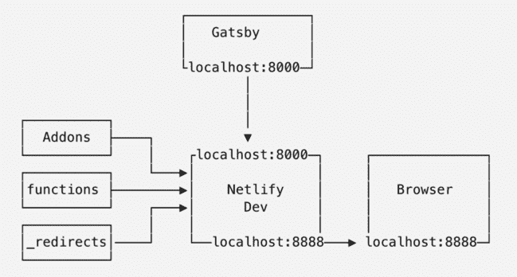

# 如何用 Gatsby 和 Netlify 构建认证的无服务器 JAMstack 应用程序

> 原文：<https://www.freecodecamp.org/news/building-jamstack-apps/>

当与后端交互时，JAMstack 应用程序可以做移动应用程序可以做的一切，而没有应用程序商店的专制。这是一个深入到为更开放、安全、分离、更快的网络而战的基本观点。

静态站点生成器(SSG)传统上用于为静态站点，甚至是电子商务站点生成标记 HTML，但是现代的 JavaScript SSGs 正在支持成熟的、超快的网络应用。Gatsby 使用 JavaScript 将标记重新合并成一个完全动态的 React 应用程序——这意味着您可以使用 API 来实现各种动态功能！

让我们看看如何使用 Netlify 函数向 Gatsby 静态站点逐步添加功能，然后使用 Netlify 身份添加身份验证来创建一个合适的 Gatsby 应用程序。我们将逐步建立一个完整的工作演示,包括:

*   ？？盖茨比中的动态客户端页面
*   ？无服务器功能(带网络开发)
*   ？？‍♂️Hide API 的秘密暴露在前端
*   ？身份验证(使用网络身份)
*   ？受保护的路线
*   ？认证的无服务器功能(为什么不！)
*   ？使用 GitHub、Bitbucket、Google 等外部提供商登录。

## 不是你父母的静态站点生成器

为什么你要用盖茨比而不是哲基尔或雨果，或者其他成百上千的静态站点生成器中的一个呢？[原因有很多](https://www.gatsbyjs.org/blog/2018-2-27-why-i-upgraded-my-website-to-gatsbyjs-from-jekyll/)，但其中一个独特的卖点是盖茨比如何帮助你用 React 构建[【静态渐进式网络应用】](https://www.gatsbyjs.org/docs/progressive-web-app/#progressive-web-app)。

[盖茨比的补水能力](https://www.gatsbyjs.org/docs/production-app/#dom-hydration)(多美的词！)DOM 意味着你可以用 JavaScript 做令人难以置信的动态事情，并且做出比传统的 SSG 更难的反应。

假设你有一个典型的静态盖茨比网站，比如[盖茨比-启动-默认](https://www.gatsbyjs.org/starters/gatsby-starter-default)。你可以`npm run build`它，它会吐出一堆 HTML 文件。太好了！我可以免费主持！

现在假设您的客户找到您，要求您添加一些需要在服务器上执行的自定义逻辑:

*   也许你有第三方 API 的秘密，你不想暴露给你的用户。
*   也许你需要一个服务器端代理来解决 CORS 问题。
*   也许你需要 ping 一个数据库来检查你的库存。

哦，不！现在你必须重写一切，并转移到一个数字海洋水滴！

我开玩笑的。不，你不必重写一切。

无服务器功能的美妙之处在于它是可增量采用的- **你的站点随着你的需求而增长** -使用 JavaScript 你可以根据实时 API 数据重新呈现你站点的整个部分。当然，你做得越多，资源就越密集(就带宽和计算而言)，所以有一个性能权衡。**你的网站应该像你需要的那样充满活力，但仅此而已。**盖茨比很适合这一点。

## 使用 Netlify Dev 添加无服务器功能

Netlify Functions 是一个很棒的低配置解决方案，用于向您的 Gatsby 站点添加无服务器功能。

我们假设您已经准备好了一个 Gatsby 站点，最好链接到 GitHub 之类的 Git remote。如果你没有，分叉下载[盖茨比-首发-默认](https://app.netlify.com/start/deploy?repository=https://github.com/gatsbyjs/gatsby-starter-default)。让我们看一下添加网络功能的步骤:

1.  **安装 Netlify CLI 并登录**:

```
npm i -g netlify-cli
netlify login # to link your free Netlify account 
```

很简单。

2.  **为您的 Gatsby 站点创建 Netlify 实例**:

```
netlify init 
```

您将被提示输入一个“构建命令”，对于 Gatsby 来说是`yarn build`，以及一个“发布目录”，对于 Gatsby 来说是`public`。您也可以将它保存在一个 [netlify.toml 配置文件](https://www.netlify.com/docs/netlify-toml-reference/?utm_source=blog&utm_medium=freecodecamp&utm_campaign=devex)中，或者 CLI 将为您创建它:

```
[build]
  command = "yarn build"
  functions = "functions"
  publish = "public" 
```

正如你在上面的例子中看到的，我们还将指定我们将函数保存到创造性命名的`functions`文件夹中的位置。

3.  创建你的第一个 Netlify 函数 : Netlify CLI 有一套[模板](https://github.com/netlify/cli/tree/master/src/functions-templates/js)可以帮助你开始编写无服务器函数。只需运行:

```
netlify functions:create # ntl functions:create also works 
```

您将看到一个自动完成列表。我们现在选择`token-hider`的例子。一旦选择了它，CLI 将复制出必要的文件，并安装必要的`axios`依赖项。

注意`token-hider.js`包括了这一行:

```
const { API_SECRET = "shiba" } = process.env 
```

这意味着模拟您不想暴露给前端的 API 秘密。您可以在您站点的 Netlify 仪表板上将这些设置为[构建环境变量](https://www.netlify.com/docs/continuous-deployment/?utm_source=blog&utm_medium=freecodecamp&utm_campaign=devex#environment-variables)。您可以随意命名它们，为了演示的目的，我们提供了一个默认值，但是当然您可以随意修改这些代码。这只是 JavaScript！

4.  **确保使用`netlify-lambda`** 安装函数依赖项(可选但推荐)

注意你的函数有自己的`package.json`和`node_modules`。这意味着每个功能都可以有自己独立管理的依赖项，但是您还需要确保在您部署或其他人克隆您的 repo 时安装这些依赖项。您可以将它们签入 git(唉！)，或者编写一个 bash 脚本来完成这个安装。但是不要担心，有一个简单的实用程序可以自动完成这项工作:

```
yarn add -D netlify-lambda 
```

并在`package.json`中添加一个安装后脚本(这不是 Netlify 特有的，它是 npm 如何工作的的一部分):

```
 "scripts": {
    "postinstall": "netlify-lambda install"
  }, 
```

5.  **启动盖茨比并使用网络开发功能**

Netlify Dev 是嵌入在 CLI 中的本地代理服务器，我们将使用它与 Gatsby 应用程序一起开发我们的功能。你可以这样开始:

```
netlify dev # or ntl dev 
```

您的 Gatsby 应用程序将在`http://localhost:8888`可用，您的功能将在`http://localhost:8888/.netlify/function/token-hider`可用。请在您的浏览器中查看！

Gatsby dev 服务器和 Netlify Functions 服务器如何在同一个本地端口上同时可用？你在 Netlify 端设置的 API_SECRET 怎么会在本地开发中可用？你应该有一个大致的心理图像，看起来像这样:



你可以在你的盖茨比应用程序的任何地方点击你的 Netlify 函数！例如，在任何事件处理程序或生命周期方法中，插入:

```
fetch("/.netlify/functions/token-hider")
  .then(response => response.json())
  .then(console.log) 
```

并且观看在你的控制台中弹出的狗图像列表。如果你是 React 新手，我强烈推荐[通读 React 文档](https://reactjs.org/docs/handling-events.html)以了解在哪里以及如何插入事件处理程序，这样你就可以，例如，[响应一个按钮点击](https://reactjs.org/docs/handling-events.html)。

## 添加身份验证

所以，是的，你的站点现在可以比任何静态站点更动态:它可以访问任何数据库或 API。您可以隐藏 API 令牌，以免被人窥探。它环绕 CORS 运行(顺便说一句，你也可以使用 [Netlify 重定向](https://www.netlify.com/docs/redirects/?utm_source=blog&utm_medium=freecodecamp&utm_campaign=devex)来实现)。但它不是一个*应用*应用。还没！

web 应用的关键点(让我们面对现实吧，用户真正为之付费的关键点)是它们都有一些`user`的概念，这带来了各种各样的复杂性，从安全性到状态管理再到基于角色的访问控制。整个路由需要通过身份验证来保护，敏感内容要屏蔽掉，以免被 Gatsby 的静态生成所影响。有时候有些东西你不想让谷歌的蜘蛛看到！

这是一个不同层次的关注，这使得它很难作为一个典型的盖茨比教程写在同一篇文章中。但我们是来做应用的，所以让我们开始吧！

## 向 Gatsby 添加网络身份和经过身份验证的页面

1.  **启用网络身份**:网络身份默认不启用。你必须去你的站点管理员那里打开它。[阅读文档](https://www.netlify.com/docs/identity/?utm_source=blog&utm_medium=freecodecamp&utm_campaign=devex)了解更多信息，例如添加脸书或谷歌社交登录！
2.  **安装依赖项** : `npm install gatsby-plugin-netlify-identity react-netlify-identity-widget @reach/dialog @reach/tabs @reach/visually-hidden gatsby-plugin-create-client-paths`
3.  **配置盖茨比**:为了动态！

```
// gatsby-config.js
module.exports = {
  plugins: [
    {
      resolve: `gatsby-plugin-create-client-paths`,
      options: { prefixes: [`/app/*`] },
    },
    {
      resolve: `gatsby-plugin-netlify-identity`,
      options: {
        url: "https://YOUR_AWESOME_SITE_INSTANCE_HERE.netlify.com",
      },
    },
  ],
} 
```

这将在客户端将`/app`路径下的所有东西都设置为动态的，这意味着您可以将它置于认证墙之后。

4.  **添加登录窗口小部件** : [`netlify-identity-widget`](https://github.com/netlify/netlify-identity-widget) 是一个框架无关的覆盖，带有一个漂亮的注册/登录 UI。然而，它是一个 60kb 的包，所以有一个 6kb 的替代包，只需假设您正在使用 React: `react-netlify-identity-widget`。

这个小部件是用`@reach/dialog`作为一个可访问的模态实现的，所以你需要把它放在你的应用程序中的某个地方:

```
// src/app/login.js
import React from "react"
import { navigate } from "gatsby"

import { IdentityModal } from "react-netlify-identity-widget"
import "react-netlify-identity-widget/styles.css" // delete if you want to bring your own CSS

export default function Login() {
  const [dialog, setDialog] = React.useState(false)
  return (
    <div>
      <h1>Log in</h1>
      <button onClick={() => setDialog(true)}>log in</button>
      <IdentityModal
        showDialog={dialog}
        onCloseDialog={() => setDialog(false)}
        onLogin={user => navigate("/app/profile")}
        onSignup={user => navigate("/app/profile")}
      />
    </div>
  )
} 
```

`react-netlify-identity-widget`使用 React 上下文，所以它通常需要添加一个提供者，但是`gatsby-plugin-netlify-identity`已经为您完成了(这就是它的全部目的！).

如您所料，您可以在应用程序的其余部分使用该上下文。`react-netlify-identity-widget`导出一个名为`useIdentityContext`的[自定义消费挂钩](https://kentcdodds.com/blog/how-to-use-react-context-effectively)，它帮助做一些运行时检查，并通过移除一个`undefined`检查使打字更容易。

`useIdentityContext`返回一个`identity`对象，[你可以在文档](https://github.com/sw-yx/react-netlify-identity#user-content-usage)上看到它向你展示的大量数据和方法。让我们用它们来实现一个`NavBar`组件！

```
// src/app/components/NavBar.js
import React from "react"
import { Link, navigate } from "gatsby"
import { useIdentityContext } from "react-netlify-identity-widget"

export default function NavBar() {
  const { user, isLoggedIn, logoutUser } = useIdentityContext()
  let message = isLoggedIn
    ? `Hello, ${user.user_metadata && user.user_metadata.full_name}`
    : "You are not logged in"
  const handleClick = async event => {
    event.preventDefault()
    await logoutUser()
    navigate(`/app/login`)
  }
  return (
    <div>
      <span>{message}</span>
      <nav>
        <span>Navigate the app: </span>
        <Link to="/app/">Main</Link>
        <Link to="/app/profile">Profile</Link>
        {isLoggedIn ? (<a href="/" onClick={handleClick}>Logout</a>) : (<Link to="/app/login">Login</Link>)}
      </nav>
    </div>
  )
} 
```

5.  **编写你的应用程序的其余部分**:由于我们在`gatsby-plugin-create-client-paths`中的配置，`src/pages/app`中的任何子路径都将免于 Gatsby 静态生成。为了保持应用程序和网站之间清晰的分界线，我喜欢把我所有的动态盖茨比代码放在一个专用的`app`文件夹里。这意味着你可以使用`@reach/router`和`react-netlify-identity-widget`来编写一个标准的动态 React 应用程序，提供私有的、经过认证的路由。下面是一些示例代码，让您了解如何将它们连接起来:

```
// src/app/app.js
import React from "react"
import { Router } from "@reach/router"
import Layout from "../components/layout"
import NavBar from "./components/NavBar"
import Profile from "./profile"
import Main from "./main"
import Login from "./login"
import { useIdentityContext } from "react-netlify-identity-widget"
import { navigate } from "gatsby"

function PrivateRoute(props) {
  const { isLoggedIn } = useIdentityContext()
  const { component: Component, location, ...rest } = props

  React.useEffect(
    () => {
      if (!isLoggedIn && location.pathname !== `/app/login`) {
        // If the user is not logged in, redirect to the login page.
        navigate(`/app/login`)
      }
    },
    [isLoggedIn, location]
  )
  return isLoggedIn ? <Component {...rest} /> : null
}
function PublicRoute(props) {
  return <div>{props.children}</div>
}

export default function App() {
  return (
    <Layout>
      <NavBar />
      <Router>
        <PrivateRoute path="/app/profile" component={Profile} />
        <PublicRoute path="/app">
          <PrivateRoute path="/" component={Main} />
          <Login path="/login" />
        </PublicRoute>
      </Router>
    </Layout>
  )
} 
```

唷，太多了！但是你现在应该对你的应用有一个坚实的起点:)

## 加分:认证的网络功能？

就像每一个魔术表演都有一个承诺、一个回合和一个声望一样，我还有最后一个小消息要告诉你。[客户端没有什么是安全的](https://stackoverflow.com/questions/50277192/react-security-concerns-restricted-pages-in-app)。虽然您可以将 Netlify 身份用户 ID 发送到 Netlify 功能端点，以便从 Gatsby 应用程序进行身份验证访问(例如在 POST 请求的正文中)，但您永远无法真正确定该流是否安全，不会受到恶意用户或窥探的攻击。

在无服务器函数中执行认证操作的最佳方式是在函数本身的上下文中从**开始。幸运的是，[网络身份和功能无缝地协同工作](https://www.netlify.com/docs/functions/?utm_source=blog&utm_medium=freecodecamp&utm_campaign=devex#identity-and-functions)。你所要做的就是在到达你的终点时发送用户的 [JWT](https://jwt.io/) :**

```
// in your gatsby app
const { user } = useIdentityContext()
// in an event handler
fetch("/.netlify/functions/auth-hello", {
  headers: {
    Accept: "application/json",
    "Content-Type": "application/json",
    Authorization: "Bearer " + user.token.access_token, // like this
  },
}).then(/* etc */) 
```

如果这是太多的样板文件，您甚至可以使用`identity`对象附带的获取包装器:

```
// in your gatsby app
const { authedFetch } = useIdentityContext()
// in an event handler
authedFetch("/.netlify/functions/auth-hello").then(/* etc */) 
```

然后在您的 Netlify 函数中，您现在可以检查`user`对象，或者将它传递到您的终端 API 或数据库:

```
module.exports = { handler }
async function handler(event, context) {
  if (context.clientContext) {
    const { user } = context.clientContext
    // you can get actual user metadata you can use!
    return {
      statusCode: 200,
      body: JSON.stringify({
        msg: "super secret info only available to authenticated users",
        user,
      })
    }
  } else {
    return {
      statusCode: 401,
      body: JSON.stringify({
        msg:
          "Error: No authentication detected! Note that netlify-lambda doesn't locally emulate Netlify Identity.",
      }),
    }
  }
} 
```

## Gatsby+Netlify——非常适合你的下一次黑客马拉松

如你所见，使用 Netlify 的免费工具，只需几个步骤就能把你的静态 Gatsby 站点变成动态的、经过认证的、完全无服务器的应用。这使得盖茨比成为你下一个应用的完美工具。如果你正在参加黑客马拉松，时间不多，或者只是想看完整的工作演示，请查看以下链接。

*   **代号:**【https://github.com/sw-yx/jamstack-hackathon-starter】T2
*   **Starter:**[https://www . gatsbyjs . org/starters/jam stack-hackathon-Starter](https://www.gatsbyjs.org/starters/jamstack-hackathon-starter)
*   **现场演示:**【https://jamstack-hackathon-starter.netlify.com/ 