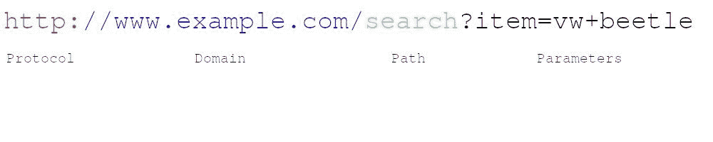
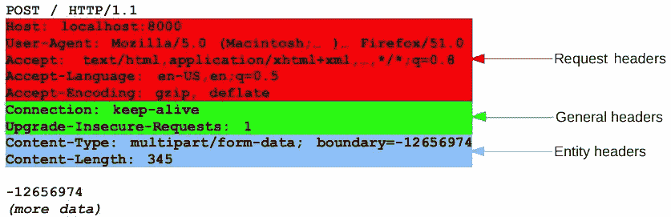
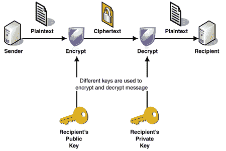

# HTTP 简介:你需要知道的一切

> 原文：<https://www.freecodecamp.org/news/http-and-everything-you-need-to-know-about-it/>

在这篇文章中，我将带你了解万维网的基本工作原理。

核心技术是 HTTP -超文本传输协议。这是你浏览网页时使用的通信协议。

基本上，当你访问一个网站时，你的浏览器向服务器发出 HTTP 请求。然后，服务器用一个资源(一个图像、视频或网页的 HTML)来响应，然后浏览器为您显示这个资源。

这是 HTTP 的基于消息的模型。每个 HTTP 交互都包括一个请求和一个响应。

就其本质而言，HTTP 是无状态的。

****无状态**** 意味着所有的请求都是相互分离的。因此，来自浏览器的每个请求本身必须包含足够的信息，以便服务器完成请求。这也意味着基于消息的 HTTP 模型的每个事务都是与其他事务分开处理的。

## 资源定位符

URL(统一资源定位器)可能是网络中最广为人知的概念。它也是最重要和最有用的概念之一。URL 是用于标识 web 上的资源的 Web 地址。

网络的概念是围绕资源构建的。从一开始，Web 就是一个共享文本/HTML 文件、文档、图像等的平台，因此它可以被认为是一个资源集合。

Example of an URL

**协议** —通常是 HTTP(或 HTTPS，HTTP 的安全版本)。

其他值得注意的协议有:

*   文件传输协议(FTP) —是一种标准的  协议，用于通过网络在客户端和服务器之间传输  文件。
*   简单邮件传输协议(SMTP)是电子邮件传输的标准。

**域** —用于标识资源所在的一个或多个 IP 地址的名称。

**路径**—指定资源在服务器上的位置。它使用的逻辑与您阅读本文的设备上使用的资源位置相同(即/search/cars/VWBeetle.pdf 或 C:/my cars/VWBeetle.pdf)。

**参数** —用于识别或过滤服务器上的资源的附加数据。

**注意**:在搜索关于 HTTP 的文章和更多信息时，您可能会遇到术语 URI(或统一资源标识符)。URI 有时被用来代替 URL，但主要是在正式规范中，被那些想要炫耀的人使用。:)

## HTTP 请求

在 HTTP 中，每个请求都必须有一个 URL 地址。此外，请求需要一个方法。四种主要的 HTTP 方法是:

*   得到
*   放
*   邮政
*   删除

我将在本文的 HTTP 方法部分解释这些方法以及更多内容。

这些方法直接对应于动作:

*   阅读
*   更新
*   创造
*   删除

所有 HTTP 消息都有一个或多个头，后面是可选的消息体。正文包含将随请求发送的数据或随响应接收的数据。

每个 HTTP 请求的第一部分包含三项:

示例:

*   获取/添加/搜索结果？item =大众+甲壳虫 HTTP/1.1

当 URL 包含“？”符号，意味着它包含一个查询。这意味着它发送所请求资源的参数。

1.  第一部分是一个方法，它告诉我们使用哪个 HTTP 方法。最常用的是 GET 方法。GET 方法从 web 服务器检索资源，因为 GET 没有消息体，所以在消息头之后不需要任何东西。
2.  第二部分是请求的 URL。
3.  第三部分是正在使用的 HTTP 版本。版本 1.1。是大多数浏览器最常用的版本，但是，2.0 版本正在取代它。

HTTP 请求中还有一些其他有趣的事情:

**Referer header** —告知请求来源的 URL。

**用户代理头** —关于用于生成请求的浏览器的附加信息。

**主机头** —唯一标识主机名称；当多个网页托管在同一台服务器上时，这是必要的。

**Cookie 头** —向客户端提交附加参数。

## HTTP 响应

就像 HTTP 请求一样，HTTP 响应也由三项组成:

示例:

HTTP/1.1 200 没问题

1.  第一部分是正在使用的 HTTP 版本。
2.  第二部分是请求结果的数字代码。
3.  第三部分是对第二部分的文本描述。

HTTP 响应中还有一些其他有趣的事情:

**服务器头** —关于正在使用哪个 web 服务器软件的信息。

**Set-Cookie header** —向浏览器发布 Cookie。

**消息体**—HTTP 响应通常包含消息体。

**Content-Length header** —以字节表示消息体的大小。

## HTTP 方法

最常见的方法是 GET 和 POST。但是也有一些其他的。

**GET** —您使用这个方法从指定的资源请求数据，其中数据没有以任何方式被修改。GET 请求不会更改资源的状态。

**POST** —使用这种方法向服务器发送数据来创建资源。

**PUT —** 您可以使用这个方法，通过使用请求体中的内容来更新服务器上的现有资源。请将此视为“编辑”某些内容的一种方式。

**HEAD** —使用该方法的方式与使用 GET 的方式相同，但区别在于 HEAD 方法的返回不应在响应中包含 body。但是返回将包含相同的头，就像使用了 GET 一样。在发出 GET 请求之前，使用 HEAD 方法检查资源是否存在。

**TRACE —** 您将此方法用于诊断目的。响应将在其主体中包含请求消息的确切内容。

**OPTIONS** —使用该方法描述目标资源可用的通信选项(HTTP 方法)。

**修补—** 您可以使用此方法对资源进行部分修改。

**删除—** 使用此方法删除指定的资源。

## 休息

表述性状态转移(REST)是一种架构风格，其中请求和响应包含系统资源当前状态的表示。

“常规”道:

*   [http://carapp.com/search?make=wv&车型=甲壳虫](http://carapp.com/search?make=wv&model=beetle)

休息式:

*   [http://carapp.com/search/vw/beetle](http://carapp.com/search/vw/beetle)

如果你好奇的话，你可以在这里了解更多关于休息的知识。

## HTTP 标题

请求/响应结构由三个主要部分组成。其中包括:

*   首行
*   头球
*   正文/内容

我们已经讨论了 HTTP 请求和响应中的第一行，也提到了主体功能。现在我们将讨论 HTTP 头。

HTTP 头添加在第一行之后，并被定义为由冒号分隔的名称:值对。HTTP 头用于随请求或响应一起发送附加参数。

正如我已经说过的，消息体包括与请求一起发送的数据或与响应一起接收的数据。

有不同类型的标题，根据其用途分为 4 大类:

*   **通用报头** —可以在请求和响应消息中使用的报头，与交换的数据无关。
*   **请求报头** —这些报头定义了所请求数据的参数，或者给出关于发出请求的客户端的重要信息的参数。
*   **响应头** —这些头包含关于传入响应的信息。
*   **实体头** —实体头描述了组成消息体的内容。

Types of headers

## HTTP 状态代码

浏览网页时，您可能会遇到“404 错误:未找到”页面或“500 错误:服务器没有响应”页面。

这些是 HTTP 状态代码。

每个 HTTP 响应消息的第一行都必须包含 HTTP 状态代码，告诉我们请求的结果。

有五组状态代码，按第一个数字分组:

*   1xx —信息性。
*   2xx —请求成功。
*   3xx —客户端被重定向到不同的资源。
*   4xx —请求包含某种错误。
*   5xx —服务器在执行请求时遇到错误。

这里是 HTTP 状态响应代码及其解释的完整列表。

## HTTPS(超文本传输协议安全)

HTTP 协议的安全版本是超文本传输协议安全(HTTPS)。HTTPS 在浏览器(客户端)和网站(服务器)之间提供加密通信。

在 HTTPS，通信协议使用传输层安全性(TLS)或安全套接字层(SSL)进行加密。

因此，该协议也经常被称为 TLS 上的 HTTP，或 SSL 上的 HTTP。

TLS 和 SSL 协议都使用非对称加密系统。不对称加密系统使用公钥(加密密钥)和私钥(解密密钥)来加密消息。

任何人都可以使用公钥来加密消息。然而，私钥是保密的，这意味着只有指定的接收者才能解密消息。

Example of asymmetric encryption system

#### SSL/TLS 握手

当您请求 HTTPS 连接到网站时，该网站会将其 SSL 证书发送到您的浏览器。浏览器和网站发起通信的过程称为“SSL/TLS 握手”

SSL/TLS 握手包括一系列步骤，在这些步骤中，浏览器和网站相互验证，并通过 SSL/TLS 隧道开始通信。

您可能已经注意到，当在 HTTPS 连接中使用可信安全通道时，浏览器地址栏中会显示绿色挂锁图标。

Example of one of my secure pages

#### **HTTPS 的好处**

HTTPS 的主要优点是:

*   像信用卡号码和其他敏感信息一样，客户信息是加密的，无法被截获。
*   访问者可以验证你是一个注册企业，你拥有该域名。
*   消费者知道他们不应该访问没有 HTTPS 的网站，因此，他们更有可能信任并完成从使用 HTTPS 的网站的购买。

感谢您的阅读！在我的 freeCodeCamp 个人资料上查看更多类似的文章[。并在我的 GitHub 页面](https://www.freecodecamp.org/news/author/goran/)上查看我创建的其他有趣的东西[。]( https://github.com/GoranAviani)