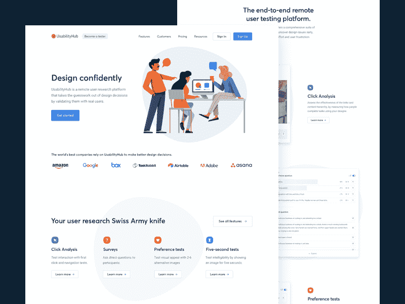
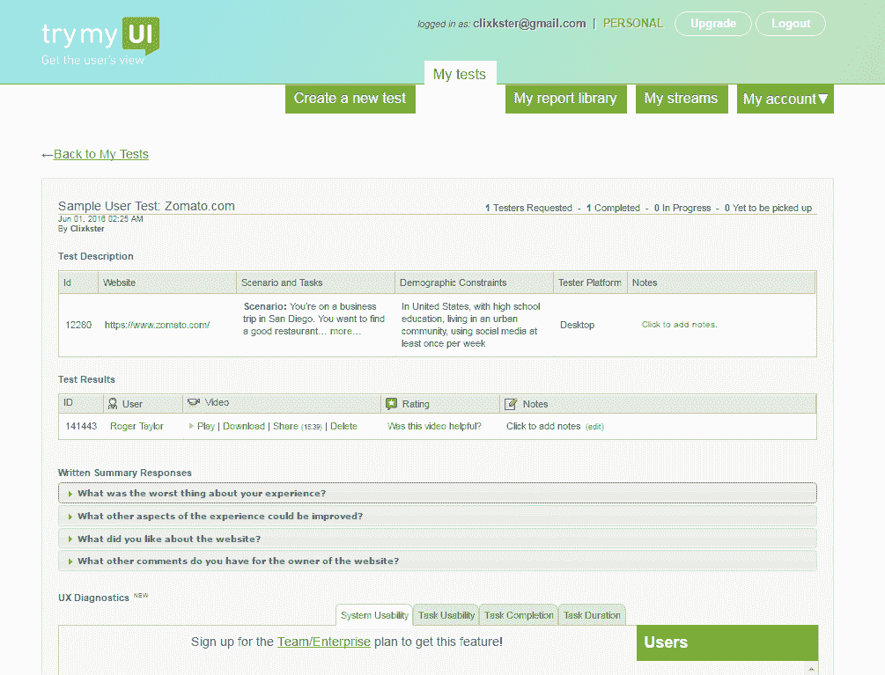
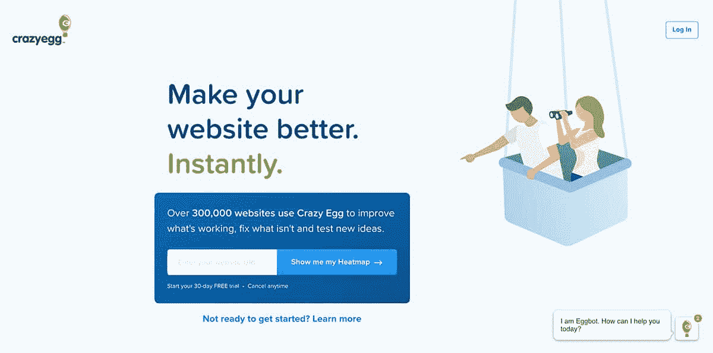
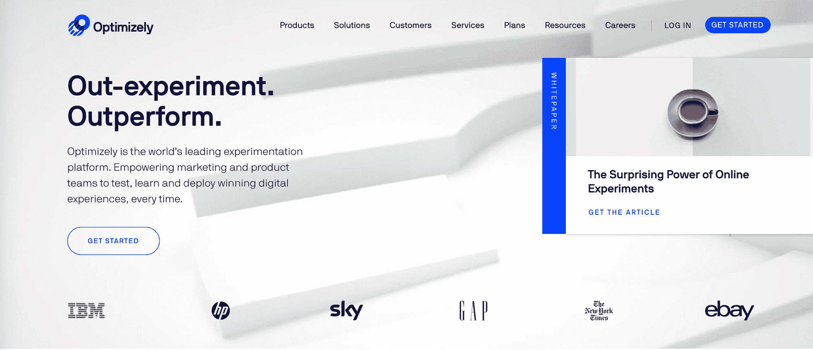
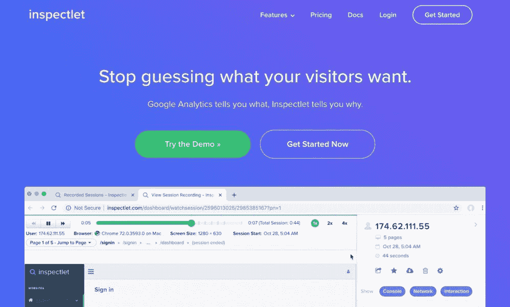

# 网站开发者和设计者的最佳可用性测试工具

> 原文：<https://www.freecodecamp.org/news/10-best-ux-testing-software-tools/>

没有用户测试，UX 设计是不完整的，用户测试是这个过程不可分割的一部分。了解用户如何与你的设计交互对你来说非常重要，这样你才能创造出最佳的用户体验，让访问者完成他们的任务并提高转化率。这就是可用性测试工具在企业和编程层面测试您的 UX 设计时发挥作用的地方。

## 从各种可用性测试工具中选择

拥有并运行自己的用户测试实验室会消耗你太多的时间和金钱，这包括寻找和招募你自己的目标消费者，并设置必要的硬件。不要担心，因为有很多可用性测试工具可以消除所有这些需求。

在这篇文章中，我将为您提供足够有用的工具，让您能够监控用户行为并收集反馈。有了[软件测试服务](https://www.valuecoders.com/testing-qa)和工具，你将非常自信地发现你自己网站/网络应用 UX 设计中的任何缺陷。

你应该试运行这里给出的每一个可用性测试工具，以便在你冒险之前清楚地知道每一个工具满足你需求的程度。

所以，这里是我列出的 10 个 UX 测试工具，让你的生活更轻松。

## 10 个最佳可用性测试工具

### 1.最好的可用性测试工具之一

[https://www.youtube.com/embed/kE6jtCYxDVA?feature=oembed](https://www.youtube.com/embed/kE6jtCYxDVA?feature=oembed)

Userlytics Demo

Userlytics 被认为是理想的远程可用性测试工具。它被设计成允许你记录用户与网站、移动应用或原型的交互。该工具利用画中画远程测试软件来捕捉用户的音频评论和面部表情，这两者都可以测试您的资产，并为您提供他们实时反应的完整图片。

开始使用 Userlytics 不需要复杂的设置或硬件。这是快速、经济地发现移动应用程序中令人沮丧的地方的理想方法。你会很快发现为什么用户在网站上做他们正在做的事情。

### 2.可用性测试工具彻底解决你的设计争论

当导航工具栏放在左边还是右边时，你可能会感到困惑，不知道人们会更喜欢设计 A 还是设计 b。做出设计决策是令人沮丧的，尤其是在确定哪种设计是发布的理想解决方案时。

可用性 Hub 可用性测试工具以解决这类问题而闻名。它旨在让您完全解决任何设计争论。它有五个不同的套件，使您能够捕捉和分析用户的偏好，并做出明智的决定。

你要做的就是上传一张你的网站界面，手机 app UI，或者软件设计的图片，给用户一个任务去做，然后等待结果。

UsabilityHub 将给出一个报告，显示用户点击的热图。你也可以设置一个五秒钟的测试来捕捉用户对设计的第一印象。

这个用户测试工具还允许你上传多个设计，并询问用户他们最喜欢的版本，以及他们为什么喜欢它。您还可以上传导航测试来确定退出点(最适合复杂的用户旅程),并组织调查来收集用户反馈。

UsabilityHub 有一个基本的免费选项，如果你希望这个软件为你提供测试主题，你只需要付费。所有这些使它成为最好的网站可用性测试软件工具之一。

### 3.[回顾](https://lookback.io/)现场测试的高级可用性测试工具之一

这是一个用户体验记录软件，制作简单。有了这个可用性测试工具，你可以在内部或远程记录用户的计算机或移动设备，而不需要任何额外的设备。

让 Lookback 与众不同的是，当用户探索你的设计时，你可以加入现场测试会话并与他们交谈，提出问题或进行采访。

其他可用性测试工具只在测试完成后提供报告或记录。但当你使用回看时，它允许你修正测试，实时观察测试，并直接向用户询问后续问题。这是一个能立即得到答案的简单方法。

### 4.Hotjar 一个有洞察力的可用性测试工具

Hotjar 有许多有用的可用性测试工具(称为非常有用的用户测试工具),允许你分析和获得对你的网站有用的反馈。Crazy Egg(也包括在我们下面的列表中)可能是用户测试软件，当你有热图的想法时，你会想到它，但是 Hotjar 也包含它们。

所有这些都会让你知道你的用户最喜欢你界面的哪个部分。您还将了解界面的哪些部分获得了最多的点击。

使用 Hotjar，您还可以看到用户的鼠标轨迹记录，以指示他们浏览您的站点的方式。Conversions 漏斗实用程序允许您了解用户在购买或注册过程中的退出点。

这样的特点都很有见地。漏斗可以让你精确定位网站的哪个部分需要调整以获得更好的设计效果。这个工具还有其他一些功能，比如表单分析和反馈投票。

### 5.试用 MyUI 可用性测试工具来测试你的网络应用

TryMyUI 是最好的可用性测试工具之一，致力于帮助您发现如何改进您的移动应用程序或网站。有了它，您可以建立自己的定制测试，让用户执行特定的任务。它还允许你通过各种人口统计数据找到理想的用户群。您还可以查看参加您提供的测试的用户的记录。

也可以使用 TryMyUI 流服务。它安装在您的网站上，以收集用户与您的网站交互方式的实时信息。这让你可以用 Stream 的 AI 挫折查找器发现缺陷并识别廉价的 UX。它有助于识别用户的选择方式，以及引导他们走向成功和失败的路径。

### 6.[用户测试](https://www.usertesting.com/)对网站开发者来说最好的可用性测试工具之一

[https://www.youtube.com/embed/aqC8NhPPbQw?feature=oembed](https://www.youtube.com/embed/aqC8NhPPbQw?feature=oembed)

UserTesting Quick Tour

记录用户与网站的互动以及他们的反应的最好方法是通过视频和用户测试。你将能够选择你的目标受众，并在你的应用程序或网站上给用户分配任务。

该测试可以在台式机、平板电脑或手机上运行。用户测试将记录用户在与你的应用或网站互动时分享他们的想法。然后你就能知道为什么用户在做他们正在做的事情。用户测试可用性测试工具免费试用。

### 7.[疯狂的彩蛋](https://www.crazyegg.com/)可用性测试工具为应用测试提供完整的解决方案

有了疯狂的彩蛋可用性测试工具，你就可以像戴着 x 光眼镜一样，知道访问者是如何与你的网站互动的。这个可用性测试工具可以让你了解人们在你的网站上的活动，以及为什么访问者没有被转化为固定客户和用户。

点击的对象由热图识别。此外，他们还确定了他们被推荐的来源。《疯狂鸡蛋》中最有用的东西之一是滚动地图，它能够识别访问者在完全放弃页面之前向下滚动了多远。

其他有用的东西是监控页面每个元素的点击量，以及进行 A/B 测试的能力。所有这些都让“疯狂鸡蛋”榜上有名。

### 8. [Reflector 3](https://www.airsquirrels.com/reflector) 用于监控移动应用设计性能的测试工具

屏幕镜像应用 Reflector 并不是专门为可用性测试而设计的，但它对于测试和了解你的应用程序设计如何在移动设备上工作非常有帮助。

该工具将你的平板电脑或手机屏幕无线发送到你的 Mac 或 PC，让你看到人们如何使用你的应用程序。Reflector 还具有记录功能，因此您可以在一段时间后回顾您的测试会话，或者在观众面前分享和展示它们。

### 9.[优化](https://www.optimizely.com/)你的网络应用程序的最佳可用性测试工具之一

A/B 测试是测试与现有设计(或替代的建议更新)相比，web 页面上计划的更改的最强大的方法之一。它有助于确定哪个版本给出了最积极的结果。谷歌提供了自己的 A/B 测试软件 Google Optimize，这样你就可以在你的网站上进行实验。

然而，一个更强大的 A/B 测试软件工具是 Optimizely。该工具提供了许多易于使用的特性来帮助您构建测试。在这样的工具上，您可以执行多变量测试，这是一种在给定的网页上测试许多变量的技术。当你向访问者展示新的设计时，你也可以创造个性化的体验并锁定特定的受众(包括锁定不同的 URL、浏览器和地理区域)。

Optimizely 是一套全面的可用性测试工具。但是，这意味着严重的业务，这是显示在价格上。

### 10. [Inspectlet](https://www.inspectlet.com/) 可用性测试工具，提供网站测试的完整帮助

Inspector 是一款著名的可用性测试工具，以记录访问者并准确监控他们在网站上的活动而闻名。你将了解他们点击什么，他们的鼠标移动，他们的按键和滚动。你可以近距离观察你的每一位访客，就像你坐在他们旁边一样。

除了记录用户在你的网站上的交互，Inspectlet 可用性测试工具还有一个热图，这样你就可以识别访问者感兴趣的部分。热图还具有眼球追踪功能，可以显示点击次数最多的内容以及访问者向下滚动页面的距离。此外，表单分析工具清楚地反映了哪些表单元素是最让访问者讨厌的，哪些地方有不完整的地方。

## 结论

在这篇文章中，我根据你的具体需求和预算讨论了 10 个最好的可用性测试工具。

作为一个中小企业，初创企业，或任何级别的企业，如果你想有软件和 QA 测试的服务，那么你必须选择理想的软件测试公司。

如果你负担不起知名软件测试公司的服务，那么明智的做法是选择[外包软件开发](https://www.valuecoders.com/)和像估价师这样的测试公司。或者，[租一个编码器](https://www.valuecoders.com/hire-developers)，用最好的技术改进你的网站/网络应用程序 UX 的设计。随时[联系](https://www.valuecoders.com/contact)。

> *在 Twitter 上与我联系，了解更多关于未来帖子/教程的更新:[https://twitter.com/ValueCoders](https://twitter.com/ValueCoders)*