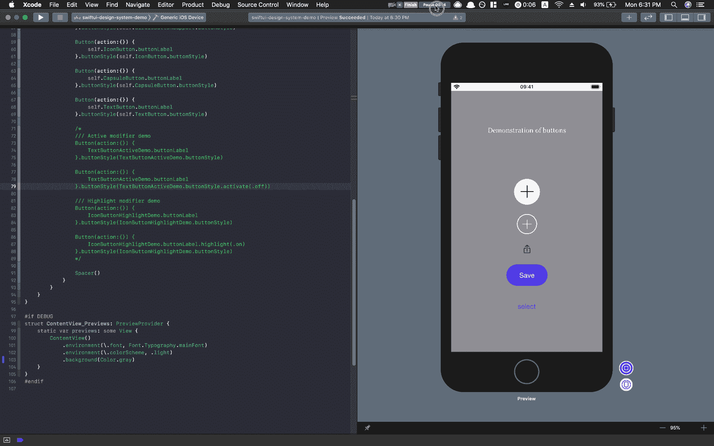
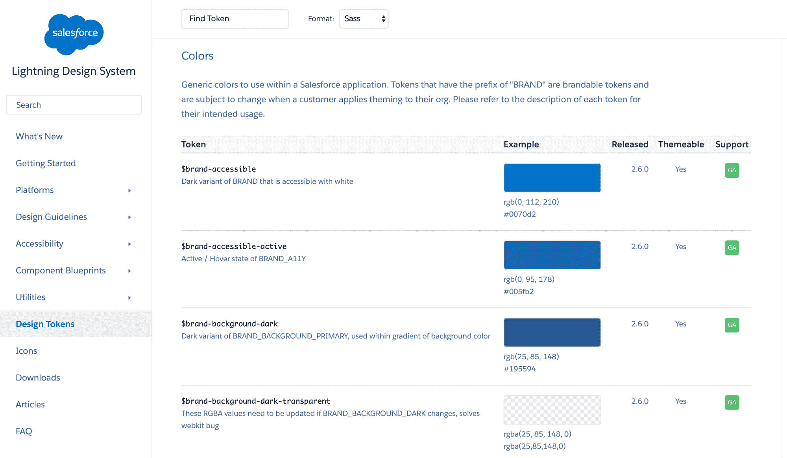
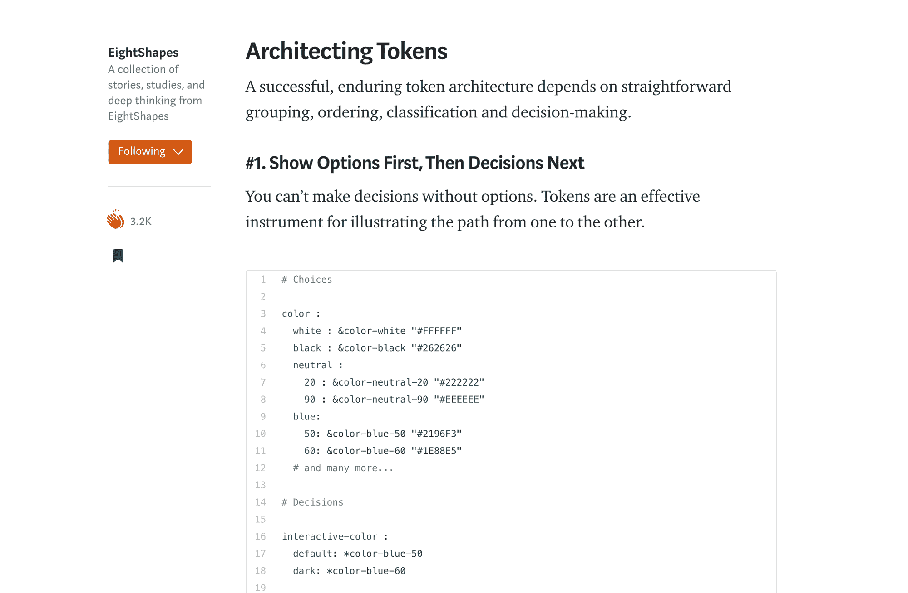

# 如何用 SwiftUI 构建设计系统

> 原文：<https://www.freecodecamp.org/news/how-to-build-design-system-with-swiftui/>

构建一个支持一种产品的设计系统并不容易——为了可伸缩性，它必须同时具有健壮性和灵活性。虽然具有挑战性，但 [的](https://medium.com/eightshapes-llc/tokens-in-design-systems-25dd82d58421)[许多](https://www.designbetter.co/design-systems-handbook/building-design-system) [伟大的](https://lightningdesignsystem.com/design-tokens/) [资源](https://www.youtube.com/watch?v=wDBEc3dJJV8)分享了有用的原则和方法，帮助团队在视觉上和编程上构建良好的系统。站在他们的肩膀上，这篇文章试图通过专注于在`SwiftUI`中建立一个好的系统来为一个未触及的领域做出贡献。

## 我为什么写这篇文章

在纽约 ITP T2 的第一个夏天，我很幸运有机会在 T4 Line Break 工作室做 iOS 开发实习生。我被分配的一项任务是分两步构建一个设计系统:首先在[草图](https://www.sketch.com/)中可视化，然后在`SwiftUI`中程序化。尝试新框架并使用它构建设计系统的体验令人惊叹，但同时也充满了错误。这就是为什么我们想与社区分享我们的经验，希望使您的开发过程更容易。

* * *

## 什么是 [SwiftUI](https://developer.apple.com/documentation/swiftui)

苹果在 [WWDC 2019](https://developer.apple.com/videos/wwdc2019/?q=swiftui) 发布了这一开创性的新框架，这是多年来最好的框架之一。从 web 开发人员的角度来看，`SwiftUI`中的项目开发体验更接近于传统的前端堆栈和框架。

这绝对是一个了不起的举动，因为编程接口和管理状态比以前容易多了。这一改进最好的部分是人们可以[平滑地集成 UIKit 和 SwiftUI】。学习 SwiftUI 的基础，苹果提供的](https://developer.apple.com/tutorials/swiftui/interfacing-with-uikit)[官方教程](https://developer.apple.com/tutorials/swiftui/tutorials)非常有帮助。

[https://www.youtube.com/embed/aH7oWxfxpJY?feature=oembed](https://www.youtube.com/embed/aH7oWxfxpJY?feature=oembed)

Intro to SwiftUI from WWDC

## 演示项目

为了演示，我放了一个我们在 [Line Break Studio](https://www.linebreak.studio/) 中构建的设计系统的简化版本。它是一套不同形式的**按钮**组件，构建在两个下层部件之上:**排版**和**调色板**。

Dynamic rendering view of the demo project

该项目在 GitHub 上[公开，我使用`Xcode 11 Beta 5`进行开发。一个作为设计系统管理中枢的](https://github.com/vince19972/SwiftUI-Design-System-Demo)[空中平台基地](https://airtable.com/shrHQdv9vQGz7UMQj)(阅读[更多关于工作流管理](https://www.vinceshao.com/blog/a-better-web-development-workflow-confluence-airtable-jira-and-abstract))也公开供参考。

* * *

## 建筑设计系统原理

代码设计系统是设计者和开发者之间的中间件。系统开发人员以可视化的形式从设计系统中获取输入，并生成与之一致的 API，以便进一步开发。要在代码中完成该系统，应认识到以下两个原则:

### 1.与[令牌](https://medium.com/eightshapes-llc/tokens-in-design-systems-25dd82d58421)通信

从根本上说，在程序中拥有设计系统的目的不是为了更好的代码管理或开发效率，而是为了确保**视图**与设计文件一致。为了实现这一目标，使用标记来表示某种颜色、字体、大小或任何视觉元素，对于保持团队中开发人员、设计人员和管理人员之间的交流质量至关重要。

[Lightning Design System](https://www.lightningdesignsystem.com/design-tokens/)'s tokens built by Salesforce

### 2.等级制度的层次

在 [EightShapes 的文章](https://medium.com/eightshapes-llc/tokens-in-design-systems-25dd82d58421)中，它指出我们应该“先展示选项，然后是决策”，因为“没有选项你就不能做决策。”

[EightShapes' article](https://medium.com/eightshapes-llc/tokens-in-design-systems-25dd82d58421) about design tokens

这种排序架构降低了不同级别之间的耦合度，因此为可能的修订提供了更多的灵活性和动态性。我构建层次的方式是从下到上的顺序:材料→基础→令牌。但这可能是团队能接受的任何方式。

* * *

## 钻研代码

以下部分是根据我们的经验，我们想要指出的一些亮点。请[访问 GitHub repo](https://github.com/vince19972/SwiftUI-Design-System-Demo) 获取完整代码。欢迎任何反馈或批评改进。

### 1.架构层次

有两种方法可以在较低的等级堆叠材料来建造最高等级的令牌:

*   **使用`enum`进行类型安全和代码读写**

在代码中使用 enum 作为分组包装器或函数中的参数的优势已经被充分认识到。这里值得一提的一点是层级的实现。

我们总是在最底层存储原始值，包括字体大小(`CGFloat`)和字体名称(`String`)，因为我们不想弄乱它。但是因为原始值必须是 enum 中的文字，所以我们不能仅仅将一个`case`赋值为另一个 enum 中的值。

为了解决这个问题，我们实现了一个函数`getValue`，它在必要时返回`switch`情况下的原始值。