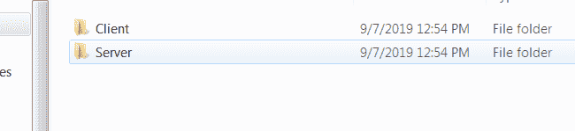
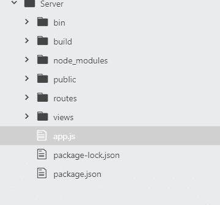
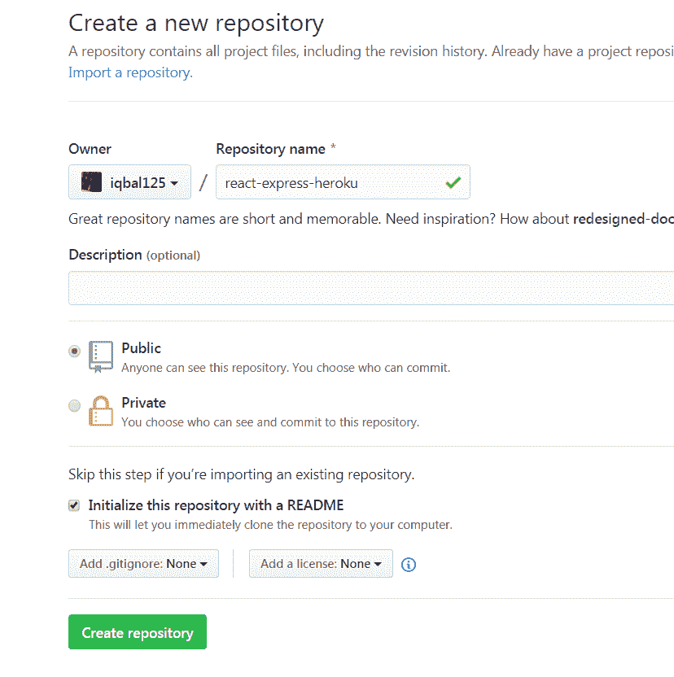
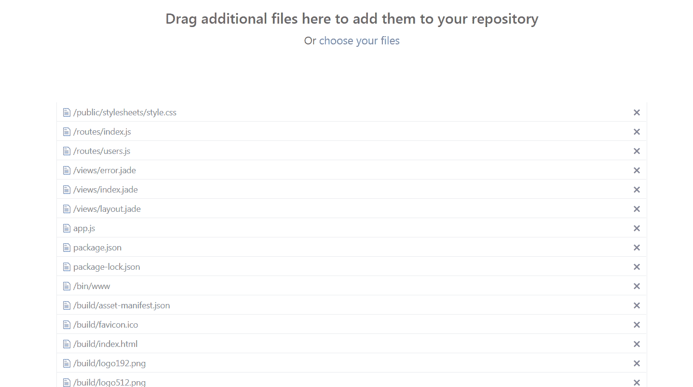
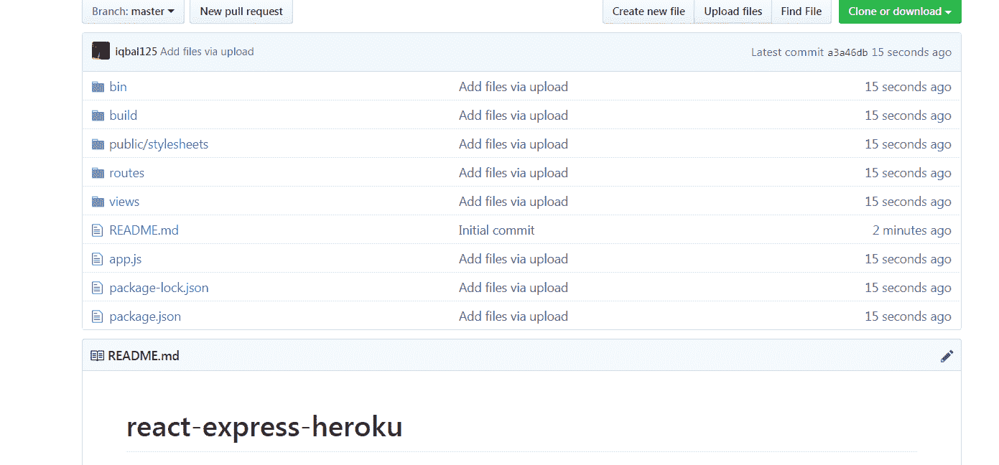
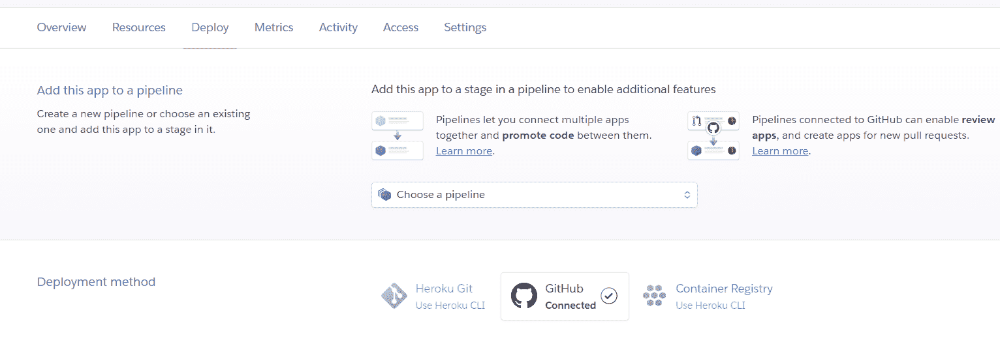
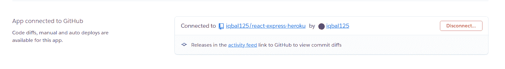
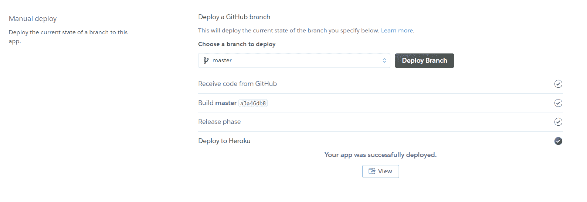

# 如何在不使用命令行的情况下，在 3 分钟内将 React + Node 应用部署到 Heroku

> 原文：<https://www.freecodecamp.org/news/deploy-a-react-node-app-to/>

在本教程中，我们将对 Heroku 进行基本的 React + Node 应用部署。

有很多教程只使用命令行来做这件事，所以为了稍微改变一下，我将完全不用命令行来做这件事。

对于生成 React 和 Express 应用程序这样的事情，我们别无选择，只能使用命令行。对于其他一切，我们将使用图形用户界面。

我还假设你有一个 Github 和 Heroku 账户。他们都是免费的，所以不用担心注册。

样本项目:
[https://github.com/iqbal125/react-express-](https://github.com/iqbal125/react-express-heroku)样本

## 反应和表达设置

首先，让我们从创建两个目录开始，分别命名为**服务器**和**客户端。**



客户端目录将保存`create-react-app`命令的内容，服务器将保存`express`命令的内容。这个库只是自动为我们创建了一个简单的 Express app，类似于`create-react-app`。它需要全局安装，您可以使用以下命令来完成:

`npm install -g express-generator`

此后，只需在各自的目录中运行这些命令来安装启动项目:

`npx create-react-app app1`在**客户端的**目录下

`express`在**服务器的**目录下

转到由`create-react-app`生成的 **app1** 目录并运行:

`npm run build`

这将生成项目的生产构建版本，该版本针对生产部署进行了优化，删除了错误处理代码和空白等内容。

*注意:*在开发构建中，你将使用一个代理来 **http://localhost:5000** 从你的 React 应用到你的 Express 服务器进行通信，但是这里 React 应用和 Express 服务器只是一个项目。Express 服务器提供 React 文件。

接下来，将整个**构建**目录剪切并粘贴到**服务器**目录中。您的项目结构应该如下所示:



我们现在可以添加一些代码，让我们的 Express 服务器知道为我们的 React 项目提供服务。：

```
....

app.use(express.static(path.join(__dirname, 'build')));

app.get('/*', (req, res) => {
  res.sendFile(path.join(__dirname, 'build', 'index.html'));
});

.... 
```

第一行代码服务于来自 **build** 目录的所有静态文件。

第二段代码是保持我们的客户端路由功能。这段代码本质上是为任何未知路径上的`index.html`文件服务的。否则，我们将需要重新编写我们的整个路由，以配合这个快速服务器设置。

要测试你的应用，只需在**服务器**目录下运行`npm start`，在浏览器中进入 **http://localhost 3000** 。那么你应该会看到你正在运行 React 应用程序。

现在我们准备把这个项目上传到 GitHub。

## 开源代码库

我们将使用 GUI，而不是使用命令行上传到 GitHub。首先，转到 GitHub 主页，创建一个新的存储库。您可以随意命名，但是要确保**初始化这个存储库时选中了 README** 选项:



接下来上传所有没有 **node_modules** 目录的项目文件。



单击提交，我们就完成了。您上传的项目文件将出现在 GitHub 上，如下所示:



现在我们可以着手建立 Heroku 了。

## Heroku

转到 Heroku 仪表板，创建一个新的应用程序，你可以随意命名。

接下来，转到 Deploy 选项卡并选择部署方法下的 GitHub:



如果你还没有把你的 GitHub 账号连接到你的 Heroku 账号，你会通过 GitHub 认证流程得到提示。

之后，在 GitHub 上搜索您的项目并连接到它:



最后，我们可以通过单击部署分支按钮来部署我们的应用程序:



Heroku 会自动为你安装所有的节点模块。您可以通过单击查看按钮来查看您的项目。

就这样，我们结束了！感谢阅读。

> 在 Twitter 上与我联系，了解更多关于未来教程的更新:[https://twitter.com/iqbal125sf](https://twitter.com/iqbal125sf)