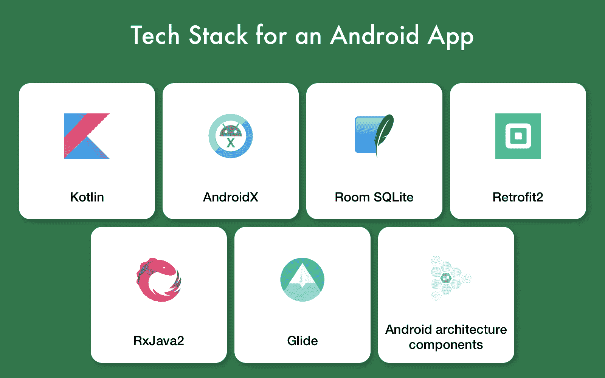
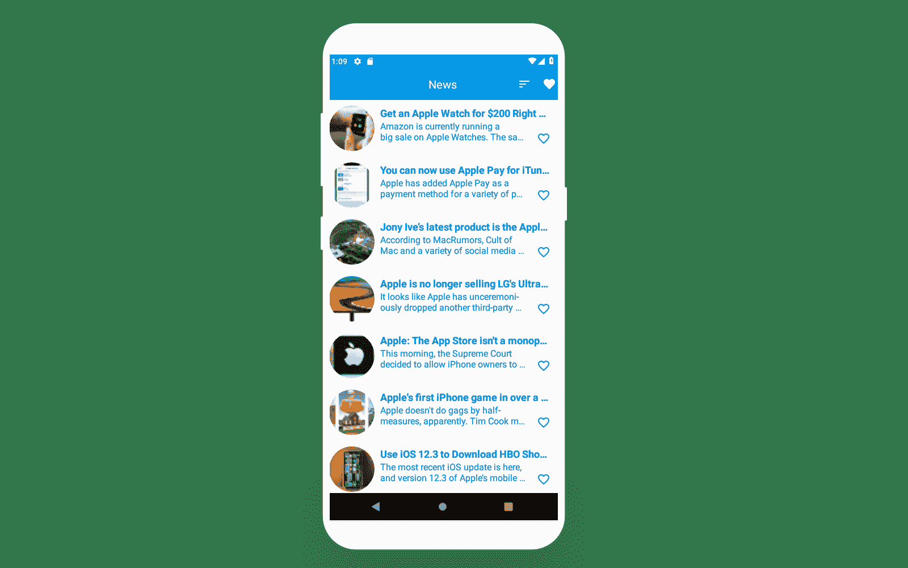
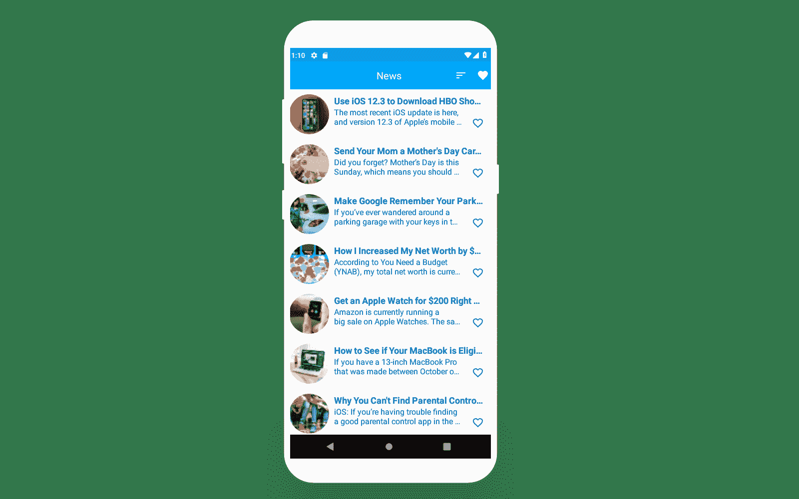
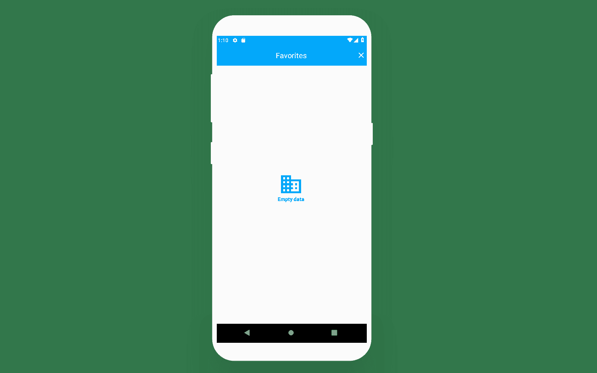
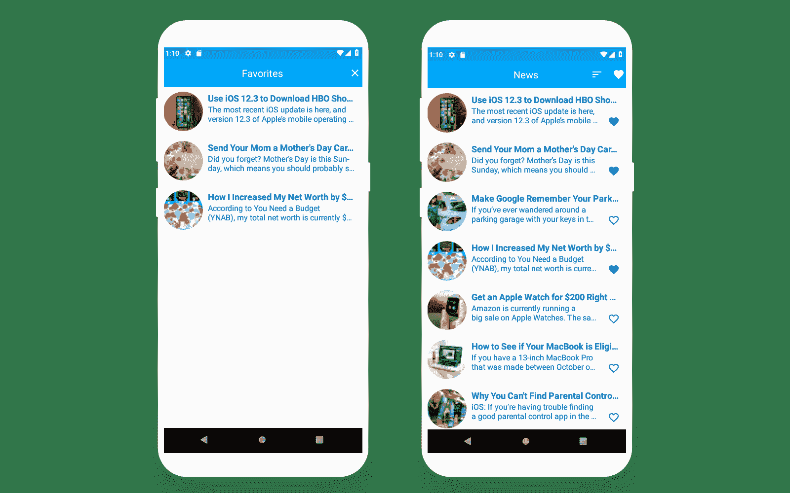
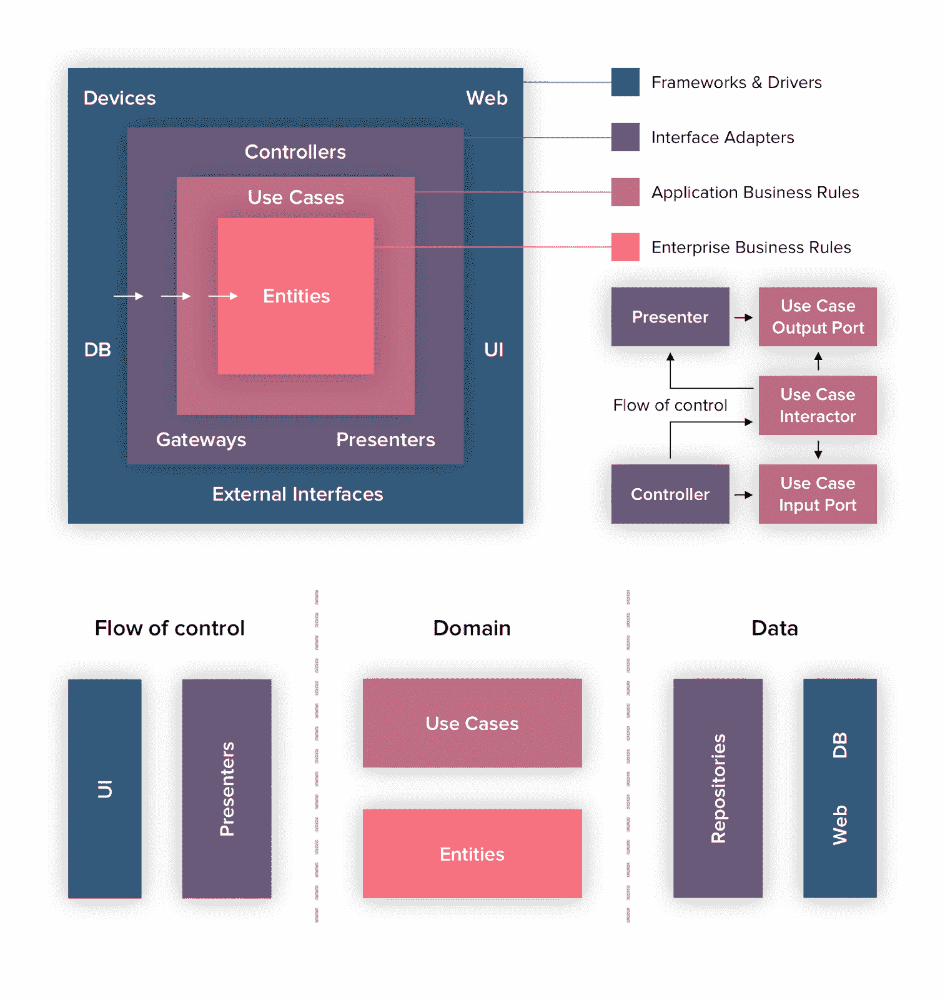
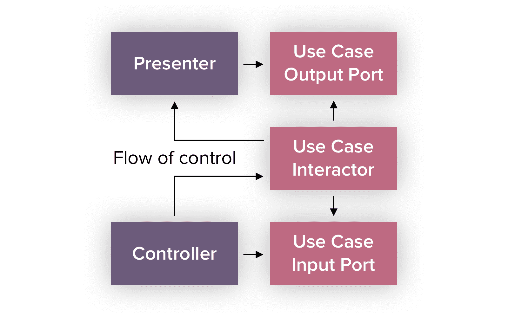

# 如何简化你的 Android 应用程序的架构:代码样本的详细指南

> 原文：<https://www.freecodecamp.org/news/how-to-simplify-android-app-architecture/>

独立程序员根据他们的愿景开发他们的移动应用，包括他们对如何执行各种任务的想法和看法。有时，他们可能会忽略面向对象或函数式编程的主要原则，这可能会导致开发人员迷失方向。

这很糟糕——他们将无法处理他们的代码。而下一个需要维护项目或者修改项目的开发者可能会抓狂。最好从头开始重新构建这样的项目，因为维护变成了一个复杂的过程。

在 Google 发布第一个支持的架构之前，几乎每个软件开发公司都使用自己的架构。这有助于他们使代码更加清晰，并使项目之间的切换成为可能。但是如果一个开发者换了公司，他们需要一些时间来学习新的架构和新的项目。

目前，安卓开发者有 16 种不同的[架构](https://github.com/googlesamples/android-architecture)，感谢谷歌:

*   6 个稳定样本(Java)；
*   2 个稳定样品(科特林):
*   4 外部样本；
*   3 个不推荐使用的示例；
*   1 个样品正在进行中。

无论您使用哪种架构，都取决于您的特定目的、方法以及实现各种功能的各种工具包的应用。这取决于编程语言。

然而，所有这些体系结构都有一个共同的体系结构基础，它几乎平等地划分了处理网络、数据库、依赖性和处理回调的逻辑。

### 流程中使用的工具

在研究了所有这些架构之后，我构建了一个简化的方法，并提出了一个具有更少层的架构。我将向您展示如何实现一个简单的 Android 应用程序，它加载新闻列表，允许您将故事保存到收藏夹，然后在必要时使用我的方法删除。



以下是我所用技术的总结:

*   **科特林**与 **AndroidX** 库**一起开发应用**
*   **房间 SQLite** 作为数据库
*   浏览数据库中的数据
*   **Retrofit2** 与 RxJava2 一起帮助记录服务器请求并获得服务器响应。
*   **滑动**处理图像
*   **Android 架构组件** (LiveData，ViewModel，Room)和**react vex**(rxjava 2，RxKotlin и RxAndroid)，用于构建依赖关系、动态数据更改和异步处理。

这就是我在项目中使用的[移动应用技术栈](https://www.cleveroad.com/blog/choosing-the-right-technology-stack-for-mobile-application)。

****开始吧****

### 第一步

连接 **AndroidX** 。在应用程序级别的 **gradle.properties** 中，编写以下内容:

```
android.enableJetifier=true
android.useAndroidX=true
```

现在需要从 Android 到 AndroidX 在 app 模块层面替换 **build.gradle** 中的依赖关系。你应该提取所有对 **ext、**的依赖，正如你在应用级的 **build.gradle** 中的 Kotlin 开箱即用版本控制的例子中看到的。然后我在那里添加了 Gradle 版本:

```
buildscript {
    ext.kotlin_version = '1.3.0'
    ext.gradle_version = '3.2.1'

    repositories {
        google()
        jcenter()
        maven { url 'https://jitpack.io' }
        mavenCentral()
    }
    dependencies {
        classpath "com.android.tools.build:gradle:$gradle_version"
        classpath "org.jetbrains.kotlin:kotlin-gradle-plugin:$kotlin_version"

        // NOTE: Do not place your application dependencies here; they belong
        // in the individual module build.gradle files
    }
}
```

对于所有其他依赖项，我将构建其 **ext** 文件，在那里我添加了包括 SDK 版本在内的所有依赖项，划分版本并创建依赖项 mass，这些依赖项将在应用程序级别的 **build.gradle** 中进一步实现。它将如下所示:

```
ext {
    compileSdkVersion = 28
    minSdkVersion = 22
    buildToolsVersion = '28.0.3'
    targetSdkVersion = 28

    appcompatVersion = '1.0.2'
    supportVersion = '1.0.0'
    supportLifecycleExtensionsVersion = '2.0.0'
    constraintlayoutVersion = '1.1.3'
    multiDexVersion = "2.0.0"

    testJunitVersion = '4.12'
    testRunnerVersion = '1.1.1'
    testEspressoCoreVersion = '3.1.1'

    testDependencies = [
            junit       : "junit:junit:$testJunitVersion",
            runner      : "androidx.test:runner:$testRunnerVersion",
            espressoCore: "androidx.test.espresso:espresso-core:$testEspressoCoreVersion"
    ]

    supportDependencies = [
            kotlin            : "org.jetbrains.kotlin:kotlin-stdlib-jdk7:$kotlin_version",
            appCompat         : "androidx.appcompat:appcompat:$appcompatVersion",
            recyclerView      : "androidx.recyclerview:recyclerview:$supportVersion",
            design            : "com.google.android.material:material:$supportVersion",
            lifecycleExtension: "androidx.lifecycle:lifecycle-extensions:$supportLifecycleExtensionsVersion",
            constraintlayout  : "androidx.constraintlayout:constraintlayout:$constraintlayoutVersion",
            multiDex          : "androidx.multidex:multidex:$multiDexVersion"
    ]
}
```

版本和体量名称是随机实现的。之后，我们将在应用程序级别实现 **build.gradle** 中的依赖关系，如下所示:

```
apply plugin: 'com.android.application'
apply plugin: 'kotlin-android'
apply plugin: 'kotlin-android-extensions'
apply plugin: 'kotlin-kapt'

android {
    compileSdkVersion rootProject.ext.compileSdkVersion as Integer
    buildToolsVersion rootProject.ext.buildToolsVersion as String
```

```
dependencies {
    implementation fileTree(dir: 'libs', include: ['*.jar'])

    //Test
    testImplementation testDependencies.junit
    androidTestImplementation testDependencies.runner
    androidTestImplementation testDependencies.espressoCore

    //Support
    implementation supportDependencies.kotlin
    implementation supportDependencies.appCompat
    implementation supportDependencies.recyclerView
    implementation supportDependencies.design
    implementation supportDependencies.lifecycleExtension
    implementation supportDependencies.constraintlayout
    implementation supportDependencies.multiDex
```

不要忘记在默认配置中指定**多使能真**。在大多数情况下，您将很快达到使用方法的数量限制。

同样，您需要声明应用程序的所有依赖项。让我们添加将我们的应用程序连接到互联网的权限:

```
 <uses-permission android:name="android.permission.ACCESS_NETWORK_STATE" />
    <uses-permission android:name="android.permission.INTERNET" />
```

如果清单中没有添加名字，你应该这样做，因为 **Stetho** 不会看到这个无名的应用程序，你也无法查看数据库。

### 基本组件建筑

值得注意的是，MVVM ( [模型-视图-视图模型](https://www.journaldev.com/20292/android-mvvm-design-pattern))模式被用作构建该架构的基础。

让我们开始开发。您需要做的第一件事是创建一个继承 Application()的类。在本课程中，我们将提供对应用程序上下文的访问，以供进一步使用。

```
@SuppressWarnings("all")
class App : Application() {

    companion object {
        lateinit var instance: App
            private set
    }

    override fun onCreate() {
        super.onCreate()
        instance = this
        Stetho.initializeWithDefaults(this)
        DatabaseCreator.createDatabase(this)
    }
}
```

第二步是从 [ViewModel](https://developer.android.com/topic/libraries/architecture/viewmodel) 开始创建基本的应用程序组件，我将为每个活动或片段使用这些组件。

```
abstract class BaseViewModel constructor(app: Application) : AndroidViewModel(app) {

    override fun onCleared() {
        super.onCleared()
    }
}
```

这个应用程序没有复杂的功能。但是在基本视图模型中，我们将把**3 main[LiveData](https://developer.android.com/reference/android/arch/lifecycle/MediatorLiveData)T3:**

*   错误处理
*   显示进度条的加载处理
*   而且，因为我有一个带列表的应用程序，所以在适配器中将收据和数据可用性处理为占位符，在它们不在时显示。

```
val errorLiveData = MediatorLiveData<String>()
    val isLoadingLiveData = MediatorLiveData<Boolean>()
    val isEmptyDataPlaceholderLiveData = MediatorLiveData<Boolean>()
```

为了将函数实现的结果传输到 LiveData，我将使用 **[消费者](http://reactivex.io/RxJava/javadoc/io/reactivex/functions/Consumer.html)** 。

要处理应用程序中任何地方的错误，您需要创建一个消费者，该消费者将把 **Throwable.message** 值传递给 **errorLiveData** 。

此外，在基本的 VewModel 中，您需要创建一个方法，该方法将接收一个 LiveData 列表，以便在实现过程中显示进度条。

我们的基本视图模型将如下所示:

```
abstract class BaseViewModel constructor(app: Application) : AndroidViewModel(app) {

    val errorLiveData = MediatorLiveData<String>()
    val isLoadingLiveData = MediatorLiveData<Boolean>()
    val isEmptyDataPlaceholderLiveData = MediatorLiveData<Boolean>()

    private var compositeDisposable: CompositeDisposable? = null

    protected open val onErrorConsumer = Consumer<Throwable> {
        errorLiveData.value = it.message
    }

    fun setLoadingLiveData(vararg mutableLiveData: MutableLiveData<*>) {
        mutableLiveData.forEach { liveData ->
            isLoadingLiveData.apply {
                this.removeSource(liveData)
                this.addSource(liveData) { this.value = false }
            }
        }
    }

    override fun onCleared() {
        isLoadingLiveData.value = false
        isEmptyDataPlaceholderLiveData.value = false
        clearSubscription()
        super.onCleared()
    }

    private fun clearSubscription() {
        compositeDisposable?.apply {
            if (!isDisposed) dispose()
            compositeDisposable = null
        }
    }
}
```

在我们的应用程序中，为两个屏幕(新闻列表屏幕和收藏夹列表屏幕)创建一些活动是没有意义的。但是由于这个示例展示了最佳且易于扩展的架构的实现，我将创建一个基本的应用程序。

我们的应用程序将建立在 1 个活动和 2 个片段，我们将在容器活动中膨胀。我们活动的 XML 文件如下:

```
<?xml version="1.0" encoding="utf-8"?>
<FrameLayout xmlns:android="http://schemas.android.com/apk/res/android"
    android:layout_width="match_parent"
    android:layout_height="match_parent">

    <FrameLayout
        android:id="@+id/flContainer"
        android:layout_width="match_parent"
        android:layout_height="match_parent" />

    <include layout="@layout/include_placeholder"/>

    <include layout="@layout/include_progress_bar" />
</FrameLayout>
```

其中 **include_placeholder** 和 **include_progressbar** 将如下所示:

```
<?xml version="1.0" encoding="utf-8"?>
<FrameLayout xmlns:android="http://schemas.android.com/apk/res/android"
    android:id="@+id/flProgress"
    android:layout_width="match_parent"
    android:layout_height="match_parent"
    android:background="@color/bg_black_40">

    <ProgressBar
        android:layout_width="wrap_content"
        android:layout_height="wrap_content"
        android:layout_gravity="center"
        android:background="@color/transparent" />
</FrameLayout>
```

```
<?xml version="1.0" encoding="utf-8"?>
<FrameLayout xmlns:android="http://schemas.android.com/apk/res/android"
    android:id="@+id/flPlaceholder"
    android:layout_width="match_parent"
    android:layout_height="match_parent"
    android:background="@color/bg_transparent">

    <ImageView
        android:layout_width="wrap_content"
        android:layout_height="wrap_content"
        android:layout_gravity="center"
        android:background="@color/transparent"
        android:src="@drawable/ic_business_light_blue_800_24dp" />

    <TextView
        android:layout_width="wrap_content"
        android:layout_height="wrap_content"
        android:layout_gravity="center"
        android:layout_marginTop="40dp"
        android:text="@string/empty_data"
        android:textColor="@color/colorPrimary"
        android:textStyle="bold" />
</FrameLayout>
```

我们的 BaseActivity 将如下所示:

```
abstract class BaseActivity<T : BaseViewModel> : AppCompatActivity(), BackPressedCallback,
        ProgressViewCallback, EmptyDataPlaceholderCallback {

    protected abstract val viewModelClass: Class<T>
    protected abstract val layoutId: Int
    protected abstract val containerId: Int

    protected open val viewModel: T by lazy(LazyThreadSafetyMode.NONE) { ViewModelProviders.of(this).get(viewModelClass) }

    protected abstract fun observeLiveData(viewModel: T)

    override fun onCreate(savedInstanceState: Bundle?) {
        super.onCreate(savedInstanceState)
        setContentView(layoutId)
        startObserveLiveData()
    }

    private fun startObserveLiveData() {
        observeLiveData(viewModel)
    }
}
```

让我们实现如何显示所有未来活动的过程中可能出现的错误。为了简单起见，我将以通常的祝酒词的形式来说。

```
protected open fun processError(error: String) = Toast.makeText(this, error, Toast.LENGTH_SHORT).show()
```

并将此错误文本发送到显示方法:

```
protected open val errorObserver = Observer<String> { it?.let { processError(it) } }
```

在基本活动中，我将开始跟踪位于基本视图模型中的 **errorLiveData** 值的变化。 **startObserveLiveData()** 方法将发生如下变化:

```
private fun startObserveLiveData() {
        observeLiveData(viewModel)
        with(viewModel) {
            errorLiveData.observe(this@BaseActivity, errorObserver)
        }
    }
```

现在使用基本视图模型的 **onErrorConsumer** 作为 **onError** 处理器，您将看到关于实现方法错误的消息。

创建一个方法，允许您用添加到后台堆栈的能力来替换活动中的片段。

```
protected open fun replaceFragment(fragment: Fragment, needToAddToBackStack: Boolean = true) {
        val name = fragment.javaClass.simpleName
        with(supportFragmentManager.beginTransaction()) {
            replace(containerId, fragment, name)
            if (needToAddToBackStack) {
                addToBackStack(name)
            }
            commit()
        }
    }
```

让我们创建界面，在所需的应用程序点显示进度和占位符。

```
interface EmptyDataPlaceholderCallback {

    fun onShowPlaceholder()

    fun onHidePlaceholder()
}
```

```
interface ProgressViewCallback {

    fun onShowProgress()

    fun onHideProgress()
}
```

在基本活动中实现它们。我创建了进度条和占位符的 ID 设置函数，并初始化了这些视图。

```
protected open fun hasProgressBar(): Boolean = false

    protected abstract fun progressBarId(): Int

    protected abstract fun placeholderId(): Int

    private var vProgress: View? = null
    private var vPlaceholder: View? = null
```

```
override fun onShowProgress() {
        vProgress?.visibility = View.VISIBLE
    }

    override fun onHideProgress() {
        vProgress?.visibility = View.GONE
    }

    override fun onShowPlaceholder() {
        vPlaceholder?.visibility = View.VISIBLE
    }

    override fun onHidePlaceholder() {
        vPlaceholder?.visibility = View.INVISIBLE
    }

    public override fun onStop() {
        super.onStop()
        onHideProgress()
    }
```

最后，在 **onCreate** 方法中，我为视图设置了一个 ID:

```
if (hasProgressBar()) {
            vProgress = findViewById(progressBarId())
            vProgress?.setOnClickListener(null)
        }
        vPlaceholder = findViewById(placeholderId())
        startObserveLiveData()
```

我已经详细说明了基本视图模型和基本活动的创建。基本片段将按照相同的原则创建。

当您创建每个单独的屏幕时，如果您考虑进一步的扩展和可能的更改，您需要创建一个单独的片段及其 ViewModel。

注意:如果片段可以组合在一个集群中，并且业务逻辑并不意味着非常复杂，那么几个片段可以使用一个视图模型。

片段之间的切换是由于 Activity 中实现的接口而发生的。要做到这一点，每个片段都应该有一个**伴随对象{ }** 用片段对象的方法构建，具有将参数传递给 **Bundle** 的能力:

```
companion object {
        fun newInstance() = FavoriteFragment().apply { arguments = Bundle() }
    }
```

### 架构解决方案

当创建了基本组件后，就该关注架构了。从原理上看，它将像著名的罗伯特·c·马丁或鲍勃叔叔设计的干净的建筑。但是由于我使用了 **RxJava2** ，我去掉了**边界**接口(作为确保**依赖规则**执行的方式)以支持标准的**可观察**和**订户**。

除此之外，使用 **RxJava2** 工具**我已经集成了数据转换，以便更灵活地使用它。它涉及到处理服务器响应和数据库。**

除了主模型，我将为**房间**创建一个服务器响应模型和单独的表模型。在这两个模型之间转换数据，您可以在转换过程中进行任何更改，转换服务器响应，并在数据显示在 UI 上之前将必要的数据保存到数据库中，等等。

片段负责 **UI** ，视图模型片段负责业务逻辑执行。如果业务逻辑关注整个活动，那么 ViewModel 活动。

视图模型通过初始化从提供者处获取数据，如果需要不变的对象，则通过 **val … by lazy{}、**或 **lateinit var、**进行初始化，反之亦然。在业务逻辑执行之后，如果您需要传输数据来更改 **UI，**您在视图模型中创建新的**可变数据**，您将在我们的片段的 **observeLiveData()** 方法中使用它。

听起来很容易。实现也很简单。我们架构的一个基本组件是数据转换器，它基于从一种数据类型到另一种数据类型的简单转换。对于 **RxJava** 数据流的转换，根据类型使用[**single transformer**](http://reactivex.io/RxJava/javadoc/io/reactivex/SingleTransformer.html)或[**flow able transformer**](http://reactivex.io/RxJava/javadoc/io/reactivex/FlowableTransformer.html)。在我们的应用程序中，转换器的接口和抽象类如下所示:

```
interface BaseDataConverter<IN, OUT> {

    fun convertInToOut(inObject: IN): OUT

    fun convertOutToIn(outObject: OUT): IN

    fun convertListInToOut(inObjects: List<IN>?): List<OUT>?

    fun convertListOutToIn(outObjects: List<OUT>?): List<IN>?

    fun convertOUTtoINSingleTransformer(): SingleTransformer<IN?, OUT>

    fun convertListINtoOUTSingleTransformer(): SingleTransformer<List<OUT>, List<IN>>
}

abstract class BaseDataConverterImpl<IN, OUT> : BaseDataConverter<IN, OUT> {

    override fun convertInToOut(inObject: IN): OUT = processConvertInToOut(inObject)

    override fun convertOutToIn(outObject: OUT): IN = processConvertOutToIn(outObject)

    override fun convertListInToOut(inObjects: List<IN>?): List<OUT> =
            inObjects?.map { convertInToOut(it) } ?: listOf()

    override fun convertListOutToIn(outObjects: List<OUT>?): List<IN> =
            outObjects?.map { convertOutToIn(it) } ?: listOf()

    override fun convertOUTtoINSingleTransformer() =
            SingleTransformer<IN?, OUT> { it.map { convertInToOut(it) } }

    override fun convertListINtoOUTSingleTransformer() =
            SingleTransformer<List<OUT>, List<IN>> { it.map { convertListOutToIn(it) } }

    protected abstract fun processConvertInToOut(inObject: IN): OUT

    protected abstract fun processConvertOutToIn(outObject: OUT): IN
}
```

在这个例子中，我使用了基本的转换，比如模型-模型、模型列表-模型列表，以及相同的组合，但是只使用了 **SingleTransformer** 来处理数据库中的服务器响应和请求。

让我们从网络开始——用 **RestClient。retrofitBuilder** 方法如下:

```
fun retrofitBuilder(): Retrofit = Retrofit.Builder()
            .baseUrl(BASE_URL)
            .addCallAdapterFactory(RxJava2CallAdapterFactory.create())
            .addConverterFactory(NullOrEmptyConverterFactory().converterFactory())
            .addConverterFactory(GsonConverterFactory.create(createGsonBuilder()))
            .client(createHttpClient())
            .build()
```

```
//base url
    const val BASE_URL = "https://newsapi.org"
```

使用第三方 API，总是有机会从服务器获得绝对空响应，并且可能有很多原因。这就是为什么额外的**NullOrEmptyConverterFactory**将有助于处理这种情况。看起来是这样的:

```
class NullOrEmptyConverterFactory : Converter.Factory() {

    fun converterFactory() = this

    override fun responseBodyConverter(type: Type?,
                                       annotations: Array<Annotation>,
                                       retrofit: Retrofit): Converter<ResponseBody, Any>? {
        return Converter { responseBody ->
            if (responseBody.contentLength() == 0L) {
                null
            } else {
                type?.let {
                    retrofit.nextResponseBodyConverter<Any>(this, it, annotations)?.convert(responseBody) }
            }
        }
    }
}
```

为了创建模型，有必要构建一个 API。作为一个例子，我将使用来自**newsapi.org 的用于非商业用途的免费 APU。**它有一个相当广泛的请求功能列表，但是我将在这个例子中使用一小部分。快速注册后，您可以访问 API 和您的 **api 密钥**，这是每个请求所必需的。

作为端点，我将使用[](https://newsapi.org/v2/everything)****。**从建议的**查询**中，我选择如下: **q** -搜索查询， **from** -排序 from date， **to** -排序 to date， **sortBy** -按选择的标准排序，以及必备的 **apiKey。****

**在创建了 **RestClient** 之后，我为我们的应用程序创建了一个带有所选查询的 API 接口:**

```
`interface NewsApi {
    @GET(ENDPOINT_EVERYTHING)
    fun getNews(@Query("q") searchFor: String?,
                @Query("from") fromDate: String?,
                @Query("to") toDate: String?,
                @Query("sortBy") sortBy: String?,
                @Query("apiKey") apiKey: String?): Single<NewsNetworkModel>
}`
```

```
`//endpoints
    const val ENDPOINT_EVERYTHING = "/v2/everything"`
```

**我们将在 NewsNetworkModel 中收到此响应:**

```
`data class NewsNetworkModel(@SerializedName("articles")
                            var articles: List<ArticlesNetworkModel>? = listOf())`
```

```
`data class ArticlesNetworkModel(@SerializedName("title")
                                var title: String? = null,
                                @SerializedName("description")
                                var description: String? = null,
                                @SerializedName("urlToImage")
                                var urlToImage: String? = null)`
```

**来自整个响应的这些数据将足以显示一个带有图片、标题和新闻描述的列表。**

**为了实现我们的架构方法，让我们创建通用模型:**

```
`interface News {
    var articles: List<Article>?
}

class NewsModel(override var articles: List<Article>? = null) : News`
```

```
`interface Article {
    var id: Long?
    var title: String?
    var description: String?
    var urlToImage: String?
    var isAddedToFavorite: Boolean?
    var fragmentName: FragmentsNames?
}

class ArticleModel(override var id: Long? = null,
                   override var title: String? = null,
                   override var description: String? = null,
                   override var urlToImage: String? = null,
                   override var isAddedToFavorite: Boolean? = null,
                   override var fragmentName: FragmentsNames? = null) : Article`
```

**由于文章模型将用于与数据库的连接和适配器中显示的数据，我们需要添加两个边距，我将使用它们来更改列表中的 UI 元素。**

**当请求的一切准备就绪时，我为网络模型创建转换器，我们将在通过 NetworkModule 接收新闻的查询中使用这些转换器。**

**转换器是以与嵌套相反的顺序创建的，因此它们以直接顺序进行转换。所以我的第一篇文章，第二篇新闻:**

```
`interface ArticlesBeanConverter

class ArticlesBeanDataConverterImpl : BaseDataConverterImpl<ArticlesNetworkModel, Article>(), ArticlesBeanConverter {

    override fun processConvertInToOut(inObject: ArticlesNetworkModel): Article = inObject.run {
        ArticleModel(null, title, description, urlToImage, false, FragmentsNames.NEWS)
    }

    override fun processConvertOutToIn(outObject: Article): ArticlesNetworkModel = outObject.run {
        ArticlesNetworkModel(title, description, urlToImage)
    }
}`
```

```
`interface NewsBeanConverter

class NewsBeanDataConverterImpl : BaseDataConverterImpl<NewsNetworkModel, News>(), NewsBeanConverter {

    private val articlesConverter by lazy { ArticlesBeanDataConverterImpl() }

    override fun processConvertInToOut(inObject: NewsNetworkModel): News = inObject.run {
        NewsModel(articles?.let { articlesConverter.convertListInToOut(it) })
    }

    override fun processConvertOutToIn(outObject: News): NewsNetworkModel = outObject.run {
        NewsNetworkModel(articles?.let { articlesConverter.convertListOutToIn(it) })
    }
}`
```

**正如您在上面看到的，在新闻对象转换期间，文章对象列表的转换也被执行。**

**一旦创建了网络模型的转换器，让我们继续创建模块(存储库网络)。由于通常有不止 1 或 2 个接口 API，所以需要创建 BaseModule、typed API、Network Module 和 ConversionModel。**

**看起来是这样的:**

```
`abstract class BaseNetworkModule<A, NM, M>(val api: A, val dataConverter: BaseDataConverter<NM, M>)`
```

**相应地，新闻模块上的内容如下:**

```
`interface NewsModule {

    fun getNews(fromDate: String? = null, toDate: String? = null, sortBy: String? = null): Single<News>
}

class NewsModuleImpl(api: NewsApi) : BaseNetworkModule<NewsApi, NewsNetworkModel, News>(api, NewsBeanDataConverterImpl()), NewsModule {

    override fun getNews(fromDate: String?, toDate: String?, sortBy: String?): Single<News> =
            api.getNews(searchFor = SEARCH_FOR, fromDate = fromDate, toDate = toDate, sortBy = sortBy, apiKey = API_KEY)
                    .compose(dataConverter.convertOUTtoINSingleTransformer())
                    .onErrorResumeNext(NetworkErrorUtils.rxParseError())
}`
```

**对于这个 API，API 密钥是任何建议的端点进行请求的关键参数。这就是为什么您需要确保可选参数不会被预先指定，并且您需要在默认情况下使它们无效。**

**正如您在上面看到的，我在响应处理期间应用了数据转换。**

**让我们使用数据库。我创建了应用程序数据库，将其命名为 **AppDatabase** ，并继承了 **RoomDatabase()** 。**

**数据库初始化需要创建 **DatabaseCreator** ，需要在 **App** 类中初始化。**

```
`object DatabaseCreator {

    lateinit var database: AppDatabase
    private val isDatabaseCreated = MutableLiveData<Boolean>()
    private val mInitializing = AtomicBoolean(true)

    @SuppressWarnings("CheckResult")
    fun createDatabase(context: Context) {
        if (mInitializing.compareAndSet(true, false).not()) return
        isDatabaseCreated.value = false
        Completable.fromAction { database = Room.databaseBuilder(context, AppDatabase::class.java, DB_NAME).build() }
                .compose { completableToMain(it) }
                .subscribe({ isDatabaseCreated.value = true }, { it.printStackTrace() })
    }
}`
```

**现在在 **App** 的 **onCreate()** 方法中，我初始化 **Stetho** 和数据库:**

```
`override fun onCreate() {
        super.onCreate()
        instance = this
        Stetho.initializeWithDefaults(this)
        DatabaseCreator.createDatabase(this)
    }`
```

**创建数据库时，我创建了一个基本的 Dao，其中包含一个 insert()方法:**

```
`@Dao
interface BaseDao<in I> {

    @Insert(onConflict = OnConflictStrategy.REPLACE)
    fun insert(obj: I)
}`
```

**基于我们的应用程序的想法，我将保存我喜欢的新闻，获得已保存文章的列表，按其 ID 删除已保存的新闻，或者从表中删除所有新闻。我们的**新闻道**将如下:**

```
`@Dao
interface NewsDao : BaseDao<NewsDatabase> {

    @Query("SELECT * FROM $NEWS_TABLE")
    fun getNews(): Single<List<NewsDatabase>>

    @Query("DELETE FROM $NEWS_TABLE WHERE id = :id")
    fun deleteNewsById(id: Long)

    @Query("DELETE FROM $NEWS_TABLE")
    fun deleteFavoriteNews()
}`
```

**新闻表格如下:**

```
`@Entity(tableName = NEWS_TABLE)
data class NewsDatabase(@PrimaryKey var id: Long?,
                        var title: String?,
                        var description: String?,
                        var urlToImage: String?)`
```

**创建表后，让我们将它与数据库链接起来:**

```
`@Database(entities = [NewsDatabase::class], version = DB_VERSION)
abstract class AppDatabase : RoomDatabase() {

    abstract fun newsDao(): NewsDao
}`
```

**现在我们可以使用数据库，保存和提取数据。**

**至于模块(存储库网络)，我将创建一个模型转换器-数据库表模型:**

```
`interface NewsDatabaseConverter

class NewsDatabaseDataConverterImpl : BaseDataConverterImpl<Article, NewsDatabase>(), NewsDatabaseConverter {

    override fun processConvertInToOut(inObject: Article): NewsDatabase =
            inObject.run {
                NewsDatabase(id, title, description, urlToImage)
            }

    override fun processConvertOutToIn(outObject: NewsDatabase): Article =
            outObject.run {
                ArticleModel(id, title, description, urlToImage, true, FragmentsNames.FAVORITES)
            }
}`
```

**BaseRepository 可用于处理各种表。我们来写吧。对于应用程序来说，最简单的版本如下所示:**

```
`abstract class BaseRepository<M, DBModel> {

    protected abstract val dataConverter: BaseDataConverter<M, DBModel>
    protected abstract val dao: BaseDao<DBModel>
}`
```

**创建 BaseRepository 之后，我将创建**新闻存储库**:**

```
`interface NewsRepository {

    fun saveNew(article: Article): Single<Article>

    fun getSavedNews(): Single<List<Article>>

    fun deleteNewsById(id: Long): Single<Unit>

    fun deleteAll(): Single<Unit>
}

object NewsRepositoryImpl : BaseRepository<Article, NewsDatabase>(), NewsRepository {

    override val dataConverter by lazy { NewsDatabaseDataConverterImpl() }
    override val dao by lazy { DatabaseCreator.database.newsDao() }

    override fun saveNew(article: Article): Single<Article> =
            Single.just(article)
                    .map { dao.insert(dataConverter.convertInToOut(it)) }
                    .map { article }

    override fun getSavedNews(): Single<List<Article>> =
            dao.getNews().compose(dataConverter.convertListINtoOUTSingleTransformer())

    override fun deleteNewsById(id: Long): Single<Unit> =
            Single.just(dao.deleteNewsById(id))

    override fun deleteAll(): Single<Unit> =
            Single.just(dao.deleteFavoriteNews())
}`
```

**创建永久存储库和模块时，数据应该来自应用程序提供商，该提供商将根据需求从网络或数据库请求数据。一个提供者应该把两个库结合起来。考虑到各种模型和存储库的能力，我将创建 BaseProvider:**

```
`abstract class BaseProvider<NM, DBR> {

    val repository: DBR = this.initRepository()

    val networkModule: NM = this.initNetworkModule()

    protected abstract fun initRepository(): DBR

    protected abstract fun initNetworkModule(): NM
}`
```

**然后**新闻提供者**将如下所示:**

```
`interface NewsProvider {

    fun loadNewsFromServer(fromDate: String? = null, toDate: String? = null, sortBy: String? = null): Single<News>

    fun saveNewToDB(article: Article): Single<Article>

    fun getSavedNewsFromDB(): Single<List<Article>>

    fun deleteNewsByIdFromDB(id: Long): Single<Unit>

    fun deleteNewsFromDB(): Single<Unit>
}

object NewsProviderImpl : BaseProvider<NewsModule, NewsRepositoryImpl>(), NewsProvider {

    override fun initRepository() = NewsRepositoryImpl

    override fun initNetworkModule() = NewsModuleImpl(RestClient.retrofitBuilder().create(NewsApi::class.java))

    override fun loadNewsFromServer(fromDate: String?, toDate: String?, sortBy: String?) = networkModule.getNews(fromDate, toDate, sortBy)

    override fun saveNewToDB(article: Article) = repository.saveNew(article)

    override fun getSavedNewsFromDB() = repository.getSavedNews()

    override fun deleteNewsByIdFromDB(id: Long) = repository.deleteNewsById(id)

    override fun deleteNewsFromDB() = repository.deleteAll()
}`
```

**现在我们将很容易得到新闻列表。在 **NewsViewModel** 中，我们将声明我们的提供者的所有方法以供进一步使用:**

```
`val loadNewsSuccessLiveData = MutableLiveData<News>()
    val loadLikedNewsSuccessLiveData = MutableLiveData<List<Article>>()
    val deleteLikedNewsSuccessLiveData = MutableLiveData<Boolean>()

    private val loadNewsSuccessConsumer = Consumer<News> { loadNewsSuccessLiveData.value = it }
    private val loadLikedNewsSuccessConsumer = Consumer<List<Article>> { loadLikedNewsSuccessLiveData.value = it }
    private val deleteLikedNewsSuccessConsumer = Consumer<Unit> { deleteLikedNewsSuccessLiveData.value = true }

    private val dataProvider by lazy { NewsProviderImpl }

    init {
        isLoadingLiveData.apply { addSource(loadNewsSuccessLiveData) { value = false } }`
```

```
`@SuppressLint("CheckResult")
    fun loadNews(fromDate: String? = null, toDate: String? = null, sortBy: String? = null) {
        isLoadingLiveData.value = true
        isEmptyDataPlaceholderLiveData.value = false
        dataProvider.loadNewsFromServer(fromDate, toDate, sortBy)
                .compose(RxUtils.ioToMainTransformer())
                .subscribe(loadNewsSuccessConsumer, onErrorConsumer)

    }

    @SuppressLint("CheckResult")
    fun saveLikedNew(article: Article) {
        Single.fromCallable { Unit }
                .flatMap { dataProvider.saveNewToDB(article) }
                .compose(RxUtils.ioToMainTransformerSingle())
                .subscribe({}, { onErrorConsumer })
    }

    @SuppressLint("CheckResult")
    fun removeLikedNew(id: Long) {
        Single.fromCallable { Unit }
                .flatMap { dataProvider.deleteNewsByIdFromDB(id) }
                .compose(RxUtils.ioToMainTransformerSingle())
                .subscribe({}, { onErrorConsumer })
    }

    @SuppressLint("CheckResult")
    fun loadLikedNews() {
        Single.fromCallable { Unit }
                .flatMap { dataProvider.getSavedNewsFromDB() }
                .compose(RxUtils.ioToMainTransformerSingle())
                .subscribe(loadLikedNewsSuccessConsumer, onErrorConsumer)
    }

    @SuppressLint("CheckResult")
    fun removeLikedNews() {
        Single.fromCallable { Unit }
                .flatMap { dataProvider.deleteNewsFromDB() }
                .compose(RxUtils.ioToMainTransformerSingle())
                .subscribe(deleteLikedNewsSuccessConsumer, onErrorConsumer)
    }`
```

**在 ViewModel 中声明了所有执行业务逻辑的方法后，我们将从 Fragment 中调用它们，在这里将处理每个声明的 **LiveData** 的结果。**

**为了容易实现，在 **SEARCH_FOR** 参数中，我随机选择了**苹果、**，进一步的排序将由**流行度**标签来执行。如有必要，您可以添加最少的功能来更改这些参数。**

**因为 newsapi.org 没有为您提供新闻 ID，所以我接受元素索引作为 ID。通过流行度标签排序也是通过 API 实现的。但是为了避免在按流行度排序时用相同的 id 重写数据库中的数据，我将在加载新闻列表之前验证数据库中的数据可用性。如果基础是空的-新列表正在加载，如果不是-通知显示。**

**让我们在**的 **onViewCreated()** 方法中调用下面的方法:****

```
`private fun loadLikedNews() {
        viewModel.loadLikedNews()
    }`
```

**因为我们的库是空的，所以将启动方法 **loadNews()** 。在 **observeLiveData** 方法中，我将使用我们的加载 LiveData-**viewmodel . loadnewsuccesslivedata . observe(..){news →}，**如果请求成功，我们将接收新闻文章列表，然后将其传输到适配器:**

```
`isEmptyDataPlaceholderLiveData.value = news.articles?.isEmpty()
                with(newsAdapter) {
                    news.articles?.toMutableList()?.let {
                        clear()
                        addAll(it)
                    }
                    notifyDataSetChanged()
                }
                loadNewsSuccessLiveData.value = null`
```

**启动应用程序后，您将看到以下结果:**

****

**在右边的工具栏菜单中，你可以看到两个选项-排序和收藏夹。让我们按受欢迎程度对列表进行排序，得到以下结果:**

****

**如果转到“收藏夹”,您将只看到一个占位符，因为库中没有数据。收藏夹屏幕将如下所示:**

****

**收藏夹的 UI 片段有一个显示喜欢的新闻列表的屏幕，在工具栏中只有一个清理数据库的选项。当您点击“Like”保存数据时，屏幕将如下所示:**

****

**正如我在上面所写的，在标准模型 2 中，额外的边距被添加到通用模型中，这些边距用于适配器中的数据显示。现在您可以看到，保存的新闻列表的元素没有添加到收藏夹的选项。**

```
`var isAddedToFavorite: Boolean?
    var fragmentName: FragmentsNames?`
```

**如果再次点击“喜欢”，保存的元素将从基础中删除。**

### **包扎**

**因此，我向您展示了一种简单明了的 Android 应用程序开发方法。我们遵循干净架构的主要原则，但是尽可能地简化它。**

**我给你提供的架构和马丁先生的干净架构有什么区别？在最开始，我已经注意到我的架构类似于 CA，因为它被用作基础。以下是 CA 方案:**

****

**事件转到 Presenter，然后转到**用例。用例**请求**存储库。**仓库接收数据，创建**实体**，并将其传递给**用例。**因此，**用例**接收所有必要的实体。在实现业务逻辑之后，您将得到返回给 **Presenter、**的结果，然后它将结果传递给 **UI。****

**在下面的方案中，**控制器**从实现**用例**的**输入端口**中调用方法，**输出端口**接口接收该响应，并由**呈现器**实现。与**用例**直接依赖于**呈现者不同，**依赖于其层中的接口，并且与**依赖规则不矛盾，**和呈现者应该实现这个接口。**

****

**因此，在外部层实现的流程不会影响内部层的流程。洁净建筑中的实体是什么？其实就是不依赖于某个特定 app 的一切，对于很多 app 来说会是一个通用的概念。但在移动开发过程中，实体是应用程序的业务对象，其中包含通用和高级规则(应用程序业务逻辑)。**

****网关呢？**在我看来，**网关**是一个用于处理数据库的存储库和一个用于处理网络的模块。我们摆脱了控制器，因为 Clean Architecture 最初是为构建高度复杂的业务应用程序而创建的，数据转换器在我的应用程序中执行其功能。视图模型将数据转移到片段中，以代替呈现者进行 UI 处理。**

**在我的方法中，我也严格遵循依赖规则，存储库、模块、模型和提供者的逻辑被封装，并且通过接口访问它们是可能的。因此，外层的变化不会影响内层。而使用 **RxJava2** 、 **KotlinRx** 和 **Kotlin LiveData** 的实现过程，让开发者的任务变得更简单、更清晰，代码也变得可读性更好、更容易扩展。**