# 如何理解谷歌分析和你网站的流量

> 原文：<https://www.freecodecamp.org/news/making-sense-of-google-analytics-and-the-traffic-to-your-website/>

Google Analytics 是一项强大的网络服务，可以让你深入了解你的网站。但是它到底能不能帮助*你*？

我将在这里介绍一些内容。如果您已经熟悉了基础知识，请随意跳过:

*   [什么是谷歌分析？](https://www.freecodecamp.org/news/making-sense-of-google-analytics-and-the-traffic-to-your-website/#what-is-google-analytics)(快速概览)
*   好吧，那我从哪里开始呢？(快速入门安装指南)
*   有哪些快速洞察？(基本的现成报告)
*   [奖励:高级洞察力](https://www.freecodecamp.org/news/making-sense-of-google-analytics-and-the-traffic-to-your-website/#bonus-advanced-insights)(自定义维度)

所以让我们从头开始。

## **什么是谷歌分析？**

> 谷歌分析为你提供了更好地了解客户所需的工具。然后，您可以使用这些商业见解来采取行动，例如改进您的网站，创建定制的受众列表，等等。- [谷歌官方文档](https://marketingplatform.google.com/about/analytics/)

更简单地说，Google Analytics (GA)是 Google 在 [Google 营销平台](https://marketingplatform.google.com/about/)上提供的一项网络分析服务。它允许你用强大的洞察力和报告来跟踪和测量你的网站的流量。

GA 有几种不同的工作方式，但最常见的是[使用一个快速插入的 JavaScript 片段](https://support.google.com/analytics/answer/1008080?hl=en)，它出现在你网站的每个页面上(通常是`<head>`)。

Google Analytics lets you measure user interaction with websites.

谷歌分析的基础版本是免费的。你可以选择升级到 360 套件，这将开放一些功能限制，但大多数人可能不需要这样做，因为它更适合高流量的网站。

### **我为什么需要谷歌分析？**

你不需要它。但是，即使是基本的开箱即用设置，您也可以从 GA 获得令人难以置信的洞察力。

如果你是一个试图从你的博客中获得更多流量的开发者，或者一个试图优化你的销售漏斗的企业，GA 是有帮助的。

GA 帮助您回答简单的问题，例如:

*   我的流量从哪里来？
*   哪些页面流量最大？
*   人们最常用的访问设备是什么？

这不仅可以帮助你对你的网站做出更好的决策。它还可以帮助你揭示用户体验问题，或者通过关注流量趋势和用户互动来节省因网站问题而产生的费用。

## 好吧，那我从哪里开始呢？

Google 让任何开发人员都可以很容易地开始工作。唯一真正的先决条件是你设立一个帐户。谷歌自己提供了一个很棒的[循序渐进且不断更新的指南](https://support.google.com/analytics/answer/1008015?hl=en)，所以我将把它留给他们。

### **获取页面上的标签**

登录 Google Analytics 仪表盘后，进入页面左侧的管理部分:

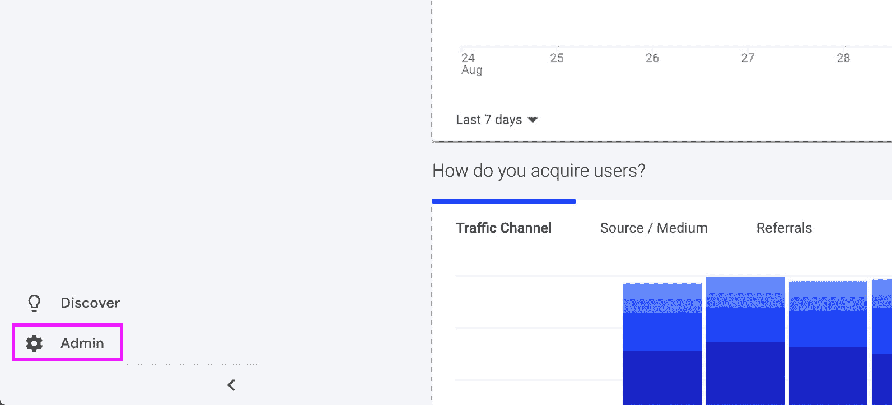

Admin link in the Google Analytics Dashboard

一旦在管理部分，你可以导航到跟踪信息，然后跟踪代码下的财产你想跟踪。

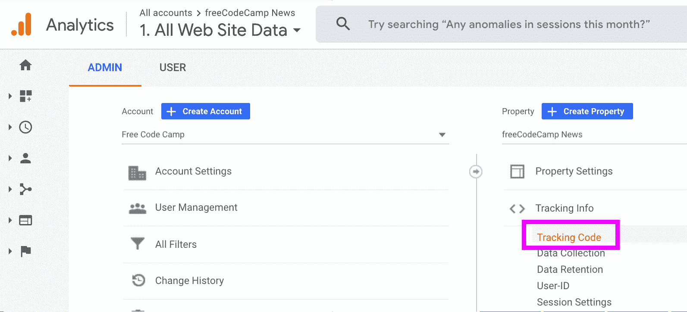

Tracking code link in the Google Analytics Admin

最后，你可以找到 JavaScript 代码片段，你可以把它放在你网站的头部。记住，这应该在所有的页面上。

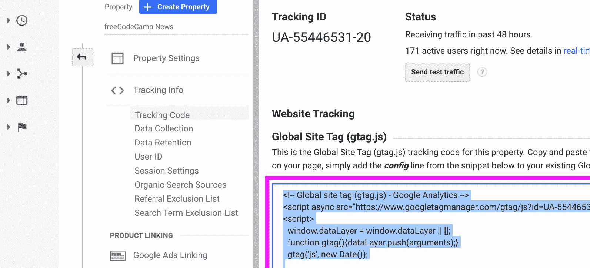

Google Analytic tracking code snippet

### **让交通畅通**

从现在开始，你只需要给它时间。谷歌分析不会有历史数据，它只会有片段安装后点击你的页面的新流量。

您可以通过访问实时报告，或者点击另一个选项卡中的页面，或者看到您的访问者点击页面，来检查它的工作情况。

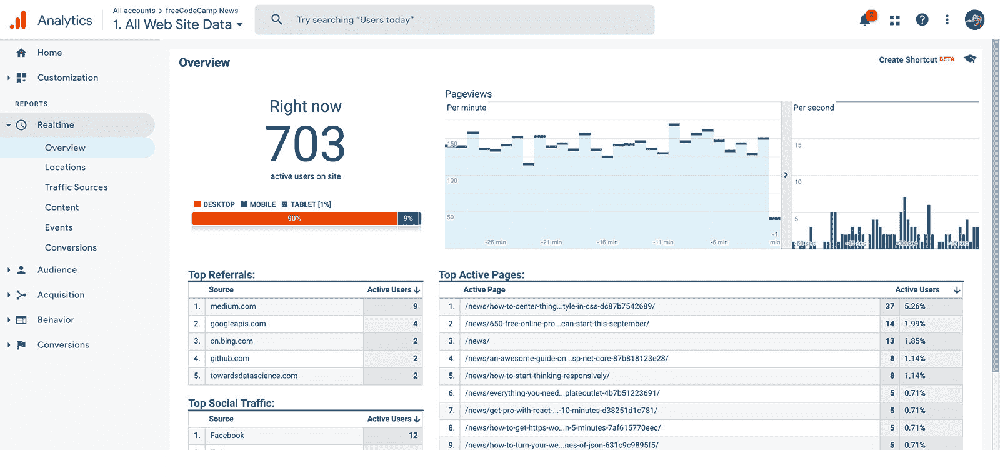

Google Analytics Realtime Report

### **更多设置，更多配置**

谷歌分析是一台复杂的机器，可以做很多事情。慢慢开始，在快速转动每个不同的开关之前，试着理解发生了什么。

一旦你习惯了，有很多[优秀的指南等着你，无论是初学者还是高级用户都可以充分发挥你的报告能力。](https://www.google.com/search?q=google+analytics+tips)

Goku going Super Saiyan

## 有哪些快速洞察？

酷，你已经安装了 GA，你看到了你的流量，你已经准备好开始查看你的报告了，但是从哪里开始呢？

### **哪些页面流量最大？**

先说一个简单的。我网站的哪些页面流量最大？为了找到这一点，我们需要查看行为概述，我们可以通过访问行为然后查看概述来找到它。

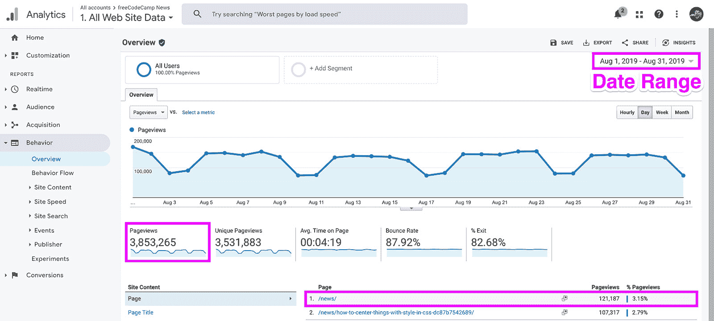

Finding top page on Google Analytics Behavior Overview Report

上面我们看到的是整个八月，你可以用报告右上角的日期选择器来改变。我们可以看到，总的来说，我们有 3，853，265 次总浏览量，其中 121，187 次是在/news，freeCodeCamp 新闻主页，这是我们这个月最受欢迎的页面。

### **我的流量从哪里来？**

一个常见的问题是:“人从哪里来？”人们是如何找到我的网站的？这是一个 2 部分，让我们从整体交通开始。

一个好的开始方法是找到收购概述页面。您可以通过选择采集而不是概览来导航。

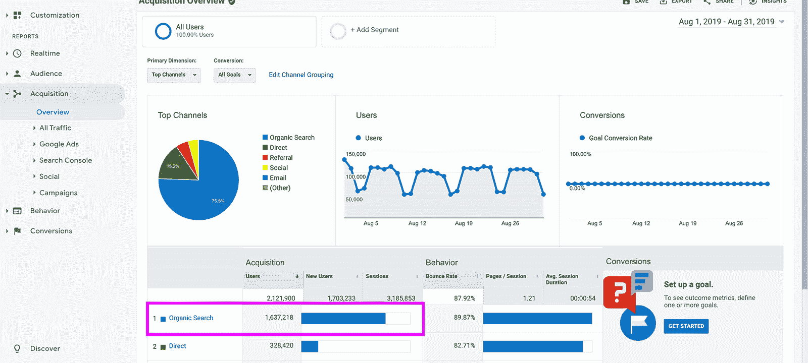

Finding top traffic source on Google Analytics Acquisition Overview Report

如上所示，大部分流量来自谷歌上的有机搜索，实际上超过 75%。这是一些好的搜索引擎优化。

Outstanding Move

但是如果我们想知道人们是如何到达一个特定的位置的呢？这涉及到更多的工作，但是让我们开始吧。

让我们回到侧边栏的行为，然后是网站内容，最后是登陆页面。在那里，你可以使用搜索找到你的文章，如下所示，并选择它。

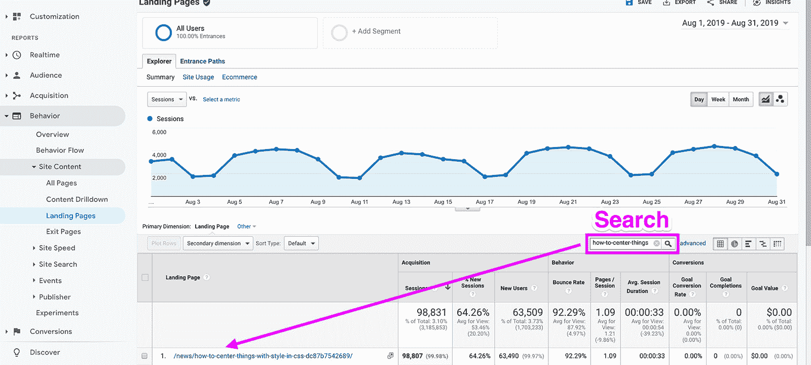

Searching for a page on the Google Analytics Landing Page Report

找到帖子后，我们将添加一个二次元。特别是，我们希望在次要维度下拉列表中找到并选择“Source / Medium”。

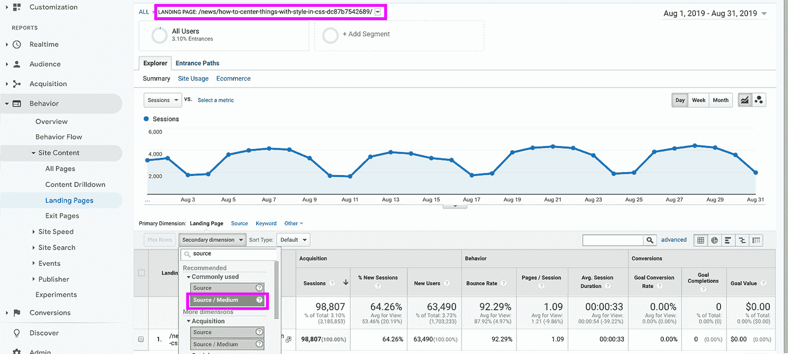

Adding a Secondary dimension on the Google Analytics Landing Page Report

最后，我们会知道人们是从哪里来访问我们的帖子的。

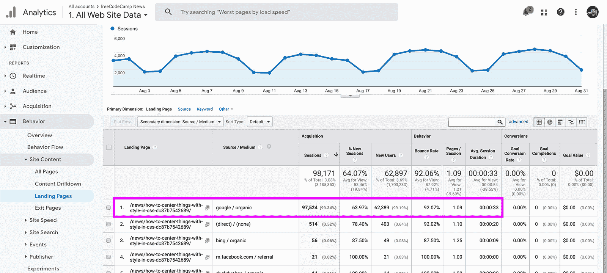

Finding the top Source / Medium on the Google Analytics Landing Page Report

看起来这是跟随伟大的有机搜索引擎优化的趋势。如果你注意到，我们有“(直接)/(无)”作为第二高的来源/媒介。

不幸的是，这并不总是那么容易。而如果 Google Analytics 想不出用户来自哪里，就会标记为“(直接)/(无)”。虽然这是可以解决的，而且有时确实有意义，但我们可以看到大部分来自谷歌本身的简单搜索。

### 人们最常用的访问设备是什么？

了解你的访问者正在使用什么设备是一个非常有用的工具，可以优化用户体验，并通过确保你的网站正常运行来最大化潜在收入。

在理想的情况下，你的网站可以在所有浏览器上运行。但是我们也许能够安全地排除某些旧的浏览器。

Internet Explorer behind a tree

首先，找到你的听众，然后概述。在那里，选择列表中的浏览器，如下所示。

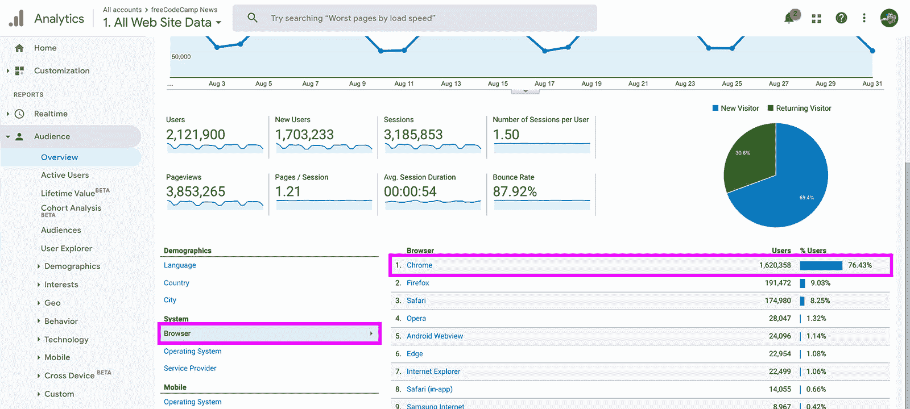

Finding the top browser in the Google Analytics Acquisition Report

我们可以看到，幸运的是，我们的顶级浏览器被现代浏览器所主导，Chrome 占据了 76.42%的份额。

但是等等，ie 浏览器的涨幅是 1.06%，也就是 22，499，这是一个不可忽视的数字。因此，让我们点击 Internet Explorer，深入了解一下。

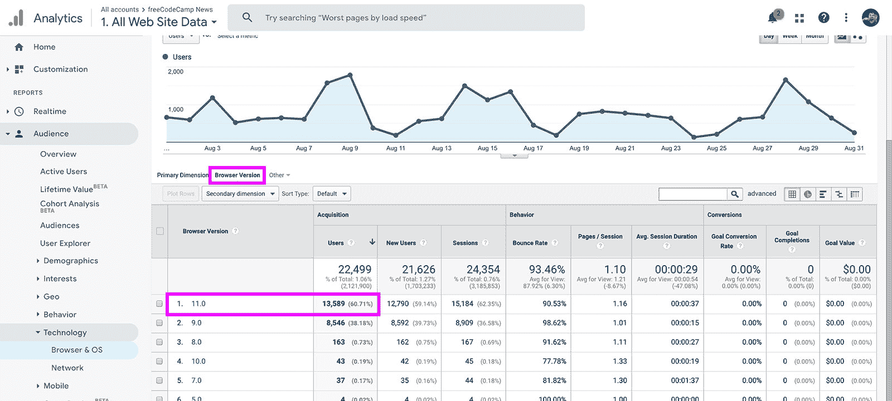

Finding the traffic for Internet Explorer versions in the Google Analytics Acquisition Browser Report

唷，我想我们安全了。现在我们可以看到有多少人访问每个版本的 Internet Explorer，幸运的是，几乎 99%的流量都是 IE9 或更高版本。虽然我们应该尽可能地包容，但这可以帮助我们确定优先级，并决定官方支持哪些浏览器版本。

真实对话:IE5 上 5 个人？？

## **奖励:高级洞察力**

开箱即用，谷歌分析是强大的，但通过一些定制和与您的网络数据更深入的集成，您可以给你的分析仪表板额外的超能力。

Darkwing Duck Let's Get Dangerous

## **自定义尺寸**

[自定义维度](https://support.google.com/analytics/answer/2709829?hl=en)是谷歌指定的“非标准数据”事实上，它们只是额外的数据点，我们可以通过配置来更好地理解是什么让我们的网站独一无二。

为了这篇文章(可能是后面的一篇)，我不打算深入讨论如何添加定制维度，但是 Google 提供了一个[很好的指南来深入理解](https://support.google.com/analytics/answer/2709828?hl=en)和一个[开发者指南来与之配套](https://developers.google.com/analytics/devguides/collection/analyticsjs/custom-dims-mets)。我将在这里介绍的是，一旦设置了一些自定义维度，如何浏览我们的报表。

### 我们的定制尺寸是什么？

首先，我们将讨论两个特定的自定义维度:作者和页面类别。

作者听起来像什么，是写文章的人。在我们的例子中，页面类别是代表文章的主要的顶级类别。

在 freeCodeCamp News 上，你可以指定尽可能多的类别(负责任地这样做)，但列表中的第一个类别是考虑你的“主要”类别，当你在列表视图(如主页)中看到你的帖子时使用。

Post on freeCodeCamp News Homepage

### 我们能用这些做什么？

最棒的是，当我们设置这些时，我们将它们归属于页面视图。一旦 Google Analytics 收集了页面视图，我们就可以使用它进行搜索，这是它真正强大的地方。先说作者。

### **查找特定作者的所有帖子**

如果我们想要搜索昆西·拉森写的任何帖子，我们会想要导航回**行为**，然后**网站内容**，最后**所有页面**。

在那里，我们将希望添加一个**辅助维度**，类似于我们添加 Source / medium 时的情况，但是现在我们将希望搜索并选择 **Author** ，您也会发现它嵌套在该下拉菜单的自定义维度标题下。

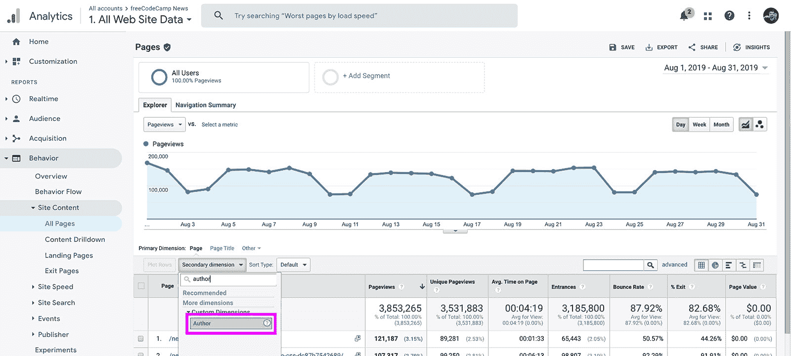

Selecting Author as a Secondary dimension on the Google Analytics Behavior Report

从那里，我们将希望选择右侧的高级(下面突出显示)，添加我们的作者的名字，最后点击应用按钮。

Searching for an Author in Advanced Search of Google Analytics Behavior Report

点击“应用”后，我们现在拥有了作者昆西·拉森所写文章的所有统计数据。

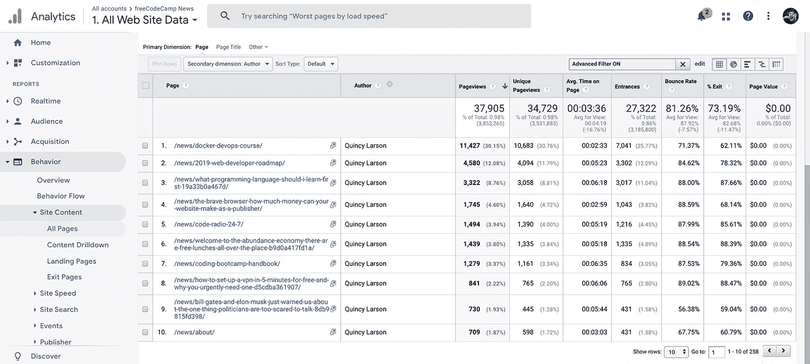

All posts from an Author in Google Analytics Behavior Report

### 你也可以在谷歌分析搜索栏中输入一个查询。

谷歌分析在顶部有一个搜索栏，你可以像这样输入自然语言查询:

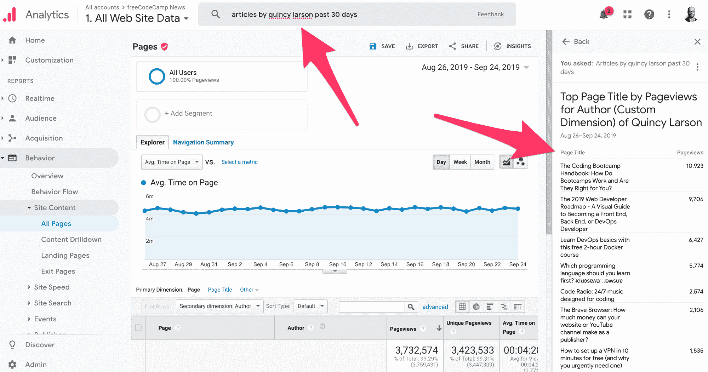

The results of a query for "articles by quincy larson past 30 days" shows the number of views each of Quincy's articles has gotten over the past 30 days.

### 哪些品类做得最好？

这是一个更棘手的问题。有很多问题我们可以像对待 Author 一样用基本报告来回答，比如“在所有的 JavaScript 帖子中，什么流量最大？”，但也许我们想知道网站上最受欢迎的类别是什么。

为此，我们需要接触定制报告。这个问题太复杂了，在这篇文章中无法解决，但是[谷歌在详细描述这个问题方面做得很好](https://support.google.com/analytics/answer/1151300?hl=en)。

现在，我已经帮了你一个忙，设置了一个报告，你可以很容易地导入到你的帐户，并立即使用。所以首先，让我们导入报告:[https://analytics.google.com/analytics/web/template?uid=4fHol2S_TZqcQACAwfcmfg](https://analytics.google.com/analytics/web/template?uid=4fHol2S_TZqcQACAwfcmfg)

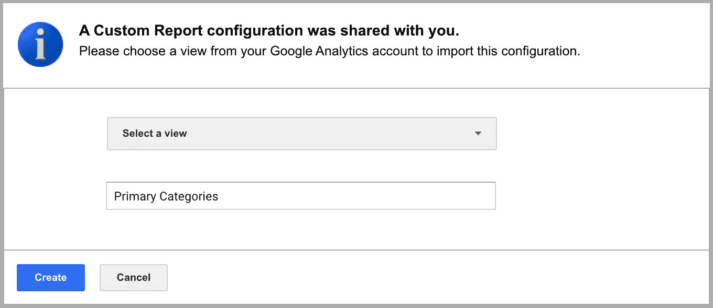

Importing a Custom Report in Google Analytics

在这里，您应该会看到一个类似上面的屏幕，它询问我们两件事情:我们应该在哪里应用报告，我们想给它起什么名字？如果你是一个可以访问 GA 的 freeCodeCamp 的作者，并且想要查看这个，你可以选择 freeCodeCamp News 属性下的 All Web Site Data 视图。

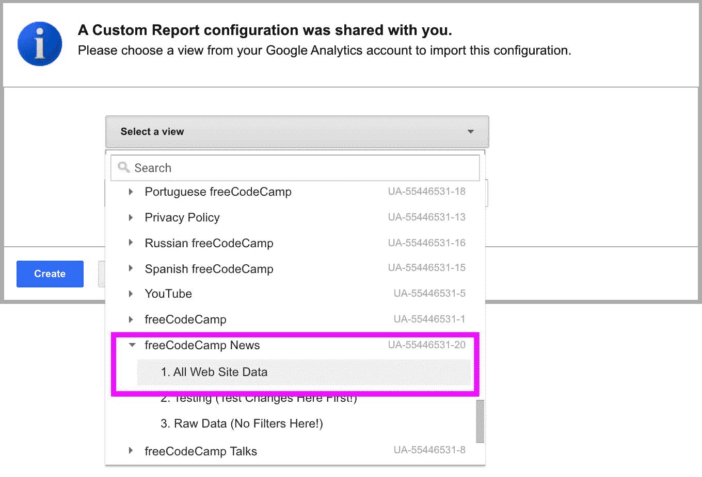

Selecting a Property and View when importing a Custom Report in Google Analytics

选中后，根据需要命名报告，例如“顶级主要类别”，然后单击“创建”。

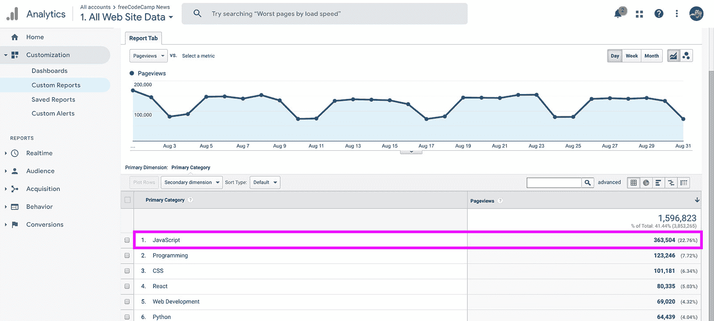

Custom Report showing top Primary Categories in Google Analytics

完成后，您将进入新导入的自定义报告，在这里您可以立即看到网站上最受欢迎的类别，八月份是 JavaScript！

## **故障**

太多了！

Alan Rickman in Galaxy Quest sinking in chair

但这只是数据冰山一角。即使只有上述内容，您也可以看到，为了最大限度地利用 Google Analytics 来满足您的特定需求，还有很多工作要做，还有很多配置要做。

如果你对此感兴趣，我鼓励你自己做一些研究，[添加一个新的视图](https://support.google.com/analytics/answer/1009714?hl=en)(特别是[一个测试视图](https://www.e-nor.com/blog/google-analytics/best-practices-views-google-analytics)来玩)，并尝试不同的报告。否则，请关注我的更多 GA 帖子，包括高级安装和更深入的见解。

*   [？在 Twitter 上关注我](https://twitter.com/colbyfayock)
*   [？️订阅我的 Youtube](https://youtube.com/colbyfayock)
*   [✉️注册我的简讯](https://www.colbyfayock.com/newsletter/)

*最初发布于[https://www . colbyfayock . com/2019/09/making-sense-of-Google-analytics-and-the-traffic-to-your-website](https://www.colbyfayock.com/2019/09/making-sense-of-google-analytics-and-the-traffic-to-your-website)*