# 如何有针对性地思考:一个有针对性的网页设计教程

> 原文：<https://www.freecodecamp.org/news/how-to-start-thinking-responsively/>

很长一段时间，响应式网页设计是一种趋势。现在这简直是现实。如果我们想到一个网站，其实不必说“一个响应式的网站”，它只是一个预期的现实。

这意味着当我们在制作一个网站时，必须考虑到它在不同屏幕尺寸下的外观。根据当今的趋势，必须大力强调移动体验。

*R *最近*，我*推出了关于********Scrimba*******称为[******响应式网页设计训练营******](https://scrimba.com/g/gresponsive)******的全面详细课程。****** **本课程非常深入地涵盖了所有关于响应式网页设计的技术和架构概念** ******。****** **本博客是根据**课程的六个*章节之一*:********开始*****【ing*****思考响应****** *

# *进入有反应的心态*

*本课程模块重点讲述在编写一行代码之前考虑响应性的重要性，以及构建响应性网站的其他一些要素:*

1.  *如何进行布局*
2.  *CSS 单位*
3.  *Flexbox 基础知识*
4.  *媒体查询基础*

*虽然我们使用一些简单的练习来开始，但本模块课程的主要重点是建立一个全面响应的 3 页网站。我们用它来巩固我们已经学过的东西，同时也引入一些新的东西。*

*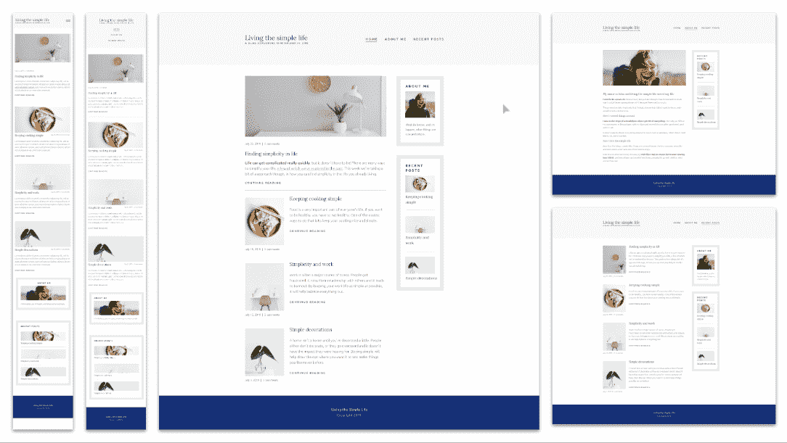*

*在这篇文章中，我们将探讨我在本模块课程中探索的上述概念，从深入研究`em`与`rem`开始，看看 flexbox 和媒体查询的基础知识，以及我们在课程中构建的一些项目的概述。*

# *CSS 单位*

*构建响应式 web 设计的第一个也是最基本的概念是我们用来设置许多属性的单元。*

*在第 2 课中，我们将学习一些可用的 CSS 单元，以及它们之间的不同之处。最重要的是，我们将根据需求学习使用哪一个。*

*有三种主要的 CSS 单位:绝对单位、百分比单位和相对单位。*

## *绝对单位*

*绝对单位也称为固定单位。*

*以任何绝对单位表示的长度将以完全相同的大小出现(因此我们称它们为固定的，它们是固定的大小)。*

*虽然`px`(像素)是最常见的单位，但在 CSS 中我们也可以使用`pt`、`pc`、`in`、`cm`、`mm`以及更多的单位，尽管我并不真正推荐这些单位，除非你正在为打印设计一些样式。*

*比你想象的要复杂一些。在过去，一个`px`与你屏幕上的一个像素相关，但是现在 CSS 使用一种叫做*参考像素*的东西，这使它成为一个固定的大小，与设备分辨率无关。*

## *百分率*

*本课程的第 3-5 课深入研究百分比。顾名思义，百分比通常用于定义相对于其父级大小的大小。*

*这与绝对单位有些不同，需要一点时间来适应。当我们使用`px`设置某个东西的宽度时，我们是在告诉这个元素它应该有多大。例如:*

```
*`.box {
    width: 500px;
    /* this element will be 500px in width */
}`*
```

*然而，如果我们使用百分比，就不那么简单了:*

```
*`.box {
    width: 80%;
    /* this element will have a width of 80% */
}`*
```

*但是，那是什么？它是它父母的。当我们对`width`、`margin`或`padding`使用百分比时，它总是查看其父的*宽度(是的，甚至对顶部和底部的`margin`和`padding`)。**

*我们经常使用百分比来定义元素的宽度，因为这让它们更灵活，这在整合响应性设计时是必不可少的。*

*在本课程中，我们将借助以下示例来了解这一点:*

*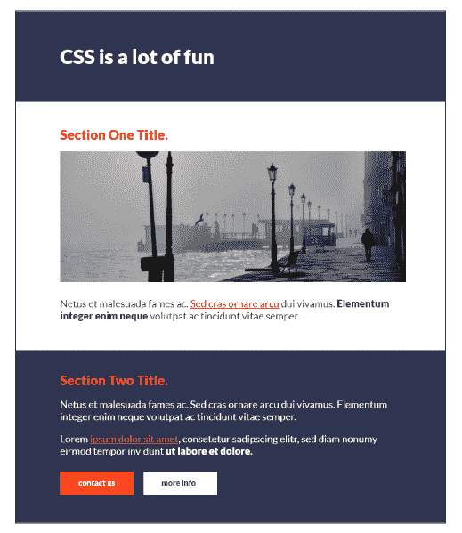*

*如果我们将上述布局的容器宽度保持为任意固定值，比如说`500px`，我们知道它看起来没问题，除非屏幕的尺寸小于`500px`。*

*在这种情况下，如果我们希望我们的布局根据视口的大小进行调整，我们可以做的是设置百分比宽度，可以是`100%`或更小。*

```
*`.container { 
    width: 70%; 
    ...
}`*
```

*当我们将宽度更新为父容器宽度的 70%时，我们现在可以看到它根据屏幕大小进行了自我调整:*

*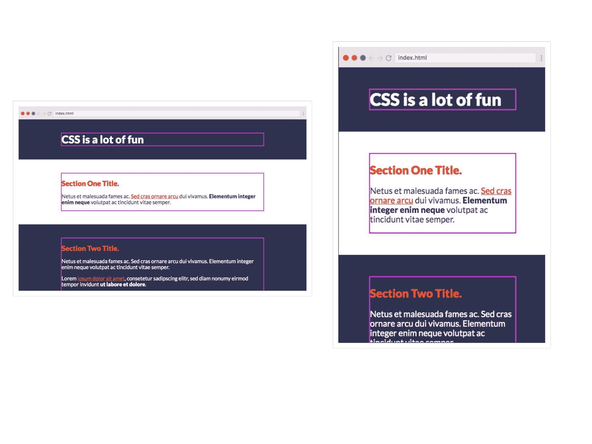*

*但是有一个问题。现在，如果我们将一个图像放入容器中，它看起来像这样(如果图像的宽度太大):*

*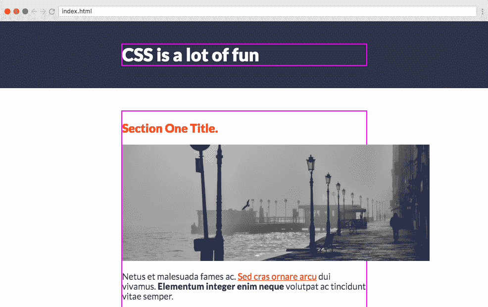*

*问题是，除非我们指定不同的，图像将是他们的实际大小。为了解决这个问题，我们可以对图像本身应用 CSS，这样它就开始默认为其容器的大小。*

```
*`.img { 
    width: 100%;
}`*
```

*当我们这样做时，我们可以看到图像开始默认为其父容器的大小。*

*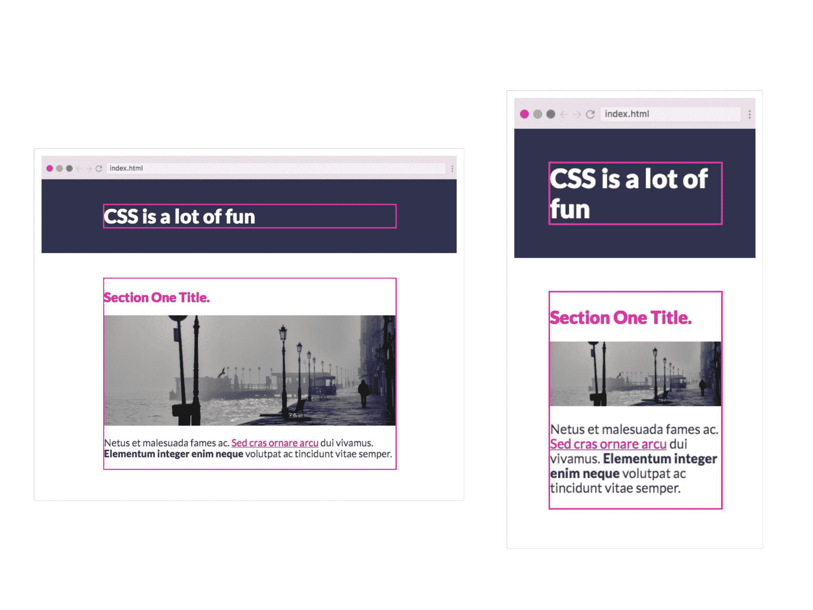*

### *最大和最小尺寸*

*虽然上面的解决方案很棒，但它实际上会导致图像变得比实际尺寸更大。如果出现这种情况，它将很快开始失去质量。*

*为了帮助解决这个问题，我们可以使用`max-width`。*

```
*`.img { 
    max-width: 100%;
}`*
```

*这意味着图像的最大宽度是其父图像的 100%,但可以更小。*

*在课程中，我还探索了其他类似的属性，比如`min-width`、`min-height`和`max-height`，它们都设置了元素大小的上限和下限。*

*这些都优先于元素的`width`,记住这一点很重要！*

## *CSS 单位-相对单位*

*CSS 中的相对单位总是相对于其他东西的大小。有些单位会看另一个元素(或者那个元素)的`font-size`，而有些单位会看视口的大小。*

*在课程中，我首先介绍与`font-size`相关的两个，即 ****em**** 和 ****rem**** 。*

## *`em`单位*

*当你声明一个元素的`font-size`时，如果你使用`em` s，它将相对于父元素的`font-size`。*

*例如，我们有下面的 HTML 代码，其中有一些`li`元素，这些元素几乎没有父元素。*

```
*`<body> 
    <section class='class-one'>
        <div class="container">
            <ul>
                <li>Item 1</li>
                <li>Item 2</li>
                <li>Item 3</li>
            </ul>
        </div>
    </section>
</body>`*
```

*我们有下面的 CSS 和上面的 HTML:*

```
*`body { 
    font-size: 25px; ...
}

ul { 
    /* 1.5em = 25 * 1.5 = 37.5  */ 
    font-size: 1.5em;
}`*
```

*在上面的例子中，`ul`将从它的父元素获取它的`font-size`,并使用相对`1.5em`应用到它的`li`元素上。*

*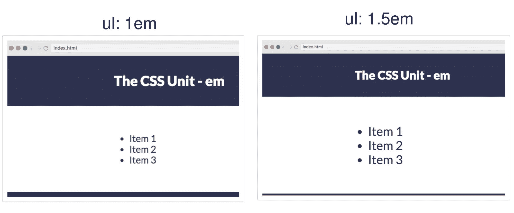*

*在 **em** 单元的情况下，我们必须记住它将默认为其直接父单元的`font-size`，这意味着如果在我们上面的例子中，我们将`container`类的`font-size`更改为`15px`，那么`ul`将开始相对于`15px`调整大小。*

### *`em` s 的级联效应*

*我不喜欢在`em`中设置`font-size`的原因之一是因为它有受到级联效应影响的风险。例如，如果我们使用上面的例子，但是在`li`元素中添加了一个`font-size`，我们就开始遇到问题了！*

```
*`body { 
    font-size: 25px; ...
}

ul { 
    font-size: 1.5em;
}

li {
 	font-size: 1.5em;   
}`*
```

*在这种情况下，`li`查看它的父对象，然后父对象查看正文，因此我们得到的总字体大小为 56.25px (1.5 x 1.5 x 25px)。事情会很快失控！*

## *rem 单位*

*正如我们所见，使用`em`有时会令人困惑，因为它从其父节点获取大小，而父节点的`font-size`可能也在`em`中定义，这将产生级联效应。*

*`rem`单元是*根元素*的简称，意思是它只查看根元素的`font-size`。在网站的情况下，根元素总是`html`元素。*

*因此，如果你在`rem`中设置了字体大小，那么*总是相对于`html`元素的`font-size`而言的*，除此之外别无其他，这使得使用起来更加容易。*

## *使用`em` s 是个好主意吗？*

*虽然看起来像是你可能想要避免的事情，但是它们真的很有用！*

*当用`em`设置`font-size`时，它指向父元素，但是当我们用`em`设置任何其他属性时，它是相对于该元素的字体大小**的！这对于设置`margin`和`padding`非常有用。***

*如果我们增加选择器的`font-size`，它将随之增加`margin`或`padding`，反之亦然！超级有用。*

*这是本课程中的一张幻灯片，它总结了我如何使用这两者:*

*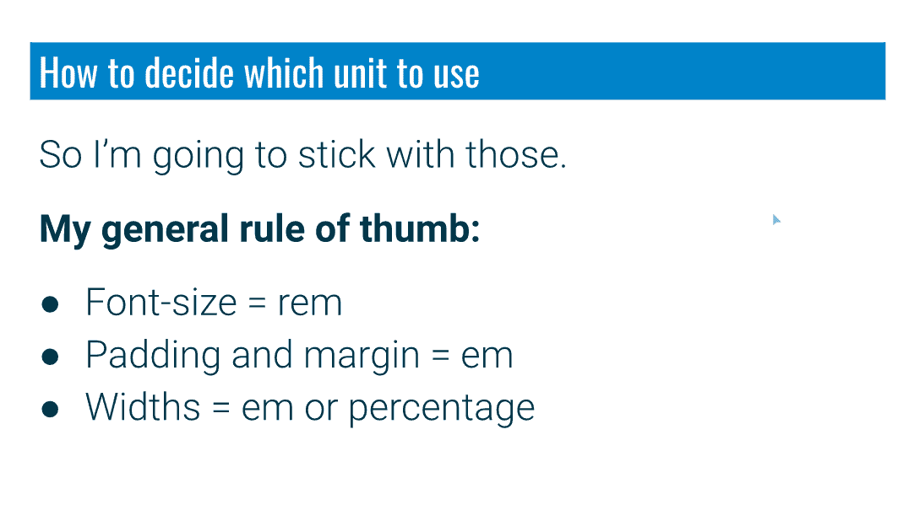*

# *flex box(flex box)的缩写形式*

*一旦我们确定了这些单元以及它们最适合什么，我就把课程转向 flexbox 的基础知识，它允许我们非常容易地创建响应性布局，而不必依赖于浮动或定位。*

*默认情况下，所有元素都有`block`或`inline`的`display`属性。*

*****块元素**** ( `div`、`header`、`footer`、`h1` - >、`p`等。)堆叠在彼此之上。*

*****行内元素**** ( `a`、`strong`、`em`、`span`等。)呆在他们周围的流动之中。*

*当我们将他们的显示器改为 flex 时，他们开始并排对齐。*

*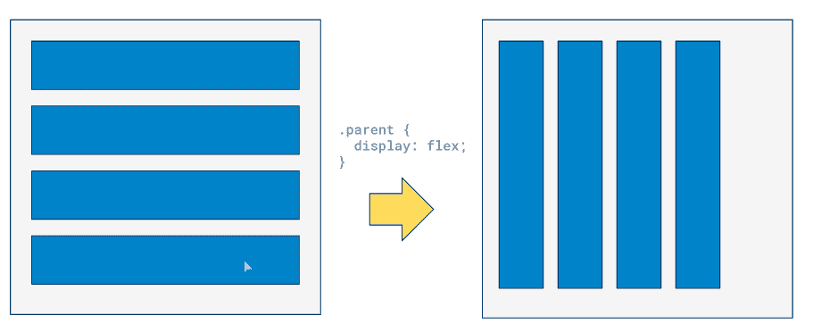*

*让我们看看如何使用 flexbox 设计一个带有一些栏目的典型响应式网站的简单架构。结果将是以下布局:*

*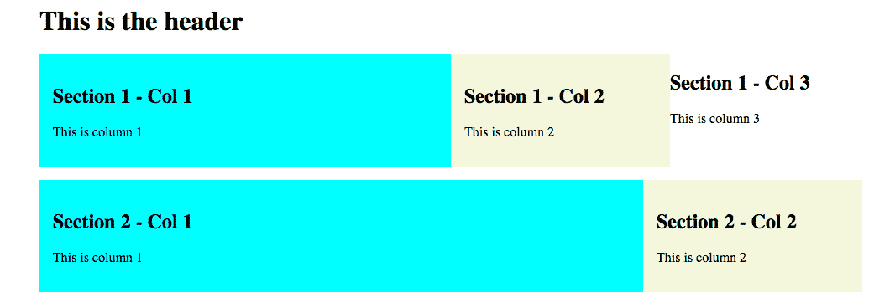*

*我们将从下面的 HTML 开始:*

```
*`<body>
  <div class="container">
    <h1>This is the header</h1>
    <div class="columns">
      <div class="col">
        <h2>Section 1 - Col 1</h2>
        <p>This is column 1</p>
      </div>
      <div class="col">
        <h2>Section 1 - Col 2</h2>
        <p>This is column 2</p>
      </div>
      <div class="col">
        <h2>Section 1 - Col 3</h2>
        <p>This is column 3</p>
      </div>
    </div>
    <div class="columns">
      <div class="col">
        <h2>Section 2 - Col 1</h2>
        <p>This is column 1</p>
      </div>
      <div class="col">
        <h2>Section 2 - Col 2</h2>
        <p>This is column 2</p>
      </div>
    </div>
  </div>
</body>`*
```

*并且，我们可以有下面的 CSS:*

```
*`.container {
  width: 90%;
  max-width: 980px;
  margin: 0 auto;
}

.columns {
  display: flex;
  margin: 1em 0;
}`*
```

*为了给列添加背景颜色，我们将添加几个修饰符类并将它们分配给列:*

```
*`.col-bg-beige {
  background-color: beige;
  padding: 1em;
}

.col-bg-aqua {
  background-color: aqua;
  padding: 1em;
}`*
```

*到目前为止，页面看起来是这样的:*

**

*在下一步中，我们想要设置列的宽度，我们将定义修饰符类并在它们内部分配固定的宽度。*

```
*`.col-1 {
  width: 25%;
}
.col-2 {
  width: 50%;
}
.col-3 {
  width: 75%;
}
.col-4 {
  width: 100%;
}`*
```

*我们将根据布局需要将这些类分配给我们的列，例如:*

 *[https://codepen.io/kevinpowell/embed/preview/XWrRqyG?height=300&slug-hash=XWrRqyG&default-tabs=css,result&host=https://codepen.io](https://codepen.io/kevinpowell/embed/preview/XWrRqyG?height=300&slug-hash=XWrRqyG&default-tabs=css,result&host=https://codepen.io)* 

*如果我们希望 flex 列相互对齐，可以使用以下属性:*

```
*`.columns {
  display: flex;
  justify-content: center;
}`*
```

***在 Scrimba 课程** [******响应式 Web 设计训练营******](https://scrimba.com/g/gresponsive)******中有更多关于 Flexbox 基础知识和在线代码编辑功能的详细信息。*******

# *媒体查询*

*媒体查询允许我们声明新的 CSS 规则，这些规则只适用于特定的情况，例如不同类型的媒体(屏幕、印刷、演讲)，以及不同的媒体特性，例如屏幕宽度、方向、纵横比等等。*

*媒体查询的基本语法如下所示:*

*`@media **media-type** and(**media-features**) {...}`*

*例如，如果它是一个屏幕并且有 480 像素的`min-width`,下面这段代码将把`background-color`设置为主体。*

```
*`@media screen and (min-width: 480px) {  
    body {    
        background-color: aqua;  
    }
}`*
```

***回到我们上面的例子**，如果我们缩小屏幕尺寸，我们会看到一些列变得更窄，我们希望通过使其完全响应来修复它们。*

*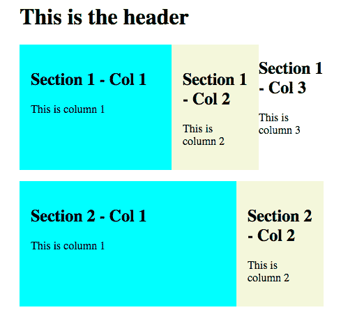*

*由于我们已经在使用 flexbox，我们可以更改`flex-direction`属性来切换主轴，因此它将创建内容行，而不是创建列。*

```
*`@media screen and (max-width: 600px) {
  .columns {
    flex-direction: column;
  }
}`*
```

 *[https://codepen.io/kevinpowell/embed/preview/WNejJLM?height=300&slug-hash=WNejJLM&default-tabs=css,result&host=https://codepen.io](https://codepen.io/kevinpowell/embed/preview/WNejJLM?height=300&slug-hash=WNejJLM&default-tabs=css,result&host=https://codepen.io)* 

# *设计响应性导航*

*我最喜欢看的一个地方是如何将上述所有内容应用到一个实际的例子中，看一看如何设置一个响应性导航。*

*我们将从编写导航栏的 HTML 开始。*

```
*`<header>
  <div class="container container-nav">
    <div class="site-title">
      <h1>Living the social life</h1>
      <p class="subtitle">A blog exploring minimalism in life</p>
    </div>
    <nav>
      <ul>
        <li><a href="#">Home</a></li>
        <li><a href="#">About me</a></li>
        <li><a href="#">Recent posts</a></li>
      </ul>
    </nav>
  </div>
</header>`*
```

*然后，我们可以使用 flexbox、媒体查询和其他一些小东西，开始在我们的 CSS 中设计它。*

*下面是一些 CSS 的一瞥(详细代码可在课程中找到):*

```
*`body {
  margin: 0;
}

.container {
  width: 90%;
  max-width: 900px;
  margin: 0 auto;
}

.container-nav {
  display: flex;
  justify-content: space-between;
}

nav ul {
  display: flex;
  justify-content: center;
  list-style: none;
  margin: 0;
  padding: 0;
}

@media (max-width: 675px) {
  .container-nav {
    flex-direction: column;
  }

  header {
    text-align: center;
  }
}`* 
```

*在本模块这一部分的课程结束时，我们将获得一个漂亮、简单、响应全面的导航:*

*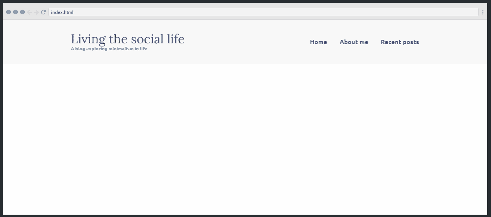*

# *构建一个 3 页的网站*

## *检查结构*

*导航结束后，我开始了全面的项目。这将是一个 3 页的移动响应网站。*

*下面您可以看到我们正在构建的页面，以及一个到 Adobe XD 的链接，您可以在那里查看画板的更多细节。在这些课程中，我会看一看不同页面之间的相似之处，以及在开始编写任何代码之前，我是如何开始计划这样的事情的。*

*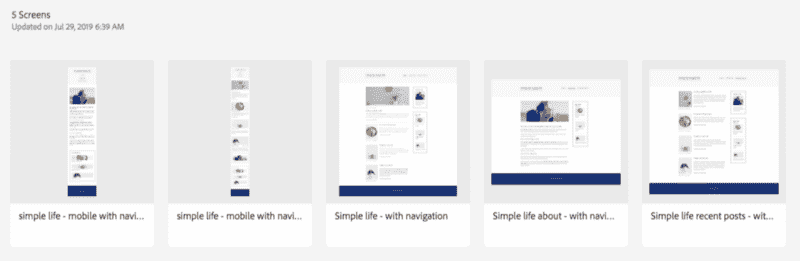

The layouts of the web pages we will be learning to design in the course. ([https://xd.adobe.com/spec/75d448ea-569a-4b7e-721b-9bbd3b2b97b9-03e5/grid/](https://xd.adobe.com/spec/75d448ea-569a-4b7e-721b-9bbd3b2b97b9-03e5/grid/))* 

## *主页*

*正如我们从下图中看到的，主页有两个主要部分。左边是文章列表，上面有一篇特色文章，右边是作者信息和最近的文章。*

**

*我们将把全部内容包装在`container` div 中，首先创建左侧的文章列表。这将在 HTML 的`article`标签的帮助下创建，然后我们将内容放入其中*

```
*`<div class="container">
  <main role="main">
    <article class="article-featured">
      <h2 class="article-title"></h2> 
      <p class="article-info"></p>
      <p class="article-body"></p>
      <a href="#" class="article-read-more"></a>
    </article>
    ...
  </main>
</div>`*
```

*接下来，我们将借助 HTML 的`aside`标签创建右侧面板。*

```
*`<aside class="sidebar">
  <div class="sidebar-widget">
    <h2 class="widget-title"></h2> 
    
    <p class="widget-body"></p>
  </div>

    ...
</aside>`*
```

*在开始布局之前，我喜欢先从排版开始。这可能不是编写 CSS 最令人兴奋的部分，但是当字体和字体大小开始改变时，它会对布局产生巨大的影响。从那里开始，然后担心布局使我们的生活变得容易得多。*

*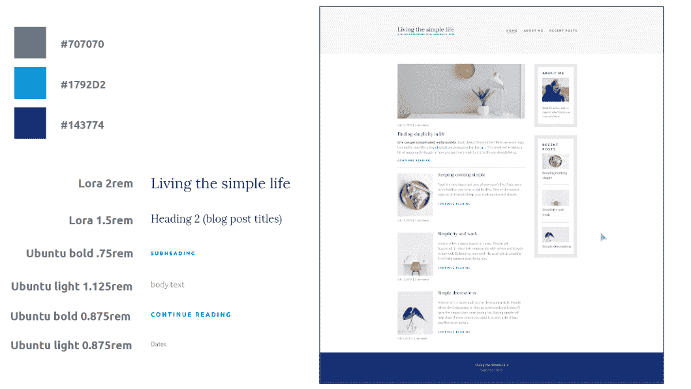*

*排版就绪后，是时候开始布局了。虽然我们可以从大屏幕开始，然后使用媒体查询来重新设计较小尺寸的东西(就像我们在上面的导航中所做的那样)，但我发现反过来工作要少得多。*

*移动布局往往要简单得多，所以通过首先启动移动，我们可以创建我们的布局，而不需要太多的工作。*

*一旦移动布局完成，那么是时候添加我们的媒体查询，并开始修改更大的屏幕布局。*

*真正重要的一点是不要强迫自己为特定的设备设置断点。总是使用相同的断点是很常见的，但是实际上，你应该在布局需要的时候改变布局。*

*我真的不关心某人在什么设备上，或者那个设备的大小。重要的是它在所有设备上都很好看。如今有了大量不同的设备和屏幕尺寸，我们应该关注布局本身。*

*在课程本身中，我深入研究了我们如何确定一个布局何时需要断点(通常是因为文本行变得太长了！)，然后我们进入一些有趣的附加功能，查看属性，如`order`、`object-fit`，以帮助我们的图像调整更容易，并微调布局。*

*一旦第一页完成，第二和第三页很容易创建。通过在开始之前查看所有页面，并用可以在每个页面上重用的类来命名，这里和那里有一些小的调整要做，但总体来说事情进展得非常快。*

# *结论*

*在这篇文章中，我们研究了一些设计响应式网站的核心 CSS 原则，从它们的单元到媒体查询和 flexbox。我们看了如何为导航设置好一切，以及如何分解和分析一个更大的设计。*

*正如我上面提到的，所有这些内容都是从课程 [****的 **开始思考响应** 模块【响应式网页设计训练营****](https://scrimba.com/g/gresponsive) 】。*

*本课程本身对这些主题和许多其他主题进行了更深入的研究，从对 CSS 基础的探索，到对 flexbox 和 grid 的深入研究，包括构建其他几个项目。*

*现在是 **移动的时代——首先是** 网站。好消息是，我们可以使用 CSS 实现我们需要的一切。现在有很多很酷的资源和工具，使用它们我们可以创建漂亮的移动友好网站，而不需要框架或库。CSS 已经到了一个*真正*好玩的地方。我真的很喜欢 CSS，我希望你能加入我的课程，希望我能帮助你也爱上它！*