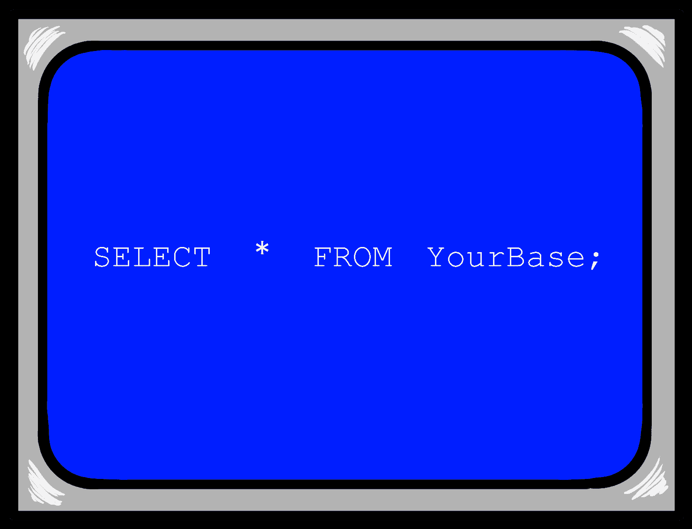
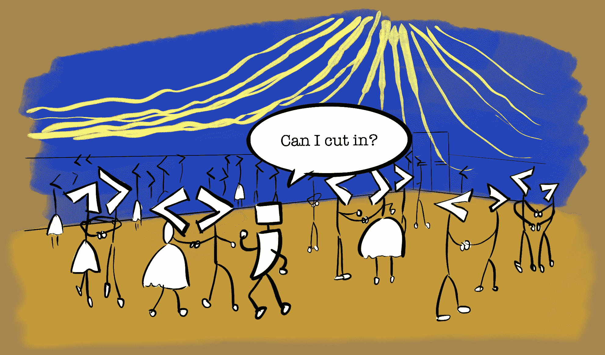
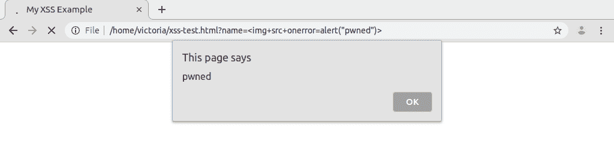

# SQL 注入和 XSS:白帽黑客对信任用户输入了解多少

> 原文：<https://www.freecodecamp.org/news/sql-injection-and-xss-what-white-hat-hackers-know-about-trusting-user-input/>

软件开发人员有很多想法。当创建一个网站或应用程序时，有无数的问题要问:*我们将使用什么技术？架构将如何设置？我们需要什么功能？UI 会是什么样子？*

尤其是在软件市场，发布新应用似乎更像是一场声誉竞赛，而不是一个经过深思熟虑的过程，最重要的问题之一往往落在“紧急”栏的底部:我们的产品将如何得到保护？

如果你正在使用一个健壮的、开源的框架来构建你的产品(如果有一个是可用的，你为什么不呢？)那么一些基本的安全问题，如 CSRF 令牌和密码加密，可能已经为您解决了。

尽管如此，快速行动的开发人员将很好地重温他们对常见威胁和陷阱的知识，即使只是为了避免一些令人尴尬的新手错误。通常情况下，你的软件在安全性上最薄弱的一点就是*你。*

我最近对一般的信息安全越来越感兴趣，尤其是实践道德黑客。有道德的黑客，有时被称为“白帽”黑客，有时只是“黑客”，是搜索可能的安全漏洞并负责任地(私下)向项目所有者报告它们的人。

相比之下，恶意或“黑帽”黑客，也称为“黑客”，是利用这些漏洞来娱乐或谋取私利的人。

白帽和黑帽黑客可能使用相同的工具和资源，并且通常试图进入他们不应该进入的地方。但是白帽子这样做是经过许可的，目的是加强防御，而不是摧毁它们。黑帽子是坏人。

当谈到学习如何发现安全漏洞时，我贪婪地阅读我能得到的任何信息就不足为奇了。这篇文章是一些关键领域的精华，在处理用户输入时对开发者特别有帮助。这些经验教训都是从这些优秀的资源中收集而来的:

*   [开放 Web 应用安全项目](https://www.owasp.org/index.php/Main_Page)指南
*   HackerOne 的 YouTube 频道中的 Hacker101 播放列表
*   彼得·雅沃斯基的网络黑客 101
*   [蛮逻辑的博客](https://brutelogic.com.br/blog/)
*   电脑爱好者的 YouTube 频道
*   杰森·哈德克斯([@杰哈迪克斯](https://github.com/jhaddix/))和汤姆·哈德森([@汤姆诺姆](https://github.com/tomnomnom/))的视频(两个有成就的道德黑客使用不同但都有效的方法)

您可能熟悉这样一个口号，“净化您的输入！”然而，正如我希望这篇文章所展示的，开发一个具有健壮安全性的应用程序并不那么简单。

我建议一个替代短语:注意你的输入。让我们通过检查利用该领域中的漏洞的最常见攻击来详细说明:SQL 注入和跨站脚本。

# SQL 注入袭击

如果你还不熟悉 SQL(结构化查询语言)注入攻击，或者 SQLi，这里有一个关于 SQLi 的很棒的[解释-就像-I-m-five 视频。你可能已经从](https://www.youtube.com/watch?v=_jKylhJtPmI) [xkcd 的小鲍比桌](https://xkcd.com/327/)那里知道了这次攻击。

本质上，恶意行为者可能能够通过您站点上的一些输入发送影响您的应用程序的 SQL 命令，比如从您的数据库中提取结果的搜索框。用 PHP 编写的站点特别容易受到这些攻击，成功的 SQL 攻击对于依赖数据库的软件来说可能是毁灭性的(例如，您的用户表现在是一盆牵牛花)。



You have no chance to survive make your time.

您可以测试您自己的站点，看看您是否容易受到这种攻击。(请只测试您拥有的站点，因为在您没有权限的地方运行 SQL 注入在您所在的地方可能是非法的；毫无疑问，普遍来说，这并不好笑。)以下有效载荷可用于测试输入:

*   `' OR 1='1`计算为常量 true，成功时返回表中的所有行。
*   `' AND 0='1`的计算结果为常量 false，如果成功，则不返回任何行。

[这个视频演示了上面的测试](https://www.youtube.com/watch?v=ciNHn38EyRc)，很好地展示了 SQL 注入攻击的影响力。

幸运的是，有很多方法可以减轻 SQL 注入攻击，它们都归结为一个基本概念:不要相信用户输入。

# SQL 注入减缓

为了有效地减少 SQL 注入，开发人员必须阻止用户成功地向站点的任何部分提交原始 SQL 命令。

一些框架将为您完成大部分繁重的工作。例如，Django 通过使用[查询集](https://docs.djangoproject.com/en/2.2/topics/db/queries/)实现了[对象关系映射](https://en.wikipedia.org/wiki/Object-relational_mapping)或 ORM 的概念。我们可以把这些看作包装器函数，帮助您的应用程序使用预定义的方法查询数据库，避免使用原始 SQL。

然而，能够使用一个框架从来不是一个保证。当直接处理数据库时，我们可以使用其他方法从用户输入中安全地提取 SQL 查询，尽管它们的效率各不相同。按照从最受欢迎到最不受欢迎的顺序排列，并提供了相关示例的链接:

1.  带有变量绑定的预准备语句(或[参数化查询](https://cheatsheetseries.owasp.org/cheatsheets/Query_Parameterization_Cheat_Sheet.html))，
2.  [存储过程](https://cheatsheetseries.owasp.org/cheatsheets/SQL_Injection_Prevention_Cheat_Sheet.html#defense-option-2-stored-procedures)；和
3.  [白名单](https://cheatsheetseries.owasp.org/cheatsheets/SQL_Injection_Prevention_Cheat_Sheet.html#defense-option-3-whitelist-input-validation)或[逃避](https://cheatsheetseries.owasp.org/cheatsheets/SQL_Injection_Prevention_Cheat_Sheet.html#defense-option-4-escaping-all-user-supplied-input)用户输入。

如果您想实现上述技术，链接的备忘单是深入研究的一个很好的起点。可以说，使用这些技术来获取数据，而不是使用原始的 SQL 查询，有助于最大限度地减少应用程序中接受用户输入的任何部分处理 SQL 的机会，从而减少 SQL 注入攻击。

然而，这场战斗只赢了一半…

# 跨站点脚本(XSS)攻击

如果你是一个恶意的程序员，JavaScript 几乎是你最好的朋友。正确的命令可以做合法用户在网页上可以做的任何事情(甚至一些他们不应该做的事情)，有时不需要实际用户的任何交互。

[跨站脚本](https://en.wikipedia.org/wiki/Cross-site_scripting)当 JavaScript 代码被注入网页并改变该网页的行为时，就会发生攻击，即 XSS。其影响范围从恶作剧滋扰事件到更严重的身份验证绕过或凭据窃取。[2010 年来自 Apache 的这份事件报告](https://blogs.apache.org/infra/entry/apache_org_04_09_2010)是一个很好的例子，说明了 XSS 如何被卷入一场更大的攻击中，以接管账户和机器。



The annual DOM dance-off receives an unexpected guest

XSS 可以发生在服务器端或客户端，通常有三种形式:基于 DOM ( [文档对象模型](https://developer.mozilla.org/en-US/docs/Web/API/Document_Object_Model/Introduction))的、存储的和反射的 XSS。不同之处在于攻击负载注入应用程序的位置。

## 基于 DOM 的 XSS

[基于 DOM 的 XSS](https://owasp.org/www-project-web-security-testing-guide/v41/4-Web_Application_Security_Testing/11-Client_Side_Testing/01-Testing_for_DOM-based_Cross_Site_Scripting) 发生在 JavaScript 有效负载影响用户在其浏览器中加载的网页的结构、行为或内容时。这些最常见的是通过修改网址，如在网络钓鱼。

为了了解注入的 JavaScript 操纵页面有多容易，我们可以用一个 HTML web 页面创建一个工作示例。尝试使用以下 HTML 和 JavaScript 代码在您的本地系统上创建一个名为`xss-test.html`(或者您喜欢的任何名称)的文件:

```
<html>
    <head>
        <title>My XSS Example</title>
    </head>
    <body>
        <h1 id="greeting">Hello there!</h1>
            <script>
                var name = new URLSearchParams(document.location.search).get('name');
                if (name !== 'null') {
                    document.getElementById('greeting').innerHTML = 'Hello ' + name + '!';
                }
            </script>
        </h1>
</html>
```

该网页将显示标题“你好！”除非它从带有值为`name`的查询字符串接收到一个 [URL 参数。要查看脚本的工作情况，请在浏览器中打开附加了 URL 参数的页面，如下所示:](https://en.wikipedia.org/wiki/Query_string)

`file:///path/to/file/xss-test.html?name=Victoria`

好玩吧。我们的不安全(从安全的角度来说，而不是从情感的角度来说)页面接受`name`的 URL 参数值，并将其显示在 DOM 中。页面希望这个值是一个友好的字符串，但是如果我们把它改成别的什么呢？由于该页面归我们所有，并且只存在于我们的本地系统中，所以我们可以随心所欲地测试它。如果我们将`name`参数改为``，会发生什么？



这只是一个例子，很大程度上基于来自 [Brute 的帖子](https://brutelogic.com.br/blog/dom-based-xss-the-3-sinks/)的一个例子，展示了 XSS 攻击是如何执行的。有趣的弹出警报可能很有趣，但 JavaScript 可能会造成很多危害，包括帮助恶意攻击者窃取密码和个人信息。

## 存储和反射 XSS

[存储的 XSS](https://en.wikipedia.org/wiki/Cross-site_scripting#Persistent_(or_stored)) 发生在攻击有效载荷存储在服务器上时，例如存储在数据库中。每当在浏览器中检索和呈现存储的数据时，攻击都会影响受害者。例如，不使用 URL 查询字符串，攻击者可能会更新他们在社交网站上的个人资料页面，在“关于我”部分包含一个隐藏脚本。该脚本不正确地存储在站点的服务器上，稍后当另一个用户查看攻击者的配置文件时会成功执行。

其中一个最著名的例子是 2005 年几乎占领了 MySpace 的 Samy 蠕虫病毒。它通过发送 HTTP 请求进行传播，每当查看受感染的个人资料时，该请求会将其复制到受害者的个人资料页面上。在短短 20 小时内，它已经传播到超过 100 万用户。

[反射 XSS](https://en.wikipedia.org/wiki/Cross-site_scripting#Non-persistent_(reflected)) 类似地发生在注入的有效载荷传播到服务器时，但是，恶意代码最终没有存储在数据库中。而是由 web 应用程序立即返回给浏览器。

通过引诱受害者点击向易受攻击网站的服务器发送请求的恶意链接，可能会执行此类攻击。然后，服务器将向攻击者和受害者发送响应，这可能导致攻击者能够获得密码，或实施看似来自受害者的操作。

# XSS 攻击缓解

在所有这些情况下，XSS 攻击可以通过两个关键策略来缓解:验证表单字段，以及避免用户在网页上直接输入。

## 验证表单域

框架可以再次帮助我们确保用户提交的表单是正确的。一个例子是 [Django 的内置`Field`类](https://docs.djangoproject.com/en/2.2/ref/forms/fields/#built-in-field-classes)，它提供了验证一些常用类型的字段，还指定了一些缺省值。例如，Django 的`EmailField`使用一组规则来确定提供的输入是否是有效的电子邮件。如果提交的字符串中包含电子邮件地址中不常见的字符，或者没有模仿电子邮件地址的常见格式，那么 Django 不会认为该字段有效，表单也不会被提交。

如果依赖框架不可行，我们可以实现自己的输入验证。这可以通过一些不同的技术来实现，包括[类型转换](https://en.wikipedia.org/wiki/Type_conversion)，例如，确保一个数字是类型`int()`；检查数字和字符串长度的最小和最大范围值；使用预定义的选择数组，避免任意输入，例如，一年中的几个月；并对照严格的[正则表达式](https://en.wikipedia.org/wiki/Regular_expression)检查数据。

谢天谢地，我们不必从头开始。开源资源可以提供帮助，例如 [OWASP 验证正则表达式存储库](https://www.owasp.org/index.php/OWASP_Validation_Regex_Repository)，它提供了一些常见数据形式的匹配模式。许多编程语言都提供了特定于它们语法的验证库，我们可以在 GitHub 上找到[很多这样的库。此外，](https://github.com/search?q=validation+library) [XSS 过滤器规避备忘单](https://www.owasp.org/index.php/XSS_Filter_Evasion_Cheat_Sheet)对测试有效载荷有一些建议，我们可以用它们来测试我们现有的应用。

虽然这看起来很乏味，但正确实现的输入验证可以保护我们的应用程序不受 XSS 的影响。

## 避免直接喷射

应用程序中直接将用户输入返回到浏览器的元素，在不经意间可能并不明显。我们可以通过探究几个问题来确定应用程序中可能存在风险的领域:

*   数据如何流经我们的应用程序？
*   当用户与这个输入交互时，他们期望发生什么？
*   数据出现在我们页面的什么位置？它是嵌入在字符串中还是属性中？

这里有一些示例负载，我们可以使用它们来测试我们站点上的输入(同样，只有我们自己的站点！)由[黑客 101](https://www.hacker101.com/) 提供。成功执行这些示例中的任何一个都可能表示由于直接注入而可能存在 XSS 漏洞。

*   `"><h1>test</h1>`
*   `'+alert(1)+'`
*   `"onmouserover="alert(1)`
*   `http://"onmouseover="alert(1)`

作为一般规则，如果您能够围绕直接注入输入进行设计，那么就这样做。或者，一定要完全理解你选择的方法的效果；例如，在 JavaScript 中使用`innerText`而不是`innerHTML`将确保内容被设置为纯文本而不是(潜在易受攻击的)HTML。

# 注意你的输入

当与黑帽或恶意黑客竞争时，软件开发人员处于明显的劣势。尽管我们做了很多工作来保护每一个可能危害我们应用程序的输入，但攻击者只需要找到我们漏掉的那一个。这就像在所有的门上安装了插销，但却开着一扇窗！

然而，通过学会像攻击者一样思考，我们可以更好地准备我们的软件来对抗坏人。尽可能快地发布特性可能令人兴奋，但是如果我们事先花时间仔细考虑应用程序的流程，遵循数据，并注意我们的输入，我们将避免积累大量的安全债务。