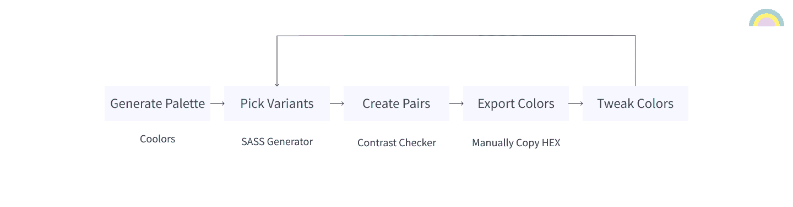
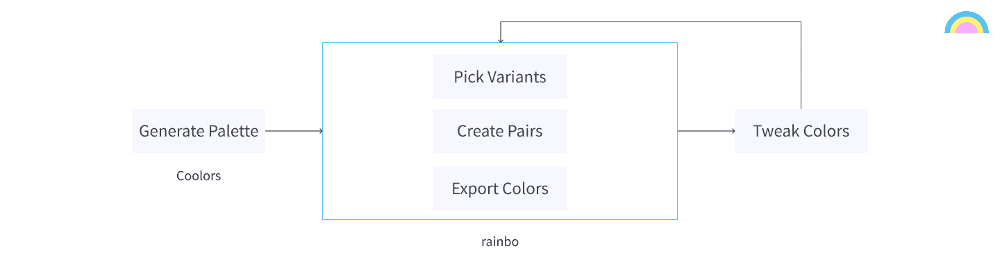
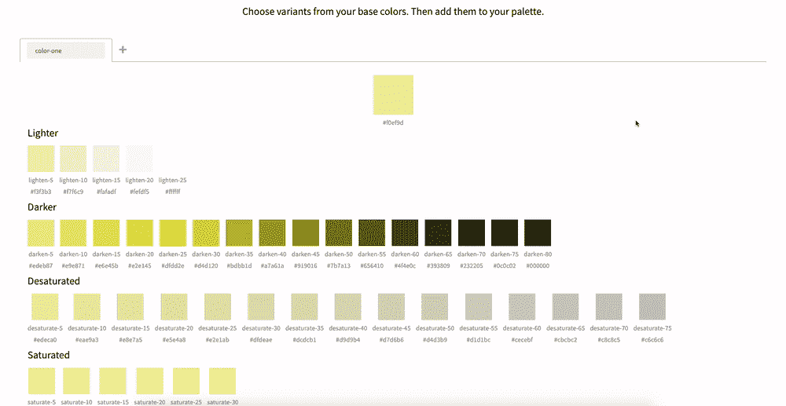
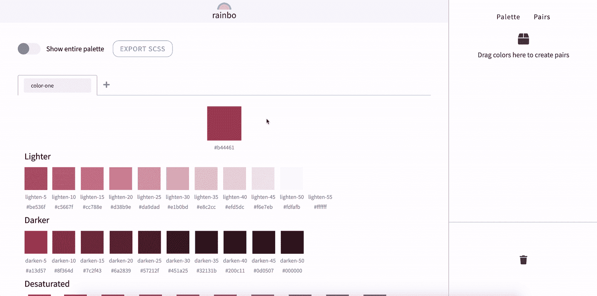

# 我如何以及为什么设计了一个颜色变体和辅助工具

> 原文：<https://www.freecodecamp.org/news/the-why-and-how-of-designing-a-color-variant-and-accessibility-tool/>

作为一名开发人员，为我的设计选择颜色一直是比较困难的任务之一。为了帮助我，我倾向于使用像 [Coolors](https://coolors.co/) 、 [SASS 颜色生成器](http://scg.ar-ch.org/)和[这个颜色对比检查器](https://webaim.org/resources/contrastchecker/)这样的工具。

我的过程看起来像这样:

1.  使用颜色生成调色板
2.  使用 SASS 颜色生成器选择每种颜色的变体
3.  将变体配对成背景/前景组合。
4.  使用颜色对比检查器检查线对是否可访问。
5.  将我选择的颜色添加到我选择的设计工具(Figma)中。
6.  调整颜色并重复第 2 步。

The old process

# 那么，是什么问题呢？

我的旧流程涉及到不同应用程序之间的大量来回切换。我无法调整颜色，也无法实时看到对可访问性的影响。相反，我不得不将十六进制代码从一个应用程序复制/粘贴到另一个应用程序。然后，当我准备开始开发时，我不得不在 SASS/CSS 中手动创建变量，并再次复制值。

# 解决方法是什么？

创建一个工具，我可以在一个地方做(几乎)任何事情。我的目标是走向这样一个过程:

1.  使用颜色生成调色板
2.  使用单个应用程序挑选变体、配对颜色并进行调整。
3.  将生成的颜色添加到我选择的设计工具中。

我还希望该应用程序能够将我的颜色导出到代码中，这样我就有了一个良好的开发起点。

The new process

# 概念的初步证明

我想尽快启动并运行一些东西，这样我就可以开始测试了。为此，我着手创建一个原型。

## 用例

组装原型的第一步是定义驱动它的用例。

1.  ****作为用户，我想为我的基本色生成变体。****

我希望能够打开应用程序，添加我的基色，选择变体，然后再次将它们导出到我的设计工具中。简单？。

****2。作为用户，我想检查背景/前景色对是否可用。****

从输入的基色或它们的变体中，我希望能够检查当两种颜色配对在一起时是否可访问。

****3。作为用户，我应该能够看到改变基色对可访问性的影响。****

我希望每次对我的基色进行调整时，能够获得关于我选择的颜色对的实时反馈。

## (非常粗糙的)工作版本

定义了用例之后，我开始设计原型。我想出了一个调色板，设计了一组有限的组件，并最终达成了一个有三种“模式”或页面的解决方案，用户必须在它们之间切换才能完成任务。

与其进一步描述，不如让我们看一看。

My first draft in action

正如你从上面的图片中看到的，基于最初的用例，原型实现了我想要的一切…算是吧。

> **[点击此处](https://5d112084bc6f2c00097f59a7--rainbo.netlify.com/)如果您想亲自尝试原型，感谢 Netlify deploy 预览的魔力。**

# 原始设计的好与坏

我从来没有打算让第一个原型成为一个垫脚石，你可以自己看到它非常粗糙和有缺陷。

对于下一个版本，我从查看 ****关于原型我喜欢**** 什么开始。

## 变体模式

我对原型的变体生成部分的结果非常满意。选择一种颜色并获得变体列表非常简单。此外，选项卡式方法非常适合添加多种基色。

## 能够在改变颜色后看到可访问性的变化

正如你在上面的简短演示中看到的，没有必要在应用程序之间复制/粘贴十六进制代码。我现在可以改变我的一种颜色，看看它是如何快速影响颜色的可及性的。

然后，我开始挑那些 ****我不喜欢**** 需要 ****改进**** 的东西。

## 互动并不明显

基于对主页的访问，如何选择变体和检查可访问性并不是很明显。你可能会发现你最终不得不点击瓷砖，但它真的很笨重。

## 这些模式令人困惑

在最初的设计中，您只能从调色板视图中添加对，并且只能从变体视图中添加/删除变体。这一切都需要在屏幕之间切换，我发现自己对这个应用让我做的工作量感到沮丧。这引出了我的下一点。

## 需要太多的点击

您必须单击以添加变体。然后，您必须单击以移动到调色板视图。然后你必须点击多次来创建一对。然后，您必须再点击一些，才能看到您刚刚添加的配对。正如我上面提到的，整个东西相当笨重，这可能是原型最糟糕的部分，我知道我需要改变。

## 屏幕上一次看不到足够的信息

我用得越多，就越不喜欢我创造的“模式”概念。我认为我受到了启发应用程序的原始流程的影响，我在筒仓中设计屏幕，而不是设计统一的体验。在使用了原型之后，我决定我需要从“模式”的概念转移到理想情况下可以在一个页面上完成的东西。

# 第二次尝试

我吸取了从原型中学到的经验，着手创建一个更好的应用程序版本。

为了 ****减少所需的交互**** ， ****减少交互**** 中的模糊性，并且为了 ****增加用户一次可用的信息量**** ，我决定移动到基于拖放的 UI，在那里用户将能够拖动瓷砖添加到他们的调色板或创建可访问性检查。

拖动目标将总是显示，这将避免在屏幕之间切换的需要。

让我们看看我想到了什么。

The current version

您可以在此访问应用程序的当前版本[。](https://rainbo.xyz/)

# 后续步骤

该应用程序仍处于起步阶段，虽然第二个版本更接近我的想法，但仍有改进余地。

## 从代码导入

除了导出调色板之外，我还计划添加从包含变量(从 SASS 和 CSS 变量开始)的代码中读取初始基色的功能

## 导出为更多格式

目前，您只能导出 SASS。我计划将来增加对 CSS 变量和其他格式的支持。

## 与设计工具集成

导出到代码很好，但如果我能导出调色板，然后在 Figma 或 Sketch 等设计工具中将其作为图层或共享样式导入，那就更好了。

## 改进用户界面

面对现实吧，这并不是世界上最好的 **望** 应用。我计划调整 UI 组件，以改善应用程序的视觉效果。

## 反馈和错误报告

这个不言自明。我只能根据用户的意见来改进这款应用。为此，我计划在将来添加一个反馈表。

# 反馈

说到反馈…我写这篇文章有两个原因。第一个是向你介绍我完成当前设计的过程，希望你能从中学习。

第二个原因是，我想向开发和设计社区展示这个工具，因为我相信它对许多人都有用，并且还想收集关于它当前状态的反馈。

因此，如果您对设计、功能、我创建该工具的过程或任何其他方面有任何想法，我很乐意倾听！

# 链接

[原型](https://5d112084bc6f2c00097f59a7--rainbo.netlify.com/)

[当前版本](https://rainbo.xyz/)

[元件库](https://rainbo-components.netlify.com/)

* * *