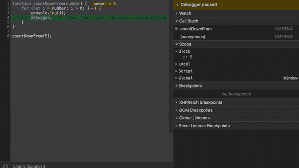
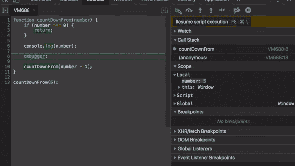

# Javascript 中递归的快速介绍

> 原文：<https://www.freecodecamp.org/news/quick-intro-to-recursion/>

该函数调用自己，直到有人停止它。

对于新开发人员来说，递归可能很难。也许这是因为许多资源使用算法示例(Fibonacci，链表)来教授它。这篇文章希望用一个简单的例子简单地介绍事情。

## 核心理念

递归是一个函数调用自己，直到有人停止它。如果没有人阻止它，那么它会永远**复发**(调用自己)。


递归函数允许您多次执行一个工作单元。这正是`for/while` loops 让我们完成的任务！然而，有时递归解决方案是解决问题的更好的方法。

## 倒计时功能

让我们创建一个从给定数字开始递减计数的函数。我们会像这样使用它。

```
countDownFrom(5);
// 5
// 4
// 3
// 2
// 1 
```

这是我们解决这个问题的算法。

1.  取一个名为`number`的参数。这是我们的起点。
2.  从`number`到`0`，一路上记录每一个。

我们将从`for`循环方法开始，然后将其与递归方法进行比较。

### 命令式方法(循环)

```
function countDownFrom(number) {
	for (let i = number; i > 0; i--) {
		console.log(i);
	}	
}

countDownFrom(5);
// 5
// 4
// 3
// 2
// 1 
```

这个包含了两个算法步骤。

1.  ✅取一个参数叫做`number`。
2.  ✅记录了从`number`到`0`所有事情。

### 递归方法

```
function countDownFrom(number) {
	if (number === 0) {
		return;
	}

    console.log(number);    
    countDownFrom(number - 1);
}

countDownFrom(5);
// 5
// 4
// 3
// 2
// 1 
```

这个也通过。

1.  ✅取一个参数叫做`number`。
2.  ✅记录了从`number`到`0`所有事情。

所以从概念上讲，这两种方法是一样的。然而，他们以不同的方式完成工作。

### 调试我们的必要解决方案

一个更直观的例子，让我们在我们的循环版本中放一个`debugger`并把它扔进 Chrome 开发者工具。

```
function countDownFrom(number) {
	for (let i = number; i > 0; i--) {
		console.log(i);
		debugger;
	}	
} 
```



看看它是如何使用一个额外的变量`i`来跟踪当前数字的？随着你的迭代`i`减少，最终达到`0`并终止。

在`for`循环中，我们指定了“如果`i > 0`则停止”。

### 调试我们的递归解决方案

```
function countDownFrom(number) {
	if (number === 0) {
		return;
	}

    console.log(number);

	debugger;

    countDownFrom(number - 1);
} 
```



递归版本不需要额外的变量来跟踪它的进程。注意函数堆(*调用栈*)是如何随着我们的递归而增长的？

这是因为对`countDownFrom`的每次调用都会添加到堆栈中，为`number - 1`提供数据。通过这样做，我们每次都在传递一个更新的`number`。不需要额外的状态！

这是两种方法的主要区别。

1.  迭代使用内部状态(用于计数的额外变量等)。
2.  递归不会，它只是在每次调用之间传递更新的参数。

但是这两个版本如何知道何时停止呢？

## 无限循环

在你的旅行中，你可能被警告过可怕的无限循环。

```
? THIS RUNS FOREVER, BE WARNED ?
while (true) { console.log('WHY DID YOU RUN THIS?!' }

? THIS RUNS FOREVER, BE WARNED ?
for (i = 0;;) { console.log('WHY DID YOU RUN THIS?!') } 
```

因为理论上它们会永远运行，无限循环将会中止你的程序，并可能使你的浏览器崩溃。您可以通过始终编码一个*停止条件*来防止它们。

```
✅ This does not run forever
x = 0;
while (x < 3) { console.log(x); x++; }

✅ This does not run forever
for (x = 0; x < 3; x++) { console.log(x); } 
```

在这两种情况下，我们记录`x`，增加它，当它变成`3`时停止。我们的`countDownFrom`函数也有类似的逻辑。

```
// Stop at 0
for (let i = number; i > 0; i--) 
```

同样，循环需要额外的状态来决定何时应该停止。这就是`x`和`i`的作用。

## 无限递归

递归也存在同样的危险。编写一个会让浏览器崩溃的自引用函数并不难。

```
?THIS RUNS FOREVER, BE WARNED?
function run() {
    console.log('running');
    run();
}

run();
// running
// running
// ... 
```


如果没有停止条件，`run`将永远调用自己。您可以用一个`if`语句来解决这个问题。

```
✅ This does not run forever

function run(x) {
    if (x === 3) return;

    console.log('running');
    run(x + 1);
}

run(0);
// running
// running
// running

// x is 3 now, we're done. 
```

### 基础案例

这就是所谓的**基础案例**——我们的递归`countDownFrom`有一个。

```
if (number === 0) {
    return;
} 
```

这和我们循环的停止逻辑是一样的。无论你选择哪种方法，都要记住在某个时候**需要停止**。


## 摘要

*   递归是函数调用自己，直到有人停止它。
*   可以用它来代替循环。
*   如果没有人阻止它，它将永远重复出现并使你的程序崩溃。
*   **基本情况**是停止递归的条件。别忘了加他们！
*   循环使用额外的状态变量进行跟踪和计数，而递归只使用提供的参数。


## 感谢阅读

更多类似的内容，请查看[https://yazeedb.com](https://yazeedb.com)。请告诉我你还想看什么！[我的 DM 在 Twitter 上是公开的。](https://twitter.com/yazeedBee)

下次见！