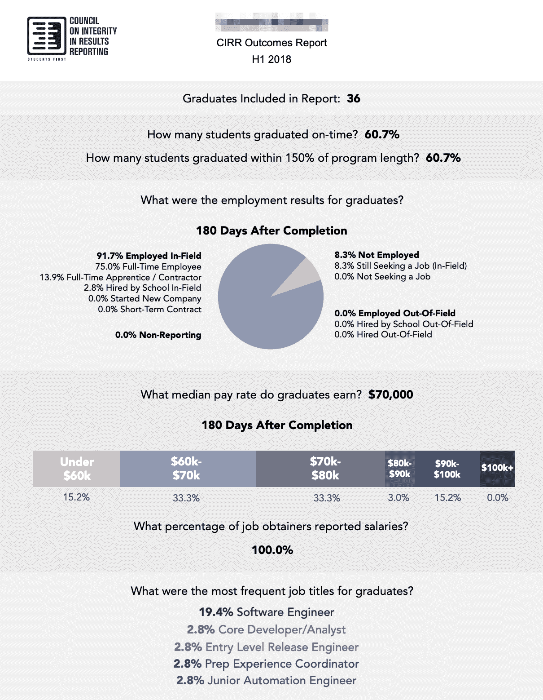
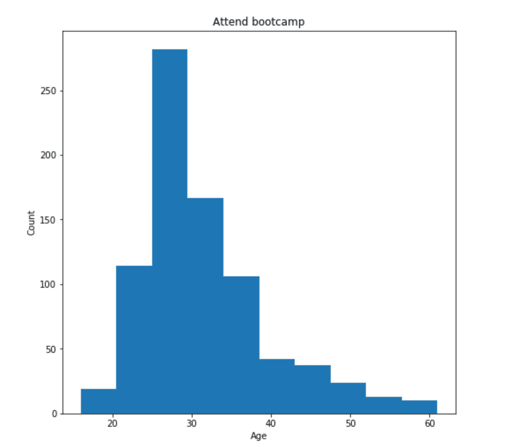
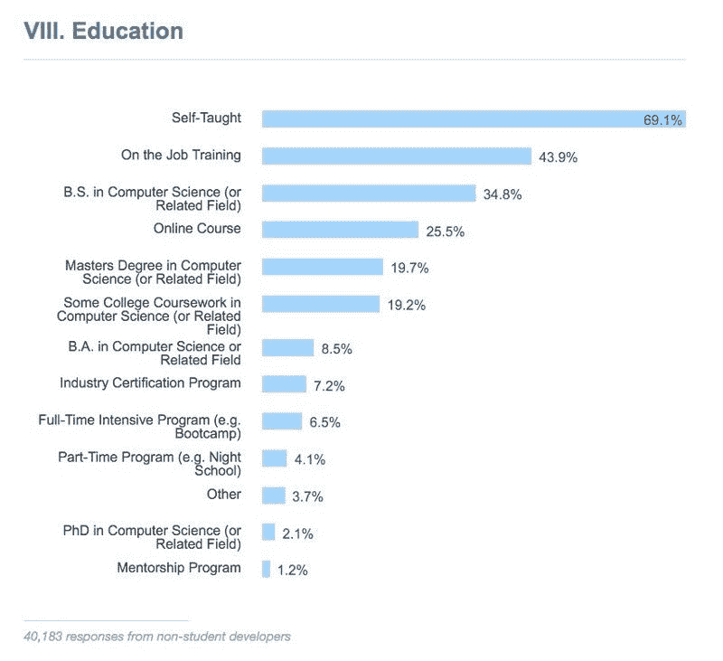

# 编码训练营手册:沉浸式工程项目讲解

> 原文：<https://www.freecodecamp.org/news/coding-bootcamp-handbook/>

在你花上几千美元和几个月的时间在一个编码训练营之前，花 30 分钟阅读这本手册。

# 这本手册是给谁的？

*   有人考虑参加训练营吗
*   任何考虑建立训练营或在其中教学的开发者
*   任何写训练营的记者

# 对于那些认为自己太忙而没有时间阅读这本手册的人来说...

我给你的建议可以归结为:做你的研究。

先申请大量的开发人员职位。经历一些工作面试。你可能不需要参加训练营就能得到一份开发者的工作。

不要盲目相信训练营的推荐或就业统计。使用 LinkedIn 直接联系他们的校友。

做好准备。确保你有足够的钱。如果你准备好入学，确保你有足够的现金支付学费。确保你有足够的现金在训练营期间生存，以及在你申请工作的 6 个月之后。

训练营不是魔法。训练营只能帮助你做好准备。*你*什么都要学。*你*必须通过开发人员面试流程。你必须投入工作。

# 关于客观性的一点注记

我尽可能客观地设计了这本手册。为此，我没有提到任何训练营或其创始人的名字。我没有链接到他们的任何网站。

我写这本手册不是为了帮助新兵训练营。我写这本手册是为了帮助你。

作为创建 freeCodeCamp 的老师，我处于一个独特的位置来写 bootcamps，原因有三:

1.  许多训练营使用 freeCodeCamp 进行课程设置和课程准备工作。我帮助指导过很多 bootcamp 的创始人如何让人们为开发职业做好准备。
2.  2010 年初，当训练营第一次出现时，我在旧金山学会了编程。我没有参加过训练营，但是我和很多训练营的创始人一起出去玩，并且参加了学生的“展示日”。
3.  在过去的三年里，我进行了重要的初步研究。我已经发布了几个数据集，包含了数千名训练营校友的反馈。

freeCodeCamp 的使命是帮助尽可能多的人学习编码。训练营帮助很多人实现了这个目标。所以他们在我们的任务中帮助 freeCodeCamp。

也就是说，freeCodeCamp 从未收到 bootcamps 的任何补偿。几家大型训练营连锁店已经就赞助事宜与我们进行了接洽。我们一直拒绝。

# 我为什么要写这本手册？

当你谷歌“编码训练营”或“编码训练营在[城市名称]”时，你会发现很多训练营评论网站。但是这些评论网站存在一些根本性的问题。

首先，这些复习网站是由训练营自己赞助的。训练营支付广告费用。他们付费是为了在搜索结果中排名靠前。他们为“付费广告”博客文章、专栏和其他宣传付费。

这是利益冲突。

其次，这些网站上的许多评论都是被迫的。我听说过几个训练营的毕业生被迫离开正面评价的故事。在某些情况下，训练营让学生写评论作为一项强制性的课堂活动。

还有很多营销部门写的假评论。

不可能知道哪个训练营在按规则比赛，哪个训练营在作弊。所以这些评论网站所做的就是帮助骗子淹没更道德的训练营。

不要依赖那些充满可疑评论的网站，你应该自己思考。做出如此重要的决定没有捷径可走。

> “训练营质量的第一标志是它有多难进入。在线评论是完全和 100%游戏化的。就业安置统计也是无情的游戏。训练营唯一不可想象的是它有多难进入。”-在研究这本手册时，我采访过的一位前训练营经理

这本手册会给你一个框架，你可以用它来理解训练营是如何运作的。它将帮助你研究你的选择，规划你的第一份开发工作。

# 到底什么是训练营？


训练营是你学习全职编程的学校——通常是面对面的。

大多数训练营大约持续 12 周，尽管有些长达一年。

大多数训练营的费用在 10，000 到 20，000 美元之间。

一些训练营提供贷款——直接或者通过金融公司。

一些训练营提供“收入分享协议”，你不用预先支付，而是在几年内(通常为 2 年)支付一定比例的税前收入(通常为 17%)。这不是“免费的钱”——下面我会详细解释。

训练营的目标是让一教室从未从事过技术工作的人帮助他们获得第一份开发人员的工作。

那是一项艰巨的任务。这关系到一大笔钱。这就引出了下一个问题。

# 训练营真的有用吗？

在很多情况下，是的。每年，成千上万的 bootcamp 毕业生获得他们的第一份开发者工作。

> “最好的训练营把有原始能力的人培养成(轻度)有经验的程序员。他们在某些方面所做的大部分是选择，然后把人放进学习的高压锅里。”-我与之交谈过的前训练营经理

但是也有训练营的毕业生找不到开发人员的工作，最终回到他们过去的职业生涯。

成功归结于几个因素:

*   训练营是多么有选择性
*   老师们多有能力啊
*   以及训练营的管理者是关心他们的就业数据还是仅仅为了短期的经济利益。

大多数训练营不会公开分享他们的号码。这样做的训练营可能会使用非标准的衡量标准。这让你很难进行比较。

但是在新兵训练营中有一个日益增长的透明运动。他们相互施压，要求对方承担更多责任。

一些新兵训练营希望在政府被迫介入并为他们进行监管之前对行业进行自我监管。

训练营作为高中后教育的一种形式只存在了几年。它们还没有像学院和大学那样受到监管。即通过认证。

## 训练营被认可了吗？

简单的回答是不，他们没有被认可。

但是首先，认证意味着什么？为什么这对学院和大学如此重要？

在美国，大多数大学都是地区认证的。一些学术项目是国家认可的，比如英语预备学校。

这有两个主要原因:

*   被认可的学校可以帮助学生获得美国签证
*   被认可的学校可以帮助学生获得联邦助学金或联邦学生贷款

为了获得认证，学校必须接受独立教育者的审核。这些审计员挖掘档案，确保学校遵守所有法律。他们还确保学生毕业后能找到工作。

如果该校的毕业生不能在他们的专业领域找到工作，这就是一个危险信号。这所学校可能会失去认证。

你可能听说过“文凭作坊”这个术语。这些学院和大学已经失去了他们的认证(或者从一开始就没有获得认证)。他们卖毫无价值的课程和毫无价值的文凭。

在美国，公立大学由政府管理。这些是被认可的。大多数私立大学都是由非盈利组织管理的，通常是由宗教组织管理的。这些通常也是被认可的。

但是还有第三类大学:私立营利性大学。这就是事情变得有点粗略的地方。这些大学中有些是经过认证的，但有些不是。

这些私立营利性大学在深夜电视上做大量广告，并购买大量脸书广告。他们哄骗不谙世事的学生入学。

> "傻瓜和他的钱是分不开的."约翰·布里奇斯博士，早在 1587 年

在某些情况下，这些学校有资格获得联邦学生贷款、GI 法案和其他形式的政府援助。

说白了，这些私立营利性大学大部分都是骗局。美国政府正在慢慢关闭它们。但是许多人还是会被他们的营销所迷惑，最终背负数千美元的债务，拿着一个毫无价值的学位。

即便如此，这些骗局的消息传播得很慢。甚至当一所学校听起来好得不真实时，人们仍然愿意相信。

这将我们带回编码训练营。

如果没有某种形式的认证，一些关注短期财务收益而不是训练营模式的长期健康的训练营可以乘着训练营受欢迎的浪潮。他们可以在为学生提供低于标准的成绩的同时变得富有。

训练营认证系统可以帮助防止这种情况。

正如我提到的，大多数训练营没有获得认证的资源。或者他们存在的时间还不够长。这就是自我监管发挥作用的地方。

结果报告诚信委员会(CIRR)是 bootcamps 共同努力的结果，以人人都能理解的方式公开分享其毕业生的就业统计数据。



This is a standardized CIRR outcomes report for a bootcamp.

许多著名的训练营都是这项计划的一部分。但是一些著名的训练营没有参与或者已经停止分享他们的数据。

CIRR 训练营的成员资格和获得认证是两码事，但这是一个好的开始。

# 训练营的毕业生能拿到什么样的薪水？

根据公开数据，bootcamp 毕业生的起薪与其他入门级开发人员相同。这包括计算机科学专业的学生和其他自学编程的大学毕业生。

作为一名初级开发人员，决定你工资多少的最大因素是城市的生活成本。旧金山的初级开发人员的收入是美国中部初级开发人员的两倍。

如果一个训练营说他们的毕业生比其他训练营的毕业生起薪更高，这意味着他们的大多数毕业生在像旧金山这样更昂贵的城市找到了工作。

# bootcamp 毕业生需要多久才能找到工作？

这个要看训练营了。一些训练营有广泛的职业指导。其他人与当地行业关系密切，可以帮你安排工作面试。这两种方法都可以大大缩短你之后申请工作的时间。

训练营结束后的求职平均需要 6 个月。

# 训练营的完成率是多少？

大多数开始训练营的人会继续完成。

大多数好的训练营都是有选择性的。如果他们认为你不能在项目结束后找到一份开发人员的工作，他们就不会接受你。

训练营有短期的激励来接受你，这样他们就能拿到你的学费。但如果他们认为你会损害他们的就业统计数据，他们也有不接受你的长期动机。

也就是说，并不是所有的训练营都关心他们的就业数据。由于财务上的绝望，有些人可能专注于短期现金。(近年来，许多备受瞩目的训练营已经关闭。)

在某些情况下，训练营可能会在课程进行到一半时把学生踢出去。

如果训练营是一个“预付现金”的训练营，他们已经获得了招收你的短期利益。即使你表现不佳，尝试挽救你而不是给你退款也是有意义的。

这些新兵训练营仍然希望从你提升他们的就业数据中获得长期利益。但是这种利益比你交给他们的冰冷的现金更抽象。

另一方面，如果你表现不佳，工资扣发训练营(还记得那些收入共享协议)会有更大的动力把你踢出去。这是因为他们只会长期受益(未来 2 年你工资的 17%)。

此外，一些训练营的学生因为各种原因决定退出。这些可能和训练营本身无关，比如重大生活事件。

# 有多少人从训练营毕业却没有进入科技行业？

通常，当人们加入更具选择性的训练营时，他们已经花了很多时间编写代码，并且很快就能找到一份开发人员的工作。所以这些训练营的毕业生找不到工作的情况并不常见。

但是不管你的技能如何，找一份开发者的工作本来就很难。训练营可以在这个过程中帮助你，很多训练营都有职业顾问来帮助你。

即使是选择性训练营的毕业生，在获得满意的工作机会之前，也不得不申请数百个开发人员职位(并在数十家公司面试)，这并不罕见。

> “有时候人们投入了所有的工作，并且很有才华，但只是长期运气不佳。其他时候，许多人垃圾邮件点击求职申请工作板。这很少奏效。(到目前为止)最好的做法是建立行业联系，接触真实的人。然后在准备、找工作和推荐方面向其他开发者寻求帮助。内部推荐通常是最好的选择。”-在研究这本手册时，我和另一位前训练营经理交谈过

因此，在很多情况下，当人们无法过渡到科技行业时，这并不是训练营的错。有些人只是低估了找工作的过程有多艰难，在找到成功之前就放弃了。

# 有哪些类型的训练营？


一些训练营专注于特定的栈，比如 Ruby on Rails、Python / Django 或者 Java / Android。有些人甚至专注于特定的技术职业，比如用户体验设计。

但是从所有权结构的角度来考虑训练营更有帮助。他们的动机是什么？

## 私有的当地训练营

这些通常是由一个或多个当地开发商建立的。创始人可能会亲自教授一些课程。(这通常是好事。)

大多数训练营开始时都是像这样的本地拥有的单校区学校。

## 私营训练营连锁店

随着本土训练营的发展，他们的创始人可能会在其他城市开设更多的校园。

通过运营一个以上的校园，所有者获得了规模经济和范围经济的优势。他们可以将固定成本(如营销和课程)的负担分散到几所学校。

也就是说，很难在多个学校提供一致的质量。

我对潜在学生的建议是，把每个城市校区当作自己的学校。不要依赖训练营连锁店的整体声誉。相反，做你的研究。找到那个特定校园的校友，并对他们进行面试。

## 基于大学的训练营

大多数基于大学的训练营不是由学校自己管理的。它们由营利性教育公司经营。

大学与这些私人公司签订合同来经营训练营。这些训练营向大学支付一大笔费用来使用他们的教室空间，更重要的是，他们享有盛誉的名字。这是一种有争议的做法。

当你看一个基于大学的训练营时，不要依赖于大学本身的声誉。相反，做你自己的研究。

## 免费非营利训练营

非营利训练营类似于当地的营利性训练营。主要区别是这些没有利润激励。

传统的 501(c)(3)非营利组织没有所有权。没有人拥有股票。相反，它们归公众所有。

红十字会、无国界医生组织和自由代码营都是这样组建的。

一些训练营也使用这种结构。

一些非营利训练营是完全免费的。它们得到捐助者的支持，或通过政府赠款得到支持。

有几个这样的项目旨在对退伍军人和难民进行再培训。

## 免费营利性训练营

令人惊讶的是，有一些训练营是盈利的，但仍然是免费的。这些项目也不会用收入分享协议来装饰你的工资。

这些项目是有选择性的。他们可能要求申请人拥有博士学位或其他高等学位。

这些项目 100%从雇主那里赚钱。当雇主把你安排到他们的公司时，这个项目会向他们收取招聘费。这些招聘费用可能高达你第一年工资的 33%。

但是你作为学生什么都不交。你未来的雇主会为你支付训练营的费用。

### 在线训练营

我最后提到这些是因为它们是新的和实验性的。

让一个初学编程的学生在几个月内为他们的第一份工作做好准备是一回事。完全在网上做这个是另一回事。

“学习编码”风格的网站可以在线教你，因为它们是为长期使用而设计的。如果你每周在线练习几次编码，坚持一两年，你的技能会稳步提高。

但是在线训练营希望你在更短的时间内集中完成所有这些。

训练营的大部分价值来自于和其他学习者并肩坐在一起。你们互相帮助克服错误和失败的测试。你们一起建设项目。你形成人际关系。

所有这些都很难在这么短的时间内在网上完成。

公司提供在线训练营的主要原因很简单:利润更高。

*   公司不需要租用办公场所作为园区。
*   他们不必担心住房问题。
*   他们可以从世界各地聘请教练。这比在旧金山等地雇佣教师要便宜得多。
*   他们可以把学生一起扔进一个大聊天室，让他们在最少的监督下解决问题。

瞧，1/10 成本的编码训练营。很多在线训练营的收费仍然和现场训练营一样高。

因此，在你参加在线训练营之前，你应该加倍努力。看看你所在的城市是否有类似的亲临现场的选择。

# 什么样的人会去训练营？

各种各样的人都参加新兵训练营。

但最常见的人口统计数据是:

*   刚刚毕业的大学生，他们还没有进入劳动力市场，并且有能力再等 6 个月。
*   富有的职场人士，他们想换个行业，可以承受未来 6 个月不工作。

不太常见但仍然值得注意的是:

*   退伍军人转业再培训
*   那些失业并利用贷款资助训练营的人(或者正在签署“收入共享协议”)
*   高中生和大学生在暑假期间学习编程(并不打算在之后马上进入职场)

训练营学生的平均年龄是 28 岁，但是比这个年龄大得多的人参加训练营是很常见的。



A visualization of age data from freeCodeCamp New Coder Survey respondents who have attended coding bootcamps.

他们中的大多数至少有一位父母是大学毕业的。

他们中的大多数人在开始训练营之前已经自学了 6 个多月的代码。

大多数训练营的学生已经获得了大学学位——尽管通常不是计算机科学学位。

# 训练营适合我吗？

这归结于几个因素:

1.  你有多少时间
2.  你有多少钱
3.  你目前是否在工作
4.  你对编码有多少经验

让我们谈谈所有这些因素，从钱开始。

# 我能负担得起训练营吗？


如果有无限的时间和金钱，我给 100%的人的建议是:是的，去参加训练营。

但是既然时间和金钱都很有限，我们应该更详细地讨论这个问题。

## 训练营的学费是多少？

正如我们所讨论的，一些训练营是完全免费的，但这些并不代表这个领域。

大多数训练营的费用在 10，000 到 20，000 美元之间。程序越长，通常花费就越多。

一些训练营不需要你预先支付学费。相反，他们通过所谓的“收入共享协议”来装饰你未来的工资

## 什么是收入分享协议？

基本上，你和这些训练营签订合同。这些训练营然后与美国国税局密切合作。他们会计算出你到底赚了多少钱，然后在几年内(通常是两年)将你税前收入的一定比例(通常是 17%)作为装饰。

如果你在训练营的第一份工作年薪是 50，000 美元，这意味着你要支付:

```
($50,000 * 17% = $8,500) * 2 years = $17,000 total 
```

如果你的年薪是 8 万美元:

```
($80,000 * 17% = $13,600) * 2 years = $27,400 total 
```

如果你的年薪是 10 万美元:

```
($100,000 * 17% = $17,000) * 2 years = $34,000 total 
```

除非你每年至少挣 50，000 美元，否则大多数独立社会保障协议都不会生效。如果你连续五年的年收入低于 50，000 美元，这些 isa 将会消失，你不再欠任何东西。一些 isa 有一个“上限”，即你必须偿还的最大金额。

但要注意的是，ISAs 是一种新形式的债务。与其他形式的消费者债务(如学生贷款)不同，ISAs 存在于法律的灰色地带。

国际审计准则是“金融工程”的一种新形式。它们似乎是合法的，但这些都没有在法庭上得到验证。

也不清楚如果你拿出一个 ISA，然后 bootcamp 破产会发生什么。(这种情况经常发生——即使是大型训练营连锁店也是如此)。你无法控制谁获得你债务的所有权。还不清楚他们会有多积极地追求你来偿还他们。

所以，再次，**做你的研究**。

## 训练营期间的生活费用是多少？

你的生活费用将取决于训练营在哪个城市，以及那个城市的生活费用。

和父母住在中西部的家里？你的花费会比你搬到旧金山去租公寓低得多。

你应该存足够的钱让你度过训练营，再加上 6 个月。这样，你就有足够的时间找到合适的工作并兑现你的第一份薪水。

## 什么是“机会成本”？

机会成本是经济学中的一个概念，大致意思是“放弃的收益”。

要获得参加编码训练营的真实成本，你还应该考虑机会成本。

例:你目前月薪 3000 美元。你要搬到旧金山，在那里，光是租一间卧室，每月就要花费 2000 美元。你将参加为期 12 周的训练营，费用为 15，000 美元。

这里是你的真实成本，假设你还有 6 个月才能找到工作，兑现你的第一张工资支票:

```
Bootcamp Tuition: $15,000

Cost of Living: (9 months * $2,000) = $18,000

Opportunity Cost of Foregone Wages: (9 months * $3,000) = $27,000

True Economic Cost: ($15,000 + $18,000 + $27,000) = $60,000
```

如你所见，在这种情况下，编码训练营的学费只是真实成本的 1/4。

因此，帮助你在 4 个月内找到工作的 20，000 美元的训练营可能比帮助你在 6 个月内找到工作的 15，000 美元的训练营更便宜。也就是说，一旦你考虑到生活成本和机会成本。

教训很简单:不要过于纠结于训练营学费本身的编码成本。这只是真实成本的一部分。

# 我的编码技能对训练营来说足够好吗？


一个天真的答案可能是“去申请吧，看看你能不能进去。”

但是，让我们从训练营的激励机制来考虑。

对于编码训练营来说，有一个黄金地带:不要太初级，也不要太高级——刚刚好。

## 场景 1:你的技能对你来说太高级了，从训练营里学不到太多东西

如果你是一个强有力的候选人，训练营相信你之后会找到工作。他们唯一理智的决定就是接受你。即使他们认为你从他们的项目中学不到什么。

为什么？

*   训练营会给你学费的。
*   他们不需要教你太多。
*   然后当你找到工作后，你会提高他们的就业统计数据。

从他们的角度来看，他们应该录取你。

## 场景#2:你对编码太陌生，无法从训练营中获得太多

如果你是一个弱势的候选人，那就要看训练营的决策者了。他们关注的是长期还是短期？他们有多在乎自己的就业统计数据？

如果训练营着眼于长远，他们应该拒绝你。或者给你额外的课前作业，然后让你几个月后再来面试。

但是，在财务上苦苦挣扎的新兵训练营没有闲心去担心他们的就业数据。他们可能不会长期存在。他们理性的决定可能是无论如何都接受你——不管你是否准备好了。

> “从长远来看，我们都死了。”——约翰·梅纳德·凯恩斯 1923 年

也许你能随机应变，克服困难取得成功。也许你不知道。无论哪种方式，训练营都可以拿到学费，并能多维持几个月的偿付能力。

## 场景#3:你“刚刚好”

训练营在这种情况下应该会接受你，这对双方来说都是双赢。

但同样，你不知道这是哪种情况。这是你“刚刚好”的第三种情况吗？还是训练营只是说说而已？你实际上是在场景#1 还是场景#2？

所以训练营有强烈的动机接受你，即使你不适合。

这就是为什么我说“你就申请一下，看能不能考上”的做法很幼稚。

以下是我建议你做的。

## 第一步:花几个月时间自己学习编码。

尝试获得 freeCodeCamp 响应式网页设计认证。然后获得算法和数据结构认证。

这些将确保你理解基本原理。无论如何，许多编码训练营需要这些作为他们课前工作的一部分。

## 第二步:申请开发人员的工作。

你如何处理雇主的简历筛选和电话筛选？能不能提前到他们现场编码面试？如果是这样，你可能只是想继续申请工作。你可能不需要编码训练营。

## 第三步:申请编码训练营。

如果你已经做到了第三步，你现在可以自信地知道你已经掌握了一些基本技能。你知道你还没有准备好做一名开发人员。

你现在可以满怀信心地申请编码训练营了。你不会太高级。如果他们接受了你，你也可以相信你不是太初学者。

如果他们不接受你，你可以继续自学，以后再申请训练营。

# 我如何选择训练营？

首先要考虑的应该是:你所在的城市有编码训练营吗？如果是这样，我鼓励你去拜访他们，尽可能多地了解他们。

留在你现在的城市，可以降低你的生活成本。也可以减轻自己的压力。你不必花时间去买公寓或学习新的社区。你可以把时间花在编码上。

# 我需要为了我的训练营搬到旧金山吗？

你可能会想:“但是我不应该搬到旧金山去吗，那里有很多开发商？”

诚然，旧金山湾区——包括硅谷——是西半球的科技圣地。

旧金山是几个优秀训练营的所在地。它也有大量的雇主。以及一个由晚间科技活动、黑客马拉松、创业社区和招聘人员组成的庞大生态系统。

但是旧金山是一个昂贵、压力大的地方。我在那里做了 4 年的开发人员，我不打算很快搬回来。

需要记住的重要一点是:**无论你在世界的哪个角落，软件仍然是软件。**

你可以从大多数在技术领域工作了 5 到 10 年的有经验的开发人员那里学到很多东西。几乎和你从旧金山科技公司的精英开发人员那里学到的一样多。

(而最精英的开发者一年能赚几百万。无论如何，你可能找不到他们在训练营教书。)

# 训练营应该教授什么工具？


这听起来可能违背直觉，但我会直截了当地说出来。工具并不重要。

一些训练营教授 Ruby 和 Rails 或 Sinatra。尽管它们越来越不受欢迎，但对于新开发人员来说，它们仍然是很好的工具。

有些训练营用 Node.js 教授全栈 JavaScript，这是新项目最广泛使用的工具链。但是学起来可能有点难。

一些训练营教授 Python 和 Flask 或者 Django。有些教授。网络生态系统。有些人可能会直接使用 Android 和 Java 或 Kotlin 进行移动开发。有些接近 c 的金属。

同样，工具并不重要。重要的是你很好地学习了一套工具。

学习一套工具，并在概念层面上理解所有东西是如何组合在一起的。然后你可以很容易地学习新的工具。

您可以将您在编码训练营中学到的大部分内容总结为:

*   计算机科学基础
*   编程本身(大量的实践编码)
*   作为开发人员你需要的其他技能。比如软件开发方法，调试技术，测试，阅读文档。
*   了解工作申请流程本身。

所以不要因为“他们教 Rails，我想学 Node”或者“我想成为一名移动开发者”或者“我不想学前端开发”而拒绝训练营。

不管训练营教什么工具，你都会学到相同的基本知识。

# 训练营的记录有多重要？

如果一个训练营已经存在了几年，你应该密切关注他们的记录。

## 旧训练营

首先，了解训练营是否是结果报告诚信委员会的成员。如果不是，问他们为什么不是。

你应该询问他们的就业统计数据。如果他们不愿意给你看这些，或者不能分享过去一年的数据，那就是危险信号。

不管怎样，你应该在 LinkedIn 上找到他们的毕业生。联系他们，询问他们在那里的经历。

## 新开放的训练营

如果编码训练营是新的，那么可用的信息会少得多。你将不得不更多地依靠你的直觉。

询问训练营老师的名字。把它们放到 LinkedIn 上。

他们有过去的同伴吗？在 LinkedIn 上找到他们的毕业生，询问他们在那里的经历。

成为编码训练营的第一批学生之一是一项高风险/高回报的工作。

像所有的小企业一样，如果得不到支持，训练营可能会很快关闭。如果发生这种情况，你会发现自己在用过去式向未来的雇主解释学校。尴尬。

但与此同时，新的编码训练营需要证明一些东西。他们的老师和员工会拼命工作以确保学校成功。他们会尽最大努力训练你。他们会帮你找到一份好工作，这样他们就能赢得一次胜利，并登上他们的推荐页。

面对稀疏的数据，你需要自己决定。管理训练营的人看起来知道他们在做什么吗？他们对此有热情吗？

# 我应该在入学前参观校园吗？

是的。当你把生活成本和机会成本考虑在内时，你将要做一个决定，这个决定将花费你几万美元和几个月的时间。

无论如何，请预订航班。即使你只是飞来一日游。与老师和员工交谈。查看学校。观察学生。

这是一个重要的决定。总的来说，这次旅行是你时间和金钱的一个小投资。

# 我应该联系过去的校友吗？

答案永远是肯定的。不要跳过这一步。

在 LinkedIn 上找到他们。如果几天后他们没有回复你的 LinkedIn 信息，找到他们的电子邮件或在 Twitter 上给他们发信息。看看能不能打电话找到他们。

请他们尽可能坦诚。向他们保证，他们与你分享的一切都会保密。

告诉他们你的情况。告诉他们这个决定对你有多重要。

我建议像这样接触几个校友。

这是训练营研究过程中最困难的部分。你可能在想“我是一个内向的人。”或者“我不想打扰这些忙碌的人。”

但这些人是你一年后的位置。他们是你能从这个训练营中得到什么的最好窗口。

如果你最终去了训练营，这些人会成为你的校友。这是一个让他们成为你导师的机会。

# 有免费的训练营吗？

有很多方法可以让你免费学习编码。其中一些已经存在了几十年，比如你当地图书馆的计算机部分。

其他免费资源可以帮助一个有积极性的新手提升他们的技能，并被聘为开发人员。

大多数开发人员认为自己至少是部分自学的。他们使用了各种各样的学习资源。



A chart from Stack Overflow's annual developer survey.

## 什么是代码学习网站？

有些网站可以让你学习如何在浏览器中编写代码。其中一些——像 freeCodeCamp——是完全免费的。

一些学习编码的网站需要花钱。但是你可以通过当地的图书馆免费使用它们。

这些网站涵盖了许多与编码训练营相同的概念和工具。

训练营注重高接触的面对面指导。他们经营着一个有教室和教师的校园。

相比之下，学习编码网站使用教学设计来大规模廉价地教授人们。

这些学习代码的网站有论坛，甚至可能有本地学习小组。

尽管如此，许多人更喜欢训练营提供的传统课堂环境。

## 什么是「海量开放网络课程」？

大规模开放在线课程(MOOCs)是通常由大学教授教授的免费课程。这些倾向于以讲座为基础，可能有家庭作业或考试。

MOOCs 在 2012 年开始流行，至今仍是学习概念的绝佳方式。有数百门关于编程和计算机科学的 MOOCs 其中许多是自定进度的。

其中一些 MOOCs 也提供认证，尽管你可能需要付费。

这里要注意的重要一点是，你可以在方便的时候学习几乎任何话题——直接从世界级的教授那里。

当你考虑付费学习资源的时候，一定要记住这个事实。他们有很高的门槛来证明他们的成本。

## 有免费的编码教材吗？

有成千上万的免费编程和计算机科学教科书。其中许多是知识共享许可，甚至是公共领域。

开发人员也出售他们决定免费提供的书籍。

此外，一些开发者免费发布他们书籍的数字版本，并出售纸质版本。

# 有哪些付费训练营可供选择？

当然，如果你有钱，你可以用它。有各种各样的职业培训可供选择。

## 我应该回到大学吗？

如果你已经有了大学学位，你可能就不应该再回大学了。

是的，计算机科学项目有硕士学位。但是这些是为已经工作的开发人员设计的，以进一步扩展他们的技能。

我不建议报读本科计算机专业去做第二学士学位。这需要数年的额外学习。大多数本科计算机科学项目更注重数学和概念知识，而不是动手编程。

编码训练营是获得编码实践的一种更快的方式。它们可以帮助您建立作为开发人员工作所需的概念基线。

## 夜校课程能帮助我学习编码吗？

你也许能在你的社区找到一个帮助成年人在晚上学习电脑技能的项目。

查看当地的社区大学、图书馆和成人教育项目。看他们有没有教软件开发课程。

要知道，这些项目中有许多侧重于更基本的计算机技能。你可能不需要操作系统、电子表格或打字课程。

在你注册任何课程之前，问问他们关于现在从事开发工作的校友的情况。如果他们什么都不能提供，那么这个程序对你来说可能太基础了。

## 我可以请一个家教来帮我吗？

有些开发者会在一旁做家教。你可以在网上分类广告列表中找到它们。

也有专门给学生和在线导师配对的网站。

这可能相当昂贵。但是如果你能够自己学习编码，这可能是一个不错的选择。你只需支付训练营的一小部分费用，就能获得每周辅导课的好处。

# 训练营的未来是什么？

第一批编码训练营成立不到十年。这还是一个年轻的行业。

也就是说，行业正在整合。几家训练营连锁店已经被传统的营利性教育公司收购。教科书公司、营利性大学系统，甚至还有一家合作的太空创业公司。

一些编码训练营连锁店已经倒闭了。

但是这些失败并不代表编码 bootcamp 模型中的根本缺陷。有数百个训练营仍然很强大。开发者一直在开设新的训练营。

但是经营训练营的钱比资助学生贷款的钱要少。这也是我们看到创新最多的地方——在“金融工程”领域

> “对货币的研究是经济学中最重要的领域，在这个领域中，复杂性被用来掩盖真相或回避真相，而不是揭示真相。”-哈佛大学教授约翰·肯尼思·加尔布雷思，1975 年

很难预测训练营会发生什么。这里有几个可能的方向，其中一些对学生来说不那么积极。

## 去训练营会像去大学一样普遍吗？

以目前的形式，训练营不能替代大学教育。它们是对它的补充。

大多数训练营的学生已经大学毕业。他们正处于职业生涯的中期，正在参加训练营学习新技能。

大学涵盖了训练营范围之外的很多东西。从英语作文到历史到数学，无所不包。

编码训练营包括-良好的编码。他们还涉及一些计算机科学概念和职场软技能。

如果你把训练营本身视为大学的一种选择，那是一个巨大的危险信号。

我们有几个世纪的大学数据。我们知道它们在增加你一生收入方面有多有效。一个专业合适的学士学位可以让你的赚钱能力翻两三倍。

编码训练营是新的。数据不多。关于没有完成大学学业的训练营毕业生的数据就更少了。

不要把编码训练营看作是大学的替代品，而是职业学院的替代品。

如果你无论如何都不打算去上大学，训练营总比什么都没有好。你将学到的技能可能比传统的职业学校更有意义。

在未来，编码训练营可能真的会成为更多人高中毕业后直接去的地方。

但是我们首先需要更多的疗效数据。我不会把我的孩子送去训练营而不是大学，我也强烈要求你保持同样的谨慎。

顺便说一句，如果你还在上高中，正在读这篇文章，我给你的建议是:去你能负担得起的最好的大学，不需要学生贷款。

在你申请学生贷款之前，调查一下社区大学。还有认证的超低价大学项目。你可以在工作的时候在网上做这些事情。一如既往，不要相信他们的营销，自己做研究。

## 训练营最终有资格获得联邦学生贷款吗？

训练营很贵。能上得起的人不多。

训练营可能会像大学一样尝试补救。通过游说联邦政府。

训练营可能会成功打开政府的金库。这可以是补贴学生贷款的形式。训练营也可能针对美国退伍军人法案和其他旨在帮助人们大学毕业的项目。

美国人持有 1.5 万亿美元的学生贷款债务。那可是一百万美元。这相当于美国每个男人、女人和孩子 16000 美元。学生贷款债务是美国年轻人买不起房子的主要原因。

我们应该让训练营产生更多的学生债务吗？

这对消费者来说将是一场灾难。

但这并不意味着它不会发生。

看看现在谁在掌管美国教育部。任何事情都是可能的，不管从长远来看会有多大的损害。

有一个替代金融复杂性的方法。训练营可以找到新的方法，让支付现金的人更加负担得起。

## 训练营会合并成几个大的连锁店吗？

这在一定程度上已经发生了。

训练营可以通过将固定成本分散到多个校区来节省资金。他们获得了规模经济和范围经济。

但是这些好处的回报是递减的。其中一些连锁店已经停业。其他的——不再能够独立运营——被教育集团收购。

任何行动都有一个合适的规模。尚不清楚编码训练营链的合适大小。

一些最好的训练营只有一个位置。其他学校能够在多个校区保持高质量。他们的成功很大程度上归因于他们的领导能力。

## bootcamp 模式会不会蔓延到法律、会计之类的非编码领域？

软件开发是一个独特的职业。它不受监管机构的约束。

其他领域有官僚机构将人们拒之门外。例如，在美国:

*   要成为一名律师，你必须经过 4 年的大学教育，3 年的法学院教育，然后通过你所在州的律师考试获得美国律师协会的认证。
*   要成为一名会计师，你必须经历 4 年的大学生活，参加一堆研究生水平的课程，通过一系列漫长的考试获得美国注册会计师协会的认证，然后做一年的低薪学徒。
*   要成为一名医生，你必须经历 4 年大学，4 年医学院，然后做 3 到 7 年的低薪“住院医生”，然后通过你所在州的委员会认证考试获得美国医学协会的认证。

如果没有重大的改变，训练营将无法在这些受到严格监管的领域工作。

## 训练营会和传统的大学项目合并，创造一种新的学校吗？

已经有一些项目从大学和训练营中获得灵感。

这话说的，大部分大牌大学都有几百年历史了。转变到一个更短的学习周期对他们来说很难做到。然而，更奇怪的事情发生了。

更有可能的情况是:训练营(以及他们的营利性教育集团母公司)收购被认证的大学并重新命名。这样，他们可以跳过自己获得认证的漫长过程。

声明一下，我反对把大学项目和编码训练营混在一起。这是为两组不同的学习者设计的两种不同的教育模式。

相反，我们需要新型的教育机构。最好是低成本的，更强调终身教育和在职培训。

想象一下，有一所不间断实习的学校，你在那里从事你想要的领域的工作。你有足够的钱生活，而不需要负债。

欧洲已经有类似的项目。在美国，我们可以做梦，不是吗？

# 你最后的建议是什么？

您的开发人员求职将归结为 3 件事:

1.  你的技能
2.  你的名声
3.  你的网络

不要犯只关注其中一两个的错误。思考一下你可以同时构建这三者的方法。

去训练营可能是你做过的最好的决定。或者这可能是一个尴尬的财务挫折。

做你的研究。把你的钱存起来。先学习编码基础。

训练营不是魔法。他们不会为你做这项工作。

最终，经历是你自己创造的。所以要充分利用它。