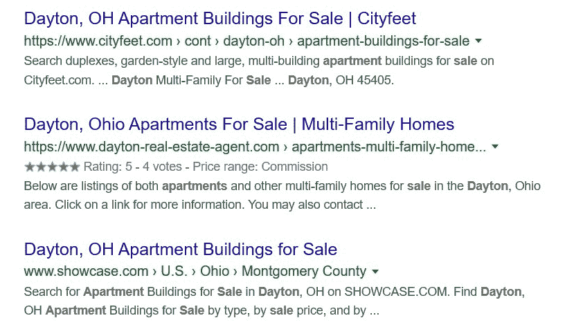

# 为什么使用结构化数据有助于网站的搜索引擎优化

> 原文：<https://www.freecodecamp.org/news/using-structured-data-helps-your-websites-seo/>

对于一个新开发人员来说，没有什么比获得第一批客户更令人兴奋的了。将一个人的新编码知识应用到工作中的想法是令人兴奋的。

不过，有一件重要的事情需要记住，尤其是如果你的客户是一些与公众打交道的小型企业(如餐馆、面包店等)。需要记住的是，客户可能不关心 HTML、CSS 或 JavaScript。他们关心网站在搜索中的表现是否良好，以及客户是否会因此进入他们的业务。

这意味着你需要用搜索引擎优化(SEO)来建立网站。最近在搜索引擎优化领域的一个较大的发展是谷歌在其网站分析中越来越多地使用“结构化数据”。这种趋势使我决定写这篇关于结构化数据在各种 web 项目中的使用的文章。

我将把这次讨论分成四个部分。我将深入研究的领域包括:

1.什么是结构化数据，谷歌为什么关心它？

2.如何在网站中使用结构化数据？

3.如何在网站启动后测试您的结构化数据并监控错误。

4.需要在网站启动后保持结构化数据的更新。

这是一次重要的讨论。我发现很多很多很多自称是 web 开发人员的人实际上对 SEO 了解不多(如果有的话)。

我还发现，许多自称协助 SEO 的人实际上对 web 开发一无所知(通常几乎不会编码)。

真正会编码的人，以及了解搜索引擎在寻找什么的人，可以为他们的客户提供大量的价值。这个价值反过来帮助你作为开发者赚更多的钱。换句话说，将对 SEO 的理解与你新学到的 web 开发技能结合起来，可以帮助你从看起来像这样:


变成这样:


所以让我们开始讨论为什么结构化数据对网站的 SEO 很重要。

### 什么是结构化数据，谷歌为什么关心它？

结构化数据是一种可以应用于网站内容的标记形式。这种标记允许您向搜索引擎提供关于您的网页及其包含的信息。

这种标记很重要，因为搜索引擎在理解自然语言方面越来越好，但在理解网页中包含的措辞或其他内容方面却很吃力。

例如，如果有人正在搜索“帮助投资的专业人士”，搜索引擎可能很难区分属于投资经理的网站和讨论如何选择投资经理的网站(这是一个非常一般化的例子)。

通过使用结构化数据，你可以帮助谷歌知道你的网站实际上属于一个投资经理。

结构化数据的另一个目的是帮助搜索引擎识别谁是网络上的谁。例如，假设你在为一个政治候选人做网站。这位候选人除了有一个官方的竞选网站外，还有一个脸书的官方竞选网页。

出于显而易见的原因，可能会有人在脸书主页上发布关于候选人的虚假信息。通过在网站中包含特定的结构化数据，您可以在脸书官方页面和活动网站之间创建关系链接。这有助于搜索引擎知道哪个脸书页面是合法的，哪个是伪造的。

大约十年来，谷歌一直致力于确定谁是谁。这始于他们现已倒闭的社交网络 Google+(你知道…..你可能尝试过但你的朋友都不在的那个社交网络)。

回到本世纪初，如果一个网站包含一个指向 Google+个人资料的链接，并且该链接包含“rel=author”属性，则该链接会通知 Google 该网站属于 Google+个人资料的持有者。正如谷歌的一名高管在 2013 年的视频中解释的那样，这是谷歌打算在搜索领域逐步推进的事情:

[https://www.youtube.com/embed/3QlY8ba0jYI?feature=oembed](https://www.youtube.com/embed/3QlY8ba0jYI?feature=oembed)

谷歌在 2014 年 8 月放弃了这种方法，主要是因为 Google+的挣扎。从那时起，谷歌就越来越重视结构化数据，将其作为一种在搜索结果中标注信息和识别网络上谁是谁的方式。

因此，简而言之，结构化数据是你应该包括在内的东西，以增加你为客户建立的任何网站的价值。

### 如何在网站中使用结构化数据

结构化数据有多种用途。除了使用它来帮助识别个人或实体经营的网站，你可以使用它来帮助谷歌更好地理解一个页面的内容。

例如，如果您已经为一家面包店建立了一个网站，那么您可以使用不同类型的标记来突出企业的好评、突出即将发生的事件等等。这种标记可以在搜索结果中突出显示，这反过来会让你的客户(面包店老板)高兴。

让我们看几个现实生活中的例子，使用我最近建立的一个房地产代理网站(我包括了链接，以防你想看一下代码)。

我为其建立网站的房地产经纪人专注于与投资者打交道。该网站包括结构化数据，通知谷歌该网站属于一个实际的房地产经纪人。当我在谷歌上搜索“Dayton realtor for investors”时，我得到的前三个自然结果如下图所示:


第一个结果是我建的网站。后两个网站并不属于真正的房地产经纪人，尽管这是我用搜索词明确寻找的。事实上，只有一个其他的房地产经纪人网站出现在搜索结果的第一页。现在，我不是说这完全是由于结构化数据，但它肯定有所帮助。

用于结构化数据的标记由[Schema.org](https://schema.org/)生成/管理。当你标记一个网站、一个页面、一个事件或一个产品时，为了给搜索引擎提供相关信息，尽可能合理地使用*尽可能多的标记是很重要的。*

Schema.org 的网站经常提供你的标记应该是什么样子的例子。我为 realtor 站点使用的标记的开始包括通过在一个

中放置以下内容来通知 Google 该站点属于一个房地产代理:

```
<itemscope itemtype=http://schema.org/RealEstateAgent>
```

这告诉搜索引擎，我依靠模式的标记来识别和描述站点，并且该站点属于一个房地产代理，如模式[在这里](https://schema.org/RealEstateAgent)所定义的。

我还能够使用结构化数据告诉谷歌，这个房地产经纪人有很好的在线评论，他们的工作是收取佣金的。这反过来又会出现在搜索结果中。

例如，当我寻找[待售的](https://www.dayton-real-estate-agent.com/apartments-multi-family-homes-for-sale/)代顿公寓时，以下链接的页面位于搜索的第一页。(再次声明，如果您想查看该网站的源代码，我会提供这个链接)。



请注意，搜索结果包括这样一个事实:这是一个五星级的房地产经纪人，专业工作的佣金？换句话说，使用结构化数据有助于网站在搜索结果中更加突出。此信息已通过以下标记添加到网站中:

```
<div itemprop="aggregateRating" itemscope itemtype="http://schema.org/AggregateRating">
Rated <span itemprop="ratingValue">Actual Rating of Realtor</span> out of <span itemprop="bestRating">Highest Possible Rating of Realtor</span> by <span itemprop="ratingCount">Number of Total Reviews</span> clients at <a href="URL of Website Where Reviews Are Located" target="_blank" rel="noopener">Name of Website Where Reviews Are Located</a>
Fee Structure: <span itemprop="priceRange">Commission</span>
</div>
```

弄清楚在站点或特定页面上使用什么样的结构化数据可能很困难。幸运的是，Google 提供了一些工具来帮助解决这个问题。让我们在本文的下一节看看这些工具。

### 测试您的结构化数据，并在您的网站启动后对其进行监控

将结构化数据添加到内容中的第一步是找出它所属的类别。你可以通过研究 Schema.org 网站、查看其他网站的数据或者两者结合来做到这一点。一旦你找到你所属的类别，剩下的就很容易了。让我们继续上面的房地产代理的例子。

第一步是从 Schema 站点添加 realtor 标记。然后将你的网址输入到[谷歌的结构化数据测试工具](https://search.google.com/structured-data/testing-tool)中。该工具将告诉你在你的网站上发现了什么结构化数据，你可能有什么错误，以及什么结构化数据是你所选择的类别的“建议”。一旦你开始使用这个工具，你会发现确保你在网站上有正确的信息变得相当简单和直接。

此外，我非常依赖 Schema 为各种类别和数据类型提供的示例。使用谷歌的测试工具可以帮助你确保你的网站从一开始就有正确的数据。

另一个监控错误的重要工具是谷歌搜索控制台。这是另一个开发者工具，来自谷歌，它会让你知道当结构化数据错误出现在你的网站上。这是一个非常有用的工具，如果你正在持续支持你的客户的网站，在发布之后，你需要用它来监控事情。

### 在网站启动后保持结构化数据最新的需求

在网站启动后，您可能需要返回并编辑网站的旧结构化数据，了解这一点很重要。这是因为，像许多其他事情一样，结构化数据的标准会随着时间而变化。举个例子，作为我主要业务的一部分，我为律师事务所建立和维护网站。根据以前的结构化数据标准，这些网站标记有以下内容:

然而，在后来对结构化数据标准的修订中，“律师”分类被弃用，并被改为“法律服务”——因此，我必须更改我管理的每个网站上的标记。我告诉你这些是因为意识到这些标准经常改变是很重要的。跟上变化是很重要的。

### 结论

Web 结果变得越来越丰富，因为它们提供的信息不仅仅是指向网站的链接。对你的客户来说，相应地标记你的页面是很重要的。这样做对你的 SEO 工作和为你的客户提供价值是很重要的。这就是为什么在项目中包含结构化数据很重要。

### 关于我

我是一名 web 开发人员，主要为律师事务所提供各种类型的服务。我也是[现代网站设计](https://www.modern-website.design/)的联合创始人。我喜欢写一些帮助自由开发者和小企业增加收入的文章。