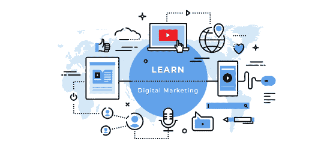

# 如何通过数字营销增加你的自由职业收入

> 原文：<https://www.freecodecamp.org/news/digital-marketing/>

这是一个很大的话题，我们可以有很多方法来解决，但我只想在这里介绍一些要点，并使它简单、实用，便于理解和实现。

我不打算在这里花言巧语。我想试着解释一切，以便大多数人能更好地理解这个话题。

在这篇文章结束时，我的目标是让你看到数字营销的潜力，以及它如何通过与网页设计和开发相结合来帮助你的自由职业生涯。

### 什么是数字营销？

数字营销的最终目标是向正确的目标受众推广产品/服务/品牌，以达到预期的行动目的，如认知、销售、免费下载等。

为了简单起见，简单概括一下，数字营销包括:

****AdWords****——在谷歌搜索结果上投放广告的平台。

****SEO****——在谷歌搜索结果中提高网站排名的过程。

****网络广告****——脸书广告、LinkedIn 广告、网站广告等。

****内容写作****——为企业撰写常规文章——通常带有 SEO 意图。

****社交媒体****——创建相关的社交帖子，为网站带来流量。

### 为什么数字营销很重要？

大多数自由开发人员的月收入都会经历“低谷”和“高峰”。

所以，一个月他们可能赚了一大笔钱，下个月他们可能就不赚不赔了。

*   数字营销技巧可以帮助你保持更稳定的收入，因此你可以更有效地做预算，并且你可以安心睡觉，因为你知道下个月你不需要从 0 美元开始。
*   数字营销让你在一个蓬勃发展的行业中拥有宝贵的技能。
*   数字营销帮助您向客户提供更完整的解决方案。
*   数字营销为你提供了更多创建有效网站的知识。
*   数字营销技巧帮助你创造一个更好的个人品牌，这打开了许多大门。
*   数字营销为您提供了创建自己的产品并在网上有效营销的知识，从而增加了您成功的机会。
*   数字营销帮助你从那些刚创建网站的商品营销中脱颖而出。

最好的收入类型是被动收入，你不需要工作，或者只需要很少的努力就可以维持。

但是第二好的收入是什么？

经常性的、可预测的收入。

我经常与自由职业者交谈，他们中的许多人收入很高，但这只会持续很短时间，然后他们的收入就会大幅下降。

那么解决办法是什么呢？

经常性的、可预测的收入。

将你的网页设计技能与数字营销服务捆绑在一起有助于你实现这一目标。

这不仅有助于你每月获得更可预测的收入，而且如果你创建了有效的网站，并为企业创建了有效的数字营销活动，他们将有更多的成功机会。

如果你想一想为什么你会与客户合作，最终目标是让他们获得更多的销售，数字营销可以帮助你做到这一点。

### 你如何从数字营销中赚钱？

首先，你需要知识。

对于不懂 AdWords、SEO 等的人，我在文末推荐几个学习资源。

一旦你足够了解你感到自信的地方，你就准备好了。

我发现很多人非常犹豫要不要开始，因为他们要等到他们在某件事情上几乎完美的时候。

不要等到你成为某项技能的“尤达”。只要知道你不必感觉像是某种欺诈，那么是时候采取下一步行动了。

开始，失败，一路学习，适应；这是成功的关键。

****月入 1000 元明细:****

*   让一个客户每月付给你 1000 美元。
*   让两个客户每月付给你 500 美元。
*   让 4 个客户每月付给你 250 美元。

****月入 3000 元明细:****

*   让一个客户每月付给你 3000 美元。
*   让两个客户每月付给你 1500 美元。
*   让 3 个客户每月付给你 1000 美元。

根据您选择的选项，您的服务也可以进行调整。

你提供的每个月赚 1000 美元和 3000 美元的任务几乎是一样的。

唯一的区别是你将奉献给客户的时间。

因此，如果客户 A 每月付给你 1500 美元，而客户 B 每月付给你 250 美元，显然你会投入更多的时间，为客户 A 提供更全面的服务。

### 行动步骤:

1.  算算我每月想赚多少钱(以 5000 美元为例)。
2.  瞄准像太阳能电池板公司这样有竞争力的小众市场。
3.  创建一份行业分析报告，我在其中分析市场、竞争对手和网站。
4.  通过建立有效的在线形象，将自己定位为这个领域的专家。
5.  以每位客户 1250 美元的价格编制一份数字营销服务套餐，旨在提高太阳能电池板利基市场的销售额。(这可能是 web 开发改进、AdWords、内容营销、SEO、设计等。)
6.  签约 4 个客户，每个客户支付 1250 美元(每月 5000 美元)。

然后，我将为每个客户每天工作 2 小时，这相当于一整天的工作(8 小时)。

### 如何找到数字营销客户

事实是任何人都可以得到客户。

你其实不想要客户。

您希望 *****对***** 客户在持续的基础上为您支付大量的收入。

这样听起来更好吗？

那么，你如何得到这些客户呢？

考虑潜在客户的想法是很重要的。

你想为他们提供服务，但为什么呢？

就为了你能拿到钱去享受美好的假期？

当然不是…

企业想要盈利，他们想知道的是你如何帮助他们改善或发展业务。

我经常遇到投资组合网站…

这个人总是很快提到他们的技能以及他们在某项技能上的知识水平，但是他们的网站导航、颜色主题和布局很糟糕，他们仍然不明白为什么他们没有得到客户。

你是前端开发的专家吗？

非常好…

但是如果你的设计技巧、沟通技巧和缺乏最佳实践知识低于平均水平，那么你为什么认为你没有得到客户呢？

自省地看。从一个会告诉你真相的朋友或某人那里获得关于你技能的第二种意见。接受建设性的批评，看看你可以改进的地方。

为了创建这个主题的视觉类比，它很像这个场景:

你在一艘小皮艇上试图到达河的对岸。你的主要注意力集中在拿一把桨划到对岸，但你没有集中在固定皮艇内部的小洞，使它不会中途下沉。

获得客户是最重要的。

这个洞是你需要得到的一切。

先操心补洞，再用桨。

****信任/怀疑****

如果客户看不到你自己的网站看起来专业且经过深思熟虑，他们为什么要相信你可以创建一个有效的网站，并通过数字营销提高他们的在线形象呢？

如果你没有任何证明或客户成功案例，他们凭什么相信你能完成一个项目？

实际地考虑这个问题。

如果你想在网上购买蓝牙耳机，你遇到了一个看起来很差的网站，他们的社交媒体帐户只有 50 个关注者，而一个看起来很好的专业网站有数千个关注者，甚至价格高出 10%，你会从谁那里购买？

你更信任的那个人…

这和客户的想法没什么不同。

你可以创造信任，也可以创造怀疑。

问题是，对你来说，哪一个正在发生？

在你意识到信任的重要性后，你如何建立信任？

有两种主要方式:

1.  一个好的，专业的网站/组合设计
2.  客户评价

****网站组合:****

要创建一个有效的网站/作品集网站，你需要用不同于大多数网页设计者/开发者的方式来思考。

他们认为自己的作品集网站是某种形式的简历。他们像这样展示他们的技能:

HTML + CSS = 90%

搜索引擎优化= 80%

设计= 85%

等等。

他们中的一些人也写博客文章。好笑的是，这些文章都是关于 web 开发相关的话题。

这完全是错误的角度。

你的投资组合网站需要关注你如何为企业提供解决方案，它需要展示你的专业知识和技能，但要以对潜在客户有意义的方式展示。

这是一个以客户为中心的投资组合网站的大致轮廓:

这非常简单，但您会注意到它很有意义，主要重点是帮助客户的业务增长，然后获得报价请求。

这比基于“CV”的投资组合要好得多。

****奖状:****

要获得客户证明，你需要做以前的客户工作。

如果你以前没有做过任何客户工作呢？

很简单:免费工作以换取推荐。

很多人总是对免费工作有争议，他们写了很多关于为什么免费工作不好的文章，等等。首先，这不是你生命中的一年，其次，这是有效的。

什么更好？一个你找不到的付费客户，或者只是免费做两个好看的网站来换取推荐，从而说服其他潜在客户付钱给你？

一些免费网站的企业示例:

*   当地的非政府组织或慈善机构
*   小咖啡店或餐馆
*   当地的小企业
*   帮助朋友/家人的网站

在你打好这个基础之后，接下来就是真正获得客户了。

与普遍的看法相反，做到这一点确实需要努力。

如果您已经为以前/现有的客户做过工作，请向他们发送此电子邮件:

*你好【姓名】，*

我希望你一切都好。

我只是想知道您是否打算对[网站名称]进行其他更改，我可以为您提供帮助吗？

*谢谢，周末愉快* *J*

*问候，*

*【你的名字】*

*PS——如果你在商界有朋友需要一个网站，我希望你能帮我联系他们* *J*

如果您是从零开始，请执行以下操作:

1.  在谷歌上输入搜索词。比如说“威斯康辛州密尔沃基的园林设计师”
2.  你会注意到有 3 或 4 个广告在顶部，2 或 3 个在底部。
3.  点击这些广告，并注意以下几点:你登陆的页面和他们的整个网站。
4.  如果你发现你登陆的页面没有足够的说服力和清晰的行动号召(请求报价/打电话给我们)，那么这是个好消息。
5.  如果你注意到他们的网站制作得不好，那是好消息。
6.  现在是你给他们发邮件的时候了。

你可以发邮件给他们:

*嗨[姓名或公司名称]，*

最近，我在搜索了[您使用的搜索术语]后，偶然发现了您的网站。

我注意到你没有任何有效的行动号召，如联系表格或任何社交证明来建立信誉，帮助你获得更多感兴趣的销售线索。

我很乐意打电话讨论我如何通过有效的网页设计改变来帮助提高你的业务销售。

如果你有任何问题，请随时联系我。

关于我的专长的更多信息，这里是我的网站:[www.mywebsite.com]

谢谢您，我期待您的反馈。

*问候，*

*【你的名字】*

注意:如果你在黄页/在线目录中寻找海报广告，这个策略也是有效的。

其他常见且常被忽视的获得客户的方法有:

*   让你的家人朋友知道你现在制作网站，你可以使用数字营销来帮助营销网站。
*   参加当地的商业聚会(不是开发者聚会),因为这是你可以建立联系的地方。当你提到你帮助企业改善他们的网站，这样他们可以获得更多的销售，你会得到更多的兴趣，人们会说他们想和你聊聊他们的网站。

**专精找小生**

**这本身就是一个相当大的话题，所以这里有一个总结:**

**[微笑营销](https://www.smilemarketing.com/)——牙医网站设计和营销**

**[ChiroMox](http://www.chiromox.com/)–脊椎治疗师的网站设计和营销**

**[paper street](https://www.paperstreet.com/)–律师网站设计和营销**

**[golf web design](https://golfwebdesign.com/)–高尔夫球手的网站设计和营销**

**这些网站背后都有一个团队，以及一个客户等候名单，他们收取溢价。**

**他们为什么如此成功？**

**他们被视为专家，因为他们专攻一个领域。**

**这是否让你有所思考？**

**离开商品市场，进入大量客户群的唯一方法是，你要找到合适的位置。**

**通过为每一个商业领域创建网站来赚取高额收入要困难得多。**

******总结:******

1.  **建立更多信任**
2.  **修复你皮艇上的任何“洞”**
3.  **将自己定位为专家，并找到合适的位置**
4.  **战略性地接近你的领域内的人**
5.  **在你的领域不断成长和建立权威**

**向潜在客户展示这个不是很酷吗:**

*   **我帮助 XYZ 商业增加了他们的搜索引擎优化市场份额，在 8 个月内成为他们行业排名前 3 的网站。**
*   **我通过创建有效的 AdWords 活动并改进网站，帮助 XYZ 商业在 4 个月内增加了 57%的销售额。**
*   **在改进了登陆页面、搜索引擎优化和在线广告后，XYZ 商业收到的报价请求增加了 400%。**

**这比‘我创建网站’好多了——对吧？**

### **学习数字营销**

****

**有很多地方可以学习数字营销，但这些是我的建议:**

******看这些博客:******

**ViperChill.com**

**Backlinko.com**

**Gaps.com**

******如果你更喜欢课程，可以考虑投资这些:******

**[数字营销速成班](https://generalassemb.ly/education/digital-marketing?utm_medium=affiliate-lead-gen-global&utm_campaign=2017-q4-affiliate-lead-gen-[global]-study-web-development-affiliate&utm_source=study-web-development)**

**[数字营销电路](https://generalassemb.ly/education/learn-digital-marketing-online?utm_medium=affiliate-lead-gen-global&utm_campaign=2017-q4-affiliate-lead-gen-[global]-study-web-development-affiliate&utm_source=study-web-development)**

**[终极谷歌 AdWords 课程](https://click.linksynergy.com/deeplink?id=QqcN8lE0l0I&mid=39197&murl=https%3A%2F%2Fwww.udemy.com%2Fthe-ultimate-google-adwords-training-course%2F)**

**[完成 SEO 培训](https://click.linksynergy.com/deeplink?id=QqcN8lE0l0I&mid=39197&murl=https%3A%2F%2Fwww.udemy.com%2Fsearch-engine-optimization-for-beginners-seo-that-works%2F)**

**[社交媒体营销大师](https://click.linksynergy.com/deeplink?id=QqcN8lE0l0I&mid=39197&murl=https%3A%2F%2Fwww.udemy.com%2Fsocial-media-marketing-ads%2F)**

**[UX 设计电路](https://generalassemb.ly/education/learn-user-experience-design-online?utm_medium=affiliate-lead-gen-global&utm_campaign=2017-q4-affiliate-lead-gen-[global]-study-web-development-affiliate&utm_source=study-web-development)**

**我希望这篇文章对你有所帮助，你可以看到数字营销给你的自由职业生涯带来的不同:)**

**如果你想了解更多，可以看看我的[自由职业包](https://studywebdevelopment.com/freelancing.html)。**

**直到下一次，**

**狭海峡**