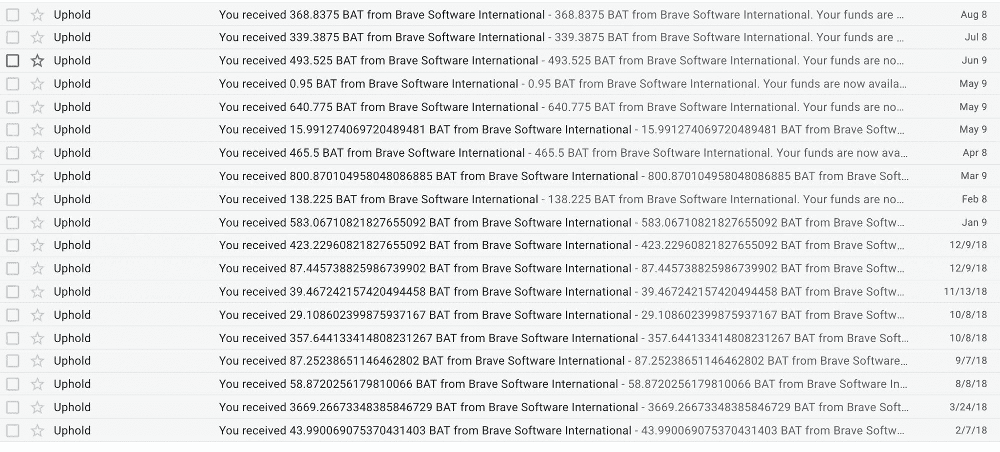
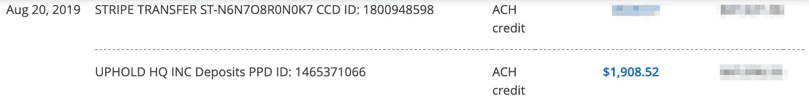
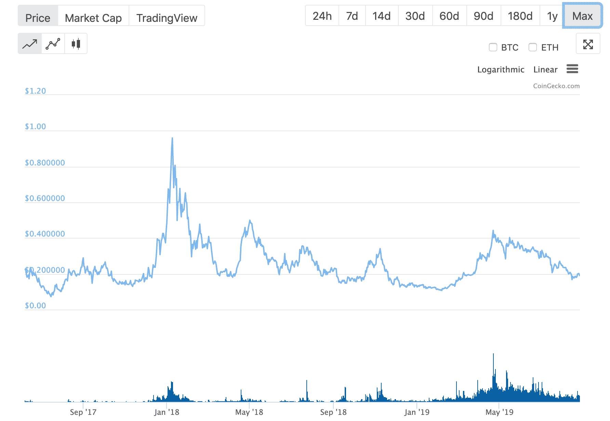

# 勇敢的浏览器:作为出版商，你的网站或 YouTube 频道能赚多少钱？

> 原文：<https://www.freecodecamp.org/news/the-brave-browser-how-much-money-can-your-website-make-as-a-publisher/>

在过去的 18 个月里，我们的非营利组织已经从使用勇敢浏览器访问 freeCodeCamp.org 的人们那里赚了近 2000 美元。

在这篇文章中，我将告诉你勇敢的浏览器，并展示它是如何工作的。

我还会帮你决定是否值得将你的网站或 YouTube 频道注册为勇敢的发布者。

如果你想注册，这样你就可以得到报酬，我也会告诉你怎么做。

Every transfer freeCodeCamp.org has gotten from Brave since we signed up as a publisher (1 BAT = US $0.20)

但首先，我想降低你的期望值。除非你有庞大的观众群，否则勇敢不太可能在你的收入中占很大比例。

从某些角度来看:

1.  freeCodeCamp.org 是访问量最大的 2000 个网站之一
2.  我们的受众主要是开发人员，他们比不太懂技术的受众更有可能使用 Brave 浏览器

换句话说，你的里程可能会有所不同。

# 关于我的客观性的简短说明

在任何人指责我利用我的影响力推高 Brave 的基本注意力令牌(BAT)加密货币的价值之前:在发表这篇文章之前，我们已经卖掉了 freeCodeCamp 的所有 BAT。

我们把它转到了 freeCodeCamp 的银行账户，这将帮助我们支付这个月的服务器费用。

对了，如果你想支持 freeCodeCamp，我推荐你[直接给我们](https://donate.freecodecamp.org)捐款。这是我们非营利组织绝大部分预算的来源。我们从 Brave 获得的资源当然有所帮助，但它们甚至不足以支付运营像我们这样的非营利组织的成本。

# 勇敢浏览器到底是什么？

Brave 是一款开源浏览器，内置广告拦截器。

Brave 是由 Brendan Eich 创建的，他也是在 1995 年创建 JavaScript 编程语言的开发人员。

Brave 背后的重要理念是，你可以通过浏览器直接向网站付费，而不是通过查看它们的横幅广告来支持网站。

它是这样工作的:

1.  你用钱买了 Brave 的基本注意力令牌(BAT)加密货币，那个 BAT 就进了你的 Brave 钱包。
2.  Brave 会记录你在每个网站或 YouTube 频道上花了多少时间。
3.  然后，Brave 将根据你使用网站和 YouTube 频道的时间来划分你的 BAT 和付费网站。

这意味着，你不用每月向你使用的几十个网站和 YouTube 频道进行小额个人捐款，你只需将钱存入 Brave 即可。Brave 会被动地为你分配这些钱。

Brave 还有手动“倾翻”功能。

# 勇敢怎么赚钱？

首先，你必须将你的网站或 YouTube 频道注册为发布者。你可以[在这里](https://publishers.basicattentiontoken.org)注册成为一名勇敢的发布者。

然后每个月，如果人们使用 Brave 浏览你的网站或观看你的视频，Brave 将通过一项名为 support 的服务向你发送他们的基本注意力令牌(BAT)加密货币。

为了从维护中实际提取蝙蝠(并将其转换为另一种货币)，您必须首先创建一个维护帐户。

请注意，这涉及到填写表格和共享大量敏感信息，如您的银行信息、社会保险号、您的 ID 和您的照片。

## 你怎么能尝试勇敢的浏览器本身呢？

Brave 是免费开源的。你不用付钱就可以使用它。

但是，如果你真的把钱放进了你的勇敢钱包，勇敢将与你访问的网站分享其中的 95%。(Brave 留 5%作为交易费)。

如果你使用这个链接安装 Brave，Brave 说他们会向 freeCodeCamp 捐赠 5 美元。Brave 相当含糊地说，为了让 freeCodeCamp.org 得到 5 美元，你必须“在 30 天内(最低限度地)使用浏览器”。所以我想每天至少用一点。

勇敢还有其他一些有趣的方面。例如，你可以自愿查看 Brave 自己的广告——这些广告比传统的广告网络广告更加匿名。勇敢者会付给你少量的基本注意力令牌来换取你的注意力。

Brave 将网站上更具侵入性的广告替换为他们自己更注重隐私的广告的做法仍然是一个有争议的问题。但它最终可能会迫使“广告技术”领域的一些最糟糕的演员变得不那么咄咄逼人。

## 勇敢有前途吗？

在过去的 2 年里，除了几个峰值之外，Brave 的 BAT 加密货币的价值一直在每令牌 0.2 美元左右:

我不认识在 Brave 工作的任何人，我也没有任何关于他们公司尚未公开的信息。

根据 Crunchbase 的说法，自 2017 年 6 月以来，Brave 一直没有筹集到任何资金，当时他们拥有历史上唯一成功的 ico 之一，在不到 30 秒的时间内出售了价值 3500 万美元的 BAT。

如果他们通过英美烟草和他们的业务赚了足够的钱，他们可能不需要筹集额外的资金。

如果说有什么不同的话，Brave 似乎正蓄势待发。谷歌计划从根本上扼杀广告拦截器 Chrome 扩展。这可能会导致更多的人转向内置广告拦截器的浏览器，如 Brave。

## 到目前为止，你的勇敢收入如何？

如果你曾经是一个勇敢的出版商，我鼓励你分享你的数字。到目前为止，你们从 Brave 赚了多少钱？

我希望这份指南对你有所帮助。快乐编码。