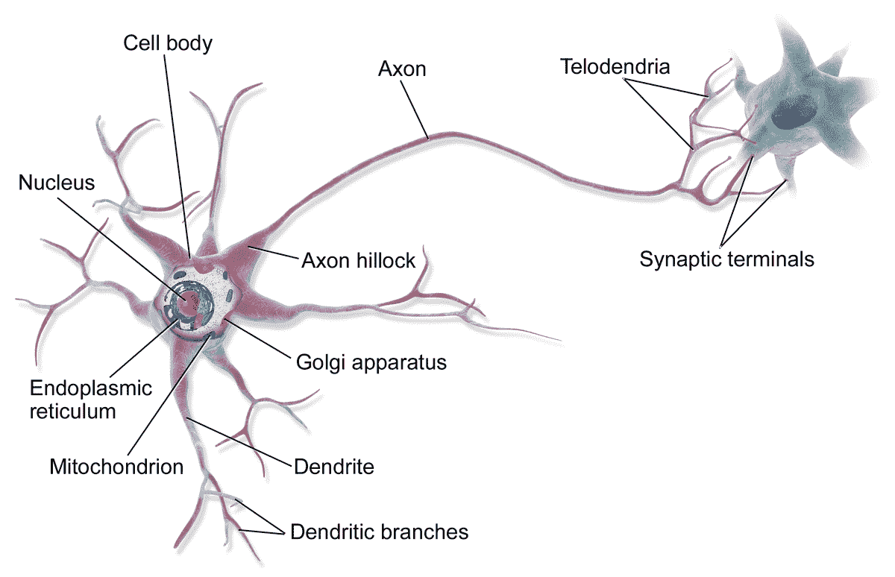

# 如何建立适应性学习系统

> 原文：<https://www.freecodecamp.org/news/adaptive-learning-systems/>

你有没有开始一门课程，却觉得太慢？还是太难了？希望你能让它跑得更快？感觉你没有得到足够的练习来掌握内容？适应性学习系统试图解决这些挑战。

在这篇文章中，我将介绍什么是适应性学习系统。我介绍了一些背景知识，解释了为什么适应性学习系统有这样的结构。我还将介绍几个适应性学习系统。然后，我将谈论适应性学习系统的四个要素，以及你如何自己设计一个。我们将总结评估适应性学习的利弊。

## 什么是适应性学习系统？

自适应学习系统是一种软件，其中算法优化内容以适应学习者的目标和当前的知识状态。

在传统的电子学习课程中，您将线性地跟随教师创建的路径。你按照预定的顺序观看视频、阅读文章、参加测验和练习互动模块。适应性学习系统将包含相同类型的材料。但是顺序会因每个学习者而异。系统基于两个因素来决定向学习者显示哪些内容:

*   如果学习者的**目标**只是内容的子集，系统可以限制内容。
*   **先验知识**也开始发挥作用。如果系统确定当前路径太容易，系统可以加速到更具挑战性的材料。如果系统发现当前路径太难，系统可以...干预并检查先决条件内容，减少挑战，或放慢节奏。

一些相关主题包括智能导师、适应性测试、心理测量、个性化学习和智能教学。这些主题中的许多与自适应学习系统共享算法和结构。

## 知识是一张图表:神经科学

我先介绍一点背景。这将为为什么适应性学习系统具有以下四个要素创造背景。这里的要点是*知识是一个图表*。

人脑有 860 亿个神经元。每个神经元都有树突、胞体和轴突。

*   **树突**就是*输入*。树突的边缘接收来自突触的神经递质。突触是两个神经元之间的间隙。
*   **soma** 就是*吞吐量*。包含细胞核的胞体传递来自树突的信息。
*   **轴突**就是*输出*。轴突将动作电位(一种电信号)传递到轴突末梢。髓鞘覆盖轴突以保护信号。轴突末梢将神经递质释放到突触中。

你的大脑接收和处理的信息对应着一条神经通路。你的大脑中有髓鞘质的部分加强了轴突周围的髓鞘质，以支持电信号。因为髓磷脂加强了，这条路以后更容易火。换句话说，你学习。

即使在最小的尺度上，我们的大脑也是一个巨大的连接神经元的图表。我们通过使一些路径比其他路径更容易连接来学习和优化。

## 知识是图表:学习科学

我们在学习环境中表现如何的最强有力的预测因素是我们的先验知识。在我们开始学习之前，我们已经知道了什么。一篇著名的心理学论文——1999 年多奇、塞格斯和布尔发现，先验知识是学习者之间结果差异的 81%。在展示新信息之前回顾先前的知识会影响学习结果。在教学中把新知识和以前的知识联系起来也会产生很大的影响。(来源见[八个点子](https://heiskr.com/stories/eight-big-ideas-of-learning)。)

最著名的心理学论文是乔治·米勒在 1956 年发表的“神奇的数字七，正负二”。这篇论文表明人类的工作记忆是有限的。米勒发现，对于简单的数字，一个人可以同时处理大约七个项目。后来研究人员发现，对于更复杂的信息，这个限制更接近于 4。

一些心理学家建议，对于我们要学习的这“四个槽”，至少有一两个必须是先验知识。我们能在四个位置中的一个“装载”多少先验知识取决于图中连接的强度。当我们的工作记忆中既有先前的知识又有新的知识时，我们就把这些信息联系起来。我们加强两者之间的联系。试图学习新信息而不联系先前的知识会限制记忆的强度。

简而言之，我们通过将先前的知识与新的信息联系起来进行学习。这些联系形成了一个庞大的、无尽的知识图表。

## 几个重要的适应性学习系统

这一部分更多的是上下文，但是可选的。我不会写一篇关于这些系统历史的详尽文章，但这里有一些要点:

*   最早的实现之一是[斯金纳教学机](https://en.wikipedia.org/wiki/Teaching_machine)。
*   在 20 世纪 60 年代和 70 年代，计算机化教学系统有过几次尝试。成本和较慢的机器限制了这些系统的成功。
*   在 70 年代末和 80 年代初，[项目反应理论](https://en.wikipedia.org/wiki/Item_response_theory)使得测试者开始致力于计算机化的适应性测试。
*   一个早期的和有影响力的计算机化系统是 Lisp 导师，在卡内基梅隆大学也被称为 LISPITS (1983)。
*   1985 年发布的 SuperMemo 将空间学习整合到了一个计算机化的系统中。
*   同样在 1985 年出现了关于知识空间的论文，它构成了四个要素之一的基础。
*   阿列克斯数学导师于 1994 年问世，大力推广其知识空间的使用。
*   1995 年，Corbett 和 Anderson 发表了《知识追踪》,为[贝叶斯知识追踪](https://en.wikipedia.org/wiki/Bayesian_Knowledge_Tracing)模型奠定了基础。
*   一些重要的软件包括 [AutoTutor](https://en.wikipedia.org/wiki/AutoTutor) 、 [ACT-R](https://en.wikipedia.org/wiki/ACT-R) 和[认知导师创作工具](http://ctat.pact.cs.cmu.edu/)。
*   Knewton 是当代适应性学习系统的一个例子。Kaplan 和 Pearson 都使用 Knewton 来提供适应性学习体验。

## 四种元素

今天大多数自适应学习系统都有这四个要素。术语变了，它们的范围也变了。但是你几乎总能找到所有四种元素。

这些要素是:

*   **专家**——一个“理想”状态的图形模型，一个人使用这个系统可以学到的所有东西。
*   **学习者** -学习者当前状态的模型，显示了学习者了解专家图中每个节点的可能性。
*   **导师**——决定什么内容什么时候显示的算法。专家模型和学习者模型通知导师。导师寻求优化内容的相关性、挑战性和效率。
*   **界面**——如何向学习者展示学习体验。在许多适应性学习体验中，界面根据学习者模型和导师的目标而变化。

让我们深入了解每一个元素。

### 专家——万物的大图

专家模型是你想让学习者知道的所有事情的一个大的连接图。顾名思义，您有一个主题专家来创建模型。这个模型是静态的。只有当学习结果的范围改变时，专家模型才会改变。或者当改进适应性学习系统的问题和机会出现时。

专家模型的大部分工作是在建立新的学习体验的开始。适应性学习系统将访问专家模型，以将学习者的当前状态与专家模型进行比较。该系统还将访问专家模型，以确定接下来将关注哪种学习体验。

通常，一个专家团队会定义学习成果的范围。专家模型中的每个节点应具有以下属性:

*   一个名字
*   简短的描述，指出哪些技能在测试中，哪些技能在测试范围之外
*   先决条件节点的列表——这些节点构成了图的“边”。这些先决条件不能形成一个“循环”——节点的循环。

当每个节点都很小且定义很窄时，专家模型表现得更好。例如，布鲁姆分类法中的每项技能——识别、理解、应用、分析、综合和评估——都可以是专家模型中自己的节点。两个底层技能的组合也应该是一个单独的节点。

有无数种格式可以用来创建专家模型，比如 XML、JSON、CSV 或 YAML。它有助于以图形方式显示专家模型以供查看。

有些系统会像向导一样，通过一系列问题询问专家，自动生成专家模型。其他人将使用 k-means 聚类等算法对现有的学习内容进行聚类。你可能想查看维基百科上关于知识空间的文章，以获得更多的数学描述。

### 学习者——你的现状和你的目标

学习者元素是学习者当前能力状态的模型。因此，对于专家图中的每个给定节点，学习者模型都有一个与之相关联的概率:1-99%。每次学习者进行活动时，系统都会更新该图表。如果一个学习者正确回答了一个问题，概率就会增加。如果学习者回答错误，概率会降低。

每个学习者都有自己的学习者模型。所以每次系统中有一个新的学习者，就有一个新的学习者模型。稍后，导师将使用学习者模型来决定如何对学习内容进行排序。

有很多更新学习者模型的算法。知识空间表明，随着学习者发展一项技能，相关技能的概率也应该调整。

一些自适应学习系统使用简单的启发式模型来更新技能概率。在项目反应理论中，概率沿着一条 s 形曲线更新。在贝叶斯知识追踪中，这条曲线具有更保守的形状。每个模型都倾向于考虑这些因素:

*   在学习者做任何事情之前，我们估计概率是多少？
*   如果一个学习者不知道这项技能，他猜对答案的可能性有多大？
*   即使学习者知道技能，他们犯错误的可能性有多大？
*   学习者在看到物品后有多大可能已经“学会”了该技能？
*   这项活动将学习者归类为熟练或不熟练的可能性有多大？
*   这个项目对这个特殊的学习者来说有多难？

对于项目反应理论和贝叶斯知识追踪，你需要一种方法来估计这些参数。这是适应性学习系统中发展最快的领域之一，所以我还不能给出任何具体的建议。也有研究人员用经典的机器学习创建模型，如神经网络。

### 导师——什么时候展示什么

导师选择学习者将参与的活动的顺序。每次更新学习者模型后，导师将更新为该学习者优化的路径。

导师的目标是让学习者在最短的时间内完成专家图表。一些系统允许学习者只关注某些领域，而忽略其他领域。由于每个学习者的学习模型都是独一无二的，所以导师将采取的方式也是如此。专家和学习者元素是具有某些算法的数据，而导师是具有某些数据的算法。

导师可以决定关注哪些技能以及让学习者进行哪些活动。对于要关注的技能，导师通常会选择对大图影响最大的技能。这通常意味着在更高级的技能之前先关注更初级的技能。对于活动:

*   导师会尽量选择与学习者最相关的活动
*   导师会选择有挑战性的活动，但对学习者来说不会太难。
*   导师将尝试以减少掌握所需总时间的方式选择活动。

简单的适应性学习导师可以随机选择技能范围内的活动。基于项目反应理论的导师强调选择具有挑战性的活动。在贝叶斯知识追踪模型中，市场上有许多不同的导师算法。研究者更关注专家和学习者的因素。因此，我们不知道导师元素的最佳学习结果是什么。

### 界面——如何展示

一些适应性学习系统将改变用户界面。由于学习者对某项技能不太熟悉，界面会缩小并更专注于手头的任务。随着学习者能力的提高，更多的完整界面会出现。有些人称这个过程为“脚手架”。

在一些系统中，学习者可能会要求并接受提示。何时提供提示以及这些提示的深度可以根据学习者的能力进行调整。

还有其他一些问题，比如:

*   你会向学习者展示专家图表吗？
*   你会展示他们在所有技能上的进步吗？怎么会？
*   你会展示他们在特定技能上的进步吗？怎么会？
*   学习者可以选择学习内容吗？还是制度决定一切？

根据系统的需要，其中一些项目可能会影响学习效果。

## 我们如何知道适应性学习有什么好处？

由于这些系统来自学术界，我们拥有每个系统的大量数据和历史记录。

人类个别辅导的学习成果最强。这是教育研究中常见的发现。到目前为止，没有一个计算机化的自适应学习系统胜过人类的一对一辅导。

研究人员调查了单独的课堂学习，单独的计算机化的适应性学习，以及课堂和适应性学习的结合。2016 年的一篇论文“智能教学系统的有效性”对这些研究进行了元分析。适应性学习系统通常优于传统的课堂学习。与课堂学习相结合，适应性学习系统产生了积极的效果，但也有一些局限性。

适应性系统在即时反馈和确保技能掌握方面做得特别好。调查人员指出了一些需要改进的地方:

*   为这些系统开发内容的成本很高。
*   这些系统通常不能像人类那样将学习情境化。
*   自适应学习系统可能会感觉更具挑战性，这会降低学习者的动机。

## 包裹

好吧，我现在已经厌倦了。我已经介绍了什么是适应性学习系统。我已经为这些系统的设计提供了一些背景。一抹历史。我已经讨论了四个主要元素:专家、学习者、导师和界面。希望它不是太专业。

强制性的文章结尾行动号召:[看看 Sagefy](https://sagefy.org) ，我正在开发的开放内容自适应学习系统。