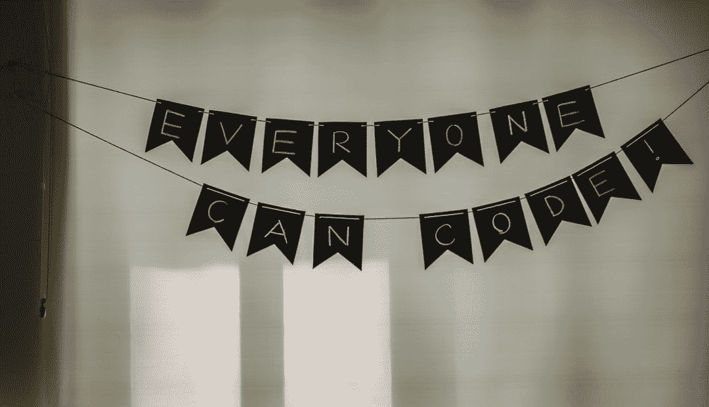

# 作为一名软件工程师，我如何克服自己的弱点

> 原文：<https://www.freecodecamp.org/news/nothing-is-instant/>

我目前是一名软件工程师，在我国一家快速发展的初创公司工作。

我是一名开源贡献者。

我是一名自由代码营的作家。

我还用自己的后端服务器发布了自己的移动应用。

有些人可能看着我，认为我是一个理想的软件工程师。你可能会认为我一直都是这样，能够做任何事情，就像我生来就有这样的天赋一样。

但实际上，我并不是人们看到的那样。即使是现在，我所做的一切都是为了**成长**。

*Photo by [Tim Foster](https://unsplash.com/@timberfoster?utm_source=ghost&utm_medium=referral&utm_campaign=api-credit) / [Unsplash](https://unsplash.com/?utm_source=ghost&utm_medium=referral&utm_campaign=api-credit)*

我不是一个过于聪明的人。我在我大学生活的时候，曾经成绩很差。我没有好的长期记忆。

我不是一个学得快的人。有些人可能只需要解释一次就能完全理解。同时，我可能需要两三个解释。

我甚至不是一个好作家。我总是努力做那些要求你写一个 1000 字的故事之类的作业。

尤其是，我不是一个自信的人。*我有巨大的**冒名顶替综合症*** 。

幸运的是，我能够弥补我所缺乏的一切。每当我情绪低落的时候，我都能让自己振作起来。

然而，没有什么是瞬间发生的。任何事情都伴随着努力和进步。克服这一切需要时间和奉献。

在这篇文章中，我将分享几件能让我克服自身弱点的事情。

## 1.让学习成为一种习惯

Photo by [Raj Eiamworakul](https://unsplash.com/@roadtripwithraj?utm_source=ghost&utm_medium=referral&utm_campaign=api-credit) / [Unsplash](https://unsplash.com/?utm_source=ghost&utm_medium=referral&utm_campaign=api-credit)

有些人每天都看书。有些人看视频或听技术播客来学习，甚至参加在线课程。

对我来说，我倾向于在长阅读时失去注意力，并在网上课程进行到一半时停下来。但我发现在 Medium 或 freeCodeCamp 上阅读简短的技术文章对我很有效。找到最适合你的学习方法是学习的第一步。

**让它成为你的习惯。**无论是每天早上如厕时阅读 5 分钟，还是睡前阅读。对我来说，我总是乘坐公共交通工具上下班，我倾向于花时间寻找一篇 5 到 10 分钟的好文章来阅读。

学习让我每天更新。有一个良好的开端帮助我保持清醒，这样我就不会落后于正轨。

对我们来说，学习是一生的旅程。

## 2.让编码成为一种习惯

Photo by [Adi Goldstein](https://unsplash.com/@adigold1?utm_source=ghost&utm_medium=referral&utm_campaign=api-credit) / [Unsplash](https://unsplash.com/?utm_source=ghost&utm_medium=referral&utm_campaign=api-credit)

是的，这听起来确实很疯狂。当你这么做的时候，很多人会认为你需要生活。我为什么这么说？因为我就是那个案子的活生生的证据！

但对我来说这是**让自己变得更好的一部分**。它让我不会变得生疏，而且在我尝试学习新东西的时候，它也帮了我很多。毕竟在学习新东西的时候，动手执行真的对我帮助很大。让编码成为一种习惯不是一件容易的事情——看在上帝的份上，这就是编码！这里充满了诡异的魔法和未知的领域。除此之外，你需要**找到你喜欢的部分**。对我来说，我喜欢探索新事物的**挑战，这种挑战在编码中永无止境。

喜欢不代表会养成习惯。那时真正帮助我的是做 [100 天代码](https://medium.com/free-code-camp/my-journey-in-completing-100-days-of-code-e657428b1fa6)。它帮助我养成了每天打开电脑，至少看一些代码的习惯。**

## 3.分享是关怀

Photo by [Priscilla Du Preez](https://unsplash.com/@priscilladupreez?utm_source=ghost&utm_medium=referral&utm_campaign=api-credit) / [Unsplash](https://unsplash.com/?utm_source=ghost&utm_medium=referral&utm_campaign=api-credit)

当你学到这么多东西的时候，总有**时间来回馈**。这真的有助于增强你的自信。这也是你学习的一个更好的方法，因为**分享将有助于填补你试图分享的任何知识缺口**。

有很多方法可以分享你的想法:写博客或文章是其中一种方法(就像我现在正在做的)。做一次技术演讲，或者仅仅是指导你的同事都是其他的方法。

还有，还记得你一直在复制粘贴的那些栈溢出题吗？
**现在是你回馈技术社区并分享你自己的想法的时候了。**

## 4.调查一个开源项目

Photo by [Alex Holyoake](https://unsplash.com/@stairhopper?utm_source=ghost&utm_medium=referral&utm_campaign=api-credit) / [Unsplash](https://unsplash.com/?utm_source=ghost&utm_medium=referral&utm_campaign=api-credit)

**GitHub** 充满了有趣的东西。试着花点时间去探索，你可能会发现很多有趣的事情。有些是复杂的超级库，有些甚至不是代码，只有你可以使用的开源 API 的[列表。甚至有一些](https://github.com/public-apis/public-apis)[笑话库](https://github.com/kelseyhightower/nocode)供大家开怀大笑。

贡献甚至可以从在存储库上发布[问题](https://help.github.com/en/articles/creating-an-issue)开始。**每一件大事总是从小事做起。**

## 5.冒名顶替综合症？从中吸取教训！

Photo by [Maksym Gryshchenko](https://unsplash.com/@gryshchenko?utm_source=ghost&utm_medium=referral&utm_campaign=api-credit) / [Unsplash](https://unsplash.com/?utm_source=ghost&utm_medium=referral&utm_campaign=api-credit)

**有没有觉得自己是假的**？害怕每个人都会发现你只是一个骗局，好像你不属于这里？是的，这就是**冒名顶替综合症**的由来。大多数人肯定都有过这种感觉，尤其是在快速发展的技术领域。事实上，这很常见，如果你有这种情况，这是一个好的征兆。这意味着你在一个地方，你知道足够多，知道你不知道足够多的事情。

关于冒名顶替综合症的事情是，**不要让消极情绪压倒你**。让它驱动你，成为你成长和变得更好的动力。

### 最后的想法

现在，即使经历了这一切，你可能会怀疑我是否已经成功地处理了我所有的弱点。如果我已经取得了足够的成就。如果是时候让我停下来了。

答案是大大的**不**

你永远不会停止成长。停止成长的那一刻，内心就开始死亡。世界很大，你永远不会有足够的知识。

成功是一个漫长的旅程，没有什么是瞬间的。将更多的注意力放在进展上，而不是你的目的地，你的人生道路会变得更轻松。保持你的**一致性**，你一定会到达你的目的地。即使这样，也要记得到时候**给自己一个机会**。

感谢您通读我的文章！我真的希望它对你有用！如果是我会很开心的！:)

> “只要你不停下来，你走得多慢都没关系”~孔子