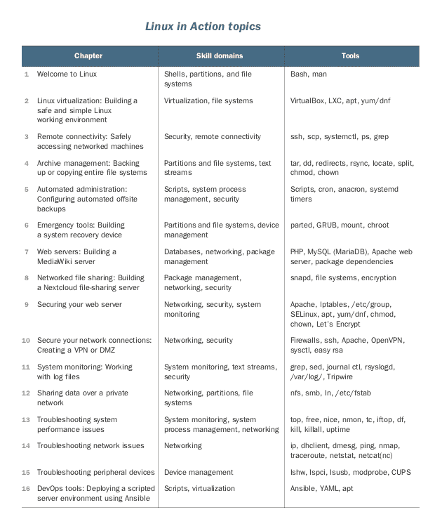

# 学习 Linux 管理的另一种方法

> 原文：<https://www.freecodecamp.org/news/another-way-to-learn-linux-administration/>

想学习管理 Linux 计算机吗？出色的选择。虽然它可以在消费者桌面领域占据一席之地，但 Linux 在服务器领域占据绝对主导地位，尤其是虚拟服务器和云服务器。

因为现在大多数严肃的服务器管理都是远程进行的，所以通过这样或那样的 GUI 界面工作只会增加不必要的开销。

如果您想管理目前吸引所有注意力的服务器和网络架构，您将不得不学习使用 Linux 命令行的方法。

好消息是，核心 Linux 命令集将跨越地理和公司界限为您工作，几乎在任何计算机和业务交叉的地方。更好的消息是，相对来说，Linux 技能有后劲。

因为它是如此成熟和稳定的操作系统，四分之一世纪前使用的大多数工具仍然一如既往地有效，今天使用的大多数工具很可能在另一个四分之一世纪后仍然会被积极使用。换句话说，学习 Linux 是一生的投资。

#### Linux 是如何工作的

但是你很忙，而且有截止日期。好吧，我不能保证你掌握 Linux 会像学习系鞋带那么简单。但我可以帮助你像激光一样集中注意力，这样你就可以把所有不需要的东西扔在高速公路上，被你的尾气呛到(当然，前提是你没有开特斯拉)。

Manning's Linux in Action

我该怎么做呢？我的 [Linux in Action book](https://www.manning.com/books/linux-in-action?a_aid=bootstrap-it&a_bid=4ca15fc9) 将技术培训置于一边。也就是说，当其他书籍、课程和在线资源围绕类别组织内容时(“好了，男孩女孩们，每个人都拿出你们的计算尺和炭笔。今天我们将学习 Linux 文件系统。”)，我用真实世界的项目来教。

The skills and associated topics covered by [Linux in Action](https://www.manning.com/books/linux-in-action?a_aid=bootstrap-it&a_bid=4ca15fc9)

因此，举例来说，我可以用整整一章(或两章)来讲述 Linux 文件系统。相反，您将学习如何构建企业文件服务器、系统恢复驱动器和脚本来复制关键数据的存档。在这个过程中，您将获得免费的文件系统知识。

不要以为我会涵盖所有的 Linux 管理工具。这是不可能的:外面有成千上万个这样的人。但是不用担心。Linux 管理职业生涯最初几年所需的核心技能和功能将被涵盖，而且涵盖得很好，但只有在实际的关键任务项目需要时。当你完成后，你学到的东西不会比从传统渠道学到的少，但你也会知道如何完成十几个主要的管理项目，并轻松应对更多的项目。

你加入吗？我想是的。

## 谁应该读这本书

这本书旨在帮助您获得坚实的 Linux 管理技能。也许您是一名开发人员，想要更直接地与您的应用程序将在其中运行的服务器环境一起工作。或者您已经准备好进入服务器管理或 DevOps 领域。不管怎样，你属于我们。

你应该已经知道了什么？至少，您应该能够自如地使用现代操作系统的文件、网络和基本资源。系统管理、网络管理和编程语言方面的经验肯定不会有坏处，但不是必需的。最重要的是，你应该不害怕探索新环境，并对尝试新工具充满热情。

还有一点:您应该知道如何简单直接地安装 Linux 操作系统。

只是简单说说这本书的结构。除了第一章之外,《Linux 操作》的每一章都涵盖了一到两个实际项目。第一章，因为它是为了填补你的 Linux 知识中可能存在的任何非常基础的空白而设计的，将与其他所有章节不同。不需要基础的？我绝对相信你会在第二章中找到很多有趣的新玩具。

除了书中的项目，我还将向您介绍您需要的个人技能和工具。此外，每章的项目通常建立在你之前在书中学到的技能之上。为了向您表明我是认真的，这里有一个相当完整的列表，列出了您将在本书的整个过程中遇到的主要项目(在章节标题下)、技能领域和工具:

目前有几十个积极维护的 Linux 发行版。尽管大多数 Linux 基础知识对所有发行版都是通用的，但总会有一些小东西“在这里”可以用，但“在那里”就不行了出于实用的考虑，我将主要关注两个发行版:Ubuntu 和 CentOS。为什么是那两个？因为每个都代表一个完整的分布族。Ubuntu 与 Debian、Mint、Kali Linux 和其他公司共享其根源，而 CentOS 则享受红帽企业 Linux (RHEL)和 Fedora 的陪伴。

这并不是说我不重视其他发行版，如 Arch Linux、SUSE 和 Gentoo，也不是说您在本书中学到的东西不会帮助您在这些环境中工作。但是完全覆盖 Ubuntu 和 CentOS 家族意味着抓住 Linux 馅饼中最大的一块，这是我只用两个发行版就能达到的。

*本文改编自我的* [*Linux 在行动*](https://www.manning.com/books/linux-in-action?a_aid=bootstrap-it&a_bid=4ca15fc9) *简介。除了这本书，你还可以通过* [*学习 Linux in Motion*](https://www.manning.com/livevideo/linux-in-motion?a_aid=bootstrap-it&a_bid=0c56986f&chan=motion1)*——这是一门混合课程，由两个多小时的视频和大约 40%的 Linux in Action 文本组成。*