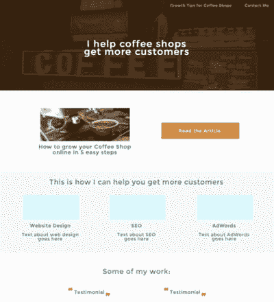
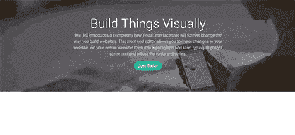
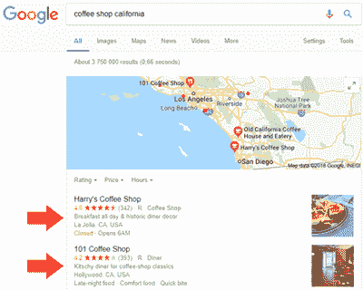
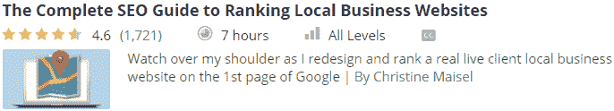
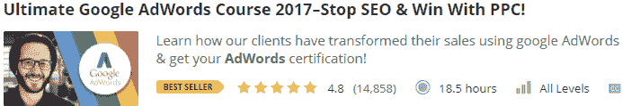
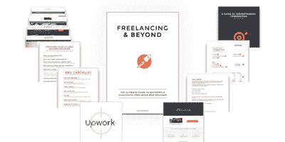

# 自由职业 101:如何作为一名开发人员开始赚取你的副业收入

> 原文：<https://www.freecodecamp.org/news/freelancing-101/>

即使你是全职工作，你可能还是想赚点外快。这就是自由职业的用武之地。

也许你需要额外的现金来维持每个月的生活。或者你只是想存钱去度个大假。无论哪种方式，本文中的步骤将帮助您做到这一点。

今天你将学习如何通过自由职业(穿着睡衣)来获得额外收入。

### 事不宜迟，以下是赚取额外收入的 5 个步骤:

1.  弄清楚你能提供什么服务。
2.  确定你的理想客户和目标市场。
3.  创建一个有针对性的网站，概述你的服务。
4.  使用在线营销和外联来接触你的理想客户。
5.  分析、学习和调整你的方法以保持进步。

## 第一步:弄清楚你能提供什么样的服务来获得额外收入

一些例子可能是:

*   前端开发
*   后端开发
*   数字营销
*   内容写作
*   设计

不要担心成为某项技能的“专家”。

改进的唯一方法是去做，并在过程中不断改进，但你需要开始，并相信你所提供的可以帮助企业。

你不能一直等，直到你是一个“专家”，否则你永远不会开始。

在本文中，我将主要关注前端开发和作为服务的数字营销。但是您也可以将这些原则应用于其他服务。

## 第二步:确定你的理想客户和目标市场

没有客户，你就不会有自由职业。

唯一的问题是， ****你如何得到客户**** ？

你不仅仅想要“客户”，你真正想要的是“合适的客户”。

## 你的客户和利基

找到你的理想客户将有助于你为你的目标市场打下基础，然后你可以相应地调整你的营销工作。

一些客户示例可能包括:

*   花商
*   面包店
*   咖啡店
*   健康商店
*   健身教练
*   普拉提教练
*   美容/美发沙龙
*   印刷业
*   [您所在地区]的小型本地企业

*(注意，该业务需要独立拥有，而不是特许经营业务。否则你将不得不与一家大公司打交道。)*

一旦你决定了你的利基/客户，你需要购买一个与你选择的利基相关的域名，并创建一个网站，如步骤 3 所示的投资组合模板。

## 第三步:创建一个有针对性的网站，概述你的服务

下一步涉及到您需要创建的投资组合网站。请参考此投资组合模板作为指南:

你是否注意到这与大多数其他“投资组合”网站看起来不同？

这个投资组合网站与其他网站不同，其他网站主要关注的是获得一份突出你技能的全职工作。在这个例子中，它侧重于获得客户以及你如何帮助他们的业务。

想象投资组合模板的最佳方式就像一个“迷你利基代理网站”。

它展示了你的知识、专业技能以及如何在你瞄准的利基市场发展业务。

理论说完了，让我们进入可操作的部分。

### 创建博客文章

博客文章很重要，因为它对你和潜在客户都有好处。

这对你有好处，因为客户会更信任你的专业知识，这将鼓励他们与你合作。

这对客户有利，因为他们可以学到一些如何发展业务的知识。

在你开始接近客户之前，你只需要有 2-3 篇文章就可以了。

你可以每个月增加一篇文章，让你的自由职业看起来仍然活跃，这会增加可信度。

这里有 3 个文章创意:

*   在线发展[插入利基]的 5 种方法
*   为什么每个[插入利基]都需要一个网站
*   几乎每个[插入利基]做错了什么

你是如何写文章的？

你可以把它外包给 Fiverr.com 的作家，也可以自己写。我建议你自己写前几篇文章，因为这将有助于你在向潜在客户销售时树立信心。

### 获取客户评价

任何以前尝试过销售网站的人都会知道，客户首先会回应的一件事是:

*****“你能给我看看你以前为[插入利基]做的工作吗？”*****

你知道你可以创建一个好网站，但客户希望看到证据——这毕竟是公平的。

就像你会研究网上购买的几乎所有产品的评论一样，这与潜在客户的心理没有什么不同。

你如何解决这个问题？有什么解决办法？

好吧，我有两个解决方案，在我所处的任何领域都有效，但你可能不喜欢。

****解决方案一:**** 免费做两个项目换取一张奖状。

****解决方案二:**** 购买两个域名，创建网站(当然你只是得不到推荐)。

****方案一需要两步:****

****第一步:**** 你需要给你选择的利基市场的企业主发电子邮件。如果他们没有回复你的邮件，那就给他们打电话。

你如何得到他们的电子邮件？

在当地网站目录、黄页、当地杂志或谷歌搜索中寻找，直到你找到它。

向他们发送以下电子邮件:

> *你好，*
> 
> *我最近偶然发现你的[利基]业务，我注意到你没有一个网站。*
> 
> *我是一名网页设计师，我很乐意免费为您创建网站(没有捕捉或隐藏费用)，以换取您的推荐，我可以在我的网站上使用。我希望得到一些证明，因为这对我将来会有帮助。你愿意接受我的提议吗？*
> 
> *如有任何问题，请随时联系我。*
> 
> *问候，*
> 
> *您的姓名*
> 
> *您的联系电话*

****第二步:**** 创建网站。

你可以通过在 Themeforest.net 或 TemplateMonster.com 上购买一个便宜的模板(通常不到 20 美元)来快速完成这项工作，或者你可以自己编码——看你觉得哪个更舒服。

另一个选择是使用 [Divi](http://www.elegantthemes.com/affiliates/idevaffiliate.php?id=43252&url=35568) ，它允许你轻松地创建 WordPress 网站。我为我创建的每个 WP 网站都使用它。

你可以[试试 Divi 这里](http://www.elegantthemes.com/affiliates/idevaffiliate.php?id=43252&url=35568)。

****方案二需要更多解释:****

一个潜在客户要求看你作品的目的是什么？

他们想知道的是你是否能完成高质量的工作。

想想吧…

如果这就是他们所关心的，为什么你不能买下域名，创建一个网站，并把它添加到你的投资组合中？

如果他们要求的是关于你如何帮助企业增加销售额的案例研究，那就另当别论了，但这不是收入战略的问题，因为你面对的是“小鱼”。

你也不必告诉他们你实际上拥有这个网站。

记住，他们想看到的只是以前的经验。对他们来说，拥有网站无关紧要，也不是优先考虑的事情。他们想看的是你是否能完成高质量的工作。

老实说，我从来没有对这个策略有任何异议。这是每次都管用的秘密武器。

## 为你的服务定价

定价对你的成功至关重要。

价格过高，这意味着你不会得到任何客户。收费太低，你可能会有客户质疑你的信誉，或者你可能会因利润微薄而过度工作。

定价是相对于你服务的利基市场而言的。

例如，如果你为一个当地的小花店和一个 100 多名员工的会计事务所创建了一个网站，你的定价应该明显高于会计事务所。

因此，如果你向花店收取 1500 美元的网站费用，他们可能会说这对他们来说太贵了。

然而，如果你对会计业务收费 3000 美元，他们可能会认为这太便宜，并可能会质疑你的专业知识。

阅读我的文章[如何为一个网站收费](https://studywebdevelopment.com/how-to-charge-for-a-website.html)可以更详细地了解如何为你的服务定价。

以下是一个细分示例:

****我的小生:**** 咖啡店

****我的服务:**** 网页设计、SEO 和社交媒体

### 一次性定价:

一个专业的单页网站 495 美元

595 美元的专业单页网站+搜索引擎优化提交+谷歌地图提交

### 每月定价:

350 美元——社交媒体管理(每周在脸书和 Instagram 上发布两次)。

495 美元–社交媒体管理+搜索引擎优化

你可能会认为我的定价很低，但记住要结合上下文来看。

目标不是在这里做好全职收入。每月 1000-1500 美元的额外收入是一个很好的现实的目标基准。

****为什么是这种定价模式？****

我想呼吁大多数咖啡店的预算。一个网站收费 1000 美元以上可能会让我得到一些咖啡店客户，但他们中的大多数预算紧张，营销通常被视为一项支出，而不是一项投资。

这种定价模式对他们中的大多数人来说是负担得起的，与更昂贵的替代方案相比，这种定价结构会吸引更多的客户。

你也更有可能让一些客户按月付费，这有助于你每月获得更可预测的收入。

要更深入了解定价(价值与小时)，请阅读[这篇文章](https://www.webdesignerdepot.com/2018/02/stop-billing-by-the-hour-right-now/)。

****它包括什么:****

****单页网站****

对于这个价格，客户不能指望一个多页的详细网站。必须专业，切中要害。如果他们想要一个更先进的网站，他们需要付给你更多的钱。

在这种情况下，网站需要具备以下条件:

*   好的图片(看看 Pexels.com 或 DepositPhotos.com，或者告诉客户给你发专业的图片)
*   关于咖啡店的信息(历史，它们的不同之处)
*   交易时间、地点和联系方式
*   任何促销/活动
*   菜单

参考 Themeforest.net 的一些灵感，或者甚至买一个便宜的单页纸(不到 15 美元)，如果你正在努力开始的话。

## SEO 提交

到目前为止，我们都听说过“SEO”这个词。简而言之，它是优化一个网站在谷歌(或其他搜索网络)上排名更高的过程。

你所需要做的就是将网站提交到本地目录，这将有助于网站在谷歌上排名的初始阶段。

目录因你所在的城市和国家而异，所以简单的谷歌搜索“本地商业目录”会给你更多的选择。你也可以搜索“[插入利基]目录清单”。

3 个常用目录是:

1.Yelp.com

2\.  YellowPages.com

3.FourSquare.com

## 谷歌地图提交

我们都在谷歌上搜索过谷歌地图，但你有没有想过商家是如何在上面列出来的？

这是一个非常简单的过程，我不打算在这里解释，因为有很多免费的在线资源。

本地搜索引擎优化是小企业的必须。

如果你想学习更多关于本地搜索引擎优化的知识，请参加这个课程:

许多人搜索“我附近的咖啡店”(或你选择的小众)，他们通常只是点击地图选项。

让你的客户出现在地图上对获得更多客户非常有利。

## 社交媒体管理

我发现 Twitter 在参与方面是浪费时间，最终导致了商业档案的“客户关怀”模式。

我通常更喜欢用 Instagram 和脸书来做商业简介，因为互动要好得多。

确保根据客户的目标市场创建和调整社交媒体渠道。

[在社交媒体平台上阅读本指南](https://sproutsocial.com/insights/new-social-media-demographics/)来帮助你开始。

你所要做的就是每周在脸书和 Instagram(或其他网站)上发布两次。

这些帖子可以是知识性的、有趣的、免费的、促销的、有帮助的和提问的。

底线是目的是参与。如果潜在客户可以看到参与度和好看的社交媒体资料，这有助于他们更加信任该企业，他们更有可能访问该企业并向朋友推荐。

你可以从所有者那里获得图片/内容，或者只看 Pexels.com，然后也看看竞争对手发布的内容，看看你可以如何与众不同。

聪明一点，提前规划好岗位。不要在需要发布的那一天开始寻找一切。

一个月只有 8-10 个不同的帖子——这并不困难，但需要一些思考和规划才能顺利运行。

你也可以使用一个叫做 Grum.co 的工具来帮助你提前安排 Instagram 帖子。脸书有这个选项是免费的。也看看 Hootsuite，它也有一个免费的计划。

## 搜索引擎优化

你的目标是让企业在谷歌上排名更高。我不会在这里做先进的东西，因为预算很少。

阅读我写的这篇 SEO 文章来帮助你更好地理解它。

一定要优化页面上的搜索引擎优化。

在这种情况下，我只会写一篇 1200 字的文章，配一些来自 Pexels.com 或 DepositPhotos.com 的漂亮图片。

如果文章很好，那么谷歌最终会将文章排名提高，这将提高网站的长期搜索引擎优化结果。

SEO 被认为更多的是一种长期的营销策略。根据行业的不同，你可以在 3-12 个月内看到好的结果。

底线是 SEO 应该被视为一种投资。只是开始而已。

可以考虑的一些 SEO 文章思路:

*   [插入郊区/地区]的 10 个最佳[插入利基]
*   如何选择合适的[插入利基]
*   咖啡的 5 大健康益处

#### 这一总体战略的优势:

一旦你做了几个网站，你就已经有了几个不同的网站主题，可以供将来注册的新客户使用。

所有你需要做的就是上传图片，添加内容，更新菜单下载，上传网站到主机，你就大功告成了。

只要从客户那里获得信息，你可以在 3-4 小时内轻松完成整个网站。

重要的是要记住，你不是在做一个 10+页的网站。

只有一页。

即使是简单的三页纸也不会花太多时间——尤其是在你的第三个客户之后。

不要因为收入金额少而心灰意冷。这是一个数字游戏。

即使你每个月只有一个客户(小套餐)+只有一个客户注册月套餐，那也等于每月 800 多美元。

如果你每个月只有两个客户+一个客户注册每月套餐，那就是每月 1300 多美元。

这是可以做到的。这真的不是不切实际的事情，也不需要很多时间来保持下去。

艰苦的工作首先是创建你的网站，建立你的投资组合，并在下面提到的一些营销方面进行改进。

## 第四步:获得客户

我所提到的可能听起来很好，但是没有客户就没有任何意义。

以下是这种营销策略获得客户的三种最佳方式:

1.广告词

2.脸书集团

3.外展服务；扩大服务范围

## 1: AdWords

AdWords 是获得新客户的绝佳方式。

简而言之，AdWords 是你在所有谷歌搜索中看到的顶部广告。

每次有人点击广告，商家(或者你)都需要付费。

AdWords 的重点是:

你以 495 美元出售一个网站。你愿意花 50 美元来获得一个有可能签约每月营销套餐的确定客户吗？

当然可以。

你愿意花 200 美元让一个客户买一个 495 美元的网站吗？

大概不会。

这一切都是为了计算出你愿意付出的和你将会得到的相比。

您的广告应该显示的搜索有(取决于您的定位):

"咖啡店网站模板"

“咖啡店网站主题”

“面向小型企业的网页设计师”

“咖啡店网页设计师”

《咖啡店网站设计》

在这种情况下，每次点击可能平均花费 2 美元。

我知道会有很多人出于研究而搜索这些术语——也许网页设计师试图获得灵感或自己购买主题，但当涉及到这样的利基时，这只是需要被接受的东西。

解决这个问题的一个方法是避免你的广告在负面关键词中包含“想法”或“灵感”这样的词，这样会更相关。

并非所有的搜索都是出于好奇。许多人是合法的企业主，只是想自己搞清楚，但因为价格如此之低，与自己动手相比，他们可能会继续做这件事。

如果您没有任何 AdWords 知识，请参加 Udemy 上的这个优秀课程:

## 2:脸书集团

所以很多人忽略了这个策略。

你需要做的就是创建一个与你的利基市场相关的脸书集团，并专注于让你瞄准的利基市场的所有者加入该集团。

在这种情况下，我希望“XYZ”市的咖啡店老板加入我的脸书集团。

然后我会为这个团队增加价值。张贴关于咖啡店如何发展业务的精彩文章，心理学提示，生产力提示，有趣的迷因等。

下一步是直接给每个成员发信息，或者偶尔给小组发帖子，告诉他们你可以如何帮助他们发展业务。

这里不需要 1000 名成员。50 个成员都很优秀。记住，这是一个超级利基市场，这些正是你想要合作的客户。

从这个营销渠道获得你的第一个客户通常需要 3 个月的时间，但是之后你会注意到改进。

只需专注于将 10%转化为付费客户，然后专注于在此基础上发展这个群体。

从长远来看，更多的目标会员=更多的客户。

这是获得新客户的绝佳方式，有助于你在自己的领域树立权威。

## 3:手工工作

这部分没有捷径。这需要一些研究和工作。

您需要执行以下操作:

1.看看黄页

2.看看当地的网上企业名录

3.看看当地的印刷媒体(报纸、小册子、传单)

4.在谷歌上搜索咖啡店

在每个示例中，您需要找出以下内容:

1.他们有网站吗？如果没有，继续下一步。

2.他们的咖啡店会出现在谷歌上吗？

如果两个问题的答案都是否定的，那就是好消息。现在是你推销服务的时候了。

在我继续说下去之前，你需要意识到，当涉及到这一点时，你不能敏感。

你必须做好心理准备，90%以上的外联活动会被完全忽视，否则你可能会直接收到“不感兴趣”的回复。

这并不意味着你不应该继续下去，但我不想在这里描绘一幅童话般的画面，因为它并不像那样工作。

你们中的许多人将面临精神障碍，因为我说了“出售”这个词

我也面临这个障碍，但后来我意识到:

我为咖啡店(或你决定的商业利基)提供了一个有效的营销工具，这将有助于他们显得更专业，这将带来更多的客户。

我在帮助他们的业务增长，他们只是付钱让我这么做。

****这是价值对价值的交换。****

一旦你明白与你合作符合他们的最大利益，一切都会水落石出，你会更有信心去“销售”

下一步是从前面提到的媒体中找到他们的电子邮件和/或联系电话。

向他们发送以下电子邮件:

主题行:【商业利基公司名称】网站

> *你好[姓名或公司名称]，*
> 
> *我叫[插入姓名]，是一名驻[插入城市]的网页设计师。*
> 
> *我在[插入媒体]上看到了您的[插入利基]业务，并注意到您还没有网站。*
> 
> *我有与【插入利基】企业合作的经验，帮助他们创建有效的网站，只需 495 美元(没有隐藏费用)。您有兴趣进一步讨论这个问题吗？我们可以打电话或者通过电子邮件讨论这个问题。【www.mynichewebsite.com】*
> 
> *关于我的专长的更多信息，这里是我的网站:谢谢你，期待你的来信。*
> 
> *【问候】*
> 
> *【你的名字】*

如果 3 天后您没有收到回复，请向他们发送以下电子邮件:

*主题行:回复:【商业利基公司名称】网站*

> 你好，
> 
> *我想确认一下你是否收到了我几天前发的电子邮件？*
> 
> *问候，*
> 
> *【你的名字】*

如果你跟进两天后没有得到回复，打电话给他们。

有时候，潜在的客户会真诚地考虑你的提议，但他们太忙了，忘了回复。

后续行动往往会收到更多的回应比第一封电子邮件，因为它往往似乎是垃圾邮件。

企业几乎每天都会收到想要设计网站和提供 SEO 服务的公司的电子邮件，所以对他们来说，你和其他人没什么两样。

我上面提到的方法是如果企业没有网站，但如果他们已经有了网站呢？

在你有了几个项目之后，你应该去那些已经有网站但设计很差的咖啡店。

只是一些[插入利基]谷歌搜索将挑选所有你需要开始。

一旦你对轻松指出错误并给出有效的建议更有信心了，就给他们发邮件告诉他们:

> *您好【姓名或公司名称】，*
> 
> *我叫【插入姓名】，最近在搜索【您使用的搜索词】后偶然发现了您的网站。*
> 
> *我注意到您的网站没有显示一个【插入利基】网站应该显示的重要方面，例如:*
> 
> *明确联系方式*
> 
> *明确公司历史*
> 
> *专业图片和内容*
> 
> *社交媒体简介*
> 
> *明确地点和交易时间信息*
> 我想打个电话，讨论一下如何通过有效的网页设计变更来帮助你获得更多的客户。
> 
> *如有任何问题，随时联系我。*
> 
> *关于我的专长的更多信息，这里是我的网站:【www.mynichewebsite.com】*
> 
> *谢谢，期待您的来信。*
> 
> *问候，*
> 
> *【你的名字】*

## 第五步:分析、学习和适应

在积极应用这些策略 3 个月后，重要的是要看看你可以在哪些地方做出改进。

至此，你将对客户的反应有所了解，然后你可以相应地调整你的电子邮件和营销。

事实是，这需要大量的艰苦工作，但是聪明地对待它是很重要的。

这些策略是有效的，如果你愿意坚持下去，并在前进的道路上不断进步，你达到目标只是时间问题。

我希望这有助于你创造一份额外的收入。

如果你想学习更高级的策略，看看我的热门自由职业包。

直到下次，

狭海峡