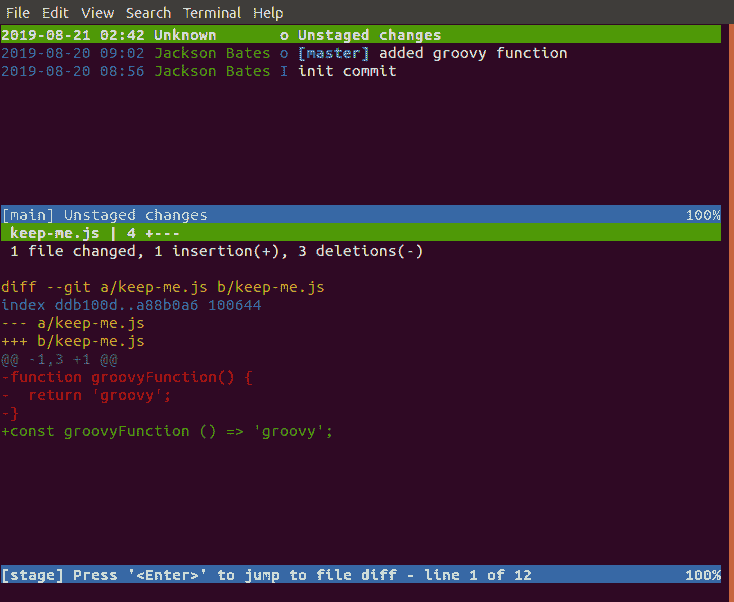
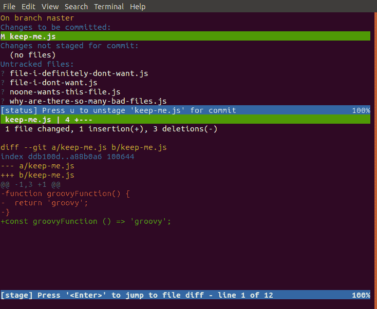

# 5 个了不起的终端技巧，帮助你提高开发水平

> 原文：<https://www.freecodecamp.org/news/terminal-tricks/>

有很多初学者教程可以帮助你学习命令行基础，比如`cd`、`ls`、`pwd`等等...但是你见过的更有经验的开发人员使用的那种奇特的魔法呢？

这里是我最喜欢的五个终端命令和实用程序(排名不分先后)，帮助你成为你渴望成为的向导！这是基于 Ubuntu 的，但在其他平台上应该是相似的(可能需要一点谷歌搜索)。

如果你想提及如何在 MacOS 或 Windows 上实现类似的结果，或者有其他终端技巧想分享，请在下面的评论中告诉我。

*这是改编自我最近的 [YouTube 视频](https://www.youtube.com/watch?v=CmNTuq7M71U)，你可以观看这些技巧！*

## 须藤！！

`sudo !!`(或者像我喜欢喊的 SUDO 梆梆)会重复你输入的最后一个命令，但是前面有`sudo`。

如果你曾经忘记使用你的`sudo`权限去做一些需要你的管理员凭证的事情(比如`apt update`)，那么`sudo !!`是一个便捷的方法来纠正它，而不必再次键入整个命令。

## 捉人游戏

`tig`和`tig status`可能是我日常工作中最常用的工具。

你们中眼尖的人可能已经注意到这是倒着拼的`git`，而且`tig`确实是一个优秀的 git 实用程序。

对我来说，gits 的一个缺点是在一些基本操作中缺乏交互性。例如，虽然`git log`和`git status`给了我有用的信息，但是需要更多的手动 git 命令来处理这些信息。

`tig`的行为类似于`git log`，但是允许您上下导航日志，并从命令行检查每个提交的内容。

`tig status`的行为类似于`git status`,除了它也允许与`tig`相同的导航，并且它也允许你从命令行容易地添加文件到 staging。

这两个命令都可以使用`j`和`k`键来上下移动，按下`enter`将打开关于文件的信息(比如提交差异)。`q`也退出退出每个命令。

要在 git 中添加或删除特定的文件，只需按下`u`。

现在当你像往常一样转到`git commit...`时，你的文件已经被添加了，所以不需要使用`git add`命令。

## 可做文件内的字符串查找

这是一个众所周知的“诀窍”，但它仍然非常有用。

`grep`允许您从文本输出中返回与您传递的特定模式相匹配的相关行。

例如，如果您在一个长的`.log`文件中查找错误，很难在所有不相关的输出中找到。Grep 可以缩小搜索范围，只搜索相关的行。

例如`grep error system.log`

对于产生大量终端输出的其他命令，您可以通过管道将它传递给`grep error`来做同样的事情。例如，如果您想查看您的铁路路线，但您只对与管理相关的路线感兴趣，您可以这样做:

`rake routes | grep admin`

## 历史

简单地返回你在终端中输入的每一个命令。这为什么有用？嗯，如果你像我一样超级健忘，那么`history`命令可以显示你以前做过什么来唤起你的记忆。

例如，每当我必须恢复数据库备份时，我总是记不住语法。`history | grep pg_restore`将在我每次使用`pg_restore`命令时向我展示我必须使用的确切标志和参数。

注意到使用`grep`来缩小搜索范围了吗？聪明地工作，而不是努力！

## 社民党说

这可以通过多种方式实现，并且在每个平台上使用不同的工具。`spd-say`是默认的 Ubuntu 文本到语音转换工具。

利用终端链接命令的能力，您可以使用您选择的语音实用工具来告诉您长时间运行的过程何时结束。

示例:`sudo apt update; spd-say done`

注意命令之间的`;`？这将基本上运行`apt update`直到完成，然后调用下一个命令。在这种情况下，当它完成时，它会很有帮助地说“完成”。

请随意让它说‘booyah！’如果你觉得你的一天需要更多小胜利的庆祝。

* * *

## 和我分享你的吧！

开发者喜欢两样东西:笔记本贴纸和时髦的终端命令。我已经没有地方贴了，但是我很想在下面的评论中听到你最喜欢的终端命令！

你也可以在 Twitter 上和我联系 [@JacksonBates](https://twitter.com/jacksonbates)