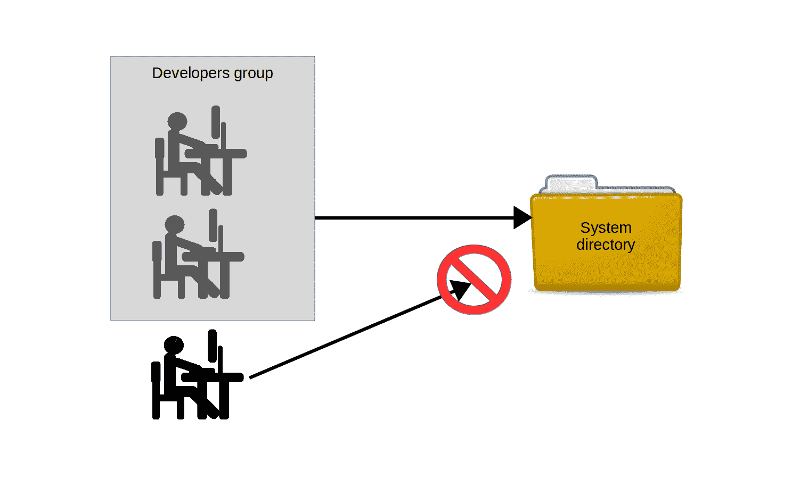

# 如何保护您的 Linux web 服务器

> 原文：<https://www.freecodecamp.org/news/securing-your-linux-web-server/>

构建 LAMP 服务器并通过可靠的数据处理、域和 TLS 证书对其进行良好的配置只是成功的一半。您还需要确保您的基础设施受到保护，免受互联网的许多可怕威胁。

在这篇文章中，我将通过正确使用系统组、进程隔离和对系统资源的定期审计来探索网站的安全性。这不是故事的全部(我的 [Linux in Action book](https://www.manning.com/books/linux-in-action?a_aid=bootstrap-it&a_bid=4ca15fc9) 涵盖了额外的工具，如安装 TLS 证书和使用 SELinux)，但这是一个很好的开始。

## 系统组和最小特权原则

您所支持的开发人员(最终)意识到，他们需要限制 *public* 对应用服务器上的数据和配置文件的访问，同时仍然允许不同的开发和 IT 团队访问。

解决方案的第一部分是*组*。组是一个系统对象，与用户非常相似，只是没有人会以组的形式登录系统。组的力量在于它们如何像用户一样被“分配”到文件或目录，允许任何组成员共享组的力量。如图所示。



Developers who are members of the Developers group can be given access to a particular directory, as opposed to those individuals who are not part of the group

自己尝试一下:使用文本编辑器创建一个新文件。添加一些“Hello world”文本，这样您就可以很容易地知道何时可以成功访问它。现在使用 chmod 770 编辑它的权限，这样文件的所有者和组对该文件拥有完全的权限，但是其他人甚至不能读取它。

```
nano datafile.txt
chmod 770 datafile.txt
```

如果你的系统除了你的账户之外还没有额外的用户，使用 adduser——Debian/Ubuntu 方式——或者 useradd(如果你在 CentOS 上)创建一个。useradd 也可以在 Ubuntu 上工作。

*useradd 命令(相对于 Debian adduser)要求你*
*单独生成一个用户密码:*

```
# useradd otheruser
# passwd otheruser
Enter new UNIX password:
Retype new UNIX password:
passwd: password updated successfully
```

使用 *su* 切换到您的新用户。输入用户密码后，您执行的所有命令都将以该用户身份运行。您将只使用该用户的权限:不多也不少。如果您尝试读取 datafile.txt 文件(使用 cat ),您将没有运气，因为您还记得，其他人被拒绝读取权限。完成后，键入 exit 离开新的用户 shell 并返回到原来的 shell。

```
$ su otheruser
Password:
$ cat /home/ubuntu/datafile.txt
cat: /home/ubuntu/datafile.txt: Permission denied
$ exit
```

这一切都在意料之中，也很好理解。正如您所看到的，无法读取属于不同阅读器的文件有时会是一个问题。让我们通过将文件与组相关联，然后正确配置文件的权限，来看看我们能做些什么。

创建一个可以用来管理应用程序数据的新组，然后使用 chown 编辑数据文件的属性。ubuntu:app-data-group 参数将文件所有权保留在 ubuntu 用户手中，但将其组更改为新的 app-data-group。

```
groupadd app-data-group
chown ubuntu:app-data-group datafile.txt
```

对该文件运行 ls 并输出“long ”,以查看其新的权限和状态。注意，正如所料，ubuntu 是文件的所有者，app-data-group 是它的组。

```
$ ls -l | grep datafile.txt
-rwxrwx — — 1 ubuntu app-data-group 6 Aug 9 22:43 datafile.txt
```

您可以使用 usermod 将您的用户添加到 app-data-group 组，然后再次使用 su 切换到一个 shell，部署其他用户的帐户。这一次，即使文件的权限锁定了其他人——而你现在肯定是作为“其他”用户——由于你的组成员身份，你应该能够阅读它。

```
# usermod -aG app-data-group otheruser
$ su otheruser
$ cat datafile.txt
Hello World
```

使用 su 在用户帐户之间切换。这些恰好是我的 datafile.txt 文件的内容。这种组织是处理多用户系统中出现的许多复杂权限问题的正确而有效的方法。

事实上，它不仅用于给单个用户提供他们需要的访问权限，而且许多系统进程在没有特殊的组成员身份的情况下无法完成工作。快速浏览一下/etc/group 文件，注意有多少系统进程有自己的组。

*/etc/group 文件内容的部分列表:*

```
$ cat /etc/group
root:x:0:
daemon:x:1:
bin:x:2:
sys:x:3:
adm:x:4:syslog
tty:x:5:
disk:x:6:
lp:x:7:
mail:x:8:
news:x:9:
uucp:x:10:
man:x:12:
proxy:x:13:
[…]
```

## 隔离容器内的流程

担心在一台服务器上运行的多项服务会因为一项服务被破坏而面临风险？限制粗心或恶意用户可能造成的损害的一种方法是隔离系统资源和进程。通过这种方式，即使有人想要将他们的影响力扩展到设定的限制之外，他们也不会有实际的接触。

解决这个问题的老方法是为每项服务配置单独的物理机。但是虚拟化可以使构建“孤岛”基础设施变得更加容易，也更加经济实惠。

这种架构通常被称为*微服务*，它会让你启动多个容器，其中一个可能只运行数据库，另一个运行 Apache，第三个包含可能嵌入到网页中的媒体文件。除了微服务架构带来的诸多性能和效率优势之外，这还可以大大降低每个组件的风险。

我说的“容器”并不一定是指那些 LXC 式的。最近，对于这种部署，Docker 容器更受欢迎。如果你有兴趣了解更多关于 Docker 的知识，可以查看一下[我的多视角课程](http://pluralsight.pxf.io/c/1191769/424552/7490?subId1=solving&u=https%3A%2F%2Fapp.pluralsight.com%2Fprofile%2Fauthor%2Fdavid-clinton)中涉及到的话题。

## 扫描危险的用户 ID 值

虽然任何 admin 用户都可以使用 sudo 临时获得 root 权限，但只有 root 才是真正的 root。正如您已经看到的，以 root 用户身份执行常规功能是不安全的。但是，不管是无意的意外还是恶意的篡改，普通用户都可以有效地获得全职管理员权限。

好消息是很容易发现冒名顶替者:他们的用户和/或组 ID 号将像 root 一样为零(0)。看看/etc/中的 passwd 文件。该文件包含当前存在的每个普通用户和系统用户帐户的记录。第一个字段包含帐户名(本例中为 root 和 ubuntu)，第二个字段可能包含一个 x 来代替密码(如果密码存在，将在/etc/shadow 文件中加密显示)。但是接下来的两个字段包含用户和组 id。在本例中的 ubuntu 中，两个 id 都是 1000。如你所见，root 有零。

```
$ cat /etc/passwd
root:x:0:0:root:/root:/bin/bash
[…]
ubuntu:x:1000:1000::/home/ubuntu:/bin/bash
```

然而，如果你看到一个普通用户的用户或组 ID 为 0，那么你就知道有什么不好的事情发生了，你应该着手修复它。发现问题的快速简单的方法是对 passwd 文件运行这个 awk 命令，它将打印出第三个字段只包含 0 的任何一行。在这种情况下，令我欣慰的是，唯一的结果是 root。您可以第二次运行它，用$4 代替$3 来选择组 ID 字段。

```
$ awk -F: ‘($3 == “0”) {print}’ /etc/passwd
root:x:0:0:root:/root:/bin/bash
```

## 审核系统资源

你运行的东西越多，坏掉的几率就越大。因此，有必要跟踪正在运行的程序。这将适用于网络端口(如果它们是“开放的”，那么，根据定义，必须有一个方法进入)，服务(如果它们是活动的，那么人们可以运行它们)，以及安装的软件(如果它已安装，它可以被执行)。

为了让审计有用，你必须记得偶尔运行一次。因为您知道您将会忘记，所以您最好将您的审计工具合并到一个脚本中，该脚本不仅会定期执行，而且在理想情况下，还会解析结果以使它们更具可读性。

但是，在这里，我将重点向您介绍三个关键的审计工具，帮助您扫描开放端口、活动服务和不必要的软件包。让它自动化将是你的工作。

## 扫描打开的端口

如果主机上有某个进程正在侦听某个端口上的请求，则该端口被视为“开放”。密切关注您打开的端口可以让您了解服务器的真实情况。

您已经知道一个常规的 web 服务器可能会打开 HTTP (80)和 SSH (22 ),所以遇到这些并不奇怪。但是你真的想关注其他意想不到的结果。netstat 将显示开放的端口以及关于它们如何被使用的大量信息。

在这个例子中，针对一个非常典型的多用途服务器运行，-n 告诉 netstat 包括数字端口和地址。-l 只包括监听套接字，而-p 添加监听程序的进程 ID。自然，看到什么就做什么。

```
# netstat -npl
Active Internet connections (only servers)
Proto Local Address Foreign Address State PID/Program name
tcp 127.0.0.1:3306 0.0.0.0:* LISTEN 403/mysqld
tcp 0.0.0.0:139 0.0.0.0:* LISTEN 270/smbd
tcp 0.0.0.0:22 0.0.0.0:* LISTEN 333/sshd 
tcp 0.0.0.0:445 0.0.0.0:* LISTEN 270/smbd
tcp6 :::80 :::* LISTEN 417/apache2 
[…]
```

近年来， *ss* 已经开始在很多用途上取代 netstat。万一有一天你发现自己在一个聚会上，有人问你关于 *ss* 的事情，这个例子(列出了所有已建立的 SSH 连接)应该会给你足够的信息，让你免于极度尴尬:

```
$ ss -o state established ‘( dport = :ssh or sport = :ssh )’
Netid Recv-Q Send-Q Local Address:Port Peer Address:Port 
tcp 0 0 10.0.3.1:39874 10.0.3.96:ssh 
timer:(keepalive,18min,0)
```

## 扫描活动服务

获取当前在您的机器上启用的 systemd 管理的服务的快速快照可以帮助您发现不属于它的活动。systemctl 可以列出所有现有的服务，然后可以缩小范围，只列出那些描述中包含 enabled 的结果。这将只返回活动的服务。

```
# systemctl list-unit-files — type=service — state=enabled
autovt@.service                       enabled 
bind9.service                         enabled 
cron.service                          enabled 
dbus-org.freedesktop.thermald.service enabled 
docker.service                        enabled 
getty@.service                        enabled 
haveged.service                       enabled 
mysql.service                         enabled 
networking.service                    enabled 
resolvconf.service                    enabled 
rsyslog.service                       enabled 
ssh.service                           enabled 
sshd.service                          enabled
syslog.service                        enabled 
systemd-timesyncd.service             enabled 
thermald.service                      enabled 
unattended-upgrades.service           enabled 
ureadahead.service                    enabled
```

如果您确实发现了不应该存在的东西，您可以使用 systemctl 来停止该服务，并确保它不会在下次启动时再次启动。

```
systemctl stop haveged
systemctl disable haveged
```

在这个例子中，我正在
停止的*haved*服务实际上没有什么黑暗和邪恶的:它是一个非常小的工具，我经常安装它来生成
随机后台系统活动，当我创建加密密钥时。

## 搜索已安装的软件

会不会有人或什么东西在你不知道的情况下在你的系统上安装了软件？好吧，你不看怎么知道？yum list installed 或者，在 Debian/Ubuntu 上，dpkg——list 会给你完整的简介，而 remove <packagename>应该会删除任何不属于它的包。</packagename>

```
yum list installed
yum remove packageName
```

Ubuntu 上的情况是这样的:

```
dpkg --list
apt-get remove packageName
```

了解系统配置文件的变化也是一个好主意——这将在第 11 章中介绍。

*本文摘自我的* [*曼宁《Linux 在行动》一书*](https://www.manning.com/books/linux-in-action?a_aid=bootstrap-it&a_bid=4ca15fc9) *。还有更多有趣的东西* [*来自*](https://bootstrap-it.com/index.php/books/) *，包括一个名为*[*Linux in Motion*](https://www.manning.com/livevideo/linux-in-motion?a_aid=bootstrap-it&a_bid=0c56986f&chan=motion1)*的混合课程，它由两个多小时的视频和大约 40%的 Linux in Action 文本组成。谁知道呢...你可能也会喜欢我最近出版的* [*一个月内学会亚马逊网络服务的便当*](https://www.manning.com/books/learn-amazon-web-services-in-a-month-of-lunches?a_aid=bootstrap-it&amp;a_bid=1c1b5e27) *。*