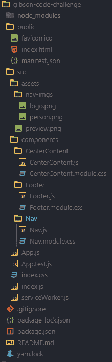
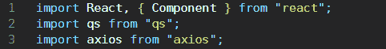
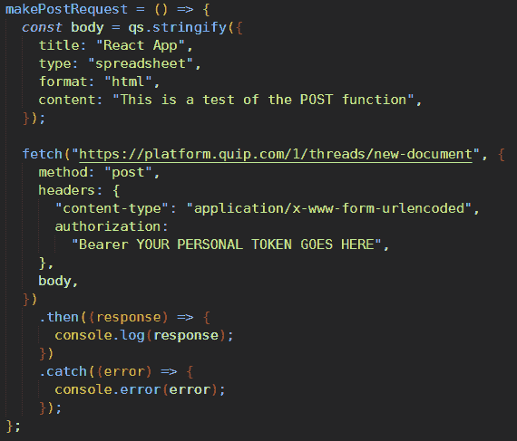
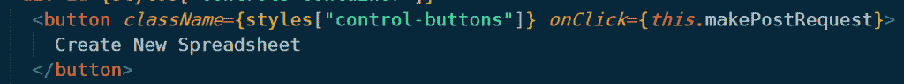
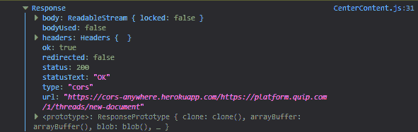
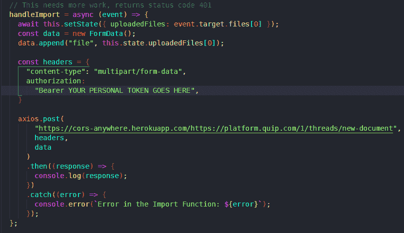
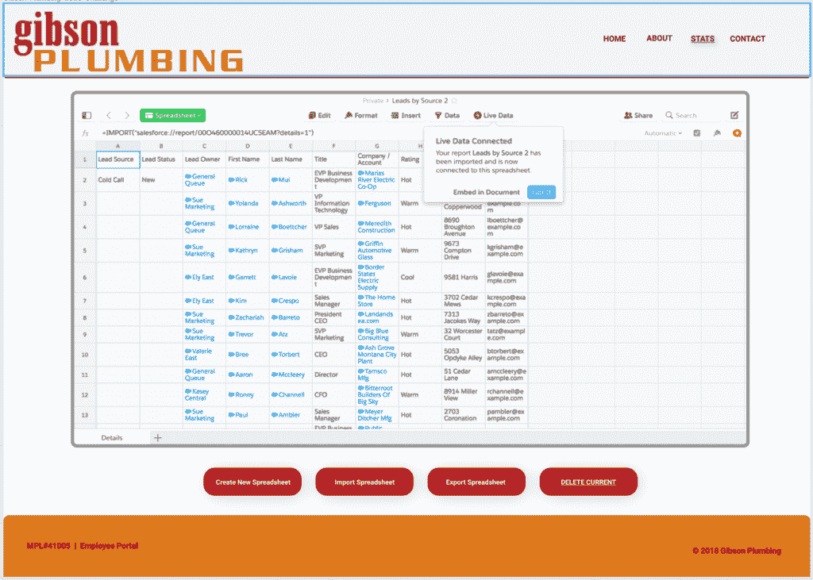

# 如何征服工作面试代码挑战 v2.0:创建前端 web 应用程序

> 原文：<https://www.freecodecamp.org/news/conquering-job-interview-code-challenges-v2-0/>

正如你们中的许多人所知，我在 6 月底得到了我的第一份开发工作，我认为把我所面临的挑战作为今天文章的主题会很棒。

值得注意的是，我使用 React 来构建我的项目，但这可以用任何前端框架或“普通 JavaScript”来完成。

下面是我们将要讨论的主题列表:

*   访问[设备自动化 API](https://quip.com/dev/automation/documentation#token-endpoint)
*   使用 Quip API 创建电子表格/文档
*   安装和使用 [Axios](https://github.com/axios/axios) 库(这是可选的，您可以在没有它的情况下发出 API 请求，但是我喜欢它的语法)
*   使用 [qs 包](https://www.npmjs.com/package/qs)来字符串化请求(这不是一个要求，但我想尝试一些新的东西，如果它不起作用，我总是知道 Axios 将默认字符串化我的请求)
*   制作[帖子](https://en.wikipedia.org/wiki/POST_(HTTP))和[获取](https://en.wikipedia.org/wiki/Hypertext_Transfer_Protocol#Request_methods)请求

作为背景，下面是我收到的需求的一个片段:

"*创建一个前端 web 应用程序，通过以下方式与 Quip API 交互:*

*   *创建一个电子表格(将数据导入新创建的电子表格的奖励积分)。*
*   我所说的导入数据是指上传 Excel 电子表格，或者将数据复制并粘贴到 Quip 电子表格中。
*   *将 Quip 电子表格导出到。xlsx*
*   *下载(备份)一个文件夹/多个文档。*

以你认为合适的方式(按钮、对话框等)为页面创建用户界面。

当我读到需求时，我有点担心，因为我不确定从哪里开始。所以，我钻研 API 文档，开始吸收信息。谢天谢地，没有给我时间限制，但我想尽快完成这件事，看看我在面试过程中处于什么位置。

首先，我在 Figma 中设计了成品的原型，这样我就有了一个路线图。这不是一个必需的步骤，但是它确实使您的项目构建过程更加顺畅。

好吧，我们开始吧！

## 入门指南

我构建了导航、页脚和内容组件，这样我的应用程序就有了一个坚实的基础。

这些组件中的每一个都返回一些基本的 JSX，并没有太多内容(如果你想看每个组件的代码，你可以查看该项目的 [GitHub repo](https://github.com/JS-goose/gibson-code-challenge) )。

我决定将大部分请求在 *`App.js`* 和 *`CenterContent.js`* 文件之间进行分割。

作为参考，下面是我的项目结构:



My project structure

你会看到我的参考职位，并得到整个职位的要求。如果你不熟悉这些，现在是做一些研究的好时机。老实说，在开始这个项目的时候，我并不是 100%的了解他们，我自己也不得不查阅一些资源。

简而言之，POST 请求是指我们请求服务器 ***接受*** 一些传入的数据(我们正在发送)——在我们的例子中，数据以创建新的电子表格文件的形式出现。

GET 请求是当我们请求服务器 ***发送*** 来自服务器上指定资源的数据。

我使用了[失眠休息客户端](https://insomnia.rest/)来帮助调试我的请求问题。我正在为它编写一个初学者指南，请继续关注！

## 使用 Quip API

如果你像我一样，你从来没有听说过 Quip API，也不知道它是做什么的。在其核心，Quip 是一个自动化工具，允许您与诸如 [SalesForce](https://www.salesforce.com/) 之类的工具集成，以使您的销售团队更加协作。

出于我们的目的，我们将使用它来创建我的 Quip 帐户上的 Excel 电子表格(如果你想复制这个项目，你需要创建一个 Quip 帐户-这是免费的)。

为了发出请求，您还需要创建一个个人开发者令牌。你可以在这里完成[(需要一个账户)。一旦你有了你的令牌，把它放在一个安全的地方，因为我们很快就会用到它。](https://quip.com/dev/token)

首先，我通过运行`npm install axios`将 Axios 安装到我的项目中，然后将它导入到我需要用`import axios from "axios";`发出请求的文件中



My import statements for required packages

## 证明

在向服务器发出任何请求之前，我需要用我的凭证进行身份验证。我决定将它放在`componentDidMount` [生命周期方法](https://reactjs.org/docs/state-and-lifecycle.html)内的`App.js`文件中，这样它将在每次页面加载时加载:


My authentication function

因此，我构建了自己的函数，调用了自己的函数，有那么一会儿，我认为一切都很好，直到我遇到了这个可怕的错误:

```
"Cross-Origin Request Blocked: The Same Origin Policy disallows reading the remote resource at $websiteName"
```

不不不。！！可怕的 [CORS](https://developer.mozilla.org/en-US/docs/Web/HTTP/CORS/Errors) 怪物抬起它巨大的头！(CORS 实际上是我和服务器之间的一个有用的中介，但是如果你以前从未见过这个错误，处理起来可能会很烦人)。

**旁注——如果你以前从未见过这个错误，不要担心！我仍然没有完全理解它，但我知道足够调试它。如果你遇到了困难，可以查看上面的链接以获得一些有用的信息，或者看看下面的快速解决方法。**

解决这个问题的一个简单方法是使用一个代理，比如 CORS 随处可见 T2 免费资源。本质上，把这个链接`https://cors-anywhere.herokuapp.com/`放在你的端点 URL 的前面，它会暂时解决这个问题。

这个方便的工具将允许你在本地主机 T3 上开发的同时提出你的请求 ***。如果我是你，我会在生产中使用这种方法之前做一些研究。完全免责声明，我对这个小技巧了解不多，无法告诉你在生产中使用是否安全。***

因此，在对身份验证功能做了一些调整后，我得到了登录到控制台所需的结果。是时候提出请求了！

## 提出请求

现在，我的身份验证工作正常，我们准备提出一些请求。我知道，每当我想创建一个新文档时，我都会发出一个 POST 请求，而且我还想将这个动作与单击一个按钮联系起来。所以，下面是我的帖子功能:



My POST function

您会注意到这就是我在本文开头提到的`qs`包发挥作用的地方。我不是专家，但是从我阅读了上面的文档后收集到的信息来看，这个包将我的请求转换成一个要发送给服务器的字符串。如果你不想使用这个包，那也没问题，因为默认情况下`Axios`会这样做。我知道`qs`提供的不仅仅是字符串数据，但我不熟悉它的全部功能。

现在，我希望这个函数在单击按钮时触发。于是，一个基本的按钮诞生了！



A simple React button with an on click method

我的 POST 函数已经构建好了，我的按钮也已经构建好了，并且绑定了方法。是时候交叉手指，看看我的函数在控制台上显示了什么:



The result of my server request - it works!

此时我欣喜若狂！让我兴奋不已的是，这个 API 调用不仅可以工作，还可以返回一些东西。现在真正的考验...这在我的 Quip 帐户上会显示为新的电子表格吗？


我有控制台声明和来自我的 Quip 帐户的确认，显示我已经成功地创建了一个新的电子表格-这太棒了！我欣喜若狂，简直从椅子上跳了起来，大喊“耶，耶，耶！！!"一旦我得到了这两样东西。

那种在奋斗之后找到工作的感觉是我职业生涯中从未经历过的。我告诉自己，我必须继续驾驭这股热情和兴高采烈的浪潮，所以我继续推进清单上的下一项。

## 将数据导入新创建的电子表格

对于“任务”的这一部分，我有一些很好的想法，但现在距离我开始这个项目已经过去了将近两周，我担心面试官会忘记这一点(即我)，或者对我不耐烦了。

所以，我放弃了那些宏伟的计划，选择了一些更简单的东西，这样我就可以尽快完成这个项目。

我构建了一个小函数，至少可以附加到上传按钮上，这样我就可以为它提供某种类型的功能。在它的核心，这个函数等待一个文件被上传，将状态设置为事件目标数组中的第一个元素，然后根据该信息创建标题，最终目标是它将该信息发布到我的 Quip 帐户。

然而，您可以通过这个功能块顶部的注释看出，我无法让它正常工作。然而，我没有时间(至少我认为我没有)深入研究这个问题并解决它。



My import function that never quite worked properly :)

在这一点上，我已经在下班后和晚上为这个项目工作了两个多星期。我决定在其他部分不工作(导入、导出和下载数据)的情况下，是时候把它上交了。

## 最后的润色

我知道我的项目还没有完成，为此我非常自责。但是，作为一个额外的奖励，我决定在 [Figma](https://www.figma.com/) 中设计一些东西，作为一个额外的接触，以帮助我获得回电的机会。

这是模仿当前颜色/字体/主题的成品:



## 就这样结束了

随着我的项目没有完成，但处于停止点，我对我的进度和时间安排感觉不太好，但我把所有东西打包并扔在 GitHub 上。我把上面的图片放进去，安排第二天早上 9 点给面试官发一封电子邮件。我屏住呼吸等了将近两天，希望能得到某种形式的回电。当我开车去上班的时候，它终于来了。面试官已经得到了我的项目，并希望我和他的首席开发人员再次会面。

我既害怕又兴奋，因为我认为他们想让我来取笑我的代码，或者问我在建造这个庞然大物的时候到底在想什么。但事实完全不是这样。我最终从这个项目中获得了一份工作机会！

如果你想了解整个故事，你可以在我之前的博客[中找到关于我第一份开发者工作的帖子。](https://jonathansexton.me/blog/landing-my-first-development-job-what-a-crazy-journey/)

我希望你已经从这篇文章中发现了一些价值。如果你让我在推特或任何我在:D 上发布的其他平台上知道

此外，我会把我的大部分文章交叉发布在大型平台上，比如 [Dev.to](https://dev.to/jsgoose) 和 [Medium](https://medium.com/@joncsexton) ，这样你也可以在那里找到我的作品！

既然你在这里，为什么不注册我的**时事通讯**——你可以在我的[博客](https://jonathansexton.me/blog)页面的右上角注册。我保证我永远不会给你的收件箱发垃圾邮件，你的信息也不会与任何人/网站共享。我喜欢偶尔发送我发现的有趣资源、关于 web 开发的文章以及我的最新帖子列表。

祝你有一个充满爱、快乐和编码的美好的一天！