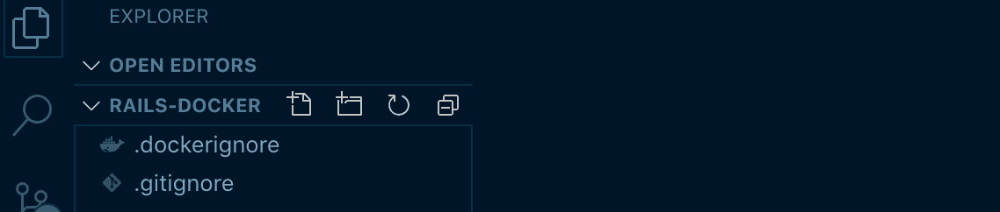
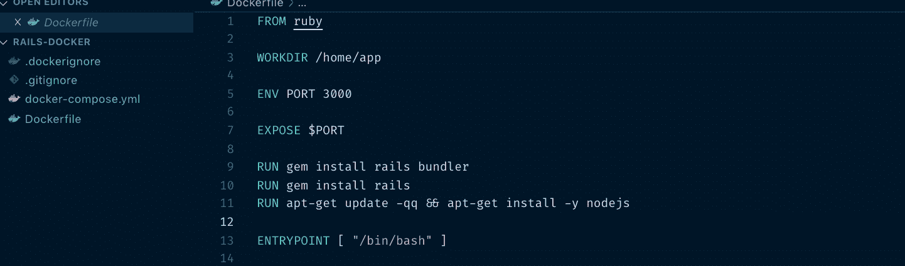
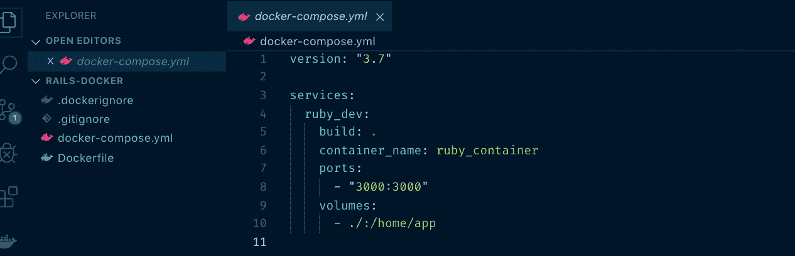
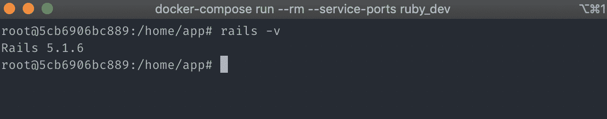

# 如何用 Docker 轻松地设置 Ruby on Rails 开发环境

> 原文：<https://www.freecodecamp.org/news/painless-rails-development-environment-setup-with-docker/>

你可能听说过 docker 术语，如容器、图像、服务、卷、网络、Docker 文件、docker-compose 文件，对吗？或者你看过一些关于它是什么的视频，但是你不确定它如何应用到你作为开发者的日常生活中？

这是我看了关于 Docker 的视频后第一个想到的。Docker 不仅可以运行 web 应用程序、服务器和数据库，还可以是一个本地开发环境！我写这篇文章不仅是为了让你学会如何做，也是为了我，让我不会忘记。我们开始吧！

## 目录

*   [为什么是 Docker？](#why-docker)
*   [安装 docker 和 Ignorefiles](#installing-docker-and-including-ignorefiles)
*   [坞站样式和坞站-复合](#dockerfile-and-docker-compose-file)
*   [构建和运行容器](#building-and-running-the-container)
*   [制作新的 rails 应用并启动服务器](#test-run-a-rails-app)
*   [清理](#cleaning-up)
*   [成交和回购](#conclusion)

## 为什么是 Docker？

为什么要用 docker？为什么不把它安装在你的本地机器上，然后安装 Ruby 版本管理器(rvm)或者 Ruby 环境(rbenv)？

用这些工具来设置 Ruby On Rails 是非常棒的。我花了 3 个多小时进行安装、故障排除和搜索文档，才让它正常工作。但是最近，我把我的 mac 重新格式化了。但我没有列出或记下我访问过的网站，以使它在我的机器上工作。又忘了怎么装，重复步骤很痛苦。

这就是 Docker 大放异彩的地方。安装 docker，加载 docker 文件，在终端中运行几个命令，您就已经设置好了！此外，如果你想卸载你所做的一切呢？很难跟踪要撤销哪些步骤。有了 Docker，只需要几个命令就可以清理了。

我在看一个关于 docker 的[在线教程的时候，老师 Dan Wahlin 说 docker 的好处之一就是加速开发者入职。丹在他的教程中说:](https://www.pluralsight.com/courses/docker-web-development)

> Docker 可以在这方面提供帮助，因为我们可以制作一个或多个图像，然后将这些图像转换成运行容器，这些容器可以在我们不同的开发人员甚至设计师的机器上运行

假设您有一个开发人员、设计人员和测试人员团队，并且有一个包含后端服务器、数据库服务器和缓存服务器的应用程序。你有 12 台全新的机器，结合了 linux 和 mac 电脑。您真的想安装、排除故障，并遵循依赖于机器的不同安装说明吗？然后让这些部分在每台机器上一个接一个地工作，不能保证它们不会遇到任何不同的错误？

这也是我花时间学习 Docker 的原因。通过几个命令和几行配置文件，您已经设置好了。在下一节中，我们将使用 docker 设置。

## 安装 Docker 并包含 Ignorefiles

### 1.安装 Docker

关于安装 docker 我就不多说了，外面有很多视频。但通常情况下，只需下载并打开安装程序，在 dockerhub 上注册一个帐户，就万事大吉了。查看 [Docker 安装文档](https://docs.docker.com/install/)。

### 2.制作一个`.dockerignore`文件

什么是 dockerignore 文件？Dockerignore 文件只是告诉 Docker 忽略其容器中的哪些文件。一个例子是当你有一个缩小的资产，js，css 文件，当你改变原始代码的时候，它会不时地改变。这也适用于 gitignore 文件。通常，建议忽略的文件列表通常可以在互联网上找到。你可以[自己`.dockerignore`复制这个要旨](https://gist.github.com/neckhair/ace5d1679dd896b71403fda4bc217b9e)。

如果你使用 git，把这段代码片段放到你的`.gitignore`中。



The look of your project folder will look similar to this.

忽略文件有点长，所以我只放了链接。

## dock file and docker-构成档案

这是大部分操作发生的地方。可以把这两个文件看作 Docker 如何设置虚拟容器的一组指令。Dockerfile 和 docker-compose 文件一起工作。您可以为不同的服务创建多个 docker 文件，并用一个 docker-compose 文件将它们绑定在一起。

### 3.制作一个名为`Dockerfile`的文件

docker 文件是一个包含一系列规则的文件，您可以设置 docker 将遵循的规则。在 Docker hub 上有一套预先建立的规则。一个例子是 MySQL、PHP 或 Node.js 的预建安装说明。我会简单解释一下这些线是做什么的。

```
FROM ruby

WORKDIR /home/app

ENV PORT 3000

EXPOSE $PORT

RUN gem install rails bundler
RUN gem install rails
RUN apt-get update -qq && apt-get install -y nodejs

ENTRYPOINT [ "/bin/bash" ] 
```

Dockerfile on your project root

*   这意味着 docker 将拉一个由 ruby 预先构建的设置。你不需要考虑在你的机器上更新或安装最新的 ruby 版本。你会在 Dockerhub 上看到 Docker 的预建图像列表[。把它想象成 npm。](https://hub.docker.com/)
*   `WORKDIR /home/app` -工作目录。工作目录意味着这是您启动开发环境时的默认文件夹位置。你想叫它什么都可以。
*   `ENV PORT 3000` -环境变量。这将在您的 bash 终端上将名为`$PORT`的变量设置为‘3000’。
*   将虚拟容器的端口 3000(我们之前设置的)暴露给本地机器。
*   `RUN` -运行命令是您希望终端在使用前运行的一些设置指令。在我们的例子中，我们甚至在使用开发环境之前就已经安装了 ruby on rails、bundler 和 node.js，所以当我们使用它的时候它已经准备好了。
*   这个命令告诉 docker 当我们运行容器时要执行什么命令。在我们的例子中，我们需要运行 bash terminal，这样我们就可以访问 rails。

请注意，这些解释只是简短的。你可以看到更多的解释，或者你可以在 [Dockerfile 参考文档](https://docs.docker.com/engine/reference/builder/)上深入研究。



Your Dockerfile will look like something like this.

你可以用 Dockerfile 做一些很酷的事情。在我的例子中，我试图在我的容器上安装 zsh 和 [oh-my-zsh](https://github.com/robbyrussell/oh-my-zsh) ，因为它有一些很酷的自动完成特性。但是在我们的例子中我们并不真的需要它，它只会增加我们的图像大小，所以我没有包括它。

### 4.制作一个名为`docker-compose.yml`的文件

Docker 组合文件是一个将不同服务捆绑在一起的文件。一个很好的例子就是当你把你的 rails 应用程序连接到不同的服务器上，比如 MySQL 数据库服务器，或者 redis 缓存服务器。您可以轻松地让他们使用这个文件。但是在我们的例子中，为了清楚起见，我们将坚持最小的设置。YAML 文件是一种降价文件，对如何格式化文件有不同的规则。就把它想象成一个 JSON 文件，没有大括号。把这个放到你的`docker-compose.yml`文件里。

```
version: "3.7"

services:
  ruby_dev:
    build: .
    container_name: ruby_container
    ports:
      - "3000:3000"
    volumes:
      - ./:/home/app 
```

docker-compose.yml

如你所见，它看起来有点像 docker 文件，但是有一点缩进。让我们过一遍台词。

*   随着时间的推移，docker-compose 文件经历了变化。这就是为什么在 docker-compose 文件中，他们需要指定他们正在使用的版本。在我们的例子中，我们只是使用最新的版本。
*   `services` -指定服务列表。正如我前面说过的，在你的项目中可以有很多服务，比如 rails 服务器和 MySQL 服务器。您可以随意命名您的服务。我把它命名为`ruby_dev`。
*   `build: .` -这里的点表示找到 Dockerfile 的文件路径，docker file 是构建指令。
*   `container_name` -容器的名称。
*   这些是从 docker 容器向我们的本地主机公开的端口。这里的格局是`HOST:CONTAINER`。在我们的例子中是“3000:3000”。这意味着我们让默认的 Rails 服务器端口(3000)在本地机器的“localhost:3000”中可用。
*   卷意味着即使我们退出或删除 Docker，我们也可以指定哪些文件可以保留在本地机器中。我们把`./:/home/app`放在那里是因为我们之前在 docker 文件中将工作目录命名为`/home/app`。

你可以在 [Docker 撰写参考文档](https://docs.docker.com/compose/compose-file/)上看到更多解释。



Your docker-compose.yml will look like something like this.

## 构建和运行容器

设置好所有的配置文件后，让我们构建并运行容器！在我们遇到大量术语之后，构建和运行容器就简单多了。它只涉及几个命令。

### 5.在您的终端中，运行`docker-compose build`

运行这个命令将获得 Dockerfile 并安装所有必要的东西来创建一个 rails 开发环境。请注意，安装可能需要一段时间，因为 docker 需要下载必要的软件包。

### 6.在您的终端中，运行`docker-compose run --rm --service-ports ruby_dev`

这个命令将启动一个 bash 终端，它将是您的 rails 开发环境，rails 命令在其中可用。仅仅通过这两个命令和两个配置文件，您就已经拥有了一个 rails 环境，甚至不需要查看故障排除日志！请注意，我们的命令有一些标志，`--rm`表示在使用容器后将其移除，`--service-ports`表示使用容器中的端口 3000，这样我们就可以看到 rails 服务器的运行。`ruby_dev`这个名字也来自我们 docker-compose.yml 上的服务



Your terminal might look like this after running the run command. Check if there's rails by running `rails -v` command. Versions might vary.

## 测试运行一个 rails 应用程序

既然我们已经成功地创建了 rails 开发环境，我们将测试一个示例 rails 应用程序。

### 1.运行`rails new myapp && cd myapp`

这个命令将在名为 myapp 的文件夹中创建一个新的 rails 应用程序。之后，终端将进入文件夹。你想叫它什么都可以。

### 2.更新和安装 gems。运行`bundle update && bundle install`

只要确保你在正确的文件夹中，在`myapp`中，它包含了 rails 应用程序文件。此命令将更新并安装您的依赖项。

### 3.通过运行`rails server -p $PORT -b 0.0.0.0`来测试服务器

还记得我们之前在 docker 文件中指定的端口吗？这是我们可以使用它的地方。在我们的例子中，rails 将使用端口 3000 来启动服务器。不要忘记加上`-b 0.0.0.0`,因为没有这个你就看不到本地机器上的应用。


Hello rails splash screen. Yeah rails!!!

### 4.通过按键盘上的`ctrl-d`停止服务器。

## 清理

完成所有工作后，可以通过在容器的 bash 终端上运行`exit`来退出容器。您之前输入的`--rm`标志将会移除容器，但是您会保留 ruby on rails 文件吗？

### 运行`docker-compose down`进行清理

清理是指当您完成项目后，想要删除您的开发环境以便节省空间。如果真的完成了，可以使用这个命令。Docker 将删除您的所有设置，以及您下载的图像。这非常强大，因为，想象一下，你在你的 mac 上遵循了很多步骤和很多安装。删除该安装程序的唯一方法是逐个卸载它们。有 docker 在我们这边，只是一个命令。噢耶！

## 结论

很高兴你走了这么远！让我们从大处着眼。在 Docker 中设置一个开发环境可以分为两个步骤:

1.  在你的 docker 文件和 docker-compose 文件中列出你需要的指令。
2.  使用`docker-compose`命令启动、停止或清理您的开发环境。

这对我们来说是一个巨大的胜利。你只需要保存 docker 文件和 compose 文件，每当你切换机器时，你只需要运行两个命令！设置一次，然后忘记。

### 贮藏室ˌ仓库

你可以通过查看这里的 **[完整的 github repo，在这里看到关于如何设置的存储库，以及你需要的其他命令。](https://github.com/jcunanan05/rails-docker)**

如果你觉得这篇文章有帮助，或者你有其他问题，请在评论中提出。我很乐意帮忙！

本文由 Jonathan Cunanan 在 [freeCodeCamp News](https://www.freecodecamp.org/news/painless-rails-development-environment-setup-with-docker/) 上撰写。

[？推特](https://twitter.com/devJonathanC_) - [？freeCodeCamp](https://www.freecodecamp.org/jcunanan05) - [？作品集](https://jonathancunanan.com) - [⚛️ Github](https://github.com/jcunanan05)