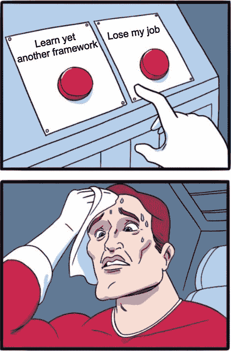
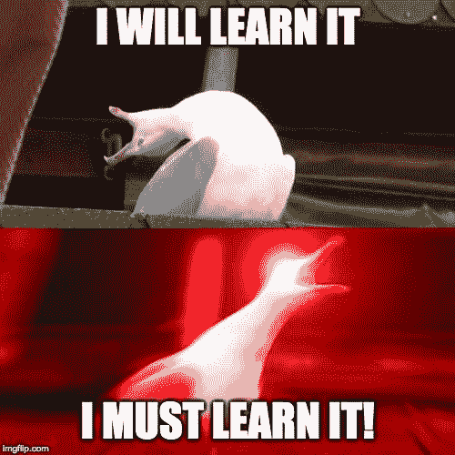
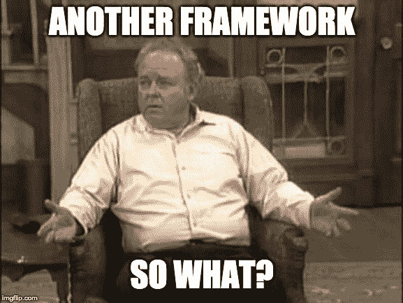
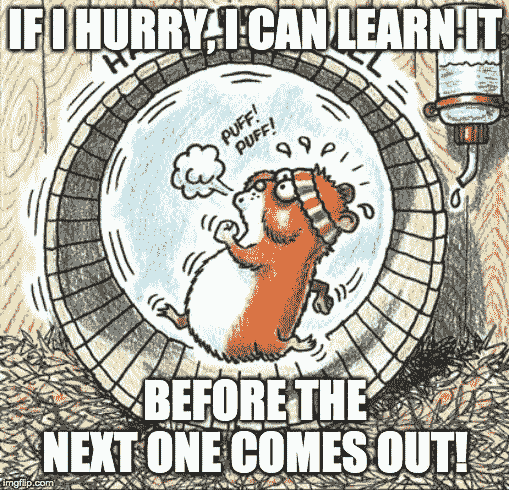
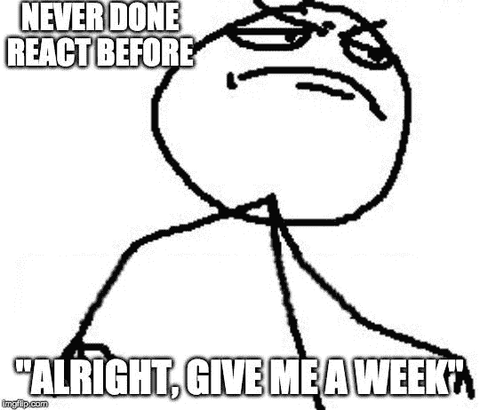
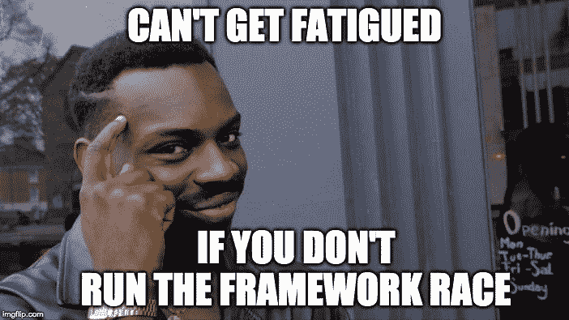

# Javascript 疲劳和所有其他疲劳的治疗方法

> 原文：<https://www.freecodecamp.org/news/the-cure-to-js-fatigue/>

学会自己的基本面，再也不用担心了。

## 新工具让我担心

当 JavaScript 的闪亮工具问世时，我有时会反应过度。

经过 15 分钟的疯狂想象，探索它的冲动变得难以忍受。

不管是什么工具，都是一样的。

*   我一定要学会这项技术！
*   在这个竞争激烈的就业市场上，我需要一切优势！
*   我必须保持相关性，对吗？！

是的，但不是。

## 我的前辈从不担心

有时，我会在办公室与高级开发人员分享这种情绪，并从他们那里得到标准的反应。

经历了足够多这样的遭遇后，我开始思考...

## 为什么不同？

为什么我焦虑地扑向今天的顶级工具，似乎注定要永远重复这一点...

而我的学长们平静地让 JavaScript 风暴过去，根据需要捡起工具？

这是因为他们看到了这些工具之间的共同点。对他们来说，即使过了这么多年，风景也没什么不同。

这些常见的线程从何而来？基本面。

## 一切都在基本面中

我见过的最好的开发人员不会被 JavaScript 的光速进化所左右。他们并没有因为 JavaScript 疲劳而筋疲力尽，因为他们退出了这场竞赛。

他们没有学习框架来促进职业发展，而是专注于基础知识，T2 的职业生涯一飞冲天。

你最喜欢的框架有一天会一落千丈，最终你不得不重新拾起另一个。

但基本面是常青的。它们可以追溯到几十年前的计算机科学资源。不管时代如何，这些原理仍然构成了计算的基础。

我无意中发现的这条推文完美地总结了这一点。

> 阅读 50 年代、60 年代和 70 年代的计算论文就像在考古现场挖掘并找到一把声波螺丝刀。
> 
> — -=fogus=- (@fogus) [June 4, 2019](https://twitter.com/fogus/status/1135987780557950978?ref_src=twsrc%5Etfw)