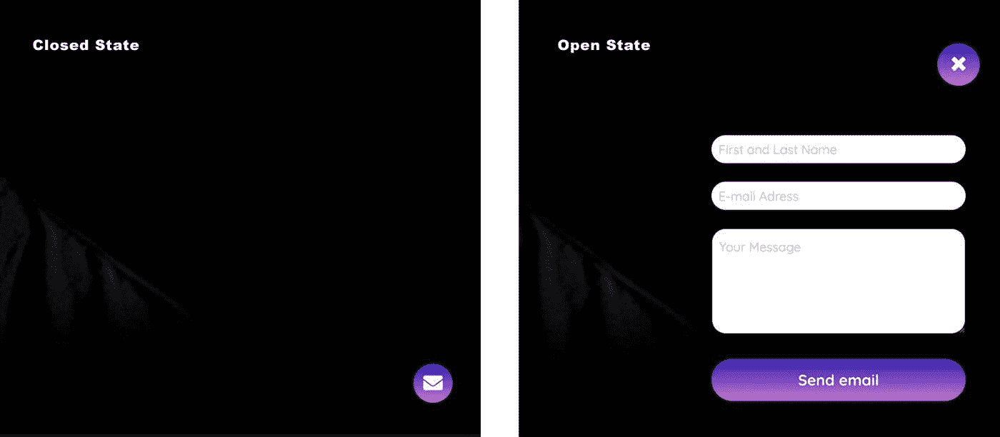

# 如何在 Gatsby.js 中用本地状态保持页面之间的状态

> 原文：<https://www.freecodecamp.org/news/keeping-state-between-pages-with-local-state-in-gatsby-js/>

> 安娜斯·阿尔尚蒂在 T2 Unsplash 的封面照片

## **【问题】**

当使用静态站点生成器 Gatsby 时，您没有基本的“应用程序”组件可以使用。也就是说，没有一个组件包装你的整个应用程序，你可以把你的状态保存在路由/页面之间。Gatsby.js 自动(还是自动地？)创建到您放在安装页面文件夹中的页面的路径。或者，您可以从您的 ****gatsby-node.js**** 文件以编程方式创建页面。

举例来说，如果我们需要一个菜单，这个菜单应该是可见的，并且可以在我们所有的页面路径上交互，这会给我们带来麻烦。在我的例子中，我有一个邮件表单菜单，它可以显示或隐藏在应用程序的右下角。这个组件有一个本地状态，它将决定组件是否被显示。下图显示了关闭和打开的菜单。



所以…这是我们的问题。我们如何解决这个问题？有很多方法可以解决这个问题，但有一种方法，也是我采用的方法，描述如下。

## **解决方案**

我就开门见山了。Gatsby 有一个名为 ****gatsby-browser.js 的文件，我们可以使用这个文件让组件包裹我们完整的应用程序和页面！****

这太棒了！

这个文件让我们可以使用 Gatsby ****浏览器 API。**** 这个 API 包含了几个有用的函数，但是有一个特别适合我们的需求。它叫做 ****wrapPageElement。**** 查看下面的代码。这是我为客户的应用程序使用的实际代码。

```
// gatsby-browser.js
// Import the component at the top of the file
import MailWidgetWrapper from './src/components/MailWidgetWrapper';

export const wrapPageElement = ({ element, props }) => (
  <MailWidgetWrapper {...props}>{element}</MailWidgetWrapper>
);
```

在这里，我创建了一个包装器组件，它将在 Gatsby 中的所有路线和页面上可用。太棒了。这正是我们所需要的。 ****包装器组件**** 如下所示:

```
// MailWidgetWrapper.js
import React from 'react';

import MailWidget from './MailWidget';

const MailWidgetWrapper = ({ children }) => (
  <>
    {children}
    <MailWidget />
  </>
);

export default MailWidgetWrapper;
```

这是一个非常简单的 React 组件，它唯一的功能是包装我们的应用程序，并为它提供 MailWidget 组件。但是 ****wrapPageElement**** 是如何工作的呢？

## wrapppageelement

首先，我也强烈推荐尽可能多地使用 gatsbyjs.org 来寻找任何关于盖茨比的答案。这个网站很棒，对你将会遇到的大多数问题都有很好很透彻的解释。

在我们的例子中，如果你看看上面的代码，我们有两个参数是在`wrapPageElement`回调函数中为我们创建的: ****元素和道具。****

如果你使用 React，你应该对道具很熟悉，所以它们不需要更多的介绍。在这种情况下，道具被我们当前所在的页面使用。我们不需要使用这些道具中的任何一个，因为我们只需要使用儿童(由 React 自动创建)道具。

`MailWidgetWrapper`只是渲染孩子和`MailWidget`。子页面是我们从****Gatsby-browser . js****文件发送到`MailWidgetWrapper`组件的页面，如下所示。实际的页面位于 ****元素**** 参数中，这就是我们用表达式`{element}`发送的页面。

```
<MailWidgetWrapper {…props}>{element}</MailWidgetWrapper>
```

所以简而言之，我们从`wrapPageElement`得到的参数可以总结为:

****道具参数是我们所在的实际页面的道具。元素参数是我们现在所在的页面****

## MailWidget 组件

我实际的`MailWidget`组件相当大，有很多与此无关的代码。这就是为什么我在下面向您展示一个简单的`MailWidget`组件的搭建示例版本。这个组件实际上与解释`wrapPageElement`函数的任务无关。

该组件实际上可以是您喜欢的任何东西，与上面的实现无关。对我来说是一个`MailWidget`。这完全取决于您，以及您需要哪些有状态组件在您的所有页面路由上可用。

```
// MailWidget.js
import React, { useState } from 'react';

const MailWidget = () => {
  const [isVisible, setIsVisible] = useState(false);

  const toggleVisible = () => {
    setIsVisible(!isVisible);
  };

  return (
    <div className={isVisible ? 'visible' : ''}>
      <button type="button" onClick={toggleVisible}>
        Hide/Show MailWidget
      </button>
      <h1>Hello, I'm your mailwidget</h1>
    </div>
  );
};
export default MailWidget;
```

顺便说一句，我完全同意。我喜欢钩子，并将在 React 中的所有动作中使用它们！这就是为什么我在这里用`useState`钩子创建了我的状态。上面的组件只是使用一个本地状态来决定它是否应该显示自己。

## 结论

你有它！希望您已经了解到，在 Gatsby 中，让组件在页面之间保持状态并不困难。我们都喜欢盖茨比，不是吗？？

另外，感谢你阅读这篇文章。我是一名来自瑞典的开发人员，热爱教学和编码。我还在网上开设了 React 和 Gatsby 课程。你可以在 Udemy 上找到我。只需在 Twitter 上搜索 Thomas Weibenfalk 或帮我联系一下 ****@weibenfalk****
我也有一个 Youtube 频道是我教的免费东西，在这里查看一下[](https://www.youtube.com/channel/UCnnnWy4UTYN258FfVGeXBbg)****。****